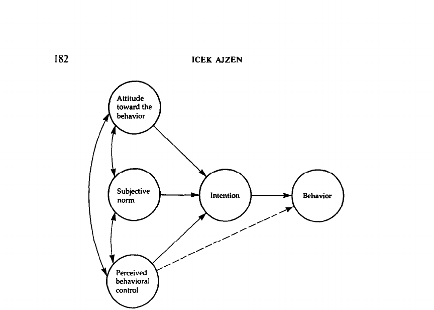

# The Theory of Planned Behavior

> **Nature Reader 状态：结构化重建稿（机器译文底稿，未完成人工逐句审校）**
>
> 原始文件：`消费者回收行为与意愿\The Theory of Planned Behavior.pdf`  
> 来源：Organizational Behavior and Human Decision Processes（1991）  
> 文献类型：theory/review  
> 总页数：33

## 阅读索引

以下页码链接指向该页第一个可提取文本块；没有可提取文本的页面会保留页码但不生成块链接。

[p.1](#s001) · [p.2](#s010) · [p.3](#s022) · [p.4](#s032) · p.5 · p.6 · [p.7](#s040) · [p.8](#s061) · [p.9](#s070) · p.10 · p.11 · p.12 · p.13 · p.14 · p.15 · p.16 · p.17 · [p.18](#s075) · p.19 · [p.20](#s094) · p.21 · p.22 · p.23 · p.24 · p.25 · p.26 · p.27 · p.28 · p.29 · [p.30](#s131) · [p.31](#s243) · [p.32](#s254) · [p.33](#s267)

## 术语表

| Canonical term | 中文 | 统一规则 |
|---|---|---|
| theory of planned behavior (TPB) | 计划行为理论（TPB） | 全文统一使用 TPB |
| behavioral intention | 行为意向 | 不与实际行为混用 |
| attitude toward the behavior | 行为态度 | TPB 前因变量 |
| subjective norm | 主观规范 | TPB 前因变量 |
| perceived behavioral control (PBC) | 感知行为控制（PBC） | 首次出现给出全称 |

## 全文中英对照

## Page 1

**Source:** p.1 S001 · extraction confidence: high

**Original:** ORGANIZATIONAL BEHAVIOR AND HUMAN DECISION PROCESSES 50, 179-211 (1991) The Theory of Planned Behavior ICEK AJZEN University of Massachusetts at Amherst Research dealing with various aspects of the theory of planned behavior (Ajzen, 1985, 1987)is reviewed, and some unresolved issues are discussed.

**中文:** 组织行为和人类决策过程 50, 179-211 (1991) 计划行为理论 ICEK AJZEN 马萨诸塞大学阿默斯特分校研究计划行为理论的各个方面 (Ajzen, 1985, 1987) 进行了回顾，并讨论了一些未解决的问题。

**Source:** p.1 S002 · extraction confidence: high

**Original:** In broad terms, the theory is found to be well supported by empirical evidence. Intentions to perform behaviors of different kinds can be predicted with high accuracy from attitudes toward the behavior, subjective norms, and perceived behavioral control; and these intentions, together with perceptions of behavioral control, account for considerable variance in actual behavior.

**中文:** 从广义上讲，该理论得到了经验证据的充分支持。 通过对行为的态度、主观规范和感知的行为控制，可以高精度地预测执行不同类型行为的意图；这些意图与行为控制的感知一起解释了实际行为的巨大差异。

**Source:** p.1 S003 · extraction confidence: high

**Original:** Attitudes, subjective norms, and perceived behavioral control are shown to be related to appropriate sets of salient behavioral, normative, and control beliefs about the behavior, but the exact nature of these relations is still uncertain.

**中文:** 态度、主观规范和感知的行为控制被证明与关于行为的适当的显着行为、规范和控制信念相关，但这些关系的确切性质仍然不确定。

**Source:** p.1 S004 · extraction confidence: high

**Original:** Expectancyvalue formulations are found to be only partly successful in dealing with these relations. Optimal rescahng of expectancy and value measures is offered as a means of dealing with measurement limitations.

**中文:** 预期人们发现，价值表述在处理这些关系方面只取得了部分成功。 提供期望和价值测量的最佳重新调整作为处理测量限制的一种手段。

**Source:** p.1 S005 · extraction confidence: high

**Original:** Finally, inclusion of past behavior in the prediction equation is shown to provide a means of testing the theory's sufficiency, another issue that remains unresolved. The limited available evidence concerning this question shows that the theory is predicting behavior quite well in comparison to the ceiling imposed by behavioral reliability.

**中文:** 最后，将过去的行为纳入预测方程被证明提供了一种测试理论充分性的方法，这是另一个尚未解决的问题。 关于这个问题的有限可用证据表明，与行为可靠性所施加的上限相比，该理论可以很好地预测行为。 能力。

**Source:** p.1 S006 · extraction confidence: high

**Original:** 0 1991 Academic Press, Inc. As every student of psychology knows, explaining human behavior in all its complexity is a difficult task. It can be approached at many levels, from concern with physiological processes at one extreme to concentration on social institutions at the other.

**中文:** 0 1991 学术出版社 每个心理学专业的学生都知道，解释人类行为的复杂性是一项艰巨的任务。 它可以在多个层面上进行探讨，从关注一个极端的生理过程到关注另一个极端的社会制度。

**Source:** p.1 S007 · extraction confidence: high

**Original:** Social and personality psychologists have tended to focus on an intermediate level, the fully functioning individual whose processing of available information mediates the effects of biological and environmental factors on behavior.

**中文:** 社会和人格心理学家倾向于关注中间层次，即功能齐全的个体，其对可用信息的处理调节生物和环境因素对行为的影响。

**Source:** p.1 S008 · extraction confidence: high

**Original:** Concepts referring to behavioral dispositions, such as social attitude and personality trait, have played an important role in these attempts to predict and explain human behavior (see Ajzen, 1988; Campbell, 1963; Sherman & Fazio, 1983). Various theoretical frameworks have been proposed to deal with the psychological processes involved.

**中文:** 概念参考 行为倾向，例如社会态度和人格特质，在这些预测和解释人类行为的尝试中发挥了重要作用（参见 Ajzen，1988；Campbell，1963；Sherman 和 Fazio， 1983）。人们提出了各种理论框架来解决 所涉及的心理过程。

**Source:** p.1 S009 · extraction confidence: high

**Original:** This special edition of Organizational Behavior and Human Decision Processes concentrates on cogniI am very grateful to Nancy DeCourville, Richard Netemeyer, Michelle van Ryn, and Amiram Vinokur for providing unpublished data sets for reanalysis, and to Edwin Locke for his comments on an earlier draft of this article.

**中文:** 这本《组织行为和人类决策过程》特别版重点关注认知。我非常感谢 Nancy DeCourville、Richard Netemeyer、Michelle van Ryn 和 Amiram Vinokur 提供未发表的数据集进行重新分析，并感谢 Edwin Locke 对本文早期草稿的评论。

## Page 2

**Source:** p.2 S010 · extraction confidence: low

**Original:** Address correspondence and reprint requests to Icek Ajzen, Department of Psychology, University of Massachusetts, Amherst, MA Copyright 0 1991 by Academic Press, Inc. All rights of reproduction in any form reserved.

**中文:** 向马萨诸塞州阿默斯特马萨诸塞大学心理学系 Icek Ajzen 发送信件和重印请求 版权所有 0 1991 学术出版社 保留以任何形式复制的所有权利。

**Source:** p.2 S011 · extraction confidence: high

**Original:** 180 ICEK AJZEN

**中文:** 第180章

**Source:** p.2 S012 · extraction confidence: high

**Original:** tive self-regulation as an important aspect of human behavior. In the pages below I deal with cognitive self-regulation in the context of a dispositional approach to the prediction of behavior.

**中文:** 自我调节作为人类行为的一个重要方面。 在下面几页中，我将在行为预测的倾向方法的背景下讨论认知自我调节。

**Source:** p.2 S013 · extraction confidence: high

**Original:** A brief examination of past efforts at using measures of behavioral dispositions to predict behavior is followed by presentation of a theoretical model-the theory of planned behavior-in which cognitive self-regulation plays an important part.

**中文:** 对过去使用行为倾向测量来预测行为的努力进行了简要审查，然后提出了一个理论模型——计划行为理论——其中认知自我调节发挥着重要作用。

**Source:** p.2 S014 · extraction confidence: high

**Original:** Recent research findings concerning various aspects of the theory are discussed, with particular emphasis on unresolved issues. DISPOSITIONAL PREDICTION OF HUMAN BEHAVIOR Much has been made of the fact that general dispositions tend to be poor predictors of behavior in specific situations.

**中文:** 关于该理论各个方面的最新研究成果 进行讨论，特别强调未解决的问题。 对人类行为的性格预测 人们普遍认为，一般性格往往不能很好地预测特定情况下的行为。

**Source:** p.2 S015 · extraction confidence: high

**Original:** General attitudes have been assessedwith respect to organizations and institutions (the church, public housing, student government, one's job or employer), minority groups (Blacks, Jews, Catholics), and particular individuals with whom a person might interact (a Black person, a fellow student).

**中文:** 对组织和机构（教堂、公共住房、学生会、工作或雇主）、少数群体（黑人、犹太人、天主教徒）以及可能与之互动的特定个人（黑人、同学）的总体态度进行了评估。

**Source:** p.2 S016 · extraction confidence: high

**Original:** (See Ajzen & Fishbein, 1977, for a literature review.) The failure of such general attitudes to predict specific behaviors directed at the target of the attitude has produced calls for abandoning the attitude concept (Wicker, 1969).

**中文:** （参见阿杰森和 Fishbein，1977，文献综述。）这种一般态度无法预测针对态度目标的特定行为，因此有人呼吁放弃态度概念（Wicker，1969）。

**Source:** p.2 S017 · extraction confidence: high

**Original:** In a similar fashion, the low empirical relations between general personality traits and behavior in specific situations has led theorists to claim that the trait concept, defined as a broad behavior disposition, is untenable (Mischel, 1968).

**中文:** 以类似的方式，一般人格特质和特定情况下的行为之间的低经验关系导致理论学家声称，定义为广泛的行为倾向的特质概念是站不住脚的（Mischel，1968）。

**Source:** p.2 S018 · extraction confidence: high

**Original:** Of particular interest for present purposes are attempts to relate generalized locus of control (Rotter, 1954, 1966)to behaviors in specific contexts. As with other personality traits, the results have been disappointing.

**中文:** 目前特别感兴趣的是尝试将广义控制点（Rotter，1954，1966）与特定环境中的行为联系起来。 与其他人格特质一样，结果令人失望。

**Source:** p.2 S019 · extraction confidence: high

**Original:** For example, perceived locus of control, as assessedby Rotter's scale, often fails to predict achievement-related behavior (see Warehime, 1972) or political involvement (see Levenson, 1981)in a systematic fashion; and somewhat more specialized measures, such as health-locus of control and achievement-related locus of control, have not fared much better (see Lefcourt, 1982; Wallston & Wallston, One proposed remedy for the poor predictive validity of attitudes and traits is the aggregation of specific behaviors across occasions, situations, and forms of action (Epstein, 1983; Fishbein & Ajzen, 1974).

**中文:** 例如，感知控制点，如 根据 Rotter 的量表进行评估，通常无法预测与成就相关的行为（参见 Warehime，1972）或政治参与（参见 Levenson， 1981）以系统的方式；以及更专业的措施， 例如健康控制点和与成就相关的控制点，也没有表现得更好（参见 Lefcourt，1982；Wallston & Wallston， 针对态度和特征的预测有效性较差的一种建议补救措施是跨场合、情况和行动形式的特定行为的聚合（Epstein，1983；Fishbein 和 Ajzen，1974）。

**Source:** p.2 S020 · extraction confidence: high

**Original:** The idea behind the principle of aggregation is the assumption that any single sample of behavior reflects not only the influence of a relevant general disposition, but also the influence of various other factors unique to the particular occasion, situation, and action being observed.

**中文:** 聚合原则背后的思想是这样的假设：任何单个行为样本不仅反映了相关一般倾向的影响，而且还反映了所观察到的特定场合、情况和行动所特有的各种其他因素的影响。

**Source:** p.2 S021 · extraction confidence: high

**Original:** By aggregating different behaviors, observed on different occasions and in different situations, these other sources of influence tend to cancel each other, with the result that the aggregate represents a more valid measure of the underlying behavioral disposition than any single behavior.

**中文:** 通过聚合 在不同场合和不同情况下观察到的不同行为，这些其他影响源往往会相互抵消，其结果是，总体比任何单一行为更能有效地衡量潜在的行为倾向。

## Page 3

**Source:** p.3 S022 · extraction confidence: medium

**Original:** Many studies THEORY OF PLANNED BEHAVIOR 181 performed in recent years have demonstrated the workings of the aggregation principle by showing that general attitudes and personality traits do in fact predict behavioral aggregates much better than they predict specific behaviors.

**中文:** 近年来进行的许多计划行为理论 181 的研究证明了聚合原理的运作，表明一般态度和人格特质实际上对行为聚合的预测效果比它们对特定行为聚合的预测效果要好得多。 具体行为。

**Source:** p.3 S023 · extraction confidence: high

**Original:** (See Ajzen, 1988, for a discussion of the aggregation principle and for a review of empirical research.) ACCOUNTING FOR ACTIONS IN SPECIFIC CONTEXTS: THE THEORY OF PLANNED BEHAVIOR The principle of aggregation, however, does not explain behavioral variability across situations, nor does it permit prediction of a specific behavior in a given situation.

**中文:** （有关聚合原则的讨论和实证研究的回顾，请参见 Ajzen，1988。） 解释特定环境中的行动：计划行为理论 然而，聚合原则并不能解释不同情况下的行为变异性，也不允许预测给定情况下的特定行为。

**Source:** p.3 S024 · extraction confidence: high

**Original:** It was meant to demonstrate that general attitudes and personality traits are implicated in human behavior, but that their influence can be discerned only by looking at broad, aggregated, valid samples of behavior.

**中文:** 它的目的是证明一般态度和个性特征与人类行为有关，但它们的影响只能通过广泛的、聚合的、 有效的行为样本。

**Source:** p.3 S025 · extraction confidence: high

**Original:** Their influence on specific actions in specific situations is greatly attenuated by the presence of other, more immediate factors. Indeed, it may be argued that broad attitudes and personality traits have an impact on specific behaviors only indirectly by influencing some of the factors that are more closely linked to the behavior in question (see Ajzen & Fishbein, 1980,Chap.

**中文:** 它们对特定情况下特定行动的影响因其他更直接因素的存在而大大减弱。 事实上，人们可能会认为，广泛的态度和人格特质只是通过影响与所讨论的行为更密切相关的一些因素来间接地对特定行为产生影响（参见 Ajzen 和 Fishbein，1980 年，第 1 章）。

**Source:** p.3 S026 · extraction confidence: high

**Original:** The present article deals with the nature of these behavior-specific factors in the framework of the theory of planned behavior, a theory designed to predict and explain human behavior in specific contexts.

**中文:** 本文在以下框架中讨论了这些行为特定因素的性质： 计划行为理论，旨在预测和解释特定背景下人类行为的理论。

**Source:** p.3 S027 · extraction confidence: high

**Original:** Because the theory of planned behavior is described elsewhere (Ajzen, 1988), only brief summaries of its various aspects are presented here. Relevant empirical findings are considered as each aspect of the theory is discussed.

**中文:** 由于计划行为理论已在其他地方描述过（Ajzen，1988），因此这里仅对其各个方面进行简要总结。 在讨论理论的各个方面时，都会考虑相关的实证研究结果。

**Source:** p.3 S028 · extraction confidence: high

**Original:** Predicting Behavior: Intentions and Perceived Behavioral Control The theory of planned behavior is an extension of the theory of reasoned action (Ajzen & Fishbein, 1980; Fishbein & Ajzen, 1975) made necessary by the original model's limitations in dealing with behaviors over which people have incomplete volitional control.

**中文:** 预测行为：意图和感知行为控制 计划行为理论是理性行动理论的延伸（Ajzen & Fishbein，1980；Fishbein & Ajzen，1975），由于原始模型在处理人们无法完全控制意志的行为时存在局限性，因此有必要进行计划行为理论的扩展。

**Source:** p.3 S029 · extraction confidence: high

**Original:** Figure 1 depicts the theory in the form of a structural diagram. For ease of presentation, possible feedback effects of behavior on the antecedent variables are not shown.

**中文:** 图 1 以结构图的形式描述了该理论。 为了便于演示，未显示行为对先行变量可能的反馈影响。

### Fig. 1. 图 1 以结构图的形式描述了该理论。 为了便于演示，未显示行为对先行变量可能的反馈影响。

**Placed near:** p.4 S029  
**Source:** p.4 S029  
**Crop confidence:** approximate-object-bounded

**Original caption:** FIG. 1. Theory of planned behavior.

**中文图注:** 图 1 以结构图的形式描述了该理论。 为了便于演示，未显示行为对先行变量可能的反馈影响。

**Reading note:** 自动裁剪以图注为定位依据；正式引用图中数值前请对照原 PDF 检查裁剪边界与坐标轴。

**Source:** p.3 S030 · extraction confidence: high

**Original:** As in the original theory of reasoned action, a central factor in the theory of planned behavior is the individual's intention to perform a given behavior. Intentions are assumed to capture the motivational factors that influence a behavior; they are indications of how hard people are willing to try, of how much of an effort they are planning to exert, in order to perform the behavior.

**中文:** 与最初的理性行动理论一样，计划行为理论的一个核心因素是个人执行特定行为的意图。 假设意图捕捉影响行为的动机因素；它们表明人们愿意付出多大的努力，以及他们计划付出多大的努力来执行该行为。

**Source:** p.3 S031 · extraction confidence: high

**Original:** As a general rule, the stronger the intention to engagein a behavior, the more likely should be its performance. It should be clear, however, that a behavioral intention can lind expression in behavior only if the behavior in question is under volitional control, i.e.,

**中文:** 一般来说，从事某种行为的意图越强烈，该行为的表现就越有可能。 应该 然而，要明确的是，只有当相关行为受到意志控制时，行为意图才能在行为中表达出来，即：

## Page 4

**Source:** p.4 S032 · extraction confidence: high

**Original:** 182 ICEK AIZEN

**中文:** 第182章

**Source:** p.4 S033 · extraction confidence: low

**Original:** FIG.

**中文:** 图。

**Source:** p.4 S034 · extraction confidence: high

**Original:** Theory of planned behavior. if the person can decide at will to perform or not perform the behavior. Although some behaviors may in fact meet this requirement quite well, the performance of most depends at least to some degree on such nonmotivational factors as availability of requisite opportunities and resources (e.g., time, money, skills, cooperation of others; seeAjzen, 1985, for a discussion).

**中文:** 计划行为理论。如果该人可以随意决定执行或不执行该行为。 尽管某些行为实际上可能很好地满足了这一要求，但大多数行为的表现至少在某种程度上取决于非动机因素，例如必要机会和资源的可用性（例如，时间、金钱、技能、他人的合作；参见 Ajzen，1985 年的讨论）。

**Source:** p.4 S035 · extraction confidence: high

**Original:** Collectively, these factors represent people's actual control over the behavior. To the extent that a person has the required opportunities and resources, and intends to perform the behavior, he or she should succeed in doing so.' The idea that behavioral achievement depends jointly on motivation (intention) and ability (behavioral control) is by no means new.

**中文:** 总的来说，这些因素代表了人们对行为的实际控制。 只要一个人具备所需的条件 机会和资源，并打算执行该行为，他或她应该成功地这样做。行为成就共同取决于动机（意图）和能力（行为控制）的观点绝不是新的。

**Source:** p.4 S036 · extraction confidence: high

**Original:** It constitutes the basis for theorizing on such diverse issues as animal learning (Hull, 1943), level of aspiration (Lewin, Dembo, Festinger, & Sears, r The original derivation of the theory of planned behavior (Ajzen, 1985)defined intention (and its other theoretical constructs) in terms of trying to perform a given behavior rather than in relation to actual performance.

**中文:** 它构成了对诸如动物学习（Hull，1943）、愿望水平（Lewin、Dembo、Festinger 和 Sears，r）等不同问题进行理论化的基础。计划行为理论的原始推导（Ajzen，1985）将意图（及其其他理论结构）定义为试图执行给定的行为，而不是尝试执行给定的行为。 与实际表现相比。

**Source:** p.4 S037 · extraction confidence: high

**Original:** However, early work with the model showed strong correlations between measures of the model's variables that asked about trying to perform a given behavior and measures that dealt with actual performance of the behavior (Schifter & Ajzen, 1985; Ajzen & Madden, 1986).

**中文:** 然而，该模型的早期研究表明，模型变量的测量（询问是否尝试执行给定行为）与处理行为实际表现的测量之间存在很强的相关性（Schifter & Ajzen，1985；Ajzen & Madden，1986）。

**Source:** p.4 S038 · extraction confidence: high

**Original:** Since the latter measures are less cumbersome, they have been used in subsequent research, and the variables are now defined more simply in relation to behavioral performance.

**中文:** 由于后者的测量不太麻烦，因此已在后续研究中使用，并且现在根据行为表现更简单地定义变量。

**Source:** p.4 S039 · extraction confidence: high

**Original:** See, however, Bagozzi and Warshaw (1990,in press) for work on the concept of trying to attain a behavioral goal.

**中文:** 然而，参见 Bagozzi 和 Warshaw（1990 年，印刷中） 致力于尝试实现行为目标的概念。

## Page 7

**Source:** p.7 S040 · extraction confidence: medium

**Original:** THEORY OF PLANNED BEHAVIOR 183

**中文:** 计划行为理论 183

**Source:** p.7 S041 · extraction confidence: low

**Original:** 1944),performance on psychomotor and cognitive tasks (e.g., Fleishman, 1958; Locke, 1965; Vroom, 1964), and person perception and attribution (e.g., Heider, 1944;Anderson, 1974).It has similarly been suggested that some conception of behavioral control be included in our more general models of human behavior, conceptions in the form of "facilitating factors" (Triandis, 1977), "the context of opportunity" (Sarver, 1983), "resources" (Liska, 1984), or "action control" (Kuhl, 1985).

**中文:** 1944），精神运动和认知任务的表现（例如，Fleishman， 1958；洛克，1965； Vroom，1964），以及人的感知和归因 （例如，Heider，1944；Anderson，1974）。类似地，有人建议将一些行为控制的概念纳入我们更一般的人类行为模型中，这些概念以“促进因素”（Triandis，1977）、“机会背景”（Sarver，1983）、“资源”（Liska，1984）或“行动控制”的形式存在。 （库尔，1985）。

**Source:** p.7 S042 · extraction confidence: low

**Original:** The assumption is usually made that motivation and ability interact in their effects on behavioral achievement. Thus, intentions would be expected to influence performance to the extent that the person has behavioral control, and performance should increase with behavioral control to the extent that the person is motivated to try.

**中文:** 通常假设动机和能力在对行为成就的影响中相互作用。 因此，如果一个人有行为控制，意图就会影响绩效。 控制，并且绩效应该随着行为控制而提高，直到人们有动力去尝试。

**Source:** p.7 S043 · extraction confidence: low

**Original:** Interestingly, despite its intuitive plausibility, the interaction hypothesis has received only limited empirical support (seeLocke, Mento, & Katcher, 1978).We will return to this issue below.

**中文:** 有趣的是，尽管直观上合理，相互作用假说只得到了有限的实证支持（参见Locke、Mento 和 Katcher，1978）。我们将在下面回到这个问题。

**Source:** p.7 S044 · extraction confidence: low

**Original:** Perceived behavioral control. The importance of actual behavioral control is self evident: The resources and opportunities available to a person must to some extent dictate the likelihood of behavioral achievement.

**中文:** 感知行为控制。 实际行为控制的重要性是不言而喻的：一个人可用的资源和机会必须在某种程度上决定行为成就的可能性。

**Source:** p.7 S045 · extraction confidence: low

**Original:** Of greater psychological interest than actual control, however, is the perception of behavioral control and is impact on intentions and actions. Perceived behavioral control plays an important part in the theory of planned behavior.

**中文:** 然而，比实际控制更具有心理意义的是行为控制的感知以及对意图和行动的影响。 感知行为控制在计划行为理论中起着重要作用。

**Source:** p.7 S046 · extraction confidence: low

**Original:** In fact, the theory of planned behavior differs from the theory of reasoned action in its addition of perceived behavioral control. Before considering the place of perceived behavioral control in the prediction of intentions and actions, it is instructive to compare this construct to other conceptions of control.

**中文:** 事实上，计划行为理论与理性行动理论的不同之处在于它增加了感知行为控制。 在考虑感知行为控制在意图和行动预测中的地位之前，将这种结构与其他控制概念进行比较是有启发性的。

**Source:** p.7 S047 · extraction confidence: low

**Original:** Importantly, perceived behavioral control differs greatly from Rotter's (1966) concept of perceived locus of control. Consistent with an emphasis on factors that are directly linked to a particular behavior, perceived behavioral control refers to people's perception of the ease or difficulty of performing the behavior of interest.

**中文:** 重要的是，感知行为控制与 Rotter（1966）的感知控制源概念有很大不同。 与强调与特定行为直接相关的因素相一致，感知行为控制是指人们对执行感兴趣行为的难易程度的感知。

**Source:** p.7 S048 · extraction confidence: low

**Original:** Whereas locus of control is a generalized expectancy that remains stable across situations and forms of action, perceived behavioral control can, and usually does, vary across situations and actions.

**中文:** 虽然控制源是一种普遍的预期，在不同情况和行动形式中保持稳定，但感知的行为控制可以而且通常确实会因情况和行动而变化。

**Source:** p.7 S049 · extraction confidence: low

**Original:** Thus, a person may believe that, in general, her outcomes are determined by her own behavior (internal locus of control), yet at the same time she may also believe that her chances of becoming a commercial airplane pilot are very slim (low perceived behavioral control).

**中文:** 因此，一个人可能认为，一般来说，她的结果是由她自己的行为（内部控制源）决定的，但同时她也可能认为她成为一名商用飞机飞行员的机会非常渺茫（感知行为控制低）。

**Source:** p.7 S050 · extraction confidence: low

**Original:** Another approach to perceived control can be found in Atkinson's (1964) theory of achievement motivation. An important factor in this theory is the expectancy of success, defined as the perceived probability of succeeding at a given task.

**中文:** 另一种感知控制的方法可以在阿特金森（Atkinson，1964）的成就动机理论中找到。 该理论中的一个重要因素是成功预期，定义为在给定任务中成功的感知概率。

**Source:** p.7 S051 · extraction confidence: low

**Original:** Clearly, this view is quite similar to perceived behavioral control in that it refers to a specific behavioral context and not to a generalized predisposition. Somewhat paradoxically, the motive to

**中文:** 显然，这种观点与感知行为控制非常相似，因为它指的是特定的行为背景，而不是普遍的倾向。 有点自相矛盾的是，这样做的动机

**Source:** p.7 S052 · extraction confidence: low

**Original:** 184 ICEK AlZEN

**中文:** 第184章

**Source:** p.7 S053 · extraction confidence: low

**Original:** achieve success is defined not as a motive to succeed at a given task but in terms of a general disposition "which the individual carries about him from one situation to another" (Atkinson, 1964, p.

**中文:** 取得成功不是被定义为在特定任务上取得成功的动机，而是根据“个人从一种情况转移到另一种情况”的一般倾向（Atkinson，1964，第 17 页）。

**Source:** p.7 S054 · extraction confidence: low

**Original:** This general achievement motivation was assumed to combine multiplicatively with the situational expectancy of success as well as with another situationspecific factor, the "incentive value" of success.

**中文:** 这种一般的成就动机被认为与成功的情境预期以及另一个情境特定因素（成功的“激励价值”）相乘。

**Source:** p.7 S055 · extraction confidence: low

**Original:** The present view of perceived behavioral control, however, is most compatible with Bandura's (1977, 1982)concept of perceived self-efficacy which "is concerned with judgments of how well one can execute courses of action required to deal with prospective situations" (Bandura, 1982,p.

**中文:** 然而，目前感知行为控制的观点与班杜拉（Bandura，1977，1982）的感知自我效能感概念最为一致，该概念“涉及对一个人能够在多大程度上执行处理预期情况所需的行动方案的判断”（Bandura，1982，p.11）。

**Source:** p.7 S056 · extraction confidence: low

**Original:** 122).Much of our knowledge about the role of perceived behavioral control comes from the systematic research program of Bandura and his associates (e.g., Bandura, Adams, & Beyer, 1977; Bandura, Adams, Hardy, & Howells, 1980).These investigations have shown that people's behavior is strongly influenced by their confidence in their ability to perform it (i.e., by perceived behavioral control).

**中文:** 122).我们对感知行为欺骗的作用有很多了解 控制来自 Bandura 及其同事的系统研究计划（例如，Bandura、Adams 和 Beyer，1977；Bandura、Adams、Hardy 和 Howells，1980）。这些调查表明，人们的行为很大程度上受到他们对其执行能力的信心（即感知的行为控制）的影响。

**Source:** p.7 S057 · extraction confidence: low

**Original:** Self-efficacy beliefs can influence choice of activities, preparation for an activity, effort expended during performance, as well as thought patterns and emotional reactions (see Bandura, 1982, 1991).

**中文:** 自我效能信念可以影响活动的选择、活动的准备、表演期间所付出的努力，以及思维模式和情绪反应（参见 Bandura，1982，1991）。

**Source:** p.7 S058 · extraction confidence: low

**Original:** The theory of planned behavior places the construct of self-efficacy belief or perceived behavioral control within a more general framework of the relations among beliefs, attitudes, intentions, and behavior.

**中文:** 计划行为理论将 在信念、态度、意图和行为之间的关系的更一般框架内构建自我效能信念或感知的行为控制。

**Source:** p.7 S059 · extraction confidence: low

**Original:** According to the theory of planned behavior, perceived behavioral control, together with behavioral intention, can be used directly to predict behavioral achievement. At least two rationales can be offered for this hypothesis.

**中文:** 根据计划行为理论，感知的行为控制与行为意图一起可以直接预测行为成就。 至少可以为这一假设提供两个理由。

**Source:** p.7 S060 · extraction confidence: low

**Original:** First, holding intention constant, the effort expended to bring a course of behavior to a successful conclusion is likely to increase with perceived behavioral control. For instance, even if two individuals have equally strong intentions to learn to ski, and both try to do so, the person who is confident that he can master this activity is more likely to persevere than is the person who doubts his ability.2 The second reason for expecting a direct link between perceived behavioral control and behavioral achievement is that perceived behavioral control can often be used as a substitute for a measure of actual control.

**中文:** 首先，保持意图不变，为使一系列行为取得成功而付出的努力可能会随着时间的推移而增加 感知的行为控制。 例如，即使两个人有同样强烈的学习滑雪的意图，并且都尝试这样做，有信心自己能够掌握这项活动的人比怀疑自己能力的人更有可能坚持下去。2期望感知行为控制和行为成就之间存在直接联系的第二个原因是，感知行为控制通常可以用作实际控制措施的替代品。

## Page 8

**Source:** p.8 S061 · extraction confidence: low

**Original:** Whether a measure of perceived behavioral control can substitute for a measure of actual control depends, of course, on the accuracy of the perceptions. Perceived behavioral control may not be particularly realistic when a person has * It may appear that the individual with high perceived behavioral control should also have a stronger intention to learn skiing than the individual with low perceived control.

**中文:** 是否衡量 感知行为控制能否替代实际控制措施当然取决于感知的准确性。 当一个人有以下行为时，感知行为控制可能不是特别现实。 * 感知行为控制高的个体可能比感知控制低的个体更有学习滑雪的意图。

**Source:** p.8 S062 · extraction confidence: low

**Original:** However, as we shall see below, intentions are influenced by additional factors, and it is because of these other factors that two individuals with different perceptions of behavioral control can have equally strong intentions.

**中文:** 然而，正如我们将在下面看到的，意图受到其他因素的影响，正是由于这些其他因素，对行为控制有不同看法的两个人才能具有同样强烈的意图。

**Source:** p.8 S063 · extraction confidence: low

**Original:** THEORY OF PLANNED BEHAVIOR 185 relatively little information about the behavior, when requirements or available resources have changed, or when new and unfamiliar elements have entered into the situation.

**中文:** 计划行为理论 185 当需求或可用资源发生变化，或者当新的和不熟悉的元素进入情况时，有关行为的信息相对较少。

**Source:** p.8 S064 · extraction confidence: low

**Original:** Under those conditions, a measure of perceived behavioral control may add little to accuracy of behavioral prediction. However, to the extent that perceived control is realistic, it can be used to predict the probability of a successful behavioral attempt (Ajzen, 1985).

**中文:** 在这些条件下，感知行为控制的测量可能不会增加行为预测的准确性。 然而，在感知控制是现实的情况下，它可以用来预测成功行为尝试的概率（Ajzen，1985）。

**Source:** p.8 S065 · extraction confidence: low

**Original:** Predicting Behavior: Empirical Findings According to the theory of planned behavior, performance of a behavior is ajoint function of intentions and perceived behavioral control.

**中文:** 预测行为：实证结果根据计划行为理论，行为的表现是意图和感知行为控制的联合函数。

**Source:** p.8 S066 · extraction confidence: low

**Original:** For accurate prediction, several conditions have to be met. First, the measures of intention and of perceived behavioral control must correspond to (Ajzen & Fishbein, 1977)or be compatible with (Ajzen, 1988)the behavior that is to be predicted.

**中文:** 为了准确预测，必须满足几个条件。 首先，意图和感知行为控制的测量必须与要预测的行为相对应（Ajzen＆Fishbein，1977）或兼容（Ajzen，1988）。

**Source:** p.8 S067 · extraction confidence: low

**Original:** That is, intentions and perceptions of control must be assessedin relation to the particular behavior of interest, and the specified context must be the same as that in which the behavior is to occur.

**中文:** 也就是说，必须根据特定的利益行为来评估控制的意图和感知，并且 指定的上下文必须与行为发生的上下文相同。

**Source:** p.8 S068 · extraction confidence: low

**Original:** For example, if the behavior to be predicted is "donating money to the Red Cross," then we must assessintentions "to donate money to the Red Cross" (not intentions "to donate money" in general nor intentions "to help the Red Cross"), as well as perceived control over "donating money to the Red Cross." The second condition for accurate behavioral prediction is that intentions and perceived behavioral control must remain stable in the interval between their assessment and observation of the behavior.

**中文:** 例如，如果要预测的行为是“向红十字会捐款”，那么我们必须评估“向红十字会捐款”的意图（不是一般的“捐款”意图，也不是“帮助红十字会”的意图），以及对“向红十字会捐款”的感知控制。准确的行为预测的第二个条件是，意图和感知的行为控制必须在评估和观察之间的时间间隔内保持稳定。 行为。

**Source:** p.8 S069 · extraction confidence: low

**Original:** Intervening events may produce changes in intentions or in perceptions of behavioral control, with the effect that the original measures of these variables no longer permit accurate prediction of behavior.

**中文:** 干预事件可能会导致行为控制的意图或感知发生变化，其结果是这些变量的原始测量不再允许准确预测行为。

## Page 9

**Source:** p.9 S070 · extraction confidence: low

**Original:** The third requirement for predictive validity has to do with the accuracy of perceived behavioral control. As noted earlier, prediction of behavior from perceived behavioral control should improve to the extent that perceptions of behavioral control realistically reflect actual control.

**中文:** 预测有效性的第三个要求与感知行为控制的准确性有关。 如前所述，根据感知行为控制对行为的预测应该改进到对行为控制的感知真实反映实际控制的程度。

**Source:** p.9 S071 · extraction confidence: low

**Original:** The relative importance of intentions and perceived behavioral control in the prediction of behavior is expected to vary across situations and across different behaviors.

**中文:** 意图和感知行为控制在行为预测中的相对重要性预计会因情况和不同行为而异。

**Source:** p.9 S072 · extraction confidence: low

**Original:** When the behavior/situation affords a person complete control over behavioral performance, intentions alone should be sufficient to predict behavior, as specified in the theory of reasoned action.

**中文:** 当行为/情况使一个人能够完全控制行为表现时，仅意图就足以预测行为，正如理性行动理论中所指定的那样。

**Source:** p.9 S073 · extraction confidence: low

**Original:** The addition of perceived behavioral control should become increasingly useful as volitional control over the behavior declines. Both, intentions and perceptions of behavioral control, can make significant contributions to the prediction of behavior, but in any given application, one may be more important than the other and, in fact, only one of the two predictors may be needed.

**中文:** 随着对行为的意志控制的下降，感知行为控制的增加应该变得越来越有用。 两者，都意在—— 行为控制的概念和感知可以对行为的预测做出重大贡献，但在任何给定的应用中，一个可能比另一个更重要，事实上，可能只需要两个预测器中的一个。

**Source:** p.9 S074 · extraction confidence: low

**Original:** Intentions and behavior. Evidence concerning the relation between

**中文:** 意图和行为。 有关之间关系的证据

## Page 18

**Source:** p.18 S075 · extraction confidence: medium

**Original:** 186 ICEK AJZEN

**中文:** 第186章

**Source:** p.18 S076 · extraction confidence: low

**Original:** intentions and actions has been collected with respect to many different types of behaviors, with much of the work done in the framework of the theory of reasoned action.

**中文:** 已经收集了许多不同类型行为的意图和行动，其中大部分工作是在理性行动理论的框架内完成的。

**Source:** p.18 S077 · extraction confidence: low

**Original:** Reviews of this research can be found in a variety of sources (e.g., Ajzen, 1988;Ajzen & Fishbein, 1980;Canary & Seibold, 1984; Sheppard, Hartwick, dz Warshaw, 1988). The behaviors involved have ranged from very simple strategy choices in laboratory games to actions of appreciable personal or social significance, such as having an abortion, smoking marijuana, and choosing among candidates in an election.

**中文:** 对这项研究的评论可以在多种来源中找到（例如，Ajzen，1988；Ajzen 和 Fishbein，1980；Canary 和 Seibold，1984；Sheppard、Hartwick、dz Warshaw，1988）。 所涉及的行为范围从实验室游戏中非常简单的策略选择到具有明显个人或社会意义的行为，例如堕胎、吸食大麻和在候选人中进行选择 在一次选举中。

**Source:** p.18 S078 · extraction confidence: low

**Original:** As a general rule it is found that when behaviors pose no serious problems of control, they can be predicted from intentions with considerable accuracy (see Ajzen, 1988; Sheppard, Hartwick, & Warshaw, 1988).

**中文:** 作为一般规则，我们发现，当行为不造成严重的控制问题时，可以从意图中相当准确地预测它们（参见 Ajzen，1988；Sheppard、Hartwick 和 Warshaw，1988）。

**Source:** p.18 S079 · extraction confidence: low

**Original:** Good examples can be found in behaviors that involve a choice among available alternatives. For example, people's voting intentions, assesseda short time prior to a presidential election, tend to correlate with actual voting choice in the range of .75 to .80 (see Fishbein & Ajzen, 1981).

**中文:** 在涉及在可用替代方案中进行选择的行为中可以找到很好的例子。 例如，在总统选举前不久评估的人们的投票意图往往与实际投票选择的相关性在 0.75 到 0.80 范围内（参见 Fishbein & Ajzen，1981）。

**Source:** p.18 S080 · extraction confidence: low

**Original:** A different decision is at issue in a mother's choice of feeding method (breast versus bottle) for her newborn baby. This choice was found to have a correlation of .82 with intentions expressed several weeks prior to delivery (Manstead, Proffitt, & Smart, 1983).3 Perceived behavioral control and behavior.

**中文:** 母亲的选择存在不同的决定问题 新生儿的喂养方法（母乳与奶瓶）。 研究发现，这种选择与分娩前几周表达的意图有 0.82 的相关性（Manstead、Profitt 和 Smart，1983）。3 感知的行为控制和行为。

**Source:** p.18 S081 · extraction confidence: low

**Original:** In this article, however, we focus on situations in which it may be necessary to go beyond totally controllable aspects of human behavior. We thus turn to research conducted in the framework of the theory of planned behavior, research that has tried to predict behavior by combining intentions and perceived behavioral control.

**中文:** 然而，在本文中，我们重点关注可能需要超越人类行为完全可控方面的情况。 因此，我们转向在计划行为理论框架内进行的研究，这些研究试图通过结合意图和感知到的行为来预测行为。 行为控制。

**Source:** p.18 S082 · extraction confidence: low

**Original:** Table 1 summarizes the results of several recent studies that have dealt with a great variety of activities, from playing video games and losing weight to cheating, shoplifting, and lying.

**中文:** 表 1 总结了最近几项研究的结果，这些研究涉及各种各样的活动，从玩电子游戏、减肥到作弊、入店行窃和撒谎。

**Source:** p.18 S083 · extraction confidence: low

**Original:** Looking at the first four columns of data, it can be seen that both predictors, intentions and perceived behavioral control, correlate quite well with behavioral performance.

**中文:** 从前四列数据可以看出，预测因素、意图和感知行为控制都与行为表现密切相关。

**Source:** p.18 S084 · extraction confidence: low

**Original:** The regression coefficients show that in the first five studies, each of the two antecedent variables made a signiticant contribution to the prediction of behavior. In most of the remaining studies, intentions proved the more important of the two predictors; only in the case of weight loss (Netemeyer, Burton, & Johnston, 1990; Schifter & Ajzen, 1985) did perceived behavioral control overshadow the contribution of intention.

**中文:** 回归系数表明，在前五项研究中，两个先行变量中的每一个都对行为预测做出了显着贡献。 在其余的大多数研究中，事实证明意图在这两个预测因素中更为重要。仅在减肥的情况下（Netemeyer、Burton 和 Johnston， 1990； Schifter & Ajzen, 1985）确实感知行为控制超过了 影子意图的贡献。

**Source:** p.18 S085 · extraction confidence: low

**Original:** The overall predictive validity of the theory of planned behavior is shown by the multiple correlations in the last column of Table 1. It can be seen that the combination of intentions and perceived behavioral control 3Intention-behavior correlations are, of course, not always as high as this. Lower correlations can be the result of unreliable or invalid measures (see Sheppard, Hartwick, & Warshaw, 1988)or, as we shall see below, due to problems of volitional control.

**中文:** 表 1 最后一列的多重相关性显示了计划行为理论的整体预测有效性。 可见，意图与感知行为控制相结合 3当然，意图与行为的相关性并不总是这么高。较低的cor关系可能是不可靠或无效措施的结果（参见 Sheppard、Hartwick 和 Warshaw，1988），或者正如我们将在下面看到的，由于意志控制问题。

**Source:** p.18 S086 · extraction confidence: low

**Original:** THEORY OF PLANNED BEHAVIOR 187 TABLE 1 PREDICTION OF BEHAVIOR (B) FROM INTENTION (0 AND PERCEIVED BEHAVIORAL CONTROL (PBC) Study Activity van Ryn & Vinokur (1990) Doll & Ajzen (1990) Schlegel ef al.

**中文:** 计划行为理论 187 表 1 根据意图（0 和感知行为控制 (PBC)）预测行为 (B) 研究活动 van Ryn & Vinokur (1990) Doll & Ajzen (1990) Schlegel 等人。

**Source:** p.18 S087 · extraction confidence: low

**Original:** (1990) Ajzen & Driver (in press, a) Locke et al. (1984)b Watters (1989) Netemeyer, Burton, & Johnston (1990) Schifter & Ajzen (1985) Madden, Ellen, & Ajzen (in press) Ajzen & Madden (1986) Beck & Ajzen (in press) Netemeyer, Andrews, & Durvasula (1990) - Job search, IO-activity index l-month behavior post-test" Playing six video games Mean within-subjects Problem drinking-frequency -quantity Five leisure activities Mean within-subjects Performance on cognitive task" Election participation Voting choice Election participation" Losing weight" Losing weight 10common activities Mean within-subjects Attending class Getting an 'A' in a course Beginning of semester End of semester Cheating, shoplifting, lying-mean Giving a gift-mean over five items * Not significant; all other coefficients significant at p < .05.

**中文:** (1990) Ajzen & Driver（正在出版，a）Locke 等人。 (1984)b 沃特斯 (1989) Netemeyer、Burton 和 Johnston (1990) Schifter 和 Ajzen (1985) Madden、Ellen 和 Ajzen （正在印刷中） Ajzen & Madden (1986) Beck & Ajzen （正在印刷） Netemeyer, Andrews, & Durvasula (1990) - 工作搜索，IO 活动指数 l 个月行为测试后” 玩 6 个视频游戏 受试者体内平均值 饮酒频率问题 - 数量 五项休闲活动 受试者体内平均值 认知任务表现” 选举参与 投票选择 选举参与“减肥” 减肥 10项常见活动 科目内平均值 上课 在课程中获得“A” 学期开始 学期结束 作弊、入店行窃、说谎 - 平均值 赠送礼物 - 超过五项的平均值 * 不显着；所有其他系数在 p < .05 时显着。

**Source:** p.18 S088 · extraction confidence: low

**Original:** a Not a direct test of the theory of planned behavior. b Secondary analysis. Regression Correlations coeflicients I PBC I - PBC R .41 .20 .38 .49 .48 .14 .47 A8 .28 .41 .60 .29 .75 .I3 .46 Sl .61 .34 .45 .31 .39 x4 .I6 .80 .41 .I5 .52 .18 .22 .08* .25 .41 .09* .38 .28 .34 .36 .28 .30 .26 .11* .26 .39 .38 .27 .52 .44 .46 .52 .24 .52 .13 .42 .I2 .51 .32 .53 .43 54 .37 .78 .42 .66 .I9 .49 .05* 34 .18* .43 .18 .23 .39 .44 .I7 .42 .llf .37 .Ol* .26 .26 .45 .08* .53 ,021 .53 permitted significant prediction of behavior in each case, and that many of the multiple correlations were of substantial magnitude.

**中文:** a 不是对计划行为理论的直接检验。 b 二次分析。 回归相关系数 I PBC I - PBC R .41 .20 .38 .49 .48 .14 .47 A8 .28 .41 .60 .29 .75 .I3 .46 Sl .61 .34 .45 .31 .39 x4 .I6 .80 .41 .I5 .52 .18 .22 .08* .25 .41 .09* .38 .28 .34 .36 .28 .30 .26 .11* .26 .39 .38 .27 .52 .44 .46 .52 .24 .52 .13 .42 .I2 .51 .32 .53 .43 54 .37 .78 .42 .66 .I9 .49 .05* 34 .18* .43 .18 .23 .39 .44 .I7 .42 .llf .37 .Ol* .26 .26 .45 .08* .53 ,021 .53 允许对每种情况下的行为进行重大预测，并且许多 多重相关性非常大。

**Source:** p.18 S089 · extraction confidence: low

**Original:** The multiple correlations ranged from .20 to .78, with an average of .51. Interestingly, the weakest predictions were found with respect to losing weight and getting an 'A' in a course.

**中文:** 多重相关性范围为 0.20 至 0.78，平均值为 0.51。 有趣的是，最弱的预测是关于减肥和在课程中获得“A”的预测。

**Source:** p.18 S090 · extraction confidence: low

**Original:** Of all the behaviors considered, these two would seem to be the most problematic in terms of volitional control, and in terms of the correspondence between perceived and actual control.

**中文:** 在所有考虑的行为中，就意志控制以及感知控制与实际控制之间的对应关系而言，这两种行为似乎是最有问题的。

**Source:** p.18 S091 · extraction confidence: low

**Original:** Some confirmation of this speculation can be found in the study on academic performance (Ajzen & Madden, 1986) in which the predictive validity of perceived behavioral control improved from the beginning to the end of the semester, presumably because perceptions of ability to get an 'A' in the course became more realistic.

**中文:** 这种推测的一些证实可以在关于学业表现的研究中找到。 mance (Ajzen & Madden, 1986) 其中，感知行为控制的预测有效性从学期开始到结束都有所提高，大概是因为对在课程中获得“A”的能力的看法变得更加现实。

**Source:** p.18 S092 · extraction confidence: low

**Original:** Another interesting pattern of results occurred with respect to political behavior. Voting choice in the 1988presidential election (among respondents who participated in the election) was highly consistent (r = .84) with previously expressed intentions (Watters, 1989).

**中文:** 另一个有趣的结果模式出现在政治行为方面。 1988 年总统选举中的投票选择（参与选举的受访者）与之前表达的意图高度一致（r = .84）（Watters，1989）。

**Source:** p.18 S093 · extraction confidence: low

**Original:** Voting choice, of course, poses no problems in terms of volitional control, and perceptions

**中文:** 当然，投票选择在意志控制和感知方面不存在任何问题

## Page 20

**Source:** p.20 S094 · extraction confidence: medium

**Original:** 188 ICEK AJZEN

**中文:** 第188章

**Source:** p.20 S095 · extraction confidence: low

**Original:** of behavioral control were found to be largely irrelevant. In contrast, participating in an election can be subject to problems of control even if only registered voters are considered: lack of transportation, being ill, and other unforeseen events can make participation in an election relatively difficult.

**中文:** 发现行为控制在很大程度上是无关紧要的。 相比之下，即使只考虑登记选民，参加选举也可能会遇到控制问题：缺乏交通、生病和其他不可预见的事件可能会使参加选举相对困难。

**Source:** p.20 S096 · extraction confidence: low

**Original:** In Watters's (1989) study of the 1988presidential election, perceived behavioral control indeed had a significant regression coefftcient, although this was not found to be the case in a study of participation in a gubernatorial election primary (Netemeyer ef al., 1990).

**中文:** 在 Watters (1989) 对 1988 年总统选举的研究中，感知的行为控制确实具有显着的回归系数，尽管在一项关于参与选举的研究中并没有发现这种情况。 州长选举初选（Netemeyer 等人，1990）。

**Source:** p.20 S097 · extraction confidence: low

**Original:** Intention x control interaction. We noted earlier that past theory as well as intuition would lead us to expect an interaction between motivation and control. In the context of the theory of planned behavior, this expectation implies that intentions and perceptions of behavioral control should interact in the prediction of behavior.

**中文:** 意图x控制交互。 我们之前注意到，过去的理论和直觉会让我们预期动机和控制之间的相互作用。 在计划行为理论的背景下，这种期望意味着行为控制的意图和感知应该在行为预测中相互作用。

**Source:** p.20 S098 · extraction confidence: low

**Original:** Seven of the studies shown in Table 1included tests of this hypothesis (Doll & Ajzen, 1990;Ajzen & Driver, in press, a; Watters, 1989;Schifter & Ajzen, 1985;Ajzen & Madden, 1986; Beck & Ajzen, 1990).

**中文:** 表 1 中显示的七项研究包括对该假设的检验（Doll & Ajzen, 1990;Ajzen & Driver, in press, a;Watters, 1989;Schifter & Ajzen, 1985;Ajzen & Mad书房，1986；贝克和阿杰森，1990）。

**Source:** p.20 S099 · extraction confidence: low

**Original:** Of these studies, only one (Schifter & Ajzen, 1985) obtained a marginally significant (p < .lO) linear x linear interaction between intentions to lose weight and perceptions of control over this behavioral goal.

**中文:** 在这些研究中，只有一项（Schifter & Ajzen，1985）获得了减肥意图与控制该行为目标的感知之间的边际显着（p <.10）线性 x 线性交互作用。

**Source:** p.20 S100 · extraction confidence: low

**Original:** In the remaining six studies there was no evidence for an interaction of this kind. It is not clear why significant interactions failed to emerge in these studies, but it is worth noting that linear models are generally found to account quite well for psychological data, even when the data set is known to have been generated by a multiplicative model (Bimbaum, 1972; Busemeyer & Jones, 1983).

**中文:** 在其余六项研究中，没有证据表明存在这种相互作用。 目前尚不清楚为什么这些研究中未能出现显着的相互作用，但值得注意的是，通常发现线性模型可以很好地解释心理数据， 即使已知数据集是由乘法模型生成的（Bimbaum，1972；Busemeyer & Jones，1983）。

**Source:** p.20 S101 · extraction confidence: low

**Original:** Predicting Intentions: Attitudes, Subjective Norms, and Perceived Behavioral Control The theory of planned behavior postulates three conceptually independent determinants of intention.

**中文:** 预测意图：态度、主观规范和感知行为控制 计划行为理论假设了三个概念上独立的意图决定因素。

**Source:** p.20 S102 · extraction confidence: low

**Original:** The first is the attitude toward the behavior and refers to the degree to which a person has a favorable or unfavorable evaluation or appraisal of the behavior in question.

**中文:** 第一个是对行为的态度，是指一个人对有关行为的评价或评价的好坏程度。

**Source:** p.20 S103 · extraction confidence: low

**Original:** The second predictor is a social factor termed subjective norm; it refers to the perceived social pressure to perform or not to perform the behavior. The third antecedent of intention is the degree of perceived behavioral control which, as we saw earlier, refers to the perceived ease or difficulty of performing the behavior and it is assumed to reflect past experience as well as anticipated impediments and obstacles.

**中文:** 第二个预测因素是被称为主观规范的社会因素。它指的是每 受到要求执行或不执行该行为的社会压力。 意图的第三个先决条件是感知行为控制的程度，正如我们之前所看到的，它是指感知到执行该行为的难易程度，并且它被认为反映了过去的经验以及预期的障碍和障碍。

**Source:** p.20 S104 · extraction confidence: low

**Original:** As a general rule, the more favorable the attitude and subjective norm with respect to a behavior, and the greater the perceived behavioral control, the stronger should be an individual's intention to perform the behavior under consideration.

**中文:** 一般来说，对行为的态度和主观规范越有利，感知的行为控制越大，应该越强。 是个人执行所考虑的行为的意图。

**Source:** p.20 S105 · extraction confidence: low

**Original:** The relative importance of attitude, subjective norm, and perceived behavioral control in the prediction of intention is expected to vary across behaviors and situations.

**中文:** 态度、主观规范和感知行为控制在意图预测中的相对重要性预计会因行为和情况的不同而有所不同。

**Source:** p.20 S106 · extraction confidence: low

**Original:** Thus, in some applications it may be found that THEORY OF PLANNED BEHAVIOR 189 only attitudes have a significant impact on intentions, in others that attitudes and perceived behavioral control are sufftcient to account for intentions, and in still others that all three predictors make independent contributions.

**中文:** 因此，在某些应用中，可能会发现，计划行为理论 189 只有态度对意图有重大影响，在其他应用中，态度和感知行为控制足以解释意图，而在其他应用中，所有三个预测因子都使独立的 贡献。

**Source:** p.20 S107 · extraction confidence: low

**Original:** Predicting Intentions: Empirical Findings A number of investigators have begun to rely on the theory of planned behavior in their attempts to predict and understand people's intentions to engage in various activities.

**中文:** 预测意图：实证研究结果 许多研究者已经开始依靠计划行为理论来尝试预测和理解人们参与各种活动的意图。

**Source:** p.20 S108 · extraction confidence: low

**Original:** Table 2 summarizes the results of 16 studies that have been conducted in the past 5 years. Some of these studies were already mentioned earlier in the context of predicting behavior from intentions and perceptions of control (seeTable 1); the added investigations in Table 2 assessed attitudes, subjective norms, perceived behavioral control, and intentions, but they contained no measure of behavior.

**中文:** 表2总结了过去5年进行的16项研究的结果。 其中一些研究已经在前面根据意图和控制感知预测行为的背景下提到过（见表 1）；表 2 中增加的调查评估了态度、主观规范、感知行为 控制和意图，但它们不包含行为衡量标准。

**Source:** p.20 S109 · extraction confidence: low

**Original:** Inspection of the last column in Table 2 reveals that a considerable amount of variance in intentions can be accounted for by the three predictors in the theory of planned behavior.

**中文:** 对表 2 中最后一列的检查表明，计划行为理论中的三个预测变量可以解释相当大的意图差异。

**Source:** p.20 S110 · extraction confidence: low

**Original:** The multiple correlations ranged from a low of .43 to a high of .94, with an average correlation of .71. Equally important, the addition of perceived behavioral control to the model led to considerable improvements in the prediction of intentions; the regression coefftcients of perceived behavioral control were significant in every study.

**中文:** 多重相关性的范围从最低的 0.43 到最高的 0.94，平均相关性为 0.71。 同样重要的是，在模型中添加感知行为控制可以显着改善意图预测。感知行为控制的回归系数显着 不能在每项研究中。

**Source:** p.20 S111 · extraction confidence: low

**Original:** Note also that, with only one exception, attitudes toward the various behaviors made significant contributions to the prediction of intentions, whereas the results for subjective norms were mixed, with no clearly discernible pattern.

**中文:** 还要注意的是，除了一个例外，对各种行为的态度对意图的预测做出了重大贡献，而主观规范的结果是混合的，没有明显可辨别的模式。

**Source:** p.20 S112 · extraction confidence: low

**Original:** This finding suggeststhat, for the behaviors considered, personal considerations tended to overshadow the influence of perceived social pressure. THE ROLE OF BELIEFS IN HUMAN BEHAVIOR True to its goal of explaining human behavior, not merely predicting it, the theory of planned behavior deals with the antecedents of attitudes, subjective norms, and perceived behavioral control, antecedents which in the final analysis determine intentions and actions.

**中文:** 这一发现表明，对于所考虑的行为，个人考虑往往会掩盖感知到的社会压力的影响。 信念在人类行为中的作用 计划行为理论的目标是解释人类行为，而不仅仅是预测人类行为，它涉及态度、主观规范和感知行为控制的前因，这些前因最终决定了意图和行动。

**Source:** p.20 S113 · extraction confidence: low

**Original:** At the most basic level of explanation, the theory postulates that behavior is a function of salient information, or beliefs, relevant to the behavior. People can hold a great many beliefs about any given behavior, but they can attend to only a relatively small number at any given moment (seeMiller, 1956).It is these salient beliefs that are considered to be the prevailing determinants of a person's intentions and actions.

**中文:** 在最基本的解释层面上，该理论假设行为是与行为相关的显着信息或信念的函数。 人们可以对任何特定行为持有多种信念，但他们只能关注其中的一部分 在任何给定时刻相对较小的数量（参见Miller，1956）。正是这些显着的信念被认为是一个人的意图和行动的主要决定因素。

**Source:** p.20 S114 · extraction confidence: low

**Original:** Three kinds of salient beliefs are distinguished: behavioral beliefs which are assumed to influence attitudes toward the behavior, normative beliefs which constitute the underlying determinants of subjective norms, and control beliefs which provide the basis for perceptions of behavioral control.

**中文:** 区分了三种显着信念：行为信念，被认为会影响对行为的态度，规范信念，构成主观规范的潜在决定因素，以及控制信念，为行为控制的感知提供基础。

**Source:** p.20 S115 · extraction confidence: low

**Original:** TABLE PREDICTION OF INTENTION (I) FROM ATTITUDE TOWARD THE BEHAVIOR (A&. SU~ECTIVE NORM (SN), AND PERCEIVED BEHAVIORAL CONTROL (PBC) Study Intention Correlations Regression coefftcients SN PBC -43 SN PBC R van Ryn & Vinokur (1990) Doll & Ajzen (1990) Schlegel er al.

**中文:** 表根据对行为的态度预测意图 (I) (A&. 主观规范 (SN) 和感知行为控制 (PBC) 研究意图相关性回归系数 SN PBC -43 SN PBC R van Ryn & Vinokur (1990) Doll & Ajzen (1990) Schlegel 等人。

**Source:** p.20 S116 · extraction confidence: low

**Original:** (1990) Ajzen C Driver (in press, a) Watters (1989) Netemeyer, Burton, & Johnston (1990) Schifter & Ajzen (1985) Madden, Ellen, & Ajzen (in press) Ajzen & Madden (1986) Beck & Ajzen (in press) Netemeyer, Andrews, & Durvasula (1990) Parker et al.

**中文:** (1990) Ajzen C Driver (正在印刷中，a) Watters (1989) Netemeyer, Burton, & Johnston (1990) Schifter & Ajzen (1985) Madden, Ellen, & Ajzen (正在印刷中) Ajzen & Madden (1986) Beck & Ajzen (正在印刷中) Netemeyer, Andrews, & Durvasula (1990) Parker 等人。

**Source:** p.20 S117 · extraction confidence: low

**Original:** (1990) Beale & Manstead (1991) Godin, Vezina, Kc Leclerc (1989) Godin et al. (1990) Otis, Godin, t Lambert (in press) Search for a job" Play six video games Mean within-subjects Get drunk" Five leisure intentions Mean within-subjects Participate in election Voting choice Participate in election" Lose weight0 Lose weight common activities Mean within-subjects Attend class Get an 'A' in a courseb Cheat, shoplift, lie Mean Give a gift Mean over five items" Commit traffic violations Mean over four violations" Limit infants' sugar intake' Exercise after giving birth" Exercise after coronary" Use condoms" .63 .55 .92 .54 .63 .41 .59 .70 .39 .13* .91 .67 .33 .34 .33 .14 .62 .44 .52 .36 .51 .35 .48 .11* A8 .40 .51 .38 .26 .48 .41 .33 .50 - .01* .42 .13* .62 .42 .20 .48 .35 .07 .71 .87 .17 .43 .94 .58 .41 .I5 .36 .72 .80 .28 .09* .62 .30 .32 .03* .20 .89 .54 .06* .39 .62 .10* .10* .54 .51 .24 - .02* .47 .36 .79 .17 .30 .37 .43 .22 .26 .57 .32 .16 .44 .50 - .09* .45 .85 .43 .64 .56 .74 E ii .63 e .68 w .65 Z

**中文:** (1990) Beale 和 Manstead (1991) Godin、Vezina、Kc Leclerc (1989) Godin 等人。 (1990) Otis, Godin, t Lambert (正在出版) 寻找工作" 玩六台电子游戏 平均受试者内部 喝醉" 五种休闲意图 平均受试者内部 参加选举 投票选择 参加选举" 减肥0 减肥常见活动 平均受试者内部 参加课程 在课程中获得“A” b 作弊、入店行窃、撒谎 平均赠送礼物 平均超过五项“ 交通违规 平均超过四次违规” 限制婴儿糖摄入量' 产后锻炼' 冠状动脉后锻炼' 使用避孕套" .63 .55 .92 .54 .63 .41 .59 .70 .39 .13* .91 .67 .33 .34 .33 .14 .62 .44 .52 .36 .51 .35 .48 .11* A8 .40 .51 .38 .26 .48 .41 .33 .50 - .01* .42 .13* .62 .42 .20 .48 .35 .07 .71 .87 .17 .43 .94 .58 .41 .I5 .36 .72 .80 .28 .09* .62 .30 .32 .03* .20 .89 .54 .06* .39 .62 .10* .10* .54 .51 .24 - .02* .47 .36 .79 .17 .30 .37 .43 .22 .26 .57 .32 .16 .44 .50 - .09* .45 .85 .43 .64 .56 .74 E ii .63 e .68 宽 .65 Z

**Source:** p.20 S118 · extraction confidence: low

**Original:** .77 .44 .29 .05* .59 .81 .56 .36 .08* .20 .44 .15 .28 .52 .26 .16* .33 A0 ho .60 .55 .60 .76 - -24 .84 .50 .25 .01* .39 .29 .52 .17 .69 * Not significant; aU other coefficient's significant at p < .05.

**中文:** .77 .44 .29 .05* .59 .81 .56 .36 .08* .20 .44 .15 .28 .52 .26 .16* .33 A0 厚 .60 .55 .60 .76 - -24 .84 .50 .25 .01* .39 .29 .52 .17 .69 * 不显着；所有其他系数在 p < .05 时显着。

**Source:** p.20 S119 · extraction confidence: low

**Original:** D Secondary analysis. b B@ming of semester. ' Cmtro?group, secondinter%iew, THEORY OF PLANNED BEHAVIOR 191 Behavioral Beliefs and Attitudes toward Behaviors Most contemporary social psychologists take a cognitive or information-processing approach to attitude formation.

**中文:** D 二次分析。 b 学期的 B@ming。 Cmtro?group, secondaryinter%view, 计划行为理论 191 行为信念和行为态度 大多数当代社会心理学家采用认知或信息处理方法来形成态度。

**Source:** p.20 S120 · extraction confidence: low

**Original:** This approach is exemplified by Fishbein and Ajzen's (1975) expectancy-value model of attitudes. According to this model, attitudes develop reasonably from the beliefs people hold about the object of the attitude.

**中文:** Fishbein 和 Ajzen (1975) 的态度期望值模型就是这种方法的例证。 根据这个模型，态度是根据人们对态度对象所持有的信念而合理发展的。

**Source:** p.20 S121 · extraction confidence: low

**Original:** Generally speaking, we form beliefs about an object by associating it with certain attributes, i.e., with other objects, characteristics, or events. In the case of attitudes toward a behavior, each belief links the behavior to a certain outcome, or to some other attribute such as the cost incurred by performing the behavior.

**中文:** 一般来说， 我们通过将某个物体与某些属性（即其他物体、特征或事件）联系起来来形成对它的信念。 就对行为的态度而言，每种信念都将该行为与某个结果或某些其他属性（例如执行该行为所产生的成本）联系起来。

**Source:** p.20 S122 · extraction confidence: low

**Original:** Since the attributes that come to be linked to the behavior are already valued positively or negatively, we automatically and simultaneously acquire an attitude toward the behavior.

**中文:** 由于与行为相关的属性已经被积极或消极地评价，我们自动地同时获得了对行为的态度。

**Source:** p.20 S123 · extraction confidence: low

**Original:** In this fashion, we learn to favor behaviors we believe have largely desirable consequences and we form unfavorable attitudes toward behaviors we associate with mostly undesirable consequences.

**中文:** 以这种方式，我们学习 我们会偏爱那些我们认为会产生良好后果的行为，而对那些通常会带来不良后果的行为则形成不利的态度。

**Source:** p.20 S124 · extraction confidence: low

**Original:** Specifically, the outcome's subjective value contributes to the attitude in direct proportion to the strength of the belief, i.e., the subjective A O:i biei (1) i=l probability that the behavior will produce the outcome in question.

**中文:** 具体来说，结果的主观价值对态度的贡献与信念的强度成正比，即该行为将产生相关结果的主观 A O:i biei (1) i=l 概率。

**Source:** p.20 S125 · extraction confidence: low

**Original:** As shown in Eq. (l), the strength of each salient belief (b) is combined in a multiplicative fashion with the subjective evaluation (e) of the beliefs attribute, and the resulting products are summed over the n salient beliefs.

**中文:** 如方程式所示。 (l)，每个显着信念 (b) 的强度以乘法方式与信念的主观评价 (e) 相结合 属性，并将所得结果对 n 个显着信念进行求和。

**Source:** p.20 S126 · extraction confidence: low

**Original:** A person's attitude (A) is directly proportional (a) to this summative belief index. We can explore an attitude's informational foundation by eliciting salient beliefs about the attitude object and assessing the subjective probabilities and values associated with the different beliefs.

**中文:** 一个人的态度 (A) 与这个总的信念指数 (a) 成正比。 我们可以通过引出关于态度对象的显着信念并评估与不同信念相关的主观概率和价值来探索态度的信息基础。

**Source:** p.20 S127 · extraction confidence: low

**Original:** In addition, by combining the observed values in accordance with Eq. (I), we obtain an estimate of the attitude itself, an estimate that represents the respondent's evaluation of the object or behavior under consideration.

**中文:** 此外，通过根据方程组合观测值。 (I)，我们获得了对态度本身的估计，该估计代表了受访者的态度 对所考虑的对象或行为的评价。

**Source:** p.20 S128 · extraction confidence: low

**Original:** Since this estimate is based on salient beliefs about the attitude object, it may be termed a belief-based measure of attitude. If the expectancy-value model specified in Eq.

**中文:** 由于这种估计是基于关于态度对象的显着信念，因此它可以被称为基于信念的态度测量。 如果方程中指定的期望值模型

**Source:** p.20 S129 · extraction confidence: low

**Original:** (1) is valid, the belief-based measure of attitude should correlate well with a standard measure of the same attitude. A great number of studies have, over the years, tested the general expectancy-value model of attitude as well as its application to behavior.

**中文:** (1) 是有效的，基于信念的态度测量应该与相同态度的标准测量良好相关。 多年来，大量研究测试了态度的一般期望值模型及其在行为中的应用。

**Source:** p.20 S130 · extraction confidence: low

**Original:** In a typical study, a standard, global measure of attitude is obtained, usually by means of an evaluative semantic differential, and this standard

**中文:** 在典型的研究中，通常通过评价性语义差异来获得标准的、全局的态度测量，并且该标准

## Page 30

**Source:** p.30 S131 · extraction confidence: medium

**Original:** 192 ICEKAJZEN

**中文:** 第192章

**Source:** p.30 S132 · extraction confidence: low

**Original:** measure is then correlated with an estimate of the sameattitude based on salient beliefs (e.g., Ajzen, 1974;Fishbein, 1963,Fishbein & Ajzen, 1981; Jaccard & Davidson, 1972;Godin & Shephard, 1987;Insko, Blake, Cialdini, & Mulaik, 1970; Rosenberg, 1956).

**中文:** 然后，将测量值与基于显着信念的相同态度的估计相关联（例如，Ajzen，1974；Fishbein，1963；Fishbein 和 Ajzen，1981；Jaccard 和 Davidson，1972；Godin 和 Shephard，1987；Insko、Blake、Cialdini 和 Mulaik，1970；Rosenberg， 1956）。

**Source:** p.30 S133 · extraction confidence: low

**Original:** The results have generally supported the hypothesized relation between salient beliefs and attitudes, although the magnitude of this relation has sometimes been disappointing.

**中文:** 研究结果总体上支持了显着信念和态度之间的假设关系，尽管这种关系的程度有时令人失望。

**Source:** p.30 S134 · extraction confidence: low

**Original:** Various factors may be responsible for relatively low correlations between salient beliefs and attitudes. First, of course, there is the possibility that the expectancy-value model is an inadequate description of the way attitudes are formed and structured.

**中文:** 多种因素可能导致显着信念和态度之间的相关性相对较低。 首先，当然，期望值模型可能不足以描述态度的形成和结构方式。

**Source:** p.30 S135 · extraction confidence: low

**Original:** For example, some investigators (e.g., Valiquette, Valois, Desharnais, & Godin, 1988)have questioned the multiplicative combination of beliefs and evaluations in the expectancyvalue model of attitude.

**中文:** 例如，一些研究者（例如，Valiquette、Valois、Desharnais 和 Godin，1988）对态度期望值模型中信念和评估的乘法组合提出了质疑。

**Source:** p.30 S136 · extraction confidence: low

**Original:** Most discussions of the model, however, have focused on methodological issues. Belief salience. It is not always recognized that the expectancy-value model of attitude embodied in the theories of reasoned action and planned behavior postulates a relation between a person's salient beliefs about the behavior and his or her attitude toward that behavior.

**中文:** 然而，对该模型的大多数讨论都 重点关注方法论问题。 信念显着。 人们并不总是认识到，理性行动和计划行为理论中体现的态度的期望值模型假定了一个人对行为的显着信念和他或她对该行为的态度之间的关系。

**Source:** p.30 S137 · extraction confidence: low

**Original:** These salient beliefs must be elicited from the respondents themselves, or in pilot work from a sample of respondents that is representative of the research population. An arbitrarily or intuitively selected set of belief statements will tend to include many associations to the behavior that are not salient in the population, and a measure of attitude based on responses to such statements need not correlate highly with a standard measure of the attitude in question.

**中文:** 这些显着的信念必须来自受访者本身，或者在试点工作中从代表研究人群的受访者样本中得出。 任意或凭直觉选择的一组信念陈述将 往往包括与人群中不显着的行为的许多关联，并且基于对此类陈述的反应的态度测量不需要与所讨论的态度的标准测量高度相关。

**Source:** p.30 S138 · extraction confidence: low

**Original:** Generally speaking, results of empirical investigations suggest that when attitudes are estimated on the basis of salient beliefs, correlations with a standard measure tend to be higher than when they are estimated on the basis of an intuitively selected set of beliefs (seeFishbein & Ajzen, 1975, Chap.

**中文:** 一般来说，实证研究的结果表明，当基于显着信念来估计态度时，与标准测量的相关性往往高于基于直觉选择的一组信念来估计态度时的相关性（参见Fishbein） ＆Ajzen，1975 年，第 1 章。

**Source:** p.30 S139 · extraction confidence: low

**Original:** 6, for a discussion). Nevertheless, as we will see below, correlations between standard and belief-based measures are sometimes of only moderate magnitude even when salient beliefs are used.

**中文:** 6、讨论）。 然而，正如我们将在下面看到的，即使使用显着的信念，标准测量和基于信念的测量之间的相关性有时也只有中等程度。

**Source:** p.30 S140 · extraction confidence: low

**Original:** Optimal scaling. A methodological issue of considerable importance that has not received sufficient attention has to do with the scaling of belief and evaluation items. In most applications of the theory of planned behavior, belief strength is assessedby means of a 7-point graphic scale (e.g., likely-unlikely) and evaluation by means of a 7-point evaluative scale (e.g., good-bad).

**中文:** 最佳缩放比例。 一个相当重要但尚未受到足够重视的方法论问题与信念和评估项目的尺度有关。 在计划行为理论的大多数应用中，信念强度通过 7 点图形量表（例如，可能-不可能）进行评估，并通过 7 点评价量表（例如，好-坏）进行评估。

**Source:** p.30 S141 · extraction confidence: low

**Original:** There is nothing in the theory, however, to inform us whether responses to these scales should be scored in a unipolur fashion (e.g., from 1to 7, or from 0 to 6) or in a bipolar fashion (e.g., from - 3 to +3).

**中文:** 然而，理论中没有任何内容告诉我们是否应该以单极性方式对这些量表的反应进行评分。 离子(例如，从1到7，或从0到6)或以双极性方式(例如，从-3到+3)。

**Source:** p.30 S142 · extraction confidence: low

**Original:** Belief strength (6) is defined as the subjective probability that a given behavior will produce a certain outcome (see Fishbein & Ajzen, 1975). In light of this definition, it would seem reasonable to subject the THEORY OF PLANNED BEHAVIOR 193 measure of belief strength to unipolar scoring, analogous to the O-to-l scale of objective probabilities.

**中文:** 信念强度 (6) 被定义为给定行为将产生特定结果的主观概率（参见 Fishbein 和 Ajzen， 1975）。根据这个定义，将 计划行为理论 193 单极评分的信念强度衡量标准，类似于客观概率的 O 到 L 等级。

**Source:** p.30 S143 · extraction confidence: low

**Original:** In contrast, evaluations (e), like attitudes, are usually assumed to form a bipolar continuum, from a negative evaluation on one end to a positive evaluation on the other (see Pratkanis, 1989,for a discussion of unipolar versus bipolar attitude structures).

**中文:** 相反，评价（e），就像态度一样，通常被认为形成一个双极连续体，从一端的负面评价到另一端的正面评价（参见 Pratkanis， 1989，关于单极与双极态度结构的讨论）。

**Source:** p.30 S144 · extraction confidence: low

**Original:** From a measurement perspective, however, either type of scoring could be applied with equal justification. Rating scales of the kind used in research on the expectancy-value model can at best be assumed to meet the requirements of equal-interval measures.

**中文:** 然而，从测量的角度来看，任何一种评分方式都可以以同样的理由应用。 期望值模型研究中使用的评级量表最多可以假设满足等间隔测量的要求。

**Source:** p.30 S145 · extraction confidence: low

**Original:** As such, it is permissible to apply any linear transformation to the respondents' ratings without altering the measure's scale properties (see, e.g., Dawes, 1972).Going from a bipolar to a unipolar scale, or vice versa, is of course a simple linear transformation in which we add or subtract a constant from the obtained values4 There is thus no rational a priori criterion we can use to decide how the belief and evaluation scales should be scored (cf., Schmidt, 1973).

**中文:** 因此，允许对受访者的评级应用任何线性变换，而不改变度量的尺度属性（例如，参见 Dawes，1972）。从双极尺度到单极尺度，或反之亦然，当然是一个简单的线性变换 我们从获得的值中添加或减去一个常数的转换 4 因此，我们没有可以使用理性的先验标准来决定如何对信念和评估量表进行评分（参见 Schmidt，1973）。

**Source:** p.30 S146 · extraction confidence: low

**Original:** A relatively easy solution to this problem was suggestedby Holbrook (1977; see also Orth, 1985). Let B represent the constant to be added or subtracted in the resealing of belief strength, and E the constant to be added or subtracted in the resealing of outcome evaluations.

**中文:** Holbrook (1977; 另见 Orth, 1985) 提出了解决这个问题的相对简单的方法。 设B代表信念强度重新密封中要添加或减去的常数，E代表结果评估重新密封中要添加或减去的常数。

**Source:** p.30 S147 · extraction confidence: low

**Original:** The expectancyvalue model shown in Eq. (1) can then be rewritten as n A mc (bi + B)(ei + E)- i=l Expanded, this becomes A O:Cbiei + B%i + EIibi + BE and, disregarding the constant BE, we can write A a Xbiei + BCei + ECbi.

**中文:** 预期—— 价值模型如方程所示。 (1) 然后可以重写为 n A mc (bi + B)(ei + E)- i=l 展开，这变成 A O:Cbiei + B%i + EIibi + BE 并且，忽略常数 BE，我们可以写 A a Xbiei + BCei + ECbi。

**Source:** p.30 S148 · extraction confidence: low

**Original:** To estimate the resealing parameters B and E, we regress the standard attitude measure, which serves asthe criterion, on Zbiei, ~bi, and Zei, and then divide the unstandardized regression coefficients of 26, and Ze, by the coefficient obtained for Zb,e,.

**中文:** 为了估计重新密封参数 B 和 E，我们对 Zbiei、~bi 和 Zei 回归作为标准的标准态度测量，然后将 26 和 Ze 的非标准化回归系数除以 Zb,e 获得的系数。

**Source:** p.30 S149 · extraction confidence: low

**Original:** The resulting value for the coefftcient of I&i provides a least-squares estimate of B, the resealing constant for belief strength, and the value for the coefficient of Zbi serves as a least-squares estimate of E, the resealing constant for outcome evaluation.

**中文:** I&i 系数的结果值提供了 B（信念强度的重新密封常数）的最小二乘估计，而 Zbi 系数的值用作 E（结果评估的重新密封常数）的最小二乘估计。

**Source:** p.30 S150 · extraction confidence: low

**Original:** 4 Note, however, that a linear transformation of b or e results in a nonlinear transformation of the b x e product term.

**中文:** 4 但请注意，b 或 e 的线性变换会导致非线性变换 b x e 乘积项的灰化。

**Source:** p.30 S151 · extraction confidence: medium

**Original:** 194 ICEK AJZEN

**中文:** 第194章

**Source:** p.30 S152 · extraction confidence: low

**Original:** An empirical illustration. To illustrate the use of optimal resealing coefficients, we turn to a recent study on leisure behavior (Ajzen & Driver, in press, b). In this study, college students completed a questionnaire concerning five different leisure activities: spending time at the beach, outdoor jogging or running, mountain climbing, boating, and biking.

**中文:** 一个经验例证。 为了说明最佳重密封系数的使用，我们转向最近一项关于休闲行为的研究（Ajzen 和 Driver，出版中，b）。 在这项研究中，大学生完成了一份关于五种不同休闲活动的调查问卷：在海滩上度过的时光、户外慢跑或跑步、登山、划船和骑自行车。

**Source:** p.30 S153 · extraction confidence: low

**Original:** A standard semanticdifferential scalewas usedto assessglobal evaluations of eachactivity. For the belief-basedattitude measures,pilot subjectshad been asked to list costs and benefits of each leisure activity.

**中文:** 使用标准语义差异量表来评估每项活动的总体评价。 对于基于信念的态度测量，试点受试者 被要求列出每项休闲活动的成本和收益。

**Source:** p.30 S154 · extraction confidence: low

**Original:** The most frequently mentioned beliefs were retained for the main study. With respect to spending time at the beach, for example, the salient beliefs included such costs and benefits as developing skin cancer and meeting people of the opposite sex.

**中文:** 主要研究保留了最常提到的信念。 例如，关于在海滩度过的时间，显着的信念包括患皮肤癌和结识异性等成本和收益。

**Source:** p.30 S155 · extraction confidence: low

**Original:** The first column in Table 3 provides baselinecorrelations between the semanticdifferential a.ndthe belief-basedattitude measuresfor the caseof scoring b from 1to 7 and efrom - 3to + 3.

**中文:** 表 3 中的第一列提供了在 b 从 1 到 7 以及 e 从 - 3 到 + 3 评分的情况下，语义差异和基于信念的态度测量之间的基线相关性。

**Source:** p.30 S156 · extraction confidence: low

**Original:** The correlations in the second column were obtained when b and ewere both scaledin abipolar fashion. The third column presentsthe correlations that are obtained after optimal resealing, and the last two columns contain the optimal resealingparameters B and E for the caseof unipolar belief strength and bipolar evaluation.

**中文:** 当 b 和 e 都以双极性方式缩放时，获得第二列中的相关性。 第三列呈现最佳重密封后获得的相关性，最后两列包含单极信念强度和双极评估情况下的最佳重密封参数B和E。

**Source:** p.30 S157 · extraction confidence: low

**Original:** Note first that bipolar scoring of belief strength (in addition to bipolar scoring of evaluations) produced stronger correlations with the global attitude measurethan did unipolar scoring of beliefs.

**中文:** 首先请注意，信念强度的双极评分（除了评估的双极评分之外）与整体态度测量的相关性比信念的单极评分更强。

**Source:** p.30 S158 · extraction confidence: low

**Original:** Inspection of the resealing constants similarly shows the needto move to bipolar scoring of belief strength, and to leave intact the bipolar scoring of evaluaTABLE 3 EFFECT OFOPTIMALRESCALING OFBELIEFSTRENGTHAND OUTCOMEEVALUATION ON THE RELATION BETWEENBELIEFSAND ATTITUDES A - Z&e, correlations Activity b: unipolar e: bipolar After Resealing constants b: bipolar optimal e: bipolar resealing B E Spending time at the beach Outdoor jogging or running Mountain climbing Boating Biking .06* ..54 .57 -.70 .26 .34 .35 .41 - .43 1.02 .25 Sl 3 -4.22 .15 .24 .44 .45 - 4.43 .12 .09* .35 .37 -31 .38 Nore.

**中文:** 对重新密封常数的检查同样表明需要转向双极评分 表 3 信念强度最佳重新标度和结果评估对信念与态度 A - Z&e 之间关系的影响 A - Z&e，相关性 活动 b：单极 e：双极 重新密封后常数 b：双极最佳 e：双极重新密封 B E 在海滩度过的时间 户外慢跑或跑步 登山划船 自行车 .06* ..54 .57 -.70 .26 .34 .35 .41 - .43 1.02 .25 Sl 3 -4.22 .15 .24 .44 .45 - 4.43 .12 .09* .35 .37 -31 .38 诺尔。

**Source:** p.30 S159 · extraction confidence: low

**Original:** A = semantic differential measure of attitude, Xb,e, = belief-based measure of attitude, b = belief strength, e = outcome evaluation, B = optimal resealing constant for belief strength, E = optimal resealing constant for outcome evaluation.

**中文:** A = 态度的语义差异测量，Xb,e = 基于信念的态度测量，b = 信念强度，e = 结果评估，B = 信念强度的最佳重新密封常数，E = 结果评估的最佳重新密封常数。

**Source:** p.30 S160 · extraction confidence: low

**Original:** * Not significant; all other correlations p < .0.5. THEORY OF PLANNED BEHAVIOR 195 tions. These findings are consistent with the usual practice of scoring both belief strength and attribute evaluations in a bipolar fashion (see Ajzen 8r.

**中文:** * 不显着；所有其他相关性 p < .0.5。 计划行为理论195。 这些发现与以双极方式对信念强度和属性评估进行评分的通常做法是一致的（参见 Ajzen 8r.1）。

**Source:** p.30 S161 · extraction confidence: low

**Original:** Fishbein, 1980). In fact, applying the optimal resealing constants greatly improved the correlations when the original belief strength was unipolar, but rarely raised the correlations above the level obtained with bipolar scoring of beliefs.

**中文:** 菲什宾，1980）。 事实上，当原始信念强度为单极时，应用最佳重密封常数极大地改善了相关性，但很少将相关性提高到双极信念评分所获得的水平之上。

**Source:** p.30 S162 · extraction confidence: low

**Original:** It is worth noting, however, that even with optimally resealed belief and evaluation measures, the correlations between the semantic differential and the belief-based estimates of attitude were of only moderate magnitude.

**中文:** 然而，值得注意的是，即使采用最佳重新密封的信念和评估措施，语义差异和基于信念的态度估计之间的相关性也只有中等程度。

**Source:** p.30 S163 · extraction confidence: low

**Original:** The expectancy model was, at best, able to explain between 10 and 36% of the variance in the standard attitude measures. This finding is quite consistent with other recent attempts to improve the correlation between global and belief-based measures of attitude by means of optimal resealing of beliefs and evaluations (see Doll, Ajzen, & Madden, in press).

**中文:** 预期模型充其量能够 解释标准态度测量中 10% 到 36% 的差异。 这一发现与最近的其他尝试非常一致，这些尝试通过信念和评估的最佳重新密封来改善全球态度测量和基于信念的态度测量之间的相关性（参见 Doll、Ajzen 和 Madden，已出版）。

**Source:** p.30 S164 · extraction confidence: low

**Original:** Normative Beliefs and Subjective Norms Normative beliefs are concerned with the likelihood that important referent individuals or groups approve or disapprove of performing a given behavior.

**中文:** 规范信念和主观规范 规范信念与重要的参考个人或团体批准或不批准执行特定行为的可能性有关。

**Source:** p.30 S165 · extraction confidence: low

**Original:** The strength of each normative belief(n) is multiplied by the person's motivation to comply (m) with the referent in question, and the subjective norm (SN) is directly proportional to the sum of the resulting products across the n salient referents, as in Eq.

**中文:** 每个规范信念的强度（n）乘以个人遵守相关指称的动机（m），主观规范（SN）与n个显着指称的结果乘积之和成正比，如等式1所示。

**Source:** p.30 S166 · extraction confidence: low

**Original:** (2): i=l A global measure of SN is usually obtained by asking respondents to rate the extent to which "important others" would approve or disapprove of their performing a given behavior.

**中文:** (2): i=l SN 的全局度量通常通过要求受访者评分来获得 “重要的其他人”在多大程度上批准或不批准他们的特定行为。

**Source:** p.30 S167 · extraction confidence: low

**Original:** Empirical investigations have shown that the best correspondence between such global measures of subjective norm and belief-based measures is usually obtained with bipolar scoring of normative beliefs and unipolar scoring of motivation to comply (Ajzen & Fishbein, 1980).

**中文:** 实证研究表明，这种主观规范的全局测量和基于信念的测量之间的最佳对应关系通常是通过规范信念的双极评分和遵守动机的单极评分来获得的（Ajzen＆Fishbein，1980）。

**Source:** p.30 S168 · extraction confidence: low

**Original:** With such scoring, correlations between belief-based and global estimates of subjective norm are generally in the range of .40 to .80, not unlike the findings with respect to attitudes (see, e.g., Ajzen & Madden, 1986; Fishbein & Ajzen, 1981; Otis, Godin, & Lambert, in press).

**中文:** 通过这样的评分，主观规范的基于信念的估计和全局估计之间的相关性通常在 0.40 范围内 到 0.80，与态度方面的研究结果没有什么不同（参见 Ajzen & Madden，1986；Fishbein & Ajzen，1981；Otis、Godin 和 Lambert，待出版）。

**Source:** p.30 S169 · extraction confidence: low

**Original:** As an illustration we turn again to the study on leisure behavior (Ajzen & Driver, in press, b). The salient referents for the five leisure activities elicited in the pilot study were friends, parents, boyfriend/girlfriend, brothers/sisters, and other family members.

**中文:** 作为说明，我们再次转向休闲行为研究（Ajzen 和 Driver，出版中，b）。 试点研究中提出的五种休闲活动的主要对象是朋友、父母、男朋友/女朋友、兄弟/姐妹和其他家庭成员。

**Source:** p.30 S170 · extraction confidence: low

**Original:** With respect to each referent, respondents rated, on a 7-point scale, the degree to which the refer-

**中文:** 对于每个参照物，受访者按照 7 分制对参照物的程度进行评分

**Source:** p.30 S171 · extraction confidence: medium

**Original:** 196 ICEK AJZEN

**中文:** 第196章

**Source:** p.30 S172 · extraction confidence: low

**Original:** ent would approve or disapprove of their engaging in a given leisure activity. These normative beliefs were multiplied by motivation to comply with the referent, a rating of how much the respondents cared whether the referent approved or disapproved of their leisure activities.

**中文:** ent 会批准或不批准他们从事特定的休闲活动。 这些规范信念乘以遵守参考对象的动机，即受访者对参考对象是否批准其休闲活动的关心程度的评级。

**Source:** p.30 S173 · extraction confidence: low

**Original:** The first row in Table 4 presents the correlations between the global and belief-based measures of subjective norm. It can be seen that, as in the case of attitudes, the correlations-although significant-were of only moderate magnitude.

**中文:** 表 4 的第一行展示了主观规范的全局测量和基于信念的测量之间的相关性。 可以看出，与态度的情况一样，相关性虽然显着，但只是中等程度。

**Source:** p.30 S174 · extraction confidence: low

**Original:** As is sometimes found to be the case (Ajzen & Fishbein, 1969, 1970), the motivation to comply measure did not add predictive power; in fact it tended to suppress the correlations.

**中文:** 正如有时发现的情况一样（Ajzen & Fishbein, 1969, 1970），遵守措施的动机并没有增加预测能力；相反，事实上，它往往会抑制相关性。

**Source:** p.30 S175 · extraction confidence: low

**Original:** When motivation to comply was omitted, the sum of normative beliefs (%z,) correlated with the global measure of subjective norm at a level close to the correlations obtained after optimal resealing of the normative belief and motivation to comply ratings (see Rows 2 and 3 in Table 4).

**中文:** 当省略遵守动机时，规范信念的总和 (%z) 与主观规范的全局测量相关，其水平接近 对规范信念和遵守评级的动机进行最佳重新密封后获得的相关性（参见表 4 中的第 2 行和第 3 行）。

**Source:** p.30 S176 · extraction confidence: low

**Original:** Control Beliefs and Perceived Behavioral Control Among the beliefs that ultimately determine intention and action there is, according to the theory of planned behavior, a set that deals with the presence or absence of requisite resources and opportunities.

**中文:** 控制信念和感知行为控制 根据计划行为理论，在最终决定意图和行动的信念中，有一组涉及是否存在必要的资源和机会。

**Source:** p.30 S177 · extraction confidence: low

**Original:** These control beliefs may be based in part on past experience with the behavior, but they will usually also be influenced by second-hand information about the behavior, by the experiences of acquaintances and friends, and by other factors that increase or reduce the perceived difficulty of performing the behavior in question.

**中文:** 这些控制信念可能部分基于过去的行为经验，但它们通常也会受到有关行为的二手信息的影响。 行为、熟人和朋友的经历以及其他增加或减少执行相关行为的感知难度的因素。

**Source:** p.30 S178 · extraction confidence: low

**Original:** The more resources and opportunities individuals believe they possess, and the fewer obstacles or impediments they anticipate, the greater should be their perceived control over the behavior.

**中文:** 个人认为自己拥有的资源和机会越多，预期的障碍或障碍越少，他们对行为的控制力就应该越大。

**Source:** p.30 S179 · extraction confidence: low

**Original:** Specifically, as shown in Eq. (3), each control belief (c) is multiplied by the perceived power @) of the particular control factor to facilitate or inhibit performance of the behavior, and the resulting products are TABLE 4 CORRELATIONS BETWEEN GLOBAL AND BELIEF-BASED MEASURES OF SUBJECTIVE NORM (SN) AND PERCEIVED BEHAVIORAL CONTROL (PBC) Leisure activity Global SN - Xn,m, Global SN - Xn, After optimal resealing Global PBC - Zcipi After optimal resealing Beach Jogging .47 .60 .60 .70 .61 .71 .24 .46 .41 .65 Mountain climbing .58 .65 .65 .72 Boating Biking .47 .35 .61 .50 .64 .52 .70 .45 .73 .48 Note.

**中文:** 具体来说，如式（1）所示。 （3），每个控制信念（c）乘以特定控制因素的感知力量@）以促进或抑制行为的表现，所得结果为表4主观规范（SN）和感知行为控制（PBC）的全局和基于信念的测量之间的相关性休闲活动全局SN - Xn，m，全局SN - Xn，最优后重新密封 Global PBC - Zcipi 最佳重新密封后 海滩慢跑 .47 .60 .60 .70 .61 .71 .24 .46 .41 .65 登山 .58 .65 .65 .72 划船 自行车 .47 .35 .61 .50 .64 .52 .70 .45 .73 .48

**Source:** p.30 S180 · extraction confidence: low

**Original:** SN = Global measure of subjective norm, Pn,m, = belief-based measure of subjective norm, &zi = belief-based measure of subjective norm without motivation to comply, PBC = global measure of perceived behavioral control, Xc,p, = belief-based measure of perceived behavioral control.

**中文:** SN = 主观规范的全局测量，Pn,m, = 基于信念的主观规范测量，&zi = 基于信念的主观规范测量，无遵守动机，PBC = 感知行为控制的全局测量，Xc,p, = 基于信念的感知行为控制测量。

**Source:** p.30 S181 · extraction confidence: low

**Original:** THEORY OF PLANNED BEHAVIOR 197 summed across the n salient control beliefs to produce the perception of behavioral control (PBC). Thus, just as beliefs concerning consequences of a behavior are viewed as determining attitudes toward the behavior, and normative beliefs are viewed as determining subjective norms, so beliefs about resources and opportunities are i=l viewed as underlying perceived behavioral control.

**中文:** 计划行为理论 197 总结了 n 个显着的控制信念，以产生行为控制感知 (PBC)。 因此，正如关于行为后果的信念被视为决定对行为的态度，规范信念被视为决定主观规范一样，关于资源和机会的信念也被视为潜在的感知行为控制。

**Source:** p.30 S182 · extraction confidence: low

**Original:** As of today, only a handful of studies have examined the relation between specific control beliefs and perceived behavioral control (e.g., Ajzen & Madden, 1986). The last two rows in Table 4 present relevant data for the study on leisure activities (Ajzen & Driver, in press, b).

**中文:** 迄今为止，只有少数研究探讨了特定控制信念与感知行为控制之间的关系（例如，Ajzen & Madden，1986）。 表 4 中的最后两行提供了休闲活动研究的相关数据（Ajzen 和 Driver，出版中，b）。

**Source:** p.30 S183 · extraction confidence: low

**Original:** Global assessmentsof the perceived easeor difficulty of engaging in each of the five leisure activities were correlated with belief-based measures of perceived behavioral control.

**中文:** 对参与五种休闲活动中每一项的感知难易程度的总体评估与基于信念的感知行为控制测量相关。

**Source:** p.30 S184 · extraction confidence: low

**Original:** With respect to outdoor running or jogging, for example, control factors included being in poor physical shape and living in an area with good jogging weather. In computing the correlations in Row 4 of Table 4, bipolar scoring was used for control beliefs (c) as well as for the perceived power of the control factor under consideration @>.This scoring proved satisfactory for three of the five activities (mountain climbing, boating, and biking), as can be seen by comparing the correlations with and without optimal rescoring (Rows 5 and 4, respectively).

**中文:** 例如，就户外跑步或慢跑而言，控制因素包括身体状况不佳以及居住在慢跑天气良好的地区。 在计算表 4 第 4 行中的相关性时，双极性评分用于控制信念 (c) 以及所考虑的控制因素的感知能力@>。该评分对于五种活动中的三项（登山、划船和骑自行车）来说是令人满意的，通过比较有和没有最佳重新评分的相关性可以看出（分别为第 5 行和第 4 行）。

**Source:** p.30 S185 · extraction confidence: low

**Original:** With regards to spending time at the beach, the optimal scoring analysis indicated that the perceived power components would better be scored in a unipolar fashion; and with respect to outdoor jogging or running, unipolar scoring would have to be applied to both the ratings of control belief strength and the ratings of the perceived power of control factors.

**中文:** 关于在海滩度过的时间，最佳评分分析表明，感知力量 组件最好以单极方式进行评分；对于户外慢跑或跑步，单极评分必须应用于控制信念强度的评级和控制因素感知力量的评级。

**Source:** p.30 S186 · extraction confidence: low

**Original:** In conclusion, inquiries into the role of beliefs as the foundation of attitude toward a behavior, subjective norm, and perceived behavioral control have been only partly successful.

**中文:** 总之，对信念作为行为态度、主观规范和感知行为控制基础的作用的研究只取得了部分成功。

**Source:** p.30 S187 · extraction confidence: low

**Original:** Most troubling are the generally moderate correlations between belief-based indices and other, more global measures of each variable, even when the components of the multiplicative terms are optimally restored.

**中文:** 最令人不安的是，即使乘法项的组成部分得到了最佳恢复，基于信念的指数与每个变量的其他更全局的度量之间的相关性通常较低。

**Source:** p.30 S188 · extraction confidence: low

**Original:** Note that responding to the belief and valuation items may require more careful deliberations than does responding to the global rating scales. It is, therefore, possible that the global measures evoke a relatively automatic reaction whereas the beliefrelated items evoke a relatively reasoned response.

**中文:** 请注意，与响应全球评级量表相比，响应信念和评估项目可能需要更仔细的考虑。 因此，有可能 全局措施引起相对自动的反应，而与信念相关的项目引起相对理性的反应。

**Source:** p.30 S189 · extraction confidence: low

**Original:** Some evidence, not dealing directly with expectancy-value models, is available in a study on the prediction of intentions in the context of the theory of reasoned action

**中文:** 在理性行动理论背景下的意图预测研究中可以获得一些不直接涉及期望值模型的证据

**Source:** p.30 S190 · extraction confidence: medium

**Original:** 198 ICEK AJZEN

**中文:** 第198章

**Source:** p.30 S191 · extraction confidence: low

**Original:** (Ellen & Madden, 1990). The study manipulated the degree to which respondents had to concentrate on their ratings of attitudes, subjective norms, and intentions with respect to a variety of different behaviors.

**中文:** （艾伦和马登，1990）。 该研究控制了受访者必须集中精力对各种不同行为的态度、主观规范和意图进行评分的程度。

**Source:** p.30 S192 · extraction confidence: low

**Original:** This was done by presenting the questionnaire items organized by behavior or in random order, and by using a paper and pencil instrument versus a computer-administered format.

**中文:** 这是通过呈现按行为或随机顺序组织的问卷项目，并使用纸笔工具与计算机管理的格式来完成的。

**Source:** p.30 S193 · extraction confidence: low

**Original:** The prediction of intentions from attitudes and subjective norms was better under conditions that required careful responding (random order of items, computer-administered) than in the comparison conditions.' Our discussion of the relation between global and belief-based measures of attitudes is not meant to question the general idea that attitudes are influenced by beliefs about the attitude object.

**中文:** 在需要仔细响应的条件下（项目的随机顺序，计算机管理），从态度和主观规范对意图的预测比在比较条件下更好。我们对全球态度衡量标准和基于信仰的态度衡量标准之间关系的讨论并不是要质疑态度这一普遍观点。 受到关于态度对象的信念的影响。

**Source:** p.30 S194 · extraction confidence: low

**Original:** This idea is well supported, especially by experimental research in the area of persuasive communication: A persuasive message that attacks beliefs about an object is typically found to produce changes in attitudes toward the object (see McGuire, 1985; Petty & Cacioppo, 1986).

**中文:** 这个想法得到了很好的支持，特别是在说服性沟通领域的实验研究：攻击关于某个对象的信念的说服性信息通常会导致对该对象的态度发生变化（参见 McGuire，1985；Petty 和 Cacioppo，1986）。

**Source:** p.30 S195 · extraction confidence: low

**Original:** By the same token, it is highly likely that persuasive communications directed at particular normative or control beliefs will influence subjective norms and perceived behavioral control.

**中文:** 出于同样的原因，针对特定规范或控制信念的说服性沟通很可能会影响主观规范和感知行为控制。

**Source:** p.30 S196 · extraction confidence: low

**Original:** Rather than questioning the idea that beliefs have a causal effect on attitudes, subjective norms, and perceived behavioral control, the moderate correlations between global and belief-based measures suggest that the expectancy-value formulation may fail adequately to describe the process whereby individual beliefs combine to produce the global response.

**中文:** 而不是质疑信仰具有某种意义的想法 由于对态度、主观规范和感知行为控制的因果影响，全球衡量标准和基于信念的衡量标准之间的适度相关性表明，期望值公式可能无法充分描述个人信念结合起来产生全球反应的过程。

**Source:** p.30 S197 · extraction confidence: low

**Original:** Efforts need to be directed toward developing alternative models that could be used better to describe the relations between beliefs on one hand and the global constructs on the other.

**中文:** 需要努力开发替代模型，这些模型可以更好地用来描述一方面的信仰与另一方面的全球建构之间的关系。

**Source:** p.30 S198 · extraction confidence: low

**Original:** In the pages below, we consider several other unresolved issues related to the theory of planned behavior. THE SUFFICIENCY OF THE THEORY OF PLANNED BEHAVIOR The theory of planned behavior distinguishes between three types of beliefs-behavioral, normative, and control-and between the related constructs of attitude, subjective norm, and perceived behavioral control.

**中文:** 在下面的页面中， 我们考虑了与计划行为理论相关的其他几个未解决的问题。 计划行为理论的充分性计划行为理论区分了三种类型的信念——行为、规范和控制——以及态度、主观规范和感知行为控制的相关结构。

**Source:** p.30 S199 · extraction confidence: low

**Original:** The necessity of these distinctions, especially the distinction between behavioral and normative beliefs (and between attitudes and subjective norms) has sometimes been questioned (e.g., Miniard &zCohen, 1981).It can reasonably be argued that all beliefs associate the behavior of interest with an attribute of some kind, be it an outcome, a normative expectation, ' Interestingly, this study failed to replicate the results of Budd's (1987) experiment in which randomization of items drastically reduced the correlations among the constructs in the theory of planned behavior.

**中文:** 这些区别的必要性，特别是行为信念和规范信念之间（以及态度和主观规范之间）之间的区别有时受到质疑（例如，Miniard＆zCohen，1981）。可以合理地认为，所有信念都将感兴趣的行为与某种属性相关联，无论是结果，规范期望，“有趣的是，这项研究未能复制Budd（1987）实验的结果，在该实验中，项目的随机化大大降低了减少了结构之间的相关性 计划行为理论。

**Source:** p.30 S200 · extraction confidence: low

**Original:** A recent study by van den Futte and Hoogstraten (1990)also failed to corroborate Budd's findings. THEORY OF PLANNED BEHAVIOR 199 or a resource needed to perform the behavior.

**中文:** van den Futte 和 Hoogstraten (1990) 最近的一项研究也未能证实巴德的发现。 计划行为理论 199 或执行该行为所需的资源。

**Source:** p.30 S201 · extraction confidence: low

**Original:** It should thus be possible to integrate all beliefs about a given behavior under a single summation to obtain a measure of the overall behavioral disposition. The primary objection to such an approach is that it blurs distinctions that are of interest, both from a theoretical and from a practical point of view.

**中文:** 因此，应该可以将关于给定行为的所有信念整合到单个总和中，以获得总体行为倾向的度量。 对这种方法的主要反对意见是，它模糊了从理论和实践角度来看令人感兴趣的区别。

**Source:** p.30 S202 · extraction confidence: low

**Original:** Theoretically, personal evaluation of a behavior (attitude), socially expected mode of conduct (subjective norm), and self-efficacy with respect to the behavior (perceived behavioral control) are very different concepts each of which has an important place in social and behavioral research.

**中文:** 从理论上讲，对行为的个人评价（态度）、社会期望的行为模式（主观规范）和行为的自我效能（感知行为控制）是非常不同的概念，每个概念在社会和行为研究中都占有重要地位。

**Source:** p.30 S203 · extraction confidence: low

**Original:** Moreover, the large number of studies on the theory of reasoned action and on the theory of planned behavior have clearly established the utility of the distinctions by showing that the different constructs stand in predictable relations to intentions and behavior.6 Perhaps of greater importance is the possibility of making further distinctions among additional kinds of beliefs and related dispositions.

**中文:** 此外，大量关于现实理论的研究 合理的行动和计划行为理论通过表明不同的结构与意图和行为之间存在可预测的关系，清楚地确立了这些区别的效用。6 也许更重要的是在其他种类的信念和相关倾向之间进行进一步区分的可能性。

**Source:** p.30 S204 · extraction confidence: low

**Original:** The theory of planned behavior is, in principle, open to the inclusion of additional predictors if it can be shown that they capture a significant proportion of the variance in intention or behavior after the theory's current variables have been taken into account.

**中文:** 原则上，计划行为理论可以包含额外的预测变量，如果可以证明它们捕获了理论当前的意图或行为变化的很大一部分。 变量已被考虑在内。

**Source:** p.30 S205 · extraction confidence: low

**Original:** The theory of planned behavior in fact expanded the original theory of reasoned action by adding the concept of perceived behavioral control. Personal or Moral Norms It has sometimes been suggested that, at least in certain contexts, we need to consider not only perceived social pressures but also personal feelings of moral obligation or responsibility to perform, or refuse to perform, a certain behavior (Gorsuch & Ortberg, 1983; Pomazal & Jaccard, 1976; Schwartz & Tessler, 1972).

**中文:** 计划行为理论实际上通过添加感知行为控制的概念扩展了原始理性行动理论。 个人或道德规范有时有人建议，至少在某些情况下，我们不仅需要考虑感知到的社会压力，还需要考虑个人对执行或拒绝执行某种行为的道德义务或责任的感受（Gorsuch & Ortberg，1983；Pomazal & Jaccard，1976；Schwartz & Tessler，1972）。

**Source:** p.30 S206 · extraction confidence: low

**Original:** Such moral obligations would be expected to influence intentions, in parallel with attitudes, subjective (social) norms and perceptions of behavioral control. In a recent study of college students (Beck & Ajzen, in press), we investigated this issue in the context of three unethical behaviors: cheating on a test or exam, shoplifting, and lying to get out of taking a test or turning in an assignment on time.

**中文:** 这种道德义务预计会影响意图，同时影响态度、主观（社会）规范和行为控制的看法。 在最近的一项研究中 针对大学生（Beck 和 Ajzen，待出版），我们在三种不道德行为的背景下调查了这个问题：考试或考试作弊、入店行窃以及撒谎以逃避考试或按时交作业。

**Source:** p.30 S207 · extraction confidence: low

**Original:** It seemed reasonable to suggest that moral issues may take on added salience with respect to behaviors of this kind and that a measure of perceived moral obligation could add predictive power to the model.

**中文:** 似乎有理由认为，对于此类行为，道德问题可能会更加突出，并且对感知道德义务的衡量可以增加模型的预测能力。

**Source:** p.30 S208 · extraction confidence: low

**Original:** Participants in the study completed a questionnaire that assessedthe 6 Of course, even as we accept the proposed distinctions, we can imagine other kinds of relations among the different theoretical constructs.

**中文:** 研究参与者完成了一份调查问卷，评估了 6 当然，即使我们接受所提出的区别，我们也可以想象其他类型的 不同理论结构之间的关系。

**Source:** p.30 S209 · extraction confidence: low

**Original:** For example, it has been suggested that, in certain situations, perceived behavioral control functions as a precursor to attitudes and subjective norms (van Ryn & Vinokur, 1990)or that attitudes not only intluence intentions but also have a direct effect on behavior (Bentler & Speckart, 1979).

**中文:** 例如，有人提出，在某些情况下，感知行为控制功能是态度和主观规范的先导（van Ryn & Vinokur，1990），或者态度不仅影响意图，而且对行为有直接影响（Bentler & Speckart，1979）。

**Source:** p.30 S210 · extraction confidence: low

**Original:** 200 ICEK AJZEN

**中文:** 第 200 章

**Source:** p.30 S211 · extraction confidence: low

**Original:** TABLE 5 PREDICTIONOF UNETHICAL INTENTIONS Cheating Shoplifting Lying r b Rr b Rr b R Step I-Theory of planned behavior Attitude .67 .28* .78 .44* .53 .lO Subjective norm .34 -.02 .38 -.02 .46 .19* Perceived behavioral control .79 .62* .82 .79 .46* .83 .75 .64* .79 Step 2-Moral obligation Attitude .67 .21* .78 .25* .53 -.05 Subjective norm .34 -.os .38 -.05 .46 .08 Perceived behavioral control .79 .52* .79 .40 .75 .48* Perceived moral obligation .69 .26* .84 .75 .34* .87 .75 .42* .83 * Significant regression coefficient (p < .05).

**中文:** 表 5 不道德意图的预测 作弊 入店行窃 说谎 r b Rr b Rr b R 步骤 I - 计划行为理论 态度 .67 .28* .78 .44* .53 .lO 主观规范 .34 -.02 .38 -.02 .46 .19* 感知行为控制 .79 .62* .82 .79 .46* .83 .75 .64* .79 步骤 2 - 道德义务 态度 .67 .21* .78 .25* .53 -.05 主观规范 .34 -.os .38 -.05 .46 .08 感知行为控制 .79 .52* .79 .40 .75 .48* 感知道德义务 .69 .26* .84 .75 .34* .87 .75 .42* .83 * 显着回归系数 (p < .05)。

**Source:** p.30 S212 · extraction confidence: low

**Original:** constructs in the theory of planned behavior, as well as a three-item measure of perceived moral obligation to refrain from engaging in each of the behaviors.

**中文:** 构建了计划行为理论，以及避免参与每种行为的感知道德义务的三项衡量标准。

**Source:** p.30 S213 · extraction confidence: low

**Original:** Results concerning the theory's ability to predict intentions, averaged across the three behaviors, were presented earlier in Table 2.

**中文:** 关于该理论预测意图的能力的结果（三种行为的平均值）如表 2 所示。

**Source:** p.30 S214 · extraction confidence: low

**Original:** Table 5 displays the results of hierarchical regression analyses in which the constructs of the theory of planned behavior were entered on the first step, followed on the second step by perceived moral obligation.

**中文:** 表 5 显示了层次回归分析的结果，其中第一步输入了计划行为理论的结构，第二步输入了感知的道德义务。

**Source:** p.30 S215 · extraction confidence: low

**Original:** It can be seen that although the multiple correlations in the first step were very high, addition of perceived moral obligation further increased the explained variance by 3 to 6%, making a significant contribution in the prediction of each intention.

**中文:** 可以看出，虽然第一步的多重相关性非常高，但感知道德义务的加入进一步使解释方差增加了3%到6%，对每个意图的预测做出了显着的贡献。

**Source:** p.30 S216 · extraction confidence: low

**Original:** Affect versus Evaluation Just as it is possible to distinguish between different kinds of normative pressures, it is possible to distinguish between different kinds of attitudes.

**中文:** 情感与评价 正如可以区分不同种类的规范压力一样，也可以区分不同种类的态度。

**Source:** p.30 S217 · extraction confidence: low

**Original:** In developing the theory of reasoned action, no clear distinction was drawn between affective and evaluative responses to a behavior. Any general reaction that could be located along a dimension of favorability from negative to positive was considered an indication of attitude (Ajzen & Fishbein, 1980;Fishbein & Ajzen, 1975).Some investigators, however, have suggested that it is useful to distinguish between "hot" and "cold" cognitions (Abelson, 1963)or between evaluative and affective judgments (Abelson, Kinder, Peters, dz Fiske, 1982; Ajzen & Timko, 1986).' This ' In a related manner, Bagozzi (1986, 1989)has drawn a distinction between moral (good/ bad) and affective (pleasant/unpleasant) attitudes toward a behavior.

**中文:** 在发展理性行动理论时，对行为的情感反应和评价反应之间没有明确的区别。 任何可以沿着从消极到积极的好感度维度定位的一般反应都被认为是态度的指示（Ajzen＆Fishbein，1980；Fishbein＆Ajzen，1975）。然而，一些研究人员， 有人建议区分“热”和“冷”认知（Abelson，1963）或评价性判断和情感判断（Abelson，Kinder，Peters，dz Fiske，1982；Ajzen＆Timko，1986）是有用的。巴戈齐（Bagozzi，1986，1989）以一种相关的方式区分了对行为的道德（好/坏）和情感（愉快/不愉快）态度。

**Source:** p.30 S218 · extraction confidence: low

**Original:** THEORY OF PLANNED BEHAVIOR 201 distinction was examined in the study on the leisure activities of college students mentioned earlier (Ajzen & Driver, in press, b). In addition to the perceived costs and benefits of performing a given leisure activity (evaluative judgments), the study also assessed beliefs about positive or negative feelings derived from the activity (affective judgments).

**中文:** 计划行为理论 201 区别在前面提到的大学生休闲活动研究中得到了检验（Ajzen 和 Driver，出版中，b）。 除了进行特定休闲活动的感知成本和收益（评估判断）之外，该研究还评估了对活动产生的积极或消极感受的信念（情感判断）。

**Source:** p.30 S219 · extraction confidence: low

**Original:** A questionnaire survey assessedevaluative and affective beliefs with respect to the five leisure activities: spending time at the beach, outdoor jogging or running, mountain climbing, boating, and biking.

**中文:** 一项问卷调查评估了对五种休闲活动的评价和情感信念：在海滩上度过的时间、 户外慢跑或跑步、登山、划船和骑自行车。

**Source:** p.30 S220 · extraction confidence: low

**Original:** For example, with respect to spending time at the beach, beliefs of an evaluative nature included, as mentioned earlier, developing skin cancer and meeting people of the opposite sex, while among the beliefs of an affective nature were feeling the heat and sun on your body and watching and listening to the ocean.

**中文:** 例如，关于在海滩上度过的时间，评估性质的信念包括，如前所述，患皮肤癌和与异性会面，而情感性质的信念包括感受身体上的热量和阳光，以及观看和聆听海洋。

**Source:** p.30 S221 · extraction confidence: low

**Original:** Consistent with the expectancy-value model of attitude, respondents rated the likelihood of each consequence as well as its subjective value, and the products of these ratings were summed over the set of salient beliefs of an evaluative nature and over the set of salient beliefs of an affective nature.

**中文:** 与态度的期望值模型一致，受访者对每种后果的可能性以及 其主观价值以及这些评级的产品是在评估性质的显着信念集和情感性质的显着信念集上求和的。

**Source:** p.30 S222 · extraction confidence: low

**Original:** In addition, the respondents were asked to rate each activity on a 1Zitem semantic differential containing a variety of evaluative (e.g., harmful-beneficial) and affective (e.g., pleasantunpleasant) adjective pairs.

**中文:** 此外，受访者还被要求根据 1Zitem 语义差异对每项活动进行评分，其中包含各种评价性（例如，有害-有益）和情感（例如，愉快、不愉快）形容词对。

**Source:** p.30 S223 · extraction confidence: low

**Original:** A factor analysis of the semantic differentials revealed the two expected factors, one evaluative and the other affective in tone. Of greater interest, the summative index of evaluative beliefs correlated with the evaluative, but not with the affective, semantic differential; and the sum over the affective beliefs correlated with the affective, but not with the evaluative, semantic differential.

**中文:** 对语义差异的因素分析揭示了两个预期因素，一个是评价性的，另一个是情感性的。 更有趣的是，评价信念的总结性指数与评价相关，但与情感、语义差异无关。情感信念的总和与情感相关，但与评价、语义差异无关。

**Source:** p.30 S224 · extraction confidence: low

**Original:** These results are shown in Table 6, which presents the average within-subjects correlations between semantic differential and belief-based attitude measures. (Evidence for the discriminant validity of the distinction between evaluation and affect was also reported by Breckler and Wiggins, 1989.) Despite this evidence for the convergent and discriminant validities of the affective and evaluative measures of beliefs and attitudes, using the TABLE 6 MEAN WITHIN-SUBJECTS CORRELATIONS BETWEEN EVALUATIVE AND AFFECTIVE MEASURES OF ATTITUDE TOWARD LEISURE BEHAVIOR Zb,t~,: Evaluation Zb,e,c Affect SD: evaluation .50* .I8 --- SD: affect .03 .56* Note.

**中文:** 这些结果如表 6 所示，它展示了语义之间的平均受试者内相关性。 抽动差异和基于信念的态度测量。 （Breckler 和 Wiggins，1989 年也报告了评价和情感之间区别的判别有效性的证据。）尽管有证据表明信念和态度的情感和评价测量具有收敛性和判别有效性，但使用表 6 休闲态度的评价测量和情感测量之间的平均受试者内相关性行为 Zb,t~,：评估 Zb,e,c 影响 SD：评估 .50* .I8 --- SD：影响 0.03 .56* 注意。

**Source:** p.30 S225 · extraction confidence: low

**Original:** SD = semantic differential measure of attitude, Cb,ei = belief-based measure of attitude. * p < .Ol.

**中文:** SD = 态度的语义差异测量，Cb,ei = 基于信念的态度测量。 * p < .Ol。

**Source:** p.30 S226 · extraction confidence: low

**Original:** 202 ICEK AJZEN

**中文:** 第202章

**Source:** p.30 S227 · extraction confidence: low

**Original:** two separatemeasuresof attitude did not significantly improve prediction of leisure intentions. In Table 3we sawthat the within-subjects prediction of intentions from subjective norms, perceived behavioral control, and the total semantic differential measureof attitudes resulted in a multiple correlation of 25.

**中文:** 两种单独的态度测量并没有显着改善对休闲意图的预测。 在表 3 中，我们看到，根据主观规范、感知行为控制和态度的总语义差异测量对意图进行的受试者内部预测导致了 25 的多重相关性。

**Source:** p.30 S228 · extraction confidence: low

**Original:** When the evaluative and affective subscales of the semantic differential were entered separately, each made a significant contribution, but the multiple correlation was virtually unchanged (R = The Role of Past Behavior The question of the model's sufftciency can be addressed at a more general level by considering the theoretical limits of predictive accuracy (seeBeck & Ajzen, in press).

**中文:** 当分别输入语义差异的评价子量表和情感子量表时，每个子量表都做出了显着的贡献，但多重相关性几乎没有改变（R = 过去行为的作用 通过考虑预测准确性的理论限制，模型的充分性问题可以在更一般的层面上得到解决（参见Beck & Ajzen，待出版）。

**Source:** p.30 S229 · extraction confidence: low

**Original:** If all factors-whether internal to the individual or external-that determine a given behavior are known, then the behavior can be predicted to the limit of measurementerror.

**中文:** 如果决定给定行为的所有因素（无论是个人内部的还是外部的）都是已知的，那么可以在测量误差的限度内预测该行为。

**Source:** p.30 S230 · extraction confidence: low

**Original:** So long as this set of factors remains unchanged, the behavior also remains stable over time. The dictum, "past behavior is the best predictor of future behavior" will be realized when these conditions are met.

**中文:** 只要这组因素保持不变，行为就会随着时间的推移保持稳定。 格言：“过去的行为是未来的最佳预测 当满足这些条件时，行为”就会实现。

**Source:** p.30 S231 · extraction confidence: low

**Original:** Under the assumptionof stabledeterminants, a measureof past behavior can be used to test the sufficiency of any model designed to predict future behavior. A model that is sufficient contains all important variables in the set of determinants, and thus accountsfor all non-error variance in the behavior.

**中文:** 在稳定决定因素的假设下，过去行为的度量可用于测试任何旨在预测未来行为的模型的充分性。 充分的模型包含决定因素集中的所有重要变量，从而解释行为中的所有非误差方差。

**Source:** p.30 S232 · extraction confidence: low

**Original:** Addition of past behavior should not significantly improve the prediction of later behavior. Conversely, if past behavior is found to havea significant residual effect beyond the predictor variablescontained in the model, it would suggestthe presenceof other factors that have not been accounted for.

**中文:** 添加过去的行为不应显着改善对以后行为的预测。 相反，如果发现过去的行为具有超出所包含的预测变量的显着残留效应 在模型中，它会表明存在其他尚未考虑的因素。

**Source:** p.30 S233 · extraction confidence: low

**Original:** The only reservation that must be added is that measuresof past and later behavior may havecommon error variance not shared by measuresof the other variables in the model.

**中文:** 唯一必须添加的保留是，过去和以后行为的测量可能具有模型中其他变量的测量所不共享的共同误差方差。

**Source:** p.30 S234 · extraction confidence: low

**Original:** This is particularly likely when behavior is observed while other variables are assessed by meansof verbal self-reports, but it can also occur becauseself-reports of behavior are often elicited in aformat that differs substantially from the remaining items in a questionnaire.

**中文:** 当观察行为而通过口头自我报告评估其他变量时，这种情况尤其可能发生，但也可能发生这种情况，因为行为的自我报告通常以与实际报告有很大不同的格式引出。 调查问卷中的剩余项目。

**Source:** p.30 S235 · extraction confidence: low

**Original:** We would thus often expect a small, but possibly significant, residual effect of past behavior -evenwhen the theoretical model is in fact sufficient to predict future behavior (seealso Dillon & Kumar, 1985).' Some investigators (e.g., Bentler 2% Speckart, 1979;Fredricks & Dossett, 1983)have suggestedthat past behavior be included asa substantive * Dillon and Kumar (1985) pointed out that structural modeling techniques, such as LISREL, can be used to test this idea by permitting correlated errors between prior and later behavior.

**中文:** 因此，即使理论模型实际上足以预测未来的行为，我们通常也会预期过去的行为会产生微小但可能显着的残余影响（另见 Dillon 和 Kumar，1985）。一些研究人员（例如，Bentler 2% Speckart，1979；Fredricks & Dossett，1983）建议将过去的行为作为实质性行为纳入其中。 行为。

**Source:** p.30 S236 · extraction confidence: low

**Original:** Most of the data presented in the present article could not be submitted to such analyses because of the absence of multiple indicators for the different constructs involved.

**中文:** 由于缺乏针对所涉及的不同结构的多个指标，本文中提供的大多数数据无法提交给此类分析。

**Source:** p.30 S237 · extraction confidence: low

**Original:** THEORY OF PLANNED BEHAVIOR 203 predictor of later behavior, equivalent to the other independent variables in the model. According to these theorists, prior behavior has an impact on later behavior that is independent of the effects of beliefs, attitudes, subjective norms, and intentions.

**中文:** 计划行为理论 203 以后行为的预测因子，相当于模型中的其他自变量。 根据这些理论家的观点，先前的行为会对后来的行为产生影响，这种影响独立于信念、态度、主观规范和意图的影响。

**Source:** p.30 S238 · extraction confidence: low

**Original:** Specifically, the assumption usually made is that repeated performance of a behavior results in the establishment of a habit; behavior at a later time then occurs at least in part habitually, without the mediation of attitudes, subjective norms, perceptions of control, or intentions.

**中文:** 具体来说，通常做出的假设是，重复执行某种行为会导致习惯的养成；后来的行为至少部分是习惯性的，没有态度、主观规范、知觉的中介。 控制或意图。

**Source:** p.30 S239 · extraction confidence: low

**Original:** It must be realized, however, that although past behavior may well reflect the impact of factors that influence later behavior, it can usually not be considered a causal factor in its own right (seeAjzen, 1987).Nor can we simply assume that past behavior is a valid measure of habit; it may, and usually does, reflect the influence of many other internal and external factors.

**中文:** 然而，必须认识到，虽然过去的行为可能很好地反映了影响后来行为的因素的影响，但它本身通常不能被视为因果因素（见Ajzen，1987）。我们也不能简单地假设过去的行为是习惯的有效衡量标准；它可能而且通常确实反映了许多其他内部和外部因素的影响。

**Source:** p.30 S240 · extraction confidence: low

**Original:** Only when habit is defined independently of (past) behavior can it legitimately be added as an explanatory variable to the theory of planned behavior. A measure of habit thus defined would presumably capture the residues of past behavior that have established a habit or tendency to perform the behavior on future occasions.

**中文:** 只有当习惯的定义独立于（过去）行为时，才能合法地将其添加为解释性内容 计划行为理论的变量。 这样定义的习惯测量大概可以捕捉过去行为的残余，这些残余已经形成了在未来场合执行该行为的习惯或倾向。

**Source:** p.30 S241 · extraction confidence: low

**Original:** Attitudes are, of course, such residues of past experience (cf., Campbell, 1963),as are subjective norms and perceived self-efficacy. The unique contribution of habit would lie in finding a residue of past experience that leads to habitual rather than reasoned responses.

**中文:** 当然，态度是过去经验的残留物（参见 Campbell，1963），主观规范和感知的自我效能也是如此。 习惯的独特贡献在于发现过去经验的残余，从而导致习惯性而非理性的反应。

**Source:** p.30 S242 · extraction confidence: low

**Original:** In sum, past behavior is best treated not as a measure of habit but as a reflection of all factors that determine the behavior of interest. The correlation between past and later behavior is an indication of the behavior's stability or reliability, and it represents the ceiling for a theory's predictive validity.

**中文:** 总之，过去的行为最好不要被视为习惯的衡量标准，而应被视为决定感兴趣行为的所有因素的反映。 过去和后来的行为之间的相关性表明了行为的稳定性或可靠性，并且它代表了理论预测有效性的上限。

## Page 31

**Source:** p.31 S243 · extraction confidence: low

**Original:** If an important factor is missing in the theory being tested, this would be indicated by a significant residual effect of past on later behavior. Such residual effects could reflect the influence of habit, if habit is not represented in the theory, but it could also be due to other factors that are missing.

**中文:** 如果正在测试的理论中缺少一个重要因素，这将通过过去对后来行为的显着残余影响来表明。 这种残余效应可能反映了习惯的影响，如果习惯 理论中没有体现，但也可能是由于其他因素的缺失造成的。

**Source:** p.31 S244 · extraction confidence: low

**Original:** A number of studies have examined the role of past behavior in the context of the theory of reasoned action. Although past behavior was in these studies treated as a measure of habit, their results can better be considered a test of the theory's sufficiency.

**中文:** 许多研究在理性行动理论的背景下考察了过去行为的作用。 尽管过去的行为在这些研究中被视为习惯的衡量标准，但他们的结果可以更好地被视为对理论充分性的检验。

**Source:** p.31 S245 · extraction confidence: low

**Original:** Because intention is the only immediate precursor of behavior in the theory of reasoned action, the simplest test of the model's sufficiency is obtained by regressing later on past behavior after the effect of intention has been extracted.

**中文:** 由于意图是理性行动理论中行为的唯一直接前兆，因此模型充分性的最简单测试是通过稍后的回归获得的 提取意图效果后的过去行为。

**Source:** p.31 S246 · extraction confidence: low

**Original:** Bentler and Speckart (1979) were the first to look at the residual effect of past behavior in the context of the theory of reasoned action. Using structural modeling techniques, they showed that a model which includes a direct path from prior behavior to later behavior provided a significantly better fit to the data than did a model representing the theory of reasoned action in which the effect of past on later behavior is assumed to be mediated by

**中文:** Bentler 和 Speckart (1979) 是第一个在理性行动理论的背景下研究过去行为的残余效应的人。 他们使用结构建模技术表明，包含从先前行为到后来行为的直接路径的模型比代表理性行动理论的模型（假设过去对后来行为的影响被假定为由以下因素介导）更适合数据。

**Source:** p.31 S247 · extraction confidence: low

**Original:** 204 ICEK AJZEN

**中文:** 第204章

**Source:** p.31 S248 · extraction confidence: low

**Original:** intention. Similar results were later reported by Bagozzi (1981) and by Fredricks and Dossett (1983).9(See also Bagozzi & Warshaw, 1990.) The implication of these findings is that even though the theory of reasoned action accounted for considerable proportions of variance in behavior, it was not sufficient to explain all systematic variance.

**中文:** 意图。 Bagozzi (1981) 以及 Fredricks 和 Dossett (1983) 后来也报告了类似的结果。9（另请参见 Bagozzi & Warshaw, 1990。）这些发现的含义是，尽管理性行动理论解释了相当大比例的行为方差，但仍不足以解释所有系统方差。

**Source:** p.31 S249 · extraction confidence: low

**Original:** One possible reason, of course, is that this theory lacks the construct of perceived self-efficacy or behavioral control. Past experience with a behavior is the most important source of information about behavioral control (Bandura, 1986).

**中文:** 当然，一个可能的原因是这一理论缺乏感知自我效能或行为控制的构建。 过去的行为经验是行为控制最重要的信息来源 （班杜拉，1986）。

**Source:** p.31 S250 · extraction confidence: low

**Original:** It thus stands to reason that perceived behavioral control can play an important role in mediating the effect of past on later behavior. Three of the studies mentioned in earlier discussions contain data of relevance to the mediation question (Ajzen & Driver, in press, a; Beck & Ajzen, in press; van Ryn & Vinokur, 1990).

**中文:** 因此，理所当然的是，感知行为控制可以在调节过去对以后行为的影响方面发挥重要作用。 前面讨论中提到的三项研究包含与调解问题相关的数据（Ajzen & Driver，正在出版，a；Beck & Ajzen，正在出版；van Ryn & Vinokur，1990）。

**Source:** p.31 S251 · extraction confidence: low

**Original:** For each data set, behavior was regressed first on intentions and perceived behavioral control, followed on the second step by past behavior (B,). The results are summarized in Table 7 where it can be seen that, with only one exception (shoplifting), past behavior retained a significant residual effect in the prediction of later behavior.

**中文:** 对于每个数据集，首先根据意图和感知行为控制对行为进行回归，然后根据过去的行为进行第二步回归（B，）。 结果总结为—— 表 7 中可以看出，除了一种例外（入店行窃），过去的行为在预测以后的行为中保留了显着的残余效应。

**Source:** p.31 S252 · extraction confidence: low

**Original:** In most instances, however, the residual effect seemed small enough to be attributable to method variance shared by the measures of prior and later behavior. This can be seen most clearly when comparing the last two columns of Table 7.

**中文:** 然而，在大多数情况下，残余效应似乎足够小，可以归因于之前和之后行为的测量所共有的方法方差。 比较表 7 的最后两列可以最清楚地看出这一点。

**Source:** p.31 S253 · extraction confidence: low

**Original:** In the study on leisure activities, adding prior behavior to the regression equation raised the multiple correlation from .78 to .86, a 13% increase in explained variance.

**中文:** 在休闲活动的研究中，将先验行为添加到回归方程中提高了倍数 相关性从 0.78 增加到 0.86，解释方差增加了 13%。

## Page 32

**Source:** p.32 S254 · extraction confidence: low

**Original:** The multiple correlation increased from .74 to .79 in the case of cheating, producing a 5% boost in explained variance; it rose from .35 to .50for the prediction of lying (a 13%increase in explained variance); and it remained unaffected by the introduction of past behavior in the case of shoplifting.

**中文:** 在作弊的情况下，多重相关性从 0.74 增加到 0.79，解释方差增加了 5%；说谎的预测从 0.35 上升到 0.50（解释方差增加了 13%）；并且它仍然没有受到过去入店行窃案件中的行为的影响。

**Source:** p.32 S255 · extraction confidence: low

**Original:** By way of contrast, the remaining comparison shows that the introduction of past behavior produced an improvement in explained behavioral variance that is probably too large to be attributable to method variance.

**中文:** 通过对比，剩余的比较表明，过去行为的引入产生了解释行为方差的改进，这种改进可能太大而无法归因于方法方差。

**Source:** p.32 S256 · extraction confidence: low

**Original:** In the caseof searching for ajob, the multiple correlation rose from .42 to .71, a 32% increase in explained variance. It is premature, on the basis of such a limited set of studies, to try drawing definite conclusions about the sufficiency of the theory of planned behavior.

**中文:** 在寻找工作的情况下，多重相关性从 0.42 上升到 0.71，解释方差增加了 32%。 基于如此有限的研究，尝试对计划行为理论的充分性得出明确的结论还为时过早。

**Source:** p.32 S257 · extraction confidence: low

**Original:** Clearly, intentions and perceptions of behavioral control are useful predictors, but only additional research can determine whether these constructs are sufficient to account for all or most of the systematic variance in behavior.

**中文:** 显然，行为控制的意图和感知是有用的预测因素，但只有额外的研究才能确定这些结构是否足以解释行为的全部或大部分系统差异。

**Source:** p.32 S258 · extraction confidence: low

**Original:** 9These studies also tested the theory's assumption that the effect of attitudes on behavior is mediated by intention, with rather inconclusive results. In a recent study, Bagozzi, Baumgartner, and Yi (1989)found that direct links between attitudes and behavior, unmediated by intention, may at least in part reflect methodological problems.

**中文:** 9这些研究还检验了该理论的假设，即态度对行为的影响 是由意图介导的，结果相当不确定。 Bagozzi、Baumgartner 和 Yi（1989）在最近的一项研究中发现，态度和行为之间的直接联系（不受意图的影响）可能至少部分反映了方法论问题。

**Source:** p.32 S259 · extraction confidence: low

**Original:** TABLE PREDICTION OF LATER BEHAVIOR FROM INTENTION (0, PERCEIVED BEHAVIORAL CONTROL (PBC), AND PAST BEHAVIOR (B,) Study Activity Regression Correlations coefftcients Multiple correlations I PBC B, I PBC &I without B, with B, Ajzen & Driver (in press, a) Five leisure activities Mean within-subjects .I5 Beck & Ajzen (in press) Cheating .I4 Lying .35 Shoplifting .48 van Ryn & Vinokur (1990)" Job search index .41 * Not significant; all other coefficients significant at p < .05.

**中文:** 根据意图预测后来的行为（0、感知行为控制 (PBC) 和过去行为 (B,)） 研究活动回归相关系数 多重相关性 I PBC B、I PBC 和 I 无 B、有 B、Ajzen 和 Driver（正在印刷中，a） 五项休闲活动 受试者内部平均值 .I5 Beck & Ajzen（正在印刷） 作弊.I4 说谎 .35 入店行窃 .48 van Ryn & Vinokur (1990)” 求职指数 .41 * 不显着；所有其他系数在 p < .05 时显着。

**Source:** p.32 S260 · extraction confidence: low

**Original:** " Secondary analysis. ' The increase in explained variance is significant at p < .05 .I3 .85 .20 .01* .68 .I8 ,866 .66 .I4 .21 .21 .44 .74 ,796 .29 .47 .26 .19 .46 .35 SO6 .38 .43 .49 .13* .14' .49 .49 .20 .68 .21 .02* .61 .42 ,716

**中文:** “二次分析。' 解释方差的增加显着，p < .05 .I3 .85 .20 .01* .68 .I8 ,866 .66 .I4 .21 .21 .44 .74 ,796 .29 .47 .26 .19 .46 .35 SO6 .38 .43 .49 .13* .14' .49 .49 .20 .68 .21 .02* .61 .42 ,716

**Source:** p.32 S261 · extraction confidence: low

**Original:** 206 ICEK AJZEN

**中文:** 第206章

**Source:** p.32 S262 · extraction confidence: low

**Original:** CONCLUSIONS

**中文:** 结论

**Source:** p.32 S263 · extraction confidence: low

**Original:** In this article I have tried to show that the theory of planned behavior provides a useful conceptual framework for dealing with the complexities of human social behavior.

**中文:** 在这篇文章中，我试图表明计划行为理论为处理人类社会行为的复杂性提供了一个有用的概念框架。

**Source:** p.32 S264 · extraction confidence: low

**Original:** The theory incorporates some of the central concepts in the social and behavior sciences, and it defines these concepts in a way that permits prediction and understanding of particular behaviors in specified contexts.

**中文:** 该理论融合了社会科学和行为科学中的一些核心概念，并以允许预测和理解特定背景下的特定行为的方式定义了这些概念。

**Source:** p.32 S265 · extraction confidence: low

**Original:** Attitudes toward the behavior, subjective norms with respect to the behavior, and perceived control over the behavior are usually found to predict behavioral intentions with a high degree of accuracy.

**中文:** 对行为的态度、对行为的主观规范以及对行为的感知控制 通常被发现可以高度准确地预测行为意图。

**Source:** p.32 S266 · extraction confidence: low

**Original:** In turn, these intentions, in combination with perceived behavioral control, can account for a considerable proportion of variance in behavior. At the same time, there are still many issues that remain unresolved.

**中文:** 反过来，这些意图与感知的行为控制相结合，可以解释相当大比例的行为差异。 与此同时，还有许多问题尚未解决。

## Page 33

**Source:** p.33 S267 · extraction confidence: low

**Original:** The theory of planned behavior traces attitudes, subjective norms, and perceived behavioral control to an underlying foundation of beliefs about the behavior. Although there is plenty of evidence for significant relations between behavioral beliefs and attitudes toward the behavior, between normative beliefs and subjective norms, and between control beliefs and perceptions of behavioral control, the exact form of these relations is still uncertain.

**中文:** 计划行为理论将态度、主观规范和感知行为控制追溯到行为信念的潜在基础。 尽管有大量证据表明行为信念与行为态度之间、规范信念与主观规范之间、控制信念与行为控制感知之间存在显着关系，但这些关系的确切形式仍然是未知的。 不确定。

**Source:** p.33 S268 · extraction confidence: low

**Original:** The most widely accepted view, which describes the nature of the relations in terms of expectancy-value models, has received some support, but there is clearly much room for improvement.

**中文:** 最广泛接受的观点，即用期望值模型描述关系的性质，已经得到了一些支持，但显然还有很大的改进空间。

**Source:** p.33 S269 · extraction confidence: low

**Original:** Of particular concern are correlations of only moderate magnitude that are frequently observed in attempts to relate belief-based measures of the theory's constructs to other, more global measures of these constructs.

**中文:** 特别值得关注的是，在试图将理论构造的基于信念的测量与这些构造的其他更全面的测量联系起来时经常观察到中等程度的相关性。

**Source:** p.33 S270 · extraction confidence: low

**Original:** Optimally resealing measures of belief strength, outcome evaluation, motivation to comply, and the perceived power of control factors can help overcome scaling limitations, but the observed gain in correlations between global and belief-based measures is insufficient to deal with the problem.

**中文:** 最佳地重新密封信念强度、结果评估、遵守动机以及控制因素的感知力量的测量可以帮助克服 规模限制，但观察到的全球措施和基于信念的措施之间的相关性增益不足以解决这个问题。

**Source:** p.33 S271 · extraction confidence: low

**Original:** From a general view, however, application of the theory of planned behavior to a particular area of interest, be it problem drinking (Schlegel, d'Avernas, Zanna, DeCourville, & Manske, 1990), leisure behavior (Ajzen & Driver, in press, a,b), or condom use (Otis, Godin, & Lambert, in press), provides a host of information that is extremely useful in any attempt to understand these behaviors, or to implement interventions that will be effective in changing them (van Ryn & Vinokur, 1990).Intention, perception of behavioral control, attitude toward the behavior, and subjective norm each reveals a different aspect of the behavior, and each can serve as a point of attack in attempts to change it.

**中文:** 然而，从一般观点来看，计划行为理论在特定领域的应用，无论是问题饮酒（Schlegel、d'Avernas、Zanna、DeCourville 和 Manske，1990）、休闲行为（Ajzen 和 Driver，出版中，a,b）还是安全套使用（Otis、Godin 和 Lambert，出版中），都提供了大量信息，这些信息对于理解这些行为或实施干预措施非常有用。那个 将有效地改变它们（van Ryn & Vinokur，1990）。意图、行为控制的感知、对行为的态度和主观规范都揭示了行为的不同方面，并且都可以作为尝试改变行为的攻击点。

**Source:** p.33 S272 · extraction confidence: low

**Original:** The underlying foundation of beliefs provides the detailed descriptions needed to gain substantive information about a behavior's determinants. It is at the level of beliefs that we can learn about the unique factors that induce one person THEORY OF PLANNED BEHAVIOR 207 to engage in the behavior of interest and to prompt another to follow a different course of action.

**中文:** 信念的根本基础提供了获得有关行为决定因素的实质性信息所需的详细描述。 正是在信念的层面上，我们才能了解诱发一个人的独特因素 计划行为理论 207 从事感兴趣的行为并促使他人采取不同的行动方针。

## 阅读提示 / Critical reading notes

- 本文件是对项目既有译文的结构化重建，不等同于出版级人工翻译。
- 每个文本块均保留源 PDF 页码与稳定 ID；后续问答请使用 `p.X SYYY` 定位。
- 公式、上下标和双栏阅读顺序可能受 PDF 文本层影响；低置信度块必须回看原 PDF。
- 图表裁剪均保留置信度标签；标记为 approximate 的图表需要人工视觉复核。
