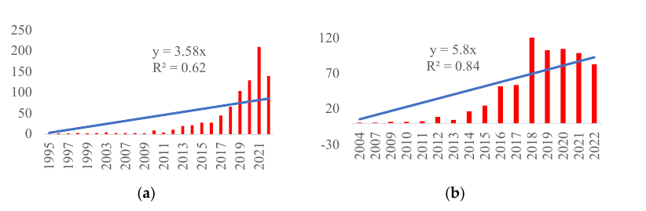
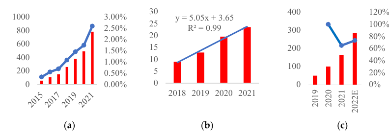
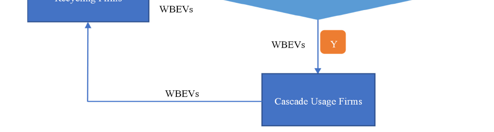
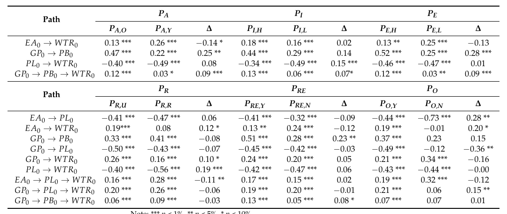
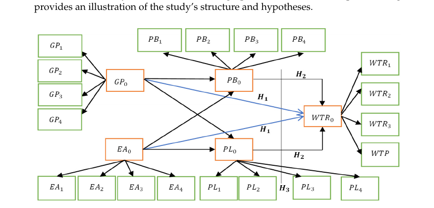
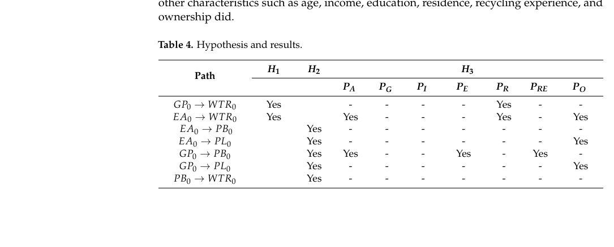
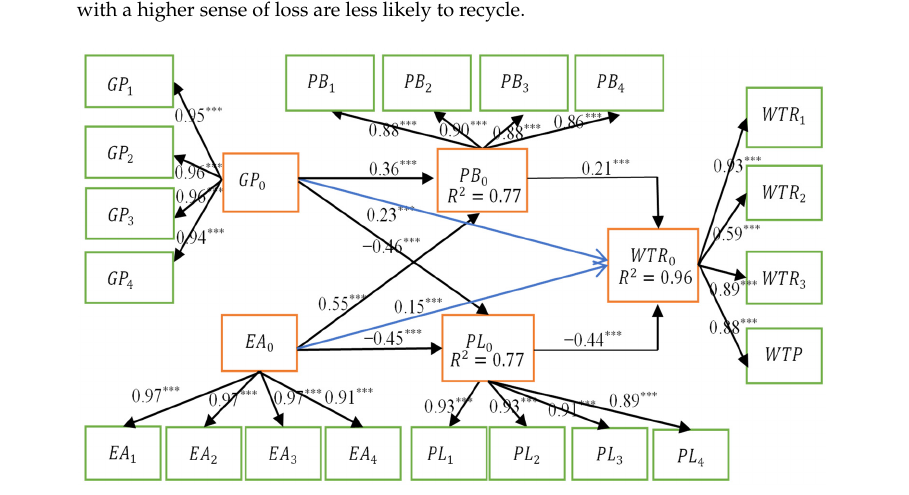
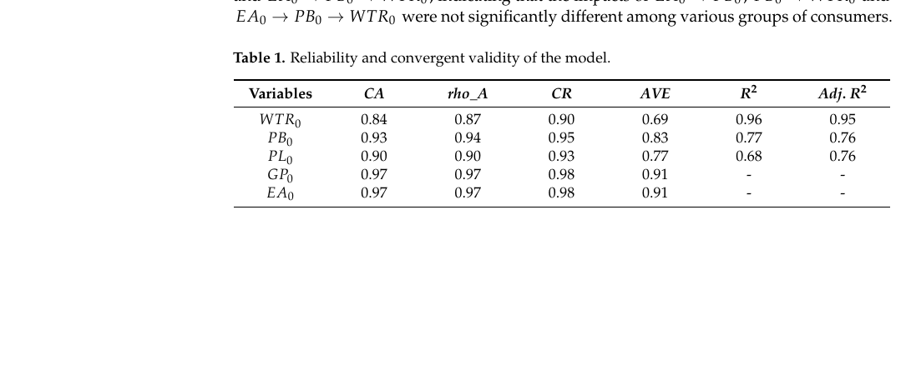

# Consumer Willingness to Recycle the Wasted Batteries of Electric Vehicles in the Era of Circular Economy

> **Nature Reader 状态：结构化重建稿（机器译文底稿，未完成人工逐句审校）**
>
> 原始文件：`消费者回收行为与意愿\Consumer Willingness to Recycle The Wasted Batteries of Electric Vehicles in the Era of Circular Economy.pdf`  
> 来源：Sustainability（2023）  
> 文献类型：empirical/PLS-SEM  
> 总页数：20

## 阅读索引

以下页码链接指向该页第一个可提取文本块；没有可提取文本的页面会保留页码但不生成块链接。

[p.1](#s001) · [p.2](#s018) · [p.3](#s038) · [p.4](#s057) · [p.5](#s071) · p.6 · [p.7](#s080) · [p.8](#s102) · [p.9](#s121) · [p.10](#s131) · [p.11](#s140) · [p.12](#s150) · [p.13](#s157) · [p.14](#s167) · [p.15](#s181) · [p.16](#s195) · [p.17](#s204) · [p.18](#s222) · [p.19](#s241) · [p.20](#s257)

## 术语表

| Canonical term | 中文 | 统一规则 |
|---|---|---|
| wasted batteries of electric vehicles (WBEVs) | 废旧电动汽车电池（WBEVs） | 保留作者缩写 |
| consumer willingness to recycle | 消费者回收意愿 | 核心因变量 |
| partial least squares structural equation modeling (PLS-SEM) | 偏最小二乘结构方程模型（PLS-SEM） | 首次出现给出全称 |
| perception of benefits | 收益感知 | 中介变量 |
| perception of loss | 损失感知 | 中介变量 |

## 全文中英对照

## Page 1

**Source:** p.1 S001 · extraction confidence: low

**Original:** Consumer Willingness to Recycle The Wasted Batteries of Electric Vehicles in the Era of Circular Economy. Sustainability 2023, 15, 2630. Domenico Scagnelli and Meisam Ranjbari creativecommons.org/licenses/by/ sustainability Consumer Willingness to Recycle The Wasted Batteries of Electric Vehicles in the Era of Circular Economy Miaomei Guo and Weilun Huang * School of Finance and Trade, Wenzhou Business College, Wenzhou 325015, China * Correspondence: huangwl@wzbc.edu.cn

**中文:** 循环经济时代消费者回收电动汽车废旧电池的意愿。 可持续发展 2023, 15, 2630。 多梅尼科·斯卡涅利 (Domenico Scagnelli) 和梅萨姆·兰吉巴里 (Meisam Ranjbari) Creativecommons.org/licenses/by/ 可持续发展 循环经济时代消费者对电动汽车废旧电池回收的意愿 郭妙梅、黄伟伦 * 温州商学院财贸学院，中国 温州 325015 * 通讯作者： huangwl@wzbc.edu.cn

**Source:** p.1 S002 · extraction confidence: high

**Original:** Abstract: Electric vehicles (EVs) are increasingly being used for the benefit of the environment

**中文:** 摘要：电动汽车（EV）越来越多地用于环境效益

**Source:** p.1 S003 · extraction confidence: high

**Original:** and to foster the development of a low-carbon circular economy. However, compared to internal combustion engine cars, spent EV batteries (WBEVs) constitute a different form of waste, and their recycling mechanism is still in its early stages.

**中文:** 促进低碳循环经济发展。 然而，与内燃机汽车相比，废电动汽车电池（WBEV）构成了不同形式的废物，其回收机制仍处于早期阶段。

**Source:** p.1 S004 · extraction confidence: high

**Original:** WBEV consumer willingness to recycle is an issue in a circular economy in which EV users should be WBEV recycling pioneers. The purpose of this article is to develop an analytical model for consumers' desire to return WBEVs for recycling, based on the circular economy and consumer welfare, in order to investigate consumer incentives for the construction of a WBEV recycling system.

**中文:** WBEV消费者回收意愿是循环经济中的一个问题，电动汽车用户应该是WBEV回收的先驱。 本文的目的是基于循环经济和消费者福利，建立消费者退回WBEV进行回收的愿望的分析模型，以调查消费者的激励措施 用于建设 WBEV 回收系统。

**Source:** p.1 S005 · extraction confidence: high

**Original:** PLS-SEM was used for the analysis, and the

**中文:** 采用 PLS-SEM 进行分析，

**Source:** p.1 S006 · extraction confidence: high

**Original:** results revealed the following. First, both the perception of government policy and environmental

**中文:** 结果显示如下。首先，无论是对政府政策还是环境的认知

**Source:** p.1 S007 · extraction confidence: high

**Original:** attitudes have significant positive causal effects on consumers' intentions to recycle. Second, the perception of benefits has a significant positive mediating effect on recycling intention, whereas the perception of loss has a significant negative mediating effect.

**中文:** 态度对消费者的回收意愿具有显着的正向因果影响。 其次，利益感知对回收意愿具有显着的正向中介作用，而损失感知对回收意愿具有显着的负向中介作用。

**Source:** p.1 S008 · extraction confidence: high

**Original:** Third, the multigroup analysis found that, with the exception of gender, the variables of age, income, education, area of residence, recycling experiences, and EV ownership all have substantial moderating impacts, although their routes and directions vary considerably.

**中文:** 第三，多组分析发现，除性别外，年龄、收入、教育、居住地区、回收经验和电动汽车拥有量等变量都具有显着的调节影响，尽管它们的路径和方向差异很大。

**Source:** p.1 S009 · extraction confidence: high

**Original:** Recycling policies must be appropriate for consumers, and this has policy consequences for the circular economy. Environmental education and incentives should be provided to increase consumer knowledge and willingness to recycle.

**中文:** 回收政策必须适合消费者，并且 这对循环经济具有政策影响。 应提供环境教育和激励措施，以增加消费者的知识和回收意愿。

**Source:** p.1 S010 · extraction confidence: high

**Original:** Big data might help with the design of a WBEV recycling system. It is necessary to create an intelligent recycling platform, cross-regional recycling collaboration, and smart logistics for WBEVs.

**中文:** 大数据可能有助于 WBEV 回收系统的设计。 有必要打造WBEV智能回收平台、跨区域回收协作和智能物流。

**Source:** p.1 S011 · extraction confidence: low

**Original:** Further, the battery refill mechanism of energy replenishment might encourage the recycling of WBEVs.

**中文:** 此外，能量补充的电池再填充机制可能会鼓励WBEV的回收。

**Source:** p.1 S012 · extraction confidence: high

**Original:** Keywords: electric vehicles; wasted batteries; battery recycling; consumer willingness to recycle;

**中文:** 关键词：电动汽车；废旧电池；电池回收；消费者回收的意愿；

**Source:** p.1 S013 · extraction confidence: high

**Original:** circular economy

**中文:** 循环经济

**Source:** p.1 S014 · extraction confidence: high

**Original:** 1. Introduction

**中文:** 一、简介

**Source:** p.1 S015 · extraction confidence: low

**Original:** Global warming and the global consensus on carbon neutrality have accelerated the global growth of the electric vehicle (EV) sector. However, recycling methods for EVs and spent batteries of electric cars (WBEVs) are still in the early stages, showing that WBEV recycling is mostly driven by regulation.

**中文:** 全球变暖和全球对碳中和的共识加速了电动汽车（EV）行业的全球增长。 然而，电动汽车和电动汽车废旧电池（WBEV）的回收方法仍处于早期阶段，这表明WBEV回收主要是由法规驱动的。

**Source:** p.1 S016 · extraction confidence: low

**Original:** Thus, the policy challenge of EVs' circular economy has been consumers' desire to recycle WBEVs. The EU has an increased producer responsibility, and nations such as China, Japan, and India have restrictions on WBEVs to promote a circular economy.

**中文:** 因此，电动汽车循环经济的政策挑战一直是消费者回收WBEV的愿望。 欧盟增加了生产者责任，中国、日本和印度等国家对 WBEV 进行了限制， 推动循环经济。

**Source:** p.1 S017 · extraction confidence: high

**Original:** However, most countries' WBEV recycling regulations are still insufficient. According to Rajaeifar et al. [1], remanufacturing, reusing, and recycling are the best treatments for WBEVs in terms of the circular economy.

**中文:** 然而，大多数国家的WBEV回收法规仍然不足。 根据 Rajaeifar 等人的说法。 [1]，再制造、再利用和回收是WBEV在循环经济方面的最佳处理方式。

## Page 2

**Source:** p.2 S018 · extraction confidence: low

**Original:** Many governments have encouraged the use of electric vehicles, with China leading the way. By the end of March 2022, China's total number of pure electric cars (EVs) had reached 7.25 million, accounting for 2.36% of all vehicles, with an annual growth rate of more than 100%.

**中文:** 许多政府都鼓励使用电动汽车，其中中国处于领先地位。 截至2022年3月，中国纯电动汽车保有量达725万辆，占汽车总量的2.36%，年增长率超过100%。

**Source:** p.2 S019 · extraction confidence: low

**Original:** In Europe, more than 1.4 million EVs will be registered in 2022, with a use policy objective of at least 30 million registered EVs by 2030. By 2020, the number of EV registrations in the United States will have surpassed one million.

**中文:** 在欧洲，2022 年将注册超过 140 万辆电动汽车，使用政策目标是到 2030 年至少注册 3000 万辆电动汽车。 到2020年，美国电动汽车注册量将超过100万辆。

**Source:** p.2 S020 · extraction confidence: low

**Original:** The US policy aim Sustainability 2023, 15, 2630. https://doi.org/10.3390/su15032630 https://www.mdpi.com/journal/sustainability Sustainability 2023, 15, 2630 2 of 20 for EV adoption is for EVs to account for 50% of new car sales by 2030.

**中文:** 美国的政策目标 可持续发展 2023, 15, 2630. https://doi.org/10.3390/su15032630 https://www.mdpi.com/journal/sustainability 可持续发展 2023, 15, 2630 关于电动汽车采用的 20 项中的 2 项是到 2030 年电动汽车将占新车销量的 50%。

**Source:** p.2 S021 · extraction confidence: high

**Original:** The EV sector is predicted to flourish, creating a strong need for EV batteries, and discarded EV batteries are a hazard to the environment. The issues are as follows. (1) An EV battery should be changed when its power capacity decreases to 70–80% of its original level [2].

**中文:** 预计电动汽车行业将蓬勃发展，对电动汽车电池产生强烈需求，而废弃的电动汽车电池对环境造成危害。 问题如下。 (1) 当电动汽车电池的电量下降至原始水平的 70-80% 时，应更换电池 [2]。

**Source:** p.2 S022 · extraction confidence: high

**Original:** (2) Replacing EV batteries will result in a rising waste stream of WBEVs in the future [3,4]. (3) WBEVs include dangerous metals such as Hg, Pb, and nickel [5] and can pollute soil, air, and subterranean water if improperly treated [6].

**中文:** (2) 更换 未来电动汽车电池将导致WBEV 废物流不断增加[3,4]。 (3) WBEV 含有汞、铅和镍等危险金属 [5]，如果处理不当，会污染土壤、空气和地下水 [6]。

**Source:** p.2 S023 · extraction confidence: high

**Original:** The fast expansion of the EV sector, along with a scarcity of resources, is driving up the price of lithium battery metals throughout the world, with the price of lithium carbonate growing from RMB 67,906/ton in early 2021 to RMB 589,000/ton in November

**中文:** 电动汽车行业的快速扩张以及资源的稀缺正在推高全球锂电池金属的价格，其中碳酸锂的价格从2021年初的67,906元/吨上涨至11月的589,000元/吨

**Source:** p.2 S024 · extraction confidence: high

**Original:** 2022. WBEVs have a high concentration of battery-grade materials such as copper and

**中文:** 2022年。WBEV拥有高浓度的电池级材料，例如铜和

**Source:** p.2 S025 · extraction confidence: high

**Original:** organic electrolytes [7]. WBEV recycling is a notable alternative for battery producers to ease material scarcity and minimize material prices [6]. Tesla, Ultium Cells, and SK Innovation are among the companies that have begun to put out their plans for WBEV recycling.

**中文:** 有机电解质[7]。 WBEV 回收是电池生产商缓解材料短缺和降低材料价格的一个重要替代方案[6]。 Tesla、Ultium Cells 和 SK Innovation 等公司已开始推出 WBEV 回收计划。

**Source:** p.2 S026 · extraction confidence: high

**Original:** More and more nations and regions have set goals for recycling WBEVs, since this has positive effects on the environment and the economy. The "Law for the Promotion of Effective Utilization of Resources" was introduced in Japan in 2000, and it stipulates that Li-ion rechargeable batteries must have a recovery rate of 30% or higher [8].

**中文:** 越来越多的国家和地区制定了回收WBEV的目标，因为这对环境和经济产生积极影响。 日本2000年出台《资源有效利用促进法》，规定锂离子充电电池的回收率必须达到30%以上[8]。

**Source:** p.2 S027 · extraction confidence: high

**Original:** By 2020 and 2025, respectively, the General Office of the State Council of China has mandated a recovery rate of 40% and 50% for critical waste [9]. For new batteries to be manufactured after 2030, the European Commission has established a new guideline requiring battery manufacturers to satisfy a certain level of recycled materials [10].

**中文:** 中国国务院办公厅分别要求到2020年和2025年关键废物回收率达到40%和50%[9]。 用于制造新电池 2030年后，欧盟委员会制定了新的指导方针，要求电池制造商满足一定水平的回收材料[10]。

**Source:** p.2 S028 · extraction confidence: high

**Original:** China is the EV market's pioneer and the world's largest producer of EV batteries. WBEV recycling is extremely difficult and essential. The recycling market for WBEVs is expanding in China, with a growth rate of more than 50% expected in 2020 and 2021.

**中文:** 中国是电动汽车市场的先行者，也是全球最大的电动汽车电池生产国。 WBEV 回收极其困难且至关重要。 中国WBEV回收市场正在扩大，预计2020年和2021年增长率将超过50%。

**Source:** p.2 S029 · extraction confidence: high

**Original:** To aid management, the Chinese government has enhanced recycling infrastructure and implemented the Extended Producer Responsibility (EPR) system as well as an EV battery traceability labeling system.

**中文:** 为了协助管理，中国政府加强了回收基础设施并实施了 生产者延伸责任（EPR）系统以及电动汽车电池可追溯标签系统。

**Source:** p.2 S030 · extraction confidence: high

**Original:** Through public–private partnerships and third-party services, the government is also promoting private capital to engage in garbage recycling [9]. By 15 April 2022, 14,967 recycling outlets had been established in China by EV manufacturers, as well as cascade utilization firms such as GAC Mitsubishi and BAIC New Energy, mostly in the Bei-jing-Tianjin-Hebei, Yangtze River Delta, Pearl River Delta, and central regions.

**中文:** 政府还通过公私合作和第三方服务，推动民间资本参与垃圾回收[9]。 截至2022年4月15日，我国电动汽车制造商以及广汽三菱、北汽新能源等梯级利用企业已建立回收网点14,967个，主要分布在京津冀、长三角、珠三角和中部地区。

**Source:** p.2 S031 · extraction confidence: high

**Original:** The recycling rate of WBEVs, on the other hand, is not proportionate to EV penetration in the vehicle consumer market [11]. On 31 July 2018, China's complete management platform for power battery recycling and traceability was officially launched.

**中文:** 另一方面，WBEV 的回收率与 EV 在汽车消费市场的渗透率并不成正比[11]。 2018年7月31日，中国完整的动力电池回收与追溯管理平台正式上线。

**Source:** p.2 S032 · extraction confidence: high

**Original:** Power batteries built prior to the system's implementation are not subject to the system, and users who purchased EVs prior to the system's implementation have additional options for disposing of WBEVs.

**中文:** 在系统实施之前生产的动力电池不受该系统的约束，在系统实施之前购买电动汽车的用户可以有额外的选项来处理WBEV。

**Source:** p.2 S033 · extraction confidence: high

**Original:** When the battery power capacity falls below the recommended value, EV owners have at least three options for disposing of the discarded batteries: (1) recycle the WBEVs at automotive sales service stores (4S stores), battery leasing companies, or recyclers; (2) leave the end-of-life (EOL) EVs or WBEVs at home; or (3) dispose of the EOL EVs or WBEVs in the wilderness.

**中文:** 当电池电量低于推荐值时， 电动车车主对于废弃电池的处理至少有三种选择：（1）到汽车销售服务店（4S店）、电池租赁公司或回收商回收电动汽车； (2) 将报废 (EOL) 电动汽车或 WBEV 留在家中； (3) 将 EOL 电动车或 WBEV 丢弃在荒野中。

**Source:** p.2 S034 · extraction confidence: high

**Original:** Although it may appear nonsensical to dump EOL EVs or WBEVs, EVs are frequently reported abandoned in the woods. In Jiangsu and Zhejiang provinces, respectively, twenty EV buses and 4000 shared EVs were abandoned in the wilderness in 2019.

**中文:** 尽管丢弃 EOL 电动汽车或 WBEV 似乎有些荒谬，但据报道，电动汽车经常被遗弃在树林里。 江苏省和浙江省分别有20辆电动公交车和4000辆共享电动汽车被废弃 2019年的荒野。

**Source:** p.2 S035 · extraction confidence: high

**Original:** Over 3000 shared EVs were discovered in an abandoned parking lot in Guangdong province in 2020. Nearly 2000 EVs were reported abandoned in Hangzhou, Zhejiang province, in 2021.

**中文:** 2020年，广东省一个废弃停车场发现了3000多辆共享电动汽车。 据报道，2021 年浙江省杭州市有近 2000 辆电动汽车被遗弃。

**Source:** p.2 S036 · extraction confidence: high

**Original:** When it comes to recycling WBEVs, consumers encounter numerous challenges, including: (1) the expensive cost of battery replacement; (2) a lack of understanding as to how to recycle; (3) restricted access to recyclers; (4) limited recycling outlets; and (5) a lack of subsidies or other recompense from the government or recyclers [12].

**中文:** 在回收WBEV时，消费者面临着诸多挑战，包括：（1）昂贵的电池更换成本； （二）对如何回收利用缺乏了解； (3) 限制回收商的进入； （四）回收网点有限； (5) 缺乏政府或回收商的补贴或其他补偿[12]。

**Source:** p.2 S037 · extraction confidence: high

**Original:** Consumers play an important role in the recycling industry [12]. According to Long et al. [13], consumers are the starting point for the recycling chain. Consumers return garbage to recyclers in order for the waste to be recycled.

**中文:** 消费者在回收行业中发挥着重要作用[12]。 根据龙等人的说法。 [13]，消费者是回收链的起点。 消费者将垃圾返还给回收商，以便废物得到回收利用。

## Page 3

**Source:** p.3 S038 · extraction confidence: low

**Original:** The recycling rate is determined by their pro-environmental attitude and awareness. Kumar [14] claimed that one of the Sustainability 2023, 15, 2630 3 of 20 most important reasons for increased waste is consumers' inability to return unwanted items to producers.

**中文:** 回收率取决于他们的环保态度和意识。 Kumar [14] 声称，可持续发展 2023, 15, 2630 造成浪费增加的 20 个最重要原因中的 3 个之一是消费者无法将不需要的物品退还给生产者。

**Source:** p.3 S039 · extraction confidence: high

**Original:** Dhir et al. [15] also asserted that the e-waste situation was caused by consumers' poor recycling participation, and that better knowledge of consumers' recycling intentions is desperately required to urge them to recycle.

**中文:** 迪尔等人。 [15]还断言，电子垃圾的情况是由 消费者回收参与度不高，亟需了解消费者回收意愿，督促其回收。

**Source:** p.3 S040 · extraction confidence: high

**Original:** Consumers own EVs, and are the principal suppliers of WBEVs. Understanding the recycling intentions of consumers or the reasons for their readiness to return WBEVs is critical to reducing WBEV waste.

**中文:** 消费者拥有电动汽车，并且是电动汽车的主要供应商。 了解消费者的回收意图或他们愿意退回 WBEV 的原因对于减少 WBEV 浪费至关重要。

**Source:** p.3 S041 · extraction confidence: high

**Original:** Further, consumers have not been given enough consideration in the existing literature. As a result, the purpose of this article is to bridge this gap by investigating the factors that influence consumers' propensity to return WBEVs for recycling.

**中文:** 此外，现有文献中还没有对消费者给予足够的考虑。 因此，本文的目的是通过调查影响因素来弥补这一差距。 消费者退回 WBEV 进行回收的倾向。

**Source:** p.3 S042 · extraction confidence: high

**Original:** The theoretical contributions of this paper are as follows: (1) an expansion of behavioral economics and environmental economics by exploring consumers' willingness to recycle (WTR) WBEVs; (2) an expansion of the theory of wasted battery recycling, as this paper is one of the first works to discuss the recycling of WBEVs from the perspective of the consumer; and (3) a reference for waste management research with the structure and

**中文:** 本文的理论贡献如下：（1）通过探索消费者回收（WTR）WBEV的意愿，扩展了行为经济学和环境经济学； （2）扩展废旧电池回收理论，因为本文是最早从消费者角度讨论WBEV回收的著作之一； (3) 废物管理研究的参考，其结构和

**Source:** p.3 S043 · extraction confidence: high

**Original:** method of analysis of the paper.

**中文:** 论文的分析方法。

**Source:** p.3 S044 · extraction confidence: high

**Original:** In recent years, most governments and economies, including China and the United States, have proposed the idea of the circular economy as a fundamental premise for industrial development [16,17].

**中文:** 近年来，包括中国和美国在内的大多数政府和经济体都提出了循环经济理念，作为工业发展的基本前提[16,17]。

**Source:** p.3 S045 · extraction confidence: high

**Original:** The goal of a circular economy is to keep resources in the economy for as long as possible through recycling or reusing garbage and its byproducts, as well as prolonging the service life of products [18].

**中文:** 循环经济的目标是通过回收或再利用垃圾及其副产品，以及延长产品的使用寿命，尽可能长时间地将资源保留在经济中[18]。

**Source:** p.3 S046 · extraction confidence: high

**Original:** Without appropriate waste management, a circular economy cannot be realized [19]. According to Ranjbari et al. [19], substantial research has been conducted on waste management within the circular economy domain during the previous two decades, with 962 relevant publications published in over 200 journals.

**中文:** 如果没有适当的废物管理，循环经济就无法实现[19]。 根据 Ranjbari 等人的说法。 [19], 过去二十年里，循环经济领域内的废物管理进行了大量研究，在超过 962 篇相关出版物中发表 200 种期刊。

**Source:** p.3 S047 · extraction confidence: high

**Original:** These articles can be categorized into seven major themes: circular economy transition, environmental impacts and lifecycle assessment, bio-based waste management, electronic waste, municipal solid waste, plastic waste, and building and demolition waste.

**中文:** 这些文章可分为七大主题：循环经济转型、环境影响和生命周期评估、生物基废物管理、电子废物、城市固体废物、塑料废物以及建筑和拆除废物。

**Source:** p.3 S048 · extraction confidence: high

**Original:** However, the management of WBEVs is omitted, showing a lack of study on WBEV management in the context of the circular economy. Recycling is a component of waste management, and this study investigates consumers' recycling intentions for WBEVs, contributing theoretically and practically to waste management and the creation of a circular economy in the following areas: (1) an analytical framework for the study of consumers' recycling intentions for WBEVs is provided; (2) the influencing factors of consumers' WBEV recycling behavior are clarified and discussed from the three perspectives of causality effect, mediating effect, and mediation effect; and (3) incentive measures and policies for government and recyclers are proposed to encourage consumers' recycling intentions for WBEVs, based

**中文:** 然而，对WBEV的管理却被忽略，表明缺乏循环经济背景下的WBEV管理研究。 回收是废物管理的一个组成部分，这项研究调查了消费者对 WBEV 的回收意图，有助于在以下领域对废物管理和循环经济的创建具有理论和实践意义：（1）提供了研究消费者对WBEV回收意愿的分析框架； (2)从因果效应、中介效应、中介效应三个角度厘清并讨论了消费者WBEV回收行为的影响因素； (3) 提出政府和回收商的激励措施和政策，以鼓励消费者对WBEV的回收意愿。

**Source:** p.3 S049 · extraction confidence: high

**Original:** on the key influencing factors. The Section 2 of this study uses the findings of a literature review and an expert survey to define the theoretical framework and structural equation model in this research, and then our hypotheses are defined.

**中文:** 关于关键影响因素。 本研究的第二部分利用文献综述和专家调查的结果来定义本研究的理论框架和结构方程模型，然后定义我们的假设。

**Source:** p.3 S050 · extraction confidence: high

**Original:** The Section 3 examines the statistical results for consumers' WTR for WBEVs and the elements that influence these consumers, such as causal effects, mediator effects, and moderator effects.

**中文:** 第三部分研究了消费者对WBEV的WTR的统计结果以及影响这些消费者的因素，例如因果效应、中介效应和调节效应。

**Source:** p.3 S051 · extraction confidence: high

**Original:** The Section 4 includes empirical hypothesis results and policy implications. The Section 5 further includes the conclusion,

**中文:** 第 4 部分包括实证假设结果和政策影响。 第 5 节进一步包括结论，

**Source:** p.3 S052 · extraction confidence: high

**Original:** limitations, recommendations, and future research prospects.

**中文:** 局限性、建议和未来的研究展望。

**Source:** p.3 S053 · extraction confidence: high

**Original:** 2. Literature Review and Hypotheses

**中文:** 2 文献综述与假设

**Source:** p.3 S054 · extraction confidence: high

**Original:** The circular economy should be a market economy that allocates macro resources to ensure its success. Thus, in the age of the circular economy, consumers' WTR for WBEVs is a crucial policy problem.

**中文:** 循环经济应该是配置宏观资源以保证其成功的市场经济。 因此，在循环经济时代，消费者对WBEV的WTR是一个至关重要的政策问题。

**Source:** p.3 S055 · extraction confidence: high

**Original:** The essential concept of the circular economy is resource recycling, which should be feasible in all aspects of the national economic reproduction system (including consumption and use).

**中文:** 循环经济的本质理念是资源循环利用，在国民经济再生产系统的各个环节（包括消费和使用）都应可行。

**Source:** p.3 S056 · extraction confidence: high

**Original:** Natural resources should be used rationally in the production and processing process, energy and raw materials should be processed into environmentally friendly products as much as possible using advanced technology and onsite recycling, and final products should be consumed in a rational manner during the Sustainability 2023, 15, 2630 4 of 20 circulation process and consumption.

**中文:** 在生产加工过程中要合理利用自然资源，将能源和原材料加工成 尽可能采用先进技术和现场回收的环保产品，并在可持续发展2023、15、2630 4的20个流通过程和消费过程中合理消耗最终产品。

## Page 4

**Source:** p.4 S057 · extraction confidence: low

**Original:** These desiderata originate in resource recovery in the manufacturing and processing processes. WBEV recycling is receiving more attention, and the relevant research is expanding.

**中文:** 这些需求源于制造和加工过程中的资源回收。 WBEV回收越来越受到关注，相关研究也在不断扩大。

**Source:** p.4 S058 · extraction confidence: low

**Original:** Figure 1a demonstrates that papers on WBEV recycling were uncommon prior to 2016, but their numbers began to increase after 2017. However, this report found only 851 articles with the keywords "EV battery recycling," "electric vehicle recycling," or "power battery recycling" in the web of science (WOS) core collection database on 17 September 2022.

**中文:** 图 1a 表明，关于 WBEV 回收的论文在 2016 年之前并不常见，但其数量在 2017 年之后开始增加。 然而，该报告在2022年9月17日的Web of Science（WOS）核心合集数据库中仅发现了851篇含有“电动汽车电池回收”、“电动汽车回收”或“动力电池回收”关键词的文章。

**Source:** p.4 S059 · extraction confidence: low

**Original:** Similarly, as shown in Figure 1b, on 17 September 2022, this paper found only 695 articles containing the keywords "car battery recycling" or "power battery recycling" on the China National Knowledge Infrastructure (CNKI) website.

**中文:** 同样，如图1b所示，2022年9月17日，本文在中国知网（CNKI）网站上仅找到包含“汽车电池回收”或“动力电池回收”关键词的文章695篇。

**Source:** p.4 S060 · extraction confidence: medium

**Original:** Sustainability 2023, 15, x FOR PEER REVIEW 4 of 21 system (including consumption and use). Natural resources should be used rationally in the production and processing process, energy and raw materials should be processed into environmentally friendly products as much as possible using advanced technology and onsite recycling, and final products should be consumed in a rational manner during the circulation process and consumption.

**中文:** 可持续发展 2023, 15, x FOR PEER REVIEW 4 of 21 系统（包括消耗和使用）。 在生产加工过程中合理利用自然资源，利用先进技术和就地回收尽可能将能源和原材料加工成环保产品，最终产品在流通过程和消费过程中合理消耗。

**Source:** p.4 S061 · extraction confidence: low

**Original:** These desiderata originate in resource recovery in the manufacturing and processing processes. WBEV recycling is receiving more attention, and the relevant research is expanding.

**中文:** 这些需求源于制造和加工过程中的资源回收。 WBEV回收越来越受到关注，相关研究也在不断扩大。

**Source:** p.4 S062 · extraction confidence: low

**Original:** Figure 1a demonstrates that papers on WBEV recycling were uncommon prior to 2016, but their numbers began to increase after 2017. However, this report found only 851 articles with the keywords "EV battery recycling," "electric vehicle recycling," or "power battery recycling" in the web of science (WOS) core collection database on 17 September 2022.

**中文:** 图 1a 表明，关于 WBEV 回收的论文在 2016 年之前并不常见，但其数量在 2017 年之后开始增加。 然而，该报告在2022年9月17日的Web of Science（WOS）核心合集数据库中仅发现了851篇含有“电动汽车电池回收”、“电动汽车回收”或“动力电池回收”关键词的文章。

**Source:** p.4 S063 · extraction confidence: low

**Original:** Similarly, as shown in Figure 1b, on 17 September 2022, this paper found only 695 articles containing the keywords "car battery recycling" or "power battery recycling" on the China National Knowledge Infrastructure (CNKI) website.

**中文:** 同样，如图1b所示，2022年9月17日，本文在中国知网（CNKI）网站上仅找到包含“汽车电池回收”或“动力电池回收”关键词的文章695篇。

**Source:** p.4 S064 · extraction confidence: high

**Original:** (a) (b) Figure 1. Articles with the topic of WBEV recycling in WOS and CNKI: (a) articles with the topic of WBEV recycling from 1995~2022 in WOS; (b) articles with the topic of WBEV recycling from 2004~2022 in CNKI.

**中文:** (a) (b) 图 1。 WOS和CNKI中WBEV回收主题的文章：（a）WOS 1995~2022年WBEV回收主题的文章； (b) 主题为 WBEV 回收的文章 2004~2022年中国知网。

### Fig. 1. (a) (b) 图 1。 WOS和CNKI中WBEV回收主题的文章：（a）WOS 1995~2022年WBEV回收主题的文章； (b) 主题为 WBEV 回收的文章 2004~20

**Placed near:** p.4 S064  
**Source:** p.4 S064  
**Crop confidence:** approximate-object-bounded

**Original caption:** Figure 1. Articles with the topic of WBEV recycling in WOS and CNKI: (a) articles with the

**中文图注:** (a) (b) 图 1。 WOS和CNKI中WBEV回收主题的文章：（a）WOS 1995~2022年WBEV回收主题的文章； (b) 主题为 WBEV 回收的文章 2004~2022年中国知网。

**Reading note:** 自动裁剪以图注为定位依据；正式引用图中数值前请对照原 PDF 检查裁剪边界与坐标轴。

**Source:** p.4 S065 · extraction confidence: high

**Original:** 2.1. Recycling Modes of WBEVs

**中文:** 2.1. WBEV的回收模式

**Source:** p.4 S066 · extraction confidence: high

**Original:** The literature primarily discusses four types of recycling systems: (1) a recycling mode driven by manufacturers (Mode ), who recycle WBEVs directly from consumers through their sales channels [20,21]; (2) a recycling mode driven by retailers (Mode ), whom the manufacturers have encouraged to take on the responsibility for recycling [4]; (3) a recycling mode (Mode ) in which producers outsource the recycling process to wellequipped third parties [21,22]; (4) a recycling mode (Mode ), that is often constituted of manufacturers or sellers and has the benefit of a scale economy [21].

**中文:** 文献主要讨论了四种类型的回收系统：（1）制造商驱动的回收模式（模式），制造商通过销售渠道直接从消费者那里回收WBEV[20,21]； （2）零售商推动的回收模式（模式），制造商鼓励零售商承担回收责任[4]； （3）回收模式（Mode），生产者将回收过程外包给装备精良的第三方[21,22]； (4)回收模式(Mode)，通常由以下组成 制造商或销售商，并具有规模经济的好处[21]。

**Source:** p.4 S067 · extraction confidence: high

**Original:** The ideal recycling structure and pathways have been addressed in the literature. Tang et al. [4] investigated the social welfare implications of single-channel recycling modes (as ModeM, ModeR, and ModeTP) as well as competing dual-channel recycling modes (as mode ModeM,R, ModeM,TP, and ModeR,TP), concluding that ModeM,R is the optimal recycling method.

**中文:** 文献中已经讨论了理想的回收结构和途径。 唐等人。 [4]研究了单渠道回收模式（如ModeM、ModeR和ModeTP）以及竞争性双渠道回收模式（如模式ModeM,R、ModeM,TP和ModeR,TP）的社会福利影响，得出结论：ModeM,R是最佳回收方法。

**Source:** p.4 S068 · extraction confidence: high

**Original:** According to Zan and Zhang [21], the ideal recycling method for manufacturers is determined by the trade-offs between recycling and reuse costs. Li [22] examined the EV battery supply chain using ModeM, ModeR, ModeTP, and dualchannel modes, claiming that the best mode to use is determined by competition and third-party economies of scale.

**中文:** 根据Zan和Zhang的研究[21]，制造商理想的回收方法是由回收和再利用成本之间的权衡决定的。 李 [22]使用ModeM、ModeR、ModeTP和双通道模式检查了电动汽车电池供应链，声称最佳使用模式是由竞争和第三方规模经济决定的。

**Source:** p.4 S069 · extraction confidence: high

**Original:** WBEV recycling is mostly carried out by industry organizations and partnerships in Europe and the United States, and the government has developed a deposit system to encourage battery registration and required restitution [23].

**中文:** WBEV回收主要由欧洲和美国的行业组织和合作伙伴进行，政府制定了押金制度以鼓励电池注册和要求归还[23]。

**Source:** p.4 S070 · extraction confidence: high

**Original:** In Japan, battery manufacturers create recycling routes using reverse logistics, and recycling is subsidized by the government [23]. According to the "Measures for the Management of Recovery and Utilization of Power Batteries for New Energy Vehicles" law in China, EV producers are responsible for recycling WBEVs and must develop power battery recycling routes within the EPR system.

**中文:** 在日本，电池制造商利用逆向物流创建回收路线，回收由政府补贴[23]。 根据我国《新能源汽车动力电池回收利用管理办法》，电动汽车生产企业应承担以下责任： 能够回收WBEV的企业必须在EPR系统内开发动力电池回收路线。

## Page 5

**Source:** p.5 S071 · extraction confidence: low

**Original:** Furthermore, co-construction encourages the creation and sharing of y = 3.58x R² = 0.62 y = 5.8x R² = 0.84 -30 Figure 1. Articles with the topic of WBEV recycling in WOS and CNKI: (a) articles with the topic of WBEV recycling from 1995~2022 in WOS; (b) articles with the topic of WBEV recycling from 2004~2022 in CNKI.

**中文:** 此外，共建鼓励创建和共享 y = 3.58x R² = 0.62 y = 5.8x R² = 0.84 -30 图 1。 WOS和CNKI中WBEV回收主题的文章：（a）WOS 1995~2022年WBEV回收主题的文章； (b) 主题为 WBEV 回收的文章 2004~2022年中国知网。

**Source:** p.5 S072 · extraction confidence: low

**Original:** 2.1. Recycling Modes of WBEVs

**中文:** 2.1. WBEV的回收模式

**Source:** p.5 S073 · extraction confidence: low

**Original:** The literature primarily discusses four types of recycling systems: (1) a recycling mode driven by manufacturers (ModeM), who recycle WBEVs directly from consumers through their sales channels [20,21]; (2) a recycling mode driven by retailers (ModeR), whom the manufacturers have encouraged to take on the responsibility for recycling [4]; (3) a recycling mode (ModeTP) in which producers outsource the recycling process to well-equipped third parties [21,22]; (4) a recycling mode (ModeA), that is often constituted of manufacturers or sellers and has the benefit of a scale economy [21].

**中文:** 文献主要讨论了四种类型的回收系统：（1）制造商驱动的回收模式（ModeM），制造商通过销售渠道直接从消费者那里回收WBEV[20,21]； （2）零售商驱动的回收模式（ModeR），制造商鼓励零售商承担回收责任[4]； （3）回收模式（ModeTP），生产者将回收过程外包给装备精良的第三方[21,22]； (4)回收模式(ModeA)，通常由制造商或 卖家并具有规模经济的好处[21]。

**Source:** p.5 S074 · extraction confidence: low

**Original:** The ideal recycling structure and pathways have been addressed in the literature. Tang et al. [4] investigated the social welfare implications of single-channel recycling modes (as ModeM, ModeR, and ModeTP) as well as competing dual-channel recycling modes (as mode ModeM,R, ModeM,TP, and ModeR,TP), concluding that ModeM,R is the optimal recycling method.

**中文:** 文献中已经讨论了理想的回收结构和途径。 唐等人。 [4]研究了单渠道回收模式（如ModeM、ModeR和ModeTP）以及竞争性双渠道回收模式（如模式ModeM,R、ModeM,TP和ModeR,TP）的社会福利影响，得出结论：ModeM,R是最佳回收方法。

**Source:** p.5 S075 · extraction confidence: low

**Original:** According to Zan and Zhang [21], the ideal recycling method for manufacturers is determined by the trade-offs between recycling and reuse costs. Li [22] examined the EV battery supply chain using ModeM, ModeR, ModeTP, and dual-channel modes, claiming that the best mode to use is determined by competition and third-party economies of scale.

**中文:** 根据Zan和Zhang的研究[21]，制造商理想的回收方法是由回收和再利用成本之间的权衡决定的。 李 [22] 使用ModeM、ModeR、ModeTP和双通道模式检查了电动汽车电池供应链，声称最佳使用模式由竞争和第三方规模经济决定。

**Source:** p.5 S076 · extraction confidence: low

**Original:** WBEV recycling is mostly carried out by industry organizations and partnerships in Europe and the United States, and the government has developed a deposit system to encourage battery registration and required restitution [23].

**中文:** WBEV回收主要由欧洲和美国的行业组织和合作伙伴进行，政府制定了押金制度以鼓励电池注册和要求归还[23]。

**Source:** p.5 S077 · extraction confidence: low

**Original:** In Japan, battery manufacturers create recycling routes using reverse logistics, and recycling is subsidized by the government [23]. According to the "Measures for the Management of Recovery and Utilization of Power Batteries for New Energy Vehicles" law in China, EV producers are responsible for recycling WBEVs and must develop power battery recycling routes within the EPR system.

**中文:** 在日本，电池制造商利用逆向物流创建回收路线，回收由政府补贴[23]。 根据我国《新能源汽车动力电池回收利用管理办法》，电动汽车生产企业 负责回收WBEV的人员必须在EPR系统内制定动力电池回收路线。

**Source:** p.5 S078 · extraction confidence: low

**Original:** Furthermore, co-construction encourages the creation and sharing of recycling channels among EV makers, battery producers, automobile scrapping facilities, dismantling businesses, and comprehensive utilization companies.

**中文:** 此外，共建鼓励电动汽车生产企业、电池生产企业、汽车报废设施、拆解企业、综合利用企业建立和共享回收渠道。

**Source:** p.5 S079 · extraction confidence: high

**Original:** However, China's WBEV recycling business is still in its early stages. The WBEV recycling market has been dominated by smalland medium-sized recycling businesses [24], resulting in a disorderly and informal recycling industry.

**中文:** 然而，中国的WBEV回收业务仍处于早期阶段。 WBEV回收市场一直以中小型回收企业为主[24]，导致市场秩序混乱。 和非正规回收行业。

## Page 7

**Source:** p.7 S080 · extraction confidence: medium

**Original:** Sustainability 2023, 15, 2630 5 of 20

**中文:** 可持续发展 2023, 15, 2630 5 of 20

**Source:** p.7 S081 · extraction confidence: low

**Original:** 2.2. Literature Review on Consumers' WTR WBEVs

**中文:** 2.2.消费者 WTR WBEV 文献综述

**Source:** p.7 S082 · extraction confidence: low

**Original:** Consumers are the most important participants in the WBEV recycling process. Since the Chinese government encouraged the use of EVs in 2015, the market share of EVs has grown year after year.

**中文:** 消费者是WBEV回收过程中最重要的参与者。 自2015年中国政府鼓励使用电动汽车以来，电动汽车的市场份额逐年增长。

**Source:** p.7 S083 · extraction confidence: low

**Original:** EV market share has increased from 0.34% in 2015 to 2.6% in 2021, as shown in Figure 2a. EV batteries have a lifespan of 5–8 years. Consumers can change batteries when their performance is no longer good.

**中文:** 电动汽车市场份额从 2015 年的 0.34% 增长至 2015 年的 2.6% 2021年，如图2a所示。电动汽车电池的使用寿命为 5 至 8 年。消费者可以 当电池性能不再良好时更换电池。

**Source:** p.7 S084 · extraction confidence: low

**Original:** The retired batteries form a massive mound of WBEVs. Typically, consumers have four options for participating in WBEV recycling: up of EV manufacturers and cascade usage firms.

**中文:** 退役的电池形成了一大堆WBEV。 通常，消费者有四种参与 WBEV 回收的选择：电动汽车制造商和梯级使用公司。

**Source:** p.7 S085 · extraction confidence: low

**Original:** Formal recyclers are regulated a proved facilities that process garbage with some level of industrial hygiene and w protection, and they are typically equipped with the finest recycling equipment po and are subject to highly stringent environmental protection standards [25–27].

**中文:** 正规回收商受到监管和经过验证的垃圾处理设施，具有一定程度的工业卫生和保护，他们通常配备最好的回收设备，并遵守高度严格的环境保护标准[25-27]。

**Source:** p.7 S086 · extraction confidence: low

**Original:** expansion of the recycling sector, the number of batteries recycled from official rec is quickly growing. As seen in Figure 2b,c, the recycling volume of lithium batte China rose by more than 20% between 2020 and 2021, and the recycling market sc panded by more than 50% over the same period.

**中文:** 随着回收行业的扩大，官方回收的电池数量正在快速增长。 如图2b、c所示，2020年至2021年间，中国锂电池回收量增长了20%以上，同期回收市场规模增长了50%以上。

**Source:** p.7 S087 · extraction confidence: low

**Original:** (4) Informal recyclers buy the WBEVs or EOL EVs. Unlike formal recyclers, in recyclers are not regulated by the government [25,28]. They are tiny and disadvan businesses with a low profit threshold, no registration, no tax, no social welfare be and a high labor intensity [29,30].

**中文:** (4) 非正式回收商购买WBEV 或EOL EV。 与正规回收商不同，回收商不受政府监管[25,28]。 它们是规模小、条件差的企业，盈利门槛低、不注册、不纳税、无社会福利、劳动强度高[29,30]。

**Source:** p.7 S088 · extraction confidence: low

**Original:** Informal recyclers have fewer operational expens can offer greater prices than authorized recyclers. Despite the advantages of auth recyclers, most consumers choose to sell WBEVs to informal recyclers, since they provide substantial compensation and door-to-door service [31].

**中文:** 非正式回收商的运营费用较少，可以提供比授权回收商更高的价格。 尽管正规回收商具有优势，但大多数消费者选择将WBEV出售给非正规回收商，因为他们提供丰厚的补偿和上门服务[31]。

**Source:** p.7 S089 · extraction confidence: low

**Original:** On the other ha formal recycling is harmful to the environment and endangers human health. (a) (b) (c) Figure 2. (a) Statistics of EV ownership in China from 2015 to 2021 (10,000 pieces).

**中文:** 另一方面哈 正规回收对环境有害，危害人体健康。 (a) (b) (c) 图2. (a) 2015年至2021年中国电动汽车保有量统计（万辆）。

**Source:** p.7 S090 · extraction confidence: low

**Original:** Data China Economic Industry Research Institute, Ministry of Public Security. Note: The percen lustrates the proportion of EV ownership in the total car ownership. (b) Recovery volume of batteries in China from 2018 to 2021(10,000 tons).

**中文:** 公安部数据中国经济产业研究院。 注：百分比表示电动汽车保有量占汽车总保有量的比例。 (b) 2018-2021年中国电池回收量（万吨）。

**Source:** p.7 S091 · extraction confidence: low

**Original:** Data source: EV Tank, China Economic In Research Institute. (c) Recycling market size of power lithium batteries in China from 201 (RMB 100 million). Data source: EV Tank, China Economic Industry Research Institute.

**中文:** 数据来源：EV Tank、中国经济研究院。 (c) 201年以来中国动力锂电池回收市场规模 （人民币1亿元）。 数据来源：EV Tank，中国经济产业研究院。

**Source:** p.7 S092 · extraction confidence: low

**Original:** N percentage indicates the annual growth rate; 2022E is a prediction.

**中文:** N百分比表示年增长率； 2022E是一个预测。

**Source:** p.7 S093 · extraction confidence: low

**Original:** Figure 2. (a) Statistics of EV ownership in China from 2015 to 2021 (10,000 pieces).

**中文:** 图2.（a）2015年至2021年中国电动汽车保有量统计（万辆）。

### Fig. 2. 图2.（a）2015年至2021年中国电动汽车保有量统计（万辆）。

**Placed near:** p.5 S093  
**Source:** p.5 S093  
**Crop confidence:** approximate-object-bounded

**Original caption:** Figure 2. (a) Statistics of EV ownership in China from 2015 to 2021 (10,000 pieces). Data source:

**中文图注:** 图2.（a）2015年至2021年中国电动汽车保有量统计（万辆）。

**Reading note:** 自动裁剪以图注为定位依据；正式引用图中数值前请对照原 PDF 检查裁剪边界与坐标轴。

**Source:** p.7 S094 · extraction confidence: low

**Original:** Data source: China Economic Industry Research Institute, Ministry of Public Security. Note: The percentage illustrates the proportion of EV ownership in the total car ownership. (b) Recovery volume of lithium batteries in China from 2018 to 2021 (10,000 tons).

**中文:** 数据来源：公安部中国经济产业研究院。 注：百分比表示电动汽车保有量占汽车总保有量的比例。 （b）2018-2021年中国锂电池回收量（万吨）。

**Source:** p.7 S095 · extraction confidence: low

**Original:** Data source: EV Tank, China Economic Industry Research Institute. (c) Recycling market size of power lithium batteries in China from 2019–2022 (RMB 100 million). Data source: EV Tank, China Economic Industry Research Institute.

**中文:** 数据来源：EV Tank，中国经济产业研究院。 (c) 2019-2022年中国动力锂电池回收市场规模（亿元）。 数据来源：EV Tank，中国经济产业研究院。

**Source:** p.7 S096 · extraction confidence: low

**Original:** Note: the percentage indicates the annual growth rate; 2022E is a prediction. (1) Return the EOL EVs to 4S stores or auto salvage yards. (2) Return the WBEVs to 4S stores or battery leasing businesses.

**中文:** 注： 百分比表示年增长率； 2022E是一个预测。 （1）将报废的电动汽车退回4S店或汽车报废场。 （2）将WBEV返还给4S店或电池租赁商。

**Source:** p.7 S097 · extraction confidence: low

**Original:** (3) Return the WBEVs to recycling facilities. Collected WBEVs will be transported to recycling centers via 4S retailers, vehicle salvage yards, battery leasing firms, or directly by customers.

**中文:** (3) 将 WBEV 返回回收设施。 收集到的WBEV将通过4S零售商、汽车报废场、电池租赁公司或由客户直接运输到回收中心。

**Source:** p.7 S098 · extraction confidence: low

**Original:** Following this, WBEVs will be cascade used or recycled (the flow of WBEVs is illustrated in Figure 3). Recycling centers are official recyclers that are primarily made up of EV manufacturers and cascade usage firms.

**中文:** 此后，WBEV 将被级联使用或回收（WBEV 的流程如图 3 所示）。 回收中心是官方回收商，主要由电动汽车制造商和梯级使用公司组成。

### Fig. 3. 此后，WBEV 将被级联使用或回收（WBEV 的流程如图 3 所示）。 回收中心是官方回收商，主要由电动汽车制造商和梯级使用公司组成。

**Placed near:** p.6 S098  
**Source:** p.6 S098  
**Crop confidence:** approximate-object-bounded

**Original caption:** Figure 3. Recycling structure and the flow of WBEVs.

**中文图注:** 此后，WBEV 将被级联使用或回收（WBEV 的流程如图 3 所示）。 回收中心是官方回收商，主要由电动汽车制造商和梯级使用公司组成。

**Reading note:** 自动裁剪以图注为定位依据；正式引用图中数值前请对照原 PDF 检查裁剪边界与坐标轴。

### Table 3. 此后，WBEV 将被级联使用或回收（WBEV 的流程如图 3 所示）。 回收中心是官方回收商，主要由电动汽车制造商和梯级使用公司组成。

**Placed near:** p.12 S098  
**Source:** p.12 S098  
**Crop confidence:** approximate-object-bounded

**Original caption:** Table 3. The moderating effects of P , P , P , P , P , and P .

**中文图注:** 此后，WBEV 将被级联使用或回收（WBEV 的流程如图 3 所示）。 回收中心是官方回收商，主要由电动汽车制造商和梯级使用公司组成。

**Reading note:** 自动裁剪以图注为定位依据；正式引用图中数值前请对照原 PDF 检查裁剪边界与坐标轴。

**Source:** p.7 S099 · extraction confidence: low

**Original:** Formal recyclers are regulated and approved facilities that process garbage with some level of industrial hygiene and worker protection, and they are typically equipped with the finest recycling equipment possible and are subject to highly stringent environmental protection standards [25–27].

**中文:** 正规回收商是受监管和批准的垃圾处理设施，具有一定程度的工业卫生和工人水平 他们通常配备尽可能最好的回收设备，并遵守高度严格的环境保护标准[25-27]。

**Source:** p.7 S100 · extraction confidence: low

**Original:** With the expansion of the recycling sector, the number of batteries recycled from official recyclers is quickly growing. As seen in Figure 2b,c, the recycling volume of lithium batteries in China rose by more than 20% between 2020 and 2021, and the recycling market scale expanded by more than 50% over the same period.

**中文:** 随着回收行业的扩大，官方回收商回收的电池数量正在迅速增长。 如图2b、c所示，2020年至2021年间，中国锂电池回收量增长了20%以上，同期回收市场规模扩大了50%以上。

**Source:** p.7 S101 · extraction confidence: low

**Original:** (4) Informal recyclers buy the WBEVs or EOL EVs. Unlike formal recyclers, informal recyclers are not regulated by the government [25,28]. They are tiny and disadvantaged businesses with a low profit threshold, no registration, no tax, no social welfare benefits, and a high labor intensity [29,30].

**中文:** (4) 非正式回收商购买WBEV 或EOL EV。 与正规回收商不同，非正式回收商不受政府监管[25,28]。 它们是小型弱势企业，利润门槛低，无需注册，无需纳税，无社会福利，劳动强度高[29,30]。

## Page 8

**Source:** p.8 S102 · extraction confidence: low

**Original:** Informal recyclers have fewer operational expenses and can offer greater prices than authorized recyclers. Despite the advantages of authorized recyclers, most consumers choose to sell WBEVs to informal recyclers, since they often provide substantial compensation and door-to-door service [31].

**中文:** 与授权回收商相比，非正式回收商的运营费用较少，并且可以提供更高的价格。 尽管授权回收商有很多优势，但大多数消费者还是选择将 WBEV 出售给非正规回收商，因为他们往往支持 提供丰厚的补偿和上门服务[31]。

**Source:** p.8 S103 · extraction confidence: low

**Original:** On the other hand, informal recycling is harmful to the environment and endangers human health. Sustainability 2023, 15, 2630 6 of 20 Sustainability 2023, 15, x FOR PEER REVIEW 7 of 21 Figure 3.

**中文:** 另一方面，非正规回收对环境有害，危害人体健康。 可持续发展 2023, 15, 2630 6 of 20 可持续发展 2023, 15, x 供同行评审 7 of 21 图 3.

**Source:** p.8 S104 · extraction confidence: low

**Original:** Recycling structure and the flow of WBEVs. The willingness of consumers to recycle WBEVs is a key aspect in the circular economy sector. Aside from consumer behavior theories, the following ideas can help us to understand customers' propensity to recycle WBEVs.

**中文:** WBEV 的回收结构和流程。 消费者回收WBEV的意愿是循环经济领域的一个关键方面。 除了消费者行为理论之外，以下想法可以帮助我们了解客户回收WBEV的倾向。

**Source:** p.8 S105 · extraction confidence: low

**Original:** (1) Circular economy theories, such as closed-loop supply chains and reverse logistics, demonstrate the relevance of consumer recycling intentions in supporting a circular economy.

**中文:** (1)闭环供应链和逆向物流等循环经济理论证明了消费者回收意愿对支持循环经济的相关性。

**Source:** p.8 S106 · extraction confidence: low

**Original:** (2) Waste management theories, such as the 3Rs (reduce, reuse, and recycle), illustrate consumers' roles in establishing a sustainable waste management system. (3) Social network theories examine how customers' recycling intentions are impacted by their social networks.

**中文:** (2) 废物管理理论，例如 3R（减少、再利用和回收），说明了消费者在建立废物管理体系中的作用。 可持续废物管理系统。 (3) 社交网络理论研究了顾客的社交网络如何影响其回收意愿。

**Source:** p.8 S107 · extraction confidence: low

**Original:** (4) Behavioral economics Figure 3. Recycling structure and the flow of WBEVs. Consumers have important responsibilities in the recycling industry. Chen and Tung [32] have stated that the management of the recycling program would be impossible without the involvement of the government and consumers.

**中文:** (4)行为经济学图3。 WBEV 的回收结构和流程。 消费者在回收行业负有重要责任。 Chen 和 Tung [32] 表示，如果没有政府和消费者的参与，回收计划的管理是不可能的。

**Source:** p.8 S108 · extraction confidence: low

**Original:** Consumers are the first link in the recycling cycle [33]. According to Gaur and Mani [34], consumers are providers of returned items and are a significant factor in re-manufacturing continuity.

**中文:** 消费者是回收循环的第一个环节[33]。 根据 Gaur 和 Mani [34] 的说法，消费者是退货物品的提供者，是再制造连续性的重要因素。

**Source:** p.8 S109 · extraction confidence: low

**Original:** Budijati et al. [35] further noted that consumers play the role of suppliers in the take-back program, and their intention to return old items has a substantial influence on the program's efficacy.

**中文:** 布迪贾蒂等人。 [35]进一步指出，消费者在回收计划中扮演着供应商的角色， 他们退回旧物品的意愿对计划的效果有重大影响。

**Source:** p.8 S110 · extraction confidence: low

**Original:** Understanding consumers' WTR is critical for the long-term development of the recycling Sustainability 2023, 15, 2630 7 of 20 sector [35]. Consumer engagement is critical to increasing recycling rates [36].

**中文:** 了解消费者的 WTR 对于回收可持续发展 2023, 15, 2630 7 of 20 部门的长期发展至关重要 [35]。 消费者参与对于提高回收率至关重要[36]。

**Source:** p.8 S111 · extraction confidence: low

**Original:** Recycling efficiency is heavily dependent on the consumer's recycling knowledge [37]. Sarath et al. [37] proposed that the low recycling rate in both developing and developed countries was due to a lack of information about recycling among the general public.

**中文:** 回收效率在很大程度上取决于消费者的回收知识[37]。 萨拉特等人。 [37]提出，发展中国家和发达国家的回收率低是由于公众缺乏回收信息。

**Source:** p.8 S112 · extraction confidence: low

**Original:** The aims of consumers when recycling waste such as e-waste, municipal solid trash, and domestic garbage have frequently been studied in the literature. In the study of consumers' recycling intentions, theories of consumer behavior, such as the theory of planned behavior (TPB), the theory of reasoned action, the technology acceptance model, and normative activation theory, are commonly used [38–49].

**中文:** 文献中经常研究消费者回收电子垃圾、城市固体垃圾和生活垃圾等废物时的目标。 在消费者回收意愿的研究中，常用的消费者行为理论，如计划行为理论（TPB）、理性行动理论、技术接受模型、规范激活理论等[38-49]。

**Source:** p.8 S113 · extraction confidence: low

**Original:** TPB is most commonly utilized to comprehend human intentions and behavior [39]. To examine the effects of psychological variables on consumers' recycling intentions, subjective norms, convenience, awareness, attitudes, perceived behavioral control, and moral norms can be added into the TPB model.

**中文:** TPB 最常用于理解人类意图和行为[39]。 检验心理影响 TPB模型中可以添加消费者回收意愿、主观规范、便利性、意识、态度、感知行为控制和道德规范等变量。

**Source:** p.8 S114 · extraction confidence: low

**Original:** Previous research has found that perceived benefits [15], environmental knowledge [39], a good attitude toward the environment [50], convenience [51], information security [52], and nostalgia [53] can all influence consumers' recycling intentions and behaviors.

**中文:** 以往的研究发现，感知效益[15]、环境知识[39]、对环境的良好态度[50]、便利性[51]、信息安全[52]和怀旧情绪[53]都会影响消费者的回收意愿和行为。

**Source:** p.8 S115 · extraction confidence: low

**Original:** The willingness of consumers to recycle WBEVs is a key aspect in the circular economy sector. Aside from consumer behavior theories, the following ideas can help us to understand customers' propensity to recycle WBEVs.

**中文:** 消费者回收WBEV的意愿是循环经济领域的一个关键方面。 除了消费者行为理论之外，以下想法可以帮助我们了解客户回收WBEV的倾向。

**Source:** p.8 S116 · extraction confidence: low

**Original:** (1) Circular economy theories, such as closed-loop supply chains and reverse logistics, demonstrate the relevance of consumer recycling intentions in supporting a circular economy.

**中文:** (1)闭环供应链和逆向物流等循环经济理论证明了消费者回收意愿对支持循环经济的相关性。

**Source:** p.8 S117 · extraction confidence: low

**Original:** (2) Waste management theories, such as the 3Rs (reduce, reuse, and recycle), illustrate consumers' roles in establishing a sustainable waste management system. (3) Social network theories examine how customers' recycling intentions are impacted by their social networks.

**中文:** (2) 废物管理理论，例如 3R（减少、再利用和回收），说明了消费者在建立废物管理体系中的作用。 可持续废物管理系统。 (3) 社交网络理论研究了顾客的社交网络如何影响其回收意愿。

**Source:** p.8 S118 · extraction confidence: low

**Original:** (4) Behavioral economics theories, such as the theory of nudge, help to evaluate the ways in which little changes in the design of recycling programs might influence customer recycling intentions.

**中文:** (4) 行为经济学理论，例如助推理论，有助于评估回收计划设计中的微小变化可能影响客户回收意图的方式。

**Source:** p.8 S119 · extraction confidence: low

**Original:** (5) Environmental psychology theories, such as the idea of pro-environmental behavior, exemplify the ways in which environmental knowledge and concerns influence consumer recycling intentions.

**中文:** (5)环境心理学理论，例如亲环境行为的理念，举例说明了环境知识和关注点影响消费者回收意图的方式。

**Source:** p.8 S120 · extraction confidence: low

**Original:** Investigation into the recycling of WBEVs has barely begun. The majority of relevant research has focused on analyzing vehicle manufacturers, battery manufacturing companies, automotive retailers, and recycling enterprises, but it overlooks the role of consumers and seldom considers approaches that encourage consumers to participate in WBEV recycling [12].

**中文:** 对 WBEV 回收的调查才刚刚开始。 大多数相关研究集中在分析汽车制造商、电池制造公司、汽车零售商和回收企业，但忽视了消费者的作用，很少考虑鼓励消费者参与WBEV回收的方法[12]。

## Page 9

**Source:** p.9 S121 · extraction confidence: low

**Original:** Flygansvaer et al. [54] underlined the importance of researching and understanding consumers. There is little literature on consumers' readiness to recycle WBEVs. On 18 October 2022, the authors searched the CNKI website for the terms "recycling behavior of EV battery" or "recycling aim of EV battery" and found no related publications.

**中文:** 弗莱甘斯韦尔等人。 [54]强调了研究和了解消费者的重要性。 关于消费者回收 WBEV 的意愿的文献很少。 2022年10月18日，作者在CNKI网站搜索“电动汽车电池回收行为”或“电动汽车电池回收目标”等术语，未发现相关出版物。

**Source:** p.9 S122 · extraction confidence: low

**Original:** Similarly, this report uncovered just one publication using the keywords "recycling behavior of EV battery" or "recycling aim of EV battery" in the Web of Science (WOS) core collection database.

**中文:** 同样，该报告在 Web of Science (WOS) 核心合集数据库中仅发现一篇使用关键词“电动汽车电池回收行为”或“电动汽车电池回收目标”的出版物。

**Source:** p.9 S123 · extraction confidence: low

**Original:** Dong and Ge [12] investigated the factors that influence consumers' intention to recycle WBEVs in China and discovered that factors such as perceived behavioral control and subjective norms have significant impacts on consumers' WTR WBEVs, and demographic variables such as age, EV ownership, and regional groups have significant moderating effects.

**中文:** 董和葛[12]研究了影响中国消费者回收WBEV意愿的因素，发现感知行为等因素 控制和主观规范对消费者的 WTR WBEV 有显着影响，年龄、电动汽车拥有量和地区群体等人口统计变量具有显着的调节作用。

**Source:** p.9 S124 · extraction confidence: low

**Original:** Some studies have also looked into consumers' intentions to recycle WBEVs. Zhang et al. [46] investigated the elements that influence consumers' desire to recycle lead-acid waste batteries and discovered that consumers' performance expectancy, social influence, and facilitating environments can improve their willingness to recycle.

**中文:** 一些研究还调查了消费者回收 WBEV 的意图。 张等人。 [46]研究了影响消费者回收铅酸废电池意愿的因素，发现消费者的绩效期望、社会影响力和便利环境可以提高其回收意愿。

**Source:** p.9 S125 · extraction confidence: low

**Original:** The anticipation of effort, on the other hand, has a negative effect. Tang et al. [4] used an online poll to assess consumers' WBEV recycling knowledge and intentions and found that 89.86% believed it was vital to recycle, but 56.9% understood little about the recycling process.

**中文:** 另一方面，对努力的预期会产生负面影响。 唐等人。 [4]通过在线调查评估了消费者对WBEV回收知识和意愿，发现89.86%的人认为回收至关重要，但56.9%的人对回收过程知之甚少。

**Source:** p.9 S126 · extraction confidence: low

**Original:** Furthermore, they found that recycling ease, pricing, and environmentally friendly disposal are important elements influencing consumers' WTR, and 21.9% of respondents would evaluate whether recycling routes are official.

**中文:** 此外，他们发现回收便利性、定价和环保处置是影响消费者WTR的重要因素，21.9%的受访者会评估回收路线是否官方。

**Source:** p.9 S127 · extraction confidence: medium

**Original:** Sustainability 2023, 15, 2630 8 of 20

**中文:** 可持续发展 2023, 15, 2630 8 of 20

**Source:** p.9 S128 · extraction confidence: low

**Original:** 2.3. Variables, Study Architecture, and Hypotheses

**中文:** 2.3.变量、研究架构和假设

**Source:** p.9 S129 · extraction confidence: low

**Original:** The dependent variable in this article is consumers' willingness to recycle (WTR0), as determined by the findings of the expert interviews and the literature study. The efficacy of government policy as seen by the public (GP0) and consumers' attitudes toward the environment (EA0) are two independent factors that affect the motivation of WTR0.

**中文:** 本文中的因变量是消费者的回收意愿 (WTR0)，这是根据专家访谈和文献研究的结果确定的。 公众对政府政策的有效性（GP0）和消费者对环境的态度（EA0）是影响WTR0动机的两个独立因素。

**Source:** p.9 S130 · extraction confidence: low

**Original:** Consumers' perceptions of benefits (PB0) and perceptions of loss (PL0) are the two mediating factors. Additionally, moderators for demographic factors have been specified.

**中文:** 消费者对利益的感知（PB0）和对损失的感知（PL0）是两个中介因素。 此外，还指定了人口因素的调节因素。

## Page 10

**Source:** p.10 S131 · extraction confidence: low

**Original:** Figure 4 provides an illustration of the study's structure and hypotheses. Sustainability 2023, 15, x FOR PEER REVIEW 9 of 21 following areas: (1) 𝐺𝑃 : efficacy in promoting WBEV recycling; (2) 𝐺𝑃 : efficacy in supervising WBEV recycling; (3) 𝐺𝑃 : efficacy in alerting against illegal recycling; and (4) 𝐺𝑃 : efficacy in standardizing recycling disposal behavior.

**中文:** 图4 提供了研究结构和假设的说明。 可持续发展 2023, 15, x 供同行评审 21 个以下领域中的 9 个：(1) 𝐺𝑃：促进 WBEV 回收的功效； (2) 𝐺𝑃：监督WBEV回收的功效； （3）𝐺𝑃：对非法回收具有警示作用； (4)𝐺𝑃：规范回收处置行为的功效。

**Source:** p.10 S132 · extraction confidence: low

**Original:** Figure 4. Study architecture and hypotheses. The second motivator of 𝑊𝑇𝑅 , 𝐸𝐴 , pertains to consumer attitudes about the environment. 𝐸𝐴 is determined by consumers' assessments of environmental effects in the following scenarios: (1) 𝐸𝐴 : irresponsible disposal of WBEVs; (2) 𝐸𝐴 : incineration of WBEV components; (3) 𝐸𝐴 : random dumping of WBEVs; and (4) 𝐸𝐴 : inappropriate disassembly of WBEVs.

**中文:** 图 4. 研究架构和假设。 𝑊𝑇𝑅 的第二个动机 𝐸𝐴 与消费者对环境的态度有关。 𝐸𝐴是根据消费者对以下情况下的环境影响的评估来确定的： (1) 𝐸𝐴：不负责任地处置WBEV； （2）𝐸𝐴：WBEV部件的焚烧； （3）𝐸𝐴：WBEV的随机倾销； (4) 𝐸𝐴：WBEV 的不当拆卸。

### Fig. 4. 图 4. 研究架构和假设。 𝑊𝑇𝑅 的第二个动机 𝐸𝐴 与消费者对环境的态度有关。 𝐸𝐴是根据消费者对以下情况下的环境影响的评估来确定的： (1) 𝐸𝐴：不负责任地处置WBEV； 

**Placed near:** p.8 S132  
**Source:** p.8 S132  
**Crop confidence:** approximate-object-bounded

**Original caption:** Figure 4. Study architecture and hypotheses.

**中文图注:** 图 4. 研究架构和假设。 𝑊𝑇𝑅 的第二个动机 𝐸𝐴 与消费者对环境的态度有关。 𝐸𝐴是根据消费者对以下情况下的环境影响的评估来确定的： (1) 𝐸𝐴：不负责任地处置WBEV； （2）𝐸𝐴：WBEV部件的焚烧； （3）𝐸𝐴：WBEV的随机倾销； (4) 𝐸𝐴：WBEV 的不当拆卸。

**Reading note:** 自动裁剪以图注为定位依据；正式引用图中数值前请对照原 PDF 检查裁剪边界与坐标轴。

**Source:** p.10 S133 · extraction confidence: low

**Original:** Some research has suggested a substantial positive association between environmental views and recycling behavior [58]. Kurz et al. [59] discovered a minimal link between environmental concern and recycling behavior.

**中文:** 一些研究表明环境观点和回收行为之间存在显着的正相关关系[58]。 库尔兹等人。 [59]发现了一个 环境问题和回收行为之间的联系最小。

**Source:** p.10 S134 · extraction confidence: low

**Original:** According to the consumer theory of microeconomics, consumers make decisions based on the utility maximization principle [60]. On the other hand, consumers are frequently reported to stray from utility maximization theory, because traditional consumer theory is driven by the market mechanism, and it believes that consumers are completely rational and market knowledge is comprehensive [61].

**中文:** 根据微观经济学的消费者理论，消费者根据效用最大化原则进行决策[60]。 另一方面，消费者经常被报道偏离效用最大化理论，因为传统消费者理论是由市场机制驱动的，它认为消费者是完全理性的，市场知识是全面的[61]。

**Source:** p.10 S135 · extraction confidence: low

**Original:** These assumptions are frequently contradicted by reality. As a result, behavioral economics incorporates psychology into classical economics to explain the disparity [62]. The cost–benefit analysis technique, which is based on behavioral economics, is useful in analyzing recycling-related decisionmaking behavior, such as the recycling of resource materials [63], the construction of reverse logistics systems [64], the recycling of onsite residential graywater [65], the recycling of e-waste [66], the recycling of waste photovoltaic modules [67], and the construction of a municipal solid waste recycling facility [55].

**中文:** 这些假设常常与现实相矛盾。 因此，行为经济学将心理学纳入其中。 古典经济学来解释这种差异[62]。 基于行为经济学的成本效益分析技术可用于分析与回收相关的决策行为，例如资源材料的回收[63]、逆向物流系统的建设[64]、现场住宅灰水的回收[65]、电子垃圾的回收[66]、废弃光伏组件的回收[67]以及城市生活垃圾回收设施的建设[55]。

**Source:** p.10 S136 · extraction confidence: low

**Original:** On the basis of cost–benefit theory, this article examines the mediating effects from an economic standpoint. As mediators, 𝑃𝐵 and 𝑃𝐿 are presented. 𝑃𝐵 refers to consumers' understanding of the positive effects of WBEV recycling on the environment, society, or individuals.

**中文:** 本文以成本收益理论为基础，从经济学角度考察中介效应。 𝑃𝐵 和 𝑃𝐿 作为调解者出现。 𝑃𝐵 指消费者对WBEV 回收对环境、社会或个人的积极影响的理解。

**Source:** p.10 S137 · extraction confidence: low

**Original:** The purported benefits of recycling include decreasing trash disposal in landfills, conserving resources, lessening negative environmental consequences, generating economic benefits, and educating youngsters [68].

**中文:** 回收据称的好处包括减少垃圾填埋场的垃圾处理、节约资源、减少负面环境影响、产生经济效益和教育年轻人[68]。

**Source:** p.10 S138 · extraction confidence: low

**Original:** Similarly, 𝑃𝐵 is determined by consumers' assessments of the benefits of WBEV recycling, including: (1) 𝑃𝐵 : resource utilization optimization; (2) 𝑃𝐵 : risk reduction of environmental contamination; (3) 𝑃𝐵 : land saving; and (4) 𝑃𝐵 : economic benefits.

**中文:** 类似地，𝑃𝐵 由下式确定 消费者对WBEV回收效益的评估，包括：（1）𝑃𝐵：资源利用优化； （2）𝑃𝐵：降低环境污染风险； （3）𝑃𝐵：节省土地； (4)𝑃𝐵：经济效益。

**Source:** p.10 S139 · extraction confidence: low

**Original:** Previous research has shown that perceived benefits influence residents' pro-environmental intentions and behaviors [15,69,70]. 𝑃𝐿 denotes the monetary or non-monetary expenses involved in the recycling of WBEVs.

**中文:** 先前的研究表明，感知到的好处会影响居民的环保意图和行为[15,69,70]。 𝑃𝐿 表示 WBEV 回收所涉及的货币或非货币费用。

## Page 11

**Source:** p.11 S140 · extraction confidence: low

**Original:** A lack of acceptable facilities, a complicated operational method, time consumption, great distance, and economic loss are all factors that contribute to perceived loss Figure 4.

**中文:** 缺乏可接受的设施、复杂的操作方法、耗时、距离远和经济损失都是导致感知损失的因素（图4）。

### Table 4. 缺乏可接受的设施、复杂的操作方法、耗时、距离远和经济损失都是导致感知损失的因素（图4）。

**Placed near:** p.13 S140  
**Source:** p.13 S140  
**Crop confidence:** approximate-caption-located

**Original caption:** Table 4. Hypothesis and results.

**中文图注:** 缺乏可接受的设施、复杂的操作方法、耗时、距离远和经济损失都是导致感知损失的因素（图4）。

**Reading note:** 自动裁剪以图注为定位依据；正式引用图中数值前请对照原 PDF 检查裁剪边界与坐标轴。

**Source:** p.11 S141 · extraction confidence: low

**Original:** Study architecture and hypotheses. Consumers' recycling strategies can be categorized as "participate" or "not participate," and their WTR may vary depending on the economic results.

**中文:** 研究架构和假设。 消费者的回收策略可以分为“参与”或“不参与”，其WTR可能根据经济结果而变化。

**Source:** p.11 S142 · extraction confidence: low

**Original:** Therefore, three alternative situations are used to measure "WTR0": (1) WTR1: consumers' WTR for a recycling fee; (2) WTR2: consumers' WTR for a recycling reimbursement; (3) WTR3: consumers' WTR for neither a reimbursement nor a recycling fee.

**中文:** 因此，可以采用三种替代情况来衡量“WTR0”：（1）WTR1：消费者对回收费的WTR； (2) WTR2：消费者回收补偿的WTR； (3) WTR3：消费者的WTR，既不报销也不收取回收费。

**Source:** p.11 S143 · extraction confidence: low

**Original:** Additionally, consumers' willingness to pay (WTP) is offered as a financial assessment for consumers' WTR [55,56]. The first motivator of WTR0, GP0, is judged by consumers' perceptions of policy efficacy in boosting recycling market growth, improving recycling supervision, warning of unlawful recycling behavior, and restraining residents' recycling behavior.

**中文:** 此外，消费者的支付意愿（WTP）作为消费者支付意愿的财务评估[55,56]。 WTR0的第一个推动因素GP0是根据消费者对政策在促进回收市场增长、完善回收监管、警告非法回收行为、约束居民回收行为等方面的效果的认知来判断的。

**Source:** p.11 S144 · extraction confidence: low

**Original:** Recycling legislation and regulations limit consumers' recycling behavior. However, its impact is determined by the government's capacity to implement policy and consumers' perceptions of the success of government policy.

**中文:** 回收立法和法规限制消费者的回收行为。 然而，其影响取决于政府执行政策的能力以及消费者对政府政策成功的看法。

**Source:** p.11 S145 · extraction confidence: low

**Original:** Asymmetric information theory holds that information disclosure is critical in determining consumer trust in the government. Similarly, according to source credibility theory, message exposure is the most important element in determining families' faith in the government [57].

**中文:** 信息不对称理论认为，信息披露对于决定消费者对政府的信任至关重要。 同样，根据信源可信度理论，信息曝光是决定家庭对政府信心的最重要因素[57]。

**Source:** p.11 S146 · extraction confidence: low

**Original:** GP0 is measured in this article by perceptions of policy efficacy in the following areas: (1) GP1: efficacy in promoting WBEV recycling; (2) GP2: efficacy in supervising WBEV recycling; (3) GP3: efficacy in alerting against illegal recycling; and (4) GP4: efficacy in standardizing recycling disposal behavior.

**中文:** 本文通过对以下领域政策有效性的认知来衡量 GP0：（1）GP1：促进 WBEV 回收的有效性； (2) GP2：WBEV回收监管效能； (3) GP3：对非法回收的警示效果；和 （4）GP4：规范回收处置行为的功效。

**Source:** p.11 S147 · extraction confidence: low

**Original:** The second motivator of WTR0, EA0, pertains to consumer attitudes about the environment. EA0 is determined by consumers' assessments of environmental effects in the following scenarios: (1) EA1: irresponsible disposal of WBEVs; (2) EA2: incineration of WBEV components; (3) EA3: random dumping of WBEVs; and (4) EA4: inappropriate disassembly of WBEVs.

**中文:** WTR0 的第二个推动因素 EA0 与消费者对环境的态度有关。 EA0是根据消费者对以下场景环境影响的评估来确定的： (1) EA1：不负责任地处置WBEV； (2) EA2：WBEV部件焚烧； (3) EA3：WBEV随机倾销； (4) EA4：WBEV 的不当拆卸。

**Source:** p.11 S148 · extraction confidence: low

**Original:** Some research has suggested a substantial positive association between environmental views and recycling behavior [58]. Kurz et al. [59] discovered a minimal link between environmental concern and recycling behavior.

**中文:** 一些研究表明环境观点和回收行为之间存在显着的正相关关系[58]。 库尔兹等人。 [59]发现了一个 环境问题和回收行为之间的联系最小。

**Source:** p.11 S149 · extraction confidence: low

**Original:** According to the consumer theory of microeconomics, consumers make decisions based on the utility maximization principle [60]. On the other hand, consumers are frequently reported to stray from utility maximization theory, because traditional consumer Sustainability 2023, 15, 2630 9 of 20 theory is driven by the market mechanism, and it believes that consumers are completely rational and market knowledge is comprehensive [61].

**中文:** 根据微观经济学的消费者理论，消费者根据效用最大化原则进行决策[60]。 另一方面，消费者经常被报道偏离效用最大化理论，因为传统的消费者可持续发展2023,15,2630 9 of 20理论是由市场机制驱动的，它认为消费者是完全理性的，市场知识是全面的[61]。

## Page 12

**Source:** p.12 S150 · extraction confidence: low

**Original:** These assumptions are frequently contradicted by reality. As a result, behavioral economics incorporates psychology into classical economics to explain the disparity [62]. The cost–benefit analysis technique, which is based on behavioral economics, is useful in analyzing recycling-related decision-making behavior, such as the recycling of resource materials [63], the construction of reverse logistics systems [64], the recycling of onsite residential graywater [65], the recycling of e-waste [66], the recycling of waste photovoltaic modules [67], and the construction of a municipal solid waste recycling facility [55].

**中文:** 这些假设经常被 与现实相矛盾。 因此，行为经济学将心理学纳入古典经济学来解释这种差异[62]。 基于行为经济学的成本效益分析技术可用于分析与回收相关的决策行为，例如资源材料的回收[63]、逆向物流系统的建设[64]、现场住宅灰水的回收[65]、电子垃圾的回收[66]、废弃光伏组件的回收[67]以及建设 城市固体废物回收设施[55]。

**Source:** p.12 S151 · extraction confidence: low

**Original:** On the basis of cost–benefit theory, this article examines the mediating effects from an economic standpoint. As mediators, PB0 and PL0 are presented. PB0 refers to consumers' understanding of the positive effects of WBEV recycling on the environment, society, or individuals.

**中文:** 本文以成本收益理论为基础，从经济学角度考察中介效应。 PB0 和 PL0 作为中介。 PB0 是指消费者对WBEV 回收对环境、社会或个人的积极影响的理解。

**Source:** p.12 S152 · extraction confidence: low

**Original:** The purported benefits of recycling include decreasing trash disposal in landfills, conserving resources, lessening negative environmental consequences, generating economic benefits, and educating youngsters [68].

**中文:** 回收据称的好处包括减少垃圾填埋场的垃圾处理、节约资源、减少负面环境影响、产生经济效益和教育年轻人[68]。

**Source:** p.12 S153 · extraction confidence: low

**Original:** Similarly, PB0 is determined by consumers' assessments of the benefits of WBEV recycling, including: (1) PB1: resource utilization optimization; (2) PB2: risk reduction of environmental contamination; (3) PB3: land saving; and (4) PB4: economic benefits.

**中文:** 类似地，PB0 由下式确定： 消费者对WBEV回收效益的评估，包括：（1）PB1：资源利用优化； （2）PB2：环境污染风险降低； (3) PB3：节约土地； (4) PB4：经济效益。

**Source:** p.12 S154 · extraction confidence: low

**Original:** Previous research has shown that perceived benefits influence residents' pro-environmental intentions and behaviors [15,69,70]. PL0 denotes the monetary or non-monetary expenses involved in the recycling of WBEVs.

**中文:** 先前的研究表明，感知到的好处会影响居民的环保意图和行为[15,69,70]。 PL0 表示 WBEV 回收中涉及的货币或非货币费用。

**Source:** p.12 S155 · extraction confidence: low

**Original:** A lack of acceptable facilities, a complicated operational method, time consumption, great distance, and economic loss are all factors that contribute to perceived loss [68,70].

**中文:** 缺乏可接受的设施、复杂的操作方法、耗时、距离远和经济损失都是导致感知损失的因素[68,70]。

**Source:** p.12 S156 · extraction confidence: low

**Original:** Knussen et al. [71] discovered that consumers' inability to recycle was due to a lack of facilities. Chen and Tung [32] have shown that the consumer impression of a lack of facilities has a substantial impact on their intention to recycle.

**中文:** 克努森等人。 [71]发现消费者无法回收是由于缺乏设施。 Chen 和 Tung [32] 表明，消费者对缺乏设施的印象对其回收意愿有重大影响。

## Page 13

**Source:** p.13 S157 · extraction confidence: low

**Original:** In this article, PL0 is defined as consumers' assessment of the loss caused by WBEV recycling, including: (1) PL1: difficulty in locating a recycler; (2) PL2: annoyance caused by a shortage of recycling outlets; (3) PL3: inconvenience caused by a great distance; and (4) PL4: the time consumption of the operation.

**中文:** 本文将PL0定义为消费者对WBEV回收造成的损失的评估，包括：（1）PL1：难以找到回收商； （2）PL2：回收网点不足带来的烦恼； （3）PL3：距离远造成的不便； (4)PL4：操作的时间消耗。

**Source:** p.13 S158 · extraction confidence: low

**Original:** Based on the above study, the model's routes (hypotheses) are as follows: WTR0 = α1 + β1GP0 + ε1 (1) WTR0 = α2 + β2EA0 + ε2 (2) WTR0 = α3 + β3GP0 + β4EA0 + ε3 (3) WTR0 = α4 + β5PB0 + β6PL0 + ε4 (4) PB0 = α5 + β7GP0 + β8EA0 + ε5 (5) PL0 = α6 + β9GP0 + β10EA0 + ε6 (6) WTR0 = α7 + β11GP0 + β12EA0 + β13PB0 + β14PL0 + ε7 (7) where the residual terms are ε1,ε2, ε3, ε4, ε5, ε6, ε7.

**中文:** 基于上述研究，模型的路线（假设）如下： WTR0 = α1 + β1GP0 + ε1 (1) WTR0 = α2 + β2EA0 + ε2 (2) WTR0 = α3 + β3GP0 + β4EA0 + ε3 (3) WTR0 = α4 + β5PB0 + β6PL0 + ε4 (4) PB0 = α5 + β7GP0 + β8EA0 + ε5 (5) PL0 = α6 + β9GP0 + β10EA0 + ε6 (6) WTR0 = α7 + β11GP0 + β12EA0 + β13PB0 + β14PL0 + ε7 (7) 其中剩余项为 ε1,ε2, ε3, ε4, ε5, ε6、ε7。

**Source:** p.13 S159 · extraction confidence: low

**Original:** Equations (1)–(3) test the hypothesis H1, that GP0 and EA0 have a considerable influence on WTR0  GP0 EA0 → WTR0  . Equations (4)–(7) test the alternative hypothesis H2, that mediators have substantial mediating effects on the connections between the independent and dependent variables  GP0 EA0 → PB0 PL0 → WTR0  .

**中文:** 方程(1)-(3)检验假设H1，GP0和EA0对WTR0有相当大的影响 GP0 EA0 → WTR0 。 方程（4）–（7）检验备择假设 H2，即中介变量对自变量 GP0 EA0 → PB0 PL0 → WTR0 之间的连接具有显着的中介作用。

**Source:** p.13 S160 · extraction confidence: low

**Original:** Furthermore, H3 assumes that the direct and mediated impacts are somewhat varied depending on the characteristics of the consumers, namely, gender, age, income, education, place of residence, and recycling experience.

**中文:** 此外，H3假设直接影响和中介影响根据消费者的特征（即性别、年龄、收入、教育、居住地和回收经验）而有所不同。

**Source:** p.13 S161 · extraction confidence: low

**Original:** The following theories are based on the preceding discussion: H1. There are significant causal relationships between consumers' WTR and motivations  GP0 EA0 → WTR0  . Sustainability 2023, 15, 2630 10 of 20 H2.

**中文:** 以下理论基于前面的讨论：H1。 消费者的 WTR 和动机之间存在显着的因果关系 GP0 EA0→WTR0。 可持续发展 2023, 15, 2630 10 of 20 H2。

**Source:** p.13 S162 · extraction confidence: low

**Original:** There are significant mediator effects regarding consumers' perceptions of benefits and perceptions of loss on H1  GP0 EA0 → PB0 PL0 → WTR0  . There are significant moderator effects of consumer's demographic variables such as gender, age, income, education, place of residence, recycling experience, and EV ownership on H1 and H2.

**中文:** 消费者对收益的感知和对损失的感知在 H1 GP0 EA0 → PB0 PL0 → WTR0 上存在显着的中介效应。 消费者的人口统计变量（例如性别、年龄、收入、教育程度、居住地、回收经验和电动汽车拥有量）对 H1 和 H2 有显着的调节作用。

**Source:** p.13 S163 · extraction confidence: low

**Original:** 3. The Statistical Results for Consumers' WTR for WBEVs and Influencing Factors

**中文:** 三、消费者对WBEV的WTR统计结果及影响因素

**Source:** p.13 S164 · extraction confidence: low

**Original:** 3.1. PLS-SEM Modeling

**中文:** 3.1. PLS-SEM 建模

**Source:** p.13 S165 · extraction confidence: low

**Original:** The statistical method of partial least squares structural equation modeling (PLSSEM) has been employed frequently in the literature on consumers' recycling intentions and behaviors [72,73].

**中文:** 偏最小二乘结构方程模型（PLSSEM）的统计方法在有关消费者回收意图和行为的文献中经常使用[72,73]。

**Source:** p.13 S166 · extraction confidence: low

**Original:** This study investigated the direct and indirect link between the important parameters indicated and consumers' WTR WBEVs, and the PLS-SEM technique was suited for the analysis.

**中文:** 本研究调查了重要参数与消费者 WTR WBEV 之间的直接和间接联系，并且 PLS-SEM 技术适合进行分析。

## Page 14

**Source:** p.14 S167 · extraction confidence: low

**Original:** Structural equation modeling (SEM) is a type of second-generation multivariate analysis and an extension of standard linear modeling approaches [74,75]. Researchers can use SEM to: (1) investigate correlations between unobservable variables [75], (2) assess models with numerous constructs and latent and observed variables [74], and (3) evaluate statistical associations concurrently [76].

**中文:** 结构方程建模（SEM）是第二代多元分析的一种，是标准线性建模方法的扩展[74,75]。 研究人员可以使用 SEM 来：(1) 研究之间的相关性 不可观察的变量[75]，(2) 评估具有大量构造以及潜在和观察变量的模型[74]，(3) 同时评估统计关联[76]。

**Source:** p.14 S168 · extraction confidence: low

**Original:** Variancebased PLS-SEM and covariance-based SEM (CB-SEM) are two statistical approaches for SEM [76–78]. CB-SEM is more suited to theory testing or confirmation, whereas PLS-SEM is better suited to prediction and theory building [77].

**中文:** 基于方差的 PLS-SEM 和基于协方差的 SEM (CB-SEM) 是 SEM 的两种统计方法 [76–78]。 CB-SEM 更适合理论测试或确认，而 PLS-SEM 更适合预测和理论构建[77]。

**Source:** p.14 S169 · extraction confidence: low

**Original:** PLS-SEM is superior to CM-SEM in the following scenarios: (1) the theoretical models are complicated, with numerous indicators and constructs; (2) the sample size is limited; (3) the data distribution is non-normal; and (4) strong assumptions cannot be fully satisfied [77,78].

**中文:** PLS-SEM在以下情况下优于CM-SEM：（1）理论模型复杂，指标众多 并构建； (2)样本量有限； (3) 数据分布非正态； (4)强假设不能完全满足[77,78]。

**Source:** p.14 S170 · extraction confidence: low

**Original:** 3.2. Descriptive Statistics

**中文:** 3.2.描述性统计

**Source:** p.14 S171 · extraction confidence: low

**Original:** On February 2022, an online survey was distributed to Chinese EV buyers. A total of 335 valid replies were received. The data acquired met Chin's [79] minimum sample size recommendation of ten times the most significant number of independent latent variables.

**中文:** 2022 年 2 月，向中国电动汽车买家分发了一份在线调查。 共收到有效回复335条。 获得的数据符合 Chin [79] 最小样本量建议，即独立潜在变量最显着数量的十倍。

**Source:** p.14 S172 · extraction confidence: low

**Original:** The following are the descriptive statistics of the respondents' characteristics: (1) In terms of gender (PG), the sample included 183 males (PG,M, 54.6%) and 152 females (PG,F, 45.4%).

**中文:** 对受访者特征的描述性统计如下： （1）从性别（PG）来看，样本中男性183人（PG、M，占54.6%），女性152人（PG、F，45.4%）。

**Source:** p.14 S173 · extraction confidence: low

**Original:** (2) In terms of age (PA), the median age was 31 years. (3) In terms of income (PI), RMB 164,800 was the average family income. (4) In terms of education (PE), 33.73% of respondents had a college degree or more, and the rest had less education.

**中文:** (2)从年龄(PA)来看，中位年龄为31岁。 （三）收入方面 （PI），家庭平均收入16.48万元。 （4）从教育程度（PE）来看，33.73%的受访者具有大专及以上学历，其余学历较低。

**Source:** p.14 S174 · extraction confidence: low

**Original:** (5) In terms of residency (PR), 60% of respondents dwelled in cities, and 40% were in rural areas. (6) In terms of recycling experience (PRE), 73.4% of those polled had no prior recycling experience.

**中文:** （5）从居住地（PR）来看，60%的受访者居住在城市，40%居住在农村。 （6）在回收经验（PRE）方面，73.4%的受访者没有回收经验。

**Source:** p.14 S175 · extraction confidence: low

**Original:** (7) In terms of EV ownership (PO), 83.8% of respondents owned or have owned an EV, either personally or through family members. Consumers' WTR for WBEVs is statistically described as follows: (1) WTR1: only 17.31% were willing to recycle when recycling is charged. (2) WTR2: 62.39% were willing to recycle when they are rewarded for it.

**中文:** (7) 在电动汽车拥有量(PO)方面，83.8%的受访者个人或通过家庭成员拥有或曾经拥有电动汽车。 消费者对WBEV的WTR统计描述如下： (1) WTR1：仅 17.31%的人愿意在回收收费后进行回收。 （2）WTR2：62.39%愿意 当他们因此获得奖励时进行回收。

**Source:** p.14 S176 · extraction confidence: low

**Original:** (3) WTR3: 26.57% were willing to recycle without charge or reimbursement. These data suggest that charging for recycling (reimbursement) will raise recycling costs (benefits) while hindering (promoting) consumers' WTR, which is consistent with the findings of Escario et al. [58] that people's WTR is determined by the trade-off between predicted costs and benefits.

**中文:** （3）WTR3：26.57%愿意免费回收。 这些数据表明，回收收费（报销）会提高回收成本（收益），同时阻碍（促进）消费者的WTR，这与Escario等人的研究结果一致。 [58]人们的WTR是由预测成本和收益之间的权衡决定的。

**Source:** p.14 S177 · extraction confidence: low

**Original:** (4) WTP: Consumers would prefer to spend less than RMB 100 for the recycling of WBEVs.

**中文:** （4）支付意愿：消费者愿意花100元以下的钱来回收WBEV。

**Source:** p.14 S178 · extraction confidence: low

**Original:** 3.3. The Structural Equation Model

**中文:** 3.3.结构方程模型

**Source:** p.14 S179 · extraction confidence: low

**Original:** SmartPLS 3.0 was utilized in this work to estimate the path coefficient of the PLS-SEM model. The outcomes are depicted in Figure 5. Except for those between GP0 → PL0 , EA0 → PL0, and PL0 → WTR0 , most path coefficients are positive.

**中文:** 本工作中使用 SmartPLS 3.0 来估计 PLS-SEM 模型的路径系数。 结果如图 5 所示。 除GP0→PL0、EA0→PL0、PL0→WTR0之间的路径系数外，大多数路径系数均为正。

**Source:** p.14 S180 · extraction confidence: low

**Original:** This is consistent with past research and our own experience. (1) The negative path coefficient between GP0 → PL0 indicates that consumers with a higher perception of government policy effiSustainability 2023, 15, 2630 11 of 20 cacy have a lower perception of loss.

**中文:** 这与过去的研究和我们自己的经验是一致的。 (1) GP0 → PL0 之间的负路径系数表明，对政府政策 effiSustainability 2023, 15, 2630 11 of 20 cacy 感知较高的消费者对损失的感知较低。

## Page 15

**Source:** p.15 S181 · extraction confidence: low

**Original:** (2) The negative path coefficient between EA0 → PL0 indicates that consumers with higher environmental attitudes have a lower perception of loss. (3) The negative path coefficient between PL0 → WTR0 indicates that consumers with a higher sense of loss are less likely to recycle.

**中文:** (2) EA0→PL0之间的负路径系数 表明环境态度较高的消费者对损失的感知较低。 （3）PL0→WTR0之间的负路径系数表明，失落感较高的消费者回收的可能性较小。

**Source:** p.15 S182 · extraction confidence: low

**Original:** Sustainability 2023, 15, x FOR PEER REVIEW 12 of 21 Figure 5. The path weighting scheme and the path coefficients of the PLS-SEM model. Note: *** p < The test of the model validity is illustrated in the Table 1.

**中文:** 可持续发展 2023, 15, x 用于同行评审 12 of 21 图 5。 PLS-SEM模型的路径加权方案和路径系数。 注：*** p < 模型有效性检验如表1所示。

### Fig. 5. 可持续发展 2023, 15, x 用于同行评审 12 of 21 图 5。 PLS-SEM模型的路径加权方案和路径系数。 注：*** p < 模型有效性检验如表1所示。

**Placed near:** p.11 S182  
**Source:** p.11 S182  
**Crop confidence:** approximate-object-bounded

**Original caption:** Figure 5. ThepathweightingschemeandthepathcoefficientsofthePLS-SEMmodel. Note: ***p<1%.

**中文图注:** 可持续发展 2023, 15, x 用于同行评审 12 of 21 图 5。 PLS-SEM模型的路径加权方案和路径系数。 注：*** p < 模型有效性检验如表1所示。

**Reading note:** 自动裁剪以图注为定位依据；正式引用图中数值前请对照原 PDF 检查裁剪边界与坐标轴。

**Source:** p.15 S183 · extraction confidence: low

**Original:** The indicators used to assess the reliability and validity of PLS-SEM model are Cronbach's alpha (𝐶𝐴), Dillon– Goldstein's rho (𝑟ℎ𝑜_𝐴), composite reliability (𝐶𝑅), average variance extracted (𝐴𝑉𝐸), 𝑅 , and 𝐴𝑑𝑗. 𝑅 .

**中文:** 用于评估 PLS-SEM 模型信度和效度的指标包括 Cronbach's alpha (𝐶𝐴)、Dillon–Goldstein's rho (𝑟ℎ𝑜_𝐴)、综合信度 (𝐶𝑅)、平均方差提取 (𝐴𝑉𝐸)、𝑅 和 𝐴𝑑𝑗。 𝑅 。

**Source:** p.15 S184 · extraction confidence: low

**Original:** According to Urbach et al. [80], 𝐶𝐴 and 𝐶𝑅 should not be lower than 0.6, and the proposed threshold value of 𝐴𝑉𝐸 is 0.5. As shown in Table 1, the reliability and convergent validity of the variables are acceptable.

**中文:** 根据乌尔巴赫等人的说法。 [80]，𝐶𝐴和𝐶𝑅不应低于0.6，并且𝐴𝑉𝐸的建议阈值为0.5。 如表1所示，变量的信度和收敛效度是可以接受的。

**Source:** p.15 S185 · extraction confidence: low

**Original:** In addition, bootstrapping was used to test the significance of path coefficients, and the results are shown in Table 2. According to the findings, 𝐻1 and 𝐻2 are well supported.

**中文:** 此外，引导程序还用于 检验路径系数的显着性，结果如表2所示。 根据研究结果，𝐻1和𝐻2得到了很好的支持。

### Table 2. 此外，引导程序还用于 检验路径系数的显着性，结果如表2所示。 根据研究结果，𝐻1和𝐻2得到了很好的支持。

**Placed near:** p.11 S185  
**Source:** p.11 S185  
**Crop confidence:** approximate-caption-located

**Original caption:** Table 2. Significance of path coefficients.

**中文图注:** 此外，引导程序还用于 检验路径系数的显着性，结果如表2所示。 根据研究结果，𝐻1和𝐻2得到了很好的支持。

**Reading note:** 自动裁剪以图注为定位依据；正式引用图中数值前请对照原 PDF 检查裁剪边界与坐标轴。

**Source:** p.15 S186 · extraction confidence: low

**Original:** Both 𝐸𝐴0 and 𝐺𝑃0 have large positive direct causal impacts on 𝑊𝑇𝑅0. Furthermore, 𝑃𝐵0 and 𝑃𝐿0 strongly influence the link between 𝐺𝑃0 → 𝑊𝑇𝑅0 and 𝐸𝐴0 → 𝑊𝑇𝑅0. The multi-group analysis approach was used to investigate the moderating impact of consumer attributes.

**中文:** 𝐸𝐴0 和𝐺𝑃0 都对𝑊𝑇𝑅0 产生巨大的正向直接因果影响。 此外，𝑃𝐵0和𝑃𝐿0强烈影响𝐺𝑃0→𝑊𝑇𝑅0和𝐸𝐴0→𝑊𝑇𝑅0之间的联系。 多组分析方法用于研究消费者属性的调节影响。

**Source:** p.15 S187 · extraction confidence: low

**Original:** Table 3 shows the results of moderating effects of 𝑃 , 𝑃 , 𝑃 , 𝑃 , 𝑃 , and 𝑃 for consumers whose gender had no significant moderating effects on their WTR. All moderators had no significant moderating effects on 𝐸𝐴 → 𝑃𝐵 , 𝑃𝐵 → 𝑊𝑇𝑅 and 𝐸𝐴 → 𝑃𝐵 → 𝑊𝑇𝑅 , indicating that the impacts of 𝐸𝐴 → 𝑃𝐵 , 𝑃𝐵 → 𝑊𝑇𝑅 and 𝐸𝐴 → 𝑃𝐵 → 𝑊𝑇𝑅 were not significantly different among various groups of consumers.

**中文:** 表 3 显示了 𝑃 、 𝑃 、 𝑃 、 𝑃 、 𝑃 和 𝑃 对于性别对其 WTR 无显着调节作用的消费者的调节作用结果。 所有调节者对 𝐸𝐴 → 𝑃𝐵 、𝑃𝐵 → 𝑊𝑇𝑅 和 𝐸𝐴 → 𝑃𝐵 → 𝑊𝑇𝑅 没有显着调节作用，表明 𝐸𝐴 → 𝑃𝐵 的影响， 𝑃𝐵→𝑊𝑇𝑅和𝐸𝐴→𝑃𝐵→𝑊𝑇𝑅在不同消费者群体中没有显着差异。

**Source:** p.15 S188 · extraction confidence: low

**Original:** Table 1. Reliability and convergent validity of the model. Variables 𝑪𝑨 𝒓𝒉𝒐_𝑨 𝑪𝑹 𝑨𝑽𝑬 𝑹𝟐 𝑨𝒅𝒋. 𝑹𝟐 𝑊𝑇𝑅 0.84 0.87 0.90 0.69 0.96 0.95 𝑃𝐵 0.93 0.94 0.95 0.83 0.77 0.76 𝑃𝐿 0.90 0.90 0.93 0.77 0.68 0.76 𝐺𝑃 0.97 0.97 0.98 0.91 - - 𝐸𝐴 0.97 0.97 0.98 0.91 - - Table 2.

**中文:** 表 1. 模型的可靠性和收敛有效性。 变量𝑪𝑨𝒓𝒉𝒐_𝑨𝑪𝑹𝑨𝑽𝑬𝑹𝟐𝑨𝒅𝒋。 𝑹𝟐 𝑊𝑇𝑅 0.84 0.87 0.90 0.69 0.96 0.95 𝑃𝐵 0.93 0.94 0.95 0.83 0.77 0.76 𝑃𝐿 0.90 0.90 0.93 0.77 0.68 0.76 𝐺𝑃 0.97 0.97 0.98 0.91 - - 𝐸𝐴 0.97 0.97 0.98 0.91 - - 表 2.

**Source:** p.15 S189 · extraction confidence: low

**Original:** Significance of path coefficients. Path Total Indirect Effect Total Effect Path Specific Indirect Effect 𝐸𝐴 → 𝑃𝐵 0.54 *** 𝐸𝐴 → 𝑃𝐿 → 𝑊𝑇𝑅 0.12 *** 𝐸𝐴 → 𝑃𝐿 −0.45 *** 𝐺𝑃 → 𝑃𝐿 → 𝑊𝑇𝑅 0.21 *** 𝐸𝐴 → 𝑊𝑇𝑅 0.26 *** 0.15 *** 𝐸𝐴 → 𝑃𝐵 → 𝑊𝑇𝑅 0.20 *** Figure 5.

**中文:** 路径系数的显着性。 路径总间接效应 总效应 路径特定间接效应 𝐸𝐴 → 𝑃𝐵 0.54 *** 𝐸𝐴 → 𝑃𝐿 → 𝑊𝑇𝑅 0.12 *** 𝐸𝐴 → 𝑃𝐿 -0.45 *** 𝐺𝑃 → 𝑃𝐿 → 𝑊𝑇𝑅 0.21 *** 𝐸𝐴 → 𝑊𝑇𝑅 0.26 *** 0.15 *** 𝐸𝐴 → 𝑃𝐵 → 𝑊𝑇𝑅 0.20 *** 图 5.

**Source:** p.15 S190 · extraction confidence: low

**Original:** The path weighting scheme and the path coefficients of the PLS-SEM model. Note: *** p < 1%. The test of the model validity is illustrated in the Table 1. The indicators used to assess the reliability and validity of PLS-SEM model are Cronbach's alpha (CA), Dillon– Goldstein's rho (rho_A), composite reliability (CR), average variance extracted (AVE), R2, and Adj.R2.

**中文:** PLS-SEM模型的路径加权方案和路径系数。 注：*** p < 1%。 模型有效性检验如表1所示。 用于评估PLS-SEM模型信度和效度的指标有Cronbach's alpha (CA)、Dillon-Goldstein's rho (rho_A)、综合信度(CR)、平均方差提取(AVE)、R2和Adj.R2。

**Source:** p.15 S191 · extraction confidence: low

**Original:** According to Urbach et al. [80], CA and CR should not be lower than 0.6, and the proposed threshold value of AVE is 0.5. As shown in Table 1, the reliability and convergent validity of the variables are acceptable.

**中文:** 根据乌尔巴赫等人的说法。 [80]，CA和CR不应低于0.6，建议AVE阈值为0.5。 如表1所示，变量的信度和收敛效度是可以接受的。

**Source:** p.15 S192 · extraction confidence: low

**Original:** In addition, bootstrapping was used to test the significance of path coefficients, and the results are shown in Table 2. According to the findings, H1 and H2 are well supported.

**中文:** 此外，引导程序还用于 检验路径系数的显着性，结果如表2所示。 根据研究结果，H1和H2得到了很好的支持。

**Source:** p.15 S193 · extraction confidence: low

**Original:** Both EA0 and GP0 have large positive direct causal impacts on WTR0. Furthermore, PB0 and PL0 strongly influence the link between GP0 → WTR0 and EA0 → WTR0 . The multi-group analysis approach was used to investigate the moderating impact of consumer attributes.

**中文:** EA0 和 GP0 对 WTR0 都有很大的积极直接因果影响。 此外，PB0和PL0强烈影响GP0→WTR0和EA0→WTR0之间的链接。 多组分析方法用于研究消费者属性的调节影响。

**Source:** p.15 S194 · extraction confidence: low

**Original:** Table 3 shows the results of moderating effects of PA, PI, PE, PR, PRE, and PO for consumers whose gender had no significant moderating effects on their WTR. All moderators had no significant moderating effects on EA0 → PB0 , PB0 → WTR0 and EA0 → PB0 → WTR0 , indicating that the impacts of EA0 → PB0 , PB0 → WTR0 and EA0 → PB0 → WTR0 were not significantly different among various groups of consumers.

**中文:** 表3显示了PA、PI、PE、PR、PRE和PO对性别对其WTR没有显着调节作用的消费者的调节作用结果。 所有调节因子对 EA0 → PB0 、PB0 → WTR0 和 EA0 → PB0 → WTR0 均无显着调节作用，表明 EA0 → PB0 、PB0 → WTR0 和 EA0 → PB0 → WTR0 的影响在不同消费者群体中没有显着差异。

## Page 16

**Source:** p.16 S195 · extraction confidence: low

**Original:** Table 1. Reliability and convergent validity of the model. Variables CA rho_A CR AVE R2 Adj. R2 WTR0 0.84 0.87 0.90 0.69 0.96 0.95 PB0 0.93 0.94 0.95 0.83 0.77 0.76 PL0 0.90 0.90 0.93 0.77 0.68 0.76 GP0 0.97 0.97 0.98 0.91 - - EA0 0.97 0.97 0.98 0.91 - - Sustainability 2023, 15, 2630 12 of 20 Table 2.

**中文:** 表 1. 模型的可靠性和收敛有效性。 变量 CA rho_A CR AVE R2 调整。 R2 WTR0 0.84 0.87 0.90 0.69 0.96 0.95 PB0 0.93 0.94 0.95 0.83 0.77 0.76 PL0 0.90 0.90 0.93 0.77 0.68 0.76 GP0 0.97 0.97 0.98 0.91 - - EA0 0.97 0.97 0.98 0.91 - - 可持续发展 2023, 15, 2630 12 of 20 表 2.

**Source:** p.16 S196 · extraction confidence: low

**Original:** Significance of path coefficients. Path Total Indirect Effect Total Effect Path Specific Indirect Effect EA0 → PB0 0.54 *** EA0 → PL0 → WTR0 0.12 *** EA0 → PL0 −0.45 *** GP0 → PL0 → WTR0 0.21 *** EA0 → WTR0 0.26 *** 0.15 *** EA0 → PB0 → WTR0 0.20 *** GP0 → PB0 0.36 *** GP0 → PB0 → WTR0 0.08 *** GP0 → PL0 −0.46 *** GP0 → WTR0 0.19 *** 0.23 *** PB0 → WTR0 0.21 *** PL0 → WTR0 −0.45 *** Note: *** p < 1%.

**中文:** 路径系数的显着性。 路径总间接效应 总效应 路径特定间接效应 EA0 → PB0 0.54 *** EA0 → PL0 → WTR0 0.12 *** EA0 → PL0 −0.45 *** GP0 → PL0 → WTR0 0.21 *** EA0 → WTR0 0.26 *** 0.15 *** EA0 → PB0 → WTR0 0.20 *** GP0 → PB0 0.36 *** GP0 → PB0 → WTR0 0.08 *** GP0 → PL0 −0.46 *** GP0 → WTR0 0.19 *** 0.23 *** PB0 → WTR0 0.21 *** PL0 → WTR0 −0.45 *** 注：*** p < 1%。

**Source:** p.16 S197 · extraction confidence: low

**Original:** Table 3. The moderating effects of PA, PI, PE, PR, PRE, and PO. Path PA PI PE PA,O PA,Y ∆ PI,H PI,L ∆ PE,H PE,L ∆ EA0 → WTR0 0.13 *** 0.26 *** −0.14 * 0.18 *** 0.16 *** 0.02 0.13 ** 0.25 *** −0.13 GP0 → PB0 0.47 *** 0.22 *** 0.25 ** 0.44 *** 0.29 *** 0.14 0.52 *** 0.25 *** 0.28 *** PL0 → WTR0 −0.40 *** −0.49 *** 0.08 −0.34 *** −0.49 *** 0.15 *** −0.46 *** −0.47 *** 0.01 GP0 → PB0 → WTR0 0.12 *** 0.03 * 0.09 *** 0.13 *** 0.06 *** 0.07* 0.12 *** 0.03 ** 0.09 *** Path PR PRE PO PR,U PR,R ∆ PRE,Y PRE,N ∆ PO,Y PO,N ∆ EA0 → PL0 −0.41 *** −0.47 *** 0.06 −0.41 *** −0.32 *** −0.09 −0.44 *** −0.73 *** 0.28 ** EA0 → WTR0 0.19*** 0.08 0.12 * 0.13 ** 0.24 *** −0.12 0.19 *** −0.01 0.20 * GP0 → PB0 0.33 *** 0.41 *** −0.08 0.51 *** 0.28 *** 0.23 ** 0.37 *** 0.23 0.15 GP0 → PL0 −0.50 *** −0.43 *** −0.07 −0.45 *** −0.42 *** −0.03 −0.49 *** −0.12 −0.36 ** GP0 → WTR0 0.26 *** 0.16 *** 0.10 * 0.24 *** 0.20 *** 0.05 0.21 *** 0.34 *** −0.16 PL0 → WTR0 −0.40 *** −0.56 *** 0.19 *** −0.42 *** −0.47 *** 0.06 −0.43 *** −0.44 *** −0.00

**中文:** 表 3. PA、PI、PE、PR、PRE 和 PO 的调节作用。 路径 PA PI PE PA,O PA,Y Δ PI,H PI,L Δ PE,H PE,L Δ EA0 → WTR0 0.13 *** 0.26 *** −0.14 * 0.18 *** 0.16 *** 0.02 0.13 ** 0.25 *** −0.13 GP0 → PB0 0.47 *** 0.22 *** 0.25 ** 0.44 *** 0.29 *** 0.14 0.52 *** 0.25 *** 0.28 *** PL0 → WTR0 −0.40 *** −0.49 *** 0.08 −0.34 *** −0.49 *** 0.15 *** −0.46 *** −0.47 *** 0.01 GP0 → PB0 → WTR0 0.12 *** 0.03 * 0.09 *** 0.13 *** 0.06 *** 0.07* 0.12 *** 0.03 ** 0.09 *** 路径 PR PRE PO PR,U PR,R Δ PRE,Y PRE,N Δ PO,Y PO,N Δ EA0 → PL0 −0.41 *** −0.47 *** 0.06 −0.41 *** −0.32 *** −0.09 −0.44 *** −0.73 *** 0.28 ** EA0 → WTR0 0.19*** 0.08 0.12 * 0.13 ** 0.24 *** −0.12 0.19 *** −0.01 0.20 * GP0 → PB0 0.33 *** 0.41 *** −0.08 0.51 *** 0.28 *** 0.23 ** 0.37 *** 0.23 0.15 GP0 → PL0 −0.50 *** −0.43 *** −0.07 −0.45 *** −0.42 *** −0.03 −0.49 *** −0.12 −0.36 ** GP0 → WTR0 0.26 *** 0.16 *** 0.10 * 0.24 *** 0.20 *** 0.05 0.21 *** 0.34 *** −0.16 PL0 → WTR0 −0.40 *** −0.56 *** 0.19 *** −0.42 *** −0.47 *** 0.06 −0.43 *** −0.44 *** −0.00

**Source:** p.16 S198 · extraction confidence: low

**Original:** EA0 → PL0 → WTR0 0.16 *** 0.28 *** −0.11 ** 0.17 *** 0.15 *** 0.02 0.19 *** 0.32 *** −0.12 GP0 → PL0 → WTR0 0.20 *** 0.26 *** −0.06 0.19 *** 0.20 *** −0.01 0.21 *** 0.06 0.15 ** GP0 → PB0 → WTR0 0.06 *** 0.09 *** −0.03 0.13 *** 0.05 *** 0.08 * 0.07 *** 0.07 0.01 Note: *** p < 1%, ** p < 5%, * p < 10%.

**中文:** EA0 → PL0 → WTR0 0.16 *** 0.28 *** −0.11 ** 0.17 *** 0.15 *** 0.02 0.19 *** 0.32 *** −0.12 GP0 → PL0 → WTR0 0.20 *** 0.26 *** −0.06 0.19 *** 0.20 *** −0.01 0.21 *** 0.06 0.15 ** GP0 → PB0 → WTR0 0.06 *** 0.09 *** −0.03 0.13 *** 0.05 *** 0.08 * 0.07 *** 0.07 0.01 注：*** p < 1%，** p < 5%，* p < 10%。

**Source:** p.16 S199 · extraction confidence: low

**Original:** Furthermore, consumers' age, income, and education had no significant moderating influence on EA0 → PL0 , GP0 → PL0 , GP0 → WTR0 , EA0 → PL0 → WTR0, and GP0 → PL0 → WTR0 , indicating that these effects have no significant difference based on consumers' age, income, and education.

**中文:** 此外，消费者的年龄、收入和教育程度对 EA0 → PL0 、 GP0 → PL0 、 GP0 → WTR0 、 EA0 → PL0 → WTR0 和 GP0 → PL0 → WTR0 没有显着的调节影响，表明这些影响在消费者年龄、收入和教育程度的基础上没有显着差异。

**Source:** p.16 S200 · extraction confidence: low

**Original:** The next sections concentrate on the examination of the key moderating effects, which are as follows. (1) Consumer age has a significant moderating influence on GP0 → PB0 and GP0 → PB0 → WTR0, EA0 → WTR0 .

**中文:** 接下来的部分集中于检查关键的调节效应，如下所示。 (1)消费者年龄对GP0→PB0和GP0→PB0→WTR0、EA0→WTR0有显着调节作用。

**Source:** p.16 S201 · extraction confidence: low

**Original:** The older group (PA,O), which is older than or equal to 30, is more sensitive to GP0 than the younger group (PA,Y), which is younger than 30. Elders have more life experience and can better grasp government policy and its implications.

**中文:** 年龄大于或等于30岁的老年组(PA,O)比30岁以下的年轻组(PA,Y)对GP0更敏感。 老年人有更多的生活阅历，能够更好地把握政府的政策及其影响。

**Source:** p.16 S202 · extraction confidence: low

**Original:** As a result, given GP0, PA,O will have a higher perception of PB0 and therefore a higher WTR. Individuals, on the other hand, are unfamiliar with WBEV recycling, and younger people are more open to new experiences.

**中文:** 因此，给定 GP0，PA,O 对 PB0 的感知会更高，因此 WTR 也会更高。 另一方面，个人对 WBEV 回收并不熟悉，年轻人对新体验更持开放态度。

**Source:** p.16 S203 · extraction confidence: low

**Original:** As a result, given EA0, PA,Y is more ready to recycle. (2) The income of consumers has a significant moderating effect on PL0 → WTR0 , GP0 → PB0 → WTR0 . The path coefficient of PL0 → WTR0 is greater for the low-income group (PI,L), whose annual household income is less than or equal to RMB 200,000, than for the high-income group (PI,H), whose annual household income is more than RMB 200,000. This demonstrates that the low-income group is more susceptible to PL0. WBEV recycling is typically associated with WBEV replacement, which entails monetary and time expenditures [12].

**中文:** 因此，给定 EA0、PA、Y 更容易回收。 (2)消费者收入对PL0→WTR0、GP0→PB0→WTR0有显着调节作用。 家庭年收入≤20万元的低收入群体(PI,L)的PL0→WTR0的路径系数大于家庭年收入20万元以上的高收入群体(PI,H) 200,000。这表明低收入群体更容易受到PL0的影响。 WBEV 回收通常与 WBEV 更换相关，这需要金钱和时间支出 [12]。

## Page 17

**Source:** p.17 S204 · extraction confidence: low

**Original:** Sustainability 2023, 15, 2630 13 of 20 (3) The education of consumers has a significant moderating effect on GP0 → PB0 and GP0 → PB0 → WTR0 . Consumers with a bachelor's degree or above are classed as having higher education (PE,H), and the others are categorized as having lower education (PE,L).

**中文:** 可持续发展 2023, 15, 2630 13 of 20 (3) 消费者教育对 GP0 → PB0 和 GP0 → PB0 → WTR0 有显着调节作用。 具有学士及以上学历的消费者被归类为高等教育（PE、H），其他消费者被归类为低学历（PE、L）。

**Source:** p.17 S205 · extraction confidence: low

**Original:** PE,H may have a stronger belief in the efficacy of government policy than PE,L and may have more ability to forecast the probable effects of government policy. Furthermore, PE,H are better learners and may be more knowledgeable about battery recycling.

**中文:** PE,H 可能比 PE,L 更相信政府政策的有效性，并且可能更有能力预测政府政策可能产生的影响。 此外， PE、H 学习能力更好，并且可能更了解电池回收。

**Source:** p.17 S206 · extraction confidence: low

**Original:** As a

**中文:** 作为一个

**Source:** p.17 S207 · extraction confidence: low

**Original:** result, given GP0, PE,H has a greater PB0, resulting in a higher WTR.

**中文:** 结果，给定 GP0，PE,H 具有更大的 PB0，从而导致更高的 WTR。

**Source:** p.17 S208 · extraction confidence: low

**Original:** (4) The residence of consumers has a significant moderating effect on GP0 → WTR0 , EA0 → WTR0 , EA0 → PL0 → WTR0 , PL0 → WTR0 . Consumers living in the urban region are defined as PR,U, whereas consumers living in the rural region are defined as PR,R.

**中文:** (4)消费者居住地对GP0→WTR0、EA0→WTR0、EA0→PL0→WTR0、PL0→WTR0有显着调节作用。 居住在城市地区的消费者被定义为PR,U，而居住在农村地区的消费者被定义为PR,R。

**Source:** p.17 S209 · extraction confidence: low

**Original:** PR,U is more susceptible to GP0 and EA0. WBEV recycling infrastructure is often placed in cities, providing urban dwellers with more recycling convenience. As a result, given GP0 or EA0, PR,U are more ready to recycle.

**中文:** PR,U 对 GP0 和 EA0 更敏感。 WBEV回收基础设施往往位于城市，为城市居民提供更多回收便利。 因此，给定 GP0 或 EA0，PR,U 更容易回收。

**Source:** p.17 S210 · extraction confidence: low

**Original:** PR,R is, however, more sensitive to PL0. Given PL0, PR,R are more averse to recycling, because they are more worried about monetary and non-monetary loss, resulting in PR,R having a greater influence on EA0 → PL0 → WTR0 than PR,U.

**中文:** 然而，PR,R 对 PL0 更敏感。 鉴于PL0，PR,R更不愿意回收，因为他们更担心货币和非货币损失，导致PR,R对EA0→PL0→WTR0的影响比PR,U更大。

**Source:** p.17 S211 · extraction confidence: low

**Original:** (5) The recycling experiences of consumers have a significant moderating effect on GP0 → PB0 and GP0 → PB0 → WTR0 . PRE,Y represents the group of consumers who have recycled more than once for other waste, whereas PRE,N represents the unexperienced group.

**中文:** (5)消费者的回收体验对GP0→PB0和GP0→PB0→WTR0有显着调节作用。 PRE,Y 代表多次回收其他废物的消费者群体，而 PRE,N 代表没有经验的群体。

**Source:** p.17 S212 · extraction confidence: low

**Original:** PRE,Y are generally more aware of the government's recycling plans and goals. The limits and incentives of government recycling rules, as well as the perceived benefits of recycling, push them to recycle additional products.

**中文:** PRE,Y 通常更了解政府的回收计划和目标。 政府回收规则的限制和激励，以及回收的明显好处，促使他们回收更多产品。

**Source:** p.17 S213 · extraction confidence: low

**Original:** Further, their successful recycling experience boosts their GP0 and PB0. Recycling experiences with other products make it easier for PRE,Y to recycle WBEVs. As a result, given GP0, PRE,Y would have greater PB0 and hence more WTR than PRE,N.

**中文:** 此外，他们成功回收 经验会提高他们的 GP0 和 PB0。 其他产品的回收经验使 PRE,Y 更容易回收 WBEV。 因此，给定 GP0，PRE,Y 将具有更大的 PB0，因此比 PRE,N 具有更多的 WTR。

**Source:** p.17 S214 · extraction confidence: low

**Original:** (6) The ownership of EVs by consumers has a strong moderating influence on EA0 → PL0 , EA0 → WTR0, GP0 → PL0 , as well as GP0 → PL0 → WTR0 . PO,Y represents the group of EV owners, whereas PO,N represents the group of non-owners.

**中文:** (6)消费者拥有电动汽车对EA0→PL0、EA0→WTR0、GP0→PL0以及GP0→PL0→WTR0有较强的调节作用。 PO,Y 代表电动车车主群体，而 PO,N 代表非车主群体。

**Source:** p.17 S215 · extraction confidence: low

**Original:** Given EA0, the findings suggest that PO,N would have a smaller PL0. The reason for this might be that PO,N do not own EVs, and so they do not have the same recycling challenges as PO,Y.

**中文:** 给定 EA0，研究结果表明 PO,N 的 PL0 较小。 其原因可能是 PO,N 不拥有电动汽车，因此他们没有与 PO,Y 相同的回收挑战。

**Source:** p.17 S216 · extraction confidence: low

**Original:** PO,Y has greater experience with EVs and batteries and hence understands WBEVs and the dangers of not recycling. As a result, given EA0, PO,Y has a greater WTR.

**中文:** PO,Y 在电动汽车和电池方面拥有丰富的经验，因此了解 WBEV 以及不这样做的危险 回收。 因此，给定 EA0，PO,Y 具有更大的 WTR。

**Source:** p.17 S217 · extraction confidence: low

**Original:** 4. Discussion

**中文:** 4. 讨论

**Source:** p.17 S218 · extraction confidence: low

**Original:** Table 4 shows a number of findings. H1 was well supported: GP0 and EA0 both had large direct impacts on WTR0. The model also supports hypothesis H2: PB0 and PL0 had large mediating effects on GP0 → WTR0 and EA0 → WTR0 .

**中文:** 表 4 显示了一些发现。 H1得到了很好的支持：GP0和EA0都对WTR0有很大的直接影响。 该模型还支持假设 H2：PB0 和 PL0 对 GP0 → WTR0 和 EA0 → WTR0 有较大的中介作用。

**Source:** p.17 S219 · extraction confidence: low

**Original:** Furthermore, H3 was partially supported. The moderating effects of socioeconomic characteristics were also investigated. Gender did not have a significant moderating influence, although other characteristics such as age, income, education, residence, recycling experience, and ownership did.

**中文:** 此外，H3 得到了部分支持。 还调查了社会经济特征的调节作用。 尽管年龄、收入、教育、居住、回收经验和所有权等其他特征有显着的调节影响，但性别没有显着的调节影响。

**Source:** p.17 S220 · extraction confidence: low

**Original:** Table 4. Hypothesis and results. Path H1 H2 H3 PA PG PI PE PR PRE PO GP0 → WTR0 Yes - - - - Yes - - EA0 → WTR0 Yes Yes - - - Yes - Yes EA0 → PB0 Yes - - - - - - - EA0 → PL0 Yes - - - - - - Yes GP0 → PB0 Yes Yes - - Yes - Yes - GP0 → PL0 Yes - - - - - - Yes PB0 → WTR0 Yes - - - - - - - Sustainability 2023, 15, 2630 14 of 20 Table 4.

**中文:** 表 4. 假设和结果。 路径 H1 H2 H3 PA PG PI PE PR PRE PO GP0 → WTR0 是 - - - - 是 - - EA0 → WTR0 是 是 - - - 是 - 是 EA0 → PB0 是 - - - - - - - EA0 → PL0 是 - - - - - - 是 GP0 → PB0 是 是 - - 是 - 是 - GP0 → PL0 是 - - - - - - 是 PB0 → WTR0 是 - - - - - - - 可持续发展 2023, 15, 2630 14 of 20 表 4。

**Source:** p.17 S221 · extraction confidence: low

**Original:** Cont. Path H1 H2 H3 PA PG PI PE PR PRE PO PL0 → WTR0 Yes - - Yes - Yes - - EA0 → PL0 → WTR0 Yes - - - - Yes - - GP0 → PL0 → WTR0 Yes - - - - - - Yes EA0 → PB0 → WTR0 Yes - - - - - - - GP0 → PB0 → WTR0 Yes Yes - Yes Yes - Yes - WBEV recycling and repurposing are advantageous for fully using the value of the whole life cycle of EV batteries, as well as for developing the closed loop of environmental protection and promoting the growth of the circular economy.

**中文:** 续。 路径 H1 H2 H3 PA PG PI PE PR PRE PO PL0 → WTR0 是 - - 是 - 是 - - EA0 → PL0 → WTR0 是 - - - - 是 - - GP0 → PL0 → WTR0 是 - - - - - - 是 EA0 → PB0 → WTR0 是 - - - - - - - GP0 → PB0 → WTR0 是 - 是 是 - 是 - WBEV 回收和再利用是有利的充分发挥电动汽车动力电池全生命周期的价值，打造环保闭环，促进循环经济发展。

## Page 18

**Source:** p.18 S222 · extraction confidence: low

**Original:** The circular economy is distinguished by resource conservation and recycling, which is important in addressing resource scarcity and environmental challenges. Consumers are significant stakeholders in the power battery recycling cycle, and this paper's examination of their WTR has important policy implications, which are as follows.

**中文:** 循环经济的特点是资源节约和循环利用，对于解决资源问题具有重要意义。 资源稀缺和环境挑战。 消费者是动力电池回收循环中的重要利益相关者，本文对其WTR的考察具有重要的政策含义，具体如下。

**Source:** p.18 S223 · extraction confidence: low

**Original:** First, consumer recycling rules for WBEVs must be developed. Consumers who have a higher favorable opinion of policy efficacy, as found by Bruno et al. [81] and Nguyen et al. [40], are more likely to recycle.

**中文:** 首先，必须制定 WBEV 的消费者回收规则。 Bruno 等人发现，消费者对政策有效性有较高的好感度。 [81] 和 Nguyen 等人。 [40]，更有可能回收。

**Source:** p.18 S224 · extraction confidence: low

**Original:** However, there is a global dearth of effective policies. According to King and Boxall [82], Australia's waste battery recycling policy and regulation are either immature or nonexistent.

**中文:** 然而，全球范围内缺乏有效的政策。 King和Boxall[82]认为，澳大利亚的废电池回收政策和法规要么不成熟，要么不存在。

**Source:** p.18 S225 · extraction confidence: low

**Original:** WBEV recycling is not regulated in Korea or India, according to Yong and Rhee [83] and Deshwal et al. [84]. Furthermore, China has no specified WBEV recycling policies for consumers [12].

**中文:** 根据 Yong 和 Rhee [83] 以及 Deshwal 等人的说法，WBEV 回收在韩国或印度不受监管。 [84]。 此外， 中国没有针对消费者的具体WBEV回收政策[12]。

**Source:** p.18 S226 · extraction confidence: low

**Original:** Policy education, in addition to improving policies and regulations, should be conducted to improve consumers' understanding of policy and their impressions of policy efficacy.

**中文:** 除了完善政策法规外，还应开展政策教育，提高消费者对政策的理解和政策效能的印象。

**Source:** p.18 S227 · extraction confidence: low

**Original:** Second, consumers' environmental attitudes must be improved. According to the findings, environmental views favorably impact consumers' WTR, which is consistent with previous research [40,72].

**中文:** 其次，消费者的环保态度必须改善。 研究结果表明，环境观念对消费者的WTR有积极影响，这与之前的研究一致[40,72]。

**Source:** p.18 S228 · extraction confidence: low

**Original:** As a result, environmental education should be pushed at all levels of schooling to provide inhabitants with information on WBEVs and suitable recycling practices. Furthermore, advertising initiatives that demonstrate the consequences of incorrect WBEV disposal should be launched to improve consumer knowledge of the risk of non-recycling.

**中文:** 因此，应在各级学校教育中推行环境教育，为居民提供有关 WBEV 和适当回收实践的信息。 此外，应开展广告宣传活动，展示不正确的 WBEV 处置的后果，以提高消费者对 WBEV 处置的了解。 不回收的风险。

**Source:** p.18 S229 · extraction confidence: low

**Original:** Third, big data should be used to help design the recycling system. In marketing theory, understanding consumer behavior is critical. This study has found that the perceived benefits of recycling increase consumers' WTR, but the perceived loss has substantial negative effects, which is consistent with previous research [40,69,81,85–87].

**中文:** 第三，利用大数据帮助设计回收系统。 在营销理论中，理解消费者行为至关重要。 本研究发现，回收的感知好处增加了消费者的WTR，但感知损失具有显着的负面影响，这与之前的研究一致[40,69,81,85–87]。

**Source:** p.18 S230 · extraction confidence: low

**Original:** Based on consumer behavior analysis, recycling systems and incentive measures should be carefully developed to increase consumers' sense of benefits while decreasing their impression of loss.

**中文:** 根据消费者行为分析，精心制定回收制度和激励措施，增强消费者的实惠感，减少消费者的印象。 损失。

**Source:** p.18 S231 · extraction confidence: low

**Original:** Furthermore, different trading modalities, such as battery leasing programs and deposit return arrangements, should be investigated further to encourage consumers to recycle WBEVs.

**中文:** 此外，应进一步研究不同的交易方式，例如电池租赁计划和押金返还安排，以鼓励消费者回收WBEV。

**Source:** p.18 S232 · extraction confidence: low

**Original:** Fourth, an intelligent recycling platform should be established. The digital recycling platform should include real-time online battery evaluation, valuation, recycling reservation, consultation, and logistics tracking, as well as an option for complaints and suggestions to improve recycling efficiency and consumer satisfaction.

**中文:** 四是建立智能回收平台。 数字化回收平台应包括实时在线电池评估、估价、回收预约、咨询、物流跟踪以及投诉和建议选项，以提高回收效率和消费者满意度。

**Source:** p.18 S233 · extraction confidence: low

**Original:** Smart logistics and cross-regional recycling collaboration should be created as well. Fifth, citizens take advantage of the battery refill mode. The EV battery's energy replenishment mechanism comprises charging and refill modes.

**中文:** 还应建立智能物流和跨区域回收合作。 五是市民用好补电模式。 电动汽车电池的能量补充机制包括充电和回充模式。

**Source:** p.18 S234 · extraction confidence: low

**Original:** When compared to the charging mode, the battery refill mode takes the least amount of time. The fast-charging mode of public charging stations takes 30 to 60 min, whereas the slow-charging option takes 6 to 10 h.

**中文:** 与充电模式相比，电池充电模式所需的时间最少。 公共充电站的快充模式需要30至60分钟，而慢充模式则需要6至10小时。

**Source:** p.18 S235 · extraction confidence: low

**Original:** In comparison, the battery refill mode takes only 3 to 5 min. Currently, the battery refill mode is only utilized in business applications such as taxis and ride-hailing services.

**中文:** 相比之下，电池充电模式只需 3 至 5 分钟。 目前，充电模式仅用于出租车、网约车等商业应用 服务。

**Source:** p.18 S236 · extraction confidence: low

**Original:** If the battery's refill mode were extensively promoted, an EV battery that fulfils the retirement standard may be recycled immediately during the battery's refill mode Sustainability 2023, 15, 2630 15 of 20 procedure, eliminating non-recycling or informal recycling of WBEVs.

**中文:** 如果电池的回充模式得到广泛推广，达到报废标准的电动汽车电池可以在电池回充模式期间立即回收。 Sustainability 2023, 15, 2630 15 of 20 程序，消除WBEV的非回收或非正式回收。

**Source:** p.18 S237 · extraction confidence: low

**Original:** However, the design of the battery refill mode significantly limits this option.

**中文:** 然而，电池充电模式的设计极大地限制了这种选择。

**Source:** p.18 S238 · extraction confidence: low

**Original:** 5. Conclusions

**中文:** 5. 结论

**Source:** p.18 S239 · extraction confidence: low

**Original:** The rapid expansion of the EV sector will certainly result in a large number of retired power batteries, which will pose a serious danger to the environment if they are not properly recycled.

**中文:** 电动汽车行业的快速扩张必将导致大量退役动力电池，如果不妥善回收，将对环境造成严重危害。

**Source:** p.18 S240 · extraction confidence: low

**Original:** According to the PLS-SEM model, the perception of government policy efficacy and environmental attitudes have considerable positive direct effects on consumers' recycling intentions.

**中文:** 根据PLS-SEM模型，政府政策效能感知和环境态度对消费者的回收意愿具有相当大的正向直接影响。

## Page 19

**Source:** p.19 S241 · extraction confidence: low

**Original:** According to the moderating impact model, age, household income, education, residence, recycling experience, and ownership all have moderating effects. Meanwhile, the mediating effects of perceived benefits and perceived loss have been established.

**中文:** 根据调节影响模型，年龄、家庭收入、教育程度、居住地、回收经验和所有权都具有调节作用。 与此同时， 感知利益和感知损失的中介效应已经确定。

**Source:** p.19 S242 · extraction confidence: low

**Original:** Despite the hopeful findings, there are certain limitations in this work that need be addressed in future research. To start with, the majority of the consumers had no prior experience with recycling WBEVs, and their assessment of the perceived benefits and losses depended heavily on their subjective imagination.

**中文:** 尽管研究结果充满希望，但这项工作仍存在某些局限性，需要在未来的研究中解决。 首先，大多数消费者之前没有回收WBEV的经验，他们对感知利益和损失的评估在很大程度上取决于他们的主观想象。

**Source:** p.19 S243 · extraction confidence: low

**Original:** However, when more automobiles reach the end of their useful lives, more consumers will be confronted with the subject of recycling, and their judgement may be influenced, leading to a discrepancy between reality and the conclusions of the study.

**中文:** 然而，当更多的汽车达到其使用寿命时，更多的消费者将面临这样的问题： 回收，他们的判断可能会受到影响，导致现实与研究结论之间的差异。

**Source:** p.19 S244 · extraction confidence: low

**Original:** Second, the creation of a WBEV recycling strategy may restructure the recycling system, resulting in recycling structures and procedures that differ greatly from those which exist now, perhaps altering consumers' WTR dramatically.

**中文:** 其次，WBEV回收策略的制定可能会重组回收系统，导致回收结构和程序与现有的有很大不同，可能会极大地改变消费者的WTR。

**Source:** p.19 S245 · extraction confidence: low

**Original:** Third, technological advancements may change the EV battery construction concept, resulting in radically new recycling methods, and the relationship between customers' WTR and the reasons examined in this research should be revisited.

**中文:** 第三，技术进步可能会改变电动汽车电池的构造理念，带来全新的回收方法，以及客户的WTR和电池之间的关系。 应重新审视本研究中探讨的原因。

**Source:** p.19 S246 · extraction confidence: low

**Original:** Future research might investigate the causative and mediated relationships with various nations in order to investigate the influence of regional heterogeneity. This research has concentrated on Chinese consumers.

**中文:** 未来的研究可能会调查与不同国家的因果关系和中介关系，以调查区域异质性的影响。 这项研究主要针对中国消费者。

**Source:** p.19 S247 · extraction confidence: low

**Original:** However, regional differences in consumer psychology and behavior have been thoroughly discussed in the literature on home plastic recycling [88], factor energy efficiency [89], EV uptake, and the reduction of emissions [90,91].

**中文:** 然而，有关家用塑料回收[88]、要素能源效率[89]、电动汽车采用和排放减少[90,91]的文献已经深入讨论了消费者心理和行为的地区差异。

**Source:** p.19 S248 · extraction confidence: low

**Original:** Future research might investigate the causative and mediating impacts of the factors addressed in this paper by taking into account the heterogeneity of government policies, which can be characterized as incentive, regulatory, or educational [92].

**中文:** 未来重新 搜索可能会通过考虑政府政策的异质性来调查本文所述因素的因果影响和中介影响，这些政策可以被表征为激励、监管或教育[92]。

**Source:** p.19 S249 · extraction confidence: low

**Original:** Future research might also look into how the variables described in this article influence consumers' decisions to use official or informal recycling routes. Electric waste [93–99], home and municipal solid trash [89,98,100,101], and plastic garbage [102,103] have all been extensively explored.

**中文:** 未来的研究还可能探讨本文中描述的变量如何影响消费者使用官方或非正式回收路线的决定。 电子垃圾[93-99]、家庭和城市固体垃圾[89,98,100,101]以及塑料垃圾[102,103]都已被广泛探索。

**Source:** p.19 S250 · extraction confidence: low

**Original:** However, scant research has differentiated between official and informal recycling pathways for WBEVs [4,20,104–106]. Further, future research might concentrate on the cost–benefit analysis of the entire WBEV removal, collection, shipping, and remanufacturing process (repurposing or recycling).

**中文:** 然而，很少有研究区分 WBEV 的官方和非正式回收途径 [4,20,104–106]。 此外，未来的研究可能集中于整个 WBEV 拆除、收集、运输和再制造过程（重新利用或回收）的成本效益分析。

**Source:** p.19 S251 · extraction confidence: low

**Original:** It might assess the health and safety concerns of WBEVs in the case that they are disposed of, stockpiled, landfilled, reused, remanufactured, repurposed, or recycled.

**中文:** 它可能会评估 WBEV 在被处置、储存、填埋、再利用、再制造、重新利用或回收后的健康和安全问题。

**Source:** p.19 S252 · extraction confidence: low

**Original:** Author Contributions: Conceptualization, methodology, software, validation, formal analysis, investigation, resources, data curation, writing—original draft preparation, M.G. and W.H.; Writing— review and editing, W.H. and M.G.; Supervision, W.H.; Project administration, M.G.; Funding acquisition, M.G.

**中文:** 作者贡献：概念化、方法论、软件、验证、形式分析、调查、资源、数据管理、写作原稿准备、M.G.和W.H.；写作——评论和编辑，W.H.和M.G.；监督，W.H.；项目管理，M.G.；资金收购，M.G.

**Source:** p.19 S253 · extraction confidence: low

**Original:** All authors have read and agreed to the published version of the manuscript. Funding: This research was supported by the Wenzhou Association for Science and Technology (grant no. jczc28).

**中文:** 所有作者均已阅读并同意稿件的出版版本。 基金资助:本研究得到温州市科协资助(批准号:jczc28)。

**Source:** p.19 S254 · extraction confidence: low

**Original:** Institutional Review Board Statement: Not applicable. Informed Consent Statement: Informed consent was obtained from all subjects involved in the study.

**中文:** 机构审查委员会声明：不适用。 知情同意声明：所有参与研究的受试者都获得了知情同意。

**Source:** p.19 S255 · extraction confidence: low

**Original:** Data Availability Statement: Not applicable.

**中文:** 数据可用性声明：不适用。

**Source:** p.19 S256 · extraction confidence: low

**Original:** Conflicts of Interest: The authors declare no conflict of interest.

**中文:** 利益冲突：作者声明不存在利益冲突。

## Page 20

**Source:** p.20 S257 · extraction confidence: low

**Original:** Sustainability 2023, 15, 2630 16 of 20 Abbreviations EVs Electric vehicles EV Electric vehicle EOL End-of-life WBEVs Wasted batteries of electric vehicles WBEV Wasted battery of electric vehicle EPR Extended producer responsibility CNKI China National Knowledge Infrastructure WOS Web of Science 4S stores Automobile sales service stores TPB Theory of planned behavior GP Perception of government policy efficacy EA Environment attitude PB Perception of benefit PL Perception of loss RI Recycling intention PLS-SEM Partial least squares structural equation modeling SEM Structural equation modeling CB-SEM Covariance-based structural equation modeling

**中文:** 可持续发展 2023, 15, 2630 16 of 20 缩写 EVs 电动汽车 EV 电动汽车 EOL 报废 WBEVs 电动汽车废旧电池 WBEV 电动汽车废旧电池 EPR 生产者延伸责任 CNKI 中国国家知识基础设施 WOS 科学网 4S店 汽车销售服务店 TPB 计划行为理论 GP 政府政策效能感知 EA 环境态度 PB 效益感知 PL 损失感知 RI 回收意愿 PLS-SEM 偏最小二乘结构方程模型 SEM 结构方程模型 CB-SEM 基于协方差的结构方程模型

## 阅读提示 / Critical reading notes

- 本文件是对项目既有译文的结构化重建，不等同于出版级人工翻译。
- 每个文本块均保留源 PDF 页码与稳定 ID；后续问答请使用 `p.X SYYY` 定位。
- 公式、上下标和双栏阅读顺序可能受 PDF 文本层影响；低置信度块必须回看原 PDF。
- 图表裁剪均保留置信度标签；标记为 approximate 的图表需要人工视觉复核。
