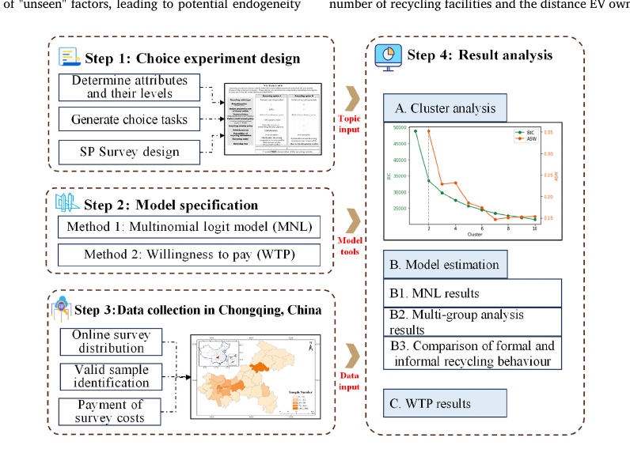
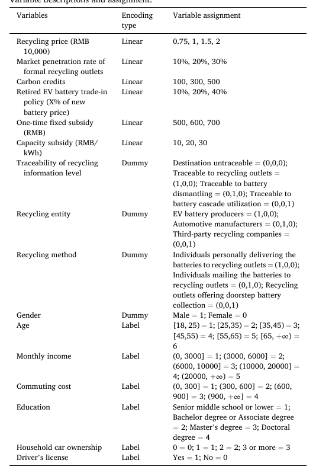
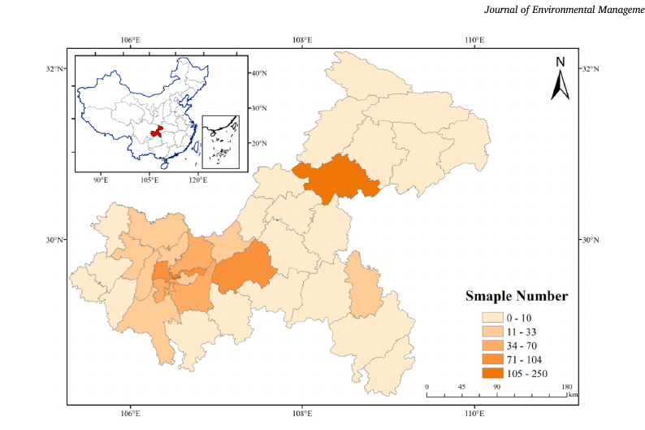
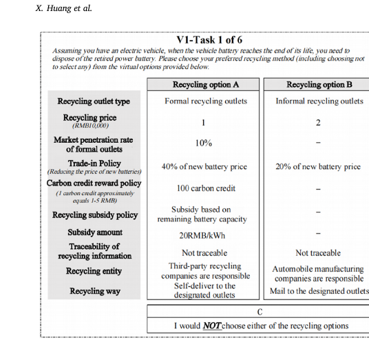
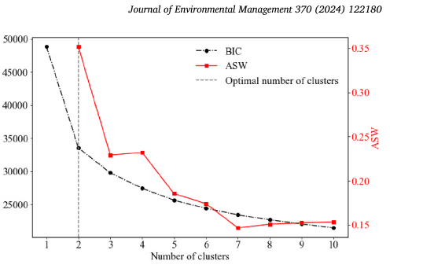
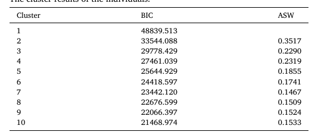

# Consumer Preference and Willingness-to-Pay for Formal Recycling of Electric Vehicle Batteries: A Discrete Choice Experiment in China

> **Nature Reader 状态：结构化重建稿（机器译文底稿，未完成人工逐句审校）**
>
> 原始文件：`消费者回收行为与意愿\Consumer preference and willingness-to-pay for formal recycling of electric .pdf`  
> 来源：Journal of Environmental Management（2024）  
> 文献类型：empirical/discrete-choice experiment  
> 总页数：12

## 阅读索引

以下页码链接指向该页第一个可提取文本块；没有可提取文本的页面会保留页码但不生成块链接。

[p.1](#s001) · [p.2](#s019) · [p.3](#s050) · [p.4](#s069) · [p.5](#s097) · p.6 · p.7 · [p.8](#s114) · [p.9](#s180) · [p.10](#s197) · [p.11](#s227) · [p.12](#s250)

## 术语表

| Canonical term | 中文 | 统一规则 |
|---|---|---|
| discrete choice experiment (DCE) | 离散选择实验（DCE） | 用于估计属性偏好 |
| willingness to pay (WTP) | 支付意愿（WTP） | 保留货币单位与符号 |
| formal recycling | 正规回收 | 与非正规回收区分 |
| random parameter logit model | 随机参数 Logit 模型 | 模型名保持一致 |
| traceability | 可追溯性 | 政策与渠道属性 |

## 全文中英对照

## Page 1

**Source:** p.1 S001 · extraction confidence: high

**Original:** Consumer preference and willingness-to-pay for formal recycling of electric vehicle batteries: A discrete choice experiment in China Xingjun Huang a,b , Song Lei c,* , Feng Liu d , Yan Li e , Fuli Zhou f,g , Ming K.

**中文:** 消费者对电动汽车电池正规回收的偏好和支付意愿：中国的离散选择实验 Xingjun Huang a,b , Song Lei c,* , Feng Liu d , Yan Li e , Fuli Zhou f,g , Ming K.

**Source:** p.1 S002 · extraction confidence: high

**Original:** Lim h,i a School of Modern Posts, Chongqing University of Posts and Telecommunication, Chongqing, PR China b Department of Land Surveying and Geo-Informatics, The Hong Kong Polytechnic University, Hung Hom, Kowloon, Hong Kong, China c School of Management Science and Engineering, Chongqing Technology and Business University, Chongqing, PR China d School of Economics and Business Administration, Chongqing University, Chongqing, PR China e Chongqing Changan Minsheng APLL Logistics Co., Ltd, Chongqing, PR China f School of Automation Science and Engineering, South China University of Technology, Guangzhou, PR China g College of Economics and Management, Zhengzhou University of Light Industry, Zhengzhou, PR China h Adam Smith Business School, University of Glasgow, Glasgow, United Kingdom i Department of Industrial Engineering Department, Khon Kaen University, Thailand

**中文:** Lim h,i a 重庆邮电大学现代邮政学院，中国重庆 b 香港理工大学土地测量与地理信息学系，中国香港九龙红磡 c 重庆工商大学管理科学与工程学院，中国重庆 d 重庆大学经济与工商管理学院，中国重庆 e 重庆长安民生 APLL 物流有限公司，中国重庆 f 华南理工大学自动化科学与工程学院，中国广州 g 郑州轻工业大学经济与管理学院，中国中国郑州 h 英国格拉斯哥大学亚当斯密商学院 i 泰国孔敬大学工业工程系

**Source:** p.1 S003 · extraction confidence: low

**Original:** Keywords:

**中文:** 关键词：

**Source:** p.1 S004 · extraction confidence: low

**Original:** Electric vehicle battery recycling Discrete choice model Recycling market preferences Recycling policies Consumer behavior A B S T R A C T The burgeoning electric vehicle (EV) market poses a substantial challenge to battery recycling systems, yet understanding EV battery recycling behavior from the demand side remains limited.

**中文:** 电动汽车电池回收 离散选择模型 回收市场偏好 回收政策 消费者行为 摘要 蓬勃发展的电动汽车 (EV) 市场对电池回收系统提出了重大挑战，但从需求方了解电动汽车电池回收行为仍然有限。

**Source:** p.1 S005 · extraction confidence: low

**Original:** Previous studies have analyzed perceptual or attitudinal factors, neglecting the observable attributes of EV battery recycling. To this end, we proposed a discrete choice model to investigate the differences between formal and informal recycling behaviors, identifying consumer preferences and willingness to pay.

**中文:** 先前的研究分析了感知或态度因素，忽略了电动汽车电池回收的可观察属性。 为此，我们提出了一个离散选择模型来研究正式和非正式回收之间的差异 行为，识别消费者偏好和支付意愿。

**Source:** p.1 S006 · extraction confidence: low

**Original:** By analyzing 1190 sample data collected from Chongqing, China, we find that: (1) The formal recycling market exhibits greater sensitivity to prices compared to the informal recycling market.

**中文:** 通过分析来自中国重庆的 1190 个样本数据，我们发现：（1）与非正规回收市场相比，正规回收市场对价格的敏感性更高。

**Source:** p.1 S007 · extraction confidence: high

**Original:** (2) The formal recycling market favors recycling by EV battery producers, whereas the informal recycling market shows the least preference for recycling by automobile pro ducers.

**中文:** （2）正规回收市场有利于电动汽车电池生产商的回收，而非正式回收市场则最不偏好汽车生产商的回收。

**Source:** p.1 S008 · extraction confidence: high

**Original:** (3) Door-to-door recycling services are the most effective in facilitating the transition from informal to formal recycling markets for EV batteries. (4) Capacity subsidy policies outperform one-time fixed subsidy policies in incentivizing formal recycling.

**中文:** (3) 上门回收服务对于促进从非正式到非正式的转变最为有效。 正式的电动汽车电池回收市场。 （4）容量补贴政策在激励正规回收方面优于一次性固定补贴政策。

**Source:** p.1 S009 · extraction confidence: high

**Original:** (5) The formal recycling market for EV batteries necessitates "trace ability to the recycling outlet", as opposed to being untraceable. (6) The high-awareness group exhibits greater sensitivity to government policies compared to those with lower environmental concerns and less knowledge of EV battery recycling.

**中文:** （5）正规的电动汽车电池回收市场需要“可追溯至回收出口”，而不是无法追踪。 （6）与环境关注度较低且对电动汽车电池回收知识较少的群体相比，高认知群体对政府政策表现出更高的敏感性。

**Source:** p.1 S010 · extraction confidence: high

**Original:** 1. Introduction

**中文:** 一、简介

**Source:** p.1 S011 · extraction confidence: low

**Original:** The increasing numbers of electric vehicles (EVs) are posing a severe waste management challenge for recycling systems at end-of-life (Harper et al., 2019, p. 75; Ding et al., 2020; Dong and Ge, 2022; Li et al., 2023).

**中文:** 电动汽车 (EV) 数量的不断增加给报废回收系统带来了严峻的废物管理挑战（Harper 等人，2019 年，第 7 页）。 75；丁等人，2020；董和葛，2022；李等人，2023）。

**Source:** p.1 S012 · extraction confidence: low

**Original:** Although EV lithium-ion batteries can theoretically last 8–10 years, their capacity drop to 80% or less after 5–6 years, making them unsuitable for powering EVs in fact (Plato Yip, 2022).

**中文:** 虽然电动汽车锂离子电池理论上可以持续 8-10年，5-6年后其容量下降至80%或更低，使得 事实上，它们不适合为电动汽车提供动力（Plato Yip，2022）。

**Source:** p.1 S013 · extraction confidence: medium

**Original:** Globally, many EV batteries are being scrapped, and by 2035, approximately 10 million will be unable to use (Plato Yip, 2022). The global EV battery recycling market is forecast to increase from a market value of $26.9 billion in 2023 to $54.3 billion in 2030, a growth of 10.5% (MarketsandMarkets, 2023).

**中文:** 在全球范围内，许多电动汽车电池正在报废，到 2035 年，大约 1000 万块电池将无法使用（Plato Yip，2022）。 全球电动汽车电池回收市场预计将从 2023 年的 269 亿美元市场价值增长到 2030 年的 543 亿美元，增长 10.5%（MarketsandMarkets，2023 年）。

**Source:** p.1 S014 · extraction confidence: low

**Original:** Of these, China is the largest market for EV battery recycling, handling around 500,000 metric tons followed by the United States and Europe with 200,000 metric tons each (Bruna Alves, 2024). However, about 80% of decommissioned batteries went to the black market in China resulting in severe environmental pollution (Xinhuanet, 2021).

**中文:** 其中，中国是最大的电动汽车电池回收市场，处理量约为 50 万吨，其次是美国和欧洲，各为 20 万吨（Bruna Alves， 2024）。然而，大约 80% 的退役电池被送往 中国黑市造成严重环境污染（新华网，2021）。

**Source:** p.1 S015 · extraction confidence: low

**Original:** Such a market is also known as "informal recycling", where small workshops without recycling qualifications and unprofes sional dismantling practices profit through high-priced recycling and lower-priced disposal (Tang et al., 2023; Tian et al., 2024).

**中文:** 这样的市场也被称为“非正规回收”，没有回收资质的小作坊和不专业的拆解行为，通过高价回收和低价处置获利（唐等，2023；田等，2024）。

**Source:** p.1 S016 · extraction confidence: low

**Original:** The coun terpart is "formal recycling, " carried out by government-issued EV battery recycling white-listed companies and regulated by the govern ment. Improving formal recycling of retired EV batteries has therefore * Corresponding author.

**中文:** 对应的是“正规回收”，由政府颁发的电动汽车电池回收白名单公司进行，并受政府监管。 因此，改善退役电动汽车电池的正式回收已经 * 通讯作者。

**Source:** p.1 S017 · extraction confidence: high

**Original:** School of Management Science and Engineering, Chongqing Technology and Business University, Chongqing, PR China. E-mail addresses: xjhuang@cqupt.edu.cn (X. Huang), leisong@ctbu.edu.cn (S.

**中文:** 重庆工商大学管理科学与工程学院，中国重庆。 电子邮箱地址：xj Huang@cqupt.edu.cn (X. 黄), leisong@ctbu.edu.cn (S.

**Source:** p.1 S018 · extraction confidence: medium

**Original:** Lei), liufengcqu@163.com (F. Liu), 2514691564@qq.com (Y. Li), deepbreath329@ outlook.com (F. Zhou), ming.lim@glasgow.ac.uk (M.K. Lim). Contents lists available at ScienceDirect Journal of Environmental Management journal homepage: www.elsevier.com/locate/jenvman Received 7 March 2024; Received in revised form 3 August 2024; Accepted 8 August 2024 Journal of Environmental Management 370 (2024) 122180 Available online 9 September 2024 0301-4797/© 2024 Elsevier Ltd.

**中文:** 雷), liufengcqu@163.com (F. 刘), 2514691564@qq.com (Y. Li），deepbreath329@outlook.com（F. 周), ming.lim@glasgow.ac.uk (M.K. 林）。 内容列表可在《ScienceDirect Journal of Environmental Management》期刊主页上找到：www.elsevier.com/locate/jenvman 2024 年 3 月 7 日收到； 2024 年 8 月 3 日收到修订版； 2024 年 8 月 8 日接受 Journal of Environmental Management 370 (2024) 122180 2024 年 9 月 9 日在线发布 0301-4797/© 2024 Elsevier Ltd.

## Page 2

**Source:** p.2 S019 · extraction confidence: low

**Original:** All rights are reserved, including those for text and data mining, AI training, and similar technologies. become ever more pressing. Policy development is also accelerating globally, aiming to stimulate the development of the EV battery recycling industry and regulate the market.

**中文:** 保留所有权利，包括文本和数据挖掘、人工智能培训和类似技术的权利。 变得更加紧迫。 全球范围内也正在加速制定政策，旨在刺激电动汽车电池回收行业的发展并规范市场。

**Source:** p.2 S020 · extraction confidence: low

**Original:** For example, the California Lithium Ion Battery Recycling Advisory Group has launched a support program for the disposal of endof-life EV batteries and the recycling of critical materials for clean en ergy vehicle batteries (Plato Yip, 2022).

**中文:** 例如，加州锂离子电池回收咨询小组启动了一项支持计划，用于处理报废电动汽车电池和回收清洁能源汽车电池的关键材料（Plato Yip，2022）。

**Source:** p.2 S021 · extraction confidence: low

**Original:** China has also issued four policies for EV battery recycling (Huang et al., 2022b). However, aca demic research on EV battery recycling is relatively limited, especially in understanding formal and informal recycling behavior.

**中文:** 中国还发布了四项电动汽车电池回收政策（Huang et al., 2022b）。 然而，阿卡 关于电动汽车电池回收的流行研究相对有限，特别是在了解正式和非正式回收行为方面。

**Source:** p.2 S022 · extraction confidence: low

**Original:** Existing studies mainly concentrate on the supply chain management of EV battery recycling, which includes aspects like recycling pricing (Ding et al., 2020; Wang et al., 2022; Zhang et al., 2023) and recycling outlet se lection (Zhu et al., 2020; Zhang et al., 2021; Lin et al., 2023).

**中文:** 现有的研究主要集中在电动汽车电池回收的供应链管理，其中包括回收定价等方面（Ding等人， 2020；王等人，2022；张等人，2023）和回收出口se （Zhu et al., 2020；Zhang et al., 2021；Lin et al., 2023）。

**Source:** p.2 S023 · extraction confidence: low

**Original:** A few studies empirically explore the underlying mechanism of EV battery recycling behavior (Tripathy et al., 2022; Li et al., 2023; Tang et al., 2023), but these studies revolve latent variables (such as consumer perceptions of ambiguity), lacking quantitative analysis of observed attributes.

**中文:** 一些研究实证探索了电动汽车电池回收行为的潜在机制（Tripathy 等人，2022；Li 等人，2023；Tang 等人， 2023），但这些研究涉及潜在变量（例如消费者 模糊性的看法），缺乏对观察到的属性的定量分析。

**Source:** p.2 S024 · extraction confidence: low

**Original:** In response, our study proposes a discrete choice model to identify the differences between formal and informal recycling behaviors and their significant influencing factors.

**中文:** 为此，我们的研究提出了一个离散选择模型，以识别正式和非正式回收行为之间的差异及其重要影响因素。

**Source:** p.2 S025 · extraction confidence: low

**Original:** The model includes nine observed attributes that have never been empirically analyzed before, such as recycling price, market penetration rate of formal recycling outlets, trade-in policy, carbon credit reward policy, recycling subsidy policy, traceability of recycling information, recycling entity, and recycling

**中文:** 该模型包括回收价格、正规回收网点市场渗透率、以旧换新政策、碳信用奖励政策、回收补贴政策、回收信息可追溯性、回收实体、回收等九个此前从未实证分析过的观察属性。

**Source:** p.2 S026 · extraction confidence: high

**Original:** method. We collected 1190 samples in Chongqing to validate the

**中文:** 方法。我们在重庆采集了1190个样本来验证

**Source:** p.2 S027 · extraction confidence: low

**Original:** feasibility of our framework. To the best of our knowledge, our study is the first to employ the discrete choice model to investigate formal and informal recycling preferences for EV batteries.

**中文:** 我们的框架的可行性。 据我们所知，我们的研究首次采用离散选择模型来调查电动汽车电池的正式和非正式回收偏好。

**Source:** p.2 S028 · extraction confidence: low

**Original:** The proposed frame work complements existing literature on understanding EV battery recycling behavior. Additionally, our study addresses the following questions: (1) What factors affect formal and informal recycling for EV batteries, especially policy preferences?

**中文:** 所提出的框架补充了有关了解电动汽车电池回收行为的现有文献。 此外，我们的研究还解决了以下问题：（1）哪些因素影响电动汽车电池的正式和非正式回收，特别是政策偏好？

**Source:** p.2 S029 · extraction confidence: low

**Original:** (2) How does consumer het erogeneity impact their recycling behaviors? (3) How can we facilitate the transition of the EV battery recycling market from informal to formal recycling?

**中文:** (2)消费者的异质性如何影响他们的回收行为？ (3) 我们如何促进 电动汽车电池回收市场从非正式回收到正式回收的转变？

**Source:** p.2 S030 · extraction confidence: high

**Original:** 2. Literature review

**中文:** 2.文献综述

**Source:** p.2 S031 · extraction confidence: low

**Original:** Our study is related to two main areas: the public's recycling pref erences for EV batteries and existing recycling policies, which identify potential research gaps.

**中文:** 我们的研究涉及两个主要领域：公众对电动汽车电池的回收偏好和现有的回收政策，这些政策确定了潜在的研究空白。

**Source:** p.2 S032 · extraction confidence: high

**Original:** 2.1. Public recycling preferences for EV batteries

**中文:** 2.1.公众对电动汽车电池的回收偏好

**Source:** p.2 S033 · extraction confidence: low

**Original:** Many factors usually influence public choice behavior, and factor identification is the basis for revealing behavioral mechanisms and a prerequisite for consumer demand guidance or behavior intervention.

**中文:** 通常影响公共选择行为的因素很多，因素识别是揭示行为机制的基础，也是消费者需求引导或行为干预的前提。

**Source:** p.2 S034 · extraction confidence: low

**Original:** Factors influencing choice behavior could be divided into perceptual (attitudinal) indicators, socio-demographic characteristics, and observ able attributes (Swait, 1994).

**中文:** 影响选择行为的因素可分为感知（态度）指标、社会人口特征和可观察属性（Swait，1994）。

**Source:** p.2 S035 · extraction confidence: low

**Original:** In this section, we focus on perceptual indicators and observable attributes, but after a literature review, we found that existing research on EV battery recycling mainly focuses on perceptual factors, lacking research on observable attributes.

**中文:** 本节我们主要关注感性指标和可观测属性，但经过文献回顾，我们发现现有的电动汽车电池回收研究主要集中在感性因素，缺乏对可观测属性的研究。

**Source:** p.2 S036 · extraction confidence: low

**Original:** Therefore, EV battery recycling behavior research is in dire need of identifying and quantifying observable attributes. The recycling field has extensive literature on the impact of perceptual indicators on recycling behavior.

**中文:** 因此，电动汽车电池回收行为研究迫切需要识别和 量化可观察的属性。 回收领域有大量关于感知指标对回收行为影响的文献。

**Source:** p.2 S037 · extraction confidence: medium

**Original:** For example, Hage et al. (2009) found that facility convenience and moral norms matter in driving Swedish households to recycle packaging waste like paper, glass, plastic and metal.

**中文:** 例如，哈格等人。 (2009) 发现设施的便利性和道德规范对于推动瑞典家庭回收纸张、玻璃、塑料和金属等包装废物很重要。

**Source:** p.2 S038 · extraction confidence: low

**Original:** Izagirre-Olaizola et al. (2015) argued that perceived consumer effectiveness significantly improves recycling behavior by university students, followed by environmental knowledge.

**中文:** 伊扎吉尔-奥莱佐拉等人。 （2015）认为，感知到的消费者有效性显着改善了大学生的回收行为，其次是环境知识。

**Source:** p.2 S039 · extraction confidence: low

**Original:** Geiger et al. (2019) indicated that recycling self-identity, personal norms towards recycling and perceived recycling behavioral control are significant predictors of recycling behavior.

**中文:** 盖革等人。 （2019）指出，回收自我认同、回收的个人规范和感知的回收行为控制是回收行为的重要预测因素。

**Source:** p.2 S040 · extraction confidence: low

**Original:** Bai and Lin (2022) found that classified knowledge and publicity help the public pay more for waste recycling. Chao et al. (2023) indicated that environmental concern (EC) has a significant positive impact on recycling behavior among university students.

**中文:** Bai和Lin（2022）发现分类知识和宣传有助于公众为废物回收支付更多费用。 曹等人。 （2023）指出，环境关注（EC）对大学生的回收行为有显着的积极影响。

**Source:** p.2 S041 · extraction confidence: low

**Original:** Chang et al. (2023) found that EC and information security risk perception significantly impact consumers' recycling of old phones. For retired EV battery recycling, factors influencing recycling behavior in other areas also have similar effects.

**中文:** 张等人。 (2023)发现EC和信息安全风险认知显着影响消费者对旧手机的回收。 对于报废电动汽车电池回收来说，影响其他领域回收行为的因素也有类似的影响。

**Source:** p.2 S042 · extraction confidence: low

**Original:** For instance, Dong and Ge (2022) suggested that perceived behavioral control, subjective norms and value-belief-norm causal chains are the most significant positive facilitators among EV battery recycling behavior.

**中文:** 例如，Dong和Ge（2022）提出，感知行为控制、主观规范和价值信念规范因果链是电动汽车电池回收行为中最重要的积极促进因素。

**Source:** p.2 S043 · extraction confidence: low

**Original:** Li et al. (2023) found that perceived convenience, policy incentives, environmental con sciousness, and subjective norms are essential drivers influencing young consumers to choose formal EV battery recycling.

**中文:** 李等人。 （2023）发现，感知便利性、政策激励、环境意识和主观规范是影响年轻消费者选择正规电动汽车电池回收的重要驱动因素。

**Source:** p.2 S044 · extraction confidence: low

**Original:** Tang et al. (2023) identified economic incentive, subjective norm, perceived behavior control and self-identity as the main antecedent variables predicting users' EV battery recycling behavior.

**中文:** 唐等人。 (2023) 将经济激励、主观规范、感知行为控制和自我认同确定为预测用户电动汽车电池回收行为的主要先行变量。

**Source:** p.2 S045 · extraction confidence: low

**Original:** On the other hand, Tripathy et al. (2022) used a hybrid Delphi method to define perceptual indicators of EV battery recycling in terms of technology, organization and environment.

**中文:** 另一方面，Tripathy 等人。 (2022)采用混合德尔菲法从技术、组织和环境方面定义了电动汽车电池回收的感知指标。

**Source:** p.2 S046 · extraction confidence: high

**Original:** 2.2. Existing recycling policies related to EV batteries

**中文:** 2.2.现有与电动汽车电池相关的回收政策

**Source:** p.2 S047 · extraction confidence: low

**Original:** Policy attributes refer to "market conditions and constraints" (Swait, 1994), and are often effective tools used by governments to incentivize pro-environmental behavior (Huang et al., 2022b).

**中文:** 政策属性是指“市场条件和约束”（Swait， 1994），并且通常是政府用来激励的有效工具 亲环境行为（Huang 等人，2022b）。

**Source:** p.2 S048 · extraction confidence: low

**Original:** Regarding recycling behavior, policy incentives can encourage active participation in waste recycling by reducing prices or increasing recycling convenience, thereby improving recycling rates (Mak et al., 2019; Tang et al., 2023).

**中文:** 对于回收行为，政策激励可以通过降低价格或增加回收便利性来鼓励积极参与废物回收，从而提高回收率（Mak等，2019；Tang等，2023）。

**Source:** p.2 S049 · extraction confidence: low

**Original:** At a broader level, Taghipour et al. (2022) indicated that in a circular economy, governments can support recycling companies in four areas: facilities, barriers, enablers and EC.

**中文:** 在更广泛的层面上，Taghipour 等人。 (2022)指出，在循环经济中，政府可以在四个领域支持回收公司：设施、障碍、推动者和EC。

## Page 3

**Source:** p.3 S050 · extraction confidence: low

**Original:** These supports include investing directly or indirectly in facilities, providing funds for new technologies or processes for companies, providing facilities or financial support for logistics and so on for companies, and setting targets for environmental development for companies.

**中文:** 这些支持包括直接或间接投资设施、为企业新技术或新工艺提供资金、为企业物流等提供设施或资金支持、为企业设定环境发展目标等。

**Source:** p.3 S051 · extraction confidence: low

**Original:** For example, Dou et al. (2023) mentioned that the widespread application of the scrappage subsidy policy can promote product recycling. Zhou et al. (2021) suggested that govern ment subsidies help businesses and individuals recycle agricultural waste.

**中文:** 例如，窦等人。 （2023）提到 报废补贴政策的广泛应用可以促进产品的回收利用。 周等人。 （2021）建议政府补贴帮助企业和个人回收农业废物。

**Source:** p.3 S052 · extraction confidence: low

**Original:** Similar to other recycling policies, EV battery recycling policies also focus on the impact of recycling subsidies. For example, Li et al. (2023) found that subsidy incentives are a notable factor driving young con sumers to choose formal recycling outlets for EV batteries.

**中文:** 与其他回收政策类似，电动汽车电池回收政策也重点关注回收补贴的影响。 例如，李等人。 （2023）发现补贴激励是推动年轻消费者选择正规电动汽车电池回收渠道的一个显着因素。

**Source:** p.3 S053 · extraction confidence: low

**Original:** Tang et al. (2023) also suggested that economic incentives, such as cash rewards, bonuses, subsidies, and tax exemptions, could encourage widespread participation in EV battery recycling.

**中文:** 唐等人。 （2023）还建议，现金奖励、奖金、补贴和免税等经济激励措施可以鼓励广泛参与电动汽车电池回收。

**Source:** p.3 S054 · extraction confidence: low

**Original:** Liu and Wang (2021) analyzed the impact of subsidizing different players in the EV supply chain on EV battery recycling. In addition to recycling subsidies, EV battery recycling involves many other policies.

**中文:** Liu和Wang（2021）分析了补贴电动汽车供应链中不同参与者对电动汽车电池回收的影响。 除了回收补贴外，电动汽车电池回收还涉及许多其他政策。

**Source:** p.3 S055 · extraction confidence: low

**Original:** For instance, Huang et al. (2022b) pro posed a recycling information traceability policy and a trade-in policy, in which the recycling information traceability policy is divided into four stages: destination untraceable, traceable to the recycler, traceable to the battery dismantling stage, and traceable to the battery cascade utilization stage.

**中文:** 例如，黄等人。 (2022b)提出了回收信息追溯政策和以旧换新政策，其中回收信息追溯政策分为 四个阶段：目的地不可追溯、可追溯至回收商、可追溯至电池拆解阶段、可追溯至电池梯级利用阶段。

**Source:** p.3 S056 · extraction confidence: low

**Original:** Their study demonstrated that such policies affect EV adoption, but it remains unclear whether they impact EV battery recycling.

**中文:** 他们的研究表明，此类政策会影响电动汽车的采用，但尚不清楚它们是否会影响电动汽车电池的回收。

**Source:** p.3 S057 · extraction confidence: low

**Original:** 2.3. Aims and gaps

**中文:** 2.3.目标和差距

**Source:** p.3 S058 · extraction confidence: low

**Original:** Our study addresses gaps in the existing literature by investigating public preferences for formal and informal recycling of EV batteries. Despite the growing importance of EV battery recycling, previous studies have primarily neglected quantitative assessments of observable attributes, focusing instead on perceptual indicators.

**中文:** 我们的研究通过调查公众对正式和非正式电动汽车电池回收的偏好，弥补了现有文献中的空白。 尽管电动汽车电池回收的重要性日益增加，但之前的研究主要忽略了可观察属性的定量评估，而是侧重于感知指标。

**Source:** p.3 S059 · extraction confidence: low

**Original:** Additionally, the potential application of discrete choice models has been overlooked in X. Huang et al. Journal of Environmental Management 370 (2024) 122180 this field. To address this, our study proposes a discrete choice model, integrating nine observable attributes to analyze public recycling pref erences comprehensively.

**中文:** 此外，离散选择模型的潜在应用在 X 中被忽视了。 黄等人。环境管理学报370(2024)122180本领域。 为了解决这个问题，我们的研究提出了一个离散选择模型， 整合九个可观察的属性来全面分析公众的回收偏好。

**Source:** p.3 S060 · extraction confidence: low

**Original:** To the best of our knowledge, our study is the first to apply the discrete choice model to elucidate the public's pref erence for formal versus informal recycling options for EV batteries, contributing novel insights to the literature.

**中文:** 据我们所知，我们的研究首次应用离散选择模型来阐明公众对电动汽车电池正式和非正式回收方案的偏好，为文献提供了新颖的见解。

**Source:** p.3 S061 · extraction confidence: low

**Original:** In addition, existing studies predominantly focus on recycling subsidy policies, with limited analysis of other potential policy impacts. In response, our study extends the scope of analysis to include trade-in policy, carbon credit incentive policy, and recycling information traceability policy.

**中文:** 此外，现有研究主要集中在回收补贴政策上，对其他潜在政策影响的分析有限。 作为回应，我们的研究扩展了 分析范围包括以旧换新政策、碳信用激励政策和回收信息追溯政策。

**Source:** p.3 S062 · extraction confidence: low

**Original:** By exploring these additional policy dimensions, we aim to provide new insights into government policy implications for EV battery recycling.

**中文:** 通过探索这些额外的政策维度，我们的目标是为电动汽车电池回收的政府政策影响提供新的见解。

**Source:** p.3 S063 · extraction confidence: high

**Original:** 3. Methodology

**中文:** 3. 方法论

**Source:** p.3 S064 · extraction confidence: low

**Original:** In this section, we will focus on the design of the choice experiment, the choice model specification, and the data collection process utilizing the method flowchart depicted in Fig. 1.

**中文:** 在本节中，我们将重点介绍选择实验的设计、选择模型规范以及利用图 1 所示的方法流程图的数据收集过程。

### Fig. 1. 在本节中，我们将重点介绍选择实验的设计、选择模型规范以及利用图 1 所示的方法流程图的数据收集过程。

**Placed near:** p.3 S064  
**Source:** p.3 S064  
**Crop confidence:** approximate-object-bounded

**Original caption:** Fig. 1. Method flow chart.

**中文图注:** 在本节中，我们将重点介绍选择实验的设计、选择模型规范以及利用图 1 所示的方法流程图的数据收集过程。

**Reading note:** 自动裁剪以图注为定位依据；正式引用图中数值前请对照原 PDF 检查裁剪边界与坐标轴。

**Source:** p.3 S065 · extraction confidence: high

**Original:** 3.1. Discrete choice experiment assumptions

**中文:** 3.1.离散选择实验假设

**Source:** p.3 S066 · extraction confidence: low

**Original:** Random utility theory underpins discrete choice experiments, assuming that decision-makers latent preferences, or latent utilities, are associated with all considered options and are present in all individuals (Louviere et al., 2010).

**中文:** 随机效用理论支持离散选择实验，假设决策者的潜在偏好或潜在效用与所有考虑的选项相关，并且存在于所有个体中（Louviere 等，2010）。

**Source:** p.3 S067 · extraction confidence: low

**Original:** These preferences consist of an observed component and a random component. The observed component en compasses all observable factors influencing the decision-maker's choices, such as covariates (e.g., age and income) and attributes (e.g., recycling cost and convenience).

**中文:** 这些偏好由观察成分和随机成分组成。 观察到的成分包括影响决策者选择的所有可观察因素，例如协变量（例如年龄和收入）和属性（例如回收成本和便利性）。

**Source:** p.3 S068 · extraction confidence: low

**Original:** The random component includes all unobserved variables affecting the decision-maker choices but are not observable to the researcher, such as unobserved attributes, measure ment errors, or instrumental variables (Louviere et al., 2010; Lerusse and van de Walle, 2021).

**中文:** 随机分量包括所有 影响决策者选择但研究人员无法观察到的未观察变量，例如未观察属性、测量误差或工具变量（Louviere 等，2010；Lerusse 和 van de Walle，2021）。

## Page 4

**Source:** p.4 S069 · extraction confidence: low

**Original:** Although discrete choice experiments are well suited to the analysis of individual behavior, they have certain inherent limitations of their own. One significant limitation is that participants evaluate a restricted number of attributes.

**中文:** 尽管离散选择实验非常适合分析个体行为，但它们本身也有某些固有的局限性。 一个重要的限制是参与者评估的属性数量有限。

**Source:** p.4 S070 · extraction confidence: low

**Original:** Some participants might base their assessments on an additional set of "unseen" factors, leading to potential endogeneity issues. To address this, we instructed participants to assume that any unmentioned characteristics were identical for both recycling outlets before making their evaluations.

**中文:** 一些参与者可能会根据一组额外的“看不见的”因素进行评估，从而导致潜在的内生性问题。 为了解决这个问题，我们指示参与者在进行评估之前假设两个回收站的任何未提及的特征都是相同的。

**Source:** p.4 S071 · extraction confidence: low

**Original:** Although this method does not completely eradicate the potential endogeneity problem caused by un mentioned attributes, it effectively reduces the risk of omitted variable bias (Lancsar and Louviere, 2006; Lerusse and van de Walle, 2021).

**中文:** 虽然这个方法不 彻底杜绝未提及属性带来的潜在内生性问题，有效降低了遗漏变量偏差的风险（Lancsar and Louviere，2006；Lerusse and van de Walle，2021）。

**Source:** p.4 S072 · extraction confidence: low

**Original:** Secondly, participants may exhibit social desirability bias when evaluating choice tasks, selecting the socially preferred alternative rather than the option they would choose in real life (Lerusse and van de Walle, 2021).

**中文:** 其次，参与者在评估选择任务时可能会表现出社会期望偏差，选择社会偏好的替代方案而不是他们在现实生活中会选择的选项（Lerusse 和 van de Walle，2021）。

**Source:** p.4 S073 · extraction confidence: low

**Original:** This social desirability bias can lead to inflated coefficient estimates. Given this inherent limitation of discrete choice experiments, we emphasize that our research focuses on stated preferences rather than actual behavior.

**中文:** 这种社会期望偏差可能导致系数估计夸大。 鉴于离散选择实验的固有局限性，我们强调我们的研究重点是陈述的偏好而不是实际行为。

**Source:** p.4 S074 · extraction confidence: low

**Original:** Therefore, we interpret our conclusions with caution.

**中文:** 因此，我们谨慎解释我们的结论。

**Source:** p.4 S075 · extraction confidence: low

**Original:** 3.2. Choice experiments design

**中文:** 3.2.选择实验设计

**Source:** p.4 S076 · extraction confidence: low

**Original:** 3.2.1. Attributes and attributes levels

**中文:** 3.2.1.属性和属性等级

**Source:** p.4 S077 · extraction confidence: low

**Original:** Our study considers nine attributes to reveal the public's preferences for formal and informal recycling of EV batteries. Table 1 illustrates all the variables and their encoding methods used in this study through linear, dummy, and label encoding.

**中文:** 我们的研究考虑了九个属性，以揭示公众对正式和非正式电动汽车电池回收的偏好。 表 1 通过线性、虚拟和标签编码说明了本研究中使用的所有变量及其编码方法。

**Source:** p.4 S078 · extraction confidence: low

**Original:** Linear encoding is employed for continuous variables, dummy encoding for non-ordered categorical variables, and label encoding for ordered variables. Regarding the service attributes of EV battery recycling, we include recycling price, the market penetration rate of formal outlets, recycling entity, and recycling method.

**中文:** 线性编码用于连续变量，虚拟编码用于无序分类变量，标签编码用于有序变量。 关于电动汽车电池回收的服务属性，我们包括回收价格、正规网点的市场渗透率、回收主体和回收方式。

**Source:** p.4 S079 · extraction confidence: low

**Original:** Recycling pricing significantly impacts the return that EV owners receive when recycling end-of-life EV batteries and is regarded as the primary factor affecting recycling behavior.

**中文:** 回收定价显着影响电动汽车车主在回收报废电动汽车电池时获得的回报，并被视为影响回收行为的主要因素。

**Source:** p.4 S080 · extraction confidence: low

**Original:** In the Chinese EV market, the recycling price for a retired EV battery generally ranges between 7500 and 20,000 RMB, depending on the recycling outlet and the battery's weight.

**中文:** 在中国电动汽车市场，报废电动汽车电池的回收价格一般在7500至2万元人民币之间，具体取决于回收地点和电池的重量。

**Source:** p.4 S081 · extraction confidence: low

**Original:** Prices at informal recycling outlets are usually higher than those at formal outlets (Huang et al., 2022b; Li et al., 2023; Su et al., 2024). Therefore, we set the recycling price levels of formal outlets as 7500 and 10,000 RMB, and prices at informal outlets are set as 15,000 and 20,000 RMB.

**中文:** 非正式回收站的价格为 通常高于正规网点（Huang et al., 2022b；Li et al., 2023；苏等人，2024）。因此，我们设定的回收价格水平为 正规网点价格为7500元、10000元，非正规网点价格为15000元、20000元。

**Source:** p.4 S082 · extraction confidence: low

**Original:** Some studies have found there exists a strong link between the number of recycling facilities and the distance EV owners are willing to Fig. 1.

**中文:** 一些研究发现，回收设施的数量与电动汽车车主愿意行驶的距离之间存在密切联系（图 1）。

**Source:** p.4 S083 · extraction confidence: low

**Original:** Method flow chart.

**中文:** 方法流程图。

**Source:** p.4 S084 · extraction confidence: medium

**Original:** Huang et al. Journal of Environmental Management 370 (2024) 122180 travel to reach them; the more facilities there are, the more willing EV owners are to recycle (Hage et al., 2009; Geiger et al., 2019).

**中文:** 黄等人。环境管理杂志 370 (2024) 122180 前往到达他们；设施越多，电动汽车车主就越愿意回收（Hage 等，2009；Geiger 等，2019）。

**Source:** p.4 S085 · extraction confidence: low

**Original:** In our study, the formal outlet market penetration rate, defined as the pro portion of formal recycling outlets to the total number of recycling outlets in the market, indicates the distribution of formal recycling outlets within the market.

**中文:** 在我们的研究中，正规回收网点市场渗透率定义为正规回收网点占市场回收网点总数的比例，反映了正规回收网点在市场内的分布情况。

**Source:** p.4 S086 · extraction confidence: low

**Original:** An increase in market penetration rate im plies an increase in formal recycling outlets, thereby reducing the travel distance to reach recycling facilities. Therefore, we believe that the formal outlet market penetration rate may influence EV owners' de cisions to choose formal outlets for recycling.

**中文:** 市场渗透率的提高意味着正规回收网点的增加，从而减少出行 到达回收设施的距离。 因此，我们认为正规网点的市场渗透率可能会影响电动车车主选择正规网点进行回收的决定。

**Source:** p.4 S087 · extraction confidence: low

**Original:** Safety has been explicitly identified as a major factor influencing the recycling of EV batteries. Safety responsibilities are primarily borne by the entity responsible for recycling, making the recycling entity a crucial factor affecting battery recycling (Thompson et al., 2020).

**中文:** 安全性已被明确确定为影响电动汽车电池回收的主要因素。 安全责任主要由负责回收的实体承担，这使得回收实体成为影响电池回收的关键因素（Thompson et al., 2020）。

**Source:** p.4 S088 · extraction confidence: medium

**Original:** Following the classification by Zhang et al. (2021), we categorize the recycling entities into three types: battery manufacturers, automobile manufacturers, and third-party recycling companies.

**中文:** 按照Zhang等人的分类。 （2021），我们将回收主体分为三类：电池制造商、汽车制造商和第三方回收公司。

**Source:** p.4 S089 · extraction confidence: low

**Original:** In the battery recycling process, con venience and privacy are factors that EV owners commonly consider, and different recycling entities have varying practicality in these aspects (Wang et al., 2011; Miliute-Plepiene et al., 2016; Cai et al., 2023; Chang et al., 2023).

**中文:** 在电池回收过程中， 便利性和隐私性是电动汽车车主普遍考虑的因素，不同的回收主体在这些方面的实用性也有所不同（Wang et al., 2011; Miliute-Plepiene et al., 2016; Cai et al., 2023; Chang et al., 2023）。

**Source:** p.4 S090 · extraction confidence: low

**Original:** Inspired by Wang et al. (2018) on the emerging door-to-door recycling method, we combine this new method with the traditional methods of postal delivery and self-delivery to recycling designated outlets.

**中文:** 受到王等人的启发。 (2018)关于新兴的上门回收方法，我们将这种新方法与传统的邮寄和自送至指定回收网点的方法相结合。

**Source:** p.4 S091 · extraction confidence: low

**Original:** We consider these three recycling methods as factors influencing retired EV battery recycling and incorporate them into our study. Regarding policy attributes, we examine carbon credits, end-of-life, and subsidy policies.

**中文:** 我们将这三种回收方法视为影响退役电动汽车电池回收的因素，并将其纳入我们的回收计划中。 研究。 关于政策属性，我们研究了碳信用额、报废政策和补贴政策。

**Source:** p.4 S092 · extraction confidence: low

**Original:** Carbon emission trading is a specialized approach aimed at maximizing the reduction of carbon emissions (Li et al., 2020). Carbon credits are a form of individual carbon trading scheme that requires governments to establish a market based on carbon credits and set trading rules, including setting initial credits and asso ciated penalties, to ensure that each offset their energy consumption in each compliance period (Starkey, 2012).

**中文:** 碳排放交易是一种旨在最大限度减少碳排放的专门方法（Li et al., 2020）。 碳信用额是个人碳交易计划的一种形式，要求政府建立基于碳信用额的市场并制定交易规则，包括设定初始信用额和相关处罚，以确保各方在每个合规期内抵消其能源消耗（Starkey，2012）。

**Source:** p.4 S093 · extraction confidence: low

**Original:** The impact of individual car bon trading schemes on the adoption of EVs has been verified, with findings suggesting that, in some cases, this policy can be a substitute for subsidized car purchases (Li et al., 2019, 2020).

**中文:** 个别汽车的影响 关于采用电动汽车的优惠交易计划已经得到验证，研究结果表明，在某些情况下，该政策可以替代汽车购买补贴（Li et al., 2019, 2020）。

**Source:** p.4 S094 · extraction confidence: low

**Original:** Therefore, we seek to understand whether carbon credits impact the recycling of retired EV batteries, hence including carbon credits in the scope of policy attribute examination.

**中文:** 因此，我们试图了解碳信用额是否会影响退役电动汽车电池的回收，从而将碳信用额纳入政策属性审查范围。

**Source:** p.4 S095 · extraction confidence: low

**Original:** Our study introduces carbon credit policies, assuming one carbon credit equals 5 RMB, and incorporates 100, 300 and 500 carbon credits into the discrete choice experiment to explore the impact of different carbon credit levels on retired EV battery recycling at autho rized recycling outlets.

**中文:** 我们的研究引入了碳信用政策，假设1个碳信用额等于5元人民币，并将100、300和500个碳信用额纳入离散选择实验，以探讨碳信用额的影响。 在授权回收点回收报废电动汽车电池的不同碳信用额水平。

**Source:** p.4 S096 · extraction confidence: low

**Original:** The trade-in policy is a method for recycling EV batteries. This approach has been widely adopted in the mobile phone and computer fields but is rarely implemented in EV manufacturers in China.

**中文:** 以旧换新政策是回收电动汽车电池的一种方法。 这种方法已在手机和计算机领域广泛采用，但在中国的电动汽车制造商中很少实施。

## Page 5

**Source:** p.5 S097 · extraction confidence: low

**Original:** The classified levels of the trade-in policy for each EV battery are 10%, 20% and 40% of the cost of a new battery (Huang et al., 2022b). Regarding the traceability of recycling information policy, Huang et al. (2022b) categorized the traceability of batteries into four stages: no recycling information traceability, traceable to the battery cascade utilization stage, traceable to the outlet stage and traceable to the battery dismantling stage, where this study also leverages the same categorizations.

**中文:** 每个电动汽车电池的以旧换新政策的分类级别为新电池成本的 10%、20% 和 40%（Huang 等，2022b）。 关于回收信息政策的可追溯性，Huang等人。 (2022b) 将电池的追溯分为四个阶段：无回收信息追溯、电池梯级利用阶段追溯、出口阶段追溯和电池拆解阶段追溯，本研究也采用同样的分类方式。

**Source:** p.5 S098 · extraction confidence: low

**Original:** Subsidy policies have effectively promoted mass recycling behavior (Mak et al., 2019; Tang et al., 2023). The Chinese government has enacted subsidy policies to stimulate the formal recycling industry.

**中文:** 补贴政策有效促进了大规模回收行为（Mak等，2019；Tang等，2023）。 中国政府制定了补贴政策来刺激正规回收行业。

**Source:** p.5 S099 · extraction confidence: low

**Original:** Standard subsidy policies include subsidies based on the remaining ca pacity of the battery and one-time fixed subsidies (Chen et al., 2022). The current subsidy standard for battery remaining capacity in the Guangxi region is approximately 20 RMB/kWh.

**中文:** 标准补贴政策包括按电池剩余容量补贴和一次性固定补贴（Chen et al., 2022）。 目前广西地区电池剩余电量补贴标准约为20元/kWh。

**Source:** p.5 S100 · extraction confidence: low

**Original:** Therefore, our study considers three subsidy levels: 10 RMB/kWh, 20 RMB/kWh, and 30 RMB/kWh (Huang et al., 2022b). Regarding one-time fixed subsidies, the standard in Shanghai is approximately 1000 RMB per vehicle, pro vided to recycling companies, and the actual subsidy amount given to EV owners may be correspondingly reduced.

**中文:** 因此，我们的研究考虑了三个补贴水平：10 元/kWh、20 元/kWh 和 30 元/kWh（Huang 等，2022b）。 对于一次性固定补贴，上海的标准为每辆车1000元左右，向回收企业提供，实际补贴金额为 电动汽车拥有者可能会相应减少。

**Source:** p.5 S101 · extraction confidence: low

**Original:** Hence, our study considers three one-time fixed subsidy values: 500 RMB, 600 RMB, and 700 RMB.

**中文:** 因此，我们的研究考虑了三种一次性固定补贴金额：500元、600元和700元。

**Source:** p.5 S102 · extraction confidence: low

**Original:** 3.2.2. Choice task generation

**中文:** 3.2.2.选择任务生成

**Source:** p.5 S103 · extraction confidence: low

**Original:** Using a complete factorial design would require generating 34,992 virtual selection tasks. However, handling many virtual tasks is impractical in practice, so an orthogonal factorial design is recom mended (Hidrue and Parsons, 2015).

**中文:** 使用完整的因子设计需要生成 34,992 个虚拟选择任务。 然而，处理许多虚拟任务在实践中是不切实际的，因此建议采用正交因子设计（Hidrue 和 Parsons，2015）。

**Source:** p.5 S104 · extraction confidence: low

**Original:** Our study utilized this method to reduce the complexity of the choice task, resulting in the generation of 53 profiles. These profiles were divided into 20 blocks, each containing six choice tasks.

**中文:** 我们的研究利用这种方法来降低选择任务的复杂性，从而产生 53 个配置文件。这些配置文件被分为 20 个块，每个块包含 六项选择任务。

**Source:** p.5 S105 · extraction confidence: low

**Original:** Upon consenting to participate in the survey, partici pants were randomly assigned to one of these blocks. Each choice task included two hypothetical recycling center profiles and a "None" option.

**中文:** 在同意参与调查后，参与者被随机分配到这些区块之一。 每个选择任务包括两个假设的回收中心配置文件和一个“无”选项。

**Source:** p.5 S106 · extraction confidence: low

**Original:** Fig. 2 illustrates an example of a choice task.

**中文:** 图 2 说明了选择任务的示例。

**Source:** p.5 S107 · extraction confidence: low

**Original:** 3.3. Model specification

**中文:** 3.3.型号规格

**Source:** p.5 S108 · extraction confidence: low

**Original:** Our study conducted a discrete choice experimental survey in which respondents were required to choose the optimal option among multiple virtual retired EV battery outlets based on their preferences.

**中文:** 我们的研究进行了一项离散选择实验调查，要求受访者根据自己的喜好在多个虚拟退役电动汽车电池插座中选择最佳选项。

**Source:** p.5 S109 · extraction confidence: low

**Original:** During this process, respondents were portrayed as rational individuals who maxi mize their utilities by carefully evaluating preferences for various recycling attributes.

**中文:** 在此过程中，受访者被描述为理性的个体，他们通过仔细评估对各种回收属性的偏好来最大化其效用。

**Source:** p.5 S110 · extraction confidence: low

**Original:** Our survey aids us in better understanding public behaviors in recycling choices within a simulated scenario (Li et al., 2020; Huang et al., 2022b). Specifically, within the given choice set (C),

**中文:** 我们的调查有助于我们更好地了解模拟场景中回收选择中的公众行为（Li 等人， 2020；黄等人，2022b)。具体来说，在给定的选择集 (C) 内，

**Source:** p.5 S111 · extraction confidence: low

**Original:** Table 1 Variable descriptions and assignment.

**中文:** 表 1 变量描述和分配。

### Table 1. 表 1 变量描述和分配。

**Placed near:** p.4 S111  
**Source:** p.4 S111  
**Crop confidence:** approximate-object-bounded

**Original caption:** Table 1 study.

**中文图注:** 表 1 变量描述和分配。

**Reading note:** 自动裁剪以图注为定位依据；正式引用图中数值前请对照原 PDF 检查裁剪边界与坐标轴。

**Source:** p.5 S112 · extraction confidence: low

**Original:** Variables Encoding type Variable assignment Recycling price (RMB Linear 0.75, 1, 1.5, 2 Market penetration rate of formal recycling outlets Linear 10%, 20%, 30% Carbon credits Linear 100, 300, 500 Retired EV battery trade-in policy (X% of new battery price) Linear 10%, 20%, 40% One-time fixed subsidy (RMB) Linear 500, 600, 700 Capacity subsidy (RMB/ kWh) Linear 10, 20, 30 Traceability of recycling information level Dummy Destination untraceable = (0,0,0); Traceable to recycling outlets = (1,0,0); Traceable to battery dismantling = (0,1,0); Traceable to battery cascade utilization = (0,0,1) Recycling entity Dummy EV battery producers = (1,0,0); Automotive manufacturers = (0,1,0); Third-party recycling companies = (0,0,1) Recycling method Dummy Individuals personally delivering the batteries to recycling outlets = (1,0,0); Individuals mailing the batteries to recycling outlets = (0,1,0); Recycling outlets offering doorstep battery collection = (0,0,1) Gender Dummy Male = 1; Female = 0 Age Label [18, 25) = 1; [25,35) = 2; [35,45) = 3; [45,55) = 4; [55,65) = 5; [65, +∞) = Monthly income Label (0, 3000] = 1; (3000, 6000] = 2;

**中文:** 变量 编码类型 变量赋值 回收价格（元） 线性 0.75、1、1.5、2 正规回收网点市场渗透率 线性 10%、20%、30% 碳信用额 线性 100、300、500 报废电池以旧换新政策（新电池价格的 X%） 线性 10%、20%、40% 一次性固定补贴（人民币） 线性 500、600、700 容量补贴金额（元/千瓦时） 线性 10、20、30 回收信息级别可追溯性 虚拟目的地不可追溯=（0,0,0）；可追溯至回收站 = (1,0,0)；可溯源至电池拆解=(0,1,0)；可追溯到电池级联利用率 = (0,0,1) 回收实体虚拟电动汽车电池生产商=（1,0,0）；汽车制造商 = (0,1,0);第三方回收公司=（0,0,1） 回收方式 假人亲自将电池送到回收网点=（1,0,0）；将电池邮寄到回收站的个人=（0,1,0）；提供上门电池收集的回收站 = (0,0,1) 性别假人 男性 = 1；女性 = 0 年龄标签 [18, 25) = 1; [25,35) = 2; [35,45) = 3; [45,55) = 4; [55,65) = 5; [65, +∞) = 月收入标签 (0, 3000] = 1; (3000, 6000] = 2;

**Source:** p.5 S113 · extraction confidence: low

**Original:** Commuting cost Label (0, 300] = 1; (300, 600] = 2; (600, Education Label Senior middle school or lower = 1; Bachelor degree or Associate degree = 2; Master's degree = 3; Doctoral degree = 4 Household car ownership Label 0 = 0; 1 = 1; 2 = 2; 3 or more = 3 Driver's license Label Yes = 1; No = 0 X.

**中文:** 通勤成本标签 (0, 300] = 1; (300, 600] = 2; (600, 教育标签高中及以下=1；学士学位或副学士学位=2；硕士学位=3；博士学位=4 家庭拥有汽车 标签0=0； 1 = 1； 2 = 2； 3 个或更多 = 3 个驾驶执照标签 是 = 1；否 = 0 X。

## Page 8

**Source:** p.8 S114 · extraction confidence: medium

**Original:** Huang et al. Journal of Environmental Management 370 (2024) 122180 the selected option has the highest utility. For respondent (n), the utility of option (Uin) encompasses an observable or systematic explanatory variable component (βXin) and an unobservable random component or error term (εin), as expressed in Equation (1).

**中文:** 黄等人。 Journal of Environmental Management 370 (2024) 122180 所选选项实用性最高。 对于受访者 (n)，选项的效用 (Uin) 包含可观察的或系统的解释变量分量 (βXin) 和不可观察的随机分量或 误差项 (εin)，如方程 (1) 所示。

**Source:** p.8 S115 · extraction confidence: low

**Original:** Uin = βXin + εin (1) Equation (2) represents the probability, denoted as Pi, of choosing alternative i over alternative j within the choice set C. Pi = Pr ( Vi + εi≥ Vj + εj, i ∈ C, i ∕ = j ) = Pr ( Vi − Vj ≥ εj − εi ) (2) Concerning willingness-to-pay (WTP), when the utility Uin is repre sented by equation (2), the partial derivatives of utility for the k-th attribute Xkn and the cost attribute Xcn can be formulated as dUin = βkdXkn + βcdXcn.

**中文:** Uin = βXin + εin (1) 方程 (2) 表示在选择集 C 中选择替代方案 i 而非替代方案 j 的概率，表示为 Pi。 Pi = Pr ( Vi + εi≥ Vj + εj, i ∈ C, i ∕ = j ) = Pr ( Vi − Vj ≥ εj − εi ) (2) 对于支付意愿 (WTP)，当效用 Uin 用方程 (2) 表示时，第 k 个属性 Xkn 和成本属性 Xcn 的效用偏导数可表示为 dUin = βkdXkn + βcdXcn。

**Source:** p.8 S116 · extraction confidence: low

**Original:** Setting this expression to 0 and solving for y results in equation (3). dXcn dXkn = WTPk = − βk βc (3)

**中文:** 将此表达式设置为 0 并求解 y 可得出方程 (3)。 dXcn dXkn = WTPk = − βk βc (3)

**Source:** p.8 S117 · extraction confidence: low

**Original:** 3.4. Data collection

**中文:** 3.4.数据收集

**Source:** p.8 S118 · extraction confidence: low

**Original:** Our study takes Chongqing, China, as the study area due to its pio neering role in EV promotion and major status in EV production base (Huang et al., 2021, 2022a, 2022b).

**中文:** 我们的研究以中国重庆为研究区域，因为该地区在电动汽车推广中的先行作用和电动汽车生产基地的主要地位（Huang et al., 2021, 2022a, 2022b）。

**Source:** p.8 S119 · extraction confidence: low

**Original:** In 2022, Chongqing experienced a remarkable surge in EV production, manufacturing 365,200 units - a 140% increase from the previous year. This surge also resulted in an installed capacity of approximately 8.6 GWh for EV batteries.

**中文:** 2022年，重庆电动汽车产量大幅增长，产量达到36.52万辆—— 比上年增长140%。这次激增也导致了 电动汽车电池装机容量约为8.6 GWh。

**Source:** p.8 S120 · extraction confidence: low

**Original:** Pro jections suggest that by 2030, the retired volume of EV batteries in Chongqing will exceed 50,000 tons, with a capacity of 5 GWh, making the city as a key for studying EV battery recycling.

**中文:** 预计到2030年，重庆电动车电池报废量将超过5万吨，容量达到5GWh，成为研究电动车电池回收利用的重点城市。

**Source:** p.8 S121 · extraction confidence: low

**Original:** The stated preference questionnaire consisted of three parts: an

**中文:** 陈述偏好调查问卷由三部分组成：

**Source:** p.8 S122 · extraction confidence: low

**Original:** introduction to the background of EV battery recycling and some atti

**中文:** 介绍电动汽车电池回收的背景和一些注意事项

**Source:** p.8 S123 · extraction confidence: low

**Original:** tudinal indicator questions, a discrete choice experimental part, and demographic characteristics. To ensure questionnaire validity, we also set six filter rules: (1) only residents living in Chongqing could complete the study.

**中文:** 趋势指标问题、离散选择实验部分和人口统计特征。 为了保证问卷的有效性，我们还设置了六项过滤规则：（1）只有居住在重庆的居民才能完成研究。

**Source:** p.8 S124 · extraction confidence: low

**Original:** (2) Participants could participate only once using the same device or IP address. (3) "The number of cars owned" was placed at the beginning and end to detect logical errors, while inconsistent responses were flagged as invalid.

**中文:** (2) 参赛者使用同一设备或IP地址只能参加一次。 （3）“拥有汽车数量”放在开头和结尾，以检测逻辑错误，不一致的回答被标记为无效。

**Source:** p.8 S125 · extraction confidence: low

**Original:** (4) Participants unfamiliar with retired EV battery recycling or the establishment rules for formal recycling outlets after reading the introduction were considered invalid responses.

**中文:** （4）参与者不熟悉报废电动汽车电池回收或正规回收网点设立规则 阅读完介绍后视为无效回复。

**Source:** p.8 S126 · extraction confidence: low

**Original:** (5) Participants without a driver's license were deemed invalid. (6) Those who select "None" for all tasks are invalid responses. As for the data collection itself, we executed two steps: (1) set six filtering rules to identify valid questionnaires; (2) mobilized all members of the team to collect data by distributing questionnaires using an online platform.

**中文:** （5）无驾驶证参加者视为无效。 (6) 所有任务均选择“无”的为无效回答。 对于数据收集本身，我们执行了两个步骤：（1）设置六种过滤规则来识别有效问卷； （2）动员全体团队成员利用网络平台发放问卷收集数据。

**Source:** p.8 S127 · extraction confidence: low

**Original:** Note that in order to ensure the randomness of the sample and try to remove the influence of convenience samples, we prioritized distrib uting the questionnaires on platforms without social networks, such as Weibo, TikTok, Xiaohongshu, and forums, followed by WeChat.

**中文:** 需要注意的是，为了保证样本的随机性并尽量消除便利样本的影响，我们优先将调查问卷分发到微博、抖音、小红书、论坛等非社交网络平台，其次是微信。

**Source:** p.8 S128 · extraction confidence: low

**Original:** As an incentive, those who provided valid responses would receive a reward in the form of a WeChat red envelope (5 yuan, about $0.69). Following the outlined steps, we surveyed Chongqing from May 8, 2023, to May 15, 2023, utilizing the Sojump platform. Finally, we collected 1190 valid questionnaires.

**中文:** 作为奖励，那些提供有效回复的人将获得微信红包形式的奖励（5元，约0.69美元）。 按照上述步骤，我们于 2023 年 5 月 8 日至 5 月 15 日对重庆进行了调查， 2023 年，利用 Sojump 平台。最终我们收集到1190条有效 问卷调查。

**Source:** p.8 S129 · extraction confidence: low

**Original:** Their spatial and geographical distribution is shown in Fig. 3.

**中文:** 其空间和地理分布如图3所示。

### Fig. 3. 其空间和地理分布如图3所示。

**Placed near:** p.6 S129  
**Source:** p.6 S129  
**Crop confidence:** approximate-object-bounded

**Original caption:** Fig. 3. Map of the spatial and geographical distribution of the sample.

**中文图注:** 其空间和地理分布如图3所示。

**Reading note:** 自动裁剪以图注为定位依据；正式引用图中数值前请对照原 PDF 检查裁剪边界与坐标轴。

**Source:** p.8 S130 · extraction confidence: low

**Original:** 4. Result

**中文:** 4. 结果

**Source:** p.8 S131 · extraction confidence: low

**Original:** In this section, we present a sample descriptive analysis, model estimation and WTP, with model estimation results including analysis of formal versus informal recycling behaviors, multi-group analysis, and comparisons of the two behaviors.

**中文:** 在本节中，我们提出了示例描述性分析、模型估计和支付意愿，模型估计结果包括正式与非正式回收行为的分析、多组分析以及两种行为的比较。

**Source:** p.8 S132 · extraction confidence: low

**Original:** 4.1. Sample description and analysis

**中文:** 4.1.样本描述与分析

**Source:** p.8 S133 · extraction confidence: low

**Original:** The description and analysis of the data involve three steps: 1) sta tistical description of the overall data; 2) employing Exploratory Factor Analysis (EFA) to identify latent variables; 3) using the k-means clus tering technique to group responses based on the concavity of latent variables.

**中文:** 数据的描述和分析涉及三个步骤：1）总体数据的统计描述； 2）采用探索性因素分析（EFA）来识别潜在变量； 3）使用k-means聚类技术根据潜在变量的凹性对响应进行分组。

**Source:** p.8 S134 · extraction confidence: low

**Original:** 4.1.1. Sample description

**中文:** 4.1.1.样品描述

**Source:** p.8 S135 · extraction confidence: low

**Original:** The demographic characteristics of the respondents are presented in Table 2. In our sample, males slightly outnumber females, constituting 55%, while females account for 45%. The age distribution is predomi nantly between 18 and 64 years old, which is similar to the gender distribution in the actual census for Chongqing (49.27% males, 50.73% females).

**中文:** 受访者的人口统计特征如表 2 所示。 在我们的样本中，男性人数略多于女性，构成 55%，女性占45%。年龄分布较多 年龄集中在18岁至64岁之间，与重庆实际人口普查的性别分布相似（男性49.27%，女性50.73%）。

**Source:** p.8 S136 · extraction confidence: low

**Original:** Specifically, 41% of the respondents were aged between 18 and 34, 48.7% were between 35 and 44, and the remaining 10.3% were between 45 and 64. In terms of education, 75.5% have a bachelor's degree, 12.6% have a graduate degree, and the remaining respondents have a high school education or lower.

**中文:** 具体来说，41%的受访者年龄在18岁至34岁之间，48.7%的受访者年龄在35岁至44岁之间，其余10.3%的受访者年龄在45岁至64岁之间。 从学历来看，本科学历占75.5%，研究生学历占12.6%，其余受访者高中及以下学历。

**Source:** p.8 S137 · extraction confidence: low

**Original:** Regarding monthly income, 60.6% of respondents earn below 10,000 RMB, 35.6% earn between 10,000 and 20,000 RMB, and the remainder earn more than 20,000

**中文:** 就月收入而言， 60.6%的受访者收入低于1万元，35.6%的受访者收入在1万元以下 1万、2万，其余收入2万以上

**Source:** p.8 S138 · extraction confidence: low

**Original:** RMB.

**中文:** 人民币。

**Source:** p.8 S139 · extraction confidence: low

**Original:** Among respondents with cars at home, 78.7% of households have one car, and only 1.1% of respondents' households have three or more cars. Additionally, 68.9% of respondents report spending between 300 and 900 RMB on commuting each month.

**中文:** 家中拥有汽车的受访者中，78.7%的家庭拥有一辆汽车，只有1.1%的受访者家庭拥有三辆及以上汽车。 此外，68.9%的受访者表示每月的通勤支出在300至900元之间。

**Source:** p.8 S140 · extraction confidence: low

**Original:** Approximately 91.4% of re spondents are willing to choose formal retired EV battery recycling outlets, whereas only 55.3% are prepared to choose informal retired EV battery recycling outlets.

**中文:** 约91.4%的受访者愿意选择正规的报废电动车电池回收网点，而只有55.3%的受访者愿意选择非正式的报废电动车电池回收网点。

**Source:** p.8 S141 · extraction confidence: low

**Original:** This trend aligns with the development di rection of formal recycling outlets for discarded EV batteries. Overall, the demographic characteristics of our sample correspond with the usage of EVs in the Chongqing region.

**中文:** 这一趋势与废旧电动汽车电池正规回收渠道的发展方向不谋而合。 总体而言， 我们样本的人口统计特征与重庆地区电动汽车的使用情况相对应。

**Source:** p.8 S142 · extraction confidence: low

**Original:** 4.1.2. Cluster analysis

**中文:** 4.1.2.聚类分析

**Source:** p.8 S143 · extraction confidence: low

**Original:** K-means clustering is an iterative algorithm that divides a dataset into several groups based on specific features of its samples. This method aims to identify subgroups with high similarity within each subgroup while ensuring significant differences between groups (Hastie et al., 2009; Hifinger et al., 2017). In model selection, clustering was per formed first, followed by regression analysis to reveal differences in influencing factors between groups (Hifinger et al., 2017; Shoabjareh et al., 2021).

**中文:** K-means 聚类是一种迭代算法，它根据样本的特定特征将数据集分为多个组。 该方法旨在识别每个子组内具有高度相似性的子组，同时确保组之间存在显着差异（Hastie 等人， 2009年； Hifinger 等人，2017）。在模型选择中，聚类是按 首先形成模型，然后进行回归分析以揭示组间影响因素的差异（Hfinger et al., 2017; Shoabjareh et al., 2021）。

**Source:** p.8 S144 · extraction confidence: low

**Original:** In K-means clustering, the researcher typically undertakes Fig. 2. Example task used in the survey (translated from the Chinese questionnaire). Huang et al. Journal of Environmental Management 370 (2024) 122180 the task of determining the number of clusters.

**中文:** 在 K 均值聚类中，研究人员通常采用图 2。 调查中使用的示例任务（翻译自中文问卷）。 黄等人。环境管理学报370(2024)122180确定集群数量的任务。

### Fig. 2. 在 K 均值聚类中，研究人员通常采用图 2。 调查中使用的示例任务（翻译自中文问卷）。 黄等人。环境管理学报370(2024)122180确定集群数量的任务。

**Placed near:** p.5 S144  
**Source:** p.5 S144  
**Crop confidence:** approximate-object-bounded

**Original caption:** Fig. 2. Example task used in the survey (translated from the Chinese comparisons of the two behaviors.

**中文图注:** 在 K 均值聚类中，研究人员通常采用图 2。 调查中使用的示例任务（翻译自中文问卷）。 黄等人。环境管理学报370(2024)122180确定集群数量的任务。

**Reading note:** 自动裁剪以图注为定位依据；正式引用图中数值前请对照原 PDF 检查裁剪边界与坐标轴。

**Source:** p.8 S145 · extraction confidence: low

**Original:** According to the vali dation results from the literature (Lezhnina and Kismihók, 2022), the Bayesian Information Criterion (BIC) elbow value and the maximum Average Silhouette Width (ASW) value were found to be more accurate than determining the number of clusters based on the minimum BIC values alone.

**中文:** 根据文献（Lezhnina 和 Kismihók，2022）的验证结果，发现贝叶斯信息准则（BIC）肘值和最大平均轮廓宽度（ASW）值比单独根据最小 BIC 值确定簇的数量更准确。

**Source:** p.8 S146 · extraction confidence: low

**Original:** Our study used EC and retired EV battery recycling knowledge (REVBRK) as the primary latent factors influencing EV owners' recycling behavior (Geiger et al., 2019; Chang et al., 2023; Li et al., 2023).

**中文:** 我们的研究使用 EC 和退役电动汽车电池回收知识 (REVBRK) 作为影响电动汽车的主要潜在因素 业主的回收行为（Geiger等，2019；Chang等，2023；Li等，2023）。

**Source:** p.8 S147 · extraction confidence: low

**Original:** A seven-point Likert scale was employed to measure re spondents' EC and REVBRK (for detailed information on measurement issues, refer to Table A.1 in Appendix A1). We conducted the EFA, and the results are presented in Table 3.

**中文:** 采用七点李克特量表来测量受访者的 EC 和 REVBRK（有关测量问题的详细信息，请参阅附录 A1 中的表 A.1）。 我们进行了 EFA，结果如表 3 所示。

**Source:** p.8 S148 · extraction confidence: low

**Original:** These dimensions collectively ac count for 59.477% of the total variance. We utilized the Keiser-Meyer-Olkin (KMO) test to assess the adequacy of principal component analysis.

**中文:** 这些维度总共占总方差的 59.477%。 我们利用 Keiser-Meyer-Olkin (KMO) 检验来评估主成分分析的充分性。

**Source:** p.8 S149 · extraction confidence: low

**Original:** The KMO value (0.879) indicates excellent sample adequacy (Kaiser, 1974). Furthermore, Bartlett's sphericity test yielded a statistic of 20731.687 (degrees of freedom = 36, p = 0.00 < 0.005), confirming the data's factorability.

**中文:** KMO 值 (0.879) 表明样品非常好 充分性（Kaiser，1974）。 此外，Bartlett 的球形度检验得出的统计量为 20731.687（自由度 = 36，p = 0.00 < 0.005），证实了数据的可分解性。

**Source:** p.8 S150 · extraction confidence: low

**Original:** The formulas for the BIC and ASW are given by Equations (4) and (5), respectively: BIC = − 2logL + plogn (4) where p represents the number of free parameters in the model, n de notes the number of observations, and L represents the maximum like lihood function of the model.

**中文:** BIC 和 ASW 的公式分别由方程 (4) 和 (5) 给出： BIC = − 2logL + plogn (4) 其中 p 表示模型中自由参数的数量，n de 表示观测值的数量，L 表示模型的最大似然函数。

**Source:** p.8 S151 · extraction confidence: low

**Original:** When the number of observations n is large, minimizing the BIC is equivalent to maximizing the posterior probability of the model. S(i) = b(i) − a(i) max{a(i), b(i)} (5) where, a(i) represents the average dissimilarity between observation ii Fig. 3.

**中文:** 当观察数n很大时，最小化BIC相当于最大化后验 模型的概率。 S(i) = b(i) − a(i) max{a(i), b(i)} (5) 其中，a(i) 表示观测值 ii 之间的平均相异度，如图 3 所示。

**Source:** p.8 S152 · extraction confidence: low

**Original:** Map of the spatial and geographical distribution of the sample.

**中文:** 样本的空间和地理分布图。

**Source:** p.8 S153 · extraction confidence: low

**Original:** Table 2 Demographic characteristics.

**中文:** 表 2 人口统计特征。

**Source:** p.8 S154 · extraction confidence: low

**Original:** Variables Categories Total Sample Count Percentage Gender Male 654 55% Female 536 45% Age 18–25 47 3.9% 55 or older 7 0.6% Education Senior middle school or lower Bachelor's degree or Associate degree Master's degree 137 11.5% Doctoral degree 13 1.1% Monthly income Under 3000 RMB 49 4.1% 3001-6000 RMB 187 19.8% 6001-10000 RMB 485 40.8% 10001-20000 RMB 424 35.6% Over 20000 RMB 45 3.8% Total monthly weekday commuting costs Under 300 RMB 236 19.8% 300-600 RMB 504 42.4% 600-900 RMB 315 26.5% Over 900 RMB 135 11.3% Total number of family cars 0 49 0.7% 3 or more 13 1.1% Willingness to choose formal EV recycling outlets Very unlikely 4 0.3% Unlikely 99 8.3% Likely 334 28.1% Very likely 753 63.3% Willingness to choose informal EV recycling outlets Very unlikely 363 30.5% Unlikely 168 14.1% Likely 229 19.2% Very likely 430 36.1% Driver's license Owned 1190 100% Table 3 Indicator and rotated factor loadings.

**中文:** 变量类别 样本总数 百分比 性别 男性 654 55% 女性 536 45% 年龄 18–25 47 3.9% 55 岁或以上 7 0.6% 教育程度 高中及以下 学士学位或副学士学位 硕士 137 11.5% 博士 13 1.1% 月收入3000元以下 49 4.1% 3001-6000元 187 19.8% 6001-10000元 485 40.8% 10001-20000元 424 35.6% 20000 元以上 45 3.8% 每月工作日通勤费用合计 300 元以下 236 19.8% 300-600元 504 42.4% 600-900元 315 26.5% 900元以上 135 11.3% 家庭轿车总数 0 49 0.7% 3个或以上 13 1.1% 愿意选择正规电动汽车回收网点 极不可能 4 0.3% 不太可能 99 8.3% 可能 334 28.1% 很有可能 753 63.3% 愿意选择非正式电动车回收网点 极不可能 363 30.5% 不太可能 168 14.1% 可能 229 19.2% 很有可能 430 36.1% 有驾照拥有 1190 100% 表 3 指标和旋转因子载荷。

**Source:** p.8 S155 · extraction confidence: low

**Original:** Indicators REVBRK EC REVBRK01 0.748 REVBRK02 0.795 REVBRK03 0.751 REVBRK04 0.795 REVBRK05 0.783 EC01 0.719 EC02 0.743 EC03 0.776 EC04 0.819 X. Huang et al. Journal of Environmental Management 370 (2024) 122180 and the other points within its cluster, while b(i) denotes the average dissimilarity between observation ii and all observations in the nearest but different cluster.

**中文:** 指标 REVBRK EC REVBRK01 0.748 REVBRK02 0.795 REVBRK03 0.751 REVBRK04 0.795 REVBRK05 0.783 EC01 0.719 EC02 0.743 EC03 0.776 EC04 0.819 X. 黄等人。 Journal of Environmental Management 370 (2024) 122180 及其簇内的其他点，而 b(i) 表示观测值 ii 与最近但不同簇中的所有观测值之间的平均差异。

**Source:** p.8 S156 · extraction confidence: low

**Original:** The ASW value ranges from − 1 to 1, where higher positive values indicate well-defined clusters characterized by intracluster cohesion and inter-cluster separation. Conversely, ASW values close to 0 or negative suggest insufficient clarity in the separation be tween clusters.

**中文:** ASW 值的范围为 - 1 到 1，其中较高的正值表示以簇内凝聚力和簇间分离为特征的明确簇。 相反，ASW 值 接近 0 或负值表明簇之间的分离不够清晰。

**Source:** p.8 S157 · extraction confidence: low

**Original:** Table 4 shows the settlement results of BIC and AWS.

**中文:** BIC和AWS的结算结果如表4所示。

### Fig. 4. BIC和AWS的结算结果如表4所示。

**Placed near:** p.7 S157  
**Source:** p.7 S157  
**Crop confidence:** approximate-object-bounded

**Original caption:** Fig. 4. Graphical output of BIC and ASW results.

**中文图注:** BIC和AWS的结算结果如表4所示。

**Reading note:** 自动裁剪以图注为定位依据；正式引用图中数值前请对照原 PDF 检查裁剪边界与坐标轴。

**Source:** p.8 S158 · extraction confidence: low

**Original:** Fig. 4 illus trates the relationship between BIC, ASW, and the number of clusters, with the vertical line indicating the optimal number of clusters (Lezhnina and Kismihók, 2022).

**中文:** 图 4 说明了 BIC、ASW 和簇数之间的关系，其中垂直线表示最佳簇数（Lezhnina 和 Kismihók，2022）。

**Source:** p.8 S159 · extraction confidence: low

**Original:** It can be observed that the optimal number of clusters is 2. Finally, two groups were obtained using the k-means method and the optimal number of clusters, as shown in Table 5.

**中文:** 可以看出，最佳簇数为2。 最后，利用k-means方法和最佳聚类数得到两组，如表5所示。

**Source:** p.8 S160 · extraction confidence: low

**Original:** The first group comprises respondents with high EC and a high

**中文:** 第一组包括具有高 EC 和高

**Source:** p.8 S161 · extraction confidence: low

**Original:** REVBRK.

**中文:** 雷布克。

**Source:** p.8 S162 · extraction confidence: low

**Original:** The second group of respondents has a lower EC and a lower REVBRK.

**中文:** 第二组受访者的 EC 和 REVBRK 较低。

**Source:** p.8 S163 · extraction confidence: low

**Original:** 4.2. Model estimation

**中文:** 4.2.模型估计

**Source:** p.8 S164 · extraction confidence: low

**Original:** This section employs the multinomial logit model (MNL) for the sample data. The model estimation process utilized Biogeme for model construction and result estimation (Bierlaire and Ortelli, 2023).

**中文:** 本节对样本数据采用多项 Logit 模型 (MNL)。 模型估计过程利用 Biogeme 进行模型构建和结果估计（Bierlaire 和 Ortelli，2023）。

**Source:** p.8 S165 · extraction confidence: low

**Original:** Tables 6 and 7 present the estimated coefficients of the variables for selecting formal versus informal recycling outlets, for both the two groups and the total sample, respectively.

**中文:** 表 6 和表 7 分别列出了两组和总样本的用于选择正式与非正式回收出口的变量的估计系数。

**Source:** p.8 S166 · extraction confidence: low

**Original:** 4.2.1. Formal recycling estimation result

**中文:** 4.2.1.正式回收估算结果

**Source:** p.8 S167 · extraction confidence: low

**Original:** Regarding formal outlet service attributes, the MNL results (see Table 6) indicate that the coefficients of recycling price, formal outlet market penetration rate, recycling entity, and recycling method exhibit positive effects at a significance level of 1%.

**中文:** 对于正规网点服务属性，MNL结果（见表6）表明，回收价格、正规网点市场渗透率、回收实体和回收方式的系数在1%的显着性水平上表现出正向影响。

**Source:** p.8 S168 · extraction confidence: low

**Original:** Specifically, the first two attributes (recycling price and formal outlet market penetration rate) positively influence respondents' choices to recycle retired EV batteries at formal outlets.

**中文:** 具体来说，前两个属性（回收价格和正规网点市场渗透率）对受访者在正规网点回收报废电动汽车电池的选择产生积极影响。

**Source:** p.8 S169 · extraction confidence: low

**Original:** Regarding preferences for recycling entities, with third-party recycling companies as the reference, respondents expressed a greater inclination to choose EV battery manufacturers over automo bile manufacturers or third-party recycling companies.

**中文:** 关于回收实体的偏好， 以第三方回收公司为参考，受访者表示更倾向于选择电动汽车电池制造商，而不是汽车制造商或第三方回收公司。

**Source:** p.8 S170 · extraction confidence: low

**Original:** Concerning preferences for recycling methods, our study finds that, compared to delivering items to designated outlets or mailing them to specified lo cations, potential EV owners are more inclined to choose recycling outlets that offer doorstep collection services.

**中文:** 关于回收方式的偏好，我们的研究发现，与将物品运送到指定网点或邮寄到指定地点相比，潜在电动车车主更倾向于选择提供上门回收服务的回收网点。

**Source:** p.8 S171 · extraction confidence: low

**Original:** Our study indicates that two of the three policy incentives (trade-in and two types of subsidy policies) significantly and effectively promote potential EV owners' choices to recycle retired EV batteries at formal outlets at a 1% significance level.

**中文:** 我们的研究表明，三项政策激励措施中的两项（以旧换新和两类补贴政策）显着且有效地促进了潜在电动汽车车主选择在正规网点回收退役电动汽车电池，显着性水平为1%。

**Source:** p.8 S172 · extraction confidence: low

**Original:** However, the carbon credit policy does not significantly impact the adoption of formal outlets for recycling retired EV batteries. Finally, regarding socio-demographic characteris tics, only age and gender exhibit significant associations at a 1% level, indicating that as age increases, potential EV owners are more willing to recycle retired EV batteries at formal outlets.

**中文:** 然而，碳信用政策并没有显着影响采用正规渠道回收退役电动汽车电池。 最后，关于社会人口特征，只有年龄和性别在 1% 的水平上表现出显着的关联， 表明随着年龄的增长，潜在的电动汽车车主更愿意在正规网点回收报废的电动汽车电池。

**Source:** p.8 S173 · extraction confidence: low

**Original:** However, individuals with higher education levels are less inclined to engage in EV battery recycling.

**中文:** 然而，受教育程度较高的人不太愿意从事电动汽车电池回收。

**Source:** p.8 S174 · extraction confidence: low

**Original:** 4.2.2. Informal recycling estimation result

**中文:** 4.2.2.非正式回收估算结果

**Source:** p.8 S175 · extraction confidence: low

**Original:** Regarding informal outlet service attributes, the MNL estimation

**中文:** 关于非正式网点服务属性，MNL 估计

**Source:** p.8 S176 · extraction confidence: low

**Original:** results (see Table 7) indicate that the coefficients of recycling price,

**中文:** 结果（见表7）表明回收价格系数，

**Source:** p.8 S177 · extraction confidence: low

**Original:** recycling entity, and recycling method mostly exhibit positive effects at a 1% significance level. Specifically, recycling price positively impacts consumers' choices to recycle retired EV batteries at informal outlets.

**中文:** 回收实体和回收方法大多在1%的显着性水平上表现出正效应。 具体而言，回收价格对消费者在非正规渠道回收退役电动汽车电池的选择产生积极影响。

**Source:** p.8 S178 · extraction confidence: low

**Original:** Concerning consumers' preferences for recycling entities, with thirdparty recycling companies as the reference, respondents expressed a greater inclination to choose third-party recycling companies over automobile manufacturers or EV battery manufacturers.

**中文:** 在消费者对回收实体的偏好方面，以第三方回收公司为参考，受访者表示更倾向于选择第三方回收公司，而不是汽车制造商或电动汽车电池制造商。

**Source:** p.8 S179 · extraction confidence: low

**Original:** As for con sumers' preferences for recycling methods, our study found that, compared to providing doorstep collection services or mailing items to specified locations, potential EV owners are more willing to choose selfdelivery to designated outlets as a recycling method.

**中文:** 至于消费者对回收方式的偏好，我们的研究发现，与提供上门回收服务或邮寄物品到指定地点相比，潜在电动汽车车主更愿意选择自送至指定网点作为回收方式。

## Page 9

**Source:** p.9 S180 · extraction confidence: low

**Original:** Regarding sociodemographic characteristics, our findings indicate that older in dividuals hold a positive attitude toward informal outlet recycling of retired EV batteries, while individuals with higher education levels ex press a negative attitude.

**中文:** 关于社会从人口特征来看，我们的研究结果表明，老年人对退役电动汽车电池的非正式回收持积极态度，而受教育程度较高的人则持消极态度。

**Source:** p.9 S181 · extraction confidence: low

**Original:** 4.2.3. Multi-group analysis results

**中文:** 4.2.3.多组分析结果

**Source:** p.9 S182 · extraction confidence: low

**Original:** Through cluster analysis, we categorized the entire sample into two groups based on two latent variables, EC and REVBRK. The first group comprises individuals with high EC and REVBRK, while the second group comprises those with relatively lower EC and REVBRK.

**中文:** 通过聚类分析，我们根据两个潜在变量 EC 和 REVBRK 将整个样本分为两组。 第一组包括具有高 EC 和 REVBRK 的个体，而第二组包括具有相对较低 EC 和 REVBRK 的个体。

**Source:** p.9 S183 · extraction confidence: low

**Original:** These groups exhibit differences in the utility coefficient for selecting EV battery recycling outlets, reflecting distinct attitudes toward recycling outlet preferences.

**中文:** 这些群体在选择电动汽车电池回收网点的效用系数上存在差异，反映出对回收网点偏好的不同态度。

**Source:** p.9 S184 · extraction confidence: low

**Original:** Concerning formal recycling outlet attributes (see Table 6), both groups share the same preferences for recycling price and type of sub sidy policy, showing acceptance of higher recycling prices and a pref erence for capacity subsidies over one-time fixed subsidies.

**中文:** 就正式的回收渠道属性而言（见表6），两组群体对回收价格和补贴政策类型的偏好相同，显示出接受较高的回收价格并且偏好容量补贴而非一次性固定补贴。

**Source:** p.9 S185 · extraction confidence: low

**Original:** Other than that, Group 1 has more choice preferences, and Group 2 has very few. Specifically, market penetration and trade-in policies can incentivize Group 1 to opt for formal recycling, while Group 2 remains indifferent.

**中文:** 除此之外，第一组的选择偏好较多，第二组的选择偏好很少。 具体来说，市场渗透和以旧换新政策可以激励第一组选择正规回收，而第二组则保持冷漠。

**Source:** p.9 S186 · extraction confidence: low

**Original:** Regarding the recycling entity, both groups are more likely to choose EV battery manufacturer recycling for formal recycling than third-party recycling companies. However, Group 1 is less likely to choose formal recycling if the car manufacturer recycles, and Group 2 doesn't care.

**中文:** 在回收主体方面，两类群体都更倾向于选择电动汽车电池制造商回收进行正规回收，而不是第三方回收公司。 不过，如果汽车制造商回收的话，第一组不太可能选择正规回收，而第二组则不在乎。

**Source:** p.9 S187 · extraction confidence: low

**Original:** In terms of the recycling method, if it was mailed to the designated outlet, Group 1 would be less inclined to choose formal recycling, and Group 2 would not care. As for the information traceability policy, if it is trace able to the battery cascade utilization stage, Group 1 will be less inclined to opt for formal recycling, and Group 2 will not care.

**中文:** 在回收方式上，如果邮寄到指定网点， 第一组不太愿意选择正规回收，第二组则不在乎。 至于信息追溯政策，如果能追溯到电池梯次利用阶段，第一组就不太愿意选择正规回收，第二组则不会在意。

**Source:** p.9 S188 · extraction confidence: low

**Original:** Regarding de mographic characteristics, age is a significant factor influencing the choice of formal recycling for Group 1 but not for Group 2. As for informal recycling outlet attributes (see Table 7), both groups still share the same preferences for recycling price and type of subsidy policy.

**中文:** 关于人口特征，年龄是影响第 1 组选择正规回收的重要因素，但对于第 2 组则不是。 至于非正式回收网点属性（见表7），两个群体对回收价格和补贴政策类型的偏好仍然相同。

**Source:** p.9 S189 · extraction confidence: low

**Original:** Regarding recycling entities, Group 2 is less likely to choose informal recycling if it is EV battery recycling, and Group 1 is not Table 4 The cluster results of the individuals.

**中文:** 对于回收实体，如果是电动汽车电池回收，组2不太可能选择非正式回收，而组1则不是表4中个体的聚类结果。

### Table 4. 对于回收实体，如果是电动汽车电池回收，组2不太可能选择非正式回收，而组1则不是表4中个体的聚类结果。

**Placed near:** p.7 S189  
**Source:** p.7 S189  
**Crop confidence:** approximate-object-bounded

**Original caption:** Table 4 recycling if the car manufacturer recycles, and Group 2 doesn’t care. In

**中文图注:** 对于回收实体，如果是电动汽车电池回收，组2不太可能选择非正式回收，而组1则不是表4中个体的聚类结果。

**Reading note:** 自动裁剪以图注为定位依据；正式引用图中数值前请对照原 PDF 检查裁剪边界与坐标轴。

**Source:** p.9 S190 · extraction confidence: low

**Original:** Cluster BIC ASW Fig. 4. Graphical output of BIC and ASW results. Huang et al. Journal of Environmental Management 370 (2024) 122180 concerned. Regarding the recycling method, Group 1 is less inclined to select informal recycling if it involves mailing to the designated outlet, while Group 2 is not significant.

**中文:** 集群 BIC ASW 图 4. BIC 和 ASW 结果的图形输出。 黄等人。环境管理学报370(2024)122180有关。 在回收方式上，如果涉及邮寄到指定网点，第一组不太倾向于选择非正式回收，而第二组则不那么重要。

**Source:** p.9 S191 · extraction confidence: low

**Original:** Regarding demographic characteristics, age and education influence the informal recycling choices of Group 1 but not Group 2.

**中文:** 关于人口特征，年龄和教育程度影响第一组的非正式回收选择，但不影响第二组。

**Source:** p.9 S192 · extraction confidence: low

**Original:** 4.2.4. Comparison of formal and informal recycling behavior

**中文:** 4.2.4.正式和非正式回收行为的比较

**Source:** p.9 S193 · extraction confidence: low

**Original:** There are significant differences between potential EV users' preferences for formal versus informal recycling of vehicle batteries, and in this section, we focus more on the differences and how to facilitate the conversion of the user market from informal to formal recycling.

**中文:** 潜在电动汽车用户对正规和非正规汽车电池回收的偏好存在显着差异，在本节中，我们将更多地关注这些差异以及如何促进用户市场从非正规回收向正规回收的转变。

**Source:** p.9 S194 · extraction confidence: low

**Original:** Regarding recycling service attributes, the price of recycling is a sig nificant factor. The recycling price coefficient of formal recycling (1.99, see Table 6) is greater than that for informal recycling (1.32, see Table 7), and an increase in the recycling price is more conducive to facilitating the conversion of informal recycling to formal recycling.

**中文:** 就回收服务属性而言，回收价格是一个重要因素。 正规回收的回收价格系数（1.99，见表6）大于非正规回收的回收价格系数（1.32，见表7），回收价格的提高更有利于促进非正规回收向正规回收转化。

**Source:** p.9 S195 · extraction confidence: low

**Original:** Table 5 The cluster results of the individuals.

**中文:** 表5 个体聚类结果。

### Table 5. 表5 个体聚类结果。

**Placed near:** p.7 S195  
**Source:** p.7 S195  
**Crop confidence:** approximate-object-bounded

**Original caption:** Table 5. The first group comprises respondents with high EC and a high

**中文图注:** 表5 个体聚类结果。

**Reading note:** 自动裁剪以图注为定位依据；正式引用图中数值前请对照原 PDF 检查裁剪边界与坐标轴。

**Source:** p.9 S196 · extraction confidence: low

**Original:** Cluster Label Group1 (High EC and high REVBRK) Group2 (Low EC and low REVBRK) Size Item Value Item Value Average index of latent variable attributes REVBRK 01 6.59 REVBRK 01 5.54 REVBRK 02 6.42 REVBRK 02 4.85 REVBRK 03 6.51 REVBRK 03 5.41 REVBRK 04 6.46 REVBRK 04 5.06 REVBRK 05 6.47 REVBRK 05 5.26 EC01 6.65 EC01 5.99 EC02 6.56 EC02 5.84 EC03 6.59 EC03 5.56 EC04 6.65 EC04 5.84 Table 6 The model estimation results of selecting formal outlets for groups.

**中文:** 聚类标签 Group1（高 EC 和高 REVBRK） Group2（低 EC 和低 REVBRK） 大小 项目 值 项目 值 潜在变量属性的平均索引 REVBRK 01 6.59 REVBRK 01 5.54 REVBRK 02 6.42 REVBRK 02 4.85 REVBRK 03 6.51 REVBRK 03 5.41 REVBRK 04 6.46 REVBRK 04 5.06 REVBRK 05 6.47 REVBRK 05 5.26 EC01 6.65 EC01 5.99 EC02 6.56 EC02 5.84 EC03 6.59 EC03 5.56 EC04 6.65 EC04 5.84 表6 群体选择正式网点的模型估计结果。

## Page 10

**Source:** p.10 S197 · extraction confidence: low

**Original:** Variables MNL Cluster analysis-MNL Estimate Std. Err (t-test) G1 G2 Estimate Std. Err (t-test) Estimate Std. Err (t-test) Recycling outlet attribute Rrecycling price 1.99a Market penetration 0.477a Recycling entity EV battery producers 0.228a Automotive manufacturers − 0.148b Third-party recycling companies Based Based Based Based Based Based Recycling method Recycling outlets offering doorstep battery collection 0.325a Mail to the designated outlets − 0.171a Self-deliver to the designated outlets Based Based Based Based Based Based Policy attribute Trade-in policy 0.628a Carbon credit 0.000146 0.000154 (0.948) 0.000171 0.000183 (0.938) 9.38e-05 0.00029 (0.324) Subsidy based on remaining battery capacity 0.0195a

**中文:** 变量 MNL 聚类分析 - MNL 估计标准。 Err（t 检验）G1 G2 估计标准。 错误（t 检验）估计标准。 Err (t 检验) 回收网点属性 R 回收价格 1.99a 市场渗透率 0.477a 回收实体电动汽车电池生产商 0.228a 汽车制造商 - 0.148b 第三方回收公司 回收方式 上门回收电池 0.325a 邮寄至指定网点 - 0.171a 自送至指定网点 基础 基础 基础 基础 基础 基础 政策属性 以旧换新政策 0.628a 碳信用额 0.000146 0.000154 (0.948) 0.000171 0.000183 (0.938) 9.38e-05 0.00029 (0.324) 根据剩余电池容量进行补贴 0.0195a

**Source:** p.10 S198 · extraction confidence: low

**Original:** One-time fixed subsidy 0.000473a Information traceability policy Traceable to the battery dismantling stage − 0.105 0.0743 (− 1.41) − 0.101 0.0882 (− 1.14) − 0.107 0.14 (− 0.764) Traceable to the outlet stage 0.329a Traceable to the battery cascade utilization stage − 0.175b No recycling information traceability Based Based Based Based Based Based Demographic attributes Gender − 0.109 0.183 (− 0.598) − 0.173 0.236 (− 0.733) 0.0487 0.3 (0.162) Age 0.27b Education − 0.37b Commuting cost 0.00281 0.101 (− 0.0279) − 0.0279 0.126 (− 0.221) 0.0241 0.18 (0.134) Monthly income − 0.0643 0.109 (− 0.589) − 0.0202 0.141 (− 0.144) − 0.0992 0.179 (− 0.544) Number of cars 0.117 0.2 (0.583) 0.257 0.281 (0.915) 0.0473 0.306 (0.151) Constants Formal recycling outlet 0.851 0.665 (1.28) 0.19 0.898 (0.212) 1.05 1.04 (1) None Based Based Based Based Based Based Number of observations 6873 4848 2025 Log-likelihood − 4960.287 − 3454.47 − 1466.488 Rho-square 0.0757 0.205 0.000131 Adjusted rho-square 0.343 0.351 0.341

**中文:** 一次性固定补助0.000473a 信息追溯政策 可追溯至电池拆解阶段 − 0.105 0.0743 (− 1.41) − 0.101 0.0882 (− 1.14) − 0.107 0.14 (− 0.764) 可追溯至出口阶段 0.329a 可追溯到电池级联利用阶段 - 0.175b 无回收信息可追溯性 基于 基于 基于 基于 基于 人口统计属性 性别 − 0.109 0.183 (− 0.598) − 0.173 0.236 (− 0.733) 0.0487 0.3 (0.162) 年龄 0.27b 教育程度 - 0.37b 交通费 0.00281 0.101 (− 0.0279) − 0.0279 0.126 (− 0.221) 0.0241 0.18 (0.134) 月收入 − 0.0643 0.109 (− 0.589) − 0.0202 0.141 (− 0.144) − 0.0992 0.179 (− 0.544) 汽车数量 0.117 0.2 (0.583) 0.257 0.281 (0.915) 0.0473 0.306 (0.151) 常数 正式回收出口 0.851 0.665 (1.28) 0.19 0.898 (0.212) 1.05 1.04 (1) 无 基于 基于 基于 基于 基于 基于 观测数量 6873 4848 2025 对数似然 − 4960.287 − 3454.47 − 1466.488 Rho 平方 0.0757 0.205 0.000131 调整后的 rho 平方0.343 0.351 0.341

**Source:** p.10 S199 · extraction confidence: low

**Original:** Standard errors are in parentheses. a p < 0.01. b p < 0.05. c p < 0.1. Huang et al. Journal of Environmental Management 370 (2024) 122180 Regarding the recycling entity, users who choose informal recycling prefer third-party companies to recycle EV batteries, while those who choose formal recycling prefer EV battery companies to recycle.

**中文:** 标准误差在括号内。 p < 0.01。 b p < 0.05。 cp < 0.1。 黄等人。环境管理学报370(2024)122180 从回收主体来看，选择非正式回收的用户更倾向于第三方公司回收电动汽车电池，而选择正规回收的用户则更倾向于电动汽车电池公司回收。

**Source:** p.10 S200 · extraction confidence: low

**Original:** Therefore, recycling of EV batteries by EV battery companies is signifi cantly better than recycling by EV manufacturers and recycling by thirdparty companies and is more conducive to facilitating the trans formation of the market from informal to formal recycling.

**中文:** 因此，电动汽车电池企业对电动汽车电池的回收明显优于电动汽车制造商回收和第三方公司回收，更有利于促进市场从非正式回收向正式回收的转变。

**Source:** p.10 S201 · extraction confidence: low

**Original:** In terms of recycling methods, users who chose informal recycling preferred to selfdeliver their batteries to designated recycling outlets, while those who chose formal recycling preferred door-to-door collection.

**中文:** 从回收方式来看，选择非正规回收的用户更倾向于将电池自行送到指定回收网点，而选择正规回收的用户则更倾向于上门回收。

**Source:** p.10 S202 · extraction confidence: low

**Original:** Therefore, door-to-door recycling is essential in stimulating the formal recycling market for EV batteries.

**中文:** 因此，上门回收对于促进正规回收至关重要。 电动汽车电池市场。

**Source:** p.10 S203 · extraction confidence: low

**Original:** 4.3. Willingness to pay

**中文:** 4.3.支付意愿

**Source:** p.10 S204 · extraction confidence: low

**Original:** Table 8 presents the WTP for recycling outlet and policy attributes, calculated based on the coefficients obtained from Tables 6 and 7. These WTP values are determined by the ratio of the respective attribute co efficients to the purchase price coefficient.

**中文:** 表 8 列出了回收渠道和政策属性的 WTP，根据表 6 和表 7 获得的系数计算。 这些WTP值由各自属性系数与购买价格系数的比率确定。

**Source:** p.10 S205 · extraction confidence: low

**Original:** First, it is observed that in dividuals exhibit a higher WTP for policy attributes, while the WTP for recycling outlet attributes is relatively lower, as detailed in Table 8.

**中文:** 首先，观察到个人对政策属性表现出较高的WTP，而对回收出口属性的WTP相对较低，如表8所示。

**Source:** p.10 S206 · extraction confidence: low

**Original:** When selecting formal recycling outlets, individuals demonstrate the highest WTP for the trade-in policy. An increase of 10% in the trade-in policy incentive leads individuals to accept a reduction of 3156 RMB in recycling returns.

**中文:** 在选择正规回收网点时，个人对以旧换新政策表现出最高的支付意愿。 以旧换新政策激励增加10%，个人可以接受回收退货减少3156元。

**Source:** p.10 S207 · extraction confidence: low

**Original:** Second, regarding recycling methods, Individuals are willing to accept a 1633 RMB reduction in recycling returns for the convenience of doorstep collection by recycling merchants compared to self-delivery to designated outlets.

**中文:** 其次，在回收方式上，与自行送到指定网点相比，为了方便回收商上门回收，个人愿意接受回收退货减少1633元。

**Source:** p.10 S208 · extraction confidence: low

**Original:** Third, the market penetration rate of formal outlets is one of the crucial factors individuals consider. Ac cording to Table 7 with every 10% increase in the market penetration rate of formal outlets, individuals are willing to accept a decrease of

**中文:** 第三，正规网点的市场渗透率是个人考虑的关键因素之一。 乙酰胆碱 根据表7，正规网点市场渗透率每提高10%，个人愿意接受的

**Source:** p.10 S209 · extraction confidence: low

**Original:** 2397 RMB in recycling returns.

**中文:** 回收收益2397元。

**Source:** p.10 S210 · extraction confidence: low

**Original:** When choosing informal recycling outlets, individuals exhibit a significantly higher WTP for the trade-in policy than other attributes. An increase of 10% in the trade-in policy incentive leads individuals to accept a reduction of 8939 RMB in recycling returns.

**中文:** 在选择非正式回收渠道时，个人对以旧换新政策的支付意愿明显高于其他属性。 以旧换新政策激励增加10%，个人可以接受回收退货减少8939元。

**Source:** p.10 S211 · extraction confidence: low

**Original:** Secondly, con cerning the recycling entity, choosing automotive manufacturers over third-party recycling companies increases the recycling returns by 3038 RMB, indicating that individuals are more willing to pay for the service provided by third-party recycling companies.

**中文:** 其次，就回收主体而言，选择汽车制造商而非第三方回收公司，回收收益增加了3038元，表明个人更愿意为第三方回收公司提供的服务付费。

**Source:** p.10 S212 · extraction confidence: low

**Original:** Finally, regarding recy cling methods, selecting recycling outlets offering doorstep battery collection over self-delivering to designated outlets increases the acceptable recycling returns by 3416 RMB.

**中文:** 最后，关于回收 坚持方法，选择提供上门电池收集的回收网点而不是自行运送到指定网点，使可接受的回收收益增加了 3416 元。

**Source:** p.10 S213 · extraction confidence: low

**Original:** Table 7 The model estimation results of selecting informal outlets for groups.

**中文:** 表7 群体选择非正式渠道的模型估计结果。

**Source:** p.10 S214 · extraction confidence: low

**Original:** Variables MNL Cluster analysis-MNL Estimate Std. Err (t-test) G1 G2 Estimate Std. Err (t-test) Estimate Std. Err (t-test) Recycling outlet attribute Recycling price 1.32a Recycling entity EV battery producers − 0.111c Automotive manufacturers − 0.401a Third-party recycling companies Based Based Based Based Based Based Recycling method Recycling outlets offering doorstep battery collection − 0.451a Mail to the designated outlets − 0.178a Self-deliver to the designated outlets Based Based Based Based Based Based Policy attribute Trade-in policy 1.18a Demographic Factors attribute Gender 0.164 0.182 (0.9) 0.222 0.236 (0.943) 0.0286 0.289 (0.096) Age 0.229c

**中文:** 变量 MNL 聚类分析 - MNL 估计标准。 Err（t 检验）G1 G2 估计标准。 错误（t 检验）估计标准。 Err (t 检验) 回收网点属性 回收价格 1.32a 回收实体电动汽车电池生产商 - 0.111c 汽车制造商 − 0.401a 第三方回收公司 依据 依据 依据 依据 回收方法 提供上门电池收集的回收网点 − 0.451a 邮寄至指定网点 - 0.178a 自送货到指定网点 基础 基础 基础 基础 基础 基础 政策属性 以旧换新政策 1.18a 人口因素属性 性别 0.164 0.182 (0.9) 0.222 0.236 (0.943) 0.0286 0.289 (0.096) 年龄 0.229c

**Source:** p.10 S215 · extraction confidence: low

**Original:** Education − 0.385b Commuting cost 0.0278 0.101 (0.277) − 0.0273 0.126 (− 0.217) 0.0943 0.178 (0.529) Monthly income 0.0169 0.109 (0.155) 0.0803 0.14 (0.572) − 0.0567 0.178 (− 0.319) Number of cars − 0.00736 0.2 (− 0.0368) 0.131 0.281 (0.462) − 0.0897 0.304 (− 0.295) Constants Informal recycling outlet 1.22c None Based Based Based Based Based Based Number of observations 6873 4848 2025 Log-likelihood − 4960.287 − 3454.47 − 1466.488 Rho-square 0.0757 0.205 0.000131 Adjusted rho-square 0.343 0.351 0.341 Standard errors are in parentheses.

**中文:** 教育程度 - 0.385b 通勤费用 0.0278 0.101 (0.277) − 0.0273 0.126 (− 0.217) 0.0943 0.178 (0.529) 月收入 0.0169 0.109 (0.155) 0.0803 0.14 (0.572) − 0.0567 0.178 (− 0.319) 汽车数量 − 0.00736 0.2 (− 0.0368) 0.131 0.281 (0.462) − 0.0897 0.304 (− 0.295) 常数 非正式回收出口 1.22c 无 基于 基于 基于 基于 基于 观测数 6873 4848 2025 对数似然 − 4960.287 − 3454.47 − 1466.488 Rho 平方 0.0757 0.205 0.000131 调整后的 rho 平方 0.343 0.351 0.341 标准误差在括号中。

**Source:** p.10 S216 · extraction confidence: low

**Original:** Table 8 Marginal WTP for changes in vehicle and policy attributes.

**中文:** 表 8 车辆和保单属性变化的边际支付意愿。

**Source:** p.10 S217 · extraction confidence: low

**Original:** Recycling outlets type FMRO (RMB) IFMRO (RMB) Recycling outlet attribute Market penetration − 2397 – Recycling entity EV battery producers − 1146 841 Automotive manufacturers 744 3038 Third-party recycling companies Based Based Recycling method Recycling outlets offering doorstep battery collection − 1633 3416 Mail to the designated outlets 859 1348 Self-deliver to the designated outlets Based Based Policy attribute Trade-in policy − 3156 − 8939 Subsidy policy Capacity subsidy − 98 – One-time fixed subsidy − 2 – Information traceability policy Traceable to the outlet stage − 1653 – Traceable to the battery cascade utilization stage 884 – No recycling information traceability Based – X.

**中文:** 回收网点类型 FMRO（人民币） IFMRO（人民币） 回收网点属性 市场渗透率 − 2397 – 回收实体电动车电池生产商 − 1146 841 汽车制造商 744 3038 第三方回收公司 基于 基础 回收方式 提供上门电池回收的回收网点 − 1633 3416 邮寄到指定网点 859 1348 自送至指定基于网点 基于 政策属性 以旧换新政策 − 3156 − 8939 补贴政策 容量补贴 − 98 – 一次性定额补贴 − 2 – 信息追溯政策 可追溯至出口阶段 − 1653 – 可追溯至电池梯级利用阶段 884 – 无回收信息追溯 基于 – X.

**Source:** p.10 S218 · extraction confidence: high

**Original:** Huang et al. Journal of Environmental Management 370 (2024) 122180

**中文:** 黄等人。环境管理学报370(2024)122180

**Source:** p.10 S219 · extraction confidence: high

**Original:** 5. Discussion

**中文:** 5. 讨论

**Source:** p.10 S220 · extraction confidence: high

**Original:** 5.1. Theoretical contributions

**中文:** 5.1.理论贡献

**Source:** p.10 S221 · extraction confidence: low

**Original:** Our study contributes to the existing knowledge base in three main aspects. First, our study proposes a discrete choice model to identify the choice preferences of formal and informal recycling for EV battery recycling.

**中文:** 我们的研究在三个主要方面对现有知识库做出了贡献。 首先，我们的研究提出了一个离散选择模型来确定电动汽车电池回收的正式和非正式回收的选择偏好。

**Source:** p.10 S222 · extraction confidence: low

**Original:** To the best of our knowledge, our study is the first to be used to reveal observable attribute preferences for EV battery recycling. Second, we introduce new attributes from the recycling service and policy perspectives, such as recycling entities, recycling methods, tradein policies, carbon credit policies, subsidy policies, and information traceability policies, to quantify the market's choice preferences and policy influence.

**中文:** 据我们所知，我们的研究是第一个用于揭示电动汽车电池回收可观察属性偏好的研究。 其次，我们从回收服务和政策角度引入新的属性，如回收主体、回收方式、以旧换新政策、碳信用政策、补贴政策、信息追溯政策等，量化市场的选择偏好和政策影响。

**Source:** p.10 S223 · extraction confidence: low

**Original:** These attributes have not been analyzed in existing studies, yet they are essential for an in-depth understanding of the EV battery recycling market. Finally, we reveal consumer heterogeneity in the EV battery recycling market by using multi-group analysis and comparing the differences.

**中文:** 现有研究尚未分析这些属性，但它们对于深入了解电动汽车电池回收市场至关重要。 最后，我们通过多组分析和分析揭示了电动汽车电池回收市场中消费者的异质性 比较差异。

**Source:** p.10 S224 · extraction confidence: low

**Original:** Finally, our results show that most of the proposed attributes are significant for formal recycling options for EV batteries, except for carbon credit policies, which are not significant.

**中文:** 最后，我们的结果表明，大多数提出的属性对于电动汽车电池的正式回收选择都很重要，但碳信用政策除外，后者并不重要。

**Source:** p.10 S225 · extraction confidence: low

**Original:** Regarding demographic variables, we found that only age and education affect EV battery recycling.

**中文:** 关于人口变量，我们发现只有年龄和教育程度会影响电动汽车电池的回收。

**Source:** p.10 S226 · extraction confidence: high

**Original:** 5.2. Managerial implications

**中文:** 5.2.管理影响

## Page 11

**Source:** p.11 S227 · extraction confidence: low

**Original:** Our study also provides valuable management insights for govern ment policy-making and demand guidance for the EV battery recycling industry. The market penetration of formal recycling outlets is essential for the formal recycling of EV batteries, especially for potential EV users with high EC and REVBRK.

**中文:** 我们的研究还为政府决策和电动汽车电池回收行业的需求指导提供了宝贵的管理见解。 正规回收网点的市场渗透对于电动汽车电池的正规回收至关重要，特别是对于具有高 EC 和 REVBRK 的潜在电动汽车用户。

**Source:** p.11 S228 · extraction confidence: low

**Original:** A higher market penetration implies that formal recycling outlets are more widely available, allowing consumers to choose them for battery recycling conveniently. The shortage of formal recycling outlets has consistently been a significant obstacle to the recycling of retired EV batteries in China, with statistics indicating that the market share of formal recycling outlets is currently less than 25% (Li et al., 2023). Therefore, the government and enterprises should focus on promoting more formal recycling outlets and, simultaneously, publicizing Group 1 users to increase the amount of recycling from formal recycling outlets.

**中文:** 市场渗透率越高，意味着正规回收网点越广泛，消费者可以方便地选择正规回收网点进行电池回收。 缺乏正规的回收网点一直是一个重大障碍 我国报废电动汽车电池回收情况，统计数据显示，目前正规回收网点市场占有率不足 25%（Li 等人，2023）。因此，政府和企业应该 重点推广正规回收网点，同时宣传1类用户增加正规回收网点的回收量。

**Source:** p.11 S229 · extraction confidence: low

**Original:** Regarding the recycling entity, the formal EV battery recycling market favors recycling by EV battery manufacturers over third-party recyclers, while recycling by car manufacturers is the least effective

**中文:** 从回收主体来看，正规的电动车电池回收市场更倾向于电动车电池制造商的回收而不是第三方回收商的回收，而汽车制造商的回收效率最低

**Source:** p.11 S230 · extraction confidence: low

**Original:** method. This finding may be because EV battery manufacturers are

**中文:** 方法。这一发现可能是因为电动汽车电池制造商

**Source:** p.11 S231 · extraction confidence: low

**Original:** more specialized in battery handling and are more likely to be trusted by the market, whereas many car manufacturers are not responsible for producing batteries and therefore do not enjoy the same level of trust.

**中文:** 更专业于电池处理，更容易受到市场的信任，而许多汽车制造商不负责生产电池，因此不享有同等程度的信任。

**Source:** p.11 S232 · extraction confidence: low

**Original:** Therefore, supporting EV battery companies to recycle should be the priority in promoting the formal recycling industry. On the other hand, for the informal recycling market, it is their least favorite that car manufacturers are responsible for recycling decommissioned batteries.

**中文:** 因此，支持电动汽车电池企业回收应成为推动正规回收产业发展的重点。 另一方面，对于非正规回收市场来说，他们最不喜欢的是汽车制造商负责回收退役电池。

**Source:** p.11 S233 · extraction confidence: low

**Original:** This phenomenon may be because recycling networks dominated by car manufacturers are more developed and offer greater convenience, reducing the likelihood of informal recycling.

**中文:** 这种现象可能是因为以汽车制造商为主的回收网络更加发达，提供了更大的便利，减少了非正规回收的可能性。

**Source:** p.11 S234 · extraction confidence: low

**Original:** Therefore, supporting vehicle manufacturers in recycling EV batteries is more advantageous in curbing the informal recycling industry. Regarding the recycling

**中文:** 因此，支持汽车制造商回收电动汽车电池更有利于遏制非正规回收行业。 关于回收

**Source:** p.11 S235 · extraction confidence: low

**Original:** method, door-to-door recycling of EV batteries is the favorite of formal

**中文:** 上门回收电动汽车电池是正规机构的最爱

**Source:** p.11 S236 · extraction confidence: low

**Original:** recycling users and, simultaneously, the least preferred way by informal recycling users. Door-to-door recycling offers the greatest convenience and facilitates the transition of the EV battery market from informal to formal recycling.

**中文:** 回收用户，同时也是非正规回收用户最不喜欢的方式。 上门回收提供了最大的便利，并促进了电动汽车电池市场从非正式回收到正式回收的转变。

**Source:** p.11 S237 · extraction confidence: low

**Original:** Therefore, companies should prioritize the promotion of door-to-door recycling services. As for the recycling policies, the trade-in and subsidy policies are conducive to promoting the formal recycling market for EV batteries.

**中文:** 因此，企业应优先推广上门回收服务。 在回收政策方面，以旧换新和补贴政策有利于推动电动汽车电池正规回收市场的形成。

**Source:** p.11 S238 · extraction confidence: low

**Original:** In particular, the EV battery recycling market has a much higher WTP for the trade-in policy than for the subsidy policy (see Table 8). This phe nomenon suggests that the essence of battery recycling for potential EV users is to renew and reduce battery replacement costs, not to obtain a subsidy.

**中文:** 特别是，电动汽车电池回收市场对以旧换新政策的支付意愿远高于对补贴政策的支付意愿（见表8）。 这一现象表明，对于潜在的电动汽车用户来说，电池回收的本质是更新和降低电池更换成本，而不是获得补贴。

**Source:** p.11 S239 · extraction confidence: low

**Original:** Therefore, actively promoting trade-in policies may have a vast stimulating effect on the recycling market. Certainly, subsidy policies are still effective for the pro-environmental behavior of EV battery recycling, and this conclusion is also consistent with the existing liter ature (Chen et al., 2022; Tang et al., 2023).

**中文:** 因此，积极推动以旧换新政策可能会对回收市场产生巨大的刺激作用。 当然还有补贴政策 对于电动汽车电池回收的环保行为仍然有效，这一结论也与现有文献一致（Chen等，2022；Tang等，2023）。

**Source:** p.11 S240 · extraction confidence: low

**Original:** We also find that the recy cling market is more interested in capacity subsidy policies than one-off subsidy policies (see Table 8). Therefore, the Government should consider a capacity subsidy policy, which can give the market the most significant stimulus, rather than a one-off subsidy policy across the board.

**中文:** 我们还发现，回收市场对产能补贴政策比一次性补贴政策更感兴趣（见表8）。 因此，政府应该考虑实行产能补贴政策，这样能够给市场带来最显着的刺激，而不是一刀切的一次性补贴政策。

**Source:** p.11 S241 · extraction confidence: low

**Original:** While capable of promoting the formal recycling market, the recy cling information traceability policy's influence is relatively weak, and the carbon credit policy does not show a significant effect.

**中文:** 虽然能够促进正规的回收市场，但回收信息追溯政策的影响力相对较弱，碳信用政策也没有表现出显着的效果。

**Source:** p.11 S242 · extraction confidence: low

**Original:** Specifically, battery traceability in the recycling market is limited to ensuring that batteries are delivered to recycling outlets, with minor concern for the subsequent flow of batteries for laddering.

**中文:** 具体来说，回收市场的电池溯源仅限于确保电池被运送到回收网点，很少关注电池后续的梯次流动。

**Source:** p.11 S243 · extraction confidence: low

**Original:** This makes sense as ensuring that batteries go to the correct recycling outlets is enough to meet the needs of most users, especially those with a high level of EC and REVBRK.

**中文:** 这是有道理的，因为确保电池到达正确的回收站就足以满足 大多数用户的需求，尤其是那些 EC 和 REVBRK 级别较高的用户。

**Source:** p.11 S244 · extraction confidence: low

**Original:** Therefore, it is necessary to build a traceability system for retired batteries, but it is enough to only record the flow of batteries to recycling outlets. Regarding demographic characteristics, age positively impacts the formal recycling market for EV batteries, while education level exhibits a negative influence.

**中文:** 因此，有必要建立退役电池的追溯系统，但仅记录电池流向回收网点就足够了。 就人口特征而言，年龄对电动汽车电池的正规回收市场产生积极影响，而教育水平则表现出负面影响。

**Source:** p.11 S245 · extraction confidence: low

**Original:** This finding may be because older users care more about the battery recycling itself than the final desti nation of the battery, stemming from a sense of self-risk aversion, whereas those with a higher level of education tend not to recycle, which may be related to the imperfections of the current recycling system.

**中文:** 这一发现可能是因为老年用户更关心电池回收本身而不是电池的最终去向，源于自我风险厌恶感， 而受教育程度较高的人往往不进行回收，这可能与目前回收体系的不完善有关。

**Source:** p.11 S246 · extraction confidence: low

**Original:** Both behavioral tendencies are influenced by biases, so the government and industry should actively promote and educate individuals in the recy cling market to formally increase their motivation to recycle EV batteries.

**中文:** 这两种行为倾向都受到偏见的影响，因此政府和行业应积极宣传和教育回收市场中的个人，以正式提高他们回收电动汽车电池的积极性。

**Source:** p.11 S247 · extraction confidence: low

**Original:** 6. Conclusion and policy implications

**中文:** 六、结论和政策含义

**Source:** p.11 S248 · extraction confidence: low

**Original:** The surging EV market is giving the EV battery recycling market a huge challenge. Existing studies on the understanding of EV battery recycling behavior have been limited to latent variable analysis, neglecting the analysis of observable attributes and the assessment of related policy impacts.

**中文:** 蓬勃发展的电动汽车市场给电动汽车电池回收市场带来了巨大的挑战。 现有对电动汽车电池回收行为理解的研究仅限于潜变量分析，忽视了可观察属性的分析和相关政策影响的评估。

**Source:** p.11 S249 · extraction confidence: low

**Original:** To address this gap, our study proposes a new discrete choice model including nine observable attributes and validates the feasibility of the proposed framework using a sample of 1190 con sumers from Chongqing, China, contributing knowledge to the existing literature.

**中文:** 为了解决这一差距，我们的研究提出了一个新的离散选择模型，包括九个可观察的属性，并使用来自中国重庆的 1190 名消费者样本验证了所提出框架的可行性，为现有的模型贡献了知识。 文学。

## Page 12

**Source:** p.12 S250 · extraction confidence: low

**Original:** Additionally, we classified consumers into two groups based on potential variables (EC and REVBRK) to identify priority areas for recycling policies and outlet services and quantify their impact on formal outlet adoption.

**中文:** 此外，我们根据潜在变量（EC 和 REVBRK）将消费者分为两组，以确定回收政策和奥特莱斯服务的优先领域，并量化其对正式奥特莱斯采用的影响。

**Source:** p.12 S251 · extraction confidence: low

**Original:** To our knowledge, this study is the first to employ a discrete choice model to investigate preferences for formal versus informal recycling options for EV batteries. Our study obtains several important findings.

**中文:** 据我们所知，这项研究首次采用离散选择模型来调查电动汽车电池的正式与非正式回收方案的偏好。 我们的研究获得了几个重要的发现。

**Source:** p.12 S252 · extraction confidence: low

**Original:** Recycling prices significantly affect the EV battery recycling market, both for formal and informal recycling users, and the recycling price impact coefficient for formal recycling (1.99, see Table 6) is greater than that for informal recycling (1.32, see Table 7).

**中文:** 回收价格显着影响电动汽车电池回收市场，无论是正规还是非正规回收用户，正规回收的回收价格影响系数（1.99，见表6）大于非正规回收的回收价格影响系数（1.32，见表7）。

**Source:** p.12 S253 · extraction confidence: low

**Original:** For the formal recycling market, the tradein policy and market penetration have the highest WTPs (− 3156 for trade-in policy and − 2397 for market penetration, see Table 8), which is the favorite of formal recycling users.

**中文:** 对于正规回收市场，以旧换新政策和市场渗透率的支付意愿最高（以旧换新政策−3156，市场渗透率−2397，见表8），这是正规回收用户的最爱。

**Source:** p.12 S254 · extraction confidence: low

**Original:** The recycling entity is also important in determining the EV battery recycling business model. Specifically, formal recycling users prefer EV battery producers to recycle, while the informal recycling market is least likely to be subject to the responsibility of vehicle producers for recycling.

**中文:** 回收单位也是 对于确定电动汽车电池回收业务模式非常重要。 具体来说，正规回收用户更喜欢电动汽车电池生产商进行回收，而非正规回收市场则最不可能承担汽车生产商的回收责任。

**Source:** p.12 S255 · extraction confidence: low

**Original:** In terms of recycling methods, informal recycling users prefer to self-deliver to designated recycling outlets. Regarding the recycling subsidies, the ca pacity subsidy policy is preferred to the one-time fixed subsidy policy (− 98 for the capacity subsidy and − 2 for the one-off fixed subsidy; see Table 8).

**中文:** 在回收方式上，非正规回收用户更倾向于自行送到指定回收网点。 关于回收补贴，容量补贴政策优先于一次性固定补贴政策（容量补贴-98，一次性固定补贴-2；见 表 8）。

**Source:** p.12 S256 · extraction confidence: low

**Original:** As for the information traceability policy, traceability to the X. Huang et al. Journal of Environmental Management 370 (2024) 122180 outlet stage is necessary and sufficient compared to non-retroactivity, whereas traceability to the battery cascade utilization stage is unnec essary.

**中文:** 至于信息追溯政策，可追溯至X. 黄等人。 Journal of Environmental Management 370 (2024) 122180 与非追溯性相比，出口阶段是必要且充分的，而电池梯级利用阶段的可追溯性是不必要的。

**Source:** p.12 S257 · extraction confidence: low

**Original:** Finally, older people are more inclined to support recycling, while those with more education tend not to participate. Our study also provides several important implications.

**中文:** 最后，老年人更倾向于支持回收，而受教育程度较高的人往往不参与。 我们的研究还提供了几个重要的启示。

**Source:** p.12 S258 · extraction confidence: low

**Original:** Recycling subsidies are essential for the government policy side, where capacity subsidies should be prioritized over one-time fixed subsidies. The gov ernment should also pay active attention to the density of formal recy cling outlets for EV batteries and construct a recycling traceability system, especially the traceability stage for recycling outlets.

**中文:** 回收补贴对于政府政策面至关重要，容量补贴应优先于一次性固定补贴。 政府还应积极关注电动汽车电池正规回收网点的密度，构建回收追溯体系，特别是回收网点的可追溯阶段。

**Source:** p.12 S259 · extraction confidence: low

**Original:** They should intervene and incentivize EV formal recycling market develop ment effectively. Increasing the recycling price is an important step for companies to effectively increase the amounts of batteries recycled by formal companies, especially to capture the recycling demand from some informal recycling options.

**中文:** 他们应该有效干预和激励电动汽车正规回收市场的发展。 提高回收价格是重要一步 企业要有效增加正规企业回收电池的数量，特别是要抓住一些非正规回收方案的回收需求。

**Source:** p.12 S260 · extraction confidence: low

**Original:** EV battery recyclers should be actively involved in EV battery recycling, which can capture more formal recy cling demand, and automakers should be actively engaged in EV battery recycling, which can capture more informal recycling demand.

**中文:** 电动汽车电池回收商应积极参与电动汽车电池回收，这样可以捕获更多正规回收需求，汽车制造商应该积极参与电动汽车电池回收，这样可以捕获更多非正式回收需求。

**Source:** p.12 S261 · extraction confidence: low

**Original:** In terms of recycling methods, promoting door-to-door services is important for businesses to increase the demand for formal recycling and block the informal recycling market.

**中文:** 在回收方式方面，推广上门服务对于商家增加正规回收需求、阻断垃圾回收具有重要意义。 非正式的回收市场。

**Source:** p.12 S262 · extraction confidence: low

**Original:** Several limitations are also involved in our study. First, our study only considered a sample of four policies and may have overlooked other relevant legislation. Future studies could attempt to examine the policy framework more comprehensively.

**中文:** 我们的研究也存在一些局限性。 首先，我们的研究仅考虑了四项政策的样本，可能忽略了其他相关立法。 未来的研究可以尝试更全面地审查政策框架。

**Source:** p.12 S263 · extraction confidence: low

**Original:** Secondly, despite our efforts to mitigate endogeneity issues in the experiment, it is impossible to completely eliminate the potential presence of measurement errors and residual endogeneity.

**中文:** 其次，尽管我们努力减轻实验中的内生性问题，但不可能完全消除潜在存在的测量误差和残余内生性。

**Source:** p.12 S264 · extraction confidence: low

**Original:** Future research could try to suggest better ways to address endogeneity. Thirdly, our study focuses primarily on observable variables, and it is unclear how latent and observable variables jointly affect the EV battery recycling market.

**中文:** 未来的研究可能会尝试提出更好的方法 解决内生性问题。 第三，我们的研究主要关注可观察变量，尚不清楚潜在变量和可观察变量如何共同影响电动汽车电池回收市场。

**Source:** p.12 S265 · extraction confidence: low

**Original:** Future research could construct hybrid discrete choice models to analyze this further. Finally, how these policies and service attributes affect the evolution of the recycling market is also an important research question.

**中文:** 未来的研究可以构建混合离散选择模型来进一步分析这一点。 最后，这些政策和服务属性如何影响回收市场的演变也是一个重要的研究问题。

**Source:** p.12 S266 · extraction confidence: low

**Original:** Future research could try to construct an agent-based simulation model for further analysis. CRediT authorship contribution statement Xingjun Huang: Writing – original draft, Visualization, Investiga tion, Conceptualization.

**中文:** 未来的研究可以尝试构建基于代理的模拟模型以进行进一步分析。 CRediT 作者贡献声明 Xingjun Huang：写作 - 初稿、可视化、调查、概念化。

**Source:** p.12 S267 · extraction confidence: low

**Original:** Song Lei: Methodology, Formal analysis, Conceptualization. Feng Liu: Visualization, Investigation. Yan Li: Software, Resources, Funding acquisition. Fuli Zhou: Writing – review & editing, Supervision, Funding acquisition.

**中文:** 宋雷：方法论、形式分析、概念化。 刘峰：可视化、调查。 李岩：软件、资源、资金获取。 Fuli Zhou：写作-审稿和编辑、监督、资金获取。

**Source:** p.12 S268 · extraction confidence: low

**Original:** Ming K. Lim: Writing – review & editing, Investigation, Conceptualization. Declaration of competing interest The authors declare that they have no known competing financial interests or personal relationships that could have appeared to influence the work reported in this paper.

**中文:** 明K. Lim：写作——评论和编辑、调查、概念化。 竞争利益声明 作者声明，他们没有已知的可能影响本文报告工作的竞争经济利益或个人关系。

**Source:** p.12 S269 · extraction confidence: low

**Original:** Data availability Data will be made available on request.

**中文:** 数据可用性 数据将根据要求提供。

**Source:** p.12 S270 · extraction confidence: low

**Original:** Acknowledgements This study is supported by the Natural Science Foundation of Chongqing (grant no. CSTB2023NSCQBHX0084), the China Post doctoral Science Foundation (grant no.

**中文:** 致谢本研究得到重庆市自然科学基金项目（批准号：2017）的资助。 CSTB2023NSCQBHX0084），中国博士后科学基金（批准号：

**Source:** p.12 S271 · extraction confidence: low

**Original:** 2023M732389), and the Hu manities & Social Sciences Project from the Ministry of Education in PRC (grant no.

**中文:** 2023M732389），以及中华人民共和国教育部人文社会科学项目（批准号：2023M732389）。

**Source:** p.12 S272 · extraction confidence: low

**Original:** 22YJC630220).

**中文:** 22YJC630220）。

**Source:** p.12 S273 · extraction confidence: low

**Original:** Appendix Table A.1 Measures of Constructs.

**中文:** 附录表 A.1 构造措施。

**Source:** p.12 S274 · extraction confidence: low

**Original:** Construct Adapted Items References Environmental concern (EC) (EC1) I disagree that protecting the environment is everyone's responsibility. Acemoglu et al. (2022) (EC2) I don't think we should use clean energy more daily.

**中文:** 构建改编项目 参考文献 环境问题 (EC) (EC1) 我不同意保护环境是每个人的责任。 阿塞莫格鲁等人。 (2022) (EC2) 我认为我们不应该每天更多地使用清洁能源。

**Source:** p.12 S275 · extraction confidence: low

**Original:** (EC3) I won't consider saving electricity or reducing carbon dioxide emissions. (EC4) I am not willing to contribute to improving environmental issues. Retired EV battery recycling knowledge (REVBRK) (REVBRK1) I am aware that there are various recycling entities for retired EV batteries.

**中文:** (EC3) 我不会考虑节省电力或减少二氧化碳排放。 (EC4) 我不愿意为改善环境问题做出贡献。 报废电动汽车电池回收知识（REVBRK）（REVBRK1） 我知道有各种回收报废电动汽车电池的实体。

**Source:** p.12 S276 · extraction confidence: low

**Original:** Geiger et al. (2019) (REVBRK2) I am familiar with the retired EV battery recycling process, including cascaded utilization and disassembly. (REVBRK3) I know that China is entering a "retirement wave" of power batteries, indicating a substantial scale in the recycling market.

**中文:** 盖革等人。 (2019) (REVBRK2) 我熟悉退役电动车电池的回收流程，包括梯级利用和拆解。 （REVBRK3）据我所知，中国正在进入动力电池的“退役浪潮”，这表明回收市场已经形成了可观的规模。

**Source:** p.12 S277 · extraction confidence: low

**Original:** (REVBRK4) I understand the scale and prospects of the retired EV battery recycling market. (REVBRK5) I know that China is improving its battery recycling system, including establishing a diversified recycling network and a traceability platform for recycling and utilizing power batteries.

**中文:** (REVBRK4) 我了解退役电动汽车电池回收市场的规模和前景。 （REVBRK5）我知道中国正在完善电池回收体系，包括建立多元化的回收网络和动力电池回收利用的追溯平台。

## 阅读提示 / Critical reading notes

- 本文件是对项目既有译文的结构化重建，不等同于出版级人工翻译。
- 每个文本块均保留源 PDF 页码与稳定 ID；后续问答请使用 `p.X SYYY` 定位。
- 公式、上下标和双栏阅读顺序可能受 PDF 文本层影响；低置信度块必须回看原 PDF。
- 图表裁剪均保留置信度标签；标记为 approximate 的图表需要人工视觉复核。
