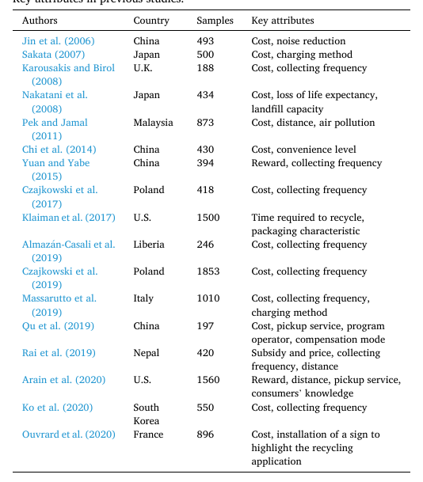
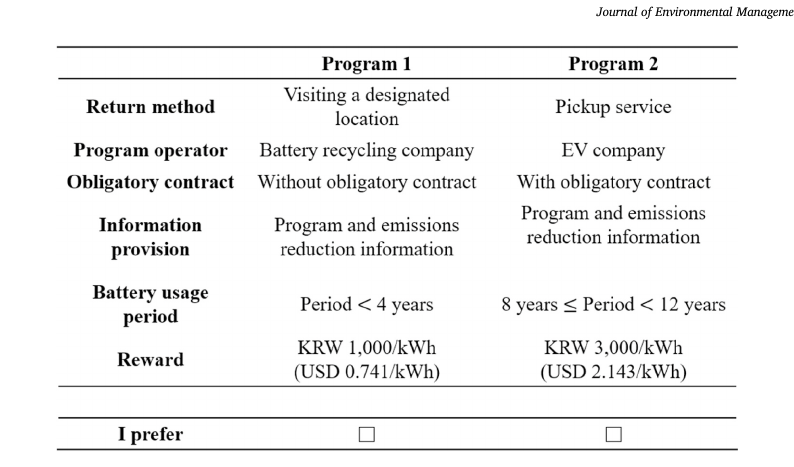
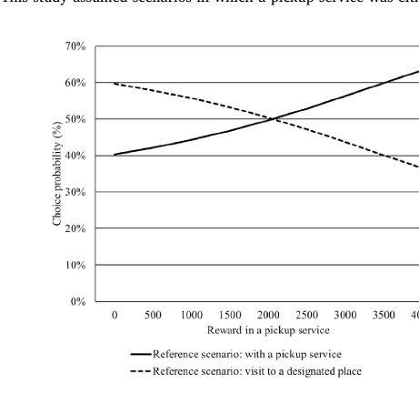
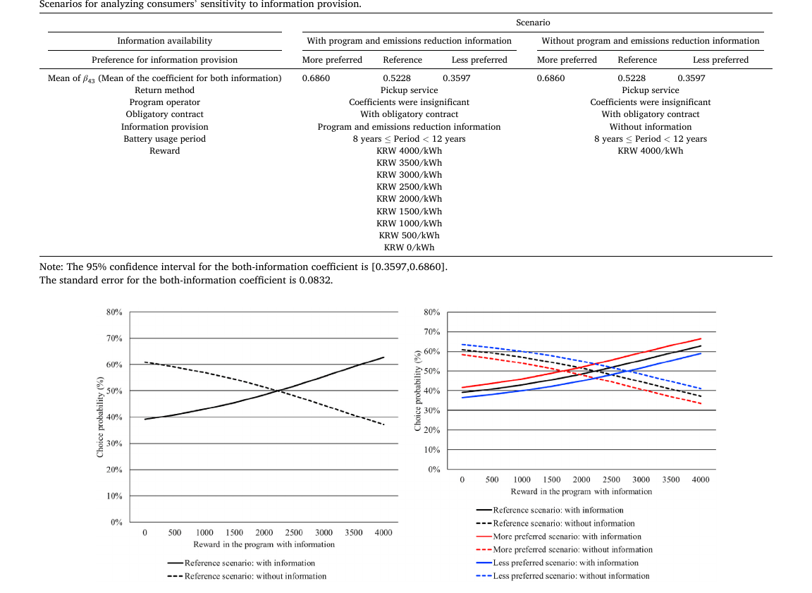

# Strategies for Promoting Consumer Participation in the Collection of Retired Electric Vehicle Batteries

> **Nature Reader 状态：结构化重建稿（机器译文底稿，未完成人工逐句审校）**
>
> 原始文件：`消费者回收行为与意愿\Strategies for promoting consumer participation in the collection of retired.pdf`  
> 来源：Journal of Environmental Management（2025）  
> 文献类型：empirical/choice experiment  
> 总页数：8

## 阅读索引

以下页码链接指向该页第一个可提取文本块；没有可提取文本的页面会保留页码但不生成块链接。

[p.1](#s001) · [p.2](#s022) · [p.3](#s050) · [p.4](#s068) · [p.5](#s083) · [p.6](#s096) · [p.7](#s109) · [p.8](#s133)

## 术语表

| Canonical term | 中文 | 统一规则 |
|---|---|---|
| retired electric vehicle battery | 退役电动汽车电池 | 不用“报废电池”替换 |
| collection program | 回收方案 | 指项目属性组合 |
| conjoint analysis | 联合分析 | 作者采用的偏好分析方法 |
| willingness to accept (WTA) | 接受补偿意愿（WTA） | 与 WTP 区分 |
| pickup service | 上门回收服务 | 回收便利性属性 |

## 全文中英对照

## Page 1

**Source:** p.1 S001 · extraction confidence: high

**Original:** Strategies for promoting consumer participation in the collection of retired electric vehicle batteries Hwarang Lee a , Jongdae Kim b,* a Korea Energy Economics Institute, 405-11 Jongga-ro, Jung-gu, Ulsan, 44543, Republic of Korea b School of Business Administration, Chonnam National University, 77 Yongbong-ro, Buk-gu, Gwangju, 61186, Republic of Korea

**中文:** 促进消费者参与废弃电动汽车电池回收的策略 Hwarang Lee a , Jongdae Kim b,* a 韩国能源经济研究所，405-11 Jongga-ro, Jung-gu, Ulsan, 44543, Republic of Korea b School of Business Administration, Chonnam National University, 77 Yongbong-ro, Buk-gu, Gwangju, 61186, Republic of China

**Source:** p.1 S002 · extraction confidence: low

**Original:** Keywords:

**中文:** 关键词：

**Source:** p.1 S003 · extraction confidence: low

**Original:** Electric vehicle battery Battery collection Battery recycling Battery reuse Waste management Conjoint analysis A B S T R A C T As leading countries in the battery market implement regulations on electric vehicle battery recycling and reuse, value chains for these processes are being developed.

**中文:** 电动汽车电池 电池收集 电池回收 电池再利用 废物管理 联合分析 摘要 随着电池市场领先国家实施电动汽车电池回收和再利用法规，这些流程的价值链正在开发。

**Source:** p.1 S004 · extraction confidence: low

**Original:** In particular, the operation of recycling and reuse businesses begins with the collection of electric vehicle batteries, which is currently left to the free market. This study explored the design of electric vehicle battery collection programs, focusing on the growing number of retired electric vehicle batteries.

**中文:** 特别是，回收和再利用业务的运营始于电动汽车电池的收集，目前由自由市场进行。 本研究探讨了电动汽车电池收集方案的设计，重点关注日益增长的退休人员 电动汽车电池。

**Source:** p.1 S005 · extraction confidence: low

**Original:** A choice experiment was conducted to analyze consumer preferences for six program attributes: return method, program operator, obligatory contract, information provision, battery usage period, and reward.

**中文:** 通过选择实验，分析了消费者对退货方式、程序运营商、义务合同、信息提供、电池使用期限和奖励六种程序属性的偏好。

**Source:** p.1 S006 · extraction confidence: high

**Original:** This study found that consumers have a strong preference for programs that provide a pickup service and information regarding the programs and emissions reduction from recycling and reusing electric vehicle batteries.

**中文:** 这项研究发现，消费者非常青睐提供接送服务的计划以及有关该计划以及回收和再利用电动汽车电池的减排信息的计划。

**Source:** p.1 S007 · extraction confidence: high

**Original:** Notably, respondents were willing to accept lower rewards for a pickup service (USD 0.571/kWh) and for information provision (USD 0.649/kWh). This study offers practical implications for companies seeking to develop profitable battery collection programs.

**中文:** 值得注意的是，受访者愿意接受较低的接机服务奖励（0.571 美元/千瓦时） 信息提供（0.649 美元/kWh）。 这项研究为寻求开发有利可图的电池收集项目的公司提供了实际意义。

**Source:** p.1 S008 · extraction confidence: high

**Original:** The findings also provide valuable insights for designing such programs and enhancing consumer participation in the battery collection.

**中文:** 研究结果还为设计此类计划和增强消费者参与电池收集提供了宝贵的见解。

**Source:** p.1 S009 · extraction confidence: high

**Original:** 1. Introduction

**中文:** 一、简介

**Source:** p.1 S010 · extraction confidence: low

**Original:** In recent years, the global adoption of electric vehicles (EVs) has surged, leading to a significant increase in the number of retired EV batteries (Tan et al., 2022; Lee and Kim, 2024).

**中文:** 近年来，全球电动汽车 (EV) 的普及率激增，导致退役电动汽车电池数量大幅增加（Tan 等人，2022 年；Lee 和 Kim，2024 年）。

**Source:** p.1 S011 · extraction confidence: low

**Original:** This trend has raised growing theoretical and practical interest in exploring sustainable

**中文:** 这一趋势引起了人们对探索可持续发展的理论和实践兴趣。

**Source:** p.1 S012 · extraction confidence: high

**Original:** methods for recycling and reusing these batteries, particularly within on

**中文:** 回收和再利用这些电池的方法，特别是在

**Source:** p.1 S013 · extraction confidence: low

**Original:** the framework of the circular economy (Hu et al., 2024) and Environmental, Social, Governance management. Businesses in this field are expected to grow from two perspectives.

**中文:** 循环经济框架（Hu et al., 2024）和环境、社会、治理管理。 该领域的企业预计将从两个角度实现增长。

**Source:** p.1 S014 · extraction confidence: low

**Original:** First, processing retired EV batteries offers both economic opportunities and environmental benefits by reducing waste and emissions. Second, as the demand for key minerals for EVs, such as lithium, nickel, cobalt, and manganese, continues to rise, recycling or reusing of these batteries offer a viable approach to alleviating resource shortages (Wang et al., 2020; Yu et al., 2021) and enhancing resource security.

**中文:** 首先，处理报废的电动汽车电池可以通过减少废物和排放来提供经济机会和环境效益。 其次，随着电动汽车对锂、镍、钴和锰等关键矿物的需求持续增长，这些电池的回收或再利用为缓解资源短缺提供了一种可行的方法（Wang et al., 2020； Yu et al., 2021）并增强资源安全。

**Source:** p.1 S015 · extraction confidence: low

**Original:** Therefore, as one of the initial stages of waste recycling and reuse, as well as a preliminary step in waste preprocessing (Darko et al., 2023), the collection of retired EV batteries has become increasingly significant.

**中文:** 因此，作为废物回收和再利用的初始阶段之一，以及废物预处理的初步步骤（Darko等人，2023），退役电动汽车电池的收集变得越来越重要。

**Source:** p.1 S016 · extraction confidence: low

**Original:** Given this trend, theoretical interest in the collection of electronic waste (e-waste), including retired EV batteries, has also continued to develop. E-waste is defined as waste generated from discarded electronic products (Robinson, 2009).

**中文:** 鉴于这一趋势，理论上对收集电子废物（包括退役电动汽车电池）的兴趣也在不断发展。 电子废物被定义为废弃电子产品产生的废物（Robinson，2009）。

**Source:** p.1 S017 · extraction confidence: low

**Original:** The improper disposal of e-waste, driven by a massive global increase in consumption, can release hazardous materials such as lead and cadmium, posing serious risks to both the environment and human health (Luo et al., 2011; Qu et al., 2019; Islam et al., 2021; Tutton et al., 2022; Cai et al., 2023).

**中文:** 全球消费量大幅增加导致电子垃圾处理不当，会释放出铅、镉等有害物质，对环境和人类健康构成严重风险（Luo等，2011；Qu等，2019；Islam等，2021；Tutton等，2022；Cai等，2023）。

**Source:** p.1 S018 · extraction confidence: low

**Original:** As one of the fastest-growing waste segments, many studies have been conducted with attention to designing effective e-waste collection programs (Chi et al., 2014; Qu et al., 2019; Arain et al., 2020; Cai et al., 2023; Wang et al., 2023a).

**中文:** 作为其中之一 由于电子废物增长最快，因此开展了许多研究，重点关注设计有效的电子废物收集计划（Chi 等人，2014 年；Qu 等人，2019 年；Arain 等人，2020 年；Cai 等人，2023 年；Wang 等人，2023a）。

**Source:** p.1 S019 · extraction confidence: low

**Original:** Regarding retired EV batteries, Yu et al. (2021) examined the environmental effects of recycling EV lithium-ion batteries, focusing on the life-cycle greenhouse gas emissions, water consumption, and remanufacturing cost associated with different recycling methods.

**中文:** 关于退役的电动汽车电池，Yu 等人。 (2021)研究了回收电动汽车锂离子电池的环境影响，重点关注与不同回收方法相关的生命周期温室气体排放、水消耗和再制造成本。

**Source:** p.1 S020 · extraction confidence: low

**Original:** The

**中文:** 的

**Source:** p.1 S021 · extraction confidence: high

**Original:** results showed that remanufacturing batteries through direct physical

**中文:** 结果表明，通过直接物理再制造电池

## Page 2

**Source:** p.2 S022 · extraction confidence: low

**Original:** recycling has the greatest potentials for environmental impact. Wang et al. (2020) developed an analytical model to optimize the recycling network for lithium-ion batteries, demonstrating that the proposed model could effectively reduce both costs and carbon dioxide emissions.

**中文:** 回收对环境影响的潜力最大。 王等人。 （2020）开发了一个分析模型来优化锂离子电池的回收网络，证明该模型可以有效降低成本和二氧化碳排放。

**Source:** p.2 S023 · extraction confidence: low

**Original:** This study explored how to design retired EV battery collection * Corresponding author. E-mail addresses: idu8819@snu.ac.kr (H. Lee), kim915@jnu.ac.kr (J. Kim). Contents lists available at ScienceDirect Journal of Environmental Management journal homepage: www.elsevier.com/locate/jenvman Received 19 August 2024; Received in revised form 27 February 2025; Accepted 4 March 2025 Journal of Environmental Management 380 (2025) 124853 Available online 13 March 2025 0301-4797/© 2025 Elsevier Ltd.

**中文:** 本研究探讨了如何设计退役电动汽车电池系列*通讯作者。 电子邮件地址：idu8819@snu.ac.kr (H. 李), kim915@jnu.ac.kr (J. 金）。 目录列表可在《ScienceDirect Journal of Environmental Management》期刊主页上找到：www.elsevier.com/locate/jenvman 收稿日期：2024 年 8 月 19 日； 2025 年 2 月 27 日收到修订版； 2025 年 3 月 4 日接受 Journal of Environmental Management 380 (2025) 124853 在线发布 2025 年 3 月 13 日 0301-4797/© 2025 Elsevier Ltd.

**Source:** p.2 S024 · extraction confidence: low

**Original:** All rights are reserved, including those for text and data mining, AI training, and similar technologies. programs as the first major step towards the industrialization of recycling and reusing retired EV batteries.

**中文:** 保留所有权利，包括文本和数据挖掘、人工智能培训和类似技术的权利。 该项目是退役电动汽车电池回收和再利用工业化的第一步。

**Source:** p.2 S025 · extraction confidence: low

**Original:** In particular, we investigated how such programs should be designed in the South Korean market, which we highlighted as it is not exempt from the growing concern over processing of retired EV batteries.

**中文:** 我们特别调查了如何在韩国市场设计此类计划，我们强调了这一点，因为它也不能免除对退役电动汽车电池处理日益增长的担忧。

**Source:** p.2 S026 · extraction confidence: low

**Original:** Furthermore, South Korea recently abolished the regulatory requirement for EV owners to return retired batteries to local governments (Ministries of the South Korean Government, 2024), thereby paving the way for industrialization by transferring battery ownership to EV owners.

**中文:** 此外，韩国最近废除了电动汽车车主将退役电池返还给地方政府的监管要求（韩国政府部委，2024），从而为跨行业的工业化铺平了道路。 将电池所有权交给电动汽车车主。

**Source:** p.2 S027 · extraction confidence: low

**Original:** In response to this regulatory shift, leading South Korean corporations, such as Hyundai and SK, are actively advocating for the establishment of a relevant regulatory framework that supports sustainable battery collection programs, following the example of global corporations such as Redwood Materials, Li-Cycle, and BYD.

**中文:** 为了应对这一监管转变，现代和SK等韩国领先企业正在效仿Redwood Materials、Li-Cycle和比亚迪等全球企业的榜样，积极倡导建立支持可持续电池收集计划的相关监管框架。

**Source:** p.2 S028 · extraction confidence: low

**Original:** This study utilized a choice experiment to examine consumer preferences for retired EV battery collection programs. The experiment considered six key attributes: return method, program operator, obligatory contract, information provision, battery usage period, and reward.

**中文:** 这项研究利用选择实验来调查消费者对退役电动汽车电池收集计划的偏好。 实验考虑了六个关键属性：归还方式、程序运营商、义务合同、信息提供、电池使用期限和奖励。

**Source:** p.2 S029 · extraction confidence: low

**Original:** The theoretical background supporting the selection of these attributes (Table 1) outlined as follows: (1) Most previous studies focused on a pricing attribute, such as costs or rewards for waste collection.

**中文:** 支持选择这些属性的理论背景（表1）概述如下：（1）大多数先前的研究都集中在定价属性上，例如废物收集的成本或奖励。

**Source:** p.2 S030 · extraction confidence: low

**Original:** Several studies showed that consumers tend to prefer the option with lower costs (Jin et al., 2006; Nakatani et al., 2008; Czajkowski et al., 2017, 2019; Ko et al., 2020), while other studies incorporated pricing as the compensation (Yuan and Yabe, 2015; Arain et al., 2020) and both subsidy and fee (Rai et al., 2019) for waste collection.

**中文:** 多项研究表明，消费者倾向于选择成本较低的选择（Jin 等，2006；Nakatani 等，2008；Czajkowski 等，2017、2019；Ko 等，2020），而其他研究则将定价作为补偿（Yuan 和 Yabe，2015；Arain 等，2020）以及补贴和补贴。 废物收集费（Rai et al., 2019）。

**Source:** p.2 S031 · extraction confidence: low

**Original:** (2) Collection methods were one of the important attributes in previous studies. For example, consumers preferred door-to-door collection services over self-service options in the mobile phone waste collection (Qu et al., 2019).

**中文:** (2)收集方法是以往研究的重要属性之一。 例如，在手机垃圾收集中，消费者更喜欢上门收集服务，而不是自助服务（Qu et al., 2019）。

**Source:** p.2 S032 · extraction confidence: low

**Original:** This is because a pickup service can affect the accessibility to disposal and the convenience level of waste collection (Chi et al., 2014; Arain et al., 2020). (3) Operators of collection programs can influence not only efficiency of recycling and reuse (Wang et al., 2023b) but also consumer preferences for the programs.

**中文:** 这是因为收集服务会影响处置的可及性和废物收集的便利程度（Chi et al., 2014；Arain et al., 2020）。 (3) 收集计划的运营商不仅可以影响效果 回收和再利用的效率（Wang 等人，2023b）以及消费者对这些计划的偏好。

**Source:** p.2 S033 · extraction confidence: low

**Original:** Qu et al. (2019) categorized collectors into public, private, and self-employed entities, further distinguishing between qualified and non-qualified collectors. Their findings indicated that consumers prefer public and qualified private collectors to other types of collectors.

**中文:** 曲等人。 （2019）将收藏家分为公共、私营和个体经营实体，进一步区分合格和不合格的收藏家。 他们的研究结果表明，与其他类型的收藏家相比，消费者更喜欢公共和合格的私人收藏家。

**Source:** p.2 S034 · extraction confidence: low

**Original:** (4) Institutional signals are institutional or governmental decisions that guide people to understand socially normative actions (Huber et al., 2018). Previous research argued that institutional signals can have conflicting effects on consumer pro-environmental behavior.

**中文:** （4）制度信号是引导人们理解社会规范行为的制度或政府决策（Huber等，2018）。 先前的研究认为，制度 信号可能会对消费者的环保行为产生相互矛盾的影响。

**Source:** p.2 S035 · extraction confidence: low

**Original:** While highlighting the importance of particular problems may enhance social acceptance, such signals can also discourage voluntary participation because the government is taking an obligatory active role (Dodds et al., 2008).

**中文:** 虽然强调特定问题的重要性可能会提高社会接受度，但此类信号也会阻碍自愿参与，因为政府必须发挥积极作用（Dodds 等，2008）。

**Source:** p.2 S036 · extraction confidence: low

**Original:** As a notable example, Huber et al. (2018) showed that institutional signals, such as the obligatory requirement regarding carbon emissions, can positively influence consumer pro-environmental behavior when the costs are low.

**中文:** 作为一个著名的例子，Huber 等人。 （2018）表明，制度信号，例如有关碳排放的强制性要求，可以在成本较低时对消费者的环保行为产生积极影响。

**Source:** p.2 S037 · extraction confidence: low

**Original:** The current study anticipates that consumer preferences can be affected by the presence of an obligatory contract requiring them to return their retired EV batteries. (5) Consumers' knowledge about waste and collection

**中文:** 目前的研究预计，消费者的偏好可能会受到要求归还退役电动汽车电池的强制性合同的影响。 (5)消费者垃圾及收集知识

**Source:** p.2 S038 · extraction confidence: high

**Original:** methods is known to influence their preferences for collection programs.

**中文:** 众所周知，方法会影响他们对收集计划的偏好。

**Source:** p.2 S039 · extraction confidence: low

**Original:** Arain et al. (2020) demonstrated that a lack of consumer knowledge regarding e-waste disposal and recycling locations is significant in e-waste collection. (6) Collection frequency is another frequently examined factor in the literature (Karousakis and Birol, 2008; Yuan and Yabe, 2015; Czajkowski et al., 2017; Almazán-Casali et al., 2019; Ko et al., 2020).

**中文:** 阿兰等人。 （2020）表明，消费者缺乏有关电子废物处理和回收地点的知识在电子废物收集中非常重要。 (6) 收集频率是文献中另一个经常检查的因素（Karousakis 和 Birol，2008；Yuan 和 Yabe，2015；Czajkowski 等，2017；Almazán-Casali 等，2019；Ko 等，2020）。

**Source:** p.2 S040 · extraction confidence: low

**Original:** Meanwhile, previous research has explored other attributes (Table 1), such as noise reduction (Jin et al., 2006), charging methods (Sakata, 2007; Massarutto et al., 2019), packaging characteristics (Klaiman et al., 2017), life expectancy loss (Nakatani et al., 2008), landfill capacity (Nakatani et al., 2008), air pollution (Pek and Jamal, 2011), time required for recycling (Klaiman et al., 2017), distance from a collection site (Pek and Jamal, 2011; Rai et al., 2019), compensation modes (Qu et al., 2019), and installation of a sign to highlight the recycling application (Ouvrard et al., 2020).

**中文:** 同时，之前的研究还探索了其他属性（表1），例如降噪（Jin等人，2006）、充电方法（Sakata，2007；Massarutto等人，2019）、包装特性 （Klaiman 等人，2017 年）、预期寿命损失（Nakatani 等人，2008 年）、垃圾填埋场容量（Nakatani 等人，2008 年）、空气污染（Pek 和 Jamal， 2011）、回收所需时间（Klaiman 等人，2017）、距离 收集地点（Pek 和 Jamal，2011；Rai 等人，2019）、补偿模式（Qu 等人，2019）以及安装标志以突出回收应用（Ouvrard 等人，2020）。

**Source:** p.2 S041 · extraction confidence: low

**Original:** This study is notable as one of the first to propose strategies for designing efficient retired EV battery collection programs. Given the limited existing research on this topic, the current study not only provides theoretical contributions but also establishes a meaningful foundation for future research.

**中文:** 这项研究是最早提出设计高效退役电动汽车电池收集计划策略的研究之一。 鉴于该主题的现有研究有限，当前的研究不仅提供了理论贡献，而且为未来的研究奠定了有意义的基础。

**Source:** p.2 S042 · extraction confidence: low

**Original:** The results offer practical insights for companies seeking to develop business models centered on retired EV batteries, particularly by identifying the key factors that influence consumer preference structures.

**中文:** 研究结果为寻求开发以退役电动汽车电池为中心的商业模式的公司提供了实用的见解，特别是通过确定影响消费者偏好结构的关键因素。

**Source:** p.2 S043 · extraction confidence: low

**Original:** This study also enhances understanding of how program attributes affect consumer utility, providing guidance on cost-reduction strategies and ways to promote consumer participation.

**中文:** 这项研究也增进了了解 计划属性如何影响消费者效用，为降低成本策略和促进消费者参与的方法提供指导。

**Source:** p.2 S044 · extraction confidence: low

**Original:** By addressing these factors, this study contributes to the development of more effective and sustainable collection programs that align with both economic and environmental objectives.

**中文:** 通过解决这些因素，本研究有助于制定更有效和可持续的收集计划，以符合经济和环境目标。

**Source:** p.2 S045 · extraction confidence: high

**Original:** 2. Methodology

**中文:** 2. 方法论

**Source:** p.2 S046 · extraction confidence: high

**Original:** 2.1. Survey design

**中文:** 2.1.调查设计

**Source:** p.2 S047 · extraction confidence: low

**Original:** This study conducted pilot and main surveys online in July and August 2023, respectively, with the support of a survey company. Prior to the pilot survey, the study ensured that the public could understand EV battery collection, recycling, and reuse and subsequently revised the questionnaire.

**中文:** 本研究在调查公司的支持下分别于2023年7月和2023年8月在网上进行了试点调查和主要调查。 在试点调查之前，该研究确保公众能够了解电动汽车电池的收集、回收和再利用，并随后修订了调查问卷。

**Source:** p.2 S048 · extraction confidence: high

**Original:** Before the main survey, the study reviewed estimation

**中文:** 在主要调查之前，研究回顾了估计

**Source:** p.2 S049 · extraction confidence: high

**Original:** results from the pilot survey data and refined the questionnaire again. In

**中文:** 根据试点调查数据，再次细化问卷。在

## Page 3

**Source:** p.3 S050 · extraction confidence: low

**Original:** the main survey, the survey company reviewed respondents' answers and excluded inconsistent responses to mitigate bias and enhance the reliability of the survey. The questionnaire provided information on EV battery collection, recycling, and reuse, as well as a detailed explanation of the attributes and levels of battery collection programs (see Appendix A).

**中文:** 在主要调查中，调查公司审查了受访者的回答并排除了不一致的回答，以减少偏见并提高调查的可靠性。 调查问卷提供了有关电动汽车电池收集、回收和再利用的信息，以及电池收集计划的属性和级别的详细说明（见附录A）。

**Source:** p.3 S051 · extraction confidence: low

**Original:** Additionally, it provided information on the capacities and prices of new EV batteries to help respondents understand the rewards associated with battery collection programs, compare program attributes, and determine their choices.

**中文:** 此外，它还提供了有关新型电动汽车电池的容量和价格的信息，以帮助受访者了解与电动汽车电池相关的回报 电池收集方案，比较方案属性，并确定其选择。

**Source:** p.3 S052 · extraction confidence: low

**Original:** This study analyzed 800 samples obtained through Table 1 Key attributes in previous studies. Authors Country Samples Key attributes Jin et al. (2006) China 493 Cost, noise reduction Sakata (2007) Japan 500 Cost, charging method Karousakis and Birol (2008) U.K.

**中文:** 本研究分析了通过表1关键属性获得的800个样本。 作者 国家/地区 样本 关键属性 Jin 等人。 (2006) 中国 493 成本、降噪 Sakata (2007) 日本 500 成本、收费方法 Karousakis 和 Birol (2008) 英国

**Source:** p.3 S053 · extraction confidence: low

**Original:** 188 Cost, collecting frequency Nakatani et al.

**中文:** 188 成本、收集频率 Nakatani 等人。

**Source:** p.3 S054 · extraction confidence: low

**Original:** (2008) Japan 434 Cost, loss of life expectancy, landfill capacity Pek and Jamal (2011) Malaysia 873 Cost, distance, air pollution Chi et al. (2014) China 430 Cost, convenience level Yuan and Yabe (2015) China 394 Reward, collecting frequency Czajkowski et al.

**中文:** (2008) 日本 434 成本、预期寿命损失、垃圾填埋场容量 Pek 和 Jamal (2011) 马来西亚 873 成本、距离、空气污染 Chi 等人。 (2014) 中国 430 成本、便利水平 Yuan 和 Yabe (2015) 中国 394 奖励、收集频率 Czajkowski 等人。

**Source:** p.3 S055 · extraction confidence: low

**Original:** (2017) Poland 418 Cost, collecting frequency Klaiman et al. (2017) US 1500 Time required to recycle, packaging characteristic Almazán-Casali et al. (2019) Liberia 246 Cost, collecting frequency Czajkowski et al.

**中文:** (2017) 波兰 418 成本、收集频率 Klaiman 等人。 (2017) US 1500 回收所需时间、包装特征 Almazán-Casali 等人。 (2019) 利比里亚 246 成本、收集频率 Czajkowski 等人。

**Source:** p.3 S056 · extraction confidence: low

**Original:** (2019) Poland 1853 Cost, collecting frequency Massarutto et al. (2019) Italy 1010 Cost, collecting frequency, charging method Qu et al. (2019) China 197 Cost, pickup service, program operator, compensation mode Rai et al. (2019) Nepal 420 Subsidy and price, collecting frequency, distance Arain et al. (2020) US 1560 Reward, distance, pickup service, consumers' knowledge Ko et al. (2020) South Korea

**中文:** (2019) 波兰 1853 成本、收集频率 Massarutto 等人。 (2019) 意大利 1010 费用、收集频率、收费方式 Qu 等。 (2019) 中国 197 成本、接送服务、节目运营商、补偿模式 Rai 等。 (2019) 尼泊尔 420 补贴和价格、收集频率、距离 Arain 等人。 (2020) US 1560 奖励、距离、接送服务、消费者知识 Ko 等。 (2020) 韩国

**Source:** p.3 S057 · extraction confidence: low

**Original:** 550 Cost, collecting frequency

**中文:** 550 成本、收集频率

**Source:** p.3 S058 · extraction confidence: low

**Original:** Ouvrard et al. (2020) France 896 Cost, installation of a sign to highlight the recycling application H. Lee and J. Kim Journal of Environmental Management 380 (2025) 124853 the survey company to explain consumer preferences for battery collection programs.

**中文:** 乌弗拉德等人。 (2020) 法国 896 成本，安装标志以突出回收应用 H. 李和 J. Kim环境管理杂志380（2025）124853调查公司解释了消费者对电池收集计划的偏好。

**Source:** p.3 S059 · extraction confidence: low

**Original:** According to the sample and population statistics in Table 2, the sample reflects the characteristics of the population. The sample statistics were calculated based on the survey results, while the population statistics were derived from the data provided by Statistics Korea (2024).

**中文:** 根据表2的样本和总体统计，样本反映了总体的特征。 样本统计是根据调查结果计算的，人口统计是根据统计局提供的数据得出的 韩国（2024）。

**Source:** p.3 S060 · extraction confidence: low

**Original:** This study considered six attributes describing battery collection programs (Table 3), with more detailed explanations provided in Appendix A. Using these attributes, 768 sets of battery collection programs were generated, from which 16 orthogonal alternatives were selected.

**中文:** 本研究考虑了描述电池收集计划的六个属性（表 3），附录 A 中提供了更详细的解释。 利用这些属性，生成了 768 组电池收集程序，并从中选择了 16 个正交方案。

**Source:** p.3 S061 · extraction confidence: low

**Original:** The questionnaire asked respondents to determine their preferred program between two alternatives in eight choice cards (see Appendix A). For example, respondents who chose the first battery collection program in Fig. 1 preferred to visit a designated location, choose a battery recycling company, return their batteries after four years of use, and receive KRW 1000/kWh (USD 0.741/kWh) without an obligatory contract and with access both types of information.

**中文:** 调查问卷要求受访者在八张选择卡中的两个选项之间确定他们的首选方案（参见附录 A）。 例如，选择图1中第一个电池回收项目的受访者更愿意前往指定地点， 选择一家电池回收公司，在使用四年后归还电池，无需签订强制性合同即可获得 1000 韩元/千瓦时（0.741 美元/千瓦时）的费用，并且可以访问两种类型的信息。

**Source:** p.3 S062 · extraction confidence: high

**Original:** 2.2. Mixed logit model

**中文:** 2.2.混合logit模型

**Source:** p.3 S063 · extraction confidence: low

**Original:** This study estimated Equation (1) based on a mixed logit model (Train, 2009). Equation (1) indicated respondent n's utility (U jt n ) when this respondent preferred a j th alternative from a t th choice card.

**中文:** 本研究基于混合 Logit 模型估计方程 (1)（Train，2009）。 等式(1)表示当受访者从第t张选择卡中选择第j个选项时，受访者n的效用(U jt n )。

**Source:** p.3 S064 · extraction confidence: low

**Original:** The utility consisted of an explainable part (V jt n ) with program attributes (X jt n ) and an error term (εjt n ). As shown in a normal distribution of Equation (2), coefficient vector βn's mean and deviation are b and σ, respectively.

**中文:** 该实用程序由具有程序属性 (X jt n ) 的可解释部分 (V jt n ) 和错误项 (εjt n ) 组成。 如式(2)的正态分布所示，系数向量βn的均值和偏差分别为b和σ。

**Source:** p.3 S065 · extraction confidence: low

**Original:** Ujt n = Vjt n + εjt n = βʹ nXjt n + εjt n (1) βn ∼ N ( b, σ2 ) (2) This study reformulated Equation (1) as Equation (3) by incorporating program attributes. The reward was coded as a continuous variable, while the other attributes were treated as dummy variables.

**中文:** Ujt n = Vjt n + εjt n = βʹ nXjt n + εjt n (1) βn ∼ N ( b, σ2 ) (2) 本研究通过结合程序属性将方程（1）重新表述为方程（3）。 奖励被编码为连续变量，而其他属性被视为虚拟变量。

**Source:** p.3 S066 · extraction confidence: low

**Original:** Equation (4) represented the marginal willingness to accept (MWTA) for the attributes. MWTA, which indicated the compensation required for excluding specific attributes from battery collection programs, was calculated based on the coefficients of the reward and other attributes.

**中文:** 方程（4）代表属性的边际接受意愿（MWTA）。 MWTA表示从电池回收计划中排除特定属性所需的补偿，是根据奖励和其他属性的系数计算的。

**Source:** p.3 S067 · extraction confidence: low

**Original:** For example, the MWTA for a pickup service represented the compensation respondents received when they decided to visit a designated location instead of using a pickup service.

**中文:** 例如，接送服务的 MWTA 代表受访者决定访问指定地点而不使用接送服务时收到的补偿。

## Page 4

**Source:** p.4 S068 · extraction confidence: low

**Original:** U = β11X11 + ∑ k β2kX2k + β31X31 + ∑ k β4kX4k + ∑ k β5kX5k + β61X61 + ε (3) U: Utility βik: Attribute coefficient X11: If a pickup service is provided, 1; otherwise, 0 X21: If a program operator is a governmental agency, 1; otherwise, 0 X22: If a program operator is an EV company, 1; otherwise, 0 X31: If a contract is obligatory, 1; otherwise, 0 X41: If program information is provided, 1; otherwise, 0 X42: If emissions reduction information is provided, 1; otherwise, 0 X43: If program and emissions reduction information is provided, 1; otherwise, 0 X51: If the period of use is between 4 and 8 years, 1; otherwise, 0 X52: If the period of use is between 8 and 12 years, 1; otherwise, 0 X53: If the period of use exceeds 12 years, 1; otherwise, 0 X61: Reward (KRW/kWh) MWTAik = − βik β61 (4)

**中文:** U = β11X11 + Σ k β2kX2k + β31X31 + Σ k β4kX4k + Σ k β5kX5k + β61X61 + ε (3) U：效用 βik：属性系数 X11：若提供接送服务，为 1； X21：如果项目运营方是政府机构，则为1；否则为0。 X22：如果程序运营商是电动汽车公司，则为1；否则为0。否则，0 X31：如果合同是强制性的，则为 1；否则，为 0。否则，0 X41：如果提供节目信息，则为1； X42：若提供减排信息，则为1；否则为0。 X43：如果提供了计划和减排信息，则为 1；否则为 0否则，0 X51：如果使用期限在4年至8年之间，则为1；否则，0 X52：如果使用期限在8年至12年之间，则为1；否则，0 X53：如果使用期限超过12年，则为1；否则，0 X61：奖励（KRW/kWh） MWTAik = − βik β61 (4)

**Source:** p.4 S069 · extraction confidence: low

**Original:** 3. Results and discussion

**中文:** 3 结果与讨论

**Source:** p.4 S070 · extraction confidence: low

**Original:** This study estimated respondents' preferences for battery collection program attributes using a mixed logit model (Table 4). All attribute coefficients were statistically significant, excluding those related to program operators.

**中文:** 本研究使用混合 Logit 模型估计了受访者对电池收集计划属性的偏好（表 4）。 除与节目运营商相关的属性系数外，所有属性系数均具有统计显着性。

**Source:** p.4 S071 · extraction confidence: low

**Original:** Unlike previous studies, which generally showed that consumers prefer governmental and public agencies as program operators due to their trust in such programs (Qu et al., 2019), respondents in this study did not exhibit a clear preference for a specific program operator.

**中文:** 以往的研究普遍表明，消费者由于对此类项目的信任而更喜欢政府和公共机构作为项目运营商（Qu et al., 2019），而本研究中的受访者并未表现出对特定项目运营商的明确偏好。

**Source:** p.4 S072 · extraction confidence: low

**Original:** However, as noted by Bikash and Ichihashi (2022),

**中文:** 然而，正如 Bikash 和 Ichihashi (2022) 所指出的，

**Source:** p.4 S073 · extraction confidence: low

**Original:** Table 2 Sample and population statistics.

**中文:** 表 2 样本和总体统计数据。

**Source:** p.4 S074 · extraction confidence: low

**Original:** Age Gender Sample Population Age Gender Sample Population 20s Male 10% 10% 60s (60–65) Male 7% 7% ​ Female 9% 9% ​ Female 7% 7% 30s Male 10% 10% All ages Male 51% 51% ​ Female 9% 9% ​ Female 49% 49% 40s Male 12% 12% Total 100% 100% ​ Female 12% 11% ​ ​ ​ ​ 50s Male 13% 12% ​ ​ ​ ​ ​ Female 12% 12% ​ ​ ​ ​ Note: The total sample size is 800.

**中文:** 年龄 性别 样本人口 年龄 性别 样本人口 20 多岁男性 10% 10% 60 多岁 (60–65) 男性 7% 7% ​ 女性 9% 9% ​ 女性 7% 7% 30多岁男性 10% 10% 所有年龄段 男性 51% 51% ​女性 9% 9% ​女性 49% 49% 40多岁 男性 12% 12% 合计 100% 100% ​ 女性 12% 11% ​ ​ ​ 50多岁男性 13% 12% ​ ​ ​ ​ 女性 12% 12% ​ ​ ​ 注：样本总数为800。

**Source:** p.4 S075 · extraction confidence: low

**Original:** The population statistics are based on Statistics Korea (2024).

**中文:** 人口统计数据基于韩国统计局（2024 年）。

**Source:** p.4 S076 · extraction confidence: low

**Original:** Table 3 Attributes of battery collection programs.

**中文:** 表3 电池收集方案的属性。

**Source:** p.4 S077 · extraction confidence: low

**Original:** Attribute Description Attribute levels Return method Consumers can either visit a designated location to return EV batteries or request a free pickup service to the program operator Visiting a designated location Pickup service Program operator Battery collection programs can be operated by a governmental agency, an EV company, or a battery recycling company Governmental agency EV company Battery recycling company Obligatory contract Consumers can sign obligatory contracts to return their EV batteries upon purchasing EVs Without obligatory contract With obligatory contract Information provision Program information refers to details on battery recycling, reuse, and the life cycle history of consumers' batteries Emissions reduction information refers to the potential emissions reductions achieved through battery recycling and reuse Without information

**中文:** 属性 说明 属性级别 归还方式 消费者可以前往指定地点归还电动汽车电池，也可以向项目运营方请求免费取件服务 前往指定地点取件服务 项目运营方 电池回收项目可以由政府机构、电动汽车公司或电池运营商运营 回收公司 政府机构 电动汽车公司 电池回收公司 强制合同 消费者在购买电动汽车时可以签署强制合同退回电动汽车电池 无强制合同 有强制合同 信息提供 计划信息是指电池回收、再利用以及消费者电池生命周期历史的详细信息 减排信息是指通过电池回收和再利用实现的潜在减排量 无信息

**Source:** p.4 S078 · extraction confidence: low

**Original:** Program information Emissions reduction information Program and emissions reduction information Battery usage period Consumers can choose the timing of their battery returns Period 〈 4 years 4 years ≤ Period 〈8 years 8 years ≤ Period 〈12 years Period ≥ 12 years Reward Consumers are rewarded for returning their EV batteries KRW 1000/kWh (USD 0.714/kWh) KRW 2000/kWh (USD 1.429/kWh) KRW 3000/kWh (USD 2.143/kWh) KRW 4000/kWh (USD 2.857/kWh) Note: USD 1 = KRW 1400 (KEB Hana Bank, 2024).

**中文:** 计划信息 减排信息 计划和减排信息 电池使用期限 消费者可以选择电池回收时间 期限 〈 4 年 4年≤期间<8 年 8年≤期间<12 年 期限 ≥ 12 年 奖励 消费者因归还电动汽车电池而获得 1000 韩元/千瓦时的奖励（美元 0.714/千瓦时） 2000 韩元/千瓦时（美元 1.429/千瓦时） 3000 韩元/千瓦时（美元 2.143/千瓦时） 4000 韩元/千瓦时（美元 2.857/千瓦时） 注：1 美元 = 1400 韩元（KEB 韩亚银行，2024 年）。

**Source:** p.4 S079 · extraction confidence: medium

**Original:** Lee and J. Kim Journal of Environmental Management 380 (2025) 124853 consumers may not have a distinct preference for public and private agencies. This could present an opportunity for companies planning to enter the retired EV battery business, although profits of the programs are influenced by operators (Sun et al., 2022).

**中文:** 李和 J. Kim Journal of Environmental Management 380 (2025) 124853 消费者可能对公共和私人机构没有明显的偏好。 这可能为计划进入退役电动汽车电池业务的公司提供机会，尽管该项目的利润受到运营商的影响（Sun et al., 2022）。

**Source:** p.4 S080 · extraction confidence: low

**Original:** Respondents were more likely to choose battery collection programs that offer a pickup service. This result is consistent with previous studies, which have shown that door-to-door (Qu et al., 2019) and pickup (Arain et al., 2020) services play a crucial role in collecting and recycling e-waste.

**中文:** 受访者更有可能选择提供接送服务的电池收集计划。 这一结果与之前的研究结果一致，之前的研究表明，上门服务（Qu et al., 2019）和取货服务（Arain et al., 2020）在电子垃圾的收集和回收中发挥着至关重要的作用。

**Source:** p.4 S081 · extraction confidence: low

**Original:** The results indicated that respondents are willing to accept lower rewards (KRW 799/kWh) if programs provide a pickup service. Program operators may consider implementing a pickup service to encourage consumer participation in battery collection programs; however, they need to evaluate additional profits from offering the service, as the service incurs extra costs.

**中文:** 结果表明，如果项目提供接送服务，受访者愿意接受较低的奖励（799 韩元/kWh）。 计划运营商可以考虑实施接送服务，以鼓励消费者参与电池收集计划；然而，他们需要评估提供服务带来的额外利润，因为服务会产生额外成本。

**Source:** p.4 S082 · extraction confidence: low

**Original:** In evaluating trade-offs between service provision and profitability from increased participation, program operators can employ marginal willingness to accept (MWTA) for a pickup service.

**中文:** 在评估服务提供与增加参与带来的盈利能力之间的权衡时，项目运营商可以采用边际接受意愿 (MWTA) 来获取接送服务。

## Page 5

**Source:** p.5 S083 · extraction confidence: low

**Original:** The coefficient for offering an obligatory contract was also significant and positive, indicating that respondents tend to prefer battery collection programs that include such contract.

**中文:** 提供强制性合同的系数也显着且为正，表明受访者倾向于更喜欢包含此类合同的电池收集计划。

**Source:** p.5 S084 · extraction confidence: low

**Original:** Although respondents have the option to decide whether to return their EV batteries to a program operator at the end of EV use, they were still willing to sign an obligatory contract at the time of purchase.

**中文:** 尽管受访者可以选择在电动汽车使用结束时决定是否将电动汽车电池退还给项目运营商，但他们仍然愿意在购买时签署强制性合同。

**Source:** p.5 S085 · extraction confidence: low

**Original:** This suggests that the utility of receiving rewards is larger than the disutility of losing the flexibility to choose whether to return retired EV batteries. Moreover, this result aligns with the findings of Huber et al. (2018) in that consumers are willing to accept restrictions on their behavior and act in a pro-environmental manner when the costs are low.

**中文:** 这表明，获得奖励的效用大于失去选择是否归还退役电动汽车电池的灵活性的负效用。 而且， 这一结果与 Huber 等人的研究结果一致。 （2018）的观点是，当成本较低时，消费者愿意接受对其行为的限制并以有利于环境的方式行事。

**Source:** p.5 S086 · extraction confidence: low

**Original:** Therefore, program operators can enhance battery collection rates and increase program profitability by introducing an obligatory contract at the point of EV purchase. The estimation results also indicated that respondents are sensitive to the information provided by program operators.

**中文:** 因此，项目运营商可以通过在购买电动汽车时引入强制性合同来提高电池收集率并提高项目盈利能力。 估算结果还表明，受访者对节目运营商提供的信息很敏感。

**Source:** p.5 S087 · extraction confidence: low

**Original:** Information on program and emissions reduction positively influenced respondents' choices of battery collection programs. Providing both types of information was more effective in encouraging consumer participation in battery collection programs, although its effect was smaller than the sum of the effects of each type of information individually.

**中文:** 有关计划和减排的信息对受访者对电池收集计划的选择产生了积极影响。 提供两种类型的信息在鼓励消费者参与电池收集计划方面更有效，尽管其效果小于每种类型信息单独效果的总和。

**Source:** p.5 S088 · extraction confidence: low

**Original:** The MWTA for both types of information (KRW 908/kWh) was higher than the MWTA of a pickup service (KRW 799/kWh), suggesting that providing comprehensive information is more effective in promoting consumer participation than offering a pickup service.

**中文:** 两种信息的 MWTA（908 韩元/kWh）均高于 MWTA 接送服务（799韩元/千瓦时），这表明提供全面的信息比提供接送服务更能有效地促进消费者参与。

**Source:** p.5 S089 · extraction confidence: low

**Original:** Additionally, as noted by Arain et al. (2020), consumers' knowledge of recycling, reuse, and programs can enhance their participation in such programs. Respondents were more likely to prefer returning their EV batteries after more than four years of use rather than after less than four years.

**中文:** 此外，正如 Arain 等人指出的。 （2020），消费者对回收、再利用和计划的了解可以增强他们对此类计划的参与。 受访者更愿意在使用超过四年而不是少于四年后退回电动汽车电池。

**Source:** p.5 S090 · extraction confidence: low

**Original:** Their preference for the battery usage period followed the order of after 8–12 years, 4–8 years, and more than 12 years. Given that predicting battery quantities can influence recycling capacity plans (Du et al., 2024), this information allows program operators to estimate the timing and volume of battery collection and develop effective recycling and reuse plans.

**中文:** 他们对电池使用时间的偏好遵循以下顺序： 8-12年、4-8年、12年以上。鉴于预测 电池数量会影响回收能力计划（Du 等人， 2024），该信息允许程序运营商估计时间 和电池收集量，并制定有效的回收和再利用计划。

**Source:** p.5 S091 · extraction confidence: low

**Original:** According to the estimation results, rewards had a positive effect on respondents' participation in battery collection programs. The coefficient for rewards was 0.0003, indicating an increase in utility for each additional KRW 1/kWh provided as a reward.

**中文:** 根据估算结果，奖励对受访者参与电池回收计划有积极影响。 奖励系数为0.0003，表示每增加1韩元/千瓦时的奖励，效用就会增加。

**Source:** p.5 S092 · extraction confidence: low

**Original:** This study investigated potential savings in rewards through the implementation of a pickup service and compared respondents' choice probabilities between programs with and without a pickup service (Table 5).

**中文:** 本研究调查了通过实施接送服务可能节省的奖励，并比较了受访者在有和没有接送服务的项目之间的选择概率（表 5）。

**Source:** p.5 S093 · extraction confidence: low

**Original:** This scenario analysis was designed based on previous studies (Ko et al., 2020). This study assumed identical attribute levels for the Fig. 1. Choice card.

**中文:** 该情景分析是根据之前的研究设计的（Ko et al., 2020）。 本研究假设图 1 具有相同的属性水平。 选择卡。

### Table 1. 该情景分析是根据之前的研究设计的（Ko et al., 2020）。 本研究假设图 1 具有相同的属性水平。 选择卡。

**Placed near:** p.2 S093  
**Source:** p.2 S093  
**Crop confidence:** approximate-object-bounded

**Original caption:** Table 1 dation for future research. The results offer practical insights for

**中文图注:** 该情景分析是根据之前的研究设计的（Ko et al., 2020）。 本研究假设图 1 具有相同的属性水平。 选择卡。

**Reading note:** 自动裁剪以图注为定位依据；正式引用图中数值前请对照原 PDF 检查裁剪边界与坐标轴。

### Fig. 1. 该情景分析是根据之前的研究设计的（Ko et al., 2020）。 本研究假设图 1 具有相同的属性水平。 选择卡。

**Placed near:** p.4 S093  
**Source:** p.4 S093  
**Crop confidence:** approximate-object-bounded

**Original caption:** Fig. 1. Choice card.

**中文图注:** 该情景分析是根据之前的研究设计的（Ko et al., 2020）。 本研究假设图 1 具有相同的属性水平。 选择卡。

**Reading note:** 自动裁剪以图注为定位依据；正式引用图中数值前请对照原 PDF 检查裁剪边界与坐标轴。

**Source:** p.5 S094 · extraction confidence: low

**Original:** Table 4 Estimation results of a mixed logit model.

**中文:** 表4 混合logit模型的估计结果。

**Source:** p.5 S095 · extraction confidence: low

**Original:** Attribute Mean of β p-value Median MWTA Pickup service 0.5690*** <0.001 -KRW 799/kWh (-USD 0.571/kWh) Governmental agency − 0.0930 0.195 – EV company − 0.0571 0.355 – With obligatory contract 0.0948* 0.097 -KRW 134/kWh (-USD 0.096/kWh) Program information 0.3471*** <0.001 -KRW 603/kWh (-USD 0.431/kWh) Emissions reduction information 0.3576*** <0.001 -KRW 626/kWh (-USD 0.447/kWh) Program and emissions reduction information 0.5228*** <0.001 -KRW 908/kWh (-USD 0.649/kWh) 4 years ≤ Period 〈8 years 0.7624*** <0.001 -KRW 1331/kWh (-USD 0.951/kWh) 8 years ≤ Period 〈12 years 0.8410*** <0.001 -KRW 1455/kWh (-USD 1.039/kWh) Period ≥ 12 years 0.4180*** <0.001 -KRW 466/kWh (-USD

**中文:** 属性 β p 值的平均值 MWTA 接送服务中位数 0.5690*** <0.001 -KRW 799/kWh (-USD 0.571/千瓦时） 政府机构 − 0.0930 0.195 – 电动汽车公司 − 0.0571 0.355 – 有强制性合同 0.0948* 0.097 -134 韩元/kWh (-USD 0.096/千瓦时） 计划信息 0.3471*** <0.001 -KRW 603/kWh (-USD 0.431/千瓦时） 减排信息 0.3576*** <0.001 -626 韩元/千瓦时（-美元 0.447/千瓦时） 计划和减排信息 0.5228*** <0.001 -908 韩元/千瓦时（-美元 0.649/千瓦时） 4年≤期间<8年0.7624*** <0.001 -1331韩元/kWh （-0.951 美元/千瓦时） 8年≤期间<12年0.8410*** <0.001 -1455韩元/kWh (-USD 1.039/kWh) 期限 ≥ 12 年 0.4180*** <0.001 -KRW 466/kWh (-USD

## Page 6

**Source:** p.6 S096 · extraction confidence: low

**Original:** 0.333/kWh) Reward 0.0003*** <0.001 – Number of observations: 12,800 Log-likelihood: 3965.6689 Note: *** Significant at the 1% level, * Significant at the 10% level. USD 1 = KRW 1400 (KEB Hana Bank, 2024).

**中文:** 0.333/千瓦时） 奖励 0.0003*** <0.001 – 观测值数量：12,800 对数似然：3965.6689 注：*** 在 1% 水平上显着，* 在 10% 水平上显着。 1 美元 = 1400 韩元（KEB 韩亚银行，2024 年）。

**Source:** p.6 S097 · extraction confidence: medium

**Original:** Lee and J. Kim Journal of Environmental Management 380 (2025) 124853 obligatory contract, information provision, and battery usage period in both programs, but excluded the effects of program operators due to their insignificant coefficients.

**中文:** 李和 J. Kim Journal of Environmental Management 380 (2025) 124853 两个项目中的强制性合同、信息提供和电池使用期限，但排除了项目运营商的影响，因为其系数不显着。

**Source:** p.6 S098 · extraction confidence: low

**Original:** A fixed reward of KRW 4000/kWh was assumed for the program without a pickup service. By contrast, for the programs with a pickup service, the reward was assumed to decrease from KRW 4000/kWh to KRW 0/kWh to analyze potential savings in rewards through the implementation of a pickup service.

**中文:** 对于没有接送服务的项目，假定固定奖励为 4000 韩元/千瓦时。 相比之下，对于提供接送服务的项目，假设奖励从 4000 韩元/kWh 减少到 0 韩元/kWh，以分析通过实施接送服务可能节省的奖励。

**Source:** p.6 S099 · extraction confidence: low

**Original:** Additionally, this study accounted for uncertainty in respondents' preferences for a pickup service and considered scenarios in which a pickup service was either more or less preferred compared to Table 4.

**中文:** 另外， 这项研究考虑了受访者对取件服务偏好的不确定性，并考虑了与表 4 相比更喜欢或不太喜欢取件服务的场景。

**Source:** p.6 S100 · extraction confidence: low

**Original:** In both scenarios, the estimated coefficient was assumed to represent the upper and lower bounds of the 95% confidence interval, respectively. When the reward in both programs was KRW 4000/kWh in the reference scenario, 63% of respondents preferred the program with a pickup service (Fig. 2).

**中文:** 在这两种情况下，假设估计系数分别代表 95% 置信区间的上限和下限。 在参考场景中，当两个项目的奖励均为 4000 韩元/kWh 时，63% 的受访者更喜欢带有接送服务的项目（图 2）。

**Source:** p.6 S101 · extraction confidence: low

**Original:** However, the probability of choosing the program with a pickup service decreased as the reward was reduced. When the reward for the program with a pickup service was KRW 2000/kWh, its choice probability was identical to that of the program offering KRW 4000/kWh without a pickup service. This suggests that, in this scenario analysis, operators can save KRW 2000/kWh per consumer by providing a pickup service despite incurring additional costs to offer a pickup service.

**中文:** 然而，随着奖励的减少，选择有接机服务的项目的概率也随之降低。 当带接送服务的方案奖励为2000韩元/kWh时，其选择概率与提供韩元的方案相同 4000/kWh，无接送服务。这表明，在这种情况下 据分析，尽管提供接送服务会产生额外成本，但运营商通过提供接送服务可以为每位消费者节省 2000 韩元/千瓦时。

**Source:** p.6 S102 · extraction confidence: low

**Original:** This study assumed scenarios in which a pickup service was either more or less preferred, as the preference for its convenience may change over time (Fig. 2). When a pickup service was preferred more than in the reference scenario, operators could offer lower rewards in the program with a pickup service while maintaining the same consumer preference as the KRW 4000/kWh program without a pickup service.

**中文:** 本研究假设了接送服务或多或少受到青睐的场景，因为对其便利性的偏好可能会随着时间的推移而发生变化（图 2）。 当接送服务比参考场景更受欢迎时，运营商可以在带有接送服务的计划中提供较低的奖励，同时保持与不带接送服务的 4000 韩元/kWh 计划相同的消费者偏好。

**Source:** p.6 S103 · extraction confidence: low

**Original:** In other words, in the more preferred scenario, operators could reduce the reward by KRW 300/kWh compared to the reference scenario. Conversely, when consumers preferred the convenience of a pickup service less, operators need to offer KRW 500/kWh more than in the reference scenario.

**中文:** 在其他方面 也就是说，在更优选的场景中，运营商可以比参考场景减少 300 韩元/kWh 的奖励。 相反，当消费者不太喜欢接送服务的便利性时，运营商需要比参考场景多提供 500 韩元/kWh。

**Source:** p.6 S104 · extraction confidence: low

**Original:** Operators may consider implementing a pickup service to encourage consumer participation in battery collection programs or, alternatively, offer higher rewards without a pickup service.

**中文:** 运营商可以考虑实施接送服务，以鼓励消费者参与电池收集计划，或者在没有接送服务的情况下提供更高的奖励。

**Source:** p.6 S105 · extraction confidence: low

**Original:** Therefore, the scenario

**中文:** 因此，场景

**Source:** p.6 S106 · extraction confidence: low

**Original:** results provide insights into the trade-offs between offering a pickup

**中文:** 结果提供了对提供皮卡之间的权衡的见解

**Source:** p.6 S107 · extraction confidence: low

**Original:** service and increasing rewards. According to the results, the value of a pickup service was approximately KRW 2000/kWh per consumer. Based on these results, operators can determine whether to incur additional costs to provide a pickup service or to offer higher rewards without one.

**中文:** 服务并增加奖励。 根据结果，每位消费者的接送服务价值约为 2000 韩元/千瓦时。 根据这些结果，运营商可以决定是否需要承担额外费用来提供接送服务，或者在没有接送服务的情况下提供更高的奖励。

**Source:** p.6 S108 · extraction confidence: low

**Original:** Furthermore, since the trade-offs were found to depend on the value consumers place on a pickup service, operators need to understand consumer preferences for convenience to minimize rewards while maximizing program profitability.

**中文:** 此外，由于发现权衡取决于消费者对接送服务的价值，运营商需要了解消费者对便利性的偏好，以最大限度地减少奖励，同时最大限度地提高计划的盈利能力。

## Page 7

**Source:** p.7 S109 · extraction confidence: low

**Original:** This study also analyzed potential savings in rewards through Table 5 Scenarios for analyzing consumers' sensitivity to pickup service. Scenario Pickup service availability With a pickup service Visiting a designated location Preference for a pickup service More preferred Reference Less preferred More preferred Reference Less preferred Mean of β11 (Mean of the coefficient for a pickup service) 0.6786 0.5690 0.4593 0.6786 0.5690 0.4593 Return method Pickup service Visiting a designated location Program operator Coefficients were insignificant Coefficients were insignificant Obligatory contract With obligatory contract With obligatory contract Information provision Program and emissions reduction information Program and emissions reduction information Battery usage period 8 years ≤ Period < 12 years 8 years ≤ Period < 12 years Reward KRW 4000/kWh KRW 4000/kWh KRW 3500/kWh KRW 3000/kWh KRW 2500/kWh KRW 2000/kWh KRW 1500/kWh KRW 1000/kWh KRW 500/kWh KRW 0/kWh Note: The 95% confidence interval for the pickup service coefficient is [0.4593,0.6786].

**中文:** 本研究还通过表 5 场景分析了消费者对接送服务的敏感性，分析了潜在的奖励节省。 场景 是否有接送服务 有接送服务 到访指定地点 优先选择接送服务 更优先 参考 次优先 较优先 参考 次优先 β11 均值（接送服务系数均值） 0.6786 0.5690 0.4593 0.6786 0.5690 0.4593 返回方式 接送服务 到指定地点 程序运营商 系数不显着 系数为微不足道的 义务合同 具有义务合同 具有义务合同 信息提供 计划及减排信息 计划及减排信息 电池使用期限 8年≤期限<12年 8年≤期限<12年 奖励 4000韩元/kWh 4000韩元/kWh 3500韩元/kWh 3000韩元/kWh 2500韩元/kWh 2000韩元/kWh 1500韩元/kWh 1000 韩元/kWh 500 韩元/kWh 0 韩元/kWh 注：接送服务系数的 95% 置信区间为 [0.4593,0.6786]。

**Source:** p.7 S110 · extraction confidence: low

**Original:** The standard error of the pickup service coefficient is 0.0559. Fig. 2. Choice probabilities for the programs with and without a pickup service. Lee and J. Kim Journal of Environmental Management 380 (2025) 124853 information provision (Table 6).

**中文:** 接送服务系数的标准误差为0.0559。 图 2. 有和没有接送服务的项目的选择概率。 李和 J. 金环境管理学报380(2025)124853信息提供（表6）。

### Fig. 2. 接送服务系数的标准误差为0.0559。 图 2. 有和没有接送服务的项目的选择概率。 李和 J. 金环境管理学报380(2025)124853信息提供（表6）。

**Placed near:** p.5 S110  
**Source:** p.5 S110  
**Crop confidence:** approximate-object-bounded

**Original caption:** Fig. 2. Choice probabilities for the programs with and without a pickup service.

**中文图注:** 接送服务系数的标准误差为0.0559。 图 2. 有和没有接送服务的项目的选择概率。 李和 J. 金环境管理学报380(2025)124853信息提供（表6）。

**Reading note:** 自动裁剪以图注为定位依据；正式引用图中数值前请对照原 PDF 检查裁剪边界与坐标轴。

**Source:** p.7 S111 · extraction confidence: low

**Original:** In scenarios with and without information, all attribute levels were assumed to be identical except for the information attribute. The reward in the program without information was fixed at KRW 4000/kWh, while the rewards in programs with information were assumed to decrease from KRW 4000/kWh to KRW 0/ kWh.

**中文:** 在有信息和没有信息的场景中，除了信息属性之外，所有属性级别都被假定为相同。 无信息项目的奖励固定为 4000 韩元/kWh，而有信息项目的奖励则假设从 4000 韩元/kWh 减少到 0 韩元/kWh。 千瓦时。

**Source:** p.7 S112 · extraction confidence: low

**Original:** Moreover, this study considered uncertain scenarios in which information was either more or less preferred and assumed that the estimated coefficient represented the upper and lower bounds of the 95% confidence interval, respectively.

**中文:** 此外，本研究考虑了不确定的情况，其中信息或多或少是首选，并假设估计系数分别代表 95% 置信区间的上限和下限。

**Source:** p.7 S113 · extraction confidence: low

**Original:** Since operators can reduce rewards by providing information, consumers have identical preferences for programs with and without information at a reward level of KRW 2300/kWh (Fig. 3).

**中文:** 由于运营商可以通过提供信息来减少奖励，因此消费者对有信息和无信息的节目的偏好相同，奖励水平为 2300 韩元/kWh（图 3）。

### Fig. 3. 由于运营商可以通过提供信息来减少奖励，因此消费者对有信息和无信息的节目的偏好相同，奖励水平为 2300 韩元/kWh（图 3）。

**Placed near:** p.6 S113  
**Source:** p.6 S113  
**Crop confidence:** approximate-object-bounded

**Original caption:** Fig. 3. Choice probabilities for the programs with and without information.

**中文图注:** 由于运营商可以通过提供信息来减少奖励，因此消费者对有信息和无信息的节目的偏好相同，奖励水平为 2300 韩元/kWh（图 3）。

**Reading note:** 自动裁剪以图注为定位依据；正式引用图中数值前请对照原 PDF 检查裁剪边界与坐标轴。

**Source:** p.7 S114 · extraction confidence: low

**Original:** In other words, operators can save KRW 1700/kWh per consumer, despite the need to collect and provide information. Additionally, given the uncertainty in consumer preferences for information, the reward level at which consumers equally prefer programs with and without information may vary.

**中文:** 换句话说，尽管需要收集和提供信息，但运营商可以为每个消费者节省 1700 韩元/kWh。 此外，考虑到消费者对信息偏好的不确定性，消费者同样喜欢包含和不包含信息的节目的奖励水平可能会有所不同。

**Source:** p.7 S115 · extraction confidence: low

**Original:** While operators save additional KRW 500/kWh in the more preferred scenario, they need to offer KRW 500/kWh more in the less preferred scenario. Information may be more attractive to program operators because it is less costly than a pickup service.

**中文:** 虽然运营商在更喜欢的场景中可以额外节省 500 韩元/kWh，但在不太喜欢的场景中需要多提供 500 韩元/kWh。 信息可能对节目运营商更有吸引力，因为它比接送服务成本更低。

**Source:** p.7 S116 · extraction confidence: low

**Original:** In other words, providing the information that consumers need can be an efficient strategy to encourage consumer participation with minimal expenditure. However, as shown in Fig. 3, since the reward levels required by consumers are sensitive to information provision, operators need to understand the structure of consumer preferences for information and the specific types of information they require.

**中文:** 换句话说，提供消费者所需的信息可能是一种以最少的支出鼓励消费者参与的有效策略。 然而，如图3所示，由于消费者要求的奖励水平对信息提供很敏感，因此运营商需要了解 消费者对信息的偏好以及他们需要的特定类型的信息。

**Source:** p.7 S117 · extraction confidence: low

**Original:** Although this study considered program and emissions reduction information, consumers may need other types of information to participate in the programs, such as recycling and reuse safety and corporate social responsibility.

**中文:** 尽管这项研究考虑了计划和减排信息，但消费者可能需要其他类型的信息来参与计划，例如回收和再利用安全以及企业社会责任。

**Source:** p.7 S118 · extraction confidence: low

**Original:** In particular, given that consumers are increasingly sensitive to pro-environmental behavior, providing environmental information beyond just emissions reduction, such as resource conservation, can help encourage their participation.

**中文:** 特别是，鉴于消费者对环保行为越来越敏感，提供减排以外的环境信息（例如资源保护）可以帮助鼓励他们的参与。

**Source:** p.7 S119 · extraction confidence: low

**Original:** 4. Conclusion

**中文:** 4. 结论

**Source:** p.7 S120 · extraction confidence: low

**Original:** This study examined consumer preferences for EV battery collection programs and the factors influencing their participation. The programs were described using six attributes: return method, program operator, obligatory contract, information provision, battery usage period, and reward.

**中文:** 这项研究调查了消费者对电动汽车电池收集计划的偏好以及影响他们参与的因素。 程序使用六个属性进行描述：归还方式、程序运营商、义务合同、信息提供、电池使用期限和奖励。

**Source:** p.7 S121 · extraction confidence: low

**Original:** According to the results, respondents preferred to return EV batteries after 8–12 years of use to programs that offered a pickup service, information, and higher rewards.

**中文:** 结果显示，受访者更愿意在使用 8 至 12 年后将电动汽车电池退回到提供接送服务、信息和更高奖励的计划中。

**Source:** p.7 S122 · extraction confidence: low

**Original:** Respondents wanted to receive information on both program and emissions reduction, but showed no

**中文:** 受访者希望获得有关计划和减排的信息，但表示没有

**Source:** p.7 S123 · extraction confidence: low

**Original:** Table 6 Scenarios for analyzing consumers' sensitivity to information provision.

**中文:** 表6 分析消费者对信息提供敏感度的场景。

**Source:** p.7 S124 · extraction confidence: low

**Original:** Scenario Information availability With program and emissions reduction information Without program and emissions reduction information Preference for information provision More preferred Reference Less preferred More preferred Reference Less preferred Mean of β43 (Mean of the coefficient for both information) 0.6860 0.5228 0.3597 0.6860 0.5228 0.3597 Return method Pickup service Pickup service Program operator Coefficients were insignificant Coefficients were insignificant Obligatory contract With obligatory contract With obligatory contract Information provision Program and emissions reduction information Without information Battery usage period 8 years ≤ Period < 12 years 8 years ≤ Period < 12 years Reward KRW 4000/kWh KRW 4000/kWh KRW 3500/kWh KRW 3000/kWh KRW 2500/kWh KRW 2000/kWh KRW 1500/kWh KRW 1000/kWh KRW 500/kWh KRW 0/kWh Note: The 95% confidence interval for the both-information coefficient is [0.3597,0.6860].

**中文:** 情景 信息可获得性 有计划和减排信息 无计划和减排信息 优先提供信息 更优先 参考 不太优先 更优先 参考 不太优先 β43 平均值（两种信息的系数平均值） 0.6860 0.5228 0.3597 0.6860 0.5228 0.3597 返回方式 接送服务 接送服务 项目运营商 系数不显着 系数不显着 义务合同 有义务合同 有义务合同 信息提供 计划及减排信息 无信息 电池使用年限 8年≤使用期限<12年 8年≤使用期限<12年 奖励 4000韩元/kWh 4000韩元/kWh 3500/kWh 3000/kWh 2500/kWh 2000/kWh 1500/kWh 韩元1000/kWh 韩元 500/kWh 韩元 0/kWh 注：双信息系数的 95% 置信区间为 [0.3597,0.6860]。

**Source:** p.7 S125 · extraction confidence: low

**Original:** The standard error for the both-information coefficient is 0.0832. Fig. 3. Choice probabilities for the programs with and without information. Lee and J. Kim Journal of Environmental Management 380 (2025) 124853 preference for program operators.

**中文:** 双信息系数的标准误差为 0.0832。 图 3. 有信息和无信息的程序的选择概率。 李和 J. Kim 环境管理杂志 380 (2025) 124853 对项目运营商的偏好。

**Source:** p.7 S126 · extraction confidence: low

**Original:** Although returning retired EV batteries to local governments was mandatory in South Korea, consumers can now handle these batteries independently following the abolition of the regulation (Ministries of the South Korean Government, 2024).

**中文:** 尽管在韩国，将报废的电动汽车电池归还给地方政府是强制性的，但在该法规废除后，消费者现在可以独立处理这些电池（韩国政府部委，2024 年）。

**Source:** p.7 S127 · extraction confidence: low

**Original:** This implies that the processes of battery collection, recycling, and reuse are independently determined by the battery market. Therefore, designing strategies to promote EV battery collection is essential, as collection must occur before profits can be generated from battery recycling and reuse.

**中文:** 这意味着电池收集、回收和再利用的过程由电池市场独立决定。 因此，设计促进电动汽车电池收集的策略至关重要，因为收集必须先进行，然后才能从电池回收和再利用中产生利润。

**Source:** p.7 S128 · extraction confidence: low

**Original:** Moreover, the efficient collection of retired EV batteries will become increasingly important with the growing number of EVs on the road and the rising focus on life-cycle battery management.

**中文:** 此外，高效的 随着道路上电动汽车数量的不断增加以及对电池生命周期管理的日益关注，收集退役电动汽车电池将变得越来越重要。

**Source:** p.7 S129 · extraction confidence: low

**Original:** This study contributes to promoting EV battery collection in a market-driven environment where the success of battery recycling and reuse depends on market dynamics. The specific contributions of this study are summarized as follows.

**中文:** 这项研究有助于在市场驱动的环境中促进电动汽车电池的收集，其中电池回收和再利用的成功取决于市场动态。 本研究的具体贡献总结如下。

**Source:** p.7 S130 · extraction confidence: low

**Original:** First, the findings of this study assist companies considering EV battery collection in designing effective battery collection programs. The signs of estimated coefficients provide fundamental insights into consumer preferences and key factors influencing participation.

**中文:** 首先，这项研究的结果有助于考虑电动汽车电池收集的公司设计有效的电池收集计划。 估计系数的符号提供了对消费者偏好和影响参与的关键因素的基本见解。

**Source:** p.7 S131 · extraction confidence: low

**Original:** Based on these insights, companies can determine whether to offer additional services, contracts, or information. Second, companies can develop strategies to reduce program costs and promote consumer participation.

**中文:** 根据这些见解，公司可以决定是否提供额外的服务、合同或信息。 其次，公司可以制定战略来降低计划成本并促进消费者参与。

**Source:** p.7 S132 · extraction confidence: low

**Original:** Since MWTA helps companies understand trade-offs between rewards and other attributes, they can calculate the savings in rewards instead of providing additional services, such as a pickup service or information provision.

**中文:** 自从 MWTA 帮助公司了解奖励和其他属性之间的权衡，他们可以计算奖励的节省，而不是提供额外的服务，例如接送服务或信息提供。

## Page 8

**Source:** p.8 S133 · extraction confidence: low

**Original:** Third, the uncertainty analyses in this study suggests that companies need to focus on consumer sensitivity to a pickup service and information provision. While the results indicate that consumers prefer these services, their preferences may change over time.

**中文:** 第三，本研究中的不确定性分析表明，企业需要关注消费者对取货服务和信息提供的敏感性。 虽然结果表明消费者更喜欢这些服务，但他们的偏好可能会随着时间而改变。

**Source:** p.8 S134 · extraction confidence: low

**Original:** Since changes in consumer preferences can influence both the rewards they receive and companies' profitability, companies should understand these preference structures and closely monitor consumer sensitivity to convenience and the information provided by programs.

**中文:** 由于消费者偏好的变化会影响他们收到的奖励和 为了提高公司的盈利能力，公司应该了解这些偏好结构，并密切监控消费者对便利性和计划提供的信息的敏感度。

**Source:** p.8 S135 · extraction confidence: low

**Original:** In particular, providing environmental information can encourage consumer participation at minimal additional cost if companies understand the types of information consumers seek.

**中文:** 特别是，如果公司了解消费者寻求的信息类型，提供环境信息可以以最小的额外成本鼓励消费者参与。

**Source:** p.8 S136 · extraction confidence: low

**Original:** Fourth, the findings of this study also assist companies in forecasting program trends. They can predict consumers' return timing, the number of collected EV batteries, and reward costs.

**中文:** 第四，本研究的结果还有助于企业预测项目趋势。 他们可以预测消费者的返回时间、收集的电动汽车电池的数量以及奖励成本。

**Source:** p.8 S137 · extraction confidence: low

**Original:** In particular, if companies sign obligatory contracts, forecasting the number of collected EV batteries becomes easier. Although this study examined consumer preferences for battery collection programs, it did not focus on how individual consumer characteristics influence these preferences.

**中文:** 在 特别是，如果公司签署强制性合同，预测收集的电动汽车电池的数量就会变得更容易。 尽管这项研究调查了消费者对电池收集计划的偏好，但它并没有关注个人消费者特征如何影响这些偏好。

**Source:** p.8 S138 · extraction confidence: low

**Original:** Future research can enhance the comprehensiveness of collection strategies by estimating the effects of these characteristics and tailoring programs to different consumer segments.

**中文:** 未来的研究可以通过评估这些特征的影响并针对不同的消费者群体定制计划来增强收集策略的全面性。

**Source:** p.8 S139 · extraction confidence: low

**Original:** Additionally, consumers' MWTA may vary depending on their familiarity with the programs and background knowledge. For instance, as consumers' awareness of the programs and their need to improve environmental quality increase, their willingness to participate in such programs may also rise.

**中文:** 此外，消费者的 MWTA 可能会有所不同，具体取决于他们的 熟悉程序和背景知识。 例如，随着消费者对这些项目的认识和改善环境质量的需求的增加，他们参与此类项目的意愿也可能会增加。

**Source:** p.8 S140 · extraction confidence: low

**Original:** Furthermore, applying these findings to other countries requires caution, as this study focused on South Korean consumers. This is particularly relevant in e-waste management, where developed and developing countries exhibit significant differences in regulatory frameworks, governance, and financial support (Kosai et al., 2022). Further studies should consider these contextual differences when designing and implementing collection programs.

**中文:** 此外，将这些发现应用于其他国家需要谨慎，因为这项研究主要针对韩国消费者。 这在电子废物管理中尤其重要，发达国家和发展中国家在监管框架、治理和财政支持方面表现出显着差异（Kosai 等人， 2022）。进一步的研究应该考虑这些背景差异 在设计和实施收集计划时。

**Source:** p.8 S141 · extraction confidence: low

**Original:** CRediT authorship contribution statement Hwarang Lee: Writing – original draft, Methodology, Investigation, Formal analysis, Data curation, Conceptualization. Jongdae Kim: Writing – original draft, Validation, Investigation, Data curation, Conceptualization.

**中文:** CRediT 作者贡献声明 Hwarang Lee：写作 - 初稿、方法论、调查、形式分析、数据管理、概念化。 Jongdae Kim：写作——初稿、验证、调查、数据管理、概念化。

**Source:** p.8 S142 · extraction confidence: low

**Original:** Declaration of competing interest The authors declare that they have no known competing financial interests or personal relationships that could have appeared to influence the work reported in this paper.

**中文:** 竞争利益声明 作者声明，他们没有已知的可能影响本文报告工作的竞争经济利益或个人关系。

**Source:** p.8 S143 · extraction confidence: low

**Original:** Acknowledgments This work was conducted under the framework of Research and Development Program of the Korea Institute of Energy Research (KIER) (C2-2443-01).

**中文:** 致谢 这项工作是在韩国能源研究所 (KIER) (C2-2443-01) 的研究和开发计划框架下进行的。

**Source:** p.8 S144 · extraction confidence: low

**Original:** Appendix A.

**中文:** 附录 A。

**Source:** p.8 S145 · extraction confidence: low

**Original:** Supplementary data Supplementary data to this article can be found online at https://doi. org/10.1016/j.jenvman.2025.124853.

**中文:** 补充数据 本文的补充数据可以在线找到：https://doi。 org/10.1016/j.jenvman.2025.124853。

**Source:** p.8 S146 · extraction confidence: low

**Original:** Data availability Data will be made available on request.

**中文:** 数据可用性 数据将根据要求提供。

## 阅读提示 / Critical reading notes

- 本文件是对项目既有译文的结构化重建，不等同于出版级人工翻译。
- 每个文本块均保留源 PDF 页码与稳定 ID；后续问答请使用 `p.X SYYY` 定位。
- 公式、上下标和双栏阅读顺序可能受 PDF 文本层影响；低置信度块必须回看原 PDF。
- 图表裁剪均保留置信度标签；标记为 approximate 的图表需要人工视觉复核。
