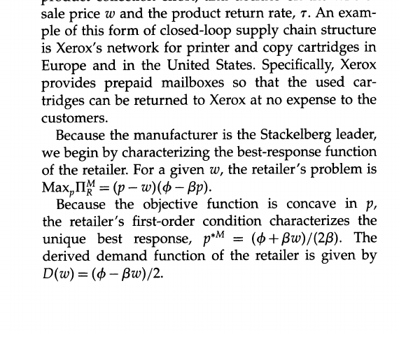

# Closed-Loop Supply Chain Models with Product Remanufacturing

> **Nature Reader 状态：结构化重建稿（机器译文底稿，未完成人工逐句审校）**
>
> 原始文件：`闭环供应链与再制造\Closed-Loop Supply Chain Models with Product Remanufacturing (Savaskan, R. Canan Bhattacharya etc.) (z-library.sk, 1lib.sk, z-lib.sk)(1).pdf`  
> 来源：Management Science（2004）  
> 文献类型：analytical/modeling  
> 总页数：15

## 阅读索引

以下页码链接指向该页第一个可提取文本块；没有可提取文本的页面会保留页码但不生成块链接。

p.1 · [p.2](#s001) · [p.3](#s018) · [p.4](#s035) · [p.5](#s056) · [p.6](#s079) · [p.7](#s100) · [p.8](#s120) · [p.9](#s140) · [p.10](#s162) · [p.11](#s180) · [p.12](#s198) · [p.13](#s212) · [p.14](#s240) · [p.15](#s248)

## 术语表

| Canonical term | 中文 | 统一规则 |
|---|---|---|
| closed-loop supply chain (CLSC) | 闭环供应链（CLSC） | 首次出现给出全称 |
| remanufacturing | 再制造 | 与材料回收区分 |
| take-back channel | 回收渠道 | 指使用后产品回收结构 |
| retailer collection | 零售商回收 | 回收模式之一 |
| third-party collection | 第三方回收 | 回收模式之一 |

## 全文中英对照

## Page 2

**Source:** p.2 S001 · extraction confidence: medium

**Original:** Closed-Loop Supply Chain Models with Product Remanufacturing R. CananSavaskan Kellogg School ofManagement, Northwestern University, Evanston, Illinois 60208, r-savaskan@kellogg.northwestern.edu ShantanuBhattacharya,LukN.

**中文:** 闭环 供应链模型 产品再制造 R。 迦南萨瓦斯坎 凯洛格 学校 管理学， 西北大学 大学， 埃文斯顿, 伊利诺伊州 60208，r-savaskan@kellogg.northwestern.edu ShantanuBhattacharya，LukN。

**Source:** p.2 S002 · extraction confidence: low

**Original:** VanWassenhove Technology Management,

**中文:** 范瓦森霍夫 技术 管理，

**Source:** p.2 S003 · extraction confidence: low

**Original:** INSEAD,

**中文:** 欧洲工商管理学院，

**Source:** p.2 S004 · extraction confidence: low

**Original:** Boulevard deConstance, 77305 Fontainebleau, Cedex, France {shantanu.bhattacharya@insead.edu, luk.van-wassenhove@insead.edu} The importanceof remanufacturing used productsintonew ones hasbeenwidely recognizedin the literature T and in practice.Inthis paper,we addressthe problemof choosingthe appropriatereversechannelstructure for the collectionof used products from customers.Specifically,we consider a manufacturerwho has three options for collectingsuch products:(1) she can collect them herselfdirectlyfromthe customers,(2) she can providesuitableincentivesto an existingretailer(who alreadyhas a distributionchannel)to inducethe collection,or (3)she cansubcontractthe collectionactivityto a thirdparty.Basedon our observationsin the industry, we model the threeoptions describedabove as decentralizeddecision-makingsystems with the manufacturer being the Stackelberg leader.Whenconsideringdecentralizedchannels,we find that ceterisparibus,the agent, who is closerto the customer(i.e., the retailer),is the most effectiveundertakerof productcollectionactivity for the manufacturer.

**中文:** 大道 德康斯坦斯, 77305 枫丹白露, 塞德克斯, 法国 {shantanu.bhattacharya@insead.edu，luk.van-wassenhove@insead.edu} 的 将旧产品再制造成新产品的重要性在文献和实践中已得到广泛认识。在本文中，我们解决了为从客户那里收集旧产品选择适当的反向渠道结构的问题。具体来说，我们考虑制造商有三种选择来收集此类产品：（1）她可以直接从客户那里收集它们，（2）她可以向现有零售商（已经拥有分销渠道）提供适当的激励以诱导收集，或(3)她可以将收货活动分包给第三方。根据我们对行业的观察，我们将上述三种选择建模为以制造商为Stackelberg领导者的去中心化决策系统。在考虑去中心化渠道时，我们发现离客户（即零售商）较近的代理商是制造商产品收货活动最有效的承担者。

**Source:** p.2 S005 · extraction confidence: high

**Original:** In addition,we show that simple coordinationmechanismscan be designed such that the collectioneffortof the retailerand the supply chainprofitsareattainedat the same level as in a centrally coordinatedsystem.

**中文:** 此外，我们表明可以设计简单的协调机制，使得 零售商的收款工作和供应链利润达到与中央协调系统相同的水平。

**Source:** p.2 S006 · extraction confidence: high

**Original:** Keywords:supply chainmanagement;reverselogistics;remanufacturing;

**中文:** 关键词：供应链管理；逆向物流；再制造；

**Source:** p.2 S007 · extraction confidence: high

**Original:** channelstructure History:Acceptedby ChristopherTang,formerdepartmenteditor;receivedOctober24, 2003.Thispaperwas with the authors26 monthsfor 3 revisions.

**中文:** 渠道结构 历史：被前系编辑 Christopher Tang 接受；收稿日期：2003 年 10 月 24 日。本文为 与作者一起26个月修改3次。

**Source:** p.2 S008 · extraction confidence: high

**Original:** 1. Introduction

**中文:** 一、简介

**Source:** p.2 S009 · extraction confidence: low

**Original:** The importance of the environmental performance of products and processes for sustainable manufacturing and service operations increasingly is being recognized. While legislation introduced in Europe, North America, and Japan encourages this awareness, many corporations have proactively taken measures in anticipation of evolving environmental performance requirements.

**中文:** 环境绩效的重要性 可持续制造和服务运营的产品和流程越来越受到认可。 虽然欧洲出台了立法，但北欧 美国和日本鼓励这种意识，许多 企业已积极采取措施来应对不断变化的环境绩效要求。

**Source:** p.2 S010 · extraction confidence: low

**Original:** Increasingly, manufacturers of durable and nondurable goods are establishing economically viable production and distribution systems that enable remanufacturing of used products in parallel with the manufacturing of new units.

**中文:** 越来越多的耐用品和非耐用品制造商正在建立经济上可行的生产和分销系统，使旧产品的再制造与新产品的制造同时进行。

**Source:** p.2 S011 · extraction confidence: low

**Original:** Remanufactured products are typically upgraded to the quality standards of new products, so that they can be sold in new product markets. In this paper, we consider product categories in which there is no distinction between a remanufactured and a manufactured product, and we refer to the distribution systems, which use a combination of manufacturing and remanufacturing, as closed-loopsupply chains.

**中文:** 再制造产品通常会升级到新产品的质量标准，以便在新产品市场上销售。 在本文中，我们考虑再制造和制造产品之间没有区别的产品类别，并将制造和再制造相结合的分销系统称为闭环供应链。

**Source:** p.2 S012 · extraction confidence: low

**Original:** The prospect of remanufacturing poses interesting questions with respect to the design and management of closed-loop supply chains. The goal of this paper is to develop a detailed understanding of the implications that a manufacturer's reverse channel choice has on forward channel decisions and the used-product return rate from the customers.

**中文:** 再制造的前景令人感兴趣 有关闭环供应链的设计和管理的问题。 本文的目的是详细了解制造商的反向渠道选择对正向渠道决策和客户的二手产品退货率的影响。

**Source:** p.2 S013 · extraction confidence: low

**Original:** In current practice, we find a variety of reverse channel formats deployed by manufacturers. In some cases, manufacturers collect their used products directly from the customers.

**中文:** 在目前的实践中，我们发现了多种反向 制造商部署的渠道格式。 在某些情况下，制造商直接从客户那里收集用过的产品。

**Source:** p.2 S014 · extraction confidence: low

**Original:** For instance, Xerox Corporation provides prepaid mailboxes so that customers can easily return their used copy or print cartridges to Xerox without incurring any costs. The company also remanufactures high-value, endof-lease copiers (Xerox Corporation 2001).

**中文:** 例如，施乐 公司提供预付费邮箱，以便 客户可以轻松地将用过的复印或打印墨盒退还给施乐，而无需支付任何费用。 该公司还再制造高价值、租赁结束的复印机（Xerox Corporation 2001）。

**Source:** p.2 S015 · extraction confidence: low

**Original:** The used copiers are collected directly by Xerox as new ones are installed. Overall, the green remanufacturing program saves the company 40%-65% in manufacturing costs through the reuse of parts and materials (Ginsburg 2001).

**中文:** 当安装新复印机时，施乐会直接收集用过的复印机。 总体而言，绿色再制造计划通过零件和材料的再利用为公司节省了 40%-65% 的制造成本（Ginsburg 2001）。

**Source:** p.2 S016 · extraction confidence: low

**Original:** Similar activities are undertaken by Hewlett Packard Corporation for computers and peripherals, and by Canon for print and copy cartridges. Manufacturers of consumer products such as single-use cameras and mobile phones utilize retailers for collecting their used products.

**中文:** 休利特也开展了类似的活动 Packard Corporation 生产计算机和外围设备， 佳能的打印和复印墨盒。 消费品制造商，例如 一次性相机和手机利用零售商来收集其用过的产品。

**Source:** p.2 S017 · extraction confidence: low

**Original:** For instance, Eastman Kodak Company receives single-use cameras from large retailers that also develop film for customers. On average, 76% of the weight of a disposed 239 This content downloaded from 142.12.73.66 on Mon, 22 Apr 2013 14:09:08 PM All use subject to JSTOR Terms and Conditions Savaskan,Bhattacharya, and VanWassenhove:Closed-Loop SupplyChainModels

**中文:** 例如， 伊士曼柯达公司收到一次性相机 来自也为客户开发胶片的大型零售商。 平均而言，76% 的权重已被处置 239 此内容于 2013 年 4 月 22 日星期一 14:09:08 PM 从 142.12.73.66 下载 所有使用均须遵守 JSTOR 条款和条件 萨瓦斯坎、巴塔查亚、 和 VanWassenhove：闭环 供应链模型

## Page 3

**Source:** p.3 S018 · extraction confidence: high

**Original:** 240 Management

**中文:** 240 管理

**Source:** p.3 S019 · extraction confidence: medium

**Original:** Science50(2),pp. 239-252,D2004INFORMS camerais reusedin the productionof a new one. Each time a camera is returned to Kodak, the retaileris reimburseda fixedfee per cameraand the transportation costs.

**中文:** 《科学》50(2)，第 127 页。 239-252，D2004INFORMS 相机在新相机的生产中被重复使用。 每次将相机退回柯达时，零售商都会报销每台相机的固定费用和运输费用。

**Source:** p.3 S020 · extraction confidence: low

**Original:** In the auto industry,independentthirdparties(i.e., dismantlers) are handling used-product collection activities for the original equipment manufacturers (OEMs).Recently,the "bigthree"auto manufacturers in the United Statesstartedto invest in jointresearch and remanufacturingpartnershipswith dismantling centers to benefit from their scale economies and experience (Bylinsky 1995).

**中文:** 在汽车行业，独立的第三方（即拆解商）正在为原始设备制造商（OEM）处理二手产品收集活动。最近，美国的“三大”汽车制造商开始投资于与拆解中心的联合研究和再制造合作伙伴关系，以从其规模经济和经验中受益（Bylinsky 1995）。

**Source:** p.3 S021 · extraction confidence: low

**Original:** Third parties such as GENCO Distribution System are also preferredby some consumer goods manufacturersfor their experiencein used-productcollection(Hickey2001). To investigate how reverse channel choice affects the forwardchannel decisions and the used-product returnrates,we considera two-echelonsupply chain and model a single manufacturer-retailer dyad with product remanufacturing.1Based on observations from currentpractice and the extant literature,we consider three reverse channelformats:(1) manufacturercollecting used products directlyfrom the customers (Model M), (2) manufacturercontractingthe collectionof used productsto the retailer(ModelR), and (3) manufacturercontracting the collection of used products to a third party (Model 3P).

**中文:** 第三方，例如 GENCO 配电系统也是首选 一些消费品制造商在二手产品收集方面拥有丰富的经验（Hickey2001）。 研究反向通道选择如何影响 根据正向渠道决策和二手产品退货率，我们考虑两级供应链，并通过产品再制造对单一制造商-零售商二元组进行建模。1根据对当前实践和现有文献的观察，我们考虑三种反向渠道格式：（1）制造商直接从客户那里收集二手产品（模型M），（2）制造商将二手产品的收集承包给零售商（模型R），以及（3）制造商承包二手产品的收集产品提供给第三方（型号 3P）。

**Source:** p.3 S022 · extraction confidence: low

**Original:** We contrast the results for the decentralizedchannels with the centrallycoordinatedsystem (Model C) to illustratepotentialsources of inefficienciesin closed-loop supply chains.

**中文:** 我们将分散渠道与中央协调系统（模型 C）的结果进行对比，以说明闭环供应链效率低下的潜在根源。

**Source:** p.3 S023 · extraction confidence: low

**Original:** Morespecifically,we addressthe followingresearch questions: (1) How are the wholesale price, the retail price, and the total channelprofitsaffectedby the choice of the reversechannelstructure?

**中文:** 更具体地说，我们进行以下研究 问题：（1）反向渠道结构的选择对批发价、零售价和总渠道利润有何影响？

**Source:** p.3 S024 · extraction confidence: low

**Original:** (2) How do the closed-loopsupply chainstructures influencethe incentivesto invest in used-productcollection and the productreturnrates? Some of the key results of this paper demonstrate that in a closed-loop supply chain, the retailerhas an importantdual role due to his proximity to the market.Theanalysisshows thatwhen pricesaresensitive to changes in unit production costs, by being closer to the final demand, the retailer can efficiently reflect unit cost savings from remanufacturing to the final price of the product, and jointly optimize the investment in used-product collection.

**中文:** （2）闭环供应链结构如何影响旧产品回收的投资动机和产品退货率？ 本文的一些关键结果表明 在闭环供应链中，零售商因其贴近市场而扮演着重要的双重角色。分析表明，当价格对单位生产成本变化敏感时，通过更接近最终需求，零售商可以有效地将单位成本节省从再制造反映到产品的最终价格上，共同优化旧产品收集的投资。

**Source:** p.3 S025 · extraction confidence: low

**Original:** The manufacturer is at a disadvantage in coordinating pricing and used-product return rates, because she faces double marginalization in the forward channel. The thirdparty model is the least-preferred option because the payments made to the third party for undertaking collection become a direct cost to the supply chain, do not induce incentivesto increasethe finaldemand and, therefore, reduce the profitability of product remanufacturing.The model also demonstratesthat the manufacturercan furtherimprove the profits of the R Model to the level of a centrally coordinated system by using a single two-parttariff.Becausewe define the two-part tariffcontingent on the product returnrate, it not only coordinatesthe pricing decision of the retailerin the forwardchannelbut also the collectioneffortin the reversechannel.

**中文:** 制造商在协调定价和二手产品退货率方面处于劣势，因为她在前向渠道中面临双重边缘化。 第三方模式是最不受欢迎的选择，因为向第三方收取的费用成为供应链的直接成本，不会产生增加最终需求的激励，从而降低产品再制造的盈利能力。该模型还表明，制造商可以通过使用单一的两部分关税将R模型的利润进一步提高到中央协调系统的水平。因为我们根据产品退货率定义了两部分关税，它不仅协调零售商在正向渠道中的定价决策，以及反向渠道中的收集工作。

**Source:** p.3 S026 · extraction confidence: low

**Original:** On a broaderlevel, this paper contributesto our understandingaboutthe interactionsbetween reverse and forwardchanneldecisions, as well as the incentives of the agentsto invest in used-productcollection in differentreversechannelstructures.

**中文:** 在更广泛的层面上，本文有助于我们 了解反向和正向渠道决策之间的相互作用，以及代理商在不同反向渠道结构中投资于旧产品收集的激励。

**Source:** p.3 S027 · extraction confidence: low

**Original:** The rest of this paper is organized as follows. In the following section, we briefly discuss the current literature and the contribution of this paper. Section 3 is devoted to the conceptualizationand formulationof the model.Followingthe developmentof the model, the analyticalresults for the optimal closedloop supply chainstructuresarepresentedin s4.

**中文:** 本文的其余部分组织如下。 在下一节中，我们简要讨论当前的文献和本文的贡献。 第 3 节致力于模型的概念化和公式化。随着模型的发展，最佳闭环供应链结构的分析结果在第 4 节中给出。

**Source:** p.3 S028 · extraction confidence: low

**Original:** Section 5 examines channel coordination mechanisms with used product collection.We outline the limitations of this work and possible directionsfor future researchin s6.

**中文:** 第 5 节研究了使用过的产品收集的渠道协调机制。我们概述了这项工作的局限性以及第 6 节中未来研究的可能方向。

**Source:** p.3 S029 · extraction confidence: high

**Original:** 2. Literature

**中文:** 2. 文学

**Source:** p.3 S030 · extraction confidence: low

**Original:** This paper draws on and contributes to several streams of literature, each of which we review below. A growing literaturein operations management addresses reverse logistics managementissues for remanufacturable products.

**中文:** 本文借鉴并贡献了一些 文献流，我们在下面逐一回顾。 越来越多的运营管理文献解决了可再制造产品的逆向物流管理问题。

**Source:** p.3 S031 · extraction confidence: low

**Original:** We refer the reader to Fleischmannet al. (1997)and Guide et al (2000) for completeliteraturereviews. Thebasic underlying assumption in these papers is that the planning of closed-loopsupply chainoperations,such as network design (Krikke1998),shop-floorcontrol(Guideet al.

**中文:** 我们建议读者参考 Fleischmannet al。 (1997) 和 Guide 等人 (2000) 进行完整的文献综述。 这些论文的基本假设是闭环供应链运营的规划，例如网络设计（Krikke1998）、车间控制（Guideet al.

**Source:** p.3 S032 · extraction confidence: low

**Original:** 1997),and inventory control (van der Laan 1997)is done by a central decision maker to optimize total system performance.By adapting a game-theoretic approach,we relax the centralizedplanner assumption and model the independent decision-making process of each supply chain member.

**中文:** 1997），库存控制（van der Laan 1997）由中央决策者完成，以优化总体系统性能。通过采用博弈论方法，我们放宽了集中计划假设，并对每个供应链成员的独立决策过程进行建模。

**Source:** p.3 S033 · extraction confidence: low

**Original:** Specifically, we examine the interaction between pricing decisions in the forward channel and the incentives to collect used products under different reverse channel structures.

**中文:** 具体来说，我们研究了正向渠道中的定价决策与不同反向渠道结构下收集二手产品的激励之间的相互作用。

**Source:** p.3 S034 · extraction confidence: low

**Original:** There is a growing number of research papers on reverse logistics that use game theory to model remanufacturing decisions. Majumder and Groenevelt (2001) examine how third-party remanufacturing can induce competitive behavior when the recycled products cannibalize the demand for the original product.

**中文:** 研究论文数量不断增加 逆向物流，使用博弈论对再制造决策进行建模。 Majumder 和 Groenevelt (2001) 研究了当回收产品蚕食原始产品的需求时，第三方再制造如何引发竞争行为。

## Page 4

**Source:** p.4 S035 · extraction confidence: low

**Original:** Debo et al (2002) model the durability choice 1 Throughout this paper, we adopt the convention of using the pronoun "she" to refer to the manufacturer. All other supply chain members are refered to by the pronoun "he." This content downloaded from 142.12.73.66 on Mon, 22 Apr 2013 14:09:08 PM All use subject to JSTOR Terms and Conditions Savaskan,Bhattacharya, and VanWassenhove:Closed-Loop SupplyChainModels Management Science 50(2), pp.239-252, @2004

**中文:** Debo 等人 (2002) 对耐用性选择进行建模 1 在本文中，我们采用代词“她”来指代制造商的惯例。 所有其他供应链成员均由代词“他”指代。此内容于 2013 年 4 月 22 日星期一 14:09:08 PM 从 142.12.73.66 下载 所有使用均须遵守 JSTOR 条款和条件 萨瓦斯坎、巴塔查亚、 和 VanWassenhove：闭环 供应链模型 管理 科学 50(2)，第239-252页，@2004

**Source:** p.4 S036 · extraction confidence: high

**Original:** INFORMS 241

**中文:** 通知241

**Source:** p.4 S037 · extraction confidence: low

**Original:** of the (re)manufacturer when consumersact strategically.Whilewe specificallymodel the reversechannel design decisions, in the cited papers, such decisions areassumed exogenous to the model structure.

**中文:** 当消费者采取战略行动时，（再）制造商的行为。虽然我们专门对反向渠道设计决策进行了建模，但在引用的论文中，此类决策被认为是模型结构的外生因素。

**Source:** p.4 S038 · extraction confidence: low

**Original:** In the supply chain management literature, Pasternack(1985),Emmons and Gilbert (1998),and Donohue (2000) determine optimal product return contracts for short life-cycle products.

**中文:** 在供应链管理文献中， 帕斯特纳克 (1985)、埃蒙斯和吉尔伯特 (1998) 以及 Donohue (2000) 确定最佳产品回报 短生命周期产品的合同。

**Source:** p.4 S039 · extraction confidence: low

**Original:** The returns considered in these studies occur at the end of the selling season due to demand uncertaintyand the retailer's overstocking of inventory. Related to this groupof work,Padmanabhanand Png (1997)explore how ordering flexibility from buy-back contracts affects the retail-level competition.

**中文:** 由于需求不确定性和零售商库存过剩，这些研究中考虑的退货发生在销售季节末。 与这组工作相关的是，Padmanabhanand Png (1997) 探讨了回购合同的订购灵活性如何影响零售层面的竞争。

**Source:** p.4 S040 · extraction confidence: low

**Original:** In contrast, we considerused products,which arereturnedfromconsumersfor remanufacturing, and we discuss contract forms,whichwould jointlycoordinatethereverseand the forwardchannels.

**中文:** 相比之下，我们考虑从消费者处退回进行再制造的二手产品，并讨论合同形式，这将共同协调反向和正向渠道。

**Source:** p.4 S041 · extraction confidence: low

**Original:** Recentresearchalso shows a strong link between supply chain management and environmental improvement. Bierma and Waterstraat (2000) and Reiskinet al. (2000)discuss contractualmechanisms to reduce resourceuse.

**中文:** 最近的研究也显示了两者之间的密切联系 供应链管理和环境改善。 Bierma 和 Waterstraat (2000) 以及 Reiskinet 等人。 (2000)讨论减少资源使用的合同机制。

**Source:** p.4 S042 · extraction confidence: low

**Original:** Corbettand DeCroix (2001) examine shared-savingscontractsto overcomeincentive conflicts between a supplier and a buyer to reduce the use of indirect materials. This recent stream of work focuses on cost savings derived from reduction of consumption (ex ante), while we consider cost savings derived from product reuse (ex post).

**中文:** Corbettand DeCroix (2001) 研究了共享储蓄合同，以克服供应商和买方之间的激励冲突，从而减少间接材料的使用。 最近的工作重点是减少消耗（事前）带来的成本节约，同时我们考虑产品再利用（事后）带来的成本节约。

**Source:** p.4 S043 · extraction confidence: low

**Original:** In the marketing literature, Stern et al (1996) describe the role and the function of each channelmemberin differentclosed-loopsupply chain structureswithout providing a quantitativebasis for comparing these different channel formats.

**中文:** 在营销文献中，斯特恩等人 (1996)描述了不同闭环供应链结构中每个渠道成员的作用和功能，但没有提供比较这些不同渠道格式的定量基础。

**Source:** p.4 S044 · extraction confidence: low

**Original:** In contrast,in this paper,we try to provide such a comparison between the rolesof the differentchannelparties. The quantitativemodels of channel design in marketing have only looked at forwarddistributionsystems (Jeulandand Shugan1983,McGuireand Staelin 1983,Coughlan1985).Whilethe model structurepresented in this paper is consistent with this stream of work, we expand these models to also include reverse product and financialflows from consumers to manufacturers.

**中文:** 相比之下，在本文中，我们试图提供不同渠道方角色之间的比较。 营销中渠道设计的定量模型仅关注正向分销系统（Jeulandand Shugan 1983，McGuire and Staelin 1983，Coughlan 1985）。虽然本文提出的模型结构与该工作流程一致，但我们将这些模型扩展为还包括从消费者到制造商的反向产品和资金流。

**Source:** p.4 S045 · extraction confidence: low

**Original:** Last, but not least, there is also growing research interest in decision models for used-product acquisition when there is quality uncertainty in the return flows. See Guide and Van Wassenhove (2001) for a detailed discussion of this issue.

**中文:** 最后但并非最不重要的一点是，研究也在不断增长 当回流存在质量不确定性时，人们对二手产品收购的决策模型感兴趣。 有关此问题的详细讨论，请参阅 Guide 和 Van Wassenhove (2001)。

**Source:** p.4 S046 · extraction confidence: low

**Original:** In this paper, we focus on the channel choice decision and assume homogenous quality of returned products. Next, we present our modeling assumptions and the three closed-loop supply chain models.

**中文:** 在本文中，我们关注渠道选择决策并假设退货产品质量相同。 接下来，我们提出我们的建模假设和 三种闭环供应链模型。

**Source:** p.4 S047 · extraction confidence: high

**Original:** 3. Model Assumptions and Notation

**中文:** 3. 模型假设和符号

**Source:** p.4 S048 · extraction confidence: low

**Original:** We use the following notation throughout the paper: cmwill denote the unit cost of manufacturing a new product, and cr the unit cost of remanufacturinga returnedproductinto a new one, p is the retailprice of the product, w is the unit wholesale price, and b will denote the unit transferpriceof a returnedproduct fromthe retailer/thirdpartyto the manufacturer.

**中文:** 我们在整篇论文中使用以下符号： cm表示制造新产品的单位成本，cr表示将退货产品再制造成新产品的单位成本，p表示产品的零售价格，w表示单位批发价格，b表示退货产品从零售商/第三方到制造商的单位转移价格。

**Source:** p.4 S049 · extraction confidence: low

**Original:** D(p) is the demand for the new productin the market as a function of product price, and II denotes the profit function for channel member j in supply chainmodel i. Superscripti will takevalues C, M, R, and 3P, which will denote the centrallycoordinated, manufacturercollecting, retailer collecting, and the third-partycollecting models, respectively.The subscript j will take values M, R, and 3P, which will denote the manufacturer,the retailer,and the third party,respectively.

**中文:** D(p) 是市场上对新产品的需求，作为产品价格的函数，II 表示 供应链模型 i 中渠道成员 j 的利润函数。 上标i取值C、M、R和3P，分别表示中央协调、制造商收集、零售商收集和第三方收集模型。下标j取值M、R和3P，分别表示制造商、零售商和第三方。

**Source:** p.4 S050 · extraction confidence: low

**Original:** The primary goal of this paper is to understand the implicationsof differentclosed-loopsupply chain structureson incentivesto invest in used-productcollection and on supply chain profits.Hence, we consider the following scenarioand make the following modeling assumptions.

**中文:** 本文的主要目标是了解 不同闭环供应链结构对旧产品收集投资激励和供应链利润的影响。因此，我们考虑以下场景并做出以下建模假设。

**Source:** p.4 S051 · extraction confidence: low

**Original:** Suppose that the manufacturerhas incorporateda remanufacturingprocess for used products into her originalproductionsystem, so that she can manufacture a new product directly from raw materials,or remanufacture partorwhole of a returnedunit into a new product.

**中文:** 假设制造商已合并 将旧产品的再制造过程纳入到她原来的生产系统中，这样她就可以直接用原材料制造新产品，或者将部分或整个退回的单元再制造成新产品。

**Source:** p.4 S052 · extraction confidence: high

**Original:** AsSUMPTION

**中文:** 假设

**Source:** p.4 S053 · extraction confidence: high

**Original:** 1. Producing a new product by using a

**中文:** 1. 生产新产品

**Source:** p.4 S054 · extraction confidence: low

**Original:** usedproduct is lesscostlythanmanufacturing a newone, i.e., cr < cm and cr is the same for all remanufactured products. This assumptionstatesthat savings from materials and assemblyof subsystemswithin the new product dominatethe additionalcosts of disassembly,inspection for reusability,and the cost of remanufacturing.2 Therefore,ceteris paribus, the manufacturerstrictly prefersa higherproductreturnrateto a lower product return rate from the market because, through remanufacturing, she can lower herproductioncosts.

**中文:** 使用过的产品比制造新产品的成本更低， 即 cr < cm 且 cr 对于所有再制造产品都是相同的 产品。 该假设表明，材料节省 新产品中子系统的组装主要是额外的拆卸成本、可重用性检查以及再制造成本。2 因此，在其他条件不变的情况下，制造商严格 与市场上较低的产品退货率相比，她更喜欢较高的产品退货率，因为通过再制造，她可以降低生产成本。

**Source:** p.4 S055 · extraction confidence: low

**Original:** Thelastpartof Assumption1 caneasilybe relaxedby incorporatinga yield rateon returnedproductquality. Theyield ratemodels the uncertaintyin the reusability of used productsdue to differentusage patterns.3 ASSUMPTION 2.

**中文:** 假设 1 的最后一部分可以轻松地通过 结合退货产品质量的良率。 成品率模拟了由于不同使用模式而导致的旧产品可重复使用性的不确定性。3 假设 2。

## Page 5

**Source:** p.5 S056 · extraction confidence: low

**Original:** We characterize the reverse channel performanceby 7, the return rate of used productsfrom the customers. 7 denotesthefractionof currentgeneration productsremanufactured from returnedunits, i.e., 0 < 2Kodakincorporates considerations suchas partreusability, easeof disassembly,andrecoverability into theproductdesign processfor its single-usecameraline.

**中文:** 我们用 7 来表征反向渠道绩效，即客户使用过的产品的退货率。 7 表示当前一代产品再制造的比例 来自返回的单位，即 0 < 2柯达将零件可重复使用性、易于拆卸和可恢复性等考虑因素纳入其一次性相机系列的产品设计过程中。

**Source:** p.5 S057 · extraction confidence: low

**Original:** Thisenablesthem to easily disassemble returnedcamerasand, thus, manufacturenew ones at lower unit costs by only replacingpartssuch as the lens and thebattery. 3Itcaneasilybe shownthattheuncertainty in thereturnedproduct qualityreducesthe incentivesto invest in used productcollection, becausethe benefitfromthe investmentwill be lower.

**中文:** 这使他们能够轻松拆卸退回的相机，从而只需更换镜头和电池等部件即可以较低的单位成本制造新相机。 3 很容易证明，退货产品质量的不确定性会降低投资旧产品收藏的动力，因为投资的收益会降低。

**Source:** p.5 S058 · extraction confidence: medium

**Original:** This content downloaded from 142.12.73.66 on Mon, 22 Apr 2013 14:09:08 PM All use subject to JSTOR Terms and Conditions Savaskan,Bhattacharya, and VanWassenhove:Closed-Loop SupplyChainModels

**中文:** 此内容于 2013 年 4 月 22 日星期一 14:09:08 PM 从 142.12.73.66 下载 所有使用均须遵守 JSTOR 条款和条件 萨瓦斯坎、巴塔查亚、 和 VanWassenhove：闭环 供应链模型

**Source:** p.5 S059 · extraction confidence: medium

**Original:** 242 Management

**中文:** 242 管理

**Source:** p.5 S060 · extraction confidence: medium

**Original:** Science 50(2), pp.239-252, @2004

**中文:** 科学 50(2)，第239-252页，@2004

**Source:** p.5 S061 · extraction confidence: low

**Original:** INFORMS

**中文:** 通知

**Source:** p.5 S062 · extraction confidence: low

**Original:** r < 1. Wemodelr as afunctionof theproduct collection effort,whichis denoted by I, theinvestment in collection activities.Suchinvestments can beconsidered as promotionalexpenditures undertaken bythecollecting agent.

**中文:** r < 1. 我们将其建模为产品的函数 催收努力，用I表示，即催收活动的投资。此类投资可以被视为催收机构承担的促销支出。

**Source:** p.5 S063 · extraction confidence: low

**Original:** Hence, one can think of r as the response of consumers who have an incentive/enthusiasm for the remanufacturingof their used products as a result of the promotional/advertisingactivitiesof the agent in the reversechannel.To characterizethe diminishing returnsto investment,we use the cost structure 7 = VI/CL, where CL is a scaling parameter. Similar forms of response functions have been widely used in the advertising response models of consumer retentionand product awareness(Lilienet al.

**中文:** 因此，我们可以将 r 视为对某项产品有激励/热情的消费者的反应。 由于代理商在反向渠道中的促销/广告活动而对其旧产品进行再制造。为了描述投资收益递减的特征，我们使用成本结构 7 = VI/CL，其中 CL 是缩放参数。类似形式的响应函数已被广泛应用 用于消费者保留和产品认知的广告响应模型（Lilienet al.

**Source:** p.5 S064 · extraction confidence: low

**Original:** 1992, Fruchterand Kalish 1997, Zhao 2000), and in salesforce effort response models in the marketing literature (Coughlan 1993). In the operations literature, Porteus (1986) and Fine and Porteus (1989) use similarinvestmentfunctionsto investigateopportunities for process improvement and lot sizing by investingin setupcostreductionandqualityimprovement.

**中文:** 1992，Fruchterand Kalish 1997，Zhao 2000），以及营销文献中的销售队伍努力响应模型（Coughlan 1993）。 在运营文献中，Porteus（1986）以及 Fine 和 Porteus（1989）使用类似的投资函数来通过投资于降低设置成本和提高质量来研究流程改进和批量大小的机会。

**Source:** p.5 S065 · extraction confidence: low

**Original:** This paper investigatestradeoffsthat are similarto those in the above studies in a remanufacturing context. FromAssumptions 1 and 2, the average unit cost of manufacturing can be written as c = cm (1 - r) + c,7.

**中文:** 本文研究了与上述研究在再制造背景下类似的权衡。 根据假设 1 和假设 2，平均单位成本 制造量可写为 c = cm (1 - r) + c,7。

**Source:** p.5 S066 · extraction confidence: low

**Original:** Note that when every consumer returns his or her used product (i.e., r = 1), c = cr. If the return rate of used products is zero, then all demand will be satisfied from manufactured units and, therefore, c = cm.If we denote unit cost savings from reuse by A (i.e., A = cmc,), the average unit cost is given by cmTA.

**中文:** 请注意，当每个消费者退回他或她的 使用过的产品（即 r = 1），c = cr。如果退货率 使用过的产品的数量为零，那么所有需求都将从制造单元中得到满足，因此， c = cm。如果我们表示重复使用所节省的单位成本 通过 A（即 A = cm-c），平均单位成本为 由 cm-TA 给出。

**Source:** p.5 S067 · extraction confidence: low

**Original:** Similar cost structures can also be found in the literature,which looks at process improvementdecisions and cost reductionincentives in supply chains(Guptaand Loulou1998,Gilbertand Cvsa2000).Thesimilarityin formulationis consistent because,in this paper,an increasein productremanufacturingwould also mean a reductionin the average unit cost of manufacturing.

**中文:** 类似的成本结构也可以在文献中找到，这些文献着眼于供应链中的流程改进决策和成本降低激励措施（Gupta和Loulou1998，Gilbert和Cvsa2000）。公式中的相似性是一致的，因为在本文中，产品再制造的增加也意味着制造平均单位成本的降低。

**Source:** p.5 S068 · extraction confidence: high

**Original:** ASSUMPTION

**中文:** 假设

**Source:** p.5 S069 · extraction confidence: low

**Original:** 3. There

**中文:** 3.那里

**Source:** p.5 S070 · extraction confidence: low

**Original:** is a variable unitcostofcollectingandhandling a returned unit,whichis denoted byA. For remanufacturingto be economicallyviable,we assume that A < A, i.e., thefixed paymentper unit is less than the savings generatedper unitfrom remanufacturing.

**中文:** 是收集和处理退回单位的可变单位成本，用 A 表示。 为了使再制造在经济上可行，我们假设 A < A，即每单位的固定付款额小于 再制造带来的每单位成本节省。

**Source:** p.5 S071 · extraction confidence: low

**Original:** One can think of A as the fixed payment given to the consumer who returns a used product. Consider the reverse vending machines that collect used products (e.g., soft drink cans).

**中文:** 我们可以将 A 视为给出的固定付款 返还旧产品的消费者。 考虑收集用过的产品（例如软饮料罐）的反向自动售货机。

**Source:** p.5 S072 · extraction confidence: low

**Original:** Each customer who returns a used product to these machines receives a fixed payment per unit, which is represented by the parameter A in our model. Note that A is exogenous to the model and does not affect the demand for the product.

**中文:** 每个将用过的产品退回到这些机器的客户都会收到每单位的固定付款，这由我们模型中的参数 A 表示。 请注意，A 对于模型来说是外生的，不会影响产品的需求。

**Source:** p.5 S073 · extraction confidence: low

**Original:** This would be the case for consumer products (i.e., cameras,cartridges)with low salvage value and no secondarymarkets(Swan 1972).In the case of durablegoods, one should also considerhow the secondarymarket/trade-invalue of a used product affectsthe consumer's decision to replacehis or her used product.Assumption 3 also implies that A does not increasewith the scale of operations.This is consistentwith supply chain structures,where the reverse channel has sufficient capacity so that the product returnrate is driven by the collection effort and by induced awarenessand participationof consumers in productremanufacturing.4 The total cost of collection C(r) can then be characterized as a function of the return rate of used

**中文:** 对于残值低且没有二级市场的消费品（即相机、墨盒）来说，情况就是如此（Swan 1972）。就耐用品而言，还应该考虑二手产品的二级市场/贸易价值如何影响消费者更换他或她的二手产品的决定。假设3也意味着A不会随着经营规模的增加而增加。这与供应链结构一致，其中反向渠道有足够的容量，使得产品退货率由收集工作以及消费者对产品再制造的意识和参与所驱动。4 然后，收集的总成本 C(r) 可以表征为所用回收率的函数

**Source:** p.5 S074 · extraction confidence: low

**Original:** productsand is given by C(7)= I + ArD(p)= CLT2+ ATrD(p), where TD(p) is the total number of units returned from consumers and remanufacturedinto new products. Because we intend to compare the incentivesof collectingagentsacrossdifferentreverse channelstructures,we assumethe samecost structure forallclosed-loopsupply chainmodels.Intheconclusion section,we discuss otherfactorsthat may bring in collectioncost advantagesto some reversechannel structures.

**中文:** 乘积由下式给出： C(7)= I + ArD(p)= CLT2+ ATrD(p), 其中 TD(p) 是从消费者处退回并再制造成新产品的单位总数。 因为我们打算比较不同反向渠道结构中收款代理的激励，所以我们假设所有闭环供应链模型都具有相同的成本结构。在结论部分，我们讨论可能为某些反向渠道结构带来收款成本优势的其他因素。

**Source:** p.5 S075 · extraction confidence: high

**Original:** AsSUMPTION

**中文:** 假设

**Source:** p.5 S076 · extraction confidence: high

**Original:** 4. We consider a two-echelonsupply

**中文:** 4.我们考虑两梯队供应

**Source:** p.5 S077 · extraction confidence: low

**Original:** chainand modela bilateralmonopolybetweena single manufacturer and a single retailer.This enablesus to exploretheimplications of assigninga dualroleto aforwardchannelmember.

**中文:** 链并在单个制造商和单个零售商之间建立双边垄断模型。这使我们能够探索为前向渠道成员分配双重角色的含义。

**Source:** p.5 S078 · extraction confidence: low

**Original:** Specifically, if the retailerundertakesthe collectioneffort,he not only determinesthe quantitydemanded in themarket bysettingtheretailprice of the product,but also by his collectioneffortlevel,he influences theaverage manufacturing costof theproduct.

**中文:** 具体来说， 如果零售商进行收集努力，他不仅通过设定产品的零售价格来决定市场需求的数量，而且通过他的收集努力水平，他影响产品的平均制造成本。

## Page 6

**Source:** p.6 S079 · extraction confidence: low

**Original:** Even thoughwe considera single manufacturer-retailer structure,the manufacturer can, infact, sell to different retailers if theretailers arenot in directcompetition. The manufacturer canalsomanufacture competing brands, but shedoesnotsellcompeting brands tothesameretailer and thebrands donotsharethesamemanufacturing process.5 Theretailer canalsocarrymanybrands, butforsimplicity, we consideronly one brand for whichhe takesdecisions independent oftheotherexistingbrands.

**中文:** 尽管我们考虑单一制造商-零售商 事实上，如果零售商不直接竞争，制造商可以向不同的零售商销售产品。 的 制造商也可以制造竞争品牌，但她不会将竞争品牌出售给同一家零售商，而且这些品牌不共享相同的制造流程。 5 零售店 也可以包含许多品牌，但为了简单起见，我们只考虑一个品牌，他的决策独立于其他现有品牌。

**Source:** p.6 S080 · extraction confidence: high

**Original:** ASSUMPTION

**中文:** 假设

**Source:** p.6 S081 · extraction confidence: low

**Original:** 5. D(p) =

**中文:** 5. D(p) =

**Source:** p.6 S082 · extraction confidence: low

**Original:** - - jSp, with 7 and P being positive parametersand 4 > Scm. We assume a downward sloping linear demand function. Lee and Staelin (1997) show that the vertical interaction between the channel members and the optimality of the channel strategies depend on 4 Forinstance,KodakandKmartengagein jointpromotionalactivities to increasethe awarenessof the single-usecamerarecycling programamongyoung consumers(DiscountStoreNews 1994).

**中文:** - - jSp，其中 7 和 P 为 正参数4>Scm。 我们假设需求呈向下倾斜的线性 功能。 Lee和Staelin (1997)表明，渠道成员之间的纵向互动和渠道策略的最优性取决于 4 例如，柯达和凯马特联合开展促销活动，以提高人们对一次性相机回收的认识 年轻消费者的计划（DiscountStoreNews 1994）。

**Source:** p.6 S083 · extraction confidence: low

**Original:** 5 Thisenablesus to decouplethe cross-brand elasticitiesin recommending a suitableclosed-loopsupply chain to the manufacturer in differentenvironments. This content downloaded from 142.12.73.66 on Mon, 22 Apr 2013 14:09:08 PM All use subject to JSTOR Terms and Conditions Savaskan,Bhattacharya, and VanWassenhove:Closed-Loop SupplyChainModels Management Science50(2),pp.

**中文:** 5 这使我们能够解耦跨品牌 在不同环境下向制造商推荐合适的闭环供应链的弹性。 此内容于 2013 年 4 月 22 日星期一 14:09:08 PM 从 142.12.73.66 下载 所有使用均须遵守 JSTOR 条款和条件 萨瓦斯坎、巴塔查亚、 和 VanWassenhove：闭环 供应链模型 管理 《科学》50(2)，第 127 页。

**Source:** p.6 S084 · extraction confidence: medium

**Original:** 239-252,c2004 INFORMS 243 the convexity of the demand functions.Therefore,it should be pointed out that while the linear demand assumption is consistent with the literature(Bulow 1982,Weng 1995)and enables us to develop a firstcut analysis of the closed-loop supply chain decision of the manufacturer, the generalizabilityof the results to nonlineardemandfunctionsis a questionof future research.6 Thelastpartof Assumption5 is a condition for nonnegativedemand.

**中文:** 239-252，c2004 INFORMS 243 需求函数的凸性。因此，应该指出的是，虽然线性需求假设与文献一致（Bulow 1982，Weng 1995）并使我们能够对制造商的闭环供应链决策进行初步分析，但结果对非线性需求函数的泛化性是未来研究的问题。 6 假设5的最后一部分是一个条件 为非负需求。

**Source:** p.6 S085 · extraction confidence: low

**Original:** To model the supply chain members' incentives under differentclosed-loop supply chain structures, we use the principal-agentframework (Laffontand Tirole1993)and make the following assumptionconcerningthe power structurein the supply chain.

**中文:** 对供应链成员的激励进行建模 在不同的闭环供应链结构下，我们采用委托代理框架（Laffontand Tirole，1993），对供应链中的权力结构做出如下假设。

**Source:** p.6 S086 · extraction confidence: high

**Original:** ASSUMPTION

**中文:** 假设

**Source:** p.6 S087 · extraction confidence: high

**Original:** 6. In all our supplychainmodelswith

**中文:** 6. 在我们所有的供应链模型中

**Source:** p.6 S088 · extraction confidence: low

**Original:** remanufacturing, themanufacturer hassufficient channel powerover the retailerand the thirdparty to act as a Stackelberg leader. Thisassumptionstatesthatin determiningthe outcome of the game played between the manufacturer and the retailer,the manufactureruses her foresight abouttheretailer'sandthe thirdparty'sreactionfunctions in her decision making.

**中文:** 再制造，制造商对零售商和第三方有足够的渠道力量，可以充当再制造商的角色。 斯塔克尔伯格 领导者。 该假设表明，在确定制造商之间的博弈结果时 与零售商相比，制造商利用对零售商和第三方反应的远见来做出决策。

**Source:** p.6 S089 · extraction confidence: low

**Original:** The Stackelbergstructureforthe solutionof similargameshas been widely used in the supply chainliterature(Tayuret al.

**中文:** 用于解决类似博弈的 Stackelberg 结构已广泛应用于供应链文献中（Tayuret al.，2014）。

**Source:** p.6 S090 · extraction confidence: low

**Original:** 1998).

**中文:** 1998）。

**Source:** p.6 S091 · extraction confidence: low

**Original:** AsSUMPTION7. Whileoptimizing theirobjective functions,all supplychainmembers haveaccessto the same information. This assumption enables us to control for inefficiencies and risk-sharingissues resultingfrom information asymmetry (Corbett and De Groote 2000).

**中文:** 假设7。 在优化目标函数的同时，所有供应链成员都可以访问相同的信息。 这一假设使我们能够控制因信息不对称而导致的低效率和风险分担问题（Corbett 和 De Groote 2000）。

**Source:** p.6 S092 · extraction confidence: low

**Original:** Savaskanet al. (1999)examinethe closed-loopsupply chain performancewhen the manufacturerfaces an adverseselectionproblem.

**中文:** 萨瓦斯卡内特等人。 (1999)检查了制造商面临逆向选择问题时的闭环供应链绩效。

**Source:** p.6 S093 · extraction confidence: high

**Original:** ASSUMPTION8.

**中文:** 假设 8.

**Source:** p.6 S094 · extraction confidence: low

**Original:** Theclosed-loopsupply chain decisions areconsidered in a single-period setting. Weassumethe previousexistenceof the productin the market.Thoseproductssold in the previousperiods can be returned to the manufacturerfor reuse.

**中文:** 闭环供应链决策是在单周期环境中考虑的。 我们假设该产品以前存在于 前期销售的产品可以退回厂家重复使用。

**Source:** p.6 S095 · extraction confidence: low

**Original:** Hence, the focus of analysis is on the averagesupply chainprofitsper period when similar products are introduced to the market repeatedly.7

**中文:** 因此，分析的重点是同类产品在不同时期的平均供应链利润。 多次推向市场7

**Source:** p.6 S096 · extraction confidence: high

**Original:** 4. Supply Chain Models

**中文:** 4.供应链模型

**Source:** p.6 S097 · extraction confidence: low

**Original:** with Remanufacturing This section presents three decentralized supply chain models with remanufacturing, viz., the closed-loop Figure

**中文:** 再制造 本节介绍三种去中心化供应链 再制造模型，即闭环模型 图

**Source:** p.6 S098 · extraction confidence: low

**Original:** 1 Supply

**中文:** 1 供应

**Source:** p.6 S099 · extraction confidence: low

**Original:** Chain Models with Remanufacturing iManufacturer IRetailer] (a)ModelC IManufacturerd Retailer[ (b)ModelM ManufacturerI Retailer (c)ModelR Manufacturer]- IThird Partyl Retailer (d)Model3P Forward Flow ReverseFlow supply chain with the manufacturercollecting used products (Model M, Figure lb), the closed-loop supply chain with the retailercollecting used products (Model R, Figure ic), and the closed-loop supply chain with third party collecting used products (Model 3P, Figure id).

**中文:** 链条 型号 与 再制造 iManufacturer IRetailer] (a)ModelC 制造商 零售商[ (b)ModelM 制造商I 零售商 (c)ModelR 制造商]- 第三届 帕特尔 零售商 (d)Model3P 正向流 逆流 制造商收集二手产品的供应链（模型 M，图 lb）、零售商收集二手产品的闭环供应链（模型 R，图 ic）以及第三方收集二手产品的闭环供应链（模型 3P，图 id）。

## Page 7

**Source:** p.7 S100 · extraction confidence: low

**Original:** As a benchmarkcase, the Centrally Coordinated System(ModelC, Figurela) is analyzed to highlight inefficienciesresultingfrom decentralizationof decisionmaking,and is laterused for derivingthe channelcoordinatingpricingscheme.

**中文:** 作为基准案例，中央 协调的 系统（模型C，图1a） 进行分析以突出决策分散所导致的低效率，并随后用于推导渠道协调定价方案。

**Source:** p.7 S101 · extraction confidence: low

**Original:** Wecomparethe models with respectto the wholesale price,the retailprice,the productreturnrate,and the total supply chain profits.The profitfunctionsof the supply chain membersare shown to be concave in the decision variables,so the first-orderconditions are used throughout to characterizethe optimality of the decision variables.8The single manufacturersingle retailerbilateralmonopoly model withoutproduct remanufacturing is well known in the literature (Jeulandand Shugan 1983)and has been extensively analyzed.Forcomparison,we will referto the results of this model in some partsof this paper.9

**中文:** 我们从批发价、零售价、产品退货率等方面对型号进行比较 供应链成员的利润函数在决策变量中被证明是凹的，因此自始至终都使用一阶条件来表征决策变量的最优性。 8无产品再制造的单一制造商单一零售商双边垄断模型在文献中众所周知（Jeulandand Shugan 1983）并已进行了广泛的分析。为了进行比较，我们将在本文的某些部分参考该模型的结果。 9

**Source:** p.7 S102 · extraction confidence: low

**Original:** 4.1. Model C-Centrally CoordinatedSystem

**中文:** 4.1. C型-中央协调系统

**Source:** p.7 S103 · extraction confidence: low

**Original:** The centrallycoordinatedsystem (ModelC) provides a benchmarkscenarioto compare the decentralized models with respect to the supply chain profits and the reverse channel performance.Because there is a single decision maker,the wholesale price w and the transferprice b are irrelevantto the formulation of the objectivefunction.

**中文:** 中央协调系统（ModelC）提供 一个基准场景来比较分散模型的供应链利润和反向渠道绩效。由于只有一个决策者，批发价格 w 和转移价格 b 与目标函数的制定无关。

**Source:** p.7 S104 · extraction confidence: low

**Original:** Hence, the centralplanner optimizes Max c = (4 - pp)[p - c, + TA]- CLT2 - AT(4 - pp). p, T (1) 6We conjecture that the results of the model would hold for all demand patterns with nonpositive elasticities with respect to price.

**中文:** 因此，中央计划者优化 最大 c = (4 - pp)[p - c, + TA]- CLT2 - AT（4 - 页）。 p, T (1) 6我们推测模型的结果适用于所有对价格具有非正弹性的需求模式。

**Source:** p.7 S105 · extraction confidence: low

**Original:** 7Kodak introduces new models of disposable cameras, which can incorporate components from previous generations. 8 For the clarity of the text, all proofs are provided in the appendix. 9The results of the bilateral monopoly model without remanufacturing are given in Appendix A. This content downloaded from 142.12.73.66 on Mon, 22 Apr 2013 14:09:08 PM All use subject to JSTOR Terms and Conditions Savaskan,Bhattacharya, and VanWassenhove:Closed-Loop SupplyChain Models

**中文:** 7柯达推出了新型一次性相机，它可以整合前几代的组件。 8 为了文本清晰，所有证明都在附录中提供。 9不含再制造的双边垄断模型结果见附录A。本内容于2013年4月22日星期一14:09:08 PM从142.12.73.66下载 所有使用均须遵守 JSTOR 条款和条件 萨瓦斯坎、巴塔查亚、 和 VanWassenhove：闭环 供应链 型号

**Source:** p.7 S106 · extraction confidence: medium

**Original:** 244 Management

**中文:** 244 管理

**Source:** p.7 S107 · extraction confidence: medium

**Original:** Science 50(2), pp.239-252, @2004

**中文:** 科学 50(2)，第239-252页，@2004

**Source:** p.7 S108 · extraction confidence: low

**Original:** INFORMS

**中文:** 通知

**Source:** p.7 S109 · extraction confidence: low

**Original:** The simultaneoussolution of the first-orderconditions resultsin p*C =+Cm 1(A - A)2 m and 2p 2 4CL - P(AA)2 C - Cm)(Ah - A) 4CLP(AA)2 To ensure comparison of the interior point solutions to all four models, we impose the condition of alc(7)/r7 I=1< 0 on r (see Lemma1 in AppendixA).

**中文:** 一阶条件的联立解结果为 p*C =+厘米 1(A - A)2 m 和 2p 2 4CL - P(AA)2 C - 厘米）（啊 - A) 4CLP(AA)2 为了确保所有四个模型的内点解的比较，我们施加以下条件 alc(7)/r7 I=1< 0 on r (参见附录A中的引理1)。

**Source:** p.7 S110 · extraction confidence: high

**Original:** Fromthis conditionfollows Assumption9.

**中文:** 从这个条件可以得出假设 9。

**Source:** p.7 S111 · extraction confidence: high

**Original:** ASSUMPTION

**中文:** 假设

**Source:** p.7 S112 · extraction confidence: high

**Original:** 9. The parameterCLdefined in the collectioncostfunction is assumedto be sufficiently

**中文:** 9. 假设集合成本函数中定义的参数 CL 足够

**Source:** p.7 S113 · extraction confidence: low

**Original:** large, suchthatr*c< 1. Morespecifically, 4CL> [(4 - 13cm) + Assumption 9 ensures that remanufacturing is sufficiently costly so that it is not economically viable to manufactureall units from used products(similar assumptions have been made in Gupta and Loulou 1998and Gilbertand Cvsa 2000).Note thatthe righthand side is the maximum savings contributionof remanufacturingif all the productswere remanufactured, i.e., 7*c= 1.

**中文:** 大， 这样，tr*c< 1。更具体地说， 4CL> [(4 - 13cm) + 假设 9 确保再制造 成本足够高，因此用旧产品制造所有单位在经济上不可行（Gupta 和 Loulou 1998 以及 Gilbertand Cvsa 2000 中也做出了类似的假设）。请注意，右侧是最大节省贡献 再制造，如果所有产品都经过再制造，即7*c=1。

**Source:** p.7 S114 · extraction confidence: low

**Original:** Fromthebest-responsefunctions,it follows thatthe retailpricechargedis lower thantheretailpricein the centrallycoordinatedsystem withoutremanufacturing (see Table1 in Appendix A).

**中文:** 从最佳响应函数可以看出 零售价格收费低于中央协调系统中无再制造的零售价格（见附录A中的表1）。

**Source:** p.7 S115 · extraction confidence: low

**Original:** Partof the system profit gains from reduced unit variablecosts arepassed on to the customers as a lower retail price, which also enhances the demand of the product. The demand and total profits in the coordinateddistributionand collection system can be found by evaluating D(p) and 11c(p,r) at p*c and r.c.

**中文:** 单位可变成本降低带来的系统利润的一部分会以较低的零售价格转嫁给客户，这也增加了产品的需求。 通过评估 p*c 和 r.c 处的 D(p) 和 11c(p,r) 可以找到协调分配和收集系统中的需求和总利润。

**Source:** p.7 S116 · extraction confidence: high

**Original:** Theresultsareshown in

**中文:** 结果显示在

**Source:** p.7 S117 · extraction confidence: high

**Original:** Table1 in Appendix A.

**中文:** 附录 A 中的表 1。

### Table 1. 附录 A 中的表 1。

**Placed near:** p.7 S117  
**Source:** p.7 S117  
**Crop confidence:** approximate-caption-located

**Original caption:** Table 1 in Appendix A. collection points when used products are returned

**中文图注:** 附录 A 中的表 1。

**Reading note:** 自动裁剪以图注为定位依据；正式引用图中数值前请对照原 PDF 检查裁剪边界与坐标轴。

**Source:** p.7 S118 · extraction confidence: high

**Original:** 4.2. Model M-Manufacturer Collecting

**中文:** 4.2.模型M-制造商收集

**Source:** p.7 S119 · extraction confidence: low

**Original:** In this model, the manufacturerundertakesthe used product collection effort, and decides on the wholesale price w and the productreturnrate,7.An example of this form of closed-loop supply chainstructure is Xerox'snetwork for printerand copy cartridgesin Europe and in the United States.

**中文:** 在此模型中，制造商承诺使用 产品收集工作，并决定批发价格w和产品退货率，7.这种闭环供应链结构形式的一个例子是施乐在欧洲和美国的打印机和复印墨盒网络。

## Page 8

**Source:** p.8 S120 · extraction confidence: low

**Original:** Specifically,Xerox provides prepaid mailboxes so that the used cartridges canbe returnedto Xeroxat no expense to the customers. Becausethe manufactureris the Stackelbergleader, we begin by characterizing the best-responsefunction of the retailer.Fora given w, the retailer'sproblemis MaxpIM = (p - w)(4 - 0p).

**中文:** 具体来说，施乐提供预付费邮箱，以便客户可以将用过的墨盒免费返回施乐。 因为制造商是 Stackelberg 的领导者， 我们首先描述零售商的最佳响应函数。对于给定的 w，零售商的问题 最大pIM = (p - w)(4 - 0p)。

**Source:** p.8 S121 · extraction confidence: low

**Original:** Because the objective function is concave in p, the retailer's first-order condition characterizes the unique best response, p*M= (4 + 3w)/(2f). The derived demand function of the retailer is given by D(w) = (4 - fw)/2.

**中文:** 因为目标函数 p 是凹函数， 零售商的一阶条件表征 唯一的最佳响应，p*M= (4 + 3w)/(2f)。的 零售商的导出需求函数由下式给出 D(w) = (4 - fw)/2。

**Source:** p.8 S122 · extraction confidence: low

**Original:** The manufacturer'sproblemcanbe stated as MaxII = - [wcm + TA]- CLT2 w, 2 - Ar (2) 2 Again,the objectivefunctionis jointlyconcavein w and r, and the manufacturer'sfirst-orderconditions characterizethe uniquebest response,

**中文:** 制造商的问题可以表述为 MaxII = - [wcm + TA]- CLT2 w, 2 - Ar (2) 2 同样，目标函数是共同凹的 w 和 r，以及制造商的一阶条件表征了独特的最佳响应，

**Source:** p.8 S123 · extraction confidence: low

**Original:** WM

**中文:** WM

**Source:** p.8 S124 · extraction confidence: low

**Original:** _ + pcm (A - A)2(40-cm) w and 23 2[8CLP(A - A)2] *M (4-cm)(A - A) 8CL - p(AA)2 Optimal retailprice and equilibriumchannel profits can easily be found by substitution of w*M,r*M.The resultsarelisted in Table2 in Appendix A.

**中文:** _ + pcm (A - A)2(40-cm) w 和 23 2[8CLP(A - A)2] *M (4-cm)(A - A) 8CL - p(AA)2 最优零售价格和均衡渠道利润 将w*M、r*M代入即可轻松求出。结果列于附录A表2中。

**Source:** p.8 S125 · extraction confidence: low

**Original:** 4.3. Model R-Retailer Collecting

**中文:** 4.3. Model R-零售商收集

**Source:** p.8 S126 · extraction confidence: low

**Original:** In this model, the retaileralso engages in the promotion and collection of used products in addition to distributingnew products. One characteristicof this channel format is that the ownership of used productsinitiallyrests with the retailerafterthe collection.

**中文:** 在这种模式下，零售商还从事二手产品的促销和收集工作。 分销新产品。 这种渠道形式的一个特点是，二手产品的所有权在回收后最初属于零售商。

**Source:** p.8 S127 · extraction confidence: low

**Original:** To take the productsback, the manufacturer pays a transferprice b per product returned to her from the retailer.The transferprice, b is determined by the manufacturer.As an example of this closedloop supply chainstructure,Kodakcurrentlyengages retailersthat sell their products to participatein the collectionactivityof the disposed cameras.Similarly, forelectronicsproducts,such as television sets, home appliances,personal computers,retailersalso act as collection points when used products are returned to them at the moment of new sales.

**中文:** 为了收回产品，制造商向零售商退回的每件产品支付转移价b。转移价b由制造商确定。作为这种闭环供应链结构的一个例子，柯达目前让销售其产品的零售商参与废弃相机的回收活动。同样，对于电子产品，如电视机、家用电器、个人电脑，当旧产品在新销售时退回给他们时，零售商也充当收集点。

**Source:** p.8 S128 · extraction confidence: low

**Original:** In this model, the retailerdecides the retailpricep, and the product returnrate r, throughhis collectioneffort. The retailer's problem is given by Maxp,iI = (4 - pp)[p - w] + br(4 - pp) - CLT2 - AT(4 - Pp).

**中文:** 在这个模型中，零售商通过他的收集努力来决定零售价格p和产品退货率r。 零售商的问题由下式给出 最大p,iI = (4 - pp)[p - w] + br(4 - pp) - CLT2 - AT(4 - Pp)。

**Source:** p.8 S129 · extraction confidence: low

**Original:** Because the objectivefunction is jointly concave in p and r, from the first-orderconditions, the best responses are p*R = (4 + p[w - (bA)r*])/(20) and 7*R= ((b - A)/(2CL))( -_pp*R).

**中文:** 因为目标函数是共同凹的 p 和 r，从一阶条件来看，最好 响应为 p*R = (4 + p[w - (bA)r*])/(20) 和 7*R= ((b - A)/(2CL))(-_pp*R)。

**Source:** p.8 S130 · extraction confidence: low

**Original:** Given p*Rand r*R,the manufacturer optimizes Max

**中文:** 给定 p*R 和 r*R，制造商进行优化 最大

**Source:** p.8 S131 · extraction confidence: low

**Original:** FI

**中文:** FI

**Source:** p.8 S132 · extraction confidence: low

**Original:** = (4 - pp*R)[wcm + Ar*R]- br*R(4p*R). w (3) Fromthe concavityof the objectivefunction in w, it follows thatfor a given b, *R = + pcm (A - b)(bA)(4 - /cm) 2P 2[4CL - p(A - A)(bA)] This content downloaded from 142.12.73.66 on Mon, 22 Apr 2013 14:09:08 PM All use subject to JSTOR Terms and Conditions Savaskan, Bhattacharya, and Van Wassenhove: Closed-Loop Supply ChainModels Management Science 50(2), pp.239-252, c2004INFORMS 245 The optimalvalue of the wholesale pricecan then be used to compute the demand and the profitsfor the manufacturer.

**中文:** = (4 - pp*R)[wcm + Ar*R]- br*R(4p*R)。宽 (3) 根据 w 中目标函数的凹性， 由此可见，对于给定的 b，*R = + pcm (A - b)(bA)(4 - /cm) 2P 2[4CL - p(A - A)(bA)] 此内容于 2013 年 4 月 22 日星期一 14:09:08 PM 从 142.12.73.66 下载 所有使用均须遵守 JSTOR 条款和条件 Savaskan、Bhattacharya 和 Van Wassenhove：闭环 供应链模型 管理 科学 50(2)，第 239-252 页，c2004INFORMS 245 那么批发价的最优值可以是 用于计算制造商的需求和利润。

**Source:** p.8 S133 · extraction confidence: low

**Original:** Themanufacturer's profitsaregivenby (4o - pcm)2/(8p) 1 - P(A - A)(b - A)/(4CL) Note that because the manufacturer'sproblem is concave in w for a given b, this enables us to find the value of b,which maximizesthe optimalvalue of the manufacturer'sprofit function.'1Thus, we make the following observation." OBSERVATION 1.

**中文:** 制造商的 利润由 (4o - pcm)2/(8p) 1 - P(A - A)(b - A)/(4CL) 给出 请注意，因为制造商的问题是 对于给定的 b，w 是凹的，这使我们能够找到 b 的值，从而最大化制造商利润函数的最优值。'1因此，我们做出以下观察。” 观察 1。

**Source:** p.8 S134 · extraction confidence: low

**Original:** Becausethe manufacturer's profits areincreasingwith respectto b, the transferpricebis set equal to its upperbound of A, i.e., b= A. Surprisingly, in the R Model,we find thatthe manufacturerdoes not extractany of the direct savings fromremanufacturing, but prefersto pass them on to the retailer.Therearetwo main driving forcesto this seemingly counterintuitiveresult.

**中文:** 由于制造商的利润相对于 b 而言是增加的，因此转移价格为 设置等于 A 的上限，即 b= A。 令人惊讶的是， 在R模型中，我们发现制造商并没有从再制造中获取任何直接节省，而是更愿意将其转嫁给零售商。这个看似违反直觉的结果有两个主要驱动力。

**Source:** p.8 S135 · extraction confidence: low

**Original:** Whenthe retailerundertakesthe used-productcollection activity,a unit increasein demand increases his profits in two distinct ways. First,an additional unit of demand contributesthe margin (i.e., p - w) fromthe purchaseof the new product.Second,it partially contributesthe salvage value (i.e., bA) of a used product.

**中文:** 当零售商进行旧产品收集活动时，需求增加一个单位 他的利润有两种不同的方式。 首先，额外的需求单位贡献了购买新产品的利润（即p - w）。其次，它部分贡献了旧产品的残值（即b - A）。

**Source:** p.8 S136 · extraction confidence: low

**Original:** In other words, in the R Model, the retailerhas a highermarginalprofitabilityfroma unit increasein demand than the cases when the manufactureror the third party are the collecting agents.

**中文:** 换句话说，在R模型中，零售商从单位需求增加中获得的边际利润高于制造商或第三方作为代收代理的情况。

**Source:** p.8 S137 · extraction confidence: low

**Original:** Hence, for a given level of 7, passing on all the savings to the retailerresultsin increasedpayoffs for the retailer (i.e., (A - A)r > (b - A)r), and this acts as an incentiveto reducethe retailpriceof the productand increasedemand,which resultsin increasedprofits.A second-degreeeffectof increasingdemandalso actsto set 7.

**中文:** 因此，对于给定的 7 水平，将所有节省的费用转嫁给零售商会增加零售商的收益 零售商（即 (A - A)r > (b - A)r），这充当 降低产品零售价格和增加需求的激励，从而增加利润。增加需求的二级效应也可以设置为 7。

**Source:** p.8 S138 · extraction confidence: low

**Original:** A largermarketsize makesused-productcollection more profitablefor the retailer(i.e., scale effect) and,hence,the retailerhas anincentiveto increasehis investmentin used-productcollection,andincrease7.

**中文:** 更大的市场规模使得旧产品收集对零售商来说更有利可图（即规模效应），因此，零售商有动力增加对旧产品收集的投资，并增加7。

**Source:** p.8 S139 · extraction confidence: low

**Original:** The manufacturerprefers to transfercost savings directlyto the retailerfor the following reasons.Even though she does not internalizethe unit cost savings from remanufacturingdirectly, her profits increase because of an increasein the product demand.

**中文:** 制造商更愿意节省转移成本 出于以下原因，直接向零售商提供资金。尽管她没有直接将再制造带来的单位成本节约内部化，但她的利润由于产品需求的增加而增加。

## Page 9

**Source:** p.9 S140 · extraction confidence: low

**Original:** Note that if the manufacturer had retainedpartof the unit cost savings (i.e., r(A - b) > 0), because of double marginalizationin the channel,a partof these savings would be internalizedin the retailer'sprofitmargin laterwhen the retailerset the productprice.As a consequence, the demand and the investment in usedproductcollectionwould be lower.

**中文:** 请注意，如果制造商保留了部分设备 节省成本（即 r(A - b) > 0），因为双倍 渠道中的边缘化，当零售商设定产品价格时，这些节省的一部分将被内部化到零售商的利润中。因此，对二手产品收集的需求和投资将会降低。

**Source:** p.9 S141 · extraction confidence: low

**Original:** The analysis of the R Model shows that the way the cost savings from remanufacturingare shared between supply chainmembershas importantimplications for pricing decisions in the forward supply chain,both for the manufacturerand the retailer.

**中文:** 对R模型的分析表明，该方法 再制造所节省的成本在供应链成员之间共享，这对制造商和零售商的前向供应链定价决策具有重要意义。

**Source:** p.9 S142 · extraction confidence: low

**Original:** 4.4. Model 3P-Third-Party Collecting

**中文:** 4.4. 3P型-第三方采集

**Source:** p.9 S143 · extraction confidence: low

**Original:** It is also not unusual to see the used-productcollection activitycontractedby the manufacturer to a third party,who is engaged only in the collection of the used productsfromthe market.TheInternethasbeen an essential enabler for such third-partymanaged product return channels (Hickey 2001).

**中文:** 由制造商承包的旧产品收集活动也很常见 第三方仅负责从市场上收集二手产品。互联网一直是此类第三方管理的产品退货渠道的重要推动者（Hickey 2001）。

**Source:** p.9 S144 · extraction confidence: low

**Original:** In these closed-loop supply chains, the third party acts as a brokerbetween the customerand the manufacturer. In the 3P Model, for a given transferprice b of a used product,the thirdpartymaximizeshis profitsto determine the investment in used-productcollection and, hence, decides the value of 7.

**中文:** 在这些闭环供应链中，第三方充当客户和制造商之间的经纪人。 在 3P 模型中，对于给定的转让价格 b 二手产品，第三方最大化他的利润来确定对二手产品收藏的投资，从而决定 7 的价值。

**Source:** p.9 S145 · extraction confidence: low

**Original:** As in Model M, the retailerengages only in the distributionof the product.The retailersolves for p*3P as a function of the wholesalepricesetby the manufacturer. Thethird party assumes the collection activity and maximizes MaxT IIP = br( - 3p*3P) - CLT2 - Ar() - Pp*3P).From the concavityof the objectivefunctionin r, the optimal value of the productreturnrate r*3Pis given by ((b - A)/(2CL))(0 - pp*3P).

**中文:** 与模型 M 一样，零售商只参与产品的分销。零售商将 p*3P 求解为制造商设定的批发价格的函数。 第三 一方承担收集活动并最大化 最大T IIP = br( - 3p*3P) - CLT2 - Ar() - Pp*3P)。根据 r 中目标函数的凹性，乘积回报率 r*3Pi 的最优值由 ((b - A)/(2CL))(0 - pp*3P) 给出。

**Source:** p.9 S146 · extraction confidence: low

**Original:** Given p*3P and T*3P, the manufacturer solves MaxII = (4 - pp*3P)[w - cm+ (A - b)7*3P]. (4) w b 4 From the first-orderconditions, the manufacturer sets the wholesale priceof the productto w*3P= O+f3cm 4)-pcI - P(b-A)(A-b)/(4CL) 1 2p/ 23 1-p(b-A)(A-b)/(4CL) fromwhich the optimalretailpriceandprofitsforthe three parties are calculated.These results are tabulated in Table2 in Appendix A.

**中文:** 给定 p*3P 和 T*3P，制造商求解 MaxII = (4 - pp*3P)[w - cm+ (A - b)7*3P]。 (4) WB 4 从一阶条件出发，制造商 将产品的批发价设置为 w*3P= O+f3cm 4)-pcI - P(b-A)(A-b)/(4CL) 1 2p/ 23 1-p(b-A)(A-b)/(4CL) 计算出三方的最优零售价格和利润。这些结果列于附录 A 的表 2 中。

**Source:** p.9 S147 · extraction confidence: low

**Original:** Substitutingthe value of w*3P backin 3,P the manufacturer'sprofitsaregiven by (4 - cm/)2/(83) 1 - P(A - b)(bA)/(4CL) We make the following observation regarding the optimal b value in the 3P Model.

**中文:** 将w*3P的值代入3，P制造商的利润为(4 - cm/)2/(83) 1 - P(A - b)(bA)/(4CL) 我们对此提出以下观察 3P 模型中的最佳 b 值。

**Source:** p.9 S148 · extraction confidence: high

**Original:** OBSERVATION 2.

**中文:** 观察2。

**Source:** p.9 S149 · extraction confidence: low

**Original:** Themanufacturer'sprofitfunction is maximizedwhen b= (A+ A)/2. Note that in the 3P Model, the incentive of the third party to invest in the used-product collection effortis directlydrivenby b,the transferprice.Hence, the manufacturerfaces the following tradeoff.If she 'oSeePetruzziandDada(1999),Whitin(1955),andZabel(1970)for a similaruse of the methodology. nNote thatto ensureconcavityof the retailer'sobjectivefunction, b< A should be satisfied.See Lemma1 in AppendixA. Alternatively,one canalso show thatin equilibrium, when b> A,retailer's profitsbecomenegative.

**中文:** 制造商利润函数 当 b= (A+ A)/2 时最大化。 请注意，在 3P 模型中， 第三方投资旧产品收集工作直接由 b（转让价格）驱动。因此，制造商面临以下权衡。如果她看到 Petruzzian 和 Dada (1999)、Whitin (1955) 和 Zabel (1970) 的方法的类似使用。 n请注意，为了确保零售商目标函数的凹性， b< A 应满足。参见附录A 中的引理1。或者，我们也可以证明在平衡状态下， 当b> A时，零售商的 利润变为负值。

**Source:** p.9 S150 · extraction confidence: medium

**Original:** This content downloaded from 142.12.73.66 on Mon, 22 Apr 2013 14:09:08 PM All use subject to JSTOR Terms and Conditions Savaskan,Bhattacharya, and VanWassenhove:Closed-Loop SupplyChain Models

**中文:** 此内容于 2013 年 4 月 22 日星期一 14:09:08 PM 从 142.12.73.66 下载 所有使用均须遵守 JSTOR 条款和条件 萨瓦斯坎、巴塔查亚、 和 VanWassenhove：闭环 供应链 型号

**Source:** p.9 S151 · extraction confidence: high

**Original:** 246 Management

**中文:** 246 管理

**Source:** p.9 S152 · extraction confidence: medium

**Original:** Science50(2),pp. 239-252,c2004 INFORMS assigns a large value to b, she observes a high level of investmentby the thirdpartyin used-productcollection, but at the same time, her net savings from remanufacturing diminish, (i.e., Ab decreases)and, therefore,her profitsdecreaseas b approachesA.

**中文:** 《科学》50(2)，第 127 页。 239-252，c2004 INFORMS 为 b 分配了很大的值，她观察到第三方在旧产品收集方面的投资水平较高，但与此同时，她的再制造净储蓄减少（即 A-b 减少），因此，她的利润减少 b 接近 A。

**Source:** p.9 S153 · extraction confidence: low

**Original:** We find that the direct and indirect effects of b on the manufacturer'sprofits balance when b = (A+ A)/2, i.e., when both parties equally share the gains from remanufacturing.

**中文:** 我们发现 b 对 当 b = (A+ A)/2 时制造商的利润平衡， 即双方平等分享再制造的收益。

**Source:** p.9 S154 · extraction confidence: low

**Original:** From Observations 1 and 2, it is important to note that the transferprice b has completely different implicationsfor the supply chainprofitsin the R and the 3P Models. In the R Model, through b, the unit cost savings from remanufacturingare directly reflectedin the final demand of the product (i.e., the retailersets a lower price for the product),whereas in the 3P Model, b is a direct cost (i.e., a reduction in unit cost savings) for the manufacturerand the supply chain.

**中文:** 根据观察 1 和观察 2，重要的是 请注意，转让价格 b 对 R 模型和 3P 模型中的供应链利润具有完全不同的影响。 在R模型中，通过b，再制造带来的单位成本节省直接反映在产品的最终需求上（即零售商为产品设定较低的价格），而在3P模型中，b是制造商和供应链的直接成本（即单位成本节省的减少）。

**Source:** p.9 S155 · extraction confidence: low

**Original:** Hence, the choice of the manufacturerconcerningwith whom and how she shares the cost savings from product remanufacturinghas importantconsequencesfor forwardchannelpricing decisions.

**中文:** 因此，制造商选择与谁以及如何分享产品再制造所节省的成本，对于正向渠道定价决策具有重要影响。

**Source:** p.9 S156 · extraction confidence: low

**Original:** In the following section,we comparethe threesupply chain models with respectto the retailprice, the product return rate, and the profits of the channel members.

**中文:** 在下一节中，我们将比较三种供应链模型的零售价格、 产品退货率，以及渠道会员的利润。

**Source:** p.9 S157 · extraction confidence: high

**Original:** 5. Comparison of the Three

**中文:** 五、三者的比较

**Source:** p.9 S158 · extraction confidence: low

**Original:** Closed-Loop Supply Chain Models Based on the results summarizedin Tables1 and 2, some interestingobservationscanbe madeon theperformance of decentralizedclosed-loop supply chain structures.

**中文:** 闭环供应链模型 根据表 1 和表 2 总结的结果， 对分散式闭环供应链结构的性能可以进行一些有趣的观察。

**Source:** p.9 S159 · extraction confidence: high

**Original:** PROPOSITION

**中文:** 提案

**Source:** p.9 S160 · extraction confidence: high

**Original:** 1. Theoptimalproductreturnratesare

**中文:** 1. 最佳产品退货率是

**Source:** p.9 S161 · extraction confidence: low

**Original:** relatedas r*c > TR > 7*M> rT3P Note that while the total savings from remanufacturing in the third-party model are given by (bA)7D(p(w)), the total savings are given by (AA)rD(p(w)) in the manufacturer collecting model.

**中文:** 相关 r*c > TR > 7*M> rT3P 请注意，虽然第三方模型中再制造的总节省量由下式给出： (bA)7D(p(w))，总节省量由制造商收集模型中的 (AA)rD(p(w)) 给出。

## Page 10

**Source:** p.10 S162 · extraction confidence: low

**Original:** FromObservation2, we see thatthe marginal benefit of investing in increasing7 in the 3P Model is less than the marginal gains in the M Model (i.e., (b*3P - A) < (A - A)). Hence, the third party invests less in used-product collection compared to the manufacturer in the manufacturer collecting system.

**中文:** 从观察2中，我们看到3P模型中投资增加7的边际收益小于M模型中的边际收益（即（b*3P） - A) < (A - A))。因此，第三方投资 与制造商收集系统中的制造商相比，二手产品收集较少。

**Source:** p.10 S163 · extraction confidence: low

**Original:** In addition, the manufacturer can strategically set w in a way that would make used-product collection more profitable resulting in a second-degree effect on 7. Comparing the closed-loop supply chain models where the manufacturer versus the retailer collects, from Observation 1, we see that while both the manufacturer and the retailer face the same marginal gains from investing in increasing 7 (i.e., b*R - A = AA), the retailercanimpactthe marketsize by choosingp, whereas the manufacturercan influencethe demand only by strategicallychoosingthe wholesale price, w.

**中文:** 此外，制造商可以策略性地设置 w，使旧产品收集更有利可图，从而对 7 产生二级效应。 闭环供应链模型比较 根据观察 1，制造商与零售商的收集情况不同，我们看到，虽然制造商和零售商都因投资增加 7 而面临相同的边际收益（即 b*R） - A = AA), 零售商可以通过选择p来影响市场规模，而制造商只能通过战略性地选择批发价格w来影响需求。

**Source:** p.10 S164 · extraction confidence: low

**Original:** TheMModelhas a lowerproductreturnratethanthe R Model,becauseof double marginalization,the unit cost savings from remanufacturingis only partially reflectedin the finalpriceof the product.

**中文:** M模型的产品退货率低于 R模型，由于双重边缘化，单位 再制造所节省的成本仅部分反映在产品的最终价格中。

**Source:** p.10 S165 · extraction confidence: low

**Original:** The centrally coordinated system leads to the highest investment level in used-productcollection, because the decisions are fully coordinated in the channel. The implications of Proposition 1 form the basis of an interestingfinding of the paper, vis-a-vis, the closer an agent is to the market,the more efficientis the collectionof used productsforallpartiesinvolved in the channel.The effective loss of efficiencyin the decentralizedsystemis mitigated,in part,by the ability to act more closely at influencingthe underlying demand.

**中文:** 中央协调系统导致 二手产品收集的投资水平最高，因为决策在渠道中得到充分协调。 命题 1 的含义构成了基础 该论文的一个有趣发现是，代理商距离市场越近，为渠道中涉及的所有各方收集二手产品的效率就越高。去中心化系统中效率的有效损失在一定程度上可以通过更密切地影响潜在需求的能力来减轻。

**Source:** p.10 S166 · extraction confidence: high

**Original:** PROPOSITION

**中文:** 提案

**Source:** p.10 S167 · extraction confidence: low

**Original:** 2. The retailprices in the coordinated

**中文:** 2. 协调零售价格

**Source:** p.10 S168 · extraction confidence: low

**Original:** channel andthethree casesin thedecentralized channel are relatedas follows: p*c < p*R< p*M < p*P. Consequently, D*c > D*R> D* > D*3P. The investment in collecting used products from the marketbenefits only the third party directly in the 3P system, and thereis only a second-ordereffect on the retail price in the form of a lower wholesale price offeredby the manufacturerto the retailer.

**中文:** 通道，去中心化通道中的三种情况分别是 相关关系如下：p*c < p*R< p*M < p*P。因此， D*c > D*R> D* > D*3P。 收集二手产品的投资 市场仅使3P系统中的第三方直接受益，并且仅以制造商向零售商提供较低批发价的形式对零售价格产生二阶效应。

**Source:** p.10 S169 · extraction confidence: low

**Original:** The effect on the retail price is more direct in the M Model,as the manufacturer sets a lower wholesale price to increasedemand, and therebyincreasesher savings throughproductremanufacturing.

**中文:** 对零售价格的影响更为直接 M型号，作为制造商 设定较低的批发价格以增加需求，从而通过产品再制造增加储蓄。

**Source:** p.10 S170 · extraction confidence: low

**Original:** Thereduction in retailpricein the RModelis the largestamong the decentralizedchannels,as the retailercan directly reflect the unit cost savings in the final demand through his pricing decision.

**中文:** R车型零售价的降幅是其中最大的 去中心化的渠道，零售商可以通过其定价决策直接反映最终需求中单位成本的节省。

**Source:** p.10 S171 · extraction confidence: low

**Original:** The price in the coordinated channelis lower than all three decentralized channels, because the gains in efficiency from the coordinationeffortcan be effectivelysharedwith the marketto increaseboth demand and profits.

**中文:** 协调渠道的价格低于所有三种去中心化渠道，因为协调努力所带来的效率收益可以有效地与市场分享，从而增加需求和利润。

**Source:** p.10 S172 · extraction confidence: high

**Original:** PROPOSITION

**中文:** 提案

**Source:** p.10 S173 · extraction confidence: low

**Original:** 3. Themanufacturer's

**中文:** 3. 制造商的

**Source:** p.10 S174 · extraction confidence: low

**Original:** andretailer's profits in the decentralizedchannel are related as follows: l>I > * > HIl and [IR > [iM > Hi*3P. The total profits in the coordinatedchannel with recoveryalways dominate the total profits in the decentralizedchannel with recovery.Specifically,1*c > IRI> I; > H3P The implication of Proposition 3 and this section is that the ranking of the different closed-loop supply chain structures (in terms of benefits to the manufacturer and retailer) mirrors the benefits to nonsupply chain members as well.

**中文:** 去中心化渠道中零售商的利润关系如下： 我>我 > * > 希尔 和 [红外> [iM > 嗨*3P。 具有恢复性的协调渠道的总利润始终主导具有恢复性的去中心化渠道的总利润 具体来说，1*c > IRI> I; > H3P 命题 3 和本节的含义是 不同闭环供应链结构的排名（就制造商和零售商的利益而言）也反映了非供应链成员的利益。

**Source:** p.10 S175 · extraction confidence: low

**Original:** The benefits to society, in terms of an increased used-product return rate (greater reuse of products) as well as an increased This content downloaded from 142.12.73.66 on Mon, 22 Apr 2013 14:09:08 PM All use subject to JSTOR Terms and Conditions Savaskan,Bhattacharya, and VanWassenhove:Closed-Loop SupplyChainModels Management Science 50(2), pp.239-252, c2004INFORMS 247 ability to buy the product (greater demand), complement the increased profits for the manufacturer and retailerin the coordinatedsystem and R Model.

**中文:** 对社会的好处，即提高旧产品回收率（更多地重复使用产品）以及增加此内容于 2013 年 4 月 22 日星期一 14:09:08 PM 从 142.12.73.66 下载 所有使用均须遵守 JSTOR 条款和条件 萨瓦斯坎、巴塔查亚、 和 VanWassenhove：闭环 供应链模型 管理 科学 50(2), pp.239-252, c2004INFORMS 247 购买产品的能力（更大的需求），补充协调系统和 R 模型中制造商和零售商增加的利润。

**Source:** p.10 S176 · extraction confidence: low

**Original:** McCartney(1999)and our own observationsin the industry empiricallycorroboratethe findings of the model. Whenthe manufacturer owns the distribution channel,as in the coordinatedcase, the manufacturer undertakesthe used-productcollectioneffortherself, as in the case of Xerox(XeroxCorporation2001).

**中文:** 麦卡特尼（1999）和我们自己的观察 工业界通过实证证实了该模型的研究结果。 当制造商拥有分销渠道时，如在协调的情况下，制造商自己承担旧产品的收集，如施乐的情况（Xerox Corporation2001）。

**Source:** p.10 S177 · extraction confidence: low

**Original:** In the next section, we show that the manufacturercan furtherimprove the profitsin the R Model by coordinatingthe forward and the reverse channel decisionsvia a single two-parttariff.Tohighlight incentive issues, we consider an environmentwhere all cost parametersare common knowledge to the channelmembers(i.e.,no adverse selectionproblem) and the used-productcollectioneffortis fully observable (i.e.,no moralhazardproblem).

**中文:** 在下一节中，我们将展示制造商可以进一步提高R模型的利润 通过单一的两部分关税来协调正向和反向渠道决策。为了突出激励问题，我们考虑一个环境，其中所有成本参数都是渠道成员的共同知识（即，没有逆向选择问题），并且使用过的产品收集努力是完全可观察的（即，没有道德风险问题）。

**Source:** p.10 S178 · extraction confidence: low

**Original:** 6. Improvements on the R Model

**中文:** 6. R模型的改进

**Source:** p.10 S179 · extraction confidence: low

**Original:** Underthe assumptionof completeinformationabout cost and demand data and full observabilityof the retailer'scost when he undertakesthe used-product collectioneffort,we show that the manufacturercan offer a wholesale price to the retailerto induce him to choose an effort level that maximizes total channel profits.The details of the proof are presented in AppendixC.Proposition4 statesone formof the optimal contractthat the manufactureroffersthe retailer.

**中文:** 在信息完整的假设下 成本和需求数据以及零售商在进行旧产品收集工作时成本的完全可观察性，我们证明制造商可以向零售商提供批发价格，以诱导他选择使总渠道利润最大化的努力水平。证明的详细信息在附录C中给出。命题4陈述了制造商向零售商提供的最优合同的一种形式。

## Page 11

**Source:** p.11 S180 · extraction confidence: low

**Original:** The optimal coordinatingwholesale price is linear in the unit cost of manufacturing,Cmand 7. w(7) stands for a wholesale pricing scheme contingenton the returnrateof used productsfromthe market,and F is a fixedpaymentmadeby the retailerto the manufacturerthatdistributesthe efficiencygains.HI*c is the total profits in the coordinated channel, and IIHis the retailer'sprofitsin the decentralizedchannelwith the retailercollecting.

**中文:** 最优协调批发价格是线性的 在单位制造成本中，Cman和7。w(7)代表根据市场上旧产品的退货率而定的批发定价方案，F是零售商向制造商分配效率增益的固定付款。HI*c是协调渠道中的总利润，II是零售商在分散渠道中由零售商收取的利润。

**Source:** p.11 S181 · extraction confidence: low

**Original:** PROPOSITION 4.

**中文:** 命题 4。

**Source:** p.11 S182 · extraction confidence: low

**Original:** The form of the optimal contract, W*(7) = (w*(7), F*), which ensures that the retailer undertakesthe coordinated collectioneffort level and chargesthe optimalcoordinated retailpriceis given by w*(7) = c. - (A - b)r, 0 < T < 1,andF*= H*cfl2.

**中文:** 最优契约的形式， W*(7) = (w*(7), F*)，这确保零售商 承担协调收集努力水平并收取最优协调零售价格由下式给出 w*(7) = c. - (A - b)r, 0 < T < 1,且F*= H*cfl2。

**Source:** p.11 S183 · extraction confidence: low

**Original:** As stated in the above proposition, to ensure that the retailer's profit-maximizing product return rate is, indeed, equal to the coordinated channel product return rate, the manufacturer offers a wholesale pricing scheme contingent on the product return rate characterized by the term (A - b)7.

**中文:** 如上述提议所述，为确保 零售商的利润最大化的产品退货率实际上等于协调渠道的产品退货率，制造商提供了一个取决于产品退货率的批发定价方案，其特点是项（A - b）7。

**Source:** p.11 S184 · extraction confidence: low

**Original:** Specifically, the manufacturer puts the retailer in a position where he directly internalizes the cost consequence of his used-product collection effort. Besides ensuring the coordinated channel product return rate, the contract also provides a means for making the retail price of the product equal to the coordinated channel price level, thereby overcoming inefficienciesbecause of double marginalization.The optimal contractmakes thetransferpricebunnecessary,as themanufacturer's profitsarethe same for any b< A.

**中文:** 具体来说，制造商让零售商直接将其旧产品收集工作的成本后果内部化。 除了保证协调渠道的产品退货率外，契约还提供了一种使产品的零售价格等于协调渠道价格水平的手段，从而克服双边际化带来的低效率。最优契约使得转移价格成为必要的，因为制造商的 对于任何 b< A，利润都是相同的。

**Source:** p.11 S185 · extraction confidence: low

**Original:** Our findings are consistent with the extant literature in marketingand economics, which shows that if the manufacturertransfersthe productsat the realized unit cost of production, coordinated channel retail price and profit levels can be attained in the decentralized setting.

**中文:** 我们的研究结果与市场营销和经济学的现有文献一致，这表明 如果制造商以实现的单位生产成本转移产品，则可以在分散的环境中实现协调的渠道零售价格和利润水平。

**Source:** p.11 S186 · extraction confidence: low

**Original:** The fixed payment, F can be seen as a franchisee fee paid by the retailerto the manufacturertohavetherightsnotonlytoselltheproduct in themarket, butalsoto collecttheusedunits.It is interestingto note that by using a singlecontractual agreement(i.e., a simple two-parttariff,linear in 7), the manufacturercan coordinatethe decisions in the closed-loopsupply chain.Simpleformsof contractual agreements for channel coordinationalso make the R Model more attractivefor the manufacturercompared to a third-partysystem, for which one would need to design separate contractualagreements for the retailerand for the third party (Savaskanet al.

**中文:** 固定付款 F 可以看作是零售商向制造商支付的特许经营费，以获得不仅有权在市场上销售产品，而且有权收集使用过的单位。有趣的是，通过使用单一合同协议（即简单的两部分关税，7 中线性），制造商可以协调闭环供应链中的决策。用于渠道协调的简单形式的合同协议也使得 与第三方系统相比，R 模型对制造商更具吸引力，对于第三方系统，人们会 需要为零售商和第三方设计单独的合同协议（Savaskanet al.

**Source:** p.11 S187 · extraction confidence: low

**Original:** 1999).

**中文:** 1999）。

**Source:** p.11 S188 · extraction confidence: low

**Original:** 7. Contributions, Limitations, and

**中文:** 7. 贡献、限制和

**Source:** p.11 S189 · extraction confidence: low

**Original:** FutureResearch Designing effective remanufacturing systems has importantramificationsfor firms, regulatorybodies, and the market.The first contributionof this paper has been to identify the appropriateclosed-loop supply chain structurefor OEMs.We show that firms can design closed-loopsupply chainsto enhancetheir profits and marketdemand, and in conjunction,can increase the used-product return rate.

**中文:** 未来研究 设计有效的再制造系统 对企业、监管机构和市场都有重要影响。本文的第一个贡献是为原始设备制造商确定合适的闭环供应链结构。我们表明，企业可以设计闭环供应链来提高利润和市场需求，同时可以提高二手产品的退货率。

**Source:** p.11 S190 · extraction confidence: low

**Original:** Coordination mechanismsaresuggested to betterachievethe above aims by providing suitableincentives in the form of simple two-parttariffs(aper unit wholesalepricelinear in productreturnrate coupled with a franchisee fee) to align the objectives of the members in the closed-loop supply chain.

**中文:** 为了更好地实现上述目标，建议建立协调机制，以简单的两部分关税（产品退货率线性的单位批发价格加上加盟商费用）的形式提供适当的激励，以协调闭环供应链中成员的目标。

**Source:** p.11 S191 · extraction confidence: low

**Original:** In the earlyphase of this research,we have made a numberof assumptionsthatmustbe relaxedin future research to develop a more comprehensive understanding of remanufacturing systems.

**中文:** 在这项研究的早期阶段，我们做了一个 在未来的研究中必须放宽一些假设，以便对再制造系统有更全面的了解。

**Source:** p.11 S192 · extraction confidence: low

**Original:** We assume that, for the agent who implements the used-product collection effort, an infrastructure for the logistics of getting products back from customers and delivering them to the OEM already exists independently.

**中文:** 我们假设，对于实施旧产品收集工作的代理商来说，从客户处取回产品并将其交付给 OEM 的物流基础设施已经独立存在。

**Source:** p.11 S193 · extraction confidence: low

**Original:** Based on the model analysis and insights, we conjecture that a high cost of establishing such a network would make it even more appropriate for a forward distribution channel member (e.g., the retailer) to undertake the used-product collection effort, as such networks are already in place in typical systems for forward distribution activities.

**中文:** 根据模型分析和见解，我们推测建立这样一个网络的成本很高 将使前向分销渠道成员（例如零售商）更适合承担旧产品收集工作，因为此类网络已经在用于前向分销活动的典型系统中就位。

**Source:** p.11 S194 · extraction confidence: low

**Original:** This paper considered only a single agent undertaking the collection This content downloaded from 142.12.73.66 on Mon, 22 Apr 2013 14:09:08 PM All use subject to JSTOR Terms and Conditions Savaskan,Bhattacharya, and VanWassenhove:Closed-Loop SupplyChainModels

**中文:** 本文仅考虑单个代理进行收集此内容于 2013 年 4 月 22 日星期一 14:09:08 PM 从 142.12.73.66 下载 所有使用均须遵守 JSTOR 条款和条件 萨瓦斯坎、巴塔查亚、 和 VanWassenhove：闭环 供应链模型

**Source:** p.11 S195 · extraction confidence: high

**Original:** 248 Management

**中文:** 248 管理

**Source:** p.11 S196 · extraction confidence: medium

**Original:** Science50(2),pp. 239-252,c 2004INFORMS process. If there are multiple agents (e.g., retailers) undertaking the collection process in separate markets (such as geographically dispersed markets), the results of the model are not affected.

**中文:** 《科学》50(2)，第 127 页。 239-252，c 2004INFORMS 流程。 如果有多个代理商（例如零售商）在不同的市场（例如地理上分散的市场）进行收集过程，则模型的结果不会受到影响。

**Source:** p.11 S197 · extraction confidence: low

**Original:** Savaskan and Van Wassenhove (2001) study the impact of product collection on retail competition. The location of the agents vis-a-vis the consumers and proximity to the market was not considered in this research.

**中文:** 萨瓦斯坎和 Van Wassenhove (2001) 研究产品的影响 关于零售竞争的收集。 本研究没有考虑代理商相对于消费者的位置以及与市场的接近程度。

## Page 12

**Source:** p.12 S198 · extraction confidence: low

**Original:** If the used-product collection is done through a fixed-price delivery system (such as prepaid envelopes in the regular mail), then the results of the model are not affected.

**中文:** 如果使用过的产品收集是通过固定价格交付系统（例如普通邮件中的预付费信封）完成的，则模型的结果不会受到影响。

**Source:** p.12 S199 · extraction confidence: low

**Original:** We also did not model the multiperiod game, an extension of this study could find the impact of possible nonstationary material flows on the channel choice decision. We also assume that the firm has designed the product platform for reuse so that older products can be easily incorporated partially or wholly into the new product (Xerox Corporation 2001).

**中文:** 我们也没有对多周期博弈进行建模，这项研究的扩展可以发现可能的非平稳物质流对渠道选择决策的影响。 我们还假设该公司设计了 可重复使用的产品平台，以便旧产品可以轻松地部分或全部合并到新产品中（Xerox Corporation 2001）。

**Source:** p.12 S200 · extraction confidence: low

**Original:** An extension of this study should consider product platform design issues to make products easier to remanufacture. This research also assumed that all the products that are collected are usable for remanufacturing into new products.

**中文:** 这项研究的延伸应该考虑产品平台设计问题，以使产品更容易再制造。 这项研究还假设收集到的所有产品都可用于再制造成新产品。

**Source:** p.12 S201 · extraction confidence: low

**Original:** Future research should investigate the effect of the degree of product durability in the remanufacturing process. We assume that the marginal cost of collecting a used unit is independent of the scale of the operations.

**中文:** 未来的研究应该调查再制造过程中产品耐用程度的影响。 我们假设收集的边际成本 使用的单位与运营规模无关。

**Source:** p.12 S202 · extraction confidence: low

**Original:** This is consistent with supply chain structures where there is already an existing reverse logistics network in place with sufficient capacity. There are two interesting avenues of research concerning costs of the collection effort.

**中文:** 这与供应链结构是一致的，供应链结构中已经存在具有足够容量的现有逆向物流网络。 关于收集工作的成本有两种有趣的研究途径。

**Source:** p.12 S203 · extraction confidence: low

**Original:** First, one can examine the choice of closed-loop supply chain when the marginal cost of collection increases with the scale of operations.12 Second, one can also investigate capacity investment decisions in the closed-loop supply chain.

**中文:** 首先，当收集的边际成本随着运营规模而增加时，我们可以研究闭环供应链的选择。12其次，我们还可以研究闭环供应链中的产能投资决策。

**Source:** p.12 S204 · extraction confidence: low

**Original:** Third, we assumed that the cost of collecting a used unit is the same for all the agents of collection. An extension of this research could consider the case of unequal costs of collection because of economies of scale (we conjecture that this would favor third-party collection), proximity to the consumer (this would favor retailer collection), and other possible reasons.

**中文:** 第三，我们假设收集二手物品的成本 所有收款代理单位均相同。 这项研究的扩展可以考虑由于规模经济（我们推测这将有利于第三方收集）、接近消费者（这将有利于零售商收集）和其他可能的原因而导致收集成本不平等的情况。

**Source:** p.12 S205 · extraction confidence: low

**Original:** The modeling framework in this paper can easily be extended to address such related questions. In summary, this paper makes a contribution to the literature on distribution channel design by drawing attention to closed-loop supply chains, and developing a model of the tradeoffs underlying such systems.

**中文:** 本文的建模框架可以很容易地表示为 扩展以解决此类相关问题。 综上所述，本文做出了贡献 通过关注闭环供应链并开发此类系统背后的权衡模型，研究了有关分销渠道设计的文献。

**Source:** p.12 S206 · extraction confidence: low

**Original:** Our recommendation is that firms make a conscious choice of supply chain, as different closed-loop supply chains may be appropriate in different environments, depending on the cost structures of the agents of collection.

**中文:** 我们的建议是企业有意识地 供应链的选择，因为不同的闭环供应链可能适合不同的环境，具体取决于收款代理的成本结构。

**Source:** p.12 S207 · extraction confidence: low

**Original:** Section 5, which summarizes the results of the model, provides some guidance in this regard. A combined design of the closed-loop supply chain can not only provide the firm with much-needed flexibility to reduce logistics costs for forward and reverse activities, but also enable it to signal continued concern and action on environmental issues.

**中文:** 第 5 节总结了模型的结果，提供了这方面的一些指导。 闭环供应链组合设计 不仅可以为公司提供急需的灵活性，以降低正向和逆向活动的物流成本，还可以使其表明对环境问题的持续关注和行动。

**Source:** p.12 S208 · extraction confidence: low

**Original:** Appendix A

**中文:** 附录A

**Source:** p.12 S209 · extraction confidence: low

**Original:** LEMMA1.

**中文:** 引理1。

**Source:** p.12 S210 · extraction confidence: low

**Original:** If thecondition of dHC(7)/d lT=1 < 0 is satisfied, thenr*,, f*RI *M, and T.c areall between 0 and1.

**中文:** 若dHC(7)/d的条件 t=1 < 0 满足， 那么r*、、f*RI *M和T.c都在0和1之间。

**Source:** p.12 S211 · extraction confidence: low

**Original:** PROOF.

**中文:** 证明。

## Page 13

**Source:** p.13 S212 · extraction confidence: low

**Original:** ConsiderModelC-Centrally Coordinated

**中文:** 考虑ModelC-集中协调

**Source:** p.13 S213 · extraction confidence: low

**Original:** Model.

**中文:** 模型。

**Source:** p.13 S214 · extraction confidence: low

**Original:** For HIcto be concave in p and 7, Hc should satisfy conditions (i) 2HIC/aT2 < 0, (ii) d2FIC/d2p< 0, and (iii) (a2nC/ap2)(a2InC/lt2) > (a2IC/dpar)2. Notethat(i) holds since a2IiC/a72= -2CL and CL > 0. Likewise, (ii) holds since a2HC/lp2= -23 <0 and p> 0. To have an interior point solution for 7*c (i.e., 7*C < 1), we impose aC/la71,I= < 0. This condition can be written as 4CL> (0 - pcm)- (A - A) + 1(A - A)2.

**中文:** 为了使 Hic 在 p 和 7 中呈凹形，Hc 应满足条件 (i) 2HIC/aT2 < 0，(ii) d2FIC/d2p< 0，并且 (iii) (a2nC/ap2)(a2InC/lt2) > (a2IC/dpar)2。注意(i) 由于 a2IiC/a72= -2CL 和 CL 成立 > 0。同样，(ii) 由于 a2HC/lp2= -23 <0 且 p> 0 成立。 7*c 的内点解（即 7*C < 1），我们强加 aC/la71,I= < 0. 该条件可写为 4CL> (0 - pcm)- (A - A) + 1(A - A)2。

**Source:** p.13 S215 · extraction confidence: low

**Original:** For condition (iii) to hold, we need (-2CL)(-21) > 32(A - A)2 #=4CL> p(AA)2,which follows fromthe previouscondition.Note that from condition (iii) and A > A, 7*c> 0 follows automatically(see Table1).

**中文:** 对于条件(iii) 为了保持，我们需要 (-2CL)(-21) > 32(A - A)2 #=4CL> p(AA)2，由前面的条件得出。注 从条件 (iii) 和 A > A, 7*c> 0 自动得出（见表 1）。

**Source:** p.13 S216 · extraction confidence: low

**Original:** ConsiderModelM--Manufacturer Collecting

**中文:** 考虑ModelM——制造商 收藏

**Source:** p.13 S217 · extraction confidence: low

**Original:** Model.

**中文:** 模型。

**Source:** p.13 S218 · extraction confidence: low

**Original:** HlMis concave in p since 2-M /d2 = -20 < 0 and > 0. n' is concavein w and 7 since a2H1M/w2 = -P < 0, d32M /~r2 = -2CL <0 and (d2IM/aw2)(d2nM/ r2) = 238CL > (p32/4)(AA)2= (d212M /dWr)2. Note thatthelastinequality holds from the condition (dIH(C)/rT,=j1 < 0) of Model C, and it ensuresT*M > 0 (see Table2).

**中文:** HlMi 在 p 中是凹的，因为 2-M /d2 = -20 < 0 且 > 0。 自 a2H1M/w2 以来，n' 在 w 和 7 中是凹的 = -P < 0, d32M /~r2 = -2CL <0 且 (d2IM/aw2)(d2nM/ r2) = 238CL > (p32/4)(AA)2= (d212M /dWr)2。请注意，持久的品质 从条件 (dIH(C)/rT,=j1 < 0) 模型 C， 它确保T*M > 0（见表2）。

**Source:** p.13 S219 · extraction confidence: low

**Original:** FromTables1 and 2, we have 7*M= (0 - PCm)(A - A) (8CL - P(A - A)2)-1 < T*C,hence, 7*M < 1. Table

**中文:** 从表 1 和表 2 中，我们有 7*M= (0 - PCm)(A - A） (8CL - P(A - A)2)-1 < T*C，因此，7*M < 1。 表

**Source:** p.13 S220 · extraction confidence: low

**Original:** 1 Comparison

**中文:** 1 比较

**Source:** p.13 S221 · extraction confidence: low

**Original:** of Coordinated Supply Chain Models withor Without Remanufacturing Channel Decentralized Coordinated decision supply supply Coordinated supply and chain without chain without chain with profitsremanufacturing remanufacturing remanufacturing 3(o3Cm)2 (43pcm)2 (0gCm)2/(43) T 16P/ 4 [1- /(A - A)2/(4CL)]2 3 +3 pcm +3 pcm, b +pcm ( - pcm)(A - A)2

**中文:** 协调的 供应 链条 型号 与或 没有 再制造 频道 去中心化 协调的 决策供应 供应 协调供应和链条 无链条 无链条 有利润 再制造 再制造 再制造 3(o3Cm)2 (43pcm)2 (0gCm)2/(43) 时间 16P/ 4 [1- /(A - A)2/(4CL)]2 3 +3 pcm +3 pcm，b +pcm ( - pcm)(A - A)2

**Source:** p.13 S222 · extraction confidence: low

**Original:** S4P 2 2/3 2(4CP3(A

**中文:** S4P 2 2/3 2(4CP3(A

**Source:** p.13 S223 · extraction confidence: low

**Original:** - A)2)

**中文:** - A)2)

**Source:** p.13 S224 · extraction confidence: low

**Original:** SN/A N/A

**中文:** 序列号 不适用

**Source:** p.13 S225 · extraction confidence: low

**Original:** ( - Cm)(A - A) * +/3cm N/A N/A 2/3 ( c)2 N/A N/A * ( - pCM)2 S16Cm)2 N/A N/A 16/3 12 One way to model this aspect is to assume a total cost function, which is convex (e.g., quadratic)in the numberof returned products.

**中文:** ( - Cm)(A - A) * +/3cm N/A N/A 2/3 ( c)2 N/A N/A * ( - PCM)2 S16Cm)2 不适用 不适用 16/3 12 对此方面进行建模的一种方法是假设总成本函数，该函数在退回产品的数量上是凸的（例如，二次的）。

**Source:** p.13 S226 · extraction confidence: medium

**Original:** This content downloaded from 142.12.73.66 on Mon, 22 Apr 2013 14:09:08 PM All use subject to JSTOR Terms and Conditions Savaskan,Bhattacharya, and VanWassenhove:Closed-Loop SupplyChainModels Management Science50(2),pp.

**中文:** 此内容于 2013 年 4 月 22 日星期一 14:09:08 PM 从 142.12.73.66 下载 所有使用均须遵守 JSTOR 条款和条件 萨瓦斯坎、巴塔查亚、 和 VanWassenhove：闭环 供应链模型 管理 《科学》50(2)，第 127 页。

**Source:** p.13 S227 · extraction confidence: medium

**Original:** 239-252,c2004 INFORMS 249 Table

**中文:** 239-252，c2004 通知 249 表

**Source:** p.13 S228 · extraction confidence: low

**Original:** 2 Comparison

**中文:** 2 比较

**Source:** p.13 S229 · extraction confidence: low

**Original:** ofDecentralized Supply Chain Models with Remanufacturing Channel decision andprofits RModel MModel 3PModel (3/4)(4pcm)2/(4p) ((4) - Pcm)2/(4p))[3/4 - p(AA)2/(16CL)] (() - (m,)2/(4p))[3/4P(AA)2/(64CL)] [1P(AA)2/(4CL)] [1P(AA)2/(8CL)]2 [1P(AA)2/(16CL)]2 [3CL - P(AA)2]0 + PCLCm 3)+ Cm ( - cm)(A - A)2 34+ pcm (4 - lCm)(A - A)2 P[4CL - P(AA)2] 4p 4[8CL - P(AA)2] 4P 4[16CL - P(AA)2] (0pcm)(A - A) ( m)(A - A) ( -Cm)(A -A) 8CL - 2P(A - A)2 8CL - P(AA)2 [16CL - P(A - A)2] * + 3Cm + 3Cm (AA)2( - p3Cm] 4) + 3Cm (0 - 3Cm)(A - A)2 2p 21 2[8CL - P(AA)2] 2p 2[16CL - 1(AA)2] ( m - pcm) /(8g) ( - lCm)2/(8p) ( - Pcm)l2 (8) [1p(AA)2/(4CL)] [1- (AA)2/(8CL)] [1- (AA)2/(16C)] ( p - /C,)2 m )2 - pCm,)2/(16) 16p[1p(AA)2/(4CL)] 163[1 - p(AA)2/(8CL)]2 [1P(A - A)2/(16CL)]2

**中文:** 去中心化 供应 链条 型号 与 再制造 渠道 决策和利润 RModel MModel 3PModel (3/4)(4pcm)2/(4p) ((4) - Pcm)2/(4p))[3/4 - p(AA)2/(16CL)] (() - (m,)2/(4p))[3/4P(AA)2/(64CL)] [1P(AA)2/(4CL)] [1P(AA)2/(8CL)]2 [1P(AA)2/(16CL)]2 [3CL - P(AA)2]0 + PCLCm 3)+ Cm ( - cm)(A - A)2 34+ pcm (4 - lCm)(A - A)2 P[4CL - P(AA)2] 4p 4[8CL - P(AA)2] 4P 4[16CL - P(AA)2] (0pcm)(A - A) ( m)(A - A) ( -Cm)(A -A) 8CL - 2P(A - A)2 8CL - P(AA)2 [16CL - P(A - A)2] * + 3Cm + 3Cm (AA)2( - p3Cm] 4) + 3Cm (0 - 3Cm)(A - A)2 2p 21 2[8CL - P(AA)2] 2p 2[16CL - 1(AA)2] ( m - pcm) /(8g) ( - lCm)2/(8p) ( - Pcm)l2 (8) [1p(AA)2/(4CL)] [1- (AA)2/(8CL)] [1- (AA)2/(16C)] ( p - /C,)2 m )2 - PCM,)2/(16) 16p[1p(AA)2/(4CL)] 163[1 - p(AA)2/(8CL)]2 [1P(A - A)2/(16CL)]2

**Source:** p.13 S230 · extraction confidence: low

**Original:** I, N/A N/A (( - pCm)2/(16P))P(A -

**中文:** I，不适用 不适用 (( - pCm)2/(16P))P(A -

**Source:** p.13 S231 · extraction confidence: low

**Original:** A)2/(16CL)

**中文:** A)2/(16CL)

**Source:** p.13 S232 · extraction confidence: low

**Original:** [1p(AA)2/(16CL)]2 Consider Model R--Retailer CollectingModel. 11R is strictlyconcave in p and 7 since 821R/dp2 - -2/3 < 0, d2fR/d2 = -2CL < 0 and (2H-R/p2)(a2H-R/ar2) = 4PCL> p2(b - A)2 =- (d2H-R/dwdr)2.

**中文:** [1p(AA)2/(16CL)]2 考虑模型 R——零售商收集模型。 11R 在 p 和 7 中是严格凹的，因为 821R/dp2 - -2/3 < 0，d2fR/d2 = -2CL < 0 且 (2H-R/p2)(a2H-R/ar2) = 4PCL> p2(b - A)2 =- (d2H-R/dwdr)2。

**Source:** p.13 S233 · extraction confidence: low

**Original:** Note that when the condition (dlIC(r)/dr=7I7 < 0) of Model C and b < A hold, the last inequalityis satisfied.FromTable2, we see that *R= (4 - Cm)(A - A)/(2[4CL - P(A - A) -(AA)]) = ,*c/2.

**中文:** 请注意，当条件 (dlIC(r)/dr=7I7 < 0) 模型 C 和 b < A 成立， 最后一个不等式得到满足。从表2中我们可以看出 *R= (4 - 厘米)(A - A)/(2[4CL - P(A - A) -(AA)]) = ,*c/2。

**Source:** p.13 S234 · extraction confidence: low

**Original:** Because 0 < r*c < 1, we get 0 < 7*R< 1. For Model 3P, Third-PartyCollectingModel, the concavity and the interiorpoint conditionscan be easily shown in a similarmanner. O

**中文:** 因为 0 < r*c < 1，所以我们得到 0 < 7*R< 1。 对于 Model 3P（第三方收集模型），凹度 并且内点条件可以很容易地以类似的方式显示。 氧

**Source:** p.13 S235 · extraction confidence: low

**Original:** Appendix B

**中文:** 附录B

**Source:** p.13 S236 · extraction confidence: low

**Original:** PROOF

**中文:** 证明

**Source:** p.13 S237 · extraction confidence: low

**Original:** OFOBSERVATION1.

**中文:** 观察1.

**Source:** p.13 S238 · extraction confidence: low

**Original:** For the R system, the proof of Observation1 can be given as follows. First,we show that the manufacturer's profitfunctionis concavein w for a given b. This allows us to optimize the manufacturer's problem first over w for a given b and then examine the effectof b.

**中文:** 对于R系统，观察1的证明可以给出如下。 首先，我们证明对于给定的 b，制造商的利润函数 w 是凹的。 这使我们能够针对给定的 b 首先针对 w 优化制造商的问题，然后检查 b 的效果。

**Source:** p.13 S239 · extraction confidence: low

**Original:** Note thatin the R system, for a given w and b, the retailersolves the followingproblem: Max(p - w)(4 - op) + br(o - pp) - CLT2 - Ar(T - pP). The optimalp and 7 values arelisted in the text in s4.3.

**中文:** 请注意，在 R 系统中，对于给定的 w 和 b，零售商解决以下问题：Max(p - w)(4 - op) + br(o - pp) - CLT2 - Ar(T - pP)。 s4.3 的文本中列出了最佳 p 和 7 值。

## Page 14

**Source:** p.14 S240 · extraction confidence: low

**Original:** Themanufacturer takesintoaccountthereactionfunctionof the retailerand solves the following optimizationproblem. Max[w - Cm + (A - b)7*(w, b)]D(p*(w, b)). w,b Aftersubstitutingt*(w,b) and p*(w,b), the problemof the manufacturer is given by: w,b 4CL -3(b - A)2 2CL(bA)(A - b)( (4C, - P(b - A)2)2 Toshow thatthe manufacturer's profitsareconcavein w for a given b,we examinethe sign of d2r /l/dw2.

**中文:** 制造商 考虑零售商的反应函数并解决以下优化问题。 Max[w - Cm + (A - b)7*(w, b)]D(p*(w, b))。 w,b 代入 t*(w,b) 和 p*(w,b) 后，制造商问题为： w,b 4CL -3(b - A)2 2CL(bA)(A - b)( (4C, - P(b - A)2)2 为了表明制造商的 对于给定的 b，利润在 w 中是凹的，我们检查 d2r /l/dw2 的符号。

**Source:** p.14 S241 · extraction confidence: low

**Original:** It follows that 2 2CL 4CLP2(b - A)(Ab) dW2 4CLP(b - A)2 (4CLP(b - A)2)2 To show d2l-R/Iw2 < 0 for a given b, one needs to show mIW \'IC jV~LU IC l~~bL LV that 4CL82(bA)(A - b) 4CLQ (4CLP(b - A)2)2 4CLP(b - A)2 or, equivalently, P(b - A)(A - b) < 4CLP(b - A)2, which reduces to P(b - A)(A - A) < 4CL.Because 4CL> P(A - A)2 holds from the interiorpoint restrictionon 7* in Model C (Lemma 1) and b < A, it follows that P3(b - A)(A - A) < 4CL holds.

**中文:** 如下： 即 2 2CL 4CLP2(b - A)(Ab) dW2 4CLP(b - A)2 (4CLP(b - A)2)2 要显示给定 b 的 d2l-R/Iw2 < 0，需要显示 mIW \'IC jV~LU IC l~~bL LV 即 4CL82(bA)(A - b) 4CLQ (4CLP(b - A)2)2 4CLP(b - A)2 或者，等效地，P(b - A)(A - b) < 4CLP(b - A)2，其中 简化为 P(b - A)(A - A) < 4CL。因为 4CL> P(A - A)2 从模型 C 中 7* 的内点限制成立 （引理 1）且 b < A，因此 P3(b - A)(A - A) < 4CL 成立。

**Source:** p.14 S242 · extraction confidence: low

**Original:** Hence,IH'lis concavein w for a given b. In the second partof the proof,we examinethe effectof b on the profits of the manufacturer. Hence, the proof of Observation1 for the R system follows from the fact that j-H/9b and OHd4/ab > 0. To show these statements,note that / (4pCm)2 A-A db 32CL (1 - P3(A - A)(b - A)/(4CL))2' which is always positive.Fromthe value of HIR, aftersome simplification, arR (~ - 3Cm)2 A -b db 32CL (1 - P3(A - A)(b - A)/(4CL))3' which is always nonnegative from the assumption that A > b and P(b - A)(A - A)/(4CL) < P(A - A)2/(4CL) < 1, which follows fromour Assumption9.

**中文:** 因此，对于给定的 b，IH' 是凹 w。 在证明的第二部分，我们检验了 b. 制造商的利润。 因此，证明 R 系统的观察结果 1 源于以下事实： j-H/9b 和 OHd4/ab > 0. 要显示这些语句，请注意 / (4pCm)2 A-A db 32CL (1 - P3(A - A)(b - A)/(4CL))2' 始终为正。根据 HIR 的值，经过一些简化，arR (~ - 3Cm)2 A -b db 32CL (1 - P3(A - A)(b - A)/(4CL))3' 始终为非负，假设 A > b 且 P(b - A)(A - A)/(4CL) < P(A - A)2/(4CL) < 1， 这遵循我们的假设 9。

**Source:** p.14 S243 · extraction confidence: low

**Original:** O

**中文:** 氧

**Source:** p.14 S244 · extraction confidence: low

**Original:** PROOF

**中文:** 证明

**Source:** p.14 S245 · extraction confidence: low

**Original:** OFOBSERVATION.

**中文:** 观察。

**Source:** p.14 S246 · extraction confidence: low

**Original:** We follow a similar procedure for the proof of the optimal b value in the 3P system. First, we show that the manufacturer'sprofitsare concavein w fora given bandthen,we optimizeoverb.Inthe3Psystem, This content downloaded from 142.12.73.66 on Mon, 22 Apr 2013 14:09:08 PM All use subject to JSTOR Terms and Conditions Savaskan,Bhattacharya, and VanWassenhove:Closed-Loop SupplyChainModels

**中文:** 我们遵循类似的程序 证明3P系统中的最优b值。 首先，我们表明制造商的利润对于给定的带宽是凹的，然后，我们优化b。在3P系统中，此内容于Mon, 22 Apr 2013 14:09:08 PM从142.12.73.66下载 所有使用均须遵守 JSTOR 条款和条件 萨瓦斯坎、巴塔查亚、 和 VanWassenhove：闭环 供应链模型

**Source:** p.14 S247 · extraction confidence: low

**Original:** 250 Management

**中文:** 250 管理

## Page 15

**Source:** p.15 S248 · extraction confidence: high

**Original:** Science 50(2), pp.239-252, c 2004

**中文:** 科学 50(2)，第 239-252 页，c 2004 年

**Source:** p.15 S249 · extraction confidence: low

**Original:** INFORMS

**中文:** 通知

**Source:** p.15 S250 · extraction confidence: low

**Original:** the retailerand the third party solve the following problems, respectively, for p*(w) and r*(b): Maxp(pw)(0 - pp) and Max,br(4 - pp) - CL72Ar(0 - op). The manufacturertakes into accountthe reactionfunctions of the retailerand the thirdparty and solves the following optimizationproblemfor w*: Max[4 - 1p*(w)][w - Cm + (A - b)7*(b)] Max0-pow [ Cm (Ab)(bA)( - pw) w 2 To show that the manufacturer'sprofitis concave in w for a given b, we examine the sign of d2H3PM/w2.

**中文:** 零售商和第三方分别针对p*(w)和r*(b)解决以下问题：Maxp(p-w)(0-pp)和Max,br(4-pp)-CL72-Ar(0-op)。 制造商考虑零售商和第三方的反应函数，对w*解决以下优化问题： Max[4 - 1p*(w)][w - Cm + (A - b)7*(b)] Max0-pow [ Cm (Ab)(bA)( - pw) w 2 证明制造商的利润是凹于w的 对于给定的 b，我们检查 d2H3PM/w2 的符号。

**Source:** p.15 S251 · extraction confidence: low

**Original:** Note that d21/3MP/W2 = -[1 - 3P(b - A)(A - b)/(4CL)]. By rearranging the terms, it follows that the concavitycondition d2H-3P/,w2 < 0 reduces to 4CL> p(b - A)(Ab). Fromthe interior point restrictionon 7*in Model C (Lemma 1), this holds true.

**中文:** 注意事项 那个 d21/3MP/W2 = -[1 - 3P(b - A)(A - b)/(4CL)]。 通过重新排列术语，可以得出凹性条件 d2H-3P/,w2 < 0 减少为 4CL> p(b - A)(Ab)。弗罗姆特 模型 C（引理 1）中 7* 的内点限制，这成立。

**Source:** p.15 S252 · extraction confidence: low

**Original:** Because P3(bA)(A - b) is equivalent to P(b - A)(A - A) - P(b - A)2, which is less than P(A - A)2, the concavity condition 4CL> ,P(b - A)(A - b) also holds for a given b. Next, we solve forthe optimalbvalue,which maximizes the manufacturer's profits.Note thatthe optimizationof r13P~( - o Cm)2/(80) M 1- (A - b)(bA)/(4CL) w.r.t.b is equivalentto the minimizationof the expression 1 - P(A - b)(bA)/(4CL), and this expression is minimized when 3(Ab)(bA) is maximized.

**中文:** 因为 P3(bA)(A - b) 相当于 P(b - A)(A - A) - P(b - A)2，小于 P(A - A)2， 凹性条件4CL> ,P(b - A)(A - b) 对于给定的 b 也成立。 接下来，我们求解最优 b 值，该值最大化 制造商的利润。注意r13P~( - o 厘米)2/(80) M 1- (A - b)(bA)/(4CL) w.r.t.b 等价于表达式 1 - P(A - b)(bA)/(4CL) 的最小化，并且当 3(Ab)(bA) 最大化时，该表达式也最小化。

**Source:** p.15 S253 · extraction confidence: low

**Original:** It can easily be shown that b*= (A+ A)/2.

**中文:** 可以很容易地显示出来 b*= (A+ A)/2。

**Source:** p.15 S254 · extraction confidence: low

**Original:** PROOF

**中文:** 证明

**Source:** p.15 S255 · extraction confidence: low

**Original:** OFPROPOSITION

**中文:** 命题

**Source:** p.15 S256 · extraction confidence: low

**Original:** 1. The proof of Proposition 1 can

**中文:** 1. 命题1的证明可以

**Source:** p.15 S257 · extraction confidence: low

**Original:** be trivially observed from the values of 7*(the product returnrate)for the C,R, M, and 3P channelsin Table2.

**中文:** 从表 2 中 C、R、M 和 3P 通道的 7*（产品返回率）值可以简单地观察到。

**Source:** p.15 S258 · extraction confidence: low

**Original:** PROOFOF PROPOSITION2.

**中文:** 证明命题2。

**Source:** p.15 S259 · extraction confidence: low

**Original:** Wedivide the proofinto three parts: (i) To prove p*C< p*R,we have to show that +-pcCm (0--pCm)(A - A)2 [3CL-(A-A)2]b+/CLCm 2/3 2(4CL - /(A - A)2) 3P[4CL - (AA)2] Aftersimplification,this reducesto showing that 0 + pcm (4 + Pcm)[4CL - P(A - A)2]+ 2CL (4 - 3Cm) 2 2-----4CL -/3(A - A)2] 2P 2P[4C,- P(AA)2] or 0 > [Cm, which is true by Assumption 4 (nonnegative demand).

**中文:** 我们将证明分为三个部分： (i) 为了证明 p*C< p*R，我们必须证明 +-pcCm (0--pCm)(A - A)2 [3CL-(A-A)2]b+/CLCm 2/3 2(4CL - /(A - A)2) 3P[4CL - (AA)2] 简化后，这简化为表明 0 + pcm (4 + Pcm)[4CL - P(A - A)2]+ 2CL (4 - 3Cm) 2 2-----4CL -/3(A - A)2] 2P 2P[4C,- P(AA)2] 或 0 > [Cm，假设 4 成立（非负 需求）。

**Source:** p.15 S260 · extraction confidence: low

**Original:** (ii) Toprove p*R< p*M, we have to show that [3CLP(A - A)2]4)+ ICLCm P[4CLP(A - A)2] 34 + pcm (4 - pcm)(AA)2 43 4[8CLP(A - A)2] (4 - pcm)(AA)2 4[8C,- P(AA)2] < {(34 + Pcm)[4CLP(A - A)2] - [3CLP(A - A)2]44 - 4P8CLCm - {4P[4CL - P(A - A)2]}-1.

**中文:** (ii) 为了证明 p*R< p*M，我们必须证明 [3CLP(A - A)2]4)+ ICLCm P[4CLP(A - A)2] 34 + pcm (4 - pcm)(AA)2 43 4[8CLP(A - A)2] (4 - pcm)(AA)2 4[8C,- P(AA)2] < {(34 + Pcm)[4CLP(A - A)2] - [3CLP(A - A)2]44 - 4P8CLCm - {4P[4CL - P(A - A)2]}-1。

**Source:** p.15 S261 · extraction confidence: low

**Original:** On simplification,this reducesto showing that (4 - pcm)(A - A)2 (0 - PCm)(A - A)2 4[8CLP(A - A)2] 4[4CLP(A - A)2 ' which follows fromsimple algebra. (iii) Toshow thatp*M < p*3P, we have to show 34)+ pcm (4 - pcm)(AA)2 4/ 4[8CLP(A - A)2] 34) + Cm (4 - PCm)(AA)2 4/ 4[16CL - P(AA)2]' which follows from simple algebra.Becausethe ordering for the retailprice p*holds, the orderingfor the demands of the channelsfollows trivially.

**中文:** 简化后，这可以简化为表明 (4 - pcm)(A - A)2 (0 - PCm)(A - A)2 4[8CLP(A - A)2] 4[4CLP(A - A)2 ' 由简单代数得出。 (iii) 表明p*M < p*3P，我们必须展示 34)+ pcm (4 - pcm)(A-​​ A)2 4/ 4[8CLP(A - A)2] 34) + Cm (4 - PCm)(A-​​ A)2 4/ 4[16CL - P(AA)2]'，由简单代数得出。因为零售价格 p* 的排序成立，所以渠道需求的排序也很简单。

**Source:** p.15 S262 · extraction confidence: low

**Original:** O

**中文:** 氧

**Source:** p.15 S263 · extraction confidence: low

**Original:** PROOF

**中文:** 证明

**Source:** p.15 S264 · extraction confidence: low

**Original:** OFPROPOSITION

**中文:** 命题

**Source:** p.15 S265 · extraction confidence: low

**Original:** 3. The proof of Proposition 3 follows fromsimplealgebra.InTable2, HR > IIM and IlH*>

**中文:** 3.命题3的证明由简单代数得出。在表2中，HR>IIM和IlH*>

**Source:** p.15 S266 · extraction confidence: low

**Original:** H` areobvious,as aretheresultsof II*R>

**中文:** H` 是显而易见的，II*R> 的结果也一样

**Source:** p.15 S267 · extraction confidence: low

**Original:** IIIM

**中文:** ⅢM

**Source:** p.15 S268 · extraction confidence: low

**Original:** and HM > HI3". Because

**中文:** 和 HM > 嗨3”。 因为

**Source:** p.15 S269 · extraction confidence: low

**Original:** RHI

**中文:** RHI

**Source:** p.15 S270 · extraction confidence: low

**Original:** > HM and

**中文:** > HM 和

**Source:** p.15 S271 · extraction confidence: low

**Original:** HIR

**中文:** HIR

**Source:** p.15 S272 · extraction confidence: low

**Original:** > M, it triviallyfollows that n*R> I1MM. To show that i*M> H*3P, we have to show (4 -pCm)2 3 P(A - A)2 ( - Cm)2 3 P(A - A)2 4P 4 16CL 40 14 64C p(A - A)2 2 P( - A)2 8CL 16CL which follows fromsimple algebra.Theproofof i*c > IR is analogous.

**中文:** > M，简单来说就是 即n*R> I1MM。 为了证明 i*M> H*3P，我们必须证明 (4 -pCm)2 3 P(A - A)2 ( - Cm)2 3 P(A - A)2 4P 4 16CL 40 14 64C p(A - A)2 2 P( - A)2 8CL 16CL 由简单代数得出。i*c > IR 的证明 是类似的。

**Source:** p.15 S273 · extraction confidence: low

**Original:** Appendix C

**中文:** 附录C

**Source:** p.15 S274 · extraction confidence: low

**Original:** Followingthe theoryof incentivecontracts(see Laffontand Tirole1993),we take a principal-agentapproach,with the manufacturer as the principal.Theroleof the manufacturer as the principalis consistentwith the spirit of the earlier sectionsof this paper,which give the manufacturer the role of theleaderin theStackelberg game.Themanufacturer can influence the retailer'schoice of the collectioneffort level by specifying a contract of the type W(7)= [w(7), F]. Here, w(7) stands for a wholesale pricingscheme contingenton the returnrateof used productsfromthe market,and F is a fixedpaymentmadeby theretailerto the manufacturer that distributesthe efficiency gains.

**中文:** 遵循激励契约理论（参见拉丰和 Tirole1993），我们采用委托代理方法， 制造商作为主体。制造商作为主体的角色与本文前几节的精神一致，即赋予制造商在Stackelberg博弈中的领导者角色。制造商可以影响零售商的收集努力水平的选择 通过指定 W(7)= [w(7), F] 类型的合约。这里， w(7)代表根据市场上旧产品的退货率而定的批发定价方案，F是零售商向分配效率收益的制造商支付的固定付款。

**Source:** p.15 S275 · extraction confidence: low

**Original:** Thus, the manufacturer's problemis formulatedas Max Hl = (w(r) - (Cm - AT))D(p) - brD(p) + F (5) W(T),T" subjectto r = argmax{IHl(W(r), b)) (6) p=argmax{IHR(W(r), b)} (7) p where HI is the retailer's profit level realized in the decentralized channel structure,and I (W(r), b) = [p - w(7)]D(p) + brD(p) - C(7) - F is the profit function of the retailerunder the contractW(r).

**中文:** 因此，制造商的问题被表述为 最大Hl = (w(r) - (Cm - AT))D(p) - brD(p) + F (5) W(T),T" 取决于 r = argmax{IHl(W(r), b)) (6) p=argmax{IHR(W(r), b)} (7) p 其中 HI 是零售商在 去中心化的通道结构，且 I (W(r), b) = [p - w(7)]D(p) + brD(p) - C(7) - F 是合同 W(r) 下零售商的利润函数。

**Source:** p.15 S276 · extraction confidence: low

**Original:** The first two constraints are the incentive compatibility constraints for 7 and p, This content downloaded from 142.12.73.66 on Mon, 22 Apr 2013 14:09:08 PM All use subject to JSTOR Terms and Conditions Savaskan,Bhattacharya, and VanWassenhove:Closed-Loop SupplyChain Models Management Science 50(2), pp.239-252, @2004

**中文:** 前两个约束是 7 和 p 的激励兼容性约束，此内容于 2013 年 4 月 22 日星期一 14:09:08 PM 从 142.12.73.66 下载 所有使用均须遵守 JSTOR 条款和条件 萨瓦斯坎、巴塔查亚、 和 VanWassenhove：闭环 供应链 型号 管理 科学 50(2)，第239-252页，@2004

**Source:** p.15 S277 · extraction confidence: low

**Original:** INFORMS 251

**中文:** 通知 251

**Source:** p.15 S278 · extraction confidence: low

**Original:** respectively,which ensure that p and 7 are maximizersof the retailer'sprofitfunction,while the last constraintis the individualrationalityconstraintof the manufacturer, which ensuresthatthe retaileracceptsthe contract.

**中文:** 分别确保p和7是零售商利润函数的最大化，而最后一个约束是制造商的个体理性约束，这确保了零售商接受合同。

**Source:** p.15 S279 · extraction confidence: low

**Original:** When the retailerretainsprivate informationabout the cost of his collectioneffort(i.e.,the adverseselectionproblem),orwhen thecollectioneffortlevel of theretailercannot be fullyobserved,orthereis noise in the returnrateof used products(i.e.,the moralhazardproblem),the optimalcontractis updatedto incorporatethe informationconstraints.

**中文:** 当零售商保留有关商品的私人信息时 当零售商的收款努力成本（即逆向选择问题），或者当零售商的收款努力水平无法完全观察时，或者使用过的产品的退货率存在噪声（即道德风险问题）时，更新最优契约以纳入信息约束。

**Source:** p.15 S280 · extraction confidence: low

**Original:** In Savaskanet al. (1999),it is shown thatthe adverseselection problemin the closed-loop supply chain can be overcomeby using a menuof contracts,whichwould inducethe retailerto revealthe true cost of his collectioneffortto the manufacturer.However, to achieve this, the manufacturer leaves some rentwith the retailer,which leads to an inefficientlevel of productreturnrateand lower supply chain profits.If the manufacturer facesmoralhazardissues in the closed-loopsupply chain,and if the retaileris riskneutral, one can easily show thatthe full informationoutcomecan be obtainedby using the linearcontractoutlined as above (Holmstrom1979, 1982).When the retaileris risk averse, the optimalcontractis adjustedby takingintoconsideration the riskaversionof the retailerand the informationon the productreturnrate.

**中文:** 在萨瓦斯卡内特等人。 (1999)的研究表明，闭环供应链中的逆向选择问题可以通过使用合同菜单来克服，这会促使零售商向制造商透露其收集努力的真实成本。然而，为了实现这一点，制造商向零售商留下了一些租金，这导致产品退货率水平低下，供应链利润降低。如果制造商在闭环供应链中面临道德风险问题，并且如果零售商在风险中性的情况下，我们可以很容易地证明，使用上面概述的线性契约（Holmstrom，1979，1982）可以获得完整的信息结果。当零售商厌恶风险时，通过考虑零售商的风险厌恶程度和产品退货率信息来调整最优契约。

## 阅读提示 / Critical reading notes

- 本文件是对项目既有译文的结构化重建，不等同于出版级人工翻译。
- 每个文本块均保留源 PDF 页码与稳定 ID；后续问答请使用 `p.X SYYY` 定位。
- 公式、上下标和双栏阅读顺序可能受 PDF 文本层影响；低置信度块必须回看原 PDF。
- 图表裁剪均保留置信度标签；标记为 approximate 的图表需要人工视觉复核。
