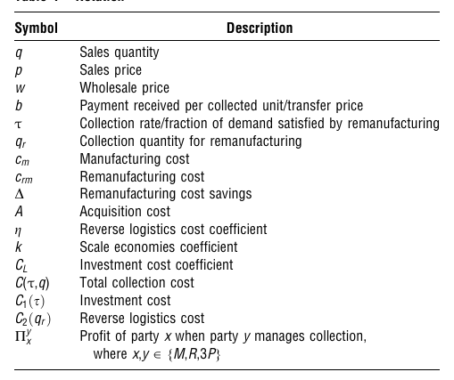
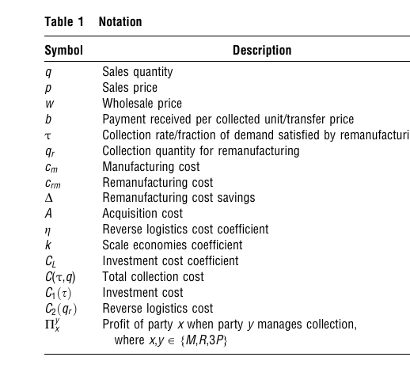
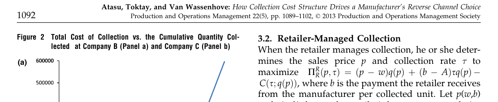
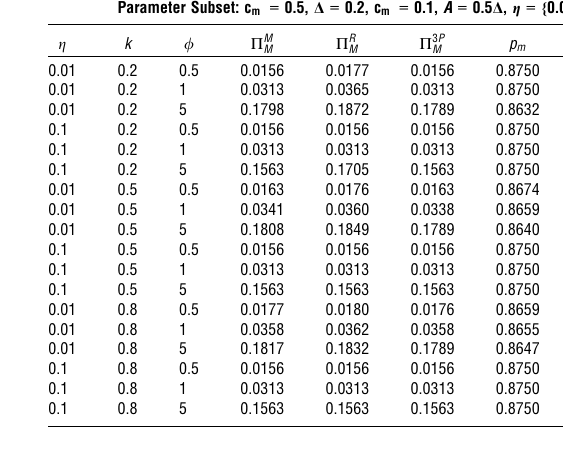
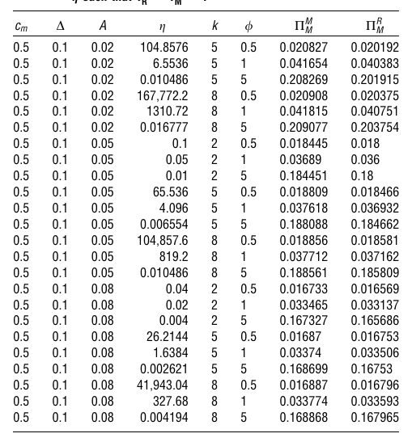
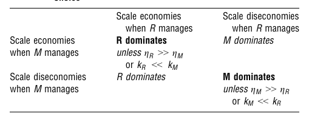
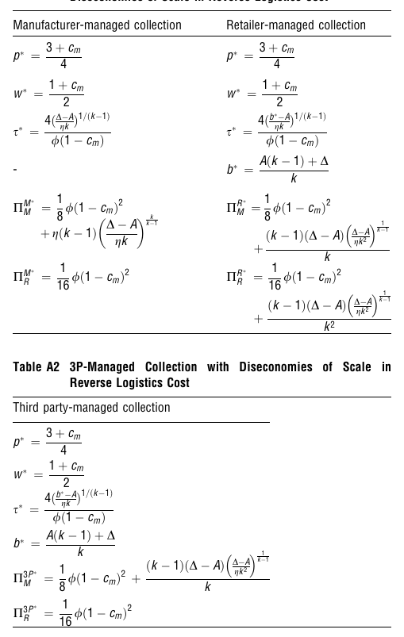
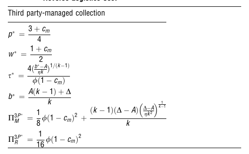
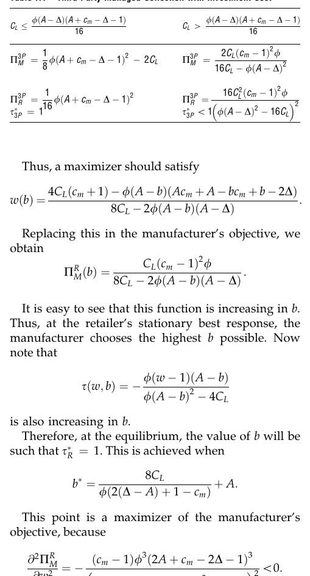

# How Collection Cost Structure Drives a Manufacturer's Reverse Channel Choice

> **Nature Reader 状态：结构化重建稿（机器译文底稿，未完成人工逐句审校）**
>
> 原始文件：`闭环供应链与再制造\Production   Oper Manag - 2013 - Atasu - How Collection Cost Structure Drives a Manufacturer s Reverse Channel Choice.pdf`  
> 来源：Production and Operations Management（2013）  
> 文献类型：analytical/modeling  
> 总页数：14

## 阅读索引

以下页码链接指向该页第一个可提取文本块；没有可提取文本的页面会保留页码但不生成块链接。

[p.1](#s001) · [p.2](#s007) · [p.3](#s016) · [p.4](#s024) · [p.5](#s030) · [p.6](#s038) · [p.7](#s046) · [p.8](#s052) · [p.9](#s061) · [p.10](#s068) · [p.11](#s075) · [p.12](#s082) · [p.13](#s087) · [p.14](#s095)

## 术语表

| Canonical term | 中文 | 统一规则 |
|---|---|---|
| reverse channel | 逆向渠道 | 产品回收的组织结构 |
| collection cost structure | 回收成本结构 | 核心解释变量 |
| economies of scale | 规模经济 | 单位回收成本随规模下降 |
| diseconomies of scale | 规模不经济 | 单位回收成本随规模上升 |
| third-party collector (3P) | 第三方回收商（3P） | 保留作者缩写 |

## 全文中英对照

## Page 1

**Source:** p.1 S001 · extraction confidence: high

**Original:** How Collection Cost Structure Drives a Manufacturer's Reverse Channel Choice Atalay Atasu, L. Beril Toktay Scheller College of Business, Georgia Institute of Technology, Atlanta, Georgia 30332, USA atalay.atasu@scheller.gatech.edu, beril.toktay@scheller.gatech.edu Luk N. Van Wassenhove INSEAD, Boulevard de Constance, 77300, Fontainebleau, France, luk.van-wassenhove@insead.edu This note discusses the impact of collection cost structure on the optimal reverse channel choice of manufacturers who remanufacture their own products.

**中文:** 收款成本结构如何推动制造商的反向渠道选择 Atalay Atasu，L. Beril Toktay Scheller 商学院，佐治亚理工学院，亚特兰大，佐治亚州 30332，美国 atalay. atasu@scheller. gatech. edu, beril. toktay@scheller. gatech. edu Luk N. Van Wassenhove INSEAD, Boulevard de Constance, 77300, 枫丹白露, 法国,luk.

**Source:** p.1 S002 · extraction confidence: high

**Original:** Using collection cost functions that capture collection rate and collection volume dependency, we show that the optimal reverse channel choice (retailervs. manufacturer-managed collection) is driven by how the cost structure moderates the manufacturer's ability to shape the retailer's sales and collection quantity decisions. Key words: closed-loop supply chain; reverse logistics; remanufacturing; channel choice History: Received: June 2010; Accepted: July 2012 by Panos Kuouvelis, after 3 revisions.

**中文:** van-wassenhove@insead. edu 本文讨论了回收成本结构对再制造自己产品的制造商的最佳反向渠道选择的影响。 使用收集成本函数捕获收集率和收集量依赖性，我们表明最佳反向渠道选择（零售商与制造商管理的收集）是由成本结构如何调节制造商的制定零售商的销售和收集数量决策的能力。 关键词：闭环供应链； 逆向物流； 再制造； 渠道选择历史： 收稿时间：2010 年 6 月； 接受时间：2012 年 7 月，Panos Kuouvelis，经过 3 次修改。

**Source:** p.1 S003 · extraction confidence: low

**Original:** 1. Introduction Many manufacturers undertaking the remanufacturing of their own products are focused on reducing collection costs to increase profitability. In this note, we demonstrate that significant benefits may accrue to manufacturers from first analyzing the structure of their collection costs and shaping their collection strategies accordingly. In particular, we consider manufacturer-, retailervs. third-party-managed collection, where the party who “manages” collection determines the collection amount; this party may then physically undertake collection or subcontract it.

**中文:** 1. 简介 许多进行自有产品再制造的制造商都致力于降低回收成本以提高盈利能力。 在在本文中，我们证明，首先分析其收集成本的结构并相应地制定其收集策略，可以为制造商带来巨大的好处。 尤其，我们考虑制造商、零售商与第三方管理的收款，其中“管理”收款的一方决定收款金额； 然后，该方可以实际进行收集或分包。 我们发现，制造商与零售商管理的退货收集能否最大化制造商的利润取决于收集成本结构，并且第三方管理的集合始终占主导地位。

**Source:** p.1 S004 · extraction confidence: low

**Original:** We find that whether manufacturervs. retailer-managed collection of returns maximizes a manufacturer's profit depends on the collection cost structure, and that third-party-managed collection is always dominated. The following examples based on our industry interactions illustrate how alternative collection cost structures can arise under different operating environments (company names are omitted for confidentiality). Company A is an IT manufacturer that sells print cartridges to end-consumers and provides them with pre-paid envelopes to return their end-of-use cartridges.

**中文:** 以下基于我们行业互动的示例说明了在不同的运营情况下如何产生替代的收集成本结构环境（出于保密目的，省略了公司名称）。 A 公司是一家 IT 制造商，向最终消费者销售打印墨盒，并为他们提供预付费信封以退回用完的墨盒。 该公司与邮政网络的合同包含数量折扣计划，从而实现收集成本的规模经济（参见 Drake 等人，2008 年的类似示例）。 现在，考虑公司 B 和 C； 分别是一家在汽车行业拥有工业客户的化学品生产商和一家欧洲消费电子产品制造商。 B 公司的每个客户都会产生一定数量的退货，公司决定是否向该客户收取费用。

**Source:** p.1 S005 · extraction confidence: low

**Original:** The company's contract with the postal network consists of a quantity discount schedule, leading to economies of scale in collection cost (see Drake et al. 2008 for a similar example). Now, consider companies B and C; a chemical producer that has industrial customers in the automotive industry and a consumer electronics manufacturer in Europe, respectively. Each customer of company B generates a given volume of returns, and the company decides whether to collect from that customer.

**中文:** 如果是，则分包商收集该客户的所有可用数量。 我们从 B 公司获得的数据显示，该公司仅从一组最便宜的客户（在这种情况下，成本基于距离，所以这些是最近的客户）。 C公司利用快递公司向最终用户收取产品退货或废旧产品进行再制造。 相似地，该公司只从欧盟的一小部分成员国收集数据，这些成员国距离较近，收集成本也相对便宜。 本质上，两家公司根据增加的收集成本对订单客户/国家/地区进行最佳排名，并根据该订单进行收集。

**Source:** p.1 S006 · extraction confidence: low

**Original:** If yes, a subcontractor collects all the quantity available at that customer. The data we obtained from company B reveal that this company collects only from a set of customers that are cheapest to collect from (in this case, cost is based on distance, so these are the closest customers). Company C uses express shipping companies to collect product returns or used products from end-users for remanufacturing. Similarly, this company only collects from a small set of member states in the E.U., which are closer and for which the cost of collection is comparably cheap.

**中文:** 在这两种情况下，公司 B 和 C 可以通过逐渐从更远（因此更昂贵）的来源收集来增加收集量。 最后，增加收集量会产生一个总成本函数，该函数表现出数量规模的不经济性。 1 除了这些依赖于数量的逆向物流成本之外，逆向供应链可能会产生与确保收集的旧产品供应相关的成本，例如，广告或投资费用。 Savaşkan 等人对此类成本对收集渠道选择的影响进行了建模和分析。 （2004），他们使用的投资成本是回收率的凸递增函数，并得出结论，零售商管理的回收对于制造商来说是最佳的。

## Page 2

**Source:** p.2 S007 · extraction confidence: low

**Original:** Essentially, both companies optimally rank order customers/countries according to increasing collection cost and collect according to that order. In both cases, Companies B and C can increase the collection volume by collecting from progressively more distant (and hence more expensive) sources. Consequently, increasing the collection volume yields a total cost function that exhibits diseconomies of scale in volume.1 In addition to these volume-dependent reverse logistics costs, reverse supply chains may incur costs associated with securing a supply of used products to be collected, for example, advertisement or investment costs.

**中文:** 在这篇笔记中，我们通过探索不同运营环境下依赖数量的逆向物流成本的影响来扩展他们的模型。 使用具有利率依赖性（投资成本）和依赖于数量（逆向物流成本）的组成部分，后者可以表现出规模经济或规模不经济，我们发现，如果收集成本结构使得制造商可以通过零售商管理的收集来激励零售商增加销量，从而获得利润，制造商更喜欢零售商管理的收集。 由于成本纯粹取决于数量，当收集存在规模经济时就会发生这种情况； 由于规模不经济，制造商更愿意管理收集。 由于成本纯粹取决于费率，当规模效应足够强时，零售商管理的收集是最佳的； 当它较弱时，制造商管理的收集是最佳选择。

**Source:** p.2 S008 · extraction confidence: low

**Original:** The effect of such costs on collection channel choice has been modeled and analyzed in Savaşkan et al. (2004), who use an investment cost that is a convex increasing function of the collection rate and conclude that retailer-managed collection is optimal for the manufacturer. In this note, we extend their model by exploring the effect of volume-dependent reverse logistics costs under different operating environments. Using a reverse channel cost structure that has rate-dependent (investment cost) and volume-dependent (reverse logistics cost) components, where the latter can exhibit either economies or diseconomies of scale, we find that if the collection cost structure is such that the manufacturer can profitably incentivize the retailer to increase its sales volume with retailer-managed collection, retailer-managed collection is preferred by the manufacturer.

**中文:** 制造商从来不喜欢第三方管理的集合。 我们的笔记的两个贡献是揭示基于反向的重要性渠道选择上的收集成本的结构，并描述在什么条件下每个反向渠道选择应该是首选。 2. 建模假设 重点关注成本结构对收集渠道选择，我们使用与 Savaşkan 等人类似的模型。 (2004)，他们研究了同样的问题； 主要区别在于，我们纳入了一个成本组成部分，以捕获收集量中的经济或规模不经济，并且我们通过更广泛的参数值来分析投资成本案例，因为我们发现这个分析很有洞察力。 我们还在支持信息的附录中扩展了他们的可区分新产品和再制造产品的模型。 我们简要总结了 Savaşkan 等人的模型。 (2004) 下面请读者参阅该论文，以详细讨论模型假设。 为了方便起见，表 1 总结了所使用的符号。 2. 1. 前向渠道 无差异的新产品和再制造产品通过同一零售商以分散的、不协调的两级（制造商和零售商）的形式销售供应链。

**Source:** p.2 S009 · extraction confidence: low

**Original:** With purely volume-dependent cost, this happens when there are economies of scale in collection; with diseconomies of scale, the manufacturer prefers to manage collection. With purely rate-dependent cost, retailer-managed collection is optimal when the scale effect is strong enough; when it is weak, manufacturermanaged collection is optimal. Third-party-managed collection is never preferred by the manufacturer. The two contributions of our note are to reveal the importance of basing the reverse channel choice on the structure of the collection cost and to describe under what conditions each reverse channel choice should be preferred.

**中文:** 无差异化产品的典型例子是柯达一次性相机，客户知道该公司在某些相机的生产中使用了旧零件，但不知道特定产品是否包含二手零件。 制造商是 Stackelberg 的领导者，向零售商提供批发价格合同。 由于产品没有差异化，制造商以相同的批发价 w 向零售商销售新产品和再制造产品，零售商又以相同的价格 p 在市场上销售这两种产品。 需求由 q = (1 p)/ 给出，其中 / 是常数。 生产新产品的成本为cm，生产再制造产品的成本为crm。 我们假设 cm \ 1 以确保新产品的正利润率下的正需求。

**Source:** p.2 S010 · extraction confidence: low

**Original:** 2. Modeling Assumptions To focus on the effect of cost structure on the collection channel choice, we use a similar model as in Savaşkan et al. (2004), who study the same question; the main differences are that we incorporate a cost component that captures economies or diseconomies of scale in the collection volume and that we analyze the investment cost case over a broader set of parameter values, as we find this analysis to be insightful. We also extend their model for differentiable new and remanufactured products in the Appendix in the Supporting Information.

**中文:** 将 τ 定义为再制造单位满足的需求比例。 那么，制造商向零售商销售 q 个商品的利润为 wq cmð1 sÞq crmsq。 将 D ¼ cm crm [ 0 定义为单位成本节省再制造，我们可以将该利润重写为 ðw cm þ DsÞq。 请注意，对于无差异化的产品，最好重新制造并销售尽可能多的退回产品； 因此，τ 也是上一代销量 q 的产品回收率（在所有退货均可再制造的隐含假设下）。 收集量，qr，等于τq。 收集率τ的可行范围在实践中可能是有限的。

**Source:** p.2 S011 · extraction confidence: low

**Original:** We briefly summarize the model in Savaşkan et al. (2004) below and refer the reader to the paper for a detailed discussion of the model assumptions. For convenience, Table 1 summarizes the notation used. 2.1. The Forward Channel Undifferentiated new and remanufactured products are sold through the same retailer in a decentralized uncoordinated two-echelon (manufacturer and retailer) supply chain. The archetypal example for undifferentiated products is the Kodak single-use camera, where the customer knows that the company utilizes used parts in the production of some cameras, but does not know whether a specific product contains used parts or not.

**中文:** 这可以通过假设 smax 为 0 来捕获。 在我们的分析中，不失一般性地假设 smax 1/4 1； 对于 smax \ 1，所有 s 1/4 1 的结果都将更改为 s 1/4 smax。 2. 2. 反向渠道 催收管理方定义为催收数量的决定者，无论谁处理实际的收集操作。 该方可以是制造商、零售商或第三方（图 1）并产生线性（例如，每单位常数）获取成本 Aqr 和收集成本 C(τ;q)。 如果零售商或第三方管理收货，她将所有收集的单位转移给制造商并收到每单位的转移价格 b。 2. 3. 收集成本 我们将收集销量 q 的一小部分 τ 的总成本建模为 Cðs；

**Source:** p.2 S012 · extraction confidence: low

**Original:** The manufacturer is the Stackelberg leader and offers a wholesale price contract to the retailer. Since the products are undifferentiated, the manufacturer sells both new and remanufactured products to the retailer at the same wholesale price w, who in turn sells both products at the same price p on the market. The demand is given by q = (1p)/, where / is a constant. The cost of producing a new product is cm and the cost of producing a remanufactured product is crm. We assume cm \ 1 to ensure positive demand at positive margin for new products.

**中文:** qÞ ¼ C1ðsÞ þ C2ðqrÞ，qr ¼ sq。 第一个组成部分 C1ðsÞ 考虑在需要采取此类行动时激励消费者退货的成本。 尤其，我们将 C1ðsÞ ¼ CLs2 定义为实现 τ 收集率的总成本（如 Savaşkan 等人，2004 年）。 该成本项反映了 Savaşkan 等人分析的投资成本。 （2004）。 正如他们的论文中所述，可能需要促销/广告活动来鼓励消费者退货。 预计此类投资的回报会递减； s ¼ ffiffiffiffiffiffiffiffiffiffiffiffi C1=CL p 的增长慢于总投资C1 的增长。

**Source:** p.2 S013 · extraction confidence: low

**Original:** Define τ as the fraction of demand satisfied by remanufactured units. Then, the manufacturer's profit from selling q items to the retailer is wq  cmð1  sÞq  crmsq. Defining D ¼  cm  crm [ 0 as the cost saving per unit from remanufacturing, we can rewrite this profit as ðw  cm þ DsÞq. Note that with undifferentiated products, it is optimal to remanufacture and sell as many of the returned units as possible; thus, τ is also the collection rate of products from the previous generation's sales volume q (under the implicit assumption that all returns are remanufacturable).

**中文:** 第二个组成部分考虑逆向物流成本，即实际收集19375956、2013、5、北京化学工业大学下载自https://onlinelibrary. wiley. com/doi/10. 1111/j. 1937-5956. 2012. 01426. x，Wiley 在线图书馆 [31/​​05/2026]。 有关使用规则，请参阅 Wiley 在线图书馆的条款和条件 (https://onlinelibrary. wiley.

**Source:** p.2 S014 · extraction confidence: low

**Original:** The collection volume, qr, equals τq. The feasible range of the collection rate τ might be limited in practice. This can be captured by assuming 0  s  smax. In our analysis, we assume without loss of generality that smax ¼ 1; with smax \ 1, all results where s ¼ 1 will change to s ¼ smax. 2.2. The Reverse Channel The party that manages collection is defined as the one who determines the collection quantity, regardless of who handles the actual collection operation. This party can be the manufacturer, the retailer, or a third party (Figure 1) and incurs a linear (e.g., constant per unit) acquisition cost Aqr and collection cost C(τ;q).

**中文:** com/terms-and-conditions)； OA 文章受适用的知识共享许可产品 C2ðqrÞ ¼ gqk r 管辖，根据馆藏卷 qr 进行定义。 C2ðqrÞ 的建模是我们模型的一个新颖之处，这源于我们的实践经验。 在此模型中，k < 1 体现了规模经济，而 k > 1 体现了收集运营成本中的规模不经济，这两者都可以在实践中观察到。 要了解 k < 1 的凹成本结构如何出现，请考虑喜欢使用下降策略的公司，根据该规定，消费者可以将用过的产品扔到指定地点。 例如，我们合作的欧洲逆向物流公司Cycleon，在欧洲邮局收集二手产品。

### Table 1. com/terms-and-conditions)； OA 文章受适用的知识共享许可产品 C2ðqrÞ ¼ gqk r 管辖，根据馆藏卷 qr 进行定义。 C2ðqrÞ 的建模是我

**Placed near:** p.3 S014  
**Source:** p.3 S014  
**Crop confidence:** approximate-object-bounded

**Original caption:** Table 1 Notation collection volume, such that one would observe econ-

**中文图注:** com/terms-and-conditions)； OA 文章受适用的知识共享许可产品 C2ðqrÞ ¼ gqk r 管辖，根据馆藏卷 qr 进行定义。 C2ðqrÞ 的建模是我们模型的一个新颖之处，这源于我们的实践经验。 在此模型中，k < 1 体现了规模经济，而 k > 1 体现了收集运营成本中的规模不经济，这两者都可以在实践中观察到。 要了解 k < 1 的凹成本结构如何出现，请考虑喜欢使用下降策略的公司，根据该规定，消费者可以将用过的产品扔到指定地点。 例如，我们合作的欧洲逆向物流公司Cycleon，在欧洲邮局收集二手产品。

**Reading note:** 自动裁剪以图注为定位依据；正式引用图中数值前请对照原 PDF 检查裁剪边界与坐标轴。

### Fig. 1. com/terms-and-conditions)； OA 文章受适用的知识共享许可产品 C2ðqrÞ ¼ gqk r 管辖，根据馆藏卷 qr 进行定义。 C2ðqrÞ 的建模是我

**Placed near:** p.3 S014  
**Source:** p.3 S014  
**Crop confidence:** approximate-object-bounded

**Original caption:** Figure 1 Decentralized Reverse Channel Options fact that the company collects first from cheaper

**中文图注:** com/terms-and-conditions)； OA 文章受适用的知识共享许可产品 C2ðqrÞ ¼ gqk r 管辖，根据馆藏卷 qr 进行定义。 C2ðqrÞ 的建模是我们模型的一个新颖之处，这源于我们的实践经验。 在此模型中，k < 1 体现了规模经济，而 k > 1 体现了收集运营成本中的规模不经济，这两者都可以在实践中观察到。 要了解 k < 1 的凹成本结构如何出现，请考虑喜欢使用下降策略的公司，根据该规定，消费者可以将用过的产品扔到指定地点。 例如，我们合作的欧洲逆向物流公司Cycleon，在欧洲邮局收集二手产品。

**Reading note:** 自动裁剪以图注为定位依据；正式引用图中数值前请对照原 PDF 检查裁剪边界与坐标轴。

**Source:** p.2 S015 · extraction confidence: low

**Original:** If the retailer or the third party manages collection, she transfers all collected units to the manufacturer and receives a transfer price b per unit. 2.3. The Collection Cost We model the total cost to collect a fraction τ of sales volume q as Cðs; qÞ ¼ C1ðsÞ þ C2ðqrÞ, with qr ¼  sq. The first component C1ðsÞ considers the cost of incentivizing the consumers to return their products, when such action is needed. In particular, we define C1ðsÞ ¼  CLs2 as the total cost to achieve a collection rate of τ (as in Savaşkan et al.

**中文:** Cycleon 与欧洲邮政网络签订依赖数量的价格（例如数量折扣），并向客户收取依赖数量的价格。 因此，对于使用 Cycleon 服务的公司来说，收集额外产品的边际成本随着收集量的增加而减少，这样人们就会观察到规模经济。 要了解 k > 1 的凸成本结构在实践中如何出现，请考虑第 1 节中简要提到的两个示例。 B 公司，主要向汽车行业供货的化学品生产商，从客户那里收集一定数量的废旧产品（占其销售额的一小部分），并可以在生产中重复使用这些材料过程。

## Page 3

**Source:** p.3 S016 · extraction confidence: low

**Original:** 2004). This cost term captures the investment cost analyzed by Savaşkan et al. (2004). As argued in their paper, promotional/ advertising activities may be needed to encourage consumers to return their products. Such investments would be expected to exhibit diminishing returns; the increase in s ¼ ffiffiffiffiffiffiffiffiffiffiffiffiffi C1=CL p is slower than the increase in the total investment C1. The second component considers the reverse logistics cost, that is, the cost of physically collecting the 19375956, 2013, 5, Downloaded from https://onlinelibrary.wiley.com/doi/10.1111/j.1937-5956.2012.01426.x by Beijing University of Chemistry Technology, Wiley Online Library on [31/05/2026].

**中文:** 然而，该公司并未从所有具有可重复使用供应的来源进行收集。 虽然有 140 名客户，他们都有可重复使用的用品，B公司只从39个距离较近且价格较便宜的客户处提货。 例如，该公司选择不从中国、韩国、南美收集，或墨西哥的一些来源，因为从这些资源收集的逆向物流成本将超过重复使用收集的物品的好处。 图 2a 说明了收集成本结构该公司基于这样一个事实，即该公司首先从更便宜的资源中收集。 该图描绘了从公司客户处收集的累计金额与总收集成本的关系，它展示了所假设的凸成本结构。 可以直接对该数据集拟合一个简单的线性回归模型，即 Cðs； qÞ ¼ gðsqÞk ( ) logðCðs;qÞÞ ¼ logðgÞ þ k logðsqÞ。

**Source:** p.3 S017 · extraction confidence: high

**Original:** See the Terms and Conditions (https://onlinelibrary.wiley.com/terms-and-conditions) on Wiley Online Library for rules of use; OA articles are governed by the applicable Creative Commons License product, C2ðqrÞ ¼  gqk r, defined in terms of the collection volume qr. The modeling of C2ðqrÞ is a novelty of our model, which originates from our experiences with practice. In this model, k < 1 captures economies of scale, while k > 1 captures diseconomies of scale in the operational cost of collection, which can both be observed in practice.

**中文:** 对于该模型，我们得到 g = 0. 0035161 和 k = 1. 112447，其中 p < 0. 001 且 R2 ¼ 0:988 表明回归模型准确地表示了数据。 我们的第二个例子，C公司，是一家全球消费电子产品生产商的欧洲分公司，该公司对某些产品进行再制造，并利用快递公司从最终用户处收集产品退货或旧产品进行再制造。 这公司仅从欧盟 12 个国家（共 27 个国家）收集数据。

**Source:** p.3 S018 · extraction confidence: low

**Original:** To see how a concave cost structure with k < 1 can emerge, consider companies who prefer using a dropoff strategy, under which consumers are provided the means to drop off the used product to specified locations. For instance, Cycleon, a European reverse logistics company we worked with, collects used products at European post offices. Cycleon contracts volumedependent prices (e.g., quantity discounts) with the European postal networks and charges their customers volume-dependent prices as well.

**中文:** 该公司选择从距离较近的国家收集，这些国家的收集成本相对便宜。 图 2b 说明了收集成本结构该公司首先从快递公司收取的单位收件成本较低的国家收件。 该图绘制了收集总成本与累计金额的函数关系历时 2 个月从不同国家收集的。 数据按国家/地区提供，按照平均收集成本递增的顺序。 这些数据也清楚地展示了我们假设的凸成本结构。 类似于第一个数据集的回归分析结果为 g = 0. 007619 和 k = 1.

**Source:** p.3 S019 · extraction confidence: low

**Original:** Thus, for a company using Cycleon's service, the marginal cost of collecting an additional product is decreasing in the collection volume, such that one would observe economies of scale. To see how a convex cost structure with k > 1 emerges in practice, consider the two examples briefly mentioned in section 1. Company B, a chemical producer that mainly supplies to the automotive industry, collects a certain quantity of used products (which is a fraction of their sales) from their customers and can reuse these materials in the production process.

**中文:** 572939，其中 p < 0. 001 且 R2 ¼ 0:968 表明回归模型也准确地表示了该数据集。 本文的其余部分组织如下：第 3. 1-3. 3 节阐述了一般问题三种不同的设置。 我们首先关注 3. 4 节中的运营成本 C2ðqrÞ ¼ gqk r。 然后，我们关注投资成本的广义版本 C1ðsÞ 表 1 符号 符号 说明 q 销售数量 p 销售价格 w 批发价格 b 每收取单位收到的付款/转让价格 τ 收取再制造满足需求的比率/比例 qr 再制造的收集数量 cm 制造成本 crm 再制造成本 D 再制造成本节省 A 采购成本 g 逆向物流成本系数 k 规模经济系数 CL 投资成本系数 C(τ,q) 总收款成本 C1ðsÞ 投资成本 C2ðqr Þ 逆向物流成本 Py x y 方管理收款时 x 方的利润，其中 x,y ∈ {M,R,3P} 图 1 去中心化反向渠道期权 生产和运营管理 22(5), pp.

**Source:** p.3 S020 · extraction confidence: low

**Original:** However, the company does not collect from all sources that have available reusable supply. While there are 140 customers, who all have reusable supplies available, company B collects only from 39 closer and cheaper to collect customers. For instance, the company has chosen not to collect from China, Korea, South America, or some sources in Mexico due to the fact that the reverse logistics cost of collecting from these resources would outweigh the benefits of reusing the collected items.

**中文:** 1089–1102, (c) 2013 生产和运营管理学会 1091 19375956, 2013, 5,北京化学工业大学下载自https://onlinelibrary.

**Source:** p.3 S021 · extraction confidence: low

**Original:** Figure 2a illustrates the collection cost structure of the company based on the fact that the company collects first from cheaper resources. This figure plots the cumulative amount collected from the firm's customers vs. the total collection cost, which exhibits the convex cost structure posited. It is straightforward to fit a simple linear regression model to this data set, that is, Cðs; qÞ ¼ gðsqÞk ( ) logðCðs; qÞÞ ¼ logðgÞ þ k logðsqÞ. For this model, we obtain g = 0.0035161 and k = 1.112447, where p < 0.001 and R2 ¼ 0:988 suggests that the regression model accurately represents the data.

**中文:** wiley. com/doi/10. 1111/j. 1937-5956. 2012. 01426. x，Wiley 在线图书馆 [31/​​05/2026]。 有关使用规则，请参阅 Wiley 在线图书馆的条款和条件 (https://onlinelibrary. wiley. com/terms-and-conditions)； OA 文章受 Savaşkan 等人适用的知识共享许可管辖。

**Source:** p.3 S022 · extraction confidence: high

**Original:** Our second example, company C, is a European branch of a global consumer electronics producer that remanufactures certain products and uses express shipping companies to collect product returns or used products from end-users for remanufacturing. This company collects only from 12 countries (of 27) in the E.U. The company has chosen to collect from closer countries where the cost of collection is comparably cheap. Figure 2b illustrates the collection cost structure of the company, where the company collects first from countries that have lower per unit collection costs charged by the express company.

**中文:** （2004）第 3. 5 节。 3. 6 节讨论了结合两种成本的一般模型。 我们在第 4 节中得出结论。 3. 分析在本节中，我们将比较制造商、零售商和第三方管理收集下的最佳解决方案，并确定制造商首选哪种反向渠道选择。 我们让 P y x 表示y 方管理收款时 x 方的利润，其中 x,y ∈ {M,R,3P}。 这里，M表示制造商，R表示零售商，3P表示第三方。 3. 1. 制造商管理的收集 当制造商管理收集时，零售商确定其销售价格 p，以最大化 PM R ðpÞ ¼ ðp wÞqðpÞ，给出制造商报价的批发价。

**Source:** p.3 S023 · extraction confidence: low

**Original:** The figure plots the total cost of collection as a function of the cumulative amount collected from different countries over 2 months. The data are presented by country, in order of increasing average collection cost. These data clearly exhibit the convex cost structure we posit as well. A regression analysis similar to that for the first data set results in g = 0.007619 and k = 1.572939, where p < 0.001 and R2 ¼ 0:968 suggests that the regression model accurately represents this data set as well.

**中文:** 令 p(w) 表示零售商的最佳响应，q(w) 表示相应的销售数量。 制造商的目标是最大化 PM Mðw； sÞ ¼ ðw cm þ sðD AÞÞqðwÞ Cðs; qðwÞÞ。 3. 2. 零售商管理的收款 当零售商管理收款时，他或她确定销售价格 p 和收款率 τ 以使 PR Rðp 最大化； sÞ ¼ ðp wÞqðpÞ þ ðb AÞsqðpÞ Cðs; qðpÞÞ，其中 b 是零售商从制造商处收到的每收集单位的付款。

## Page 4

**Source:** p.4 S024 · extraction confidence: low

**Original:** The rest of this article is organized as follows: Sections 3.1–3.3 formulate the general problem under the three different settings. We first focus on the operational cost C2ðqrÞ ¼ gqk r in section 3.4. Then, we focus on a generalized version of the investment cost C1ðsÞ Table 1 Notation Symbol Description q Sales quantity p Sales price w Wholesale price b Payment received per collected unit/transfer price τ Collection rate/fraction of demand satisfied by remanufacturing qr Collection quantity for remanufacturing cm Manufacturing cost crm Remanufacturing cost D Remanufacturing cost savings A Acquisition cost g Reverse logistics cost coefficient k Scale economies coefficient CL Investment cost coefficient C(τ,q) Total collection cost C1ðsÞ Investment cost C2ðqr Þ Reverse logistics cost Py x Profit of party x when party y manages collection, where x,y ∈ {M,R,3P} Figure 1 Decentralized Reverse Channel Options Production and Operations Management 22(5), pp.

**中文:** 令 p(w,b) 和 τ(w,b) 表示零售商的最佳响应，q(w,b) 表示相应的销售数量。 制造商的目标是最大化 PR Mðw； bÞ ¼ ðw cm þ Dsðw; bÞÞqðw； bÞ bsqðw;bÞ 通过选择 w 和 b。 3. 3. 第三方管理的系列 在此，零售商根据制造商报价的批发价 w 确定销售价格 p，以最大化 P3P R ðpÞ ¼ ðp wÞqðpÞ。 令 p(w) 表示零售商的最佳反应和 q(w) 相应的销售数量。 对于任何销售数量 q，第三方确定收集率 τ 以使 P3P 3PðsÞ ¼ ðb AÞsq Cðs 最大化； qÞ，其中 b 是第三方从制造商处收到的每收集单位的付款。 让 τ(b,q) 表示 3P 的最佳响应。 制造商预期零售商和 3P 对他的选择的反应w 和 b。 他的目标是最大化 P3P M ðw； bÞ ¼ ðw cm þ Dsðb;qðwÞÞÞqðwÞ bsðb;qðwÞÞqðwÞ 通过选择 w 和 b。

**Source:** p.4 S025 · extraction confidence: low

**Original:** 1089–1102, (c) 2013 Production and Operations Management Society 1091 19375956, 2013, 5, Downloaded from https://onlinelibrary.wiley.com/doi/10.1111/j.1937-5956.2012.01426.x by Beijing University of Chemistry Technology, Wiley Online Library on [31/05/2026]. See the Terms and Conditions (https://onlinelibrary.wiley.com/terms-and-conditions) on Wiley Online Library for rules of use; OA articles are governed by the applicable Creative Commons License of Savaşkan et al. (2004) in section 3.5.

**中文:** 3. 4. 逆向物流成本 在本节中，我们只关注收集 C2ðqrÞ 的实际成本。 这种分析可以直接根据受 qr q 影响的收集量 qr 来完成，但为了与下一小节保持一致，我们使用符号 C2ðs； qÞ 1/4 gðsqÞk ，其中 s 1/4 qr=q 且 τ 1。 3. 4. 1。 收集量的规模经济。 命题 1. 在收集规模经济 (k < 1) 下，制造商、零售商、或第三方收集位于两个边界 s 1/4 0 或 s 1/4 1 之一。

**Source:** p.4 S026 · extraction confidence: low

**Original:** Section 3.6 discusses the general model that combines the two costs. We conclude in section 4. 3. Analysis In this section, we compare the optimal solutions under manufacturer‐, retailer‐, and third-party-managed collection and determine which reverse channel choice is preferred by the manufacturer. We let P y x denote the profits of party x when party y manages collection, where x,y ∈ {M,R,3P}. Here, M denotes manufacturer, R denotes retailer, and 3P denotes third party. 3.1. Manufacturer-Managed Collection When the manufacturer manages collection, the retailer determines her sales price p to maximize PM R ðpÞ ¼ ðp  wÞqðpÞ, given the wholesale price w quoted by the manufacturer.

**中文:** 证明。 所有证明均在附录中提供。 这个结果很直观：收藏成本体现了收藏的规模经济量，而征收收入则随征收量线性增加。 因此，反向渠道的利润随着收款量呈凸增长。 只要管理收款的一方发现任何收款数量的收款都是有利可图的，他或她最好选择更大的收集量，即 s 1/4 1； 否则 s ¼ 0。 不幸的是，对于一般 k < 1 值，无法以封闭形式获得嵌入优化问题的解 (b) (a) 图 2 收集总成本与 B 公司收集的累积数量（图 a）和C公司（图b）19375956，2013年，5，北京化学大学下载自https://onlinelibrary.

**Source:** p.4 S027 · extraction confidence: low

**Original:** Let p(w) denote the retailer's best response and q(w) the corresponding sales quantity. The manufacturer's objective is to maximize PM Mðw; sÞ ¼ ðw  cm þ sðD  AÞÞqðwÞ  Cðs; qðwÞÞ. 3.2. Retailer-Managed Collection When the retailer manages collection, he or she determines the sales price p and collection rate τ to maximize PR Rðp; sÞ ¼ ðp  wÞqðpÞ þ ðb  AÞsqðpÞ  Cðs; qðpÞÞ, where b is the payment the retailer receives from the manufacturer per collected unit. Let p(w,b) and τ(w,b) denote the retailer's best response and q(w, b) denote the corresponding sales quantity.

**中文:** wiley. com/doi/10. 1111/j. 1937-5956. 2012. 01426. x，Wiley 在线图书馆 [31/​​05/2026]。 有关使用规则，请参阅 Wiley 在线图书馆的条款和条件 (https://onlinelibrary. wiley. com/terms-and-conditions)； 开放获取文章受适用的知识共享许可管辖，因为管理集合的一方的最佳响应函数需要从 k 阶多项式的优化中得出，并且不能以封闭形式表征。

**Source:** p.4 S028 · extraction confidence: low

**Original:** The manufacturer's objective is to maximize PR Mðw; bÞ ¼ ðw  cm þ Dsðw; bÞÞqðw; bÞ  bsqðw; bÞ by choosing w and b. 3.3. Third-Party-Managed Collection Here, the retailer determines the sales price p to maximize P3P R ðpÞ ¼ ðp  wÞqðpÞ given the wholesale price w quoted by the manufacturer. Let p(w) denote the retailer's best response and q(w) the corresponding sales quantity. For any sales quantity q, the third party determines the collection rate τ to maximize P3P 3PðsÞ ¼ ðb  AÞsq  Cðs; qÞ, where b is the payment the third party receives from the manufacturer per collected unit.

**中文:** 然而，可以用数字来实现。 我们的数值研究2（表 2 中列出了代表性样本）揭示了以下内容。 观察 1. 当零售商发现在规模经济 (k < 1) 下收集是有利可图的（即 sR ¼ 1），在零售商管理的收集下制造商利润最大化。 制造商可能会发现零售商管理的系列利润丰厚平衡状态下 b 可能大于 D。 零售商管理的收集的销售价格是最低的，因此，零售商管理的收集的销售数量是最大化的。 根据命题 1，当零售商管理收集时，她发现最好收集所有可能的单位，因为退货渠道利润随着收集量而（凸）增加。

**Source:** p.4 S029 · extraction confidence: high

**Original:** Let τ(b,q) denote the 3P's best response. The manufacturer anticipates the retailer's and the 3P's reactions to his choice of w and b. His objective is to maximize P3P M ðw; bÞ ¼ ðw  cm þ Dsðb;qðwÞÞÞqðwÞ  bsðb;qðwÞÞqðwÞ by choosing w and b. 3.4. Reverse Logistics Cost In this section, we focus on the physical cost of collection C2ðqrÞ only. This analysis can be done directly in terms of the collection volume qr subject to qr  q, but for consistency with the next subsection, we use the notation C2ðs; qÞ ¼ gðsqÞk , where s ¼ qr=q and τ  1.

**中文:** 转让价格 b 的增加会激励零售商出售更多商品，以收集更多商品，增加反向渠道的利润。 对于制造商来说，由此带来的销量增长如此之高，以至于主导了因提高转让价格而损失的利润。 制造商利用这一特性，以至于他可以将全部再制造节省的资金或更多资金转嫁给零售商（b 可能超过 D）。 当制造商管理系列时，他受益于系列的规模经济，因此他希望鼓励高销量以收集更多。 然而，他影响零售商的唯一机制就是降低批发价，效果并不理想，尤其是在零售商缺乏规模经济的情况下。

## Page 5

**Source:** p.5 S030 · extraction confidence: low

**Original:** 3.4.1. Scale Economies in the Collection Volume. PROPOSITION 1. Under economies of scale in collection (k < 1), the optimal solution with manufacturer-, retailer-, or third-party collection is at one of the two boundaries s ¼ 0 or s ¼ 1. PROOF. All proofs are provided in the Appendix. This result is intuitive: The collection cost exhibits economies of scale in the collection volume, while the revenue from collection increases linearly in the collection volume. Thus, the profit in the reverse channel is convex increasing in the collection volume.

**中文:** 尽管在零售商收集场景中观察到批发价较高，高批发价和高转移价的综合效应是，与制造商管理的收集相比，有效批发价 w b 更低，需求 q 更高，通过零售商管理的收货，为制造商带来更高的利润。 对于第三方管理的收集，制造商的处境比制造商管理的收集更糟糕，因为他不仅只有一个杠杆来迫使零售商增加收款量，而且他还与第三方分享反向渠道的利润。 3. 4. 2. 集合中的规模不经济体积。 在规模不经济下，存在一个阈值 g ¼ D A ð/ð1 cmÞ=4Þk 1 使得 s \ 1 对于 g [ g 无论谁管理收集。

**Source:** p.5 S031 · extraction confidence: low

**Original:** As long as the party that manages collection finds collection profitable for any collected quantity, he or she is better off by choosing a larger collection volume, so that s ¼ 1; otherwise s ¼ 0. Unfortunately, a solution to the embedded optimization problem cannot be obtained in closed form for general k < 1 values (b) (a) Figure 2 Total Cost of Collection vs. the Cumulative Quantity Collected at Company B (Panel a) and Company C (Panel b) 19375956, 2013, 5, Downloaded from https://onlinelibrary.wiley.com/doi/10.1111/j.1937-5956.2012.01426.x by Beijing University of Chemistry Technology, Wiley Online Library on [31/05/2026].

**中文:** 在这种情况下，我们分析地解决问题并诉诸于g \ g 的数值分析。 命题 2. 设 k > 1 且 g [ g。 制造商在管理收货时获得更多利润。 通过制造商管理的系列，收款率高于零售商或第三方管理的收款，但均衡批发价、销售价、因此，所有情况下的销售数量都是相同的。 在 s \ 1 （即 q r \ q ）的参数范围内，无论谁管理收集，正向和反向渠道的经济性是解耦的（处于均衡状态）。 这解释了为什么均衡批发价格（以及零售价格和销售额）表 2 制造商利润、销售价格、对于以下参数子集，k < 1 时不同收款渠道下的收款率和转移价格：cm = 0.

### Fig. 2. 在这种情况下，我们分析地解决问题并诉诸于g \ g 的数值分析。 命题 2. 设 k > 1 且 g [ g。 制造商在管理收货时获得更多利润。 通过制造商管理的系列，收款率高于零

**Placed near:** p.4 S031  
**Source:** p.4 S031  
**Crop confidence:** approximate-caption-located

**Original caption:** Figure 2 Total Cost of Collection vs. the Cumulative Quantity Col3.2. Retailer-Managed Collection

**中文图注:** 在这种情况下，我们分析地解决问题并诉诸于g \ g 的数值分析。 命题 2. 设 k > 1 且 g [ g。 制造商在管理收货时获得更多利润。 通过制造商管理的系列，收款率高于零售商或第三方管理的收款，但均衡批发价、销售价、因此，所有情况下的销售数量都是相同的。 在 s \ 1 （即 q r \ q ）的参数范围内，无论谁管理收集，正向和反向渠道的经济性是解耦的（处于均衡状态）。 这解释了为什么均衡批发价格（以及零售价格和销售额）表 2 制造商利润、销售价格、对于以下参数子集，k < 1 时不同收款渠道下的收款率和转移价格：cm = 0.

**Reading note:** 自动裁剪以图注为定位依据；正式引用图中数值前请对照原 PDF 检查裁剪边界与坐标轴。

**Source:** p.5 S032 · extraction confidence: high

**Original:** See the Terms and Conditions (https://onlinelibrary.wiley.com/terms-and-conditions) on Wiley Online Library for rules of use; OA articles are governed by the applicable Creative Commons License because the best response function of the party that manages collection needs to be derived from the optimization of a kth order polynomial and cannot be characterized in closed form. However, it is possible to do so numerically. Our numerical study2 (from which a representative sample is presented in Table 2) reveals the following.

**中文:** 5，D = 0. 2，cm = 0. 1，A = 0. 5D，g = {0. 01,0. 1}，/ = {0. 5,1,5}，k = {0. 2,0. 5,0. 8}。 g k / PM M PR M P3P M pm pr p3p sM sR s3p brb3p 0. 01 0. 2 0. 5 0. 0156 0. 0177 0. 0156 0. 8750 0. 8636 0. 8750 0 1 0 0.

**Source:** p.5 S033 · extraction confidence: low

**Original:** OBSERVATION 1. When the retailer finds it profitable to collect (i.e., sR ¼ 1) under economies of scale (k < 1), manufacturer profits are maximized under retailer-managed collection. The manufacturer may find retailer-managed collection so profitable that b may be larger than D in equilibrium. The sales price is the lowest with retailer-managed collection, and consequently, the sales quantity is maximized with retailer-managed collection. By Proposition 1, when the retailer manages the collection, she finds it optimal to collect all possible units as return channel profits are (convex) increasing in the collection volume.

**中文:** 150 – 0. 01 0. 2 1 0. 0313 0. 0365 0. 0313 0. 8750 0. 8629 0. 8750 0 1 0 0. 145 – 0. 01 0. 2 50. 1798 0. 1872 0. 1789 0. 8632 0. 8629 0. 8660 1 1 1 0. 150 0. 065 0. 1 0. 2 0. 5 0. 0156 0. 0156 0. 0156 0. 8750 0. 8750 0. 8750 0 0 0 – – 0. 1 0. 2 1 0. 0313 0. 0313 0. 0313 0. 8750 0.

**Source:** p.5 S034 · extraction confidence: low

**Original:** An increase in the transfer price b incentivizes the retailer to sell more so as to collect more and increase profits on the reverse channel. For the manufacturer, the resulting increase in the sales volume is so high as to dominate the margin lost from increasing the transfer price. The manufacturer capitalizes on this property, so much so that he may pass the entire remanufacturing savings or more to the retailer (b may exceed D). When the manufacturer manages the collection, he benefits from the scale economies in collection, so he would like to encourage a high sales volume in order to collect more.

**中文:** 8750 0. 8750 0 0 0 – – 0. 1 0. 2 5 0. 1563 0. 1705 0. 15630. 8750 0. 8641 0. 8750 0 1 0 0. 295 – 0. 01 0. 5 0. 5 0. 0163 0. 0176 0. 0163 0. 8674 0. 8651 0. 8725 1 1 1 0. 145 0. 090 0. 01 0. 5 1 0. 0341 0. 0360 0. 0338 0. 8659 0. 8643 0. 8700 1 1 1 0. 150 0. 080 0. 01 0. 5 5 0. 1808 0.

**Source:** p.5 S035 · extraction confidence: low

**Original:** However, his only mechanism to influence the retailer is to decrease the wholesale price, which is not very effective, especially in the absence of scale economies accruing to the retailer. Despite the higher wholesale price observed in the retailer collection scenario, the combined effect of the high wholesale price and the high transfer price is a lower effective wholesale price w  b and higher demand q than with manufacturer-managed collection, yielding higher profits for the manufacturer with retailer-managed collection.

**中文:** 1849 0. 1789 0. 86400. 8630 0. 8660 1 1 1 0. 180 0. 065 0. 1 0. 5 0. 5 0. 0156 0. 0156 0. 0156 0. 8750 0. 8750 0. 8750 0 0 0 – – 0. 1 0. 5 1 0. 0313 0. 0313 0. 0313 0. 8750 0. 8750 0. 8750 0 0 0 – – 0. 1 0. 5 5 0. 1563 0. 1563 0. 1563 0. 8750 0.

**Source:** p.5 S036 · extraction confidence: low

**Original:** With the third-party-managed collection, the manufacturer is even worse off than manufacturer-managed collection, because not only does he have only one lever to compel the retailer to increase the collection volume but he also shares the reverse channel profits with the third party. 3.4.2. Scale Diseconomies in the Collection Volume. Under scale diseconomies, there exists a threshold  g ¼  D  A ð/ð1  cmÞ=4Þk1 such that s \ 1 for g [  g regardless of who manages collection.

**中文:** 8750 0. 8750 0. 8750 0 0 0 – –0. 01 0. 8 0. 5 0. 0177 0. 0180 0. 0176 0. 8659 0. 8654 0. 8675 1 1 1 0. 150 0. 070 0. 01 0. 8 1 0. 0358 0. 0362 0. 0358 0. 8655 0. 8650 0. 8660 1 1 1 0. 125 0. 065 0. 01 0. 8 5 0. 1817 0. 1832 0.

**Source:** p.5 S037 · extraction confidence: low

**Original:** We solve the problem analytically in this case and resort to numerical analysis for g \  g. PROPOSITION 2. Let k > 1 and g [  g. The manufacturer makes more profit when he manages collection. With manufacturer-managed collection, the collection rate is higher than with retaileror third-party-managed collection, but the equilibrium wholesale price, sales price, and consequently the sales quantity are the same in all cases. In the parameter range where s \ 1 (i.e., q r \ q ) regardless of who manages collection, the economics of the forward and reverse channels are decoupled (in equilibrium).

**中文:** 1789 0. 8647 0. 8643 0. 8660 1 1 1 0. 180 0. 065 0. 10. 8 0. 5 0. 0156 0. 0156 0. 0156 0. 8750 0. 8750 0. 8750 0 0 0 – – 0. 1 0. 8 1 0. 0313 0. 0313 0. 0313 0. 8750 0. 8750 0. 8750 0 0 0 – – 0. 1 0. 8 5 0. 1563 0. 1563 0. 1563 0. 8750 0. 8750 0. 8750 0 0 0 – – 生产和运营管理22（5），第1089–1102页，（c）2013年生产与运营管理学会1093 19375956，2013年，5，北京化学工业大学下载自https://onlinelibrary.

## Page 6

**Source:** p.6 S038 · extraction confidence: low

**Original:** This explains why the equilibrium wholesale price (and hence the retail price and sales Table 2 Manufacturer Profits, Sales Prices, Collection Rates, and Transfer Prices Under Different Collection Channels for k < 1 for the Following Parameter Subset: cm = 0.5, D = 0.2, cm = 0.1, A = 0.5D, g = {0.01,0.1}, / = {0.5,1,5}, and k = {0.2,0.5,0.8}. g k / PM M PR M P3P M pm pr p3p sM sR s3p bR b3p 0.01 0.2 0.5 0.0156 0.0177 0.0156 0.8750 0.8636 0.8750 0 1 0 0.150 – 0.01 0.2 1 0.0313 0.0365 0.0313 0.8750 0.8629 0.8750 0 1 0 0.145 – 0.01 0.2 5 0.1798 0.1872 0.1789 0.8632 0.8629 0.8660 1 1 1 0.150 0.065 0.1 0.2 0.5 0.0156 0.0156 0.0156 0.8750 0.8750 0.8750 0 0 0 – – 0.1 0.2 1 0.0313 0.0313 0.0313 0.8750 0.8750 0.8750 0 0 0 – – 0.1 0.2 5 0.1563 0.1705 0.1563 0.8750 0.8641 0.8750 0 1 0 0.295 – 0.01 0.5 0.5 0.0163 0.0176 0.0163 0.8674 0.8651 0.8725 1 1 1 0.145 0.090 0.01 0.5 1 0.0341 0.0360 0.0338 0.8659 0.8643 0.8700 1 1 1 0.150 0.080 0.01 0.5 5 0.1808 0.1849 0.1789 0.8640 0.8630 0.8660 1 1 1 0.180 0.065 0.1 0.5 0.5 0.0156 0.0156 0.0156 0.8750 0.8750 0.8750 0 0 0 – – 0.1 0.5 1 0.0313 0.0313 0.0313 0.8750 0.8750 0.8750 0 0 0 – – 0.1 0.5 5 0.1563 0.1563 0.1563 0.8750 0.8750 0.8750 0 0 0 – – 0.01 0.8 0.5 0.0177 0.0180 0.0176 0.8659 0.8654 0.8675 1 1 1 0.150 0.070 0.01 0.8 1 0.0358 0.0362 0.0358 0.8655 0.8650 0.8660 1 1 1 0.125 0.065 0.01 0.8 5 0.1817 0.1832 0.1789 0.8647 0.8643 0.8660 1 1 1 0.180 0.065 0.1 0.8 0.5 0.0156 0.0156 0.0156 0.8750 0.8750 0.8750 0 0 0 – – 0.1 0.8 1 0.0313 0.0313 0.0313 0.8750 0.8750 0.8750 0 0 0 – – 0.1 0.8 5 0.1563 0.1563 0.1563 0.8750 0.8750 0.8750 0 0 0 – – Production and Operations Management 22(5), pp.

**中文:** wiley. com/doi/10. 1111/j. 1937-5956. 2012. 01426. x，Wiley 在线图书馆 [31/​​05/2026]。 有关使用规则，请参阅 Wiley 在线图书馆的条款和条件 (https://onlinelibrary. wiley. com/terms-and-conditions)； OA 文章受适用的知识共享许可卷管辖），无论由谁收集，都是相同的。 直观地说，收集率和制造商利润总是更高制造商管理的收款：制造商在管理收款时获得全部利益D，否则与对方分享，导致对方选择较低的收货量，导致厂家利润减少。 现在，考虑成本范围，其中管理收款的任何一方将均衡收款率设置为 1，也就是说，无论收款代理是谁，前向和反向通道都不会解耦。 不幸的是，对于一般的 k > 1，当 s 1/4 1 时没有封闭形式的解。 尽管如此，我们的数值分析（表 3 中列出了代表性样本）表明制造商再次倾向于管理收集。 要知道为什么，考虑零售商管理的收款案例。 边界解 s R 1/4 1 意味着零售商在退货渠道上的利润函数在 qr 处局部（凹）增加，在 qr 1/4 q 处。 因此，为了应对 b 的增加，零售商将增加销售量以增加收集量。 然而，与规模经济的情况不同，她在反向渠道上的利润以递减的速度增加，导致销量随着 b 的增加而适度增加。 换句话说，制造商的工具 b 在实现销售额增长方面并没有那么有效，不足以补偿制造商因提高 b 而减少的利润。

### Table 2. wiley. com/doi/10. 1111/j. 1937-5956. 2012. 01426. x，Wiley 在线图书馆 [31/​​05/2026]。 有关使用规则，请参

**Placed near:** p.5 S038  
**Source:** p.5 S038  
**Crop confidence:** approximate-caption-located

**Original caption:** Table 2 Manufacturer Profits, Sales Prices, Collection Rates, and Transfer Prices Under Different Collection Channels for k < 1 for the Following

**中文图注:** wiley. com/doi/10. 1111/j. 1937-5956. 2012. 01426. x，Wiley 在线图书馆 [31/​​05/2026]。 有关使用规则，请参阅 Wiley 在线图书馆的条款和条件 (https://onlinelibrary. wiley. com/terms-and-conditions)； OA 文章受适用的知识共享许可卷管辖），无论由谁收集，都是相同的。 直观地说，收集率和制造商利润总是更高制造商管理的收款：制造商在管理收款时获得全部利益D，否则与对方分享，导致对方选择较低的收货量，导致厂家利润减少。 现在，考虑成本范围，其中管理收款的任何一方将均衡收款率设置为 1，也就是说，无论收款代理是谁，前向和反向通道都不会解耦。 不幸的是，对于一般的 k > 1，当 s 1/4 1 时没有封闭形式的解。 尽管如此，我们的数值分析（表 3 中列出了代表性样本）表明制造商再次倾向于管理收集。 要知道为什么，考虑零售商管理的收款案例。 边界解 s R 1/4 1 意味着零售商在退货渠道上的利润函数在 qr 处局部（凹）增加，在 qr 1/4 q 处。 因此，为了应对 b 的增加，零售商将增加销售量以增加收集量。 然而，与规模经济的情况不同，她在反向渠道上的利润以递减的速度增加，导致销量随着 b 的增加而适度增加。 换句话说，制造商的工具 b 在实现销售额增长方面并没有那么有效，不足以补偿制造商因提高 b 而减少的利润。

**Reading note:** 自动裁剪以图注为定位依据；正式引用图中数值前请对照原 PDF 检查裁剪边界与坐标轴。

**Source:** p.6 S039 · extraction confidence: low

**Original:** 1089–1102, (c) 2013 Production and Operations Management Society 1093 19375956, 2013, 5, Downloaded from https://onlinelibrary.wiley.com/doi/10.1111/j.1937-5956.2012.01426.x by Beijing University of Chemistry Technology, Wiley Online Library on [31/05/2026]. See the Terms and Conditions (https://onlinelibrary.wiley.com/terms-and-conditions) on Wiley Online Library for rules of use; OA articles are governed by the applicable Creative Commons License volume) is the same regardless of who collects.

**中文:** 所以，制造商更喜欢管理收集。 3. 5. 投资成本现在，我们关注投资成本函数C1ðs； qÞ ¼ CLs2 ，它捕获了提高收集率的效果。 我们的分析遵循 Savaşkan 等人的分析。 (2004)，除了为了与第 3. 4 节中的分析保持一致，我们放宽了用于确保内部平衡 (s \ 1) 的 CL /ðD AÞð1 cm þ D AÞ 8 和 b D 界限。

**Source:** p.6 S040 · extraction confidence: low

**Original:** It is intuitive that the collection rate s and manufacturer profits are always higher with manufacturer-managed collection: While the manufacturer obtains the full benefit D when he manages collection, he shares it with the other party otherwise, leading the other party to choose a lower collection volume and the manufacturer to make less profit. Now, consider the cost range where any party managing collection would set the collection rate to 1 in equilibrium, that is, the forward and reverse channels do not decouple regardless of who the collecting agent is.

**中文:** 命题 3. 设 C1ðs； qÞ ¼ CLs2 。 当 /ðDAÞ2 8 \ CL \ /ðD AÞð1 cm þ D AÞ 4 时，零售商管理的收货制造商利润更高； 当 CL \ /ðDAÞ2 8 时，制造商管理的收货利润更高； 第三方管理的集合始终占据主导地位。 当 CL [ /ðD AÞð1 cm þ D AÞ 4 时，零售商不参与，制造商管理的收集是最佳的。 我们发现均衡状态下零售商的回收率要么为 1，要么为 0。 当 CL /ðD AÞð1 cm × D AÞ 4 时，s R 为 0，在这种情况下，零售商管理的收集对于制造商来说不是一个选择，否则为 1。

**Source:** p.6 S041 · extraction confidence: low

**Original:** Unfortunately, for general k > 1, there is no closed-form solution when s ¼ 1. Nevertheless, our numerical analysis (a representative sample of which is presented in Table 3) suggests that the manufacturer again prefers to manage collection. To see why, consider the retailer-managed collection case. The boundary solution s R ¼ 1 implies that the retailer's profit function on the return channel is locally (concave) increasing in qr at qr ¼ q. Thus, in response to an increase in b, the retailer would increase the sales volume to increase the collection volume.

**中文:** 该结果表明，这种成本结构基本上与规模经济情况相同3. 4. 1 节中进行了分析。 它还补充了 Savaşkan 等人的观点。 (2004)，他们表明存在一个范围（CL /ðD AÞð1 cm + D AÞ 8，当 b D 时），其中制造商首选零售商管理的收集，零售商管理的收货销售量和收货率最高。 我们的结果表明，b 没有界限，零售商管理的收货利润更高的区域变为 /ðDAÞ2 8 CL /ðD AÞð1 cm þ D AÞ 4 ，零售商的收款率不必严格高于制造商或第三方管理的均衡收款率。

**Source:** p.6 S042 · extraction confidence: low

**Original:** However, unlike the economies of scale case, her profit on the reverse channel increases at a decreasing rate, creating a moderate increase in sales volume in response to an increase in b. In other words, the manufacturer's instrument b is not as effective at achieving an increase in sales that is sufficient to compensate the manufacturer's reduced margin from raising b. Therefore, the manufacturer prefers to manage collection. 3.5. Investment Cost Now, we focus on the investment cost function C1ðs; qÞ ¼ CLs2 , which captures the effect of increasing the collection rate.

**中文:** 在这种情况下，零售商管理收货的有效性是由于Savaşkan 等人。 (2004) 称之为“规模效应”（平均收集成本 Cðs； qÞ=qr ¼ CLs2 =qr 在给定收集率 τ) 下销量减少，这与第 3. 4. 1 节中讨论的规模经济效应相似：制造商向零售商提供高转移价格（对于足够大的 CL，高于 D）。 由于规模效应，零售商的反应是提高销量，这具有足够高的积极效应，可以补偿制造商因高转移价格而受到的利润侵蚀。

**Source:** p.6 S043 · extraction confidence: low

**Original:** Our analysis here follows that of Savaşkan et al. (2004), except that for consistency with the analysis in section 3.4, we relax the bounds CL  /ðD  AÞð1  cm þ D  AÞ 8 and b  D that they use to ensure interior equilibria (s \ 1). PROPOSITION 3. Let C1ðs; qÞ ¼ CLs2 . Manufacturer profits are higher with retailer-managed collection when /ðD  AÞ2 8 \ CL \ /ðD  AÞð1  cm þ D  AÞ 4 , and with manufacturer-managed collection when CL \ /ðD  AÞ2 8 ; thirdparty-managed collection is always dominated.

**中文:** 有趣的是，当 CL bðD AÞ2 8 时，制造商更喜欢管理收集。 在此范围内，零售商对 b 增加的销售反应较弱，因此，使用转移价格工具对于制造商来说并不那么有效。 他更喜欢只使用批发 表 3. 规模不经济对制造商在不解耦的情况下反向渠道选择的影响对于以下参数子集：cm = 0. 5，D = 0. 2，cm = 0. 1，A = {0. 2,0. 5,0. 8}D，k = {2,5,8}，/ = {0.

**Source:** p.6 S044 · extraction confidence: low

**Original:** When CL [ /ðD  AÞð1  cm þ D  AÞ 4 , the retailer does not participate, and manufacturer-managed collection is optimal. We find that the retailer's collection rate is either 1 or 0 in equilibrium. s R is 0 when CL  /ðD  AÞð1  cm þ D  AÞ 4 , in which case retailer-managed collection is not an option for the manufacturer, and is 1 otherwise. This result shows that this cost structure fundamentally behaves in the same way as the economies of scale case analyzed in section 3.4.1.

**中文:** 5,1,5}，g 值使得 s R = s M = 1 cm D A g k / PM M PR M 0. 5 0. 1 0. 02 104. 8576 5 0. 5 0. 020827 0. 020192 0. 5 0. 1 0. 02 6. 5536 5 1 0. 041654 0. 040383 0. 5 0. 1 0. 02 0. 010486 5 5 0. 208269 0. 201915 0.

**Source:** p.6 S045 · extraction confidence: low

**Original:** It also complements Savaşkan et al. (2004), who show that there is a range (CL  /ðD  AÞð1  cm þ D  AÞ 8 when b  D) where retailermanaged collection is preferred by the manufacturer, and the sales volume and the collection rate are highest with retailer-managed collection. Our result shows that with no bound on b, the region where retailermanaged collection is more profitable becomes /ðD  AÞ2 8  CL  /ðD  AÞð1  cm þ D  AÞ 4 , and the retailer's collection rate need not be strictly higher than that under manufactureror the third-party-managed collection in equilibrium.

**中文:** 5 0. 1 0. 02 167,772. 28 0. 5 0. 020908 0. 020375 0. 5 0. 1 0. 02 1310. 72 8 1 0. 041815 0. 040751 0. 5 0. 1 0. 02 0. 016777 8 5 0. 209077 0. 203754 0. 5 0. 1 0. 05 0. 1 2 0. 5 0. 018445 0. 018 0. 5 0. 1 0. 05 0. 05 2 1 0. 03689 0. 036 0. 5 0. 1 0. 05 0. 01 2 5 0. 184451 0.

## Page 7

**Source:** p.7 S046 · extraction confidence: low

**Original:** The effectiveness of retailermanaged collection in this case is due to what Savaşkan et al. (2004) dub the “scale effect” (the average collection cost Cðs; qÞ=qr ¼ CLs2 =qr decreases in the sales volume for a given collection rate τ), which parallels the effect of economies of scale discussed in section 3.4.1: The manufacturer offers the retailer a high transfer price (higher than D for large enough CL). Due to the scale effect, the retailer's response is to raise the sales volume, which has a sufficiently high positive effect to compensate the manufacturer's margin erosion from the high transfer price.

**中文:** 180. 5 0. 1 0. 05 65. 536 5 0. 5 0. 018809 0. 018466 0. 5 0. 1 0. 05 4. 096 5 1 0. 037618 0. 036932 0. 5 0. 1 0. 05 0. 006554 5 5 0. 188088 0. 184662 0. 5 0. 1 0. 05 104,857. 6 8 0. 5 0. 018856 0. 018581 0. 5 0. 1 0. 05 819. 2 8 1 0. 037712 0. 037162 0. 50. 1 0. 05 0. 010486 8 5 0.

**Source:** p.7 S047 · extraction confidence: low

**Original:** Interestingly, when CL  bðD  AÞ2 8 , the manufacturer prefers to manage collection. In this range, the retailer's sales response to an increase in b is weaker, so using the transfer price tool is not as effective for the manufacturer. He prefers to use only the wholesale Table 3. The Impact of Diseconomies of Scale on the Manufacturer's Reverse Channel Choice Without Decoupling for the Following Parameter Subset: cm = 0.5, D = 0.2, cm = 0.1, A = {0.2,0.5,0.8}D, k = {2,5,8}, / = {0.5,1,5}, and Values of g such that s R = s M = 1 cm D A g k / PM M PR M 0.5 0.1 0.02 104.8576 5 0.5 0.020827 0.020192 0.5 0.1 0.02 6.5536 5 1 0.041654 0.040383 0.5 0.1 0.02 0.010486 5 5 0.208269 0.201915 0.5 0.1 0.02 167,772.2 8 0.5 0.020908 0.020375 0.5 0.1 0.02 1310.72 8 1 0.041815 0.040751 0.5 0.1 0.02 0.016777 8 5 0.209077 0.203754 0.5 0.1 0.05 0.1 2 0.5 0.018445 0.018 0.5 0.1 0.05 0.05 2 1 0.03689 0.036 0.5 0.1 0.05 0.01 2 5 0.184451 0.18 0.5 0.1 0.05 65.536 5 0.5 0.018809 0.018466 0.5 0.1 0.05 4.096 5 1 0.037618 0.036932 0.5 0.1 0.05 0.006554 5 5 0.188088 0.184662 0.5 0.1 0.05 104,857.6 8 0.5 0.018856 0.018581 0.5 0.1 0.05 819.2 8 1 0.037712 0.037162 0.5 0.1 0.05 0.010486 8 5 0.188561 0.185809 0.5 0.1 0.08 0.04 2 0.5 0.016733 0.016569 0.5 0.1 0.08 0.02 2 1 0.033465 0.033137 0.5 0.1 0.08 0.004 2 5 0.167327 0.165686 0.5 0.1 0.08 26.2144 5 0.5 0.01687 0.016753 0.5 0.1 0.08 1.6384 5 1 0.03374 0.033506 0.5 0.1 0.08 0.002621 5 5 0.168699 0.16753 0.5 0.1 0.08 41,943.04 8 0.5 0.016887 0.016796 0.5 0.1 0.08 327.68 8 1 0.033774 0.033593 0.5 0.1 0.08 0.004194 8 5 0.168868 0.167965 19375956, 2013, 5, Downloaded from https://onlinelibrary.wiley.com/doi/10.1111/j.1937-5956.2012.01426.x by Beijing University of Chemistry Technology, Wiley Online Library on [31/05/2026].

**中文:** 188561 0. 185809 0. 5 0. 1 0. 08 0. 04 2 0. 5 0. 016733 0. 016569 0. 5 0. 1 0. 08 0. 02 2 1 0. 033465 0. 033137 0. 5 0. 1 0. 08 0. 004 2 5 0. 167327 0. 165686 0. 5 0. 1 0. 08 26. 2144 5 0. 5 0. 01687 0. 016753 0. 5 0. 1 0. 081. 6384 5 1 0. 03374 0. 033506 0. 5 0. 1 0. 08 0. 002621 5 5 0. 168699 0. 16753 0. 5 0. 1 0. 08 41,943. 04 8 0. 5 0. 016887 0. 016796 0. 5 0. 1 0. 08 327. 68 8 1 0. 033774 0. 033593 0. 5 0. 1 0. 08 0. 004194 8 5 0. 168868 0. 167965 19375956, 2013,5、北京化学工业大学下载自https://onlinelibrary. wiley. com/doi/10. 1111/j. 1937-5956. 2012. 01426. x，Wiley 在线图书馆 [31/​​05/2026]。 有关使用规则，请参阅 Wiley 在线图书馆的条款和条件 (https://onlinelibrary. wiley. com/terms-and-conditions)； OA 文章受适用的知识共享许可价格工具的约束，以影响零售额，且不会因收益渠道的双重边际化而产生损失。 这一结果体现了投资成本的规模效应和逆向物流的规模经济效应之间的区别成本：仅投资成本“规模效应”的存在不足以使零售商管理的集合变得最优；

### Table 3. 188561 0. 185809 0. 5 0. 1 0. 08 0. 04 2 0. 5 0. 016733 0. 016569 0. 5 0. 1 0. 08 0. 02 2 

**Placed near:** p.6 S047  
**Source:** p.6 S047  
**Crop confidence:** approximate-object-bounded

**Original caption:** Table 3. The Impact of Diseconomies of Scale on the Manufacturer’s (C (cid:6) /ðD(cid:1)AÞð1(cid:1)cmþD(cid:1)AÞ when b (cid:4) D) where retailer-

**中文图注:** 188561 0. 185809 0. 5 0. 1 0. 08 0. 04 2 0. 5 0. 016733 0. 016569 0. 5 0. 1 0. 08 0. 02 2 1 0. 033465 0. 033137 0. 5 0. 1 0. 08 0. 004 2 5 0. 167327 0. 165686 0. 5 0. 1 0. 08 26. 2144 5 0. 5 0. 01687 0. 016753 0. 5 0. 1 0. 081. 6384 5 1 0. 03374 0. 033506 0. 5 0. 1 0. 08 0. 002621 5 5 0. 168699 0. 16753 0. 5 0. 1 0. 08 41,943. 04 8 0. 5 0. 016887 0. 016796 0. 5 0. 1 0. 08 327. 68 8 1 0. 033774 0. 033593 0. 5 0. 1 0. 08 0. 004194 8 5 0. 168868 0. 167965 19375956, 2013,5、北京化学工业大学下载自https://onlinelibrary. wiley. com/doi/10. 1111/j. 1937-5956. 2012. 01426. x，Wiley 在线图书馆 [31/​​05/2026]。 有关使用规则，请参阅 Wiley 在线图书馆的条款和条件 (https://onlinelibrary. wiley. com/terms-and-conditions)； OA 文章受适用的知识共享许可价格工具的约束，以影响零售额，且不会因收益渠道的双重边际化而产生损失。 这一结果体现了投资成本的规模效应和逆向物流的规模经济效应之间的区别成本：仅投资成本“规模效应”的存在不足以使零售商管理的集合变得最优；

**Reading note:** 自动裁剪以图注为定位依据；正式引用图中数值前请对照原 PDF 检查裁剪边界与坐标轴。

**Source:** p.7 S048 · extraction confidence: high

**Original:** See the Terms and Conditions (https://onlinelibrary.wiley.com/terms-and-conditions) on Wiley Online Library for rules of use; OA articles are governed by the applicable Creative Commons License price tool to affect retail sales, and not incur losses due to double marginalization in the return channel. This result exhibits the distinction between the scale effect in the investment cost and the economies of scale effect in the reverse logistics cost: the existence of the investment cost “scale effect” alone is not enough to make retailer-managed collection optimal; it has to be strong enough.

**中文:** 它必须足够强大。 然而，如果 CL 太高 CL /ðD AÞð1 cm × D AÞ ，则收集的绝对成本太大，无法为零售商带来利润。 因此，制造商管理收集。 3. 6. 通用模型 前述分析得出的中心结果是，规模效应是确定最佳反向渠道选择的关键： 规模经济在逆向物流成本中，或者在投资成本中存在规模效应，足以激励零售商销售更多产品，制造商更愿意让零售商管理收货。 由于逆向物流成本存在规模不经济，或者投资成本规模效应较弱，他更喜欢管理收藏。 制造商从来不喜欢第三方管理的收集选项。

**Source:** p.7 S049 · extraction confidence: low

**Original:** However, if CL is too high CL  /ðD  AÞð1  cm þ D  AÞ   , then the absolute cost of collection is too large for managing collection to be profitable for the retailer. Thus, the manufacturer manages collection. 3.6. The General Model The central result emerging from the preceding analysis is that scale effects are key in determining the optimal reverse channel choice: With economies of scale in the reverse logistics cost, or in the presence of a scale effect in the investment cost that sufficiently incentivizes the retailer to sell more, the manufacturer prefers to have the retailer manage collection.

**中文:** 我们的分析分别处理了逆向物流成本和投资成本。 由于其复杂结构，综合成本公式 Cðs； qÞ ¼ CLs2 þ gðsqÞk 与一般 k 不适合封闭形式的解决方案。 所以，我们进行了一项数值研究，比较制造商和零售商管理的系列； 第三方管理的收集选项始终以这些替代方案为主。 毫不奇怪，一般情况的解决方案是依赖于参数的； 最佳反向信道选择取决于 g、CL 和 k 的取值。 尽管如此，正如人们所预料的那样，最佳渠道选择取决于前面讨论的两种效应中哪一种占主导地位。 考虑图 3 中所示的示例。 在此示例中，投资成本的参数为0:3 CL 1。

**Source:** p.7 S050 · extraction confidence: low

**Original:** With diseconomies of scale in the reverse logistics cost, or a weak scale effect in the investment cost, he prefers to manage collection. The third-party-managed collection option is never preferred by the manufacturer. Our analysis treated the reverse logistics costs and investment costs separately. Due to its complicated structure, the combined cost formulation Cðs; qÞ ¼ CLs2 þ gðsqÞk with general k does not lend itself to closed-form solutions. Therefore, we carry out a numerical study that compares manufacturerand retailer-managed collection; the third-party-managed collection option is always dominated by these alternatives.

**中文:** 逆向物流成本表现出规模不经济，k = 3，g = 0. 3,0. 7,1。 对于这些参数，零售商和制造商分别管理的集合，如果逆向渠道成本仅由投资成本和逆向物流成本组成，则为最优，分别。 两种成本相结合的最佳收集渠道取决于哪种效应占主导地位。 如图所示，当逆向物流成分较小时（g较低），投资成本产生的规模效应占主导地位，零售商管理的收集是最优的（PR M [ PM M）。 随着 g 的增加，逆向物流成本开始占主导地位，对于越来越大的 CL 值范围，制造商管理的集合变得最佳。 我们的分析确定了决定制造商最佳反向渠道选择的三个关键因素：(i)逆向物流成本是否存在规模经济或不经济（k<1或>1）；

**Source:** p.7 S051 · extraction confidence: low

**Original:** Not surprisingly, the solution to the general case is parameter dependent; the optimal reverse channel choice depends on the values that g, CL, and k take. Nevertheless, as may be expected, the optimal channel choice is driven by which of the two previously discussed effects dominates. Consider the example presented in Figure 3. In this example, the investment cost has parameters 0:3  CL  1. The reverse logistics cost exhibits scale diseconomies with k = 3 and g = 0.3,0.7,1. For these parameters, retailerand manufacturer-managed collection, respectively, would be optimal if the reverse channel cost consisted only of investment cost and reverse logistics cost, respectively.

**中文:** (ii)逆向物流成本的大小（g有多大）； (iii) 投资成本的大小（CL 有多大）。 表 4 在一个简单的非正式框架中总结了它们的典型综合影响： 当逆向物流成本表现出规模经济（k < 1）时，逆向物流成本的影响与投资成本的典型影响是一致的。 两种作用相辅相成，创造强大的规模效应，使零售商管理的收集成为首选。 回想一下，如果投资成本的规模效应足够弱（CL 足够低），如果反向渠道成本仅由投资成本组成，则制造商管理的收集将是最佳的。 通过综合成本结构，逆向物流成本必须微不足道（g非常低）才能使这种效应持续存在，因此，制造商管理的收集被排除在 k < 1 列之外，因为这是一种非典型结果。

## Page 8

**Source:** p.8 S052 · extraction confidence: low

**Original:** The optimal collection channel with the two costs combined then depends on which effect dominates. As seen in the figure, when the reverse logistics component is small (g is low), the scale effect arising from the investment cost dominates and retailer-managed collection is optimal (PR M [ PM M). As g increases, the reverse logistics cost starts dominating, and manufacturer-managed collection becomes optimal for an increasingly large range of CL values. Our analysis identifies three key factors that determine the optimal reverse channel choice of the manufacturer: (i) whether there are scale economies or diseconomies in the reverse logistics cost (whether k < 1 or > 1); (ii) the magnitude of the reverse logistics cost (how large g is); and (iii) the magnitude of the investment cost (how large CL is).

**中文:** 当逆向物流成本呈现规模不经济（k>1）时，投资成本和逆向物流成本对制造商决策的影响是相反的，因此它们各自的水平起着更重要的作用。 图 3 PM M PR M 其中 k = 3，l = 2，cm ¼ 0:5，A = 0. 05，D = 0. 25，且 / = 1 表 4 通用模型下制造商的典型收集渠道偏好 k < 1 k > 1，低 g k > 1，高 g 低 CL 零售商 零售商制造商 高 CL 零售商 零售商/制造商 制造商 生产和运营管理 22(5)，第 1089–1102 页，(c) 2013 生产与运营管理学会 1095 19375956, 2013, 5, 北京化学大学下载自 https://onlinelibrary.

**Source:** p.8 S053 · extraction confidence: low

**Original:** Table 4 summarizes their typical combined impact in a simple informal framework:  When the reverse logistics cost exhibits scale economies (k < 1), the impact of the reverse logistics cost is aligned with the typical impact of the investment cost. The two effects reinforce each other, creating a strong scale effect such that retailer-managed collection is preferred.  Recall that with a weak enough scale effect in investment cost (low enough CL), manufacturermanaged collection would be optimal if the reverse channel cost consisted only of the investment cost.

**中文:** wiley. com/doi/10. 1111/j. 1937-5956. 2012. 01426. x,Wiley 在线图书馆 [31/​​05/2026]。 有关使用规则，请参阅 Wiley 在线图书馆的条款和条件 (https://onlinelibrary. wiley. com/terms-and-conditions)； 开放获取文章受适用的知识共享许可角色管辖。 对于任意 CL 值，当逆向物流成本构成 g 足够小时，逆向物流成本的规模不经济主要由投资成本固有的规模效应决定，零售商管理的收货是最优的。

**Source:** p.8 S054 · extraction confidence: low

**Original:** With the combined cost structure, the reverse logistics cost has to be insignificant (g very low) for this effect to persist, so manufacturer-managed collection is excluded from the k < 1 column as being an atypical outcome.  When the reverse logistics cost exhibits scale diseconomies (k > 1), the investment cost and the reverse logistics cost have contrasting impacts on the manufacturer's decision, so their respective levels play a more important Figure 3 PM M  PR M with k = 3, l = 2, cm ¼ 0:5, A = 0.05, D = 0.25, and / = 1 Table 4 The Manufacturer's Typical Collection Channel Preference Under the General Model k < 1 k > 1, Low g k > 1, High g Low CL Retailer Retailer Manufacturer High CL Retailer Retailer/manufacturer Manufacturer Production and Operations Management 22(5), pp.

**中文:** 随着 g 的增加，逆向物流成本中的规模不经济开始占主导地位，并且制造商管理的收集在阈值以上变得最佳。 如图 3 所示，当 CL 较高时，零售商向制造商的转变发生在较低的 g 值下，因为投资成本的增加降低了反向渠道的盈利能力，并使制造商以有利的方式激励零售商管理收货。 我们在表 4 中非正式地表达了这一方向性结果，将制造商的结果包含在中间下方的单元格中，以将其与零售商仅上中层细胞。 4. 结论我们的研究的理论和实践贡献是表明收款成本的结构应该在制造商的逆向中发挥至关重要的作用分散的、不协调的供应链中的渠道策略。 特别是，如果成本结构使得制造商可以激励零售商充分增加新产品销售，那么制造商可能会从让零售商管理收货中获利，尽管与他或她分享反向渠道利润。

**Source:** p.8 S055 · extraction confidence: low

**Original:** 1089–1102, (c) 2013 Production and Operations Management Society 1095 19375956, 2013, 5, Downloaded from https://onlinelibrary.wiley.com/doi/10.1111/j.1937-5956.2012.01426.x by Beijing University of Chemistry Technology, Wiley Online Library on [31/05/2026]. See the Terms and Conditions (https://onlinelibrary.wiley.com/terms-and-conditions) on Wiley Online Library for rules of use; OA articles are governed by the applicable Creative Commons License role. For any CL value, when the reverse logistics cost component g is small enough, the scale diseconomies in the reverse logistics cost is dominated by the scale effect inherent in the investment cost, and retailer-managed collection is optimal.

**中文:** 因此，通过我们依赖于数量的逆向物流成本模型，当存在规模经济时，零售商管理的收集是最佳的，而当存在规模不经济时，制造商管理的收集是最佳的。 使用依赖于利率的投资成本模型（建模为萨瓦什坎等人。 2004），如果规模效应足够强，则零售商管理的收集是最优的，否则制造商管理的收集是最优的。 转让价格工具的效率，由收集成本结构决定的，是这些结果的关键驱动因素。 随着逆向物流成本的规模经济或投资成本的强大规模效应，转移价格的提高给零售商刺激需求、增加收货量的强烈激励； 转让价格是一个强有力的工具。

**Source:** p.8 S056 · extraction confidence: low

**Original:** As g increases, the scale diseconomies in the reverse logistics cost starts dominating and manufacturer-managed collection becomes optimal above a threshold.  As seen in Figure 3, the retailer-to-manufacturer transition happens at lower g values when CL is higher since an increase in the investment cost decreases the profitability of the reverse channel and makes it more difficult for the manufacturer to profitably incentivize the retailer to manage collection. We informally express this directional result in Table 4 by including the manufacturer outcome in the lower middle cell to contrast it to the retailer only upper middle cell.

**中文:** 制造商充分利用这一点，在某些情况下，甚至将所有再制造节省的资金或更多资金转嫁给零售商。 需求的净增长主导了制造商补偿零售商的损失，制造商更喜欢零售商来管理收货。 相比之下，由于规模不经济，转移价格无法促使零售商销售比制造商管理的收货更多的产品。 最后，制造商没有动力与零售商分享反向渠道利润，而选择管理收款。 虽然成本影响最佳解决方案可能并不奇怪，我们的贡献是表明成本结构的哪个特征是关键（规模效应，在我们的论文中根据费率和基于数量的成本定义），并制定提供实用指导的简单经验法则。 值得注意的是，我们的分析假设所有各方都面临相同的收集成本结构，无论谁管理收集。

**Source:** p.8 S057 · extraction confidence: low

**Original:** 4. Conclusion The theoretical and practical contribution of our research is to show that the structure of the collection cost should play a crucial role in the manufacturer's reverse channel strategy in decentralized uncoordinated supply chains. In particular, if the cost structure is such that the manufacturer can incentivize the retailer to sufficiently increase new product sales, then the manufacturer may profit from having the retailer manage collection despite sharing reverse channel profits with him or her.

**中文:** 这一假设在实践中是成立的，因为任何一方都可以外包逆向物流活动并从此类提供商处获得类似的报价。 尽管如此，一方可能使用不同的收款方法，并且在管理收款方面比其他方具有成本优势，特别是在利用自己的资源进行逆向物流时（例如，靠近消费者的零售商或管理反向渠道的运输商）。 如果一方有成本优势，天平可能会倾向于让该方管理收集。 附录中的命题4表明，制造商的均衡利润在A、CL、k、和 g 在所有三种反向通道配置（M、R、3P）中。

**Source:** p.8 S058 · extraction confidence: low

**Original:** Thus, with our volume-dependent reverse logistics cost model, retailermanaged collection is optimal when there are economies of scale, while manufacturer-managed collection is optimal when there are diseconomies of scale. With the rate-dependent investment cost model (modeled by Savaşkan et al. 2004), if the scale effect is strong enough, retailer-managed collection is optimal, while manufacturer-managed collection is optimal otherwise. The efficiency of the transfer price instrument, determined by the collection cost structure, is a key driver of these results.

**中文:** 因此，我们可以找到不同通道中这些参数之间差异的阈值，从而使一个通道优于另一个通道。 表5总结了这种可能的成本结构差异对最佳反向渠道选择的影响。 表 5 中的粗体结果遵循我们使用等成本进行的分析。 斜体结果如下命题 4 和 是直观的：如果零售商管理在同等成本下占主导地位，那么显然，如果制造商管理下的规模效应不是很强，甚至更弱，甚至表现出规模不经济，那么零售商管理将继续占据主导地位。 3P管理的情况不包括在内，因为它始终以制造商管理的同等成本收集为主，显然，如果3P管理的案例表现出足够的成本优势，结果可能会逆转。

**Source:** p.8 S059 · extraction confidence: low

**Original:** With economies of scale in reverse logistics cost or a strong scale effect in investment cost, an increase in the transfer price gives a strong incentive to the retailer to stimulate demand and increase the collection volume; the transfer price is a powerful instrument. The manufacturer capitalizes on this fully, even passing all remanufacturing savings or more to the retailer in some cases. The net increase in demand dominates the manufacturer's loss from compensating the retailer, and the manufacturer prefers the retailer to manage collection.

**中文:** 然而，仅仅是成本差异，无论是收集成本还是投资成本，不足以确保这种逆转。 表 5 成本差异对反向渠道选择的影响 当 R 管理规模经济时 规模不经济 当 R 管理规模经济时 R 占主导地位 M 占主导地位当 M 进行管理时，除非 gR >> gM 或 kR << kM 规模不经济 R 占主导地位 当 M 进行管理时，除非 gM >> gR 或 kM << kR 19375956, 2013, 5,北京化学工业大学下载自https://onlinelibrary.

**Source:** p.8 S060 · extraction confidence: low

**Original:** In contrast, with diseconomies of scale, the transfer price is unable to induce the retailer to sell sufficiently more than under manufacturer-managed collection. Consequently, the manufacturer has no incentive to share the reverse channel profits with the retailer and chooses to manage collection. While it may not be surprising that costs impact the optimal solution, our contribution is to show which feature of the cost structure is key (the scale effect, defined under both rateand volume-based costs in our paper), and to develop simple rules of thumb that provide practical guidance.

**中文:** wiley. com/doi/10. 1111/j. 1937-5956. 2012. 01426. x，Wiley 在线图书馆 [31/​​05/2026]。 有关使用规则，请参阅 Wiley 在线图书馆的条款和条件 (https://onlinelibrary. wiley. com/terms-and-conditions)； OA 文章受适用的知识共享许可证管辖 制造商可用来诱导零售商销售更多产品的战略杠杆的价值以及反向渠道收入的后果共享需求在最优反向信道选择中起着重要作用。

## Page 9

**Source:** p.9 S061 · extraction confidence: low

**Original:** It is important to note that our analysis assumed that all parties face the same collection cost structure, no matter who manages collection. This assumption can hold in practice, because any party can outsource the reverse logistics activity and receive similar quotes from such providers. Nevertheless, it is possible that one party utilizes a different collection method and has a cost advantage over others in managing collection, particularly when utilizing his or her own resources for reverse logistics (e.g., a retailer who has proximity to consumers or a transporter who manages the reverse channel).

**中文:** 因此，关注反向渠道成本中的单位成本差异是一个效率陷阱，可能会导致制造商放弃利用正确的反向渠道选择来最大化其战略利益。 利润。 这项研究具有重要的管理意义。 这表明制造商确实可以将逆向渠道决策权传递给去中心化逆向供应链中的零售商，以提高其业务的盈利能力（即使零售商在收款方面没有成本优势）。 该选项的盈利能力取决于收集成本的结构，这是由其运营环境和产品的特征驱动的。 例如，考虑一家销售小型电子设备的消费电子产品制造商。

**Source:** p.9 S062 · extraction confidence: low

**Original:** If a party has a cost advantage, the scales can tip in favor of having that party manage collection. Proposition 4 in the Appendix shows that the manufacturer's equilibrium profits decrease in A, CL, k, and g in all three reverse channel configurations (M,R,3P). Hence, one can find thresholds on differentials between these parameters in different channels such that one channel is preferred over the other. Table 5 summarizes the implications of such possible cost structure differentials on the optimal reverse channel choice.

**中文:** 由于它们的尺寸，这些产品可以通过邮政网络收集（如 Drake 等人 2008 年的 Cycleon 示例）。 邮政合同规定数量折扣的，我们的结果表明，该制造商应该让零售商处理收集渠道的问题。 另一方面，电视生产商由于其产品的尺寸或数量，必须采用不同的收集策略，例如，收集代理必须直接从最终用户收集产品。 在这种情况下，逆向物流成本可能会表现出规模不经济，因为收集更多的旧产品可能需要到达更偏远的地点。 如果是这样，我们的结果表明，制造商最好管理收货（当然，除非零售商的收货成本远低于制造商）。

**Source:** p.9 S063 · extraction confidence: low

**Original:** The bold results in Table 5 follow our analysis using equal costs. The results in italics follow Proposition 4 and are intuitive: If retailer management dominates at equal cost, then clearly, if the scale effect under manufacturer management is not much stronger, is weaker, or even exhibits diseconomies of scale, then retailer management will continue to dominate. The 3P-managed case is not included because it is always dominated by manufacturer-managed collection at equal cost, and it is obvious that the result may be reversed if the 3P-managed case exhibits a sufficient cost advantage.

**中文:** 总而言之，虽然再制造本身可能是一个有吸引力的商业主张，但仔细管理反向渠道（通过让零售商承担责任并有效利用转让价格）可以增加销量产量和制造商的盈利能力。 我们模型的一个重要假设是新产品和再制造产品是完全可以替代的。 在实践中，许多再制造产品与新产品有所不同。 在支持信息的附录中，我们模拟了差异化再制造产品的案例。 我们的结果表明，我们发现了关于规模效应在确定适当的反向渠道方面的重要性的基本见解结构继续保持。 另一个假设是远期链有批发价合同。

### Table 5. 总而言之，虽然再制造本身可能是一个有吸引力的商业主张，但仔细管理反向渠道（通过让零售商承担责任并有效利用转让价格）可以增加销量产量和制造商的盈利能力。 我们模型的一个重要假设是新产

**Placed near:** p.8 S063  
**Source:** p.8 S063  
**Crop confidence:** approximate-object-bounded

**Original caption:** Table 5 The Impact of Cost Differentials on the Reverse Channel reverse logistics cost or a strong scale effect in

**中文图注:** 总而言之，虽然再制造本身可能是一个有吸引力的商业主张，但仔细管理反向渠道（通过让零售商承担责任并有效利用转让价格）可以增加销量产量和制造商的盈利能力。 我们模型的一个重要假设是新产品和再制造产品是完全可以替代的。 在实践中，许多再制造产品与新产品有所不同。 在支持信息的附录中，我们模拟了差异化再制造产品的案例。 我们的结果表明，我们发现了关于规模效应在确定适当的反向渠道方面的重要性的基本见解结构继续保持。 另一个假设是远期链有批发价合同。

**Reading note:** 自动裁剪以图注为定位依据；正式引用图中数值前请对照原 PDF 检查裁剪边界与坐标轴。

**Source:** p.9 S064 · extraction confidence: low

**Original:** However, a mere cost differential, be it with respect to collection or investment costs, is not sufficient to ensure such reversals. Table 5 The Impact of Cost Differentials on the Reverse Channel Choice Scale economies when R manages Scale diseconomies when R manages Scale economies R dominates M dominates when M manages unless gR >> gM or kR << kM Scale diseconomies R dominates M dominates when M manages unless gM >> gR or kM << kR 19375956, 2013, 5, Downloaded from https://onlinelibrary.wiley.com/doi/10.1111/j.1937-5956.2012.01426.x by Beijing University of Chemistry Technology, Wiley Online Library on [31/05/2026].

**中文:** 虽然批发价格合同是许多供应链（Lariviere 和Porteus 2001，Perakis 和 Roels 2007），研究正向链中的其他合同安排是否会改变制造商的最佳反向渠道选择将是很有趣的。 附录：可区分的新产品和再制造产品证明 1 号提案制造商管理的集合。 厂家管理收款时，零售商根据制造商报价的批发价 w 确定其销售价格 p，以最大化 PM R ðpÞ ¼ ðp wÞqðpÞ。 令 p(w) 表示零售商的最佳响应，q(w) 表示相应的销售数量。 很容易证明 p(w) = (1 + w)/2 和 q(w) = /(1 w)/2。

**Source:** p.9 S065 · extraction confidence: high

**Original:** See the Terms and Conditions (https://onlinelibrary.wiley.com/terms-and-conditions) on Wiley Online Library for rules of use; OA articles are governed by the applicable Creative Commons License The value of the strategic levers that a manufacturer can utilize to induce the retailers to sell more and the consequences of reverse channel revenue sharing requirements play an important role in the optimal reverse channel choice. Thus, focusing on unit cost differentials in reverse channel costs is an efficiency trap that may result in manufacturers foregoing the strategic benefits of utilizing the right reverse channel choice to maximize their profits.

**中文:** 制造商的目标是最大化 PM Mðw； sÞ ¼ ðw cm þ sDÞqðwÞ gðsqðwÞÞk AsqðwÞ： 制造商利润函数一阶条件的唯一解是 w ¼ ð1 þ cmÞ=2 和 s ¼ 4ðD A gk Þ1=ðk 1Þ /ð1 cmÞ ： 但是，可以证明，当 k < 1 时，该解的 Hessian 行列式为负。 因此，这个驻点不能是制造商问题的最大化，对于制造商的问题，只有两种可能的解决方案：要么不收集任何东西，要么收集所有东西。 零售商管理的系列。 当零售商管理收货时，他确定销售价格 p 和回收率 τ 以使 PR Rðp 最大化；

**Source:** p.9 S066 · extraction confidence: low

**Original:** This research has important managerial implications. It shows that manufacturers can indeed pass the reverse channel decision rights to retailers in decentralized reverse supply chains to improve the profitability of their businesses (even if the retailer has no cost advantage in collection). The profitability of this option depends on the structure of the collection cost, which is driven by the characteristics of their operating environment and their products. For instance, consider a consumer electronics manufacturer that sells small electronic devices.

**中文:** sÞ ¼ ðp wÞqðpÞ ðA bÞsqðpÞ gðsqðpÞÞk ;其中 b 是零售商从制造商处收到的每收集单位的付款。 令 p(w,b) 和 τ(w,b) 表示零售商的最佳响应，q(w,b) 表示相应的销售数量。 类似于制造商管理的收集场景，对于 pðw 的一阶条件存在唯一的解决方案； bÞ ¼ ð1 þ wÞ=2 ðwith qðw; bÞ ¼ /ð1 wÞ=2Þ 和 sðw； bÞ ¼ 2ðb A gk Þ1=ðk 1Þ /ð1 wÞ ：生产和运营管理 22(5)，第 1089–1102 页，(c) 2013 生产和运营管理学会 1097 19375956, 2013, 5,北京化学工业大学下载自https://onlinelibrary.

**Source:** p.9 S067 · extraction confidence: low

**Original:** Due to their size, these products can be collected through postal networks (as in the Cycleon example of Drake et al. 2008). Where the postal contract specifies quantity discounts, our results suggest that this manufacturer should have the retailers deal with the collection channel. On the other hand, a TV producer, due to the size or volume of its products, would have to employ a different collection strategy, for example, the collecting agent would have to collect products directly from endusers.

**中文:** wiley. com/doi/10. 1111/j. 1937-5956. 2012. 01426. x，Wiley 在线图书馆 [31/​​05/2026]。 有关使用规则，请参阅 Wiley 在线图书馆的条款和条件 (https://onlinelibrary.

## Page 10

**Source:** p.10 S068 · extraction confidence: low

**Original:** In this case, it is likely that reverse logistics costs exhibit scale diseconomies, since collecting a higher volume of used products may require reaching more remote locations. If so, our results suggest that the manufacturer would be better off managing collection (unless of course the collection cost of the retailer is sufficiently lower than that of the manufacturer). In sum, while remanufacturing by itself can be an attractive business proposition, carefully managing the reverse channel (by having retailers take responsibility and using the transfer price effectively) can increase sales volume and manufacturer profitability.

**中文:** wiley. com/terms-and-conditions)； 开放获取文章受适用的知识共享许可管辖。 可以证明，在该解决方案中，Hessian 矩阵的行列式是否定的。 因此，最优性的两个候选者位于边界 τ = 0 或 1，如制造商收集情况。 3P 管理的集合。 当第三方管理收款时，他确定收集率 τ 以使 P3P 3PðsÞ ¼ ðb AÞqrðsÞ gðqrÞk 最大化； 其中 b 是第三方收集者从制造商处收到的每收集单位的付款。 与制造商管理的收集场景类似，对于第三方目标的一阶条件，在 sðbÞ ¼ ðb A gk Þ1=ðk 1Þ /ð1 pÞ 处存在唯一解：可以证明，在该解中，Hessian 的局部行列式为负。

**Source:** p.10 S069 · extraction confidence: low

**Original:** An important assumption of our model is that new and remanufactured products are perfectly substitutable. In practice, many remanufactured products are differentiated from their new counterparts. In the Appendix in the Supporting Information, we model the case of differentiated remanufactured products. Our results suggest that the fundamental insight we uncover regarding the importance of the scale effect in determining the appropriate reverse channel structure continues to hold.

**中文:** 因此，最优性的两个候选者位于边界 τ = 0 或 1，如制造商管理的收集情况。 h 提案 2 制造商管理的收集证明。 如命题 1 所示，很容易证明 p (w) = (1 + w)/2 和 q(w) = /(1 w)/2。 制造商的目标是最大化 PM Mðw；

**Source:** p.10 S070 · extraction confidence: low

**Original:** Another assumption is that a wholesale-price contract is in place for the forward chain. While the wholesale price contract is a common business model in many supply chains (Lariviere and Porteus 2001, Perakis and Roels 2007), it would be interesting to investigate whether other contractual arrangements in the forward chain would change the optimal reverse channel choice for the manufacturer. Appendix: Differentiable New and Remanufactured Products Proof of Proposition 1 Manufacturer-Managed Collection.

**中文:** sÞ ¼ ðw cm þ sDÞqðwÞ gðsqðwÞÞk AsqðwÞ：求解制造商客观结果的一阶条件，得到唯一的解 w ¼ ð1 þ cmÞ=2 和 s ¼ 4ðD A gk Þ1=ðk 1Þ /ð1 cmÞ ：假设 g[ g, s \ 1。 此时，Hessian 矩阵是负定的，这意味着该点是唯一的内部最大化点。 最优利润为 PM M ¼ /ðcm 1Þ2 þ gðk 1Þ D A gk k k 1：零售商管理的收集。

**Source:** p.10 S071 · extraction confidence: low

**Original:** When the manufacturer manages collection, the retailer determines his sales price p to maximize PM R ðpÞ ¼ ðp  wÞqðpÞ given the wholesale price w quoted by the manufacturer. Let p(w) denote the retailer's best response and q(w) the corresponding sales quantity. It is straightforward to show that p(w) = (1 + w)/2 and q(w) = /(1  w)/2. The manufacturer's objective is to maximize PM Mðw; sÞ ¼ ðw  cm þ sDÞqðwÞ  gðsqðwÞÞk  AsqðwÞ: The unique solution to the first-order conditions of the manufacturer's profit function is w ¼ ð1 þ cmÞ=2 and s ¼ 4ðDA gk Þ1=ðk1Þ /ð1  cmÞ : However, one can show that when k < 1, the determinant of the Hessian is negative at this solution.

**中文:** 让g [ gRðw; bÞ ¼ : b A kð/ð1 wÞ=2Þk 1。 在这种情况下，零售商问题的唯一最优解在 pðw 处获得； bÞ ¼ ð1 þ wÞ=2 ðwith qðw; bÞ ¼ /ð1 wÞ=2Þ 和 sðw； bÞ ¼ 2ðb A gk Þ1=ðk 1Þ /ð1 wÞ ;其中 τ(w,b) < 1。 制造商预期零售商对其 w 和 b 选择的反应，其目标是最大化 PR Mðw； bÞ ¼ ðw cm þ Dsðw; bÞÞqðw； bÞ bsðw； bÞqðw； bÞ 通过选择 w 和 b。 很容易证明，在 w ¼ ð1 þ cmÞ=2 和 b ¼ Aðk 1Þ þ D k 时，制造商利润最大化：将此解代入 gRðw；

**Source:** p.10 S072 · extraction confidence: low

**Original:** Thus, this stationary point cannot be a maximizer of the manufacturer's problem, and there are only two possible solutions to the manufacturer's problem: either collect nothing or collect everything. Retailer-Managed Collection. When the retailer manages collection, he determines his sales price p and collection rate τ to maximize PR Rðp; sÞ ¼ ðp  wÞqðpÞ  ðA  bÞsqðpÞ  gðsqðpÞÞk ; where b is the payment the retailer receives from the manufacturer per collected unit. Let p(w,b) and τ(w,b) denote the retailer's best response and q(w,b) the corresponding sales quantity.

**中文:** bÞ，我们需要 g [ gR ¼ : D A k2ð/ð1 cmÞ=2Þk 1 来保证 s \1。 当 g [ g 因为 k > 1 时，满足此条件。 在此解中，最优利润为 PR M ¼ /ð1 cmÞ2 þ ðk 1ÞðD AÞðD A gk2 Þ k 1 k ：3P 管理的集合。 令 g [ g3PðbÞ⁄ :ðb AÞ= kðð/ð1 pÞÞk 1 。

**Source:** p.10 S073 · extraction confidence: low

**Original:** Similar to the manufacturer-managed collection scenario, there exists a unique solution to the firstorder conditions at pðw; bÞ ¼ ð1 þ wÞ=2 ðwith qðw; bÞ ¼ /ð1  wÞ=2Þ and sðw; bÞ ¼ 2ðbA gk Þ1=ðk1Þ /ð1  wÞ : Production and Operations Management 22(5), pp. 1089–1102, (c) 2013 Production and Operations Management Society 1097 19375956, 2013, 5, Downloaded from https://onlinelibrary.wiley.com/doi/10.1111/j.1937-5956.2012.01426.x by Beijing University of Chemistry Technology, Wiley Online Library on [31/05/2026].

**中文:** 那么第三方问题的唯一最优解就是 sðbÞ ¼ðb A gk Þ1=ðk 1Þ /ð1 pÞ ，其中 τ(b) < 1。 很容易表明零售商选择 p(w) = (1 + w)/2 和 q(w) = /(1 w)/2。 制造商预期零售商和 3P 对他的选择的反应w 和 b，他的目标是通过选择 w 和 b 来最大化 P3P M ðw;bÞ ¼ ðw cm þ Dsðw;bÞÞqðw;bÞ bsðw;bÞqðw;bÞ。 再次简单地表明，制造商利润在 w ¼ ð1 þ cmÞ=2 时最大化，并且b ¼ Aðk 1Þ þ D k ：将此解代入 g3PðbÞ，我们需要 g [ g3P ¼ : D A k2ð/ð1 cmÞ=2Þk 1 来保证 s \ 1。

**Source:** p.10 S074 · extraction confidence: high

**Original:** See the Terms and Conditions (https://onlinelibrary.wiley.com/terms-and-conditions) on Wiley Online Library for rules of use; OA articles are governed by the applicable Creative Commons License One can show that the determinant of the Hessian is negative at this solution. Thus, the two candidates for optimality are at the boundaries τ = 0 or 1 as in the manufacturer collection case. 3P-Managed Collection. When the third party manages collection, he determines the collection rate τ to maximize P3P 3PðsÞ ¼ ðb  AÞqrðsÞ  gðqrÞk ; where b is the payment the third party collector receives from the manufacturer per collected unit.

**中文:** 当 g [ g 因为 k > 1 时，满足此条件。 在此解中，最优利润为 P3P M ¼ /ð1 cmÞ2 þ ðk 1ÞðD AÞ D A gk2 1 k 1 k ：比较。 表 A1 和 A2 提供了三种情况的结果摘要，从中我们可以看出，所有收集渠道的最优价格都是相同的，并且 s M s R ¼ s 3P。

## Page 11

**Source:** p.11 S075 · extraction confidence: low

**Original:** Similar to the manufacturer-managed collection scenario, there exists a unique solution to the first-order condition to the third party's objective at sðbÞ ¼ ðbA gk Þ1=ðk1Þ /ð1  pÞ : One can show that the local determinant of the Hessian is negative at this solution. Thus, the two candidates for optimality are at the boundaries τ = 0 or 1 as in the manufacturer-managed collection case. h Proof of Proposition 2 Manufacturer-Managed Collection. As in Proposition 1, it is straightforward to show that p (w) = (1 + w)/2 and q(w) = /(1  w)/2.

**中文:** 我们注意到，第三方管理的收集解决方案的制造商利润等于零售商管理的收集解决方案。 很容易看出，第二任总理 M 19375956, 2013, 5,北京化学工业大学下载自https://onlinelibrary. wiley. com/doi/10. 1111/j. 1937-5956. 2012. 01426. x，Wiley 在线图书馆 [31/​​05/2026]。 有关使用规则，请参阅 Wiley 在线图书馆的条款和条件 (https://onlinelibrary.

**Source:** p.11 S076 · extraction confidence: low

**Original:** The manufacturer's objective is to maximize PM Mðw; sÞ ¼ ðw  cm þ sDÞqðwÞ  gðsqðwÞÞk  AsqðwÞ: Solving the first-order conditions of the manufacturer's objective results in the unique solution w ¼ ð1 þ cmÞ=2 and s ¼ 4ðDA gk Þ1=ðk1Þ /ð1  cmÞ : With the assumption g [  g, s \ 1. At this point, the Hessian is negative definite, meaning that this point is the only interior maximizer. The optimal profit is PM M ¼ /ðcm  1Þ2 þ gðk  1Þ D  A gk k k1: Retailer-Managed Collection.

**中文:** wiley. com/terms-and-conditions)； OA 文章在 PR M 的第二个期限内受适用的知识共享许可的约束，等于 k1=ðk 1Þ 。 当 k>1 时，此项的自然对数为非负，因此该项始终大于 1。 因此，制造商收藏占主导地位。 h 命题 3 的证明 本节中的证明遵循 SavaŞkan 等人的观点。 （2004），除了我们不强加条件 b D 并放宽 CL 的下限之外。

**Source:** p.11 S077 · extraction confidence: low

**Original:** Let g [  gRðw; bÞ ¼ : bA kð/ð1wÞ=2Þk1. In this case, the unique optimal solution to the retailer's problem is obtained at pðw; bÞ ¼ ð1 þ wÞ=2 ðwith qðw; bÞ ¼ /ð1  wÞ=2Þ and sðw; bÞ ¼ 2ðbA gk Þ1=ðk1Þ /ð1  wÞ ; where τ(w,b) < 1. The manufacturer anticipates the retailer's reaction to his choice of w and b and his objective is to maximize PR Mðw; bÞ ¼ ðw  cm þ Dsðw; bÞÞqðw; bÞ  bsðw; bÞqðw; bÞ by choosing w and b. It is straightforward to show that the manufacturer profit is maximized at w ¼ ð1 þ cmÞ=2 and b ¼ Aðk  1Þ þ D k : Substituting this solution into  gRðw; bÞ, we require g [  gR ¼ : DA k2ð/ð1cmÞ=2Þk1 to guarantee that s \1.

**中文:** 制造商管理的集合。 厂家管理收款时，很容易看出零售商的最佳反应是 pðwÞ ¼ 1þw 2 。 鉴于零售商的最佳反应，制造商的目标是最大化 PM M ¼ / 1 2 ð w þ 1Þ ðsðDAÞ cm þ wÞ CLs2 。 代入并求解一阶条件，得到唯一驻点 s M ¼ ðcm 1Þ/ðA DÞ /ðA DÞ28CL 和 w ¼ /ðA DÞ2 4CLðcm þ 1Þ /ðA DÞ2 8CL ：请注意 s M 在 CL 中递减，并且条件 8CL [ /ðA DÞðA þ cm D 1Þ 保证 s M \ 1。 另外，@2 PM M @w2 \ 0，Hessian 矩阵的行列式是 2CL/ 1 4 /2 ðA DÞ2 ，当 8CL [ /ðA DÞðA þ cm D 1Þ 时，该行列式始终为正。

**Source:** p.11 S078 · extraction confidence: low

**Original:** This condition is satisfied when g [  g since k > 1. At this solution, the optimal profit is PR M ¼ /ð1  cmÞ2 þ ðk  1ÞðD  AÞðDA gk2 Þ k1 k : 3P-Managed Collection. Let g [  g3PðbÞ¼ : ðb  AÞ= kðð/ð1  pÞÞk1 . Then the unique optimal solution to the third party's problem is sðbÞ ¼ ðbA gk Þ1=ðk1Þ /ð1pÞ , where τ(b) < 1. It is straightforward to show that the retailer chooses p(w) = (1 + w)/2 and q(w) = /(1  w)/2. The manufacturer anticipates the retailer's and the 3P's reactions to his choice of w and b and his objective is to maximize P3P M ðw;bÞ ¼ ðw  cm þ Dsðw;bÞÞqðw;bÞ  bsðw;bÞqðw;bÞ by choosing w and b.

**中文:** 因此，当 8CL [ /ðA DÞðA þ cm D 1Þ 时，独特的驻点使制造商利润最大化。 制造商和零售商的均衡利润为 PM M ¼ CLðcm 1Þ2 / 8CL /ðA DÞ2 和 PM R ¼ 4C2 Lðcm1Þ2 / /ðA DÞ2 8CL 2 : 当 8CL /ðA DÞðA × cm D 1Þ 时，从制造商一阶条件获得的内部解不是最大化器。

**Source:** p.11 S079 · extraction confidence: low

**Original:** It is again straightforward to show that the manufacturer profit is maximized at w ¼ ð1 þ cmÞ=2 and b ¼ Aðk  1Þ þ D k : Substituting this solution into  g3PðbÞ, we require g [  g3P ¼ : DA k2ð/ð1cmÞ=2Þk1 to guarantee that s \ 1. This condition is satisfied when g [  g since k > 1. At this solution, the optimal profit is P3P M ¼ /ð1  cmÞ2 þ ðk  1ÞðD  AÞ DA gk2   1 k1 k : Comparison. A summary of results for the three scenarios is provided in Tables A1 and A2, from which we see that the optimal prices are the same in all collection channels and that s M  s R ¼ s 3P.

**中文:** 在这种情况下，制造商的目标将在边界处获得。 很容易看出，在s M ¼ 1 时制造商的利润最大化。 当sM ¼ 1 时，制造商设置w ¼ 1×cm×A D 2 。 在这个解决方案中，制造商获得 PM M ¼ 1 /ðA × cm D 1Þ2 CL ，零售商获得 PM R ¼ 1 16 /ðA × cm D 1Þ2 。 这些结果总结于表 A3 中。 第三方管理的集合。 当第三方管理时收集时，零售商对制造商批发价 w 的最佳反应是 pðwÞ ¼ 1þw 2 。 第三方的目标是相对于 s3P 最大化 /s3P 2 ð w 1Þ þ 1 ðb AÞ CLs2 3P。

**Source:** p.11 S080 · extraction confidence: low

**Original:** We note that the manufacturer profit at the third party-managed collection solution is equal to the retailer-managed collection solution. It is straightforward to show that the ratio of the second term of PM M 19375956, 2013, 5, Downloaded from https://onlinelibrary.wiley.com/doi/10.1111/j.1937-5956.2012.01426.x by Beijing University of Chemistry Technology, Wiley Online Library on [31/05/2026]. See the Terms and Conditions (https://onlinelibrary.wiley.com/terms-and-conditions) on Wiley Online Library for rules of use; OA articles are governed by the applicable Creative Commons License over the second term of PR M is equal to k1=ðk1Þ . The natural log of this term is nonnegative for k>1, thus this term is always large than one. Thus, manufacturer collection dominates. h Proof of Proposition 3 The proofs in this section follow SavaŞkan et al. (2004), with the exception that we do not impose the condition b  D and we relax the lower bound on CL. Manufacturer-Managed Collection. When the manufacturer manages collection, it is straightforward to show that the retailer's best response is pðwÞ ¼ 1þw 2 .

**中文:** 这个功能在 s3P 中是凹的，对于给定的 w 和 b，在 s 3P ¼ /ðw 1ÞðA bÞ 4CL 处最大化。 鉴于零售商和第三方的最佳回应，制造商的目标是最大化 PM M ¼ / 1 2 ð w þ 1Þ ðsðDAÞ cm þ wÞ。 表 A1 制造商和零售商管理的收集，逆向物流成本存在规模不经济 制造商管理系列 零售商管理的系列 p ¼ 3 þ cm p ¼ 3 þ cm w ¼ 1 þ cm w ¼ 1 þ cm s ¼ 4ðD A gk Þ1=ðk 1Þ /ð1 cmÞ s ¼ 4ðb A gk Þ1=ðk 1Þ /ð1 cmÞ - b ¼ Aðk 1Þ þ D k PM M ¼ /ð1 cmÞ2 þ gðk 1Þ D A gkk k 1 PR M ¼ /ð1 cmÞ2 þ ðk 1ÞðD AÞ D A gk2 1 k 1 k PM R ¼ /ð1 cmÞ2 PR R ¼ /ð1 cmÞ2 þ ðk 1ÞðD AÞ D A gk2 1 k 1 k2 表 A2 逆向物流中规模不经济的 3P 管理收集成本 第三方管理的收集 p ¼ 3 þ cm w ¼ 1 þ cm s ¼ 4ðb A gk Þ1=ðk 1Þ /ð1 cmÞ b ¼ Aðk 1Þ þ D k P3P M ¼ /ð1 cmÞ2 þ ðk 1ÞðD AÞ D A gk2 1 k 1 k P3P R ¼ /ð1 cmÞ2 表 A3制造商管理的投资成本系列 CL /ðA DÞðA þ cm D 1Þ CL [ /ðA DÞðA þ cm D 1Þ PM M ¼ /ðA þ cm D 1Þ2 CL PM M ¼ CLðcm 1Þ2 / 8CL /ðA DÞ2 PM R ¼ /ðA þ cm D 1Þ2 PM R ¼ 4C2 Lðcm 1Þ2 / /ðA DÞ2 8CL 2 s M ¼ 1 s M \ 1 生产和运营管理 22(5), pp. 1089–1102, (c) 2013 生产和运营管理协会 1099 19375956, 2013, 5,北京化学工业大学下载自https://onlinelibrary.

**Source:** p.11 S081 · extraction confidence: low

**Original:** Given the retailer's best response, the manufacturer's objective is to maximize PM M ¼ / 1 2 ðw þ 1Þ   ðsðD  AÞ  cm þ wÞ  CLs2 . Substituting and solving the first-order conditions gives the unique stationary point s M ¼  ðcm  1Þ/ðA  DÞ /ðA  DÞ2  8CL and w ¼ /ðA  DÞ2  4CLðcm þ 1Þ /ðA  DÞ2  8CL : Note that s M is decreasing in CL and the condition 8CL [ /ðA  DÞðA þ cm  D  1Þ guarantees that s M \ 1. Also, @2 PM M @w2 \ 0, and the determinant of the Hessian is 2CL/  1 4 /2 ðA  DÞ2 , which is always positive when 8CL [ /ðA  DÞðA þ cm  D  1Þ.

**中文:** wiley.

## Page 12

**Source:** p.12 S082 · extraction confidence: low

**Original:** Thus, the unique stationary point maximizes manufacturer profits when 8CL [ /ðA  DÞðA þ cm  D  1Þ. The equilibrium profits of the manufacturer and the retailer are PM M ¼ CLðcm  1Þ2 / 8CL  /ðA  DÞ2 and PM R ¼ 4C2 Lðcm  1Þ2 / /ðA  DÞ2  8CL  2 : When 8CL  /ðA  DÞðA þ cm  D  1Þ, the interior solution obtained from the manufacturer's first order conditions is not a maximizer. In this case, the manufacturer's objective will be obtained at the boundaries. It is straightforward to show that the manufacturer's profit is maximized at s M ¼ 1.

**中文:** com/doi/10.

**Source:** p.12 S083 · extraction confidence: low

**Original:** When sM ¼ 1, the manufacturer sets w ¼ 1þcmþAD 2 . At this solution, the manufacturer obtains PM M ¼ 1 /ðA þ cm  D  1Þ2  CL and the retailer obtains PM R ¼ 1 16 /ðA þ cm  D  1Þ2 . These results are summarized in Table A3. Third Party-Managed Collection. When the third party manages collection, the retailer's best response to the manufacturer's wholesale price w is pðwÞ ¼ 1þw 2 . The third party's objective is to maximize /s3P 2 ðw  1Þ þ 1   ðb  AÞ  CLs2 3P with respect to s3P.

**中文:** 1111/j. 1937-5956. 2012. 01426. x，Wiley 在线图书馆 [31/​​05/2026]。 有关使用规则，请参阅 Wiley 在线图书馆的条款和条件 (https://onlinelibrary. wiley. com/terms-and-conditions)； OA 文章受适用的知识共享许可证管辖 替换并求解一阶条件给出唯一驻点 b ¼ A þ D 和 w ¼ /ðA DÞ2 8CLðcm þ 1Þ /ðA DÞ2 16C​​L ： 当16CL [ /ðA DÞðA þ cm D 1Þ, s 3P \ 1。

**Source:** p.12 S084 · extraction confidence: low

**Original:** This function is concave in s3P and is maximized at s 3P ¼ /ðw1ÞðAbÞ 4CL for given w and b. Given the retailer's and the third party's best responses, the manufacturer's objective is to maximize PM M ¼ / 1 2 ðw þ 1Þ   ðsðD  AÞ  cm þ wÞ. Table A1 Manufacturerand Retailer-Managed Collection with Diseconomies of Scale in Reverse Logistics Cost Manufacturer-managed collection Retailer-managed collection p ¼ 3 þ cm p ¼ 3 þ cm w ¼ 1 þ cm w ¼ 1 þ cm s ¼ 4ðDA gk Þ1=ðk1Þ /ð1  cmÞ s ¼ 4ðb A gk Þ1=ðk1Þ /ð1  cmÞ - b ¼ Aðk  1Þ þ D k PM M ¼ /ð1  cmÞ2 þ gðk  1Þ D  A gk   k k1 PR M ¼ /ð1  cmÞ2 þ ðk  1ÞðD  AÞ DA gk2   1 k1 k PM R ¼ /ð1  cmÞ2 PR R ¼ /ð1  cmÞ2 þ ðk  1ÞðD  AÞ DA gk2   1 k1 k2 Table A2 3P-Managed Collection with Diseconomies of Scale in Reverse Logistics Cost Third party-managed collection p ¼ 3 þ cm w ¼ 1 þ cm s ¼ 4ðb A gk Þ1=ðk1Þ /ð1  cmÞ b ¼ Aðk  1Þ þ D k P3P M ¼ /ð1  cmÞ2 þ ðk  1ÞðD  AÞ DA gk2   1 k1 k P3P R ¼ /ð1  cmÞ2 Table A3 Manufacturer-Managed Collection with Investment Cost CL  /ðA  DÞðA þ cm  D  1Þ CL [ /ðA  DÞðA þ cm  D  1Þ PM M ¼ /ðA þ cm  D  1Þ2  CL PM M ¼ CLðcm  1Þ2 / 8CL  /ðA  DÞ2 PM R ¼ /ðA þ cm  D  1Þ2 PM R ¼ 4C2 L ðcm  1Þ2 / /ðA  DÞ2  8CL  2 s M ¼ 1 s M \ 1 Production and Operations Management 22(5), pp.

**中文:** 另外，@2 PM 3P @w2 \ 0，以及 Hessian 行列式，/3 ðw 1Þ2 4CL / A2 þ AðD 3bÞ þ 3b2 3bD þ D2 16C​​2 L ； 在此驻点为正值。 因此，当 16CL [ /ðA DÞðA þ cm D 1Þ 时，制造商利润的唯一内部最大化是在 b ¼ A þ D 和 w ¼ /ðA DÞ2 8CLðcm þ 1Þ /ðA DÞ2 16C​​L 处获得的。 这此时制造商和零售商的均衡利润为 P3P M ¼ 2CLðcm 1Þ2 / 16CL /ðA DÞ2 和 P3P R ¼ 16C2 Lðcm 1Þ2 / /ðA DÞ2 16C​​L 2 ： 虽然上面得到的平稳解是局部最大化，无法保证制造商目标相对于 b 和 w 的联合凹性，因此这不一定是全局最大化。 为了完整起见，我们还需要检查制造商的边界目标。 根据第三方的最佳回应，很容易看出：当b = A 时，s 3P ¼ 0。 在这种情况下•P3P M ¼ 1 8 /ð1 cmÞ2 和P3P R ¼ 1 16 /ð1 cmÞ2 s 3P ¼ 1 当b ¼ A + 8CL /ð1 cmþD AÞ 时。

### Table A1. 另外，@2 PM 3P @w2 \ 0，以及 Hessian 行列式，/3 ðw 1Þ2 4CL / A2 þ AðD 3bÞ þ 3b2 3bD þ D2 16C​​2 L ； 

**Placed near:** p.11 S084  
**Source:** p.11 S084  
**Crop confidence:** approximate-object-bounded

**Original caption:** Table A1 Manufacturerand Retailer-Managed Collection with

**中文图注:** 另外，@2 PM 3P @w2 \ 0，以及 Hessian 行列式，/3 ðw 1Þ2 4CL / A2 þ AðD 3bÞ þ 3b2 3bD þ D2 16C​​2 L ； 在此驻点为正值。 因此，当 16CL [ /ðA DÞðA þ cm D 1Þ 时，制造商利润的唯一内部最大化是在 b ¼ A þ D 和 w ¼ /ðA DÞ2 8CLðcm þ 1Þ /ðA DÞ2 16C​​L 处获得的。 这此时制造商和零售商的均衡利润为 P3P M ¼ 2CLðcm 1Þ2 / 16CL /ðA DÞ2 和 P3P R ¼ 16C2 Lðcm 1Þ2 / /ðA DÞ2 16C​​L 2 ： 虽然上面得到的平稳解是局部最大化，无法保证制造商目标相对于 b 和 w 的联合凹性，因此这不一定是全局最大化。 为了完整起见，我们还需要检查制造商的边界目标。 根据第三方的最佳回应，很容易看出：当b = A 时，s 3P ¼ 0。 在这种情况下•P3P M ¼ 1 8 /ð1 cmÞ2 和P3P R ¼ 1 16 /ð1 cmÞ2 s 3P ¼ 1 当b ¼ A + 8CL /ð1 cmþD AÞ 时。

**Reading note:** 自动裁剪以图注为定位依据；正式引用图中数值前请对照原 PDF 检查裁剪边界与坐标轴。

### Table A2. 另外，@2 PM 3P @w2 \ 0，以及 Hessian 行列式，/3 ðw 1Þ2 4CL / A2 þ AðD 3bÞ þ 3b2 3bD þ D2 16C​​2 L ； 

**Placed near:** p.11 S084  
**Source:** p.11 S084  
**Crop confidence:** approximate-object-bounded

**Original caption:** Table A2 3P-Managed Collection with Diseconomies of Scale in G

**中文图注:** 另外，@2 PM 3P @w2 \ 0，以及 Hessian 行列式，/3 ðw 1Þ2 4CL / A2 þ AðD 3bÞ þ 3b2 3bD þ D2 16C​​2 L ； 在此驻点为正值。 因此，当 16CL [ /ðA DÞðA þ cm D 1Þ 时，制造商利润的唯一内部最大化是在 b ¼ A þ D 和 w ¼ /ðA DÞ2 8CLðcm þ 1Þ /ðA DÞ2 16C​​L 处获得的。 这此时制造商和零售商的均衡利润为 P3P M ¼ 2CLðcm 1Þ2 / 16CL /ðA DÞ2 和 P3P R ¼ 16C2 Lðcm 1Þ2 / /ðA DÞ2 16C​​L 2 ： 虽然上面得到的平稳解是局部最大化，无法保证制造商目标相对于 b 和 w 的联合凹性，因此这不一定是全局最大化。 为了完整起见，我们还需要检查制造商的边界目标。 根据第三方的最佳回应，很容易看出：当b = A 时，s 3P ¼ 0。 在这种情况下•P3P M ¼ 1 8 /ð1 cmÞ2 和P3P R ¼ 1 16 /ð1 cmÞ2 s 3P ¼ 1 当b ¼ A + 8CL /ð1 cmþD AÞ 时。

**Reading note:** 自动裁剪以图注为定位依据；正式引用图中数值前请对照原 PDF 检查裁剪边界与坐标轴。

**Source:** p.12 S085 · extraction confidence: low

**Original:** 1089–1102, (c) 2013 Production and Operations Management Society 1099 19375956, 2013, 5, Downloaded from https://onlinelibrary.wiley.com/doi/10.1111/j.1937-5956.2012.01426.x by Beijing University of Chemistry Technology, Wiley Online Library on [31/05/2026]. See the Terms and Conditions (https://onlinelibrary.wiley.com/terms-and-conditions) on Wiley Online Library for rules of use; OA articles are governed by the applicable Creative Commons License Substituting and solving the first-order conditions gives the unique stationary point b ¼ A þ D and w ¼ /ðA  DÞ2  8CLðcm þ 1Þ /ðA  DÞ2  16CL : When 16CL [ /ðA  DÞðA þ cm  D  1Þ, s 3P \ 1.

**中文:** 在这种情况下，•P3P M ¼ 1 8 /ðA × cm D 1Þ2 2CL 和 P3P R ¼ 1 16 /ðA × cm D 1Þ2 通过将制造商的内部最大化器与其边界解的目标进行比较，我们观察到，当 16CL [ /ðA DÞ ðA þ cm D 1Þ 时，内部解支配边界解。 否则，s 3P ¼ 1 的边界解占主导地位。 这些结果总结于表 A5 中。 零售商管理的系列。

**Source:** p.12 S086 · extraction confidence: low

**Original:** Also, @2 PM 3P @w2 \ 0, and the determinant of the Hessian, /3 ðw  1Þ2 4CL  / A2 þ AðD  3bÞ þ 3b2  3bD þ D2     16C2 L ; is positive at this stationary point. Thus the only interior maximizer of manufacturer profit is obtained at b ¼ A þ D and w ¼ /ðA  DÞ2  8CLðcm þ 1Þ /ðA  DÞ2  16CL when 16CL [ /ðA  DÞðA þ cm  D  1Þ. The equilibrium profits of the manufacturer and the retailer at this point are P3P M ¼ 2CLðcm  1Þ2 / 16CL  /ðA  DÞ2 and P3P R ¼ 16C2 Lðcm  1Þ2 / /ðA  DÞ2  16CL  2 : Although the stationary solution obtained above is a local maximizer, the joint concavity of the manufacturer's objective with respect to b and w cannot be guaranteed, thus this is not necessarily a global maximizer.

**中文:** 零售商管理收货时，给定批发价w和转移价b，零售商最大化 PR R ¼ ð1 pÞ/ðsRðb AÞ þ p wÞ CLs2 R。 解决一阶条件会产生平稳最佳响应 sðw； bÞ ¼ /ðw 1ÞðA bÞ /ðA bÞ2 4CL 和 pðw； bÞ ¼ /ðA bÞ2 2CLðw þ 1Þ /ðA bÞ2 4CL ：同样 @2 PR R @p2 \ 0，零售商 Hessian 的行列式是 /ð4CL /ðA bÞ2 Þ。 所以，目标不一定是 p 和 sR 共同凹的。 接下来，我们证明零售商的固定最佳响应将被迫达到边界，即 sR 1/4 1，由制造商。 让我们假设零售商的独特固定解决方案是局部最大化，并研究制造商对 w 和 b 的选择。

## Page 13

**Source:** p.13 S087 · extraction confidence: low

**Original:** For the sake of completeness, we need to check the manufacturer's objective at the boundaries as well. Based on the third party's best response, it is easy to see that: s 3P ¼ 0 when b = A. In this case •P3P M ¼ 1 8 /ð1  cmÞ2 and P3P R ¼ 1 16 /ð1  cmÞ2 s 3P ¼ 1 when b ¼ A þ 8CL /ð1cmþDAÞ. In this case, •P3P M ¼ 1 8 /ðA þ cm  D  1Þ2  2CL and P3P R ¼ 1 16 /ðA þ cm  D  1Þ2 By comparing the manufacturer's interior maximizer with his objective at the boundary solutions, we observe that the interior solution dominates the boundary solutions when 16CL [ /ðA  DÞ ðA þ cm  D  1Þ.

**中文:** 取代零售商的最佳响应函数制造商的目标，我们得到： 本着与 SavaŞkan 等人类似的精神。 (2004)，我们首先研究该函数相对于 w 的行为。 假设有一个局部内部最大化器对 (w1;b1). 该对必须满足一阶条件 PR M ¼ 2CL/ðw 1Þð/ðA bÞðAðcm wÞ þ bð cmÞ þ b þ Dðw 1ÞÞ þ 4CLðw cmÞÞ /ðA bÞ2 4CL 2 @PR M @w ¼ 2CL/ð/ðA bÞðAðcm 2w þ 1Þ þ bð cmÞ þ b þ2Dðw 1ÞÞ 4CLðcm 2w þ 1ÞÞ /ðA bÞ2 4CL 2 ¼ 0: 19375956, 2013, 5, 下载自 https://onlinelibrary.

**Source:** p.13 S088 · extraction confidence: low

**Original:** Otherwise, the boundary solution with s 3P ¼ 1 dominates. These results are summarized in Table A5. Retailer-Managed Collection. When the retailer manages collection, given the wholesale price w and the transfer price b, the retailer maximizes PR R ¼ ð1  pÞ/ðsRðb  AÞ þ p  wÞ  CLs2 R. Solving the first-order conditions yields the stationary best response sðw; bÞ ¼  /ðw  1ÞðA  bÞ /ðA  bÞ2  4CL and pðw; bÞ ¼ /ðA  bÞ2  2CLðw þ 1Þ /ðA  bÞ2  4CL : Also @2 PR R @p2 \ 0 and the determinant of retailer's Hessian is /ð4CL  /ðA  bÞ2 Þ.

**中文:** wiley. com/doi/10. 1111/j. 1937-5956. 2012. 01426. x 北京化学科技大学Wiley 在线图书馆 [31/​​05/2026]。 有关使用规则，请参阅 Wiley 在线图书馆的条款和条件 (https://onlinelibrary.

**Source:** p.13 S089 · extraction confidence: low

**Original:** Therefore, the objective is not necessarily jointly concave in p and sR. In what follows, we prove that the retailer's stationary best response will be forced to the boundary, i.e., sR ¼ 1, by the manufacturer. Let us assume that the retailer's unique stationary solution is a local maximizer and investigate the manufacturer's choice of w and b. Replacing the retailer's best response function in the manufacturer's objective, we obtain: In a similar spirit to SavaŞkan et al. (2004), we start by investigating the behavior of this function with respect to w.

**中文:** wiley. com/terms-and-conditions)； OA 文章受适用的 Creative Commons 许可证管辖，因此，最大化器应满足 wðbÞ ¼ 4CLðcm þ 1Þ /ðA bÞðAcm þ A bcm þ b 2DÞ 8CL 2/ðA bÞðA DÞ ：在制造商的目标，我们得到 PR MðbÞ ¼ CLðcm 1Þ2 / 8CL 2/ðA bÞðA DÞ ：很容易看出这个函数在 b 中增加。

**Source:** p.13 S090 · extraction confidence: low

**Original:** Assume that there is a local interior maximizer pair (w1; b1). This pair would have to satisfy the first-order condition PR M ¼  2CL/ðw  1Þð/ðA  bÞðAðcm  wÞ þ bðcmÞ þ b þ Dðw  1ÞÞ þ 4CLðw  cmÞÞ /ðA  bÞ2  4CL  2 @PR M @w ¼  2CL/ð/ðA  bÞðAðcm  2w þ 1Þ þ bðcmÞ þ b þ 2Dðw  1ÞÞ  4CLðcm  2w þ 1ÞÞ /ðA  bÞ2  4CL  2 ¼ 0: 19375956, 2013, 5, Downloaded from https://onlinelibrary.wiley.com/doi/10.1111/j.1937-5956.2012.01426.x by Beijing University of Chemistry Technology, Wiley Online Library on [31/05/2026].

**中文:** 因此，在零售商的固定最佳响应下，制造商选择尽可能高的 b。 现在请注意 sðw; bÞ ¼ /ðw 1ÞðA bÞ /ðA bÞ2 4CL 在 b 中也在增加。 因此，在平衡状态下，b 的值将使得 s R 1/4 1。 当 b 1/4 8CL /ð2ðDAÞ þ 1 cmÞ þ A 时即可实现：这一点是制造商目标的最大化，因为@2 PR M @w2 ðcm 1Þ/3 ð2A þ cm 2D 1Þ3 /ð2A þ cm 2D 1Þ2 16C​​L 2 \0：在这种情况下，wðb Þ ¼ 1þcm 2 þ b D。

**Source:** p.13 S091 · extraction confidence: high

**Original:** See the Terms and Conditions (https://onlinelibrary.wiley.com/terms-and-conditions) on Wiley Online Library for rules of use; OA articles are governed by the applicable Creative Commons License Thus, a maximizer should satisfy wðbÞ ¼ 4CLðcm þ 1Þ  /ðA  bÞðAcm þ A  bcm þ b  2DÞ 8CL  2/ðA  bÞðA  DÞ : Replacing this in the manufacturer's objective, we obtain PR MðbÞ ¼ CLðcm  1Þ2 / 8CL  2/ðA  bÞðA  DÞ : It is easy to see that this function is increasing in b. Thus, at the retailer's stationary best response, the manufacturer chooses the highest b possible.

**中文:** 同样，这是零售商目标的最大化，因为 @2 PR R @p2 \ 0 在 sR ¼ 1 边界上。 在这种情况下，制造商的利润将为 PR M ¼ 1 8 ðcm 1Þ/ð2A × cm 2D 1Þ，零售商的利润将为 PR R ¼ 1 16 /ð2A × cm 2D 1Þ2 CL。 另请注意，为了使上述平衡达到地方，零售商需要有非负利润。 换句话说，PR R ¼ 1 16 /ð2A × cm 2D 1Þ2 CL [ 0 必须为真。

**Source:** p.13 S092 · extraction confidence: low

**Original:** Now note that sðw; bÞ ¼  /ðw  1ÞðA  bÞ /ðA  bÞ2  4CL is also increasing in b. Therefore, at the equilibrium, the value of b will be such that s R ¼ 1. This is achieved when b ¼ 8CL /ð2ðD  AÞ þ 1  cmÞ þ A: This point is a maximizer of the manufacturer's objective, because @2 PR M @w2 ¼  ðcm  1Þ/3 ð2A þ cm  2D  1Þ3 /ð2A þ cm  2D  1Þ2  16CL  2 \0: In this case, wðb Þ ¼ 1þcm 2 þ b  D. Similarly, this is a maximizer of the retailer's objective since @2 PR R @p2 \ 0 on the sR ¼ 1 boundary.

**中文:** 这意味着当 CL [ 1 16 /ð2A × cm 2D 1Þ2 时，零售商最好不要出售或收集任何东西。 因此，当 CL [ 1 16 /ð2A × cm 2D 1Þ2 时，零售商将不参与，双方将获得零利润。 由于内部 sR 不存在平衡，我们需要检查零售商在 sR 边界处的潜在均衡。 上述分析表征了sR 1/4 1的情况。 因此，接下来我们考虑 sR 1/4 0 处的平衡。

**Source:** p.13 S093 · extraction confidence: low

**Original:** In this case, the manufacturer's profit will be PR M ¼ 1 8 ðcm  1Þ/ð2A þ cm  2D  1Þ and the retailer's profit will be PR R ¼ 1 16 /ð2A þ cm  2D  1Þ2  CL. Note also that in order for the equilibrium characterized above to take place, the retailer needs to have non-negative profits. In other words, it has to be true that PR R ¼ 1 16 /ð2A þ cm  2D  1Þ2  CL [ 0. This means that when CL [ 1 16 /ð2A þ cm  2D  1Þ2 the retailer is better off not selling nor collecting anything.

**中文:** 当制造商选择 b = A 且 w ¼ ð1 þ cmÞ=2（即仅前向通道平衡）时，零售商将选择不收货，而是从正向渠道中出售以获取利润。 在这种情况下，PR M 1/4 1 8 /ð1 cmÞ2 和 PR R 1/4 1 16 /ð1 cmÞ2 。 比较两个边界处的制造商利润，我们可以如下充分描述制造商的决策和均衡。 当 4CL [ /ðA DÞðA × cm D 1Þ, PR Mðs R ¼ 0Þ ¼ 1 8 /ð1 cmÞ2 [ PR Mðs R ¼ 1Þ ¼ 1 8ðcm 1Þ/ð2A × cm 2D 1Þ,并且均衡将在 s R 1/4 0 处发生。

**Source:** p.13 S094 · extraction confidence: low

**Original:** Thus, when CL [ 1 16 /ð2A þ cm  2D  1Þ2 the retailer will not participate and both parties will obtain zero profits. Since there is no equilibrium with interior sR, we need to check the retailer's potential equilibria at the boundaries for sR. The above analysis characterizes the case of sR ¼ 1. Therefore, we consider an equilibrium at sR ¼ 0 next. When the manufacturer chooses b = A and w ¼ ð1 þ cmÞ=2 (i.e., the forward channel only equilibrium), the retailer will choose not to collect but will be selling for profit from the forward channel.

**中文:** （请注意，此条件也保证了零售商在均衡时将获得正利润。 ）否则，平衡将在 s R 1/4 处发生。 这些结果总结在表 A5 中。 制造商利润比较。 让我们定义 CR L ¼ ： /ðA DÞðA þ cm D 1Þ ； CM L ¼ : /ðA DÞðA × cm D 1Þ 和 C3P L ¼ : /ðA DÞðA × cm D 1Þ : 对表 A3、A4 和 A5 中的数据进行一些代数运算，表 A6 提供了不同参数水平下制造商和零售商管理收集下的制造商利润排名。

## Page 14

**Source:** p.14 S095 · extraction confidence: low

**Original:** In this case PR M ¼ 1 8 /ð1  cmÞ2 and PR R ¼ 1 16 /ð1  cmÞ2 . Comparing the manufacturer profits at the two boundaries, we can fully characterize the manufacturer's decisions and the equilibrium as follows. When 4CL [ /ðA  DÞðA þ cm  D  1Þ, PR Mðs R ¼ 0Þ ¼ 1 8 /ð1  cmÞ2 [ PR Mðs R ¼ 1Þ ¼ 1 8ðcm  1Þ/ð2A þ cm  2D  1Þ, and the equilibrium will take place at s R ¼ 0. (Note that this condition also guarantees that the retailer will have positive profit at the equilibrium.) Otherwise, the equilibrium will take place at s R ¼ 1.

**中文:** 第三方管理的收集渠道始终占据主导地位，因此未在此表中列出。 h 命题 4. 对于所有通道配置，制造商利润在 A、CL、g 和 k 方面都在下降。 因此，存在阈值 AM;R;3P, CLM;R;3P ，kM;R;3P 和 gM;R;3P 适用于所有通道配置，低于该值，制造商最好选择成本较低的参数方来管理反向通道。

**Source:** p.14 S096 · extraction confidence: low

**Original:** These results are summarized in Table A5. Comparison of Manufacturer Profits. Let us define CR L ¼ : /ðA  DÞðA þ cm  D  1Þ ; CM L ¼ : /ðA  DÞðA þ cm  D  1Þ and C3P L ¼ : /ðA  DÞðA þ cm  D  1Þ : With some algebraic manipulation of the data in Tables A3, A4 and A5, Table A6 provides the ranking of manufacturer profits under manufacturerand retailer-managed collection for different parameter levels. The third party-managed collection channel is always dominated and therefore is not presented in this table. h PROPOSITION 4.

**中文:** 命题4的证明由包络定理，@P x Mðq； sÞ @y ¼ @Px M @y j q ;s ;其中 x = {M,R,3P} 且 y 是模型中的任何参数。 此外，表 A4 第三方管理的收藏（含投资成本） CL /ðA DÞðA þ cm D 1Þ CL [ /ðA DÞðA þ cm D 1Þ P3P M ¼ /ðA þ cm D 1Þ2 2CL P3P M ¼ 2CLðcm 1Þ2 / 16CL /ðA DÞ2 P3P R ¼ /ðA þ cm D 1Þ2P3P R ¼ 16C2 L ðcm 1Þ2 / /ðA DÞ2 16C​​L 2 s 3P ¼ 1 s 3P \ 1 生产和运营管理 22(5), 第 1089–1102, (c) 2013 年生产和运营管理协会 1101 19375956, 2013, 5,北京化学工业大学下载自https://onlinelibrary.

**Source:** p.14 S097 · extraction confidence: low

**Original:** Manufacturer profit is decreasing in A, CL, g, and k for all channel configurations. Hence, there exist thresholds AM;R;3P, CLM;R;3P , kM;R;3P and gM;R;3P for all channel configurations, below which the manufacturer is better off with the lower cost parameter party managing the reverse channel. Proof of Proposition 4 By the envelope theorem, @Px Mðq; sÞ @y ¼ @Px M @y j q;s ; where x = {M,R,3P} and y is any parameter in the model. Furthermore, Table A4 Third Party-Managed Collection with Investment Cost CL  /ðA  DÞðA þ cm  D  1Þ CL [ /ðA  DÞðA þ cm  D  1Þ P3P M ¼ /ðA þ cm  D  1Þ2  2CL P3P M ¼ 2CLðcm  1Þ2 / 16CL  /ðA  DÞ2 P3P R ¼ /ðA þ cm  D  1Þ2 P3P R ¼ 16C2 L ðcm  1Þ2 / /ðA  DÞ2  16CL  2 s 3P ¼ 1 s 3P \ 1 Production and Operations Management 22(5), pp.

**中文:** wiley. com/doi/10. 1111/j. 1937-5956. 2012. 01426. x，Wiley 在线图书馆 [31/​​05/2026]。 有关使用规则，请参阅 Wiley 在线图书馆的条款和条件 (https://onlinelibrary.

### Table A4. wiley. com/doi/10. 1111/j. 1937-5956. 2012. 01426. x，Wiley 在线图书馆 [31/​​05/2026]。 有关使用规则，请参

**Placed near:** p.13 S097  
**Source:** p.13 S097  
**Crop confidence:** approximate-object-bounded

**Original caption:** Table A4 Third Party-Managed Collection with Investment Cost ler will not participate and both parties will obtain

**中文图注:** wiley. com/doi/10. 1111/j. 1937-5956. 2012. 01426. x，Wiley 在线图书馆 [31/​​05/2026]。 有关使用规则，请参阅 Wiley 在线图书馆的条款和条件 (https://onlinelibrary.

**Reading note:** 自动裁剪以图注为定位依据；正式引用图中数值前请对照原 PDF 检查裁剪边界与坐标轴。

**Source:** p.14 S098 · extraction confidence: low

**Original:** 1089–1102, (c) 2013 Production and Operations Management Society 1101 19375956, 2013, 5, Downloaded from https://onlinelibrary.wiley.com/doi/10.1111/j.1937-5956.2012.01426.x by Beijing University of Chemistry Technology, Wiley Online Library on [31/05/2026]. See the Terms and Conditions (https://onlinelibrary.wiley.com/terms-and-conditions) on Wiley Online Library for rules of use; OA articles are governed by the applicable Creative Commons License @Px M @y j q;s ¼  @Cðq; sÞ @y j q;s for y ¼ fA; CL; g; kg because these parameters only come in via C(q,τ). It is straightforward to show that @Cðq; sÞ @CL j q;s ¼ s2  0 since s 2 ½0; 1: Similarly, @Cðq; sÞ @g j q;s ¼ qk  0 since q  0; @Cðq; sÞ @A j q;s ¼ q  0 since q  0; and @Cðq; sÞ @k j q;s ¼ kqðk1Þ  0 since q  0 and k [ 0: Therefore, ∀x ∈ {M,R,3P} and 8y 2 fA; CL; g; kg, @Px M ðq;sÞ @y  0. In other words, for any collection channel, the manufacturer's equilibrium profits are decreasing in A, CL, g and k.

**中文:** wiley. com/terms-and-conditions)； OA 文章受适用的知识共享许可 @Px M @y j q ;s ¼ @Cðq; sÞ @y j q ;s 为 y ¼ fA; CL;克； kg，因为这些参数仅通过 C(q,τ) 传入。 很容易表明@Cðq； sÞ @CL j q ； 从 s 2 ½0 开始，s ¼ s 2 0； 1：同样，@Cðq； sÞ @g j q ;s ¼ q k 0 自 q 0; @Cðq； sÞ @A j q ;s ¼ q 0 自 q 0;和@Cðq； sÞ @k j q ;s ¼ kq ðk 1Þ 0 因为 q 0 和 k [ 0: 因此，∀x ∈ {M,R,3P} 和 8y 2 fA； CL;克； kg, @P x M ðq;sÞ @y 0。 换句话说，对于任何收集渠道，制造商的均衡利润在 A、CL 中递减，g和k。 这个结果清楚地表明，当制造商以外的一方在收集方面具有足够大的优势时，即使成本相同，制造商管理的收集也不再是最佳选择。

**Source:** p.14 S099 · extraction confidence: low

**Original:** This result clearly indicates that when a party other than the manufacturer has a sufficiently large advantage in collection, manufacturer-managed collection is no longer optimal even if it was so at equal cost. As an example, consider a scenario with scale diseconomies where manufacturer-managed collection is optimal at equal costs, but some of the manufacturer's cost parameters are larger than that of the retailer. In this case, 9yM [ yR such that PM M ðyM Þ \ PR M ðyR Þ. In other words, there exists a sufficiently large cost differential between the costs of the manufacturer and the retailer, such that manufacturer preferences would be reversed.

**中文:** 举个例子，考虑一个规模不经济的场景，其中制造商管理的收集在同等成本下是最佳的，但有些制造商的成本参数比零售商的要大。 在这种情况下，9yM [ yR 使得 P M M ðyM Þ \ P R M ðyR Þ。 换句话说，制造商和零售商的成本之间存在足够大的成本差异，使得制造商的偏好发生逆转。 然而，值得注意的是，这个结果对于任何 yM [ yR 都不成立，反转需要足够大的差异 yM yR 。 注释 另请参阅 Guide 等。 (2003)，Guide 和 Van Wassenhove (2001)，Ferguson 和 Toktay (2006) 以及 Atasu 和 Souza (2012) 认为逆向物流成本可能表现出规模不经济。

**Source:** p.14 S100 · extraction confidence: low

**Original:** However, it is important to note that this result does not hold for any yM [ yR , a sufficiently large difference yM  yR is required for the reversal. Notes See also Guide et al. (2003), Guide and Van Wassenhove (2001), Ferguson and Toktay (2006), and Atasu and Souza (2012), who argue that reverse logistics cost can exhibit diseconomies of scale. The parameter levels chosen are cm ¼ f0:2; 0:5; 0:8g, D ¼ f0:2cm; 0:5cm; 0:8cmg, A = {0.2D,0.5D,0.8D}, g = {0.01,0.1,1}, u = {0.5,1,5}, and k = {0.2,0.5,0.8}, and cover a broad range of possible outcomes.

**中文:** 选择的参数水平为 cm 1/4 f0:2； 0:5; 0:8g，直径 1/4 f0:2cm； 0：5厘米； 0:8cmg、A = {0. 2D,0. 5D,0. 8D}、g = {0. 01,0. 1,1}、u = {0. 5,1,5} 和 k = {0. 2,0. 5,0. 8}，并涵盖广泛的可能结果。

## 阅读提示 / Critical reading notes

- 本文件是对项目既有译文的结构化重建，不等同于出版级人工翻译。
- 每个文本块均保留源 PDF 页码与稳定 ID；后续问答请使用 `p.X SYYY` 定位。
- 公式、上下标和双栏阅读顺序可能受 PDF 文本层影响；低置信度块必须回看原 PDF。
- 图表裁剪均保留置信度标签；标记为 approximate 的图表需要人工视觉复核。
