# A Fast and Elitist Multiobjective Genetic Algorithm: NSGA-II

> **Nature Reader 状态：结构化重建稿（机器译文底稿，未完成人工逐句审校）**
>
> 原始文件：`NSGA-2\A_fast_and_elitist_multiobjective_genetic_algorithm_NSGA-II(1).pdf`  
> 来源：IEEE Transactions on Evolutionary Computation（2002）  
> 文献类型：methods/algorithm  
> 总页数：16

## 阅读索引

以下页码链接指向该页第一个可提取文本块；没有可提取文本的页面会保留页码但不生成块链接。

[p.1](#s001) · [p.2](#s025) · [p.3](#s054) · [p.4](#s072) · [p.5](#s087) · [p.6](#s104) · [p.7](#s113) · [p.8](#s132) · [p.9](#s139) · [p.10](#s150) · [p.11](#s158) · p.12 · [p.13](#s169) · [p.14](#s210) · [p.15](#s223) · [p.16](#s234)

## 术语表

| Canonical term | 中文 | 统一规则 |
|---|---|---|
| nondominated sorting genetic algorithm II (NSGA-II) | 非支配排序遗传算法 II（NSGA-II） | 保留标准算法名 |
| multiobjective evolutionary algorithm (MOEA) | 多目标进化算法（MOEA） | 首次出现给出全称 |
| nondominated sorting | 非支配排序 | 核心排序过程 |
| crowding distance | 拥挤距离 | 多样性保持指标 |
| elitism | 精英保留 | 算法特征 |
| Pareto-optimal front | Pareto 最优前沿 | Pareto 首字母大写 |

## 全文中英对照

## Page 1

**Source:** p.1 S001 · extraction confidence: high

**Original:** 182 IEEE TRANSACTIONS ON EVOLUTIONARY COMPUTATION, VOL. 6, NO. 2, APRIL 2002

**中文:** 182 IEEE 进化计算交易，卷。 6、没有。 2、2002 年 4 月

**Source:** p.1 S002 · extraction confidence: high

**Original:** A Fast and Elitist Multiobjective Genetic Algorithm: NSGA-II Kalyanmoy Deb, Associate Member, IEEE, Amrit Pratap, Sameer Agarwal, and T. Meyarivan

**中文:** 快速、精英多目标遗传算法：NSGA-II Kalyanmoy Deb，IEEE 准会员、Amrit Pratap、Sameer Agarwal 和 T. 梅亚里文

**Source:** p.1 S003 · extraction confidence: high

**Original:** Abstract—Multiobjective evolutionary algorithms (EAs)

**中文:** 摘要——多目标进化算法（EA）

**Source:** p.1 S004 · extraction confidence: low

**Original:** that use nondominated sorting and sharing have been criticized mainly for their: 1) ( 3) computational complexity (where is the number of objectives and is the population size); 2) nonelitism approach; and 3) the need for specifying a sharing parameter.

**中文:** 使用非支配排序和共享的方法主要因其以下方面而受到批评：1）（3）计算复杂性（其中 是目标数量， 是总体规模）； 2）非精英主义方法； 3) 需要指定共享参数。

**Source:** p.1 S005 · extraction confidence: low

**Original:** In this paper, we suggest a nondominated sorting-based multiobjective EA (MOEA), called nondominated sorting genetic algorithm II (NSGA-II), which alleviates all the above three difficulties.

**中文:** 在本文中，我们提出了一种基于非支配排序的多目标 EA (MOEA)，称为非支配排序遗传算法 II (NSGA-II)，它缓解了上述所有三个困难。

**Source:** p.1 S006 · extraction confidence: low

**Original:** Specifically, a fast nondominated sorting approach with ( 2) computational complexity is presented. Also, a selection operator is presented that creates a mating pool by combining the parent and offspring populations and selecting the best (with respect to fitness and spread) solutions.

**中文:** 具体来说，计算复杂度为 (2) 的快速非支配排序方法是 提出。 此外，还提出了一个选择算子，它通过组合亲本和后代群体并选择最佳（相对于适应度和传播）解决方案来创建交配池。

**Source:** p.1 S007 · extraction confidence: low

**Original:** Simulation results on difficult test problems show that the proposed NSGA-II, in most problems, is able to find much better spread of solutions and better convergence near the true Pareto-optimal front compared to Pareto-archived evolution strategy and strength-Pareto EA—two other elitist MOEAs that pay special attention to creating a diverse Pareto-optimal front.

**中文:** 对困难测试问题的仿真结果表明，与 Pareto 归档进化策略和强度 Pareto EA（另外两种特别注重创建多样化 Pareto 最优前沿的精英 MOEA）相比，在大多数问题中，所提出的 NSGA-II 能够在真正的 Pareto 最优前沿附近找到更好的解扩散和更好的收敛性。

**Source:** p.1 S008 · extraction confidence: low

**Original:** Moreover, we modify the definition of dominance in order to solve constrained multiobjective problems efficiently. Simulation

**中文:** 此外，我们修改了支配的定义，以便有效地解决约束多目标问题。 模拟

**Source:** p.1 S009 · extraction confidence: high

**Original:** results of the constrained NSGA-II on a number of test problems,

**中文:** 约束 NSGA-II 在许多测试问题上的结果，

**Source:** p.1 S010 · extraction confidence: low

**Original:** including a five-objective seven-constraint nonlinear problem, are compared with another constrained multiobjective optimizer and much better performance of NSGA-II is observed.

**中文:** 包括一个五目标七约束非线性问题，与另一个约束多目标优化器进行比较，观察到 NSGA-II 具有更好的性能。

**Source:** p.1 S011 · extraction confidence: low

**Original:** Index Terms—Constraint handling, elitism, genetic algorithms, multicriterion decision making, multiobjective optimization, Pareto-optimal solutions.

**中文:** 索引术语——约束处理、精英主义、遗传算法、多标准决策、多目标优化、帕累托最优解。

**Source:** p.1 S012 · extraction confidence: low

**Original:** INTRODUCTION THE PRESENCE of multiple objectives in a problem, in principle, gives rise to a set of optimal solutions (largely known as Pareto-optimal solutions), instead of a single optimal solution.

**中文:** 引言 原则上，问题中存在多个目标会产生一组最优解（通常称为帕累托最优解），而不是单个最优解。

**Source:** p.1 S013 · extraction confidence: low

**Original:** In the absence of any further information, one of these Pareto-optimal solutions cannot be said to be better than the other. This demands a user to find as many Pareto-optimal solutions as possible.

**中文:** 在没有任何进一步信息的情况下，不能说这些帕累托最优解决方案之一比另一个更好。 这要求用户找到尽可能多的帕累托最优解。

**Source:** p.1 S014 · extraction confidence: low

**Original:** Classical optimization methods (including the multicriterion decision-making methods) suggest converting the multiobjective optimization problem to a single-objective optimization problem by emphasizing one particular Pareto-optimal solution at a time.

**中文:** 经典优化方法（包括多准则决策方法）建议将 通过一次强调一个特定的帕累托最优解，将多目标优化问题转化为单目标优化问题。

**Source:** p.1 S015 · extraction confidence: low

**Original:** When such a method is to be used for finding multiple solutions, it has to be applied many times, hopefully finding a different solution at each simulation run. Over the past decade, a number of multiobjective evolutionary algorithms (MOEAs) have been suggested [1], [7], [13], Manuscript received August 18, 2000; revised February 5, 2001 and September 7, 2001.

**中文:** 当要使用这种方法来查找多个解决方案时，必须多次应用它，希望在每次模拟运行时都能找到不同的解决方案。 在过去的十年中，人们提出了许多多目标进化算法（MOEA）[1]、[7]、[13]，手稿于 2000 年 8 月 18 日收到； 2001年2月5日和2001年9月7日修订。

**Source:** p.1 S016 · extraction confidence: low

**Original:** The work of K. Deb was supported by the Ministry of Human Resources and Development, India, under the Research and Development Scheme. The authors are with the Kanpur Genetic Algorithms Laboratory, Indian Institute of Technology, Kanpur PIN 208 016, India (e-mail: deb@iitk.ac.in).

**中文:** K.的作品 Deb 得到了印度人力资源和发展部研究与发展计划的支持。 作者来自印度理工学院坎普尔遗传算法实验室，印度坎普尔 PIN 208 016（电子邮件：deb@iitk.ac.in）。

**Source:** p.1 S017 · extraction confidence: low

**Original:** Publisher Item Identifier S 1089-778X(02)04101-2. The primary reason for this is their ability to find multiple Pareto-optimal solutions in one single simulation run. Since evolutionary algorithms (EAs) work with a population of solutions, a simple EA can be extended to maintain a diverse set of solutions.

**中文:** 出版商项目标识符 S 1089-778X(02)04101-2。 其主要原因是他们能够在一次模拟运行中找到多个帕累托最优解决方案。 由于进化算法 (EA) 与大量解决方案一起工作，因此可以扩展简单的 EA 以维护一组不同的解决方案。

**Source:** p.1 S018 · extraction confidence: low

**Original:** With an emphasis for moving toward the true Pareto-optimal region, an EA can be used to find multiple Pareto-optimal solutions in one single simulation run. The nondominated sorting genetic algorithm (NSGA) proposed in [20] was one of the first such EAs.

**中文:** EA 重点关注真正的帕累托最优区域，可用于在一次模拟运行中找到多个帕累托最优解决方案。 [20] 中提出的非支配排序遗传算法 (NSGA) 是最早的此类 EA 之一。

**Source:** p.1 S019 · extraction confidence: low

**Original:** Over the years, the main criticisms of the NSGA approach have been as follows. 1) High computational complexity of nondominated sorting: The currently-used nondominated sorting algorithm has a computational complexity of (where is the number of objectives and is the population size).

**中文:** 多年来，对 NSGA 方法的主要批评如下。 1）非支配排序计算复杂度高： 目前使用的非支配排序算法的计算复杂度为（其中 是目标数量， 是总体规模）。

**Source:** p.1 S020 · extraction confidence: low

**Original:** This makes NSGA computationally expensive for large population sizes. This large complexity arises because of the complexity involved in the nondominated sorting procedure in every generation.

**中文:** 这使得 NSGA 对于大规模群体而言计算成本高昂。 这种巨大的复杂性是由于每一代中非支配排序过程所涉及的复杂性而产生的。

**Source:** p.1 S021 · extraction confidence: medium

**Original:** 2) Lack of elitism: Recent results [25], [18] show that elitism can speed up the performance of the GA significantly, which also can help preventing the loss of good solutions once they are found.

**中文:** 2）缺乏精英主义：最近的结果[25]，[18]表明精英主义 可以显着提高 GA 的性能，这也有助于防止在找到好的解决方案后丢失。

**Source:** p.1 S022 · extraction confidence: low

**Original:** 3) Need for specifying the sharing parameter : Traditional mechanisms of ensuring diversity in a population so as to get a wide variety of equivalent solutions have relied mostly on the concept of sharing.

**中文:** 3）需要指定共享参数：Tradi确保群体多样性以获得多种等效解决方案的机制主要依赖于共享的概念。

**Source:** p.1 S023 · extraction confidence: low

**Original:** The main problem with sharing is that it requires the specification of a sharing parameter ( ). Though there has been some work on dynamic sizing of the sharing parameter [10], a parameter-less diversity-preservation mechanism is desirable.

**中文:** 共享的主要问题是它需要指定共享参数 ( )。 尽管在共享参数的动态调整大小方面已经做了一些工作[10]，但无参数的多样性保留机制仍然是可取的。

**Source:** p.1 S024 · extraction confidence: low

**Original:** In this paper, we address all of these issues and propose an improved version of NSGA, which we call NSGA-II. From the simulation results on a number of difficult test problems, we find that NSGA-II outperforms two other contemporary MOEAs: Pareto-archived evolution strategy (PAES) [14] and strengthPareto EA (SPEA) [24] in terms of finding a diverse set of solutions and in converging near the true Pareto-optimal set.

**中文:** 在本文中，我们解决了所有这些问题，并提出了 NSGA 的改进版本，我们称之为 NSGA-II。 从一些困难的测试问题的模拟结果来看，我们发现 NSGA-II 在寻找不同的解决方案集和收敛到真正的 Pareto 最优集方面优于其他两种当代 MOEA：帕累托存档进化策略（PAES）[14] 和强度帕累托 EA（SPEA）[24]。

## Page 2

**Source:** p.2 S025 · extraction confidence: low

**Original:** Constrainedmultiobjectiveoptimizationisimportantfromthe pointofviewofpracticalproblemsolving,butnotmuchattention has been paid so far in this respect among the EA researchers.

**中文:** 从解决实际问题的角度来看，约束多目标优化很重要，但到目前为止 EA 研究人员在这方面还没有给予太多关注。

**Source:** p.2 S026 · extraction confidence: low

**Original:** In this paper, we suggest a simple constraint-handling strategy with NSGA-II that suits well for any EA. On four problems chosen from the literature, NSGA-II has been compared with another recently suggested constraint-handling strategy.

**中文:** 在本文中，我们建议采用 NSGA-II 的简单约束处理策略，该策略非常适合任何 EA。 在从文献中选择的四个问题上，NSGA-II 与最近提出的另一种约束处理策略进行了比较。

**Source:** p.2 S027 · extraction confidence: low

**Original:** These

**中文:** 这些

**Source:** p.2 S028 · extraction confidence: low

**Original:** results encourage the application of NSGA-II to more complex

**中文:** 结果鼓励 NSGA-II 应用于更复杂的领域

**Source:** p.2 S029 · extraction confidence: low

**Original:** and real-world multiobjective optimization problems. In the remainder of the paper, we briefly mention a number of existing elitist MOEAs in Section II. Thereafter, in Section III, 1089-778X/02$17.00 © 2002 IEEE Authorized licensed use limited to: Beijing University of Chemical Technology.

**中文:** 和现实世界的多目标优化问题。 在本文的其余部分，我们在第二节中简要提及了一些现有的精英主义 MOEA。 此后，在第三节中， 1089-778X/02$17.00 © 2002 IEEE 授权许可使用仅限于：北京化工大学。

**Source:** p.2 S030 · extraction confidence: medium

**Original:** Downloaded on May 12,2026 at 10:49:15 UTC from IEEE Xplore. Restrictions apply. DEB et al.: A FAST AND ELITIST MULTIOBJECTIVE GA: NSGA-II 183 we describe the proposed NSGA-II algorithm in details.

**中文:** 于 2026 年 5 月 12 日 10:49:15 UTC 从 IEEE Xplore 下载。 存在限制。 DEB 等人：A FAST AND ELITIST MULTIOBJECTIVE GA: NSGA-II 183 我们详细描述了所提出的 NSGA-II 算法。

**Source:** p.2 S031 · extraction confidence: low

**Original:** Section IV presents simulation results of NSGA-II and compares them with two other elitist MOEAs (PAES and SPEA). In Section V, we highlight the issue of parameter interactions, a matter that is important in evolutionary computation research.

**中文:** 第四节介绍了 NSGA-II 的模拟结果，并将其与其他两种精英 MOEA（PAES 和 SPEA）进行比较。 在第五节中，我们强调参数相互作用的问题，这是进化计算研究中一个重要的问题。

**Source:** p.2 S032 · extraction confidence: low

**Original:** The next section extends NSGA-II for handling constraints and compares the results with another recently proposed constraint-handling

**中文:** 下一个 部分扩展了 NSGA-II 以处理约束，并将结果与最近提出的另一个约束处理进行比较

**Source:** p.2 S033 · extraction confidence: high

**Original:** method. Finally, we outline the conclusions of this paper.

**中文:** 方法。最后，我们概述了本文的结论。

**Source:** p.2 S034 · extraction confidence: low

**Original:** II.

**中文:** 二.

**Source:** p.2 S035 · extraction confidence: low

**Original:** ELITIST MULTIOBJECTIVE EVOLUTIONARY ALGORITHMS During 1993–1995, a number of different EAs were suggested to solve multiobjective optimization problems. Of them, Fonseca and Fleming's MOGA [7], Srinivas and Deb's NSGA [20], and Horn et al.'s NPGA [13] enjoyed more attention.

**中文:** 精英多目标进化算法 1993-1995 年间，人们提出了许多不同的 EA 来解决多目标优化问题。 其中，Fonseca 和 Fleming 的 MOGA [7]、Srinivas 和 Deb 的 NSGA [20] 以及 Horn 等人的 NPGA [13] 受到更多关注。

**Source:** p.2 S036 · extraction confidence: low

**Original:** These algorithms demonstrated the necessary additional operators for converting a simple EA to a MOEA. Two common features on all three operators were the following: i) assigning fitness to population members based on nondominated sorting and ii) preserving diversity among solutions of the same nondominated front.

**中文:** 这些算法演示了将简单 EA 转换为 MOEA 所需的附加运算符。 所有三个算子的两个共同特征如下：i）根据非支配排序为群体成员分配适应度；ii）保留同一非支配前沿的解决方案之间的多样性。

**Source:** p.2 S037 · extraction confidence: low

**Original:** Although they have been shown to find multiple nondominated solutions on many test problems and a number of engineering design problems, researchers realized the need of introducing more useful operators (which have been found useful in single-objective EA's) so as to solve multiobjective optimization problems better.

**中文:** 尽管他们已被证明可以在许多测试问题和许多工程设计问题上找到多个非支配解决方案，但研究人员意识到需要引入更多有用的算子（这些算子已经 已被发现在单目标 EA 中很有用），以便更好地解决多目标优化问题。

**Source:** p.2 S038 · extraction confidence: low

**Original:** Particularly, the interest has been to introduce elitism to enhance the convergence properties of a MOEA. Reference [25] showed that elitism helps in achieving better convergence in MOEAs.

**中文:** 特别是，人们感兴趣的是引入精英主义来增强 MOEA 的收敛特性。 参考文献[25]表明，精英主义有助于在 MOEA 中实现更好的收敛。

**Source:** p.2 S039 · extraction confidence: low

**Original:** Among the existing elitist MOEAs, Zitzler and Thiele's SPEA [26], Knowles and Corne's Pareto-archived PAES [14], and Rudolph's elitist GA [18] are well studied. We describe these approaches in brief.

**中文:** 在现有的精英 MOEA 中，Zitzler 和 Thiele 的 SPEA [26]、Knowles 和 Corne 的 Pareto-archived PAES [14] 以及 Rudolph 的精英 GA [18] 得到了很好的研究。 我们简要描述这些方法。

**Source:** p.2 S040 · extraction confidence: low

**Original:** For details, readers are encouraged to refer to the original studies. Zitzler and Thiele [26] suggested an elitist multicriterion EA with the concept of nondomination in their SPEA.

**中文:** 有关详细信息，鼓励读者参考原始研究。 Zitzler 和 Thiele [26] 在他们的 SPEA 中提出了一种精英主义多标准 EA 和非支配概念。

**Source:** p.2 S041 · extraction confidence: low

**Original:** They suggested maintaining an external population at every generation storing all nondominated solutions discovered so far beginning from the initial population. This external population participates in all genetic operations.

**中文:** 他们建议在每一代维护一个外部种群，存储从初始种群开始迄今为止发现的所有非支配解决方案。 该外部群体参与所有遗传操作。

**Source:** p.2 S042 · extraction confidence: low

**Original:** At each generation, a combined population with the external and the current population is first constructed. All nondominated solutions in the combined population are assigned a fitness based on the number of solutions they dominate and dominated solutions are assigned fitness worse than the worst fitness of any nondominated solution.

**中文:** 在每一代，首先构建外部种群和当前种群的组合种群。 组合总体中的所有非支配解都根据解的数量分配适应度 它们占主导地位，并且占主导地位的解决方案被指定的适应度比任何非支配解决方案的最差适应度更差。

**Source:** p.2 S043 · extraction confidence: low

**Original:** This assignment of fitness makes sure that the search is directed toward the nondominated solutions. A deterministic clustering technique is used to ensure diversity among nondominated solutions.

**中文:** 这种适应度分配确保搜索针对非支配解。 使用确定性聚类技术来确保非支配解决方案之间的多样性。

**Source:** p.2 S044 · extraction confidence: low

**Original:** Although the implementation suggested in [26] is , with proper bookkeeping the complexity of SPEA can be reduced to . Knowles and Corne [14] suggested a simple MOEA using a single-parent single-offspring EA similar to (1 1)-evolution strategy.

**中文:** 尽管[26]中建议的实现是 ，但通过适当的簿记，SPEA 的复杂性可以降低到 。 Knowles 和 Corne [14] 提出了一种简单的 MOEA，使用类似于 (1 1) 进化策略的单亲单子代 EA。

**Source:** p.2 S045 · extraction confidence: low

**Original:** Instead of using real parameters, binary strings were used and bitwise mutations were employed to create offsprings. In their PAES, with one parent and one offspring, the offspring is compared with respect to the parent.

**中文:** 不使用实际参数，而是使用二进制字符串并采用按位突变来创建后代。 在他们的 PAES 中，有一个父母和一个后代，将后代与父母进行比较。

**Source:** p.2 S046 · extraction confidence: low

**Original:** If the offspring dominates the parent, the offspring is accepted as the next parent and the iteration continues. On the other hand, if the parent dominates the offspring, the offspring is discarded and a new mutated solution (a new offspring) is found.

**中文:** 如果后代支配父代，则子代被接受为下一个父代，并且迭代继续。 另一方面，如果父代支配子代，则子代将被丢弃，并找到新的突变解决方案（新的子代）。

**Source:** p.2 S047 · extraction confidence: low

**Original:** However, if the offspring and the parent do not dominate each other, the choice between the offspring and the parent is made by comparing them with an archive of best solutions found so far.

**中文:** 然而，如果后代和亲代不互相支配，则通过将后代和亲代之间的选择与迄今为止找到的最佳解决方案进行比较来做出选择。

**Source:** p.2 S048 · extraction confidence: low

**Original:** The offspring is compared with the archive to check if it dominates any member of the archive. If it does, the offspring is accepted as the new parent and all the dominated solutions are eliminated from the archive.

**中文:** 后代是 与存档进行比较，检查它是否支配存档的任何成员。 如果是，则后代被接受为新的父代，并且所有占主导地位的解决方案都将从档案中消除。

**Source:** p.2 S049 · extraction confidence: low

**Original:** If the offspring does not dominate any member of the archive, both parent and offspring are checked for their nearness with the solutions of the archive. If the offspring resides in a least crowded region in the objective space among the members of the archive, it is accepted as a parent and a copy of added to the archive.

**中文:** 如果后代不支配档案的任何成员，则检查父母和后代是否与档案的解决方案接近。 如果后代居住在档案成员中目标空间中最不拥挤的区域，则它被接受为父代，并添加一个副本 到档案馆。

**Source:** p.2 S050 · extraction confidence: low

**Original:** Crowding is maintained by dividing the entire search space deterministically in subspaces, where is the depth parameter and is the number of decision variables, and by updating the subspaces dynamically.

**中文:** 通过将整个搜索空间确定性地划分为子空间（其中 是深度参数， 是决策变量的数量）并动态更新子空间来维持拥挤。

**Source:** p.2 S051 · extraction confidence: low

**Original:** Investigators have calculated the worst case complexity of PAES for evaluations as , where is the archive length. Since the archive size is usually chosen proportional to the population size , the overall complexity of the algorithm is .

**中文:** 研究人员计算出用于评估的 PAES 最坏情况复杂性为 ，其中 是存档长度。 由于存档大小通常与总体大小成正比，因此算法的总体复杂度为 。

**Source:** p.2 S052 · extraction confidence: low

**Original:** Rudolph [18] suggested, but did not simulate, a simple elitist MOEA based on a systematic comparison of individuals from parent and offspring populations. The nondominated solutions of the offspring population are compared with that of parent solutions to form an overall nondominated set of solutions, which becomes the parent population of the next iteration.

**中文:** Rudolph [18] 建议但没有模拟一个简单的精英主义 MOEA，该模型基于对父母和后代群体中的个体进行系统比较。 将子代种群的非支配解与父代解进行比较，形成整体非支配解集，该集合成为下一次迭代的父种群。

**Source:** p.2 S053 · extraction confidence: low

**Original:** If the size of this set is not greater than the desired population size, other individuals from the offspring population are included. With this strategy, he proved the convergence of this algorithm to the Pareto-optimal front.

**中文:** 如果该集合的大小不大于所需的种群大小，则包括后代种群中的其他个体。 与 通过这个策略，他证明了这个算法收敛到帕累托最优前沿。

## Page 3

**Source:** p.3 S054 · extraction confidence: low

**Original:** Although this is an important achievement in its own right, the algorithm lacks motivation for the second task of maintaining diversity of Pareto-optimal solutions. An explicit diversity-preserving mechanism must be added to make it more practical.

**中文:** 尽管这本身就是一项重要成就，但该算法缺乏维持帕累托最优解多样性的第二个任务的动力。 必须添加明确的多样性保护机制以使其更加实用。

**Source:** p.3 S055 · extraction confidence: low

**Original:** Since the determinism of the first nondominated front is , the overall complexity of Rudolph's algorithm is also . In the following, we present the proposed nondominated sorting GA approach, which uses a fast nondominated sorting procedure, an elitist-preserving approach, and a parameterless niching operator.

**中文:** 由于第一非支配前沿的确定性是 ，鲁道夫算法的整体复杂度也是 。 接下来，我们提出了所提出的非支配排序 GA 方法，该方法使用快速非支配排序过程、精英保留方法和无参数利基运算符。

**Source:** p.3 S056 · extraction confidence: low

**Original:** III.

**中文:** 三．

**Source:** p.3 S057 · extraction confidence: low

**Original:** ELITIST NONDOMINATED SORTING GENETIC ALGORITHM A.

**中文:** 精英非支配排序遗传算法 A.

**Source:** p.3 S058 · extraction confidence: low

**Original:** Fast Nondominated Sorting Approach For the sake of clarity, we first describe a naive and slow procedure of sorting a population into different nondomination levels. Thereafter, we describe a fast approach.

**中文:** 快速非支配排序方法 为了清楚起见，我们首先描述将群体分类到不同非支配级别的简单而缓慢的过程。 此后，我们描述了一种快速方法。

**Source:** p.3 S059 · extraction confidence: low

**Original:** In a naive approach, in order to identify solutions of the first nondominated front in a population of size , each solution can be compared with every other solution in the population to find if it is dominated.

**中文:** 在一种朴素的方法中，为了识别大小为 的群体中第一个非支配前沿的解，可以将每个解决方案与群体中的每个其他解决方案进行比较，以确定它是否是支配的。

**Source:** p.3 S060 · extraction confidence: low

**Original:** This requires comparisons for each solution, where is the number of objectives. When this process is continued to find all members of the first nondominated level in the population, the total complexity is .

**中文:** 这需要对每个解决方案进行比较，其中 是目标数量。 当继续这个过程找到种群中第一个非支配级别的所有成员时，总复杂度为 。

**Source:** p.3 S061 · extraction confidence: low

**Original:** At this stage, all individuals in the first nondominated front are found. In order to find the individuals in the next nondominated Authorized licensed use limited to: Beijing University of Chemical Technology.

**中文:** 在这个阶段，第一非支配前沿的所有个体都被找到。 以便找到个人在下非支配授权许可使用仅限于：北京化工大学。

**Source:** p.3 S062 · extraction confidence: high

**Original:** Downloaded on May 12,2026 at 10:49:15 UTC from IEEE Xplore. Restrictions apply.

**中文:** 于 2026 年 5 月 12 日 10:49:15 UTC 从 IEEE Xplore 下载。 存在限制。

**Source:** p.3 S063 · extraction confidence: high

**Original:** 184 IEEE TRANSACTIONS ON EVOLUTIONARY COMPUTATION, VOL. 6, NO. 2, APRIL 2002

**中文:** 184 IEEE 进化计算交易，卷。 6、没有。 2、2002 年 4 月

**Source:** p.3 S064 · extraction confidence: low

**Original:** front, the solutions of the first front are discounted temporarily and the above procedure is repeated. In the worst case, the task of finding the second front also requires computations, particularly when number of solutions belong to the second and higher nondominated levels.

**中文:** 前面的解决方案暂时不打折扣，重复上述过程。 在最坏的情况下，找到第二前沿的任务也需要计算，特别是当解的数量属于第二和更高的非支配级别时。

**Source:** p.3 S065 · extraction confidence: low

**Original:** This argument is true for finding third and higher levels of nondomination. Thus, the worst case is when there are fronts and there exists only one solution in each front.

**中文:** 这个论点对于寻找第三个和更高层次的非支配是正确的。 因此，最坏的情况是存在多个前沿并且每个前沿中仅存在一个解决方案。

**Source:** p.3 S066 · extraction confidence: low

**Original:** This requires an overall computations. Note that storage is required for this procedure. In the following paragraph and equation shown at the bottom of the page, we describe a fast nondominated sorting approach which will require computations.

**中文:** 这就需要进行整体计算。 请注意，此亲需要存储 程序。 在下面的段落和页面底部显示的方程中，我们描述了一种需要计算的快速非支配排序方法。

**Source:** p.3 S067 · extraction confidence: low

**Original:** First, for each solution we calculate two entities: 1) domination count , the number of solutions which dominate the solution , and 2) , a set of solutions that the solution dominates.

**中文:** 首先，对于每个解决方案，我们计算两个实体：1) 支配计数，即支配该解决方案的解决方案的数量，以及 2) ，该解决方案支配的一组解决方案。

**Source:** p.3 S068 · extraction confidence: low

**Original:** This requires comparisons. All solutions in the first nondominated front will have their domination count as zero. Now, for each solution with , we visit each member ( ) of its set and reduce its domination count by one.

**中文:** 这需要比较。 第一个非支配前沿中的所有解决方案的支配计数都为零。 现在，对于 的每个解决方案，我们访问其集合中的每个成员 ( ) 并将其支配计数减一。

**Source:** p.3 S069 · extraction confidence: low

**Original:** In doing so, if for any member the domination count becomes zero, we put it in a separate list . These members belong to the second nondominated front. Now, the above procedure is continued with each member of and the third front is identified.

**中文:** 这样做时，如果任何成员的支配计数变为零，我们将其放入单独的列表中。 这些成员属于第二非统治阵线。 现在，对每个成员继续上述过程，并确定第三条战线。

**Source:** p.3 S070 · extraction confidence: low

**Original:** This process continues until all fronts are identified. For each solution in the second or higher level of nondomination, the domination count can be at most . Thus, each solution will be visited at most times before its domination count becomes zero.

**中文:** 这个过程一直持续到所有战线都被确定为止。 对于第二或更高级别的非支配中的每个解决方案，支配计数最多可为 。 因此，每个解决方案在其支配计数变为零之前将被访问最多次数。

**Source:** p.3 S071 · extraction confidence: low

**Original:** At this point, the solution is assigned a nondomination level and will never be visited again. Since there are at most such solutions, the total complexity is . Thus, the overall complexity of the procedure is .

**中文:** 此时，该解决方案被指定为非支配级别，并且永远不会再次被访问。 由于最多有这样的解决方案，因此总复杂度为 。 因此，该过程的总体复杂度为 。

## Page 4

**Source:** p.4 S072 · extraction confidence: low

**Original:** Another way to calculate this complexity is to realize that the body of the first inner loop (for each ) is executed exactly times as each individual can be the member of at most one front and the second inner loop (for each ) can be executed at maximum times for each individual [each individual dominates individuals at maximum and each domination check requires at most comparisons] results in the overall computations.

**中文:** 计算这种复杂性的另一种方法是认识到第一个内部循环（对于每个 ）的主体执行精确次数，因为每个个体最多可以是一个前端的成员，并且第二个内部循环（对于每个 ）可以为每个个体执行最大次数[每个个体最多支配个体，每个支配检查最多需要比较]结果 在整体计算中。

**Source:** p.4 S073 · extraction confidence: low

**Original:** It is important to note that although the time complexity has reduced to , the storage requirement has increased to . Diversity Preservation We mentioned earlier that, along with convergence to the Pareto-optimal set, it is also desired that an EA maintains a good spread of solutions in the obtained set of solutions.

**中文:** 值得注意的是，虽然时间复杂度降低到 ，但存储需求却增加到 。 多样性保留 我们之前提到，除了收敛到帕累托最优集之外，还希望 EA 在获得的解集中保持解的良好分布。

**Source:** p.4 S074 · extraction confidence: low

**Original:** The original NSGA used the well-known sharing function approach, which has been found to maintain sustainable diversity in a population with appropriate setting of its associated parameters.

**中文:** 最初的 NSGA 使用了众所周知的共享函数方法，人们发现该方法可以通过适当设置相关参数来维持种群的可持续多样性。

**Source:** p.4 S075 · extraction confidence: low

**Original:** The sharing function method involves a sharing parameter , which sets the extent of sharing desired in a problem. This parameter is related to the distance metric chosen to calculate the proximity measure between two population members.

**中文:** 的 共享函数方法涉及共享参数，它设置问题中所需共享的程度。 该参数与选择用于计算两个群体成员之间的邻近度度量的距离度量相关。

**Source:** p.4 S076 · extraction confidence: low

**Original:** The parameter denotes the largest value of that distance metric within which any two solutions share each other's fitness. This parameter is usually set by the user, although there exist some guidelines [4].

**中文:** 该参数表示任意两个解共享彼此适应度的距离度量的最大值。 尽管存在一些指导原则，但该参数通常由用户设置[4]。

**Source:** p.4 S077 · extraction confidence: low

**Original:** There are two difficulties with this sharing function approach. 1) The performance of the sharing function method in maintaining a spread of solutions depends largely on the chosen value. - - - for each for each if then If dominates Add to the set of solutions dominated by else if then Increment the domination counter of if then belongs to the first front Initialize the front counter while Used to store the members of the next front for each for each if then belongs to the next front Authorized licensed use limited to: Beijing University of Chemical Technology.

**中文:** 这种共享函数方法有两个困难。 1）共享函数方法的性能 维持解决方案的分布很大程度上取决于所选择的值。 - - - foreach foreach if then If 主控 添加到 else if then 所主宰的解集合中 递增 if then 属于第一前置的主控计数器 初始化前置计数器 while 用于存储每个 if then 属于下前置的下前置成员 授权许可使用仅限于：北京化工大学。

**Source:** p.4 S078 · extraction confidence: medium

**Original:** Downloaded on May 12,2026 at 10:49:15 UTC from IEEE Xplore. Restrictions apply. DEB et al.: A FAST AND ELITIST MULTIOBJECTIVE GA: NSGA-II 185 Fig. 1. Crowding-distance calculation.

**中文:** 于 2026 年 5 月 12 日 10:49:15 UTC 从 IEEE Xplore 下载。 存在限制。 DEB 等人：快速且精英的多目标 GA：NSGA-II 185 图 1。 拥挤距离计算。

### Fig. 1. 于 2026 年 5 月 12 日 10:49:15 UTC 从 IEEE Xplore 下载。 存在限制。 DEB 等人：快速且精英的多目标 GA：NSGA-II 185 图 1

**Placed near:** p.4 S078  
**Source:** p.4 S078  
**Crop confidence:** approximate-object-bounded

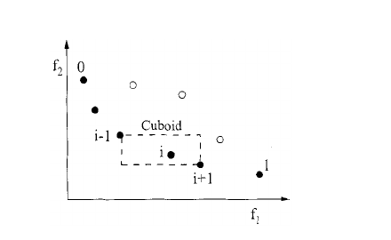

**Original caption:** Fig. 1. Crowding-distance calculation. Points marked in filled circles are

**中文图注:** 于 2026 年 5 月 12 日 10:49:15 UTC 从 IEEE Xplore 下载。 存在限制。 DEB 等人：快速且精英的多目标 GA：NSGA-II 185 图 1。 拥挤距离计算。

**Reading note:** 自动裁剪以图注为定位依据；正式引用图中数值前请对照原 PDF 检查裁剪边界与坐标轴。

**Source:** p.4 S079 · extraction confidence: low

**Original:** Points marked in filled circles are solutions of the same nondominated front. 2) Since each solution must be compared with all other solutions in the population, the overall complexity of the sharing function approach is .

**中文:** 用实心圆圈标记的点是同一非支配前沿的解。 2）由于每个解决方案都必须与所有其他解决方案进行比较，因此 在总体解决方案中，共享函数方法的总体复杂度为 。

**Source:** p.4 S080 · extraction confidence: low

**Original:** In the proposed NSGA-II, we replace the sharing function approach with a crowded-comparison approach that eliminates both the above difficulties to some extent. The new approach does not require any user-defined parameter for maintaining diversity among population members.

**中文:** 在提出的 NSGA-II 中，我们用拥挤比较方法取代了共享函数方法，在一定程度上消除了上述困难。 新方法不需要任何用户定义的参数来维持群体成员之间的多样性。

**Source:** p.4 S081 · extraction confidence: low

**Original:** Also, the suggested approach has a better computational complexity. To describe this approach, we first define a density-estimation metric and then present the crowded-comparison operator.

**中文:** 此外，建议的方法具有更好的计算复杂性。 为了描述这种方法，我们首先定义一个密度估计度量，然后 介绍拥挤比较运算符。

**Source:** p.4 S082 · extraction confidence: low

**Original:** 1) Density Estimation: To get an estimate of the density of solutions surrounding a particular solution in the population, we calculate the average distance of two points on either side of this point along each of the objectives.

**中文:** 1）密度估计：获得密度的估计 围绕总体中特定解决方案的解决方案，我们计算该点沿每个目标两侧的两点的平均距离。

**Source:** p.4 S083 · extraction confidence: low

**Original:** This quantity serves as an estimate of the perimeter of the cuboid formed by using the nearest neighbors as the vertices (call this the crowding distance). In Fig. 1, the crowding distance of the th solution in its front (marked with solid circles) is the average side length of the cuboid (shown with a dashed box).

**中文:** 该量可用作对使用最近邻居作为顶点形成的长方体周长的估计（称为拥挤距离）。 在图1中，第一个解在其前面（用实心圆圈标记）的拥挤距离是长方体的平均边长（用虚线框表示）。

**Source:** p.4 S084 · extraction confidence: low

**Original:** The crowding-distance computation requires sorting the population according to each objective function value in ascending order of magnitude. Thereafter, for each objective function, the boundary solutions (solutions with smallest and largest function values) are assigned an infinite distance value.

**中文:** 拥挤距离计算需要根据每个目标函数值以升序对总体进行排序。 此后，对于每个目标函数，边界解（具有最小和最大函数值的解）被分配无限距离值。

**Source:** p.4 S085 · extraction confidence: low

**Original:** All other intermediate solutions are assigned a distance value equal to the absolute normalized difference in the function values of two adjacent solutions. This calculation is continued with other objective functions.

**中文:** 所有其他中间解被分配一个距离值，该距离值等于两个相邻解的函数值的绝对归一化差。 此计算继续与其他目标 功能。

**Source:** p.4 S086 · extraction confidence: low

**Original:** The overall crowding-distance value is calculated as the sum of individual distance values corresponding to each objective. Each objective function is normalized before calculating the crowding distance.

**中文:** 总体拥挤距离值计算为与每个目标对应的各个距离值的总和。 在计算拥挤距离之前对每个目标函数进行归一化。

## Page 5

**Source:** p.5 S087 · extraction confidence: low

**Original:** The algorithm as shown at the bottom of the page outlines the crowding-distance computation procedure of all solutions in an nondominated set . Here, refers to the th objective function value of the th individual in the set and the parameters and are the maximum and minimum values of the th objective function.

**中文:** 页面底部所示的算法概述了非支配集中所有解的拥挤距离计算过程。 这里， 指集合中第 个个体的第 目标函数值和参数， 是第 目标函数的最大值和最小值。

**Source:** p.5 S088 · extraction confidence: low

**Original:** The complexity of this procedure is governed by the sorting algorithm. Since independent sortings of at most solutions (when all population members are in one front ) are involved, the above algorithm has computational complexity.

**中文:** 此过程的复杂性由排序算法决定。 由于涉及到最多解的独立排序（当所有群体成员都在一个前面时），上述算法具有计算复杂度。

**Source:** p.5 S089 · extraction confidence: low

**Original:** After all population members in the set are assigned a distance metric, we can compare two solutions for their extent of proximity with other solutions. A solution with a smaller value of this distance measure is, in some sense, more crowded by other solutions.

**中文:** 在为集合中的所有群体成员分配距离度量后，我们可以比较两个解决方案与其他解决方案的接近程度。 从某种意义上说，距离度量值较小的解决方案比其他解决方案更拥挤。

**Source:** p.5 S090 · extraction confidence: low

**Original:** This is exactly what we compare in the proposed crowded-comparison operator, described below. Although Fig. 1 illustrates the crowding-distance computation for two objectives, the procedure is applicable to more than two objectives as well.

**中文:** 这正是我们在提议的拥挤比较运算符中进行比较的内容，如下所述。 虽然图 1 说明了两个目标的拥挤距离计算，但该过程也适用于两个以上的目标。

**Source:** p.5 S091 · extraction confidence: low

**Original:** 2) Crowded-Comparison Operator: The crowded-comparison operator ( ) guides the selection process at the various stages of the algorithm toward a uniformly spread-out Paretooptimal front.

**中文:** 2）拥挤比较算子：拥挤比较 ison 算子 ( ) 引导算法各个阶段的选择过程朝向均匀分布的帕累托最优前沿。

**Source:** p.5 S092 · extraction confidence: low

**Original:** Assume that every individual in the population has two attributes: 1) nondomination rank ( ); 2) crowding distance ( ). We now define a partial order as if or and That is, between two solutions with differing nondomination ranks, we prefer the solution with the lower (better) rank.

**中文:** 假设群体中的每个人都有两个属性： 1）非支配等级（ ）； 2）拥挤距离（ ）。 我们现在将偏序定义为 if or and 也就是说，在具有不同非支配等级的两个解决方案之间，我们更喜欢具有较低（更好）等级的解决方案。

**Source:** p.5 S093 · extraction confidence: low

**Original:** Otherwise, if both solutions belong to the same front, then we prefer the solution that is located in a lesser crowded region. With these three new innovations—a fast nondominated sorting procedure, a fast crowded distance estimation procedure, and a simple crowded comparison operator, we are now ready to describe the NSGA-II algorithm.

**中文:** 否则，如果两个解决方案属于同一战线，那么我们更喜欢位于不太拥挤区域的解决方案。 有了这三项新的创新——快速非支配排序过程、快速拥挤距离估计过程和简单的拥挤比较运算符，我们现在准备好描述 NSGA-II 算法了。

**Source:** p.5 S094 · extraction confidence: low

**Original:** Main Loop Initially, a random parent population is created. The population is sorted based on the nondomination. Each solution is assigned a fitness (or rank) equal to its nondomination level (1 is the best level, 2 is the next-best level, and so on).

**中文:** 主循环 最初，创建一个随机的父群体。 人口根据非支配性进行排序。 每个解决方案都被分配一个等于其非支配级别的适应度（或等级）（1 是最佳级别，2 是次佳级别，依此类推）。

**Source:** p.5 S095 · extraction confidence: low

**Original:** Thus, minimization of fitness is assumed. At first, the usual binary tournament selection, recombination, and mutation operators are used to create a offspring population of size .

**中文:** 因此，假设适应度最小化。 首先，使用通常的二元锦标赛选择、重组和变异算子来创建大小为 的后代种群。

**Source:** p.5 S096 · extraction confidence: low

**Original:** Since elitism - - number of solutions in for each set initialize distance for each objective sort sort using each objective value so that boundary points are always selected for to for all other points Authorized licensed use limited to: Beijing University of Chemical Technology.

**中文:** 由于精英主义 - - 每组初始化距离的解数 对于每个目标排序，使用每个目标值进行排序，以便始终为所有其他点选择边界点 授权许可使用仅限于：北京化工大学。

**Source:** p.5 S097 · extraction confidence: high

**Original:** Downloaded on May 12,2026 at 10:49:15 UTC from IEEE Xplore. Restrictions apply.

**中文:** 于 2026 年 5 月 12 日 10:49:15 UTC 从 IEEE Xplore 下载。 存在限制。

**Source:** p.5 S098 · extraction confidence: high

**Original:** 186 IEEE TRANSACTIONS ON EVOLUTIONARY COMPUTATION, VOL. 6, NO. 2, APRIL 2002

**中文:** 186 IEEE 进化计算交易，卷。 6、没有。 2、2002 年 4 月

**Source:** p.5 S099 · extraction confidence: high

**Original:** is introduced by comparing current population with previously found best nondominated solutions, the procedure is different after the initial generation. We first describe the th generation of the proposed algorithm as shown at the bottom of the page.

**中文:** 通过将当前群体与先前找到的最佳非支配解决方案进行比较来引入，初始生成后的过程有所不同。 我们首先描述所提出的算法的第三代，如页面底部所示。

**Source:** p.5 S100 · extraction confidence: high

**Original:** The step-by-step procedure shows that NSGA-II algorithm is simple and straightforward. First, a combined population is formed. The population is of size . Then, the population is sorted according to nondomination.

**中文:** 逐步过程表明 NSGA-II 算法简单明了。 首先，形成组合群体。 人口规模很大。 然后，根据非支配性对总体进行排序。

**Source:** p.5 S101 · extraction confidence: high

**Original:** Since all previous and current population members are included in , elitism is ensured. Now, solutions belonging to the best nondominated set are of best solutions in the combined population and must be emphasized more than any other solution in the combined population.

**中文:** 由于所有以前和当前的人口成员都包含在 中，因此确保了精英主义。 现在，属于最佳非支配集的解决方案是组合总体中的最佳解决方案，并且必须比组合总体中的任何其他解决方案更加强调。

**Source:** p.5 S102 · extraction confidence: low

**Original:** If the size of is smaller then , we definitely choose all members of the set for the new population . The remaining members of the population are chosen from subsequent nondominated fronts in the order of their ranking.

**中文:** 如果 的尺寸较小，则 , 我们肯定会为新人口选择集合中的所有成员。 剩余的人口成员是按照排名顺序从随后的非统治阵线中选出的。

**Source:** p.5 S103 · extraction confidence: low

**Original:** Thus, solutions from the set are chosen next, followed by solutions from the set , and so on. This procedure is continued until no more sets can be accommodated. Say that the set is the last nondominated set beyond which no other set can be accommodated.

**中文:** 因此，接下来选择集合中的解决方案，然后选择集合中的解决方案，依此类推。 继续此过程，直到无法容纳更多组为止。 假设该集合是最后一个非支配集合，除此之外不能容纳其他集合。

## Page 6

**Source:** p.6 S104 · extraction confidence: low

**Original:** In general, the count of solutions in all sets from to would be larger than the population size. To choose exactly population members, we sort the solutions of the last front using the crowded-comparison operator in descending order and choose the best solutions needed to fill all population slots.

**中文:** 一般来说，从 到 的所有集合中解决方案的数量将大于总体规模。 为了准确选择种群成员，我们使用拥挤比较运算符按降序对最后一个前沿的解决方案进行排序，并选择填充所有种群槽所需的最佳解决方案。

**Source:** p.6 S105 · extraction confidence: low

**Original:** The NSGA-II procedure is also shown in Fig. 2. The new population of size is now used for selection, crossover, and mutation to create a new population of size . It is important to note that we use a binary tournament selection operator but the selection criterion is now based on the crowded-comparison operator .

**中文:** NSGA-II 流程也如图 2 所示。 现在，大小为 的新种群用于选择、交叉和突变，以创建大小为 的新种群。 值得注意的是，我们使用二元锦标赛选择运算符，但选择标准现在基于拥挤比较运算符 。

### Fig. 2. NSGA-II 流程也如图 2 所示。 现在，大小为 的新种群用于选择、交叉和突变，以创建大小为 的新种群。 值得注意的是，我们使用二元锦标赛选择运算符，但选择标准现在基于拥挤比较

**Placed near:** p.5 S105  
**Source:** p.5 S105  
**Crop confidence:** approximate-object-bounded

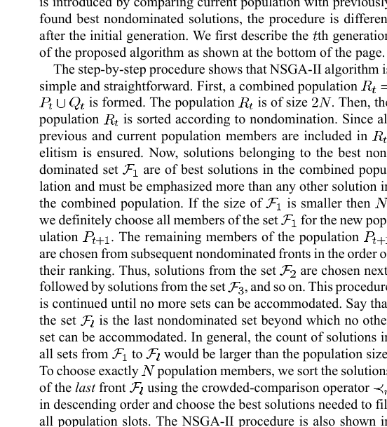

**Original caption:** Fig. 2. The new population of size is now used for se-

**中文图注:** NSGA-II 流程也如图 2 所示。 现在，大小为 的新种群用于选择、交叉和突变，以创建大小为 的新种群。 值得注意的是，我们使用二元锦标赛选择运算符，但选择标准现在基于拥挤比较运算符 。

**Reading note:** 自动裁剪以图注为定位依据；正式引用图中数值前请对照原 PDF 检查裁剪边界与坐标轴。

**Source:** p.6 S106 · extraction confidence: low

**Original:** Since this operator requires both the rank and crowded distance of each solution in the population, we calculate these quantities while forming the population , as shown in the above algorithm.

**中文:** 由于该运算符需要 总体中每个解的排名和拥挤距离，我们在形成总体时计算这些量，如上面的算法所示。

**Source:** p.6 S107 · extraction confidence: low

**Original:** Consider the complexity of one iteration of the entire algorithm. The basic operations and their worst-case complexities are as follows: 1) nondominated sorting is ; 2) crowding-distance assignment is ; 3) sorting on is .

**中文:** 考虑整个算法的一次迭代的复杂性。 基本操作及其最坏情况的复杂性如下： 1）非支配排序是； 2）拥挤距离分配为； 3) 排序依据是 。

**Source:** p.6 S108 · extraction confidence: low

**Original:** The overall complexity of the algorithm is , which is governed by the nondominated sorting part of the algorithm. If Fig. 2. NSGA-II procedure. performed carefully, the complete population of size need not be sorted according to nondomination.

**中文:** 算法的整体复杂度为 ，它由算法的非支配排序部分控制。 如果如图2。 NSGA-II 程序。如果仔细执行，则完整群体的大小不需要根据非支配性进行排序。

**Source:** p.6 S109 · extraction confidence: low

**Original:** As soon as the sorting procedure has found enough number of fronts to have members in , there is no reason to continue with the sorting procedure. The diversity among nondominated solutions is introduced by using the crowding comparison procedure, which is used in the tournament selection and during the population reduction phase.

**中文:** 一旦排序过程找到足够数量的前端来容纳 中的成员，就没有理由继续排序过程。 通过使用拥挤比较程序引入非支配解决方案之间的多样性，该程序用于锦标赛选择和人口减少阶段。

**Source:** p.6 S110 · extraction confidence: low

**Original:** Since solutions compete with their crowding-distance (a measure of density of solutions in the neighborhood), no extra niching parameter (such as needed in the NSGA) is required.

**中文:** 由于解决方案与其拥挤距离（邻近解决方案密度的度量）竞争，因此不需要额外的利基参数（例如 NSGA 中所需的参数）。

**Source:** p.6 S111 · extraction confidence: low

**Original:** Although the crowding distance is calculated in the objective function space, it can also be implemented in the parameter space, if so desired [3]. However, in all simulations performed in this study, we have used the objective-function space niching.

**中文:** 虽然拥挤距离是在目标函数空间中计算的，但如果需要的话，也可以在参数空间中实现[3]。 然而，在所有模拟中 在本研究中，我们使用了目标函数空间利基。

**Source:** p.6 S112 · extraction confidence: low

**Original:** IV.

**中文:** 四．

## Page 7

**Source:** p.7 S113 · extraction confidence: low

**Original:** SIMULATION RESULTS In this section, we first describe the test problems used to compare the performance of NSGA-II with PAES and SPEA. For PAES and SPEA, we have identical parameter settings as suggested in the original studies.

**中文:** 仿真结果 在本节中，我们首先描述用于比较 NSGA-II 与 PAES 和 SPEA 性能的测试问题。 对于 PAES 和 SPEA，我们具有与原始研究中建议的相同的参数设置。

**Source:** p.7 S114 · extraction confidence: low

**Original:** For NSGA-II, we have chosen a reasonable set of values and have not made any effort in finding the best parameter setting. We leave this task for a future study. combine parent and offspring population - - - all nondominated fronts of and until until the parent population is filled - - calculate crowding-distance in include th nondominated front in the parent pop check the next front for inclusion Sort sort in descending order using choose the first elements of - - use selection, crossover and mutation to create a new population increment the generation counter Authorized licensed use limited to: Beijing University of Chemical Technology.

**中文:** 对于 NSGA-II，我们选择了一组合理的值，并且没有做出任何努力来寻找最佳参数设置。 我们把这个任务留到以后的研究。 合并父代和子代种群 - - - 的所有非支配前沿，直到父代种群填满 - - 计算拥挤距离，将非支配前沿包含在父代人口中，检查下一个前沿是否包含 使用选择的第一个元素按降序排序 - - 使用选择、交叉和变异创建新的种群 增量计数器 授权许可使用仅限于：北京化工大学。

**Source:** p.7 S115 · extraction confidence: medium

**Original:** Downloaded on May 12,2026 at 10:49:15 UTC from IEEE Xplore. Restrictions apply. DEB et al.: A FAST AND ELITIST MULTIOBJECTIVE GA: NSGA-II 187 TABLE I TEST PROBLEMS USED IN THIS STUDY All objective functions are to be minimized.

**中文:** 于 2026 年 5 月 12 日 10:49:15 UTC 从 IEEE Xplore 下载。 存在限制。 DEB 等人：快速且精英的多目标 GA：NSGA-II 187 表 I 本研究中使用的测试问题 所有目标函数都将被最小化。

**Source:** p.7 S116 · extraction confidence: low

**Original:** Test Problems We first describe the test problems used to compare different MOEAs. Test problems are chosen from a number of significant past studies in this area. Veldhuizen [22] cited a number of test problems that have been used in the past.

**中文:** 测试问题 我们首先描述用于比较不同 MOEA 的测试问题。 测试问题选自该领域过去的许多重要研究。 Veldhuizen [22] 引用了一些过去使用过的测试问题。

**Source:** p.7 S117 · extraction confidence: low

**Original:** Of them, we choose four problems: Schaffer's study (SCH) [19], Fonseca and Fleming's study (FON) [10], Poloni's study (POL) [16], and Kursawe's study (KUR) [15]. In 1999, the first author suggested a systematic way of developing test problems for multiobjective optimization [3].

**中文:** 其中，我们选择四个问题：Schaffer 的研究（SCH）[19]，Fonseca 和 Fleming 的研究（FON）[10]，Poloni 的研究（POL）[16]，以及 Kursawe 的研究（KUR）[15]。 1999 年，第一作者提出了一种开发多目标优化测试问题的系统方法 [3]。

**Source:** p.7 S118 · extraction confidence: low

**Original:** Zitzler et al. [25] followed those guidelines and suggested six test problems. We choose five of those six problems here and call them ZDT1, ZDT2, ZDT3, ZDT4, and ZDT6. All problems have two objective functions.

**中文:** 齐茨勒等人。 [25]遵循这些指南并提出了六个测试问题。 我们在这里选择这六个问题中的五个，并将它们称为 ZDT1、ZDT2、ZDT3、ZDT4 和 ZDT6。 所有问题都有两个目标函数。

**Source:** p.7 S119 · extraction confidence: low

**Original:** None of these problems have any constraint. We describe these problems in Table I. The table also shows the number of variables, their bounds, the Pareto-optimal solutions, and the nature of the Pareto-optimal front for each problem.

**中文:** 这些问题都没有任何限制。 我们在表 I 中描述了这些问题。 该表还显示了变量的数量、它们的界限、帕累托最优解以及问题的性质 每个问题的帕累托最优前沿。

**Source:** p.7 S120 · extraction confidence: low

**Original:** All approaches are run for a maximum of 25 000 function evaluations. We use the single-point crossover and bitwise mutation for binary-coded GAs and the simulated binary crossover (SBX) operator and polynomial mutation [6] for real-coded GAs.

**中文:** 所有方法最多运行 25000 次函数评估。 我们对二进制编码的 GA 使用单点交叉和按位变异，对实数编码的 GA 使用模拟二元交叉 (SBX) 算子和多项式变异 [6]。

**Source:** p.7 S121 · extraction confidence: low

**Original:** The crossover probability of and a mutation probability of or (where is the number of decision variables for real-coded GAs and is the string length for binary-coded GAs) are used.

**中文:** 使用 的交叉概率和 或 的变异概率（其中 是实数编码 GA 的决策变量数量，是二进制编码 GA 的字符串长度）。

**Source:** p.7 S122 · extraction confidence: low

**Original:** For real-coded NSGA-II, we use distribution indexes [6] for crossover and mutation operators as and , respectively. The population obtained at the end of 250 generations (the population after elite-preserving operator is applied) is used to calculate a couple of performance metrics, which we discuss in the next section.

**中文:** 对于实数编码的 NSGA-II，我们使用分布索引 [6] 进行交叉和 变异算子分别为 和 。 在 250 代结束时获得的种群（应用精英保留算子后的种群）用于计算几个性能指标，我们将在下一节中讨论。

**Source:** p.7 S123 · extraction confidence: low

**Original:** For PAES, we use a depth value equal to four and an archive size of 100. We use all population members of the archive obtained at the end of 25 000 iterations to calculate the performance metrics.

**中文:** 对于 PAES，我们使用等于 4 的深度值和 100 的存档大小。 我们使用 25000 次迭代结束时获得的存档的所有总体成员来计算性能指标。

**Source:** p.7 S124 · extraction confidence: low

**Original:** For SPEA, we use a population of size 80 and an external population of size 20 (this 4 : 1 ratio is suggested by the developers of SPEA to maintain an adequate selection pressure for the elite solutions), so that overall population size becomes 100.

**中文:** 对于 SPEA，我们使用规模为 80 的总体和规模为 20 的外部总体（这 SPEA的开发者建议采用4:1的比例来维持 为精英解决方案提供足够的选择压力），使总体人口规模变为 100。

**Source:** p.7 S125 · extraction confidence: low

**Original:** SPEA is also run until 25 000 function evaluations are done. For SPEA, we use the Authorized licensed use limited to: Beijing University of Chemical Technology. Downloaded on May 12,2026 at 10:49:15 UTC from IEEE Xplore.

**中文:** SPEA 也会运行到 已完成 25 000 次功能评估。对于 SPEA，我们使用 授权许可使用仅限于：北京化工大学。 于 2026 年 5 月 12 日 10:49:15 UTC 从 IEEE Xplore 下载。

**Source:** p.7 S126 · extraction confidence: high

**Original:** Restrictions apply.

**中文:** 存在限制。

**Source:** p.7 S127 · extraction confidence: high

**Original:** 188 IEEE TRANSACTIONS ON EVOLUTIONARY COMPUTATION, VOL. 6, NO. 2, APRIL 2002

**中文:** 188 IEEE 进化计算交易，卷。 6、没有。 2、2002 年 4 月

**Source:** p.7 S128 · extraction confidence: low

**Original:** Fig. 3. Distance metric 7. nondominated solutions of the combined GA and external populations at the final generation to calculate the performance metrics used in this study.

**中文:** 图 3. 距离度量 7. 最后一代的组合 GA 和外部种群的非支配解，用于计算本研究中使用的性能度量。

### Fig. 3. 图 3. 距离度量 7. 最后一代的组合 GA 和外部种群的非支配解，用于计算本研究中使用的性能度量。

**Placed near:** p.7 S128  
**Source:** p.7 S128  
**Crop confidence:** approximate-object-bounded

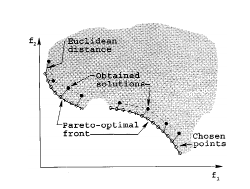

**Original caption:** Fig. 3. Distance metric (cid:7). Fig. 4. Diversity metric (cid:1).

**中文图注:** 图 3. 距离度量 7. 最后一代的组合 GA 和外部种群的非支配解，用于计算本研究中使用的性能度量。

**Reading note:** 自动裁剪以图注为定位依据；正式引用图中数值前请对照原 PDF 检查裁剪边界与坐标轴。

**Source:** p.7 S129 · extraction confidence: low

**Original:** For PAES, SPEA, and binary-coded NSGA-II, we have used 30 bits to code each decision variable. Performance Measures Unlike in single-objective optimization, there are two goals in a multiobjective optimization: 1) convergence to the Pareto-optimal set and 2) maintenance of diversity in solutions of the Pareto-optimal set.

**中文:** 对于 PAES、SPEA 和二进制编码的 NSGA-II，我们使用 30 位来编码每个决策变量。 性能测量与单目标优化不同，多目标优化有两个目标：1）收敛到帕累托最优集，2）维持帕累托最优集解的多样性。

**Source:** p.7 S130 · extraction confidence: low

**Original:** These two tasks cannot be measured adequately with one performance metric. Many performance metrics have been suggested [1], [8], [24]. Here, we define two performance metrics that are more direct in evaluating each of the above two goals in a solution set obtained by a multiobjective optimization algorithm.

**中文:** 这两项任务无法用一种绩效指标来充分衡量。 已经提出了许多性能指标[1]、[8]、[24]。 在这里，我们定义了两个性能指标，可以更直接地评估多目标获得的解决方案集中的上述两个目标 优化算法。

**Source:** p.7 S131 · extraction confidence: low

**Original:** The first metric measures the extent of convergence to a known set of Pareto-optimal solutions. Since multiobjective algorithms would be tested on problems having a known set of Pareto-optimal solutions, the calculation of this metric is possible.

**中文:** 第一个指标衡量一组已知的帕累托最优解的收敛程度。 由于多目标算法将在具有一组已知的帕累托最优解的问题上进行测试，因此该度量的计算是可能的。

## Page 8

**Source:** p.8 S132 · extraction confidence: low

**Original:** We realize, however, that such a metric cannot be used for any arbitrary problem. First, we find a set of uniformly spaced solutions from the true Pareto-optimal front in the objective space.

**中文:** 然而，我们意识到这样的指标不能用于任何任意问题。 首先，我们从目标空间中真正的帕累托最优前沿找到一组均匀间隔的解。

**Source:** p.8 S133 · extraction confidence: low

**Original:** For each solution obtained with an algorithm, we compute the minimum Euclidean distance of it from chosen solutions on the Pareto-optimal front. The average of these distances is used as the first metric (the convergence metric).

**中文:** 对于通过算法获得的每个解决方案 计算它与帕累托最优前沿上所选解决方案的最小欧几里德距离。 这些距离的平均值用作第一个度量（收敛度量）。

**Source:** p.8 S134 · extraction confidence: low

**Original:** Fig. 3 shows the calculation procedure of this metric. The shaded region is the feasible search region and the solid curved lines specify the Pareto-optimal solutions. Solutions with open circles are chosen solutions on the Pareto-optimal front for the calculation of the convergence metric and solutions marked with dark circles are solutions obtained by an algorithm.

**中文:** 图3显示了该指标的计算过程。 阴影区域是可行的搜索区域，实曲线指定帕累托最优解。 带有空心圆圈的解是在帕累托最优前沿选择的解，用于计算收敛度量，而用黑圆圈标记的解是通过以下方法获得的解： 算法。

**Source:** p.8 S135 · extraction confidence: low

**Original:** The smaller the value of this metric, the better the convergence toward the Pareto-optimal front. When all obtained solutions lie exactly on chosen solutions, this metric takes a value of zero.

**中文:** 该度量的值越小，向帕累托最优前沿收敛得越好。 当所有获得的解完全位于所选解上时，该度量的值为零。

**Source:** p.8 S136 · extraction confidence: low

**Original:** In all simulations performed here, we present the average and variance of this metric calculated for solution sets obtained in multiple runs. Even when all solutions converge to the Pareto-optimal front, the above convergence metric does not have a value of zero.

**中文:** 在此处执行的所有模拟中，我们提供了针对多次运行中获得的解决方案集计算的该指标的平均值和方差。 即使所有解都收敛到帕累托最优前沿，上述收敛度量也不具有零值。

**Source:** p.8 S137 · extraction confidence: low

**Original:** The metric will yield zero only when each obtained solution lies exactly on each of the chosen solutions. Although this metric alone Fig. 4. Diversity metric 1. can provide some information about the spread in obtained solutions, we define an different metric to measure the spread in solutions obtained by an algorithm directly.

**中文:** 仅当每个获得的解恰好位于每个所选解上时，度量才会产生零。 尽管仅此指标如图 4 所示。 多样性指标 1. 可以提供有关获得的解决方案中的分布的一些信息，我们定义一个不同的度量来直接测量算法获得的解决方案中的分布。

**Source:** p.8 S138 · extraction confidence: low

**Original:** The second metric measures the extent of spread achieved among the obtained solutions. Here, we are interested in getting a set of solutions that spans the entire Pareto-optimal region.

**中文:** 第二个指标衡量所获得的解决方案之间实现的传播程度。 在这里，我们有兴趣获得一组跨越整个帕累托最优区域的解决方案。

## Page 9

**Source:** p.9 S139 · extraction confidence: low

**Original:** We calculate the Euclidean distance between consecutive solutions in the obtained nondominated set of solutions. We calculate the average of these distances. Thereafter, from the obtained set of nondominated solutions, we first calculate the extreme solutions (in the objective space) by fitting a curve parallel to that of the true Pareto-optimal front.

**中文:** 我们计算获得的非支配解集中连续解之间的欧几里德距离。 我们计算这些距离的平均值。 此后，从获得的非 主导解，我们首先通过拟合一条与真实帕累托最优前沿平行的曲线来计算极端解（在目标空间中）。

**Source:** p.9 S140 · extraction confidence: low

**Original:** Then, we use the following metric to calculate the nonuniformity in the distribution: (1) Here, the parameters and are the Euclidean distances between the extreme solutions and the boundary solutions of the obtained nondominated set, as depicted in Fig. 4.

**中文:** 然后，我们使用以下度量来计算分布的不均匀性：（1）这里，参数 和 是所获得的非支配集的极值解和边界解之间的欧几里德距离，如图4所示。

**Source:** p.9 S141 · extraction confidence: low

**Original:** The figure illustrates all distances mentioned in the above equation. The parameter is the average of all distances , , assuming that there are solutions on the best nondominated front.

**中文:** 该图说明了上式中提到的所有距离。 该参数是所有距离的平均值， ，假设在最佳非支配方面存在解决方案。

**Source:** p.9 S142 · extraction confidence: low

**Original:** With solutions, there are consecutive distances. The denominator is the value of the numerator for the case when all solutions lie on one solution. It is interesting to note that this is not the worst case spread of solutions possible.

**中文:** 有了解，就有连续的距离。 分母是所有解都位于一个解上时分子的值。 有趣的是，这并不是解决方案传播的最坏情况。

**Source:** p.9 S143 · extraction confidence: low

**Original:** We can have a scenario in which there is a large variance in . In such scenarios, the metric may be greater than one. Thus, the maximum value of the above metric can be greater than one.

**中文:** 我们可以有一个场景，其中 存在很大的差异。 在这种情况下，度量可能大于一。 因此，上述度量的最大值可以大于一。

**Source:** p.9 S144 · extraction confidence: low

**Original:** However, a good distribution would make all distances equal to and would make (with existence of extreme solutions in the nondominated set). Thus, for the most widely and uniformly spreadout set of nondominated solutions, the numerator of would be zero, making the metric to take a value zero.

**中文:** 然而，良好的分布将使所有距离等于 且 将使（在非支配集中存在极端解）。 因此，对于最广泛且均匀分布的非支配解集， 的分子将为零，从而使度量取值为零。

**Source:** p.9 S145 · extraction confidence: low

**Original:** For any other distribution, the value of the metric would be greater than zero. For two distributions having identical values of and , the metric takes a higher value with worse distributions of solutions within the extreme solutions.

**中文:** 对于任何其他分布，度量值将大于零。 对于具有相同 和 值的两个分布，度量在极端解内解的分布较差的情况下采用较高的值。

**Source:** p.9 S146 · extraction confidence: low

**Original:** Note that the above diversity metric can be used on any nondominated set of solutions, including one that is not the Pareto-optimal set. Using Authorized licensed use limited to: Beijing University of Chemical Technology.

**中文:** 请注意， 上述多样性度量可以用于任何非支配解决方案集，包括不是帕累托最优集的解决方案。 使用授权许可使用仅限于：北京化工大学。

**Source:** p.9 S147 · extraction confidence: medium

**Original:** Downloaded on May 12,2026 at 10:49:15 UTC from IEEE Xplore. Restrictions apply. DEB et al.: A FAST AND ELITIST MULTIOBJECTIVE GA: NSGA-II 189 TABLE II MEAN (FIRST ROWS) AND VARIANCE (SECOND ROWS) OF THE CONVERGENCE METRIC 7 TABLE III MEAN (FIRST ROWS) AND VARIANCE (SECOND ROWS) OF THE DIVERSITY METRIC 1 a triangularization technique or a Voronoi diagram approach [1] to calculate , the above procedure can be extended to estimate the spread of solutions in higher dimensions.

**中文:** 于 2026 年 5 月 12 日 10:49:15 UTC 从 IEEE Xplore 下载。 存在限制。 DEB 等人：A FAST AND ELITIST MULTIOBJECTIVE GA: NSGA-II 189 表 II 收敛指标的均值（第一行）和方差（第二行） 7 表 III 多样性指标的均值（第一行）和方差（第二行） 1 使用三角化技术或 Voronoi 图方法 [1] 进行计算，上述过程可以扩展以估计更高维度的解的扩展。

**Source:** p.9 S148 · extraction confidence: low

**Original:** Discussion of the Results Table II shows the mean and variance of the convergence metric obtained using four algorithms NSGA-II (real-coded), NSGA-II (binary-coded), SPEA, and PAES.

**中文:** 结果讨论 表 II 显示了使用 NSGA-II（实数编码）、NSGA-II（二进制编码）、SPEA 和 PAES 四种算法获得的收敛度量的均值和方差。

**Source:** p.9 S149 · extraction confidence: low

**Original:** NSGA-II (real coded or binary coded) is able to converge better in all problems except in ZDT3 and ZDT6, where PAES found better convergence. In all cases with NSGA-II, the variance in ten runs is also small, except in ZDT4 with NSGA-II (binary coded).

**中文:** NSGA-II（实数编码或二进制编码）能够在除 ZDT3 和 ZDT6 之外的所有问题中更好地收敛，其中 PAES 发现更好的收敛性。 在使用 NSGA-II 的所有情况下，十次运行的方差也很小，除了使用 NSGA-II（二进制编码）的 ZDT4 中。

## Page 10

**Source:** p.10 S150 · extraction confidence: low

**Original:** The fixed archive strategy of PAES allows better convergence to be achieved in two out of nine problems. Table III shows the mean and variance of the diversity metric obtained using all three algorithms.

**中文:** PAES 的固定存档策略可以在九个问题中的两个上实现更好的收敛。 表 III 显示了使用所有三种算法获得的多样性度量的平均值和方差。

**Source:** p.10 S151 · extraction confidence: low

**Original:** NSGA-II (real or binary coded) performs the best in all nine test problems. The worst performance is observed with PAES. For illustration, we show one of the ten runs of PAES with an arbitrary run of NSGA-II (real-coded) on problem SCH in Fig. 5.

**中文:** NSGA-II（实数或二进制编码）在所有九个测试问题中表现最好。 PAES 的性能最差。 为了便于说明，我们在图 5 中展示了 10 次 PAES 运行之一以及对问题 SCH 的任意 NSGA-II（实数编码）运行。

**Source:** p.10 S152 · extraction confidence: low

**Original:** On most problems, real-coded NSGA-II is able to find a better spread of solutions than any other algorithm, including binary-coded NSGA-II. In order to demonstrate the working of these algorithms, we also show typical simulation results of PAES, SPEA, and NSGA-II on the test problems KUR, ZDT2, ZDT4, and ZDT6.

**中文:** 在大多数问题上，实数编码 NSGA-II 能够比任何其他算法（包括二进制编码 NSGA-II）找到更好的解决方案。 为了演示这些算法的工作原理，我们还展示了 PAES、SPEA 和 NSGA-II 在测试问题 KUR、ZDT2、ZDT4 和 ZDT6 上的典型仿真结果。

**Source:** p.10 S153 · extraction confidence: low

**Original:** The problem KUR has three discontinuous regions in the Pareto-optimal front. Fig. 6 shows all nondominated solutions obtained after 250 generations with NSGA-II (real-coded).

**中文:** 问题 KUR 在帕累托最优前沿具有三个不连续区域。 图 6 显示了 NSGA-II（实数编码）250 代后获得的所有非支配解。

**Source:** p.10 S154 · extraction confidence: low

**Original:** The Pareto-optimal region is also shown in the figure. This figure demonstrates the abilities of NSGA-II in converging to the true front and in finding diverse solutions in the front.

**中文:** 图中还显示了帕累托最优区域。 该图展示了 NSGA-II 收敛到真实前沿以及在前沿寻找多样化解决方案的能力。

**Source:** p.10 S155 · extraction confidence: low

**Original:** Fig. 7 shows the obtained nondominated solutions with SPEA, which is the next-best algorithm for this problem (refer to Tables II and III). Fig. 5. NSGA-II finds better spread of solutions than PAES on SCH.

**中文:** 图7所示 使用 SPEA 获得的非支配解，这是该问题的次优算法（参见表 II 和表 III）。 图 5. NSGA-II 在 SCH 上发现了比 PAES 更好的解决方案传播。

### Fig. 7. 图7所示 使用 SPEA 获得的非支配解，这是该问题的次优算法（参见表 II 和表 III）。 图 5. NSGA-II 在 SCH 上发现了比 PAES 更好的解决方案传播。

**Placed near:** p.9 S155  
**Source:** p.9 S155  
**Crop confidence:** approximate-object-bounded

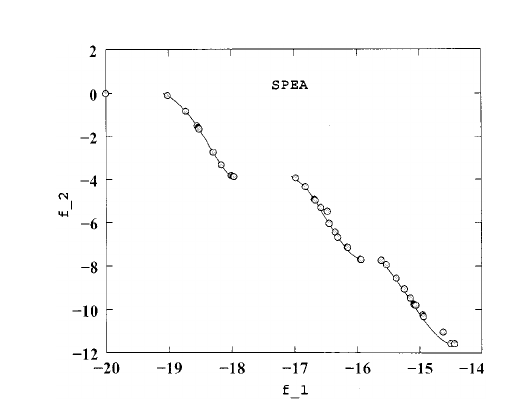

**Original caption:** Fig. 7. Nondominated solutions with SPEA on KUR.

**中文图注:** 图7所示 使用 SPEA 获得的非支配解，这是该问题的次优算法（参见表 II 和表 III）。 图 5. NSGA-II 在 SCH 上发现了比 PAES 更好的解决方案传播。

**Reading note:** 自动裁剪以图注为定位依据；正式引用图中数值前请对照原 PDF 检查裁剪边界与坐标轴。

**Source:** p.10 S156 · extraction confidence: low

**Original:** Fig. 6. Nondominated solutions with NSGA-II (real-coded) on KUR. Authorized licensed use limited to: Beijing University of Chemical Technology. Downloaded on May 12,2026 at 10:49:15 UTC from IEEE Xplore.

**中文:** 图 6. KUR 上的 NSGA-II（实数编码）非支配解决方案。 授权许可使用仅限于：北京化工大学。 于 2026 年 5 月 12 日 10:49:15 UTC 从 IEEE Xplore 下载。

**Source:** p.10 S157 · extraction confidence: high

**Original:** Restrictions apply.

**中文:** 存在限制。

## Page 11

**Source:** p.11 S158 · extraction confidence: medium

**Original:** 190 IEEE TRANSACTIONS ON EVOLUTIONARY COMPUTATION, VOL. 6, NO. 2, APRIL 2002

**中文:** 190 IEEE 进化计算交易，卷。 6、没有。 2、2002 年 4 月

**Source:** p.11 S159 · extraction confidence: low

**Original:** Fig. 7. Nondominated solutions with SPEA on KUR. Fig. 8. Nondominated solutions with NSGA-II (binary-coded) on ZDT2. In both aspects of convergence and distribution of solutions, NSGA-II performed better than SPEA in this problem.

**中文:** 图 7. KUR 上 SPEA 的非支配解决方案。 图 8. ZDT2 上使用 NSGA-II（二进制编码）的非支配解决方案。 在该问题中，NSGA-II 在解的收敛性和分布性方面均优于 SPEA。

### Fig. 8. 图 7. KUR 上 SPEA 的非支配解决方案。 图 8. ZDT2 上使用 NSGA-II（二进制编码）的非支配解决方案。 在该问题中，NSGA-II 在解的收敛性和分布性方面

**Placed near:** p.9 S159  
**Source:** p.9 S159  
**Crop confidence:** approximate-object-bounded

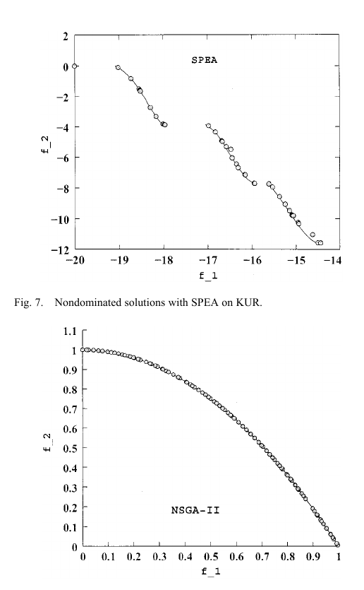

**Original caption:** Fig. 8. Nondominated solutionswith NSGA-II (binary-coded) on ZDT2.

**中文图注:** 图 7. KUR 上 SPEA 的非支配解决方案。 图 8. ZDT2 上使用 NSGA-II（二进制编码）的非支配解决方案。 在该问题中，NSGA-II 在解的收敛性和分布性方面均优于 SPEA。

**Reading note:** 自动裁剪以图注为定位依据；正式引用图中数值前请对照原 PDF 检查裁剪边界与坐标轴。

**Source:** p.11 S160 · extraction confidence: low

**Original:** Since SPEA could not maintain enough nondominated solutions in the final GA population, the overall number of nondominated solutions is much less compared to that obtained in the final population of NSGA-II.

**中文:** 由于 SPEA 无法在最终 GA 种群中维持足够的非支配解，因此与 NSGA-II 最终种群中获得的非支配解总数相比要少得多。

**Source:** p.11 S161 · extraction confidence: low

**Original:** Next, we show the nondominated solutions on the problem ZDT2 in Figs. 8 and 9. This problem has a nonconvex Pareto-optimal front. We show the performance of binary-coded NSGA-II and SPEA on this function.

**中文:** 接下来，我们展示图 2 和 3 中问题 ZDT2 的非支配解。 8和9。 该问题具有非凸帕累托最优前沿。 我们展示了二进制编码 NSGA-II 和 SPEA 在此函数上的性能。

**Source:** p.11 S162 · extraction confidence: low

**Original:** Although the convergence is not a difficulty here with both of these algorithms, both realand binary-coded NSGA-II have found a better spread and more solutions in the entire Pareto-optimal region than SPEA (the next-best algorithm observed for this problem).

**中文:** 虽然这两种算法的收敛都不是困难，但实数编码和二进制编码的 NSGA-II 都在整个 Pareto 最优区域中找到了比 SPEA（针对此问题观察到的下一个最佳算法）更好的分布和更多的解决方案。

**Source:** p.11 S163 · extraction confidence: low

**Original:** The problem ZDT4 has 21 or 7.94(10 ) different local Pareto-optimal fronts in the search space, of which only one corresponds to the global Pareto-optimal front. The Euclidean distance in the decision space between solutions of two consecutive local Pareto-optimal sets is 0.25.

**中文:** 问题 ZDT4 在搜索空间中有 21 个或 7.94(10 ) 个不同的局部帕累托最优前沿，其中只有一个对应于全局帕累托最优前沿。 两个连续局部帕累托最优集的解之间的决策空间中的欧几里得距离为 0.25。

**Source:** p.11 S164 · extraction confidence: low

**Original:** Fig. 10 shows that both real-coded NSGA-II and PAES get stuck at different local Pareto-optimal sets, but the convergence and ability to find a diverse set of solutions are definitely better with NSGA-II.

**中文:** 图 10 显示实数编码的 NSGA-II 和 PAES 都陷入了不同的局部帕累托最优集，但 NSGA-II 的收敛性和找到不同解决方案集的能力肯定更好。

### Fig. 10. 图 10 显示实数编码的 NSGA-II 和 PAES 都陷入了不同的局部帕累托最优集，但 NSGA-II 的收敛性和找到不同解决方案集的能力肯定更好。

**Placed near:** p.9 S164  
**Source:** p.9 S164  
**Crop confidence:** approximate-object-bounded

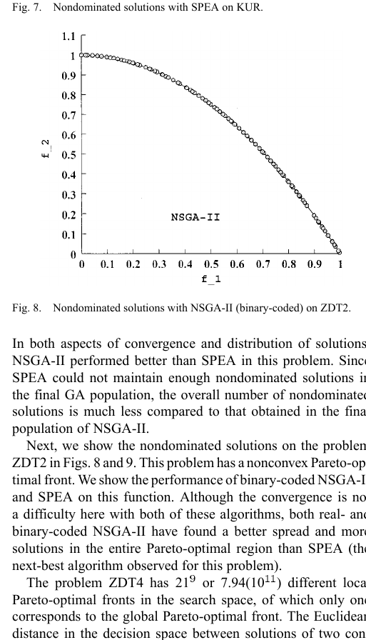

**Original caption:** Fig.10. NSGA-IIfindsbetterconvergenceandspreadofsolutionsthanPAES

**中文图注:** 图 10 显示实数编码的 NSGA-II 和 PAES 都陷入了不同的局部帕累托最优集，但 NSGA-II 的收敛性和找到不同解决方案集的能力肯定更好。

**Reading note:** 自动裁剪以图注为定位依据；正式引用图中数值前请对照原 PDF 检查裁剪边界与坐标轴。

**Source:** p.11 S165 · extraction confidence: low

**Original:** Binary-coded GAs have difficulties in converging Fig. 9. Nondominated solutions with SPEA on ZDT2. Fig. 10. NSGA-II finds better convergence and spread of solutions than PAES on ZDT4. near the global Pareto-optimal front, a matter that is also been observed in previous single-objective studies [5].

**中文:** 二进制编码的 GA 难以收敛 图 9. ZDT2 上 SPEA 的非支配解。 图 10. NSGA-II 在 ZDT4 上发现了比 PAES 更好的收敛性和扩展性。接近全球帕累托最优前沿，这一问题在之前的单目标研究中也观察到过[5]。

### Fig. 9. 二进制编码的 GA 难以收敛 图 9. ZDT2 上 SPEA 的非支配解。 图 10. NSGA-II 在 ZDT4 上发现了比 PAES 更好的收敛性和扩展性。接近全球帕累托最

**Placed near:** p.9 S165  
**Source:** p.9 S165  
**Crop confidence:** approximate-object-bounded

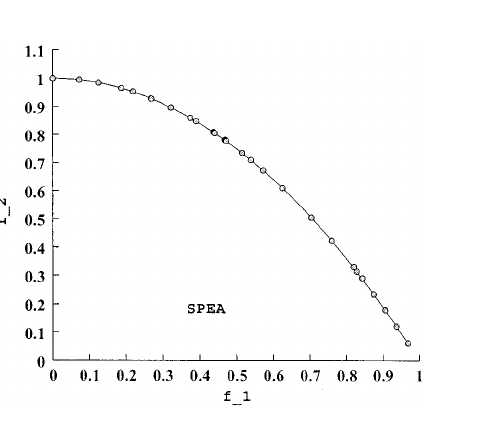

**Original caption:** Fig. 9. Nondominated solutions with SPEA on ZDT2.

**中文图注:** 二进制编码的 GA 难以收敛 图 9. ZDT2 上 SPEA 的非支配解。 图 10. NSGA-II 在 ZDT4 上发现了比 PAES 更好的收敛性和扩展性。接近全球帕累托最优前沿，这一问题在之前的单目标研究中也观察到过[5]。

**Reading note:** 自动裁剪以图注为定位依据；正式引用图中数值前请对照原 PDF 检查裁剪边界与坐标轴。

**Source:** p.11 S166 · extraction confidence: low

**Original:** On a similar ten-variable Rastrigin's function [the function here], that study clearly showed that a population of size of about at least 500 is needed for single-objective binary-coded GAs (with tournament selection, single-point crossover and bitwise mutation) to find the global optimum solution in more than 50% of the simulation runs. Since we have used a population of size 100, it is not expected that a multiobjective GA would find the global Pareto-optimal solution, but NSGA-II is able to find a good spread of solutions even at a local Pareto-optimal front.

**中文:** 在类似的十变量 Rastrigin 函数 [此处的函数] 上，该研究清楚地表明，单目标二进制编码 GA（具有锦标赛选择、单点交叉和按位）需要至少 500 人左右的群体 突变）来找到超过的全局最优解 50% 的模拟运行。由于我们使用了人口 大小为 100，预计多目标 GA 不会找到全局 Pareto 最优解，但 NSGA-II 即使在局部 Pareto 最优前沿也能够找到良好的解散布。

**Source:** p.11 S167 · extraction confidence: low

**Original:** Since SPEA converges poorly on this problem (see Table II), we do not show SPEA results on this figure. Finally, Fig. 11 shows that SPEA finds a better converged set of nondominated solutions in ZDT6 compared to any other algorithm.

**中文:** 由于 SPEA 在这个问题上的收敛性很差（见表 II），因此我们没有在此图中显示 SPEA 结果。 最后，图 11 显示，与任何其他算法相比，SPEA 在 ZDT6 中找到了一组更好的收敛非支配解。

**Source:** p.11 S168 · extraction confidence: low

**Original:** However, the distribution in solutions is better with real-coded NSGA-II. Different Parameter Settings In this study, we do not make any serious attempt to find the best parameter setting for NSGA-II.

**中文:** 然而，使用实数编码的 NSGA-II 解的分布更好。 不同的参数设置在本研究中，我们没有认真尝试寻找 NSGA-II 的最佳参数设置。

## Page 13

**Source:** p.13 S169 · extraction confidence: medium

**Original:** But in this section, we perAuthorized licensed use limited to: Beijing University of Chemical Technology. Downloaded on May 12,2026 at 10:49:15 UTC from IEEE Xplore. Restrictions apply.

**中文:** 但在本节中，我们的授权许可使用仅限于：北京化工大学。 于 2026 年 5 月 12 日 10:49:15 UTC 从 IEEE Xplore 下载。 存在限制。

**Source:** p.13 S170 · extraction confidence: low

**Original:** DEB et al.: A FAST AND ELITIST MULTIOBJECTIVE GA: NSGA-II 191 Fig. 11. Real-coded NSGA-II finds better spread of solutions than SPEA on ZDT6, but SPEA has a better convergence.

**中文:** DEB 等人：快速且精英的多目标 GA：NSGA-II 191 图 11。 实数编码 NSGA-II 在 ZDT6 上发现比 SPEA 更好的解扩展，但 SPEA 具有更好的收敛性。

### Fig. 11. DEB 等人：快速且精英的多目标 GA：NSGA-II 191 图 11。 实数编码 NSGA-II 在 ZDT6 上发现比 SPEA 更好的解扩展，但 SPEA 具有更好的收敛性

**Placed near:** p.10 S170  
**Source:** p.10 S170  
**Crop confidence:** approximate-object-bounded

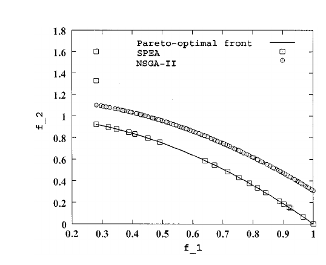

**Original caption:** Fig. 11. Real-coded NSGA-II finds better spread of solutions than SPEA on Fig. 12. Obtained nondominatedsolutionswithNSGA-II onproblemZDT4.

**中文图注:** DEB 等人：快速且精英的多目标 GA：NSGA-II 191 图 11。 实数编码 NSGA-II 在 ZDT6 上发现比 SPEA 更好的解扩展，但 SPEA 具有更好的收敛性。

**Reading note:** 自动裁剪以图注为定位依据；正式引用图中数值前请对照原 PDF 检查裁剪边界与坐标轴。

**Source:** p.13 S171 · extraction confidence: low

**Original:** TABLE IV MEAN AND VARIANCE OF THE CONVERGENCE AND DIVERSITY METRICS UP TO 500 GENERATIONS form additional experiments to show the effect of a couple of different parameter settings on the performance of NSGA-II.

**中文:** 表 IV 最多 500 代的收敛性和多样性度量的均值和方差形成了额外的实验，以显示几个不同的参数设置对 NSGA-II 性能的影响。

**Source:** p.13 S172 · extraction confidence: low

**Original:** First, we keep all other parameters as before, but increase the number of maximum generations to 500 (instead of 250 used before). Table IV shows the convergence and diversity metrics for problems POL, KUR, ZDT3, ZDT4, and ZDT6.

**中文:** 首先，我们保留以前的所有其他参数，但将最大代数增加到 500（而不是之前使用的 250）。 表 IV 显示了问题 POL、KUR、ZDT3、ZDT4 和 ZDT6 的收敛性和多样性度量。

**Source:** p.13 S173 · extraction confidence: low

**Original:** Now, we achieve a convergence very close to the true Pareto-optimal front and with a much better distribution. The table shows that in all these difficult problems, the real-coded NSGA-II has converged very close to the true optimal front, except in ZDT6, which probably requires a different parameter setting with NSGA-II.

**中文:** 现在，我们实现了非常接近真正的帕累托最优前沿的收敛，并且具有更好的分布。 该表显示，在所有这些难题中，实编码的 NSGA-II 都非常接近真正的最优前沿，但 ZDT6 除外，ZDT6 可能需要与 NSGA-II 不同的参数设置。

**Source:** p.13 S174 · extraction confidence: low

**Original:** Particularly, the results on ZDT3 and ZDT4 improve with generation number. The problem ZDT4 has a number of local Pareto-optimal fronts, each corresponding to particular value of .

**中文:** 帕特别是，ZDT3 和 ZDT4 的结果随着代数的增加而提高。 问题 ZDT4 有许多局部帕累托最优前沿，每个前沿都对应于 的特定值。

**Source:** p.13 S175 · extraction confidence: low

**Original:** A large change in the decision vector is needed to get out of a local optimum. Unless mutation or crossover operators are capable of creating solutions in the basin of another better attractor, the improvement in the convergence toward the true Pareto-optimal front is not possible.

**中文:** 需要对决策向量进行较大改变才能摆脱局部最优。 除非突变或交叉算子能够在另一个更好的吸引子盆地中创建解决方案，否则不可能改进向真正的帕累托最优前沿的收敛。

**Source:** p.13 S176 · extraction confidence: low

**Original:** We use NSGA-II (real-coded) with a smaller distribution index for mutation, which has an effect of creating solutions with more spread than before. Rest of the parameter settings are identical as before.

**中文:** 我们使用具有较小分布指数的 NSGA-II（实数编码）进行突变，其具有 创建比以前更广泛的解决方案的效果。 其余参数设置与之前相同。

**Source:** p.13 S177 · extraction confidence: low

**Original:** The convergence metric and diversity measure on problem ZDT4 at the end of 250 generations are as follows: Fig. 12. Obtained nondominated solutions with NSGA-II on problem ZDT4.

**中文:** 问题ZDT4在250代结束时的收敛性度量和多样性度量如下：图12。 使用 NSGA-II 在问题 ZDT4 上获得非支配解。

**Source:** p.13 S178 · extraction confidence: low

**Original:** These results are much better than PAES and SPEA, as shown in Table II. To demonstrate the convergence and spread of solutions, we plot the nondominated solutions of one of the runs after 250 generations in Fig. 12.

**中文:** 这些结果比 PAES 和 SPEA 好得多，如表 II 所示。 为了证明解的收敛和传播，我们在图 12 中绘制了 250 代后其中一次运行的非支配解。

**Source:** p.13 S179 · extraction confidence: low

**Original:** The figure shows that NSGA-II is able to find solutions on the true Pareto-optimal front with . ROTATED PROBLEMS It has been discussed in an earlier study [3] that interactions among decision variables can introduce another level of difficulty to any multiobjective optimization algorithm including EAs.

**中文:** 该图显示 NSGA-II 能够在真正的帕累托最优前沿找到 的解。 旋转问题 在早期的研究 [3] 中已经讨论过，决策变量之间的相互作用可能会给包括 EA 在内的任何多目标优化算法带来另一个难度。

**Source:** p.13 S180 · extraction confidence: low

**Original:** In this section, we create one such problem and investigate the working of previously three MOEAs on the following epistatic problem: minimize minimize where and for (2) An EA works with the decision variable vector , but the above objective functions are defined in terms of the variable vector , which is calculated by transforming the decision variable vector by a fixed rotation matrix .

**中文:** 在本节中，我们创建一个这样的问题，并研究之前三个 MOEA 在以下上位问题上的工作情况：最小化 最小化 其中 和 for (2) EA 使用决策变量向量 ，但上述目标函数是根据变量向量 定义的， 它是通过将决策变量向量通过固定的旋转矩阵进行变换来计算的。

**Source:** p.13 S181 · extraction confidence: low

**Original:** This way, the objective functions are functions of a linear combination of decision variables. In order to maintain a spread of solutions over the Pareto-optimal region or even converge to any particular solution requires an EA to update all decision variables in a particular fashion.

**中文:** 这样，目标函数就是决策变量的线性组合的函数。 为了保持解决方案在帕累托最优区域的分布，甚至收敛到任何特定解决方案，需要 EA 以特定方式更新所有决策变量。

**Source:** p.13 S182 · extraction confidence: low

**Original:** With a generic search operator, such as the variablewise SBX operator used here, this becomes a difficult task for an EA. However, here, we are interested in evaluating the overall behavior of three elitist MOEAs.

**中文:** 对于通用搜索运算符（例如此处使用的可变 SBX 运算符），这对于 EA 来说是一项艰巨的任务。 然而， 在这里，我们有兴趣评估三个精英 MOEA 的整体行为。

**Source:** p.13 S183 · extraction confidence: low

**Original:** We use a population size of 100 and run each algorithm until 500 generations. For SBX, we use and we use for mutation. To restrict the Pareto-optimal solutions to lie Authorized licensed use limited to: Beijing University of Chemical Technology.

**中文:** 我们使用 100 的总体规模并运行每个算法，直到 500代。对于SBX，我们使用并且我们使用 用于突变。 限制帕累托最优解为谎言 授权许可使用仅限于：北京化工大学。

**Source:** p.13 S184 · extraction confidence: high

**Original:** Downloaded on May 12,2026 at 10:49:15 UTC from IEEE Xplore. Restrictions apply.

**中文:** 于 2026 年 5 月 12 日 10:49:15 UTC 从 IEEE Xplore 下载。 存在限制。

**Source:** p.13 S185 · extraction confidence: medium

**Original:** 192 IEEE TRANSACTIONS ON EVOLUTIONARY COMPUTATION, VOL. 6, NO. 2, APRIL 2002

**中文:** 192 IEEE 进化计算交易，卷。 6、没有。 2、2002 年 4 月

**Source:** p.13 S186 · extraction confidence: low

**Original:** Fig. 13. Obtained nondominated solutions with NSGA-II, PAES, and SPEA on the rotated problem. within the prescribed variable bounds, we discourage solutions with by adding a fixed large penalty to both objectives.

**中文:** 图13。 使用 NSGA-II、PAES 和 SPEA 获得旋转问题的非支配解。在规定的变量范围内，我们通过为两个目标添加固定的大惩罚来阻止解决方案。

### Fig. 13. 图13。 使用 NSGA-II、PAES 和 SPEA 获得旋转问题的非支配解。在规定的变量范围内，我们通过为两个目标添加固定的大惩罚来阻止解决方案。

**Placed near:** p.11 S186  
**Source:** p.11 S186  
**Crop confidence:** approximate-object-bounded

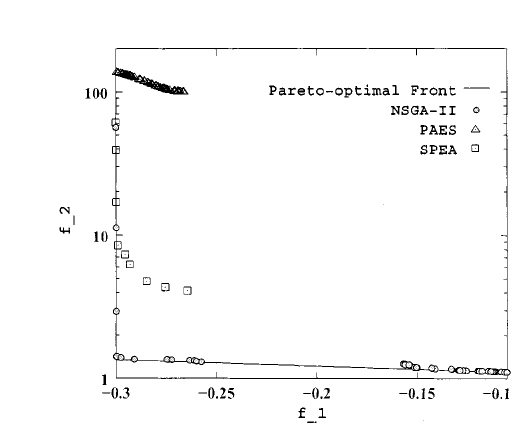

**Original caption:** Fig. 13. Obtained nondominated solutions with NSGA-II, PAES, and SPEA

**中文图注:** 图13。 使用 NSGA-II、PAES 和 SPEA 获得旋转问题的非支配解。在规定的变量范围内，我们通过为两个目标添加固定的大惩罚来阻止解决方案。

**Reading note:** 自动裁剪以图注为定位依据；正式引用图中数值前请对照原 PDF 检查裁剪边界与坐标轴。

**Source:** p.13 S187 · extraction confidence: low

**Original:** Fig. 13 shows the obtained solutions at the end of 500 generations using NSGA-II, PAES, and SPEA. It is observed that NSGA-II solutions are closer to the true front compared to solutions obtained by PAES and SPEA.

**中文:** 图 13 显示了使用 NSGA-II、PAES 和 SPEA 在 500 代结束时获得的解决方案。 可以看出，与 PAES 和 SPEA 获得的解决方案相比，NSGA-II 解决方案更接近真实前沿。

**Source:** p.13 S188 · extraction confidence: low

**Original:** The correlated parameter updates needed to progress toward the Pareto-optimal front makes this kind of problems difficult to solve. NSGA-II's elite-preserving operator along with the real-coded crossover and mutation operators is able to find some solutions close to the Pareto-optimal front [with resulting ].

**中文:** 走向帕累托最优所需的相关参数更新 前端使得这类问题很难解决。 NSGA-II 的精英保留算子以及实数编码的交叉和变异算子能够找到一些接近帕累托最优前沿的解决方案[结果]。

**Source:** p.13 S189 · extraction confidence: low

**Original:** This example problem demonstrates that one of the known difficulties (the linkage problem [11], [12]) of single-objective optimization algorithm can also cause difficulties in a multiobjective problem.

**中文:** 该示例问题表明，单目标优化算法的已知困难之一（联动问题[11]、[12]）也可能导致多目标问题出现困难。

**Source:** p.13 S190 · extraction confidence: low

**Original:** However, more systematic studies are needed to amply address the linkage issue in multiobjective optimization.

**中文:** 然而，需要更系统的研究来充分解决多目标优化中的联动问题。

**Source:** p.13 S191 · extraction confidence: low

**Original:** VI.

**中文:** 六．

**Source:** p.13 S192 · extraction confidence: low

**Original:** CONSTRAINT HANDLING In the past, the first author and his students implemented a penalty-parameterless constraint-handling approach for singleobjective optimization. Those studies [2], [6] have shown how a tournament selection based algorithm can be used to handle constraints in a population approach much better than a number of other existing constraint-handling approaches.

**中文:** 约束处理过去，第一作者和他的学生实现了一种用于单目标优化的惩罚无参数约束处理方法。 这些研究 [2]、[6] 已经展示了如何使用基于锦标赛选择的算法来处理总体方法中的约束，其效果比许多其他现有的约束处理方法要好得多。

**Source:** p.13 S193 · extraction confidence: low

**Original:** A similar approach can be introduced with the above NSGA-II for solving constrained multiobjective optimization problems. Proposed Constraint-Handling Approach (Constrained NSGA-II) This constraint-handling method uses the binary tournament selection, where two solutions are picked from the population and the better solution is chosen.

**中文:** 上述 NSGA-II 可以引入类似的方法来解决约束多目标优化问题。 提出的约束处理方法（受约束的 NSGA-II） 该约束处理方法使用二元锦标赛选择，其中从总体中挑选两个解决方案，并选择更好的解决方案。

**Source:** p.13 S194 · extraction confidence: low

**Original:** In the presence of constraints, each solution can be either feasible or infeasible. Thus, there may be at most three situations: 1) both solutions are feasible; 2) one is feasible and other is not; and 3) both are infeasible.

**中文:** 在存在约束的情况下，每个解决方案都可以是可行的或不可行的。 因此，最多可能存在三种情况：1）两种方案都可行； 2）一种可行，另一种不可行； 3) 两者都不可行。

**Source:** p.13 S195 · extraction confidence: low

**Original:** For single objective optimization, we used a simple rule for each case. Case 1) Choose the solution with better objective function value. Case 2) Choose the feasible solution.

**中文:** 对于单一目标优化，我们针对每种情况使用了一个简单的规则。 情况1）选择目标函数值较好的解。 情况2）选择可行的解决方案。

**Source:** p.13 S196 · extraction confidence: low

**Original:** Case 3) Choose the solution with smaller overall constraint violation. Since in no case constraints and objective function values are compared with each other, there is no need of having any penalty parameter, a matter that makes the proposed constraint-handling approach useful and attractive.

**中文:** 情况3）选择总体约束违规较小的解决方案。 由于在任何情况下约束和目标函数值都不会相互比较，因此不需要任何惩罚参数，这使得所提出的约束处理方法有用且有吸引力。

**Source:** p.13 S197 · extraction confidence: low

**Original:** In the context of multiobjective optimization, the latter two cases can be used as they are and the first case can be resolved by using the crowded-comparison operator as before.

**中文:** 在多目标优化的背景下，后两种情况可以按原样使用，第一种情况可以像以前一样使用拥挤比较算子来解决。

**Source:** p.13 S198 · extraction confidence: low

**Original:** To maintain the modularity in the procedures of NSGA-II, we simply modify the definition of domination between two solutions and . Definition 1: A solution is said to constrained-dominate a solution , if any of the following conditions is true.

**中文:** 为了保持 NSGA-II 程序中的模块化，我们只需修改两个解 和 之间的支配定义。 定义 1：如果满足以下任一条件，则称该解为受约束支配解 。

**Source:** p.13 S199 · extraction confidence: low

**Original:** 1) Solution is feasible and solution is not. 2) Solutions and are both infeasible, but solution has a smaller overall constraint violation. 3) Solutions and are feasible and solution dominates solution .

**中文:** 1）解可行，解不可行。 2) 解 和 均不可行，但解有 较小的整体约束违规。 3) 解 和 是可行的且解占主导地位 解决方案。

**Source:** p.13 S200 · extraction confidence: low

**Original:** The effect of using this constrained-domination principle is that any feasible solution has a better nondomination rank than any infeasible solution. All feasible solutions are ranked according to their nondomination level based on the objective function values.

**中文:** 使用这种约束支配原则的效果是，任何可行的解决方案都比任何不可行的解决方案具有更好的非支配等级。 所有可行的解决方案根据目标函数值根据其非支配级别进行排序。

**Source:** p.13 S201 · extraction confidence: low

**Original:** However, among two infeasible solutions, the solution with a smaller constraint violation has a better rank. Moreover, this modification in the nondomination principle does not change the computational complexity of NSGA-II.

**中文:** 然而，在两个不可行解中，约束违反较小的解具有更好的排名。 而且，这种对非支配原则的修改并没有改变NSGA-II的计算复杂度。

**Source:** p.13 S202 · extraction confidence: low

**Original:** The rest of the NSGA-II procedure as described earlier can be used as usual. The above constrained-domination definition is similar to that suggested by Fonseca and Fleming [9].

**中文:** 前面描述的 NSGA-II 程序的其余部分可以照常使用。 上述约束支配定义与 Fonseca 和 Fleming [9] 提出的定义类似。

**Source:** p.13 S203 · extraction confidence: low

**Original:** The only difference is in the way domination is defined for the infeasible solutions. In the above definition, an infeasible solution having a larger overall constraint-violation are classified as members of a larger nondomination level.

**中文:** 唯一的区别在于为不可行的解决方案定义支配的方式。 在上述定义中，具有较大总体约束违反的不可行解被分类为较大非支配级别的成员。

**Source:** p.13 S204 · extraction confidence: low

**Original:** On the other hand, in [9], infeasible solutions violating different constraints are classified as members of the same nondominated front. Thus, one infeasible solution violating a constraint marginally will be placed in the same nondominated level with another solution violating a different constraint to a large extent.

**中文:** 另一方面，在[9]中，违反不同约束的不可行解被归类为同一非支配阵线的成员。 因此，一个稍微违反约束的不可行解将与另一个很大程度上违反不同约束的解置于相同的非支配级别。

**Source:** p.13 S205 · extraction confidence: low

**Original:** This may cause an algorithm to wander in the infeasible search region for more generations before reaching the feasible region through constraint boundaries. Moreover, since Fonseca–Fleming's approach requires domination checks with the constraint-violation values, the proposed approach of this paper is computationally less expensive and is simpler.

**中文:** 这可能会导致算法 在通过约束边界到达可行区域之前，在不可行搜索区域中徘徊更多代。 此外，由于丰塞卡-弗莱明的方法需要对违反约束的值进行支配检查，因此本文提出的方法在计算上更便宜并且更简单。

**Source:** p.13 S206 · extraction confidence: low

**Original:** Ray–Tai–Seow's Constraint-Handling Approach Ray et al. [17] suggested a more elaborate constraint-handling technique, where constraint violations of all constraints are not simply summed together.

**中文:** Ray–Tai–Seow 的约束处理方法 Ray 等人。 [17]提出了一种更复杂的约束处理技术，其中所有约束的约束违规并不是简单地总结在一起。

**Source:** p.13 S207 · extraction confidence: low

**Original:** Instead, a nondomination check of constraint violations is also made. We give an outline of this procedure here. Authorized licensed use limited to: Beijing University of Chemical Technology.

**中文:** 相反，还会对约束违规进行非支配检查。 我们在此概述此过程。 授权许可使用仅限于：北京化工大学。

**Source:** p.13 S208 · extraction confidence: medium

**Original:** Downloaded on May 12,2026 at 10:49:15 UTC from IEEE Xplore. Restrictions apply. DEB et al.: A FAST AND ELITIST MULTIOBJECTIVE GA: NSGA-II 193 TABLE V CONSTRAINED TEST PROBLEMS USED IN THIS STUDY All objective functions are to be minimized.

**中文:** 于 2026 年 5 月 12 日 10:49:15 UTC 从 IEEE Xplore 下载。 存在限制。 DEB 等人：快速且精英的多目标 GA：NSGA-II 193 本研究中使用的表 V 约束测试问题 所有目标函数均应最小化。

**Source:** p.13 S209 · extraction confidence: low

**Original:** Three different nondominated rankings of the population are first performed. The first ranking is performed using objective function values and the resulting ranking is stored in a -dimensional vector .

**中文:** 首先对总体进行三种不同的非支配排序。 使用目标函数值执行第一次排序，并将所得排序存储在 维向量 中。

## Page 14

**Source:** p.14 S210 · extraction confidence: low

**Original:** The second ranking is performed using only the constraint violation values of all ( of them) constraints and no objective function information is used. Thus, constraint violation of each constraint is used a criterion and a nondomination classification of the population is performed with the constraint violation values.

**中文:** 仅使用所有（其中）约束的约束违反值来执行第二排序，并且不使用目标函数信息。 因此，每个约束的约束违反被用作标准，并且利用约束违反值执行总体的非支配分类。

**Source:** p.14 S211 · extraction confidence: low

**Original:** Notice that for a feasible solution all constraint violations are zero. Thus, all feasible solutions have a rank 1 in . The third ranking is performed on a combination of objective functions and constraint-violation values [a total of values].

**中文:** 请注意，对于一个可行的 解决方案所有约束违规均为零。 因此，所有可行的解决方案在 中的等级为 1。 第三次排名是根据目标函数和约束违反值[总值]的组合进行的。

**Source:** p.14 S212 · extraction confidence: low

**Original:** This produces the ranking . Although objective function values and constraint violations are used together, one nice aspect of this algorithm is that there is no need for any penalty parameter.

**中文:** 这样就产生了排名。 尽管目标函数值和约束违规一起使用，但该算法的一个优点是不需要任何惩罚参数。

**Source:** p.14 S213 · extraction confidence: low

**Original:** In the domination check, criteria are compared individually, thereby eliminating the need of any penalty parameter. Once these rankings are over, all feasible solutions having the best rank in are chosen for the new population.

**中文:** 在支配检查中，标准是单独比较的，从而消除了任何惩罚参数的需要。 当这些排名结束后， 为新群体选择所有具有最佳排名的可行解决方案。

**Source:** p.14 S214 · extraction confidence: low

**Original:** If more population slots are available, they are created from the remaining solutions systematically. By giving importance to the ranking in in the selection operator and by giving importance to the ranking in in the crossover operator, the investigators laid out a systematic multiobjective GA, which also includes a niche-preserving operator.

**中文:** 如果有更多的人口槽位可用，则会系统地从剩余的解决方案中创建它们。 通过重视选择算子中的排名和交叉算子中的排名，研究人员设计了一个系统的多目标遗传算法，其中还包括一个利基保留算子。

**Source:** p.14 S215 · extraction confidence: low

**Original:** For details, readers may refer to [17]. Although the investigators did not compare their algorithm with any other method, they showed the working of this constraint-handling method on a number of engineering design problems.

**中文:** 详细内容读者可以参考[17]。 尽管研究人员没有将他们的算法与任何其他方法进行比较，但他们展示了这种约束处理方法在许多工程设计问题上的工作原理。

**Source:** p.14 S216 · extraction confidence: low

**Original:** However, since nondominated sorting of three different sets of criteria are required and the algorithm introduces many different operators, it remains to be investigated how it performs on more complex problems, particularly from the point of view of computational burden associated with the method.

**中文:** 然而，由于需要对三组不同的标准进行非支配排序，并且该算法引入了许多不同的运算符，因此仍有待研究它如何在更复杂的问题上执行，特别是从与该方法相关的计算负担的角度来看。

**Source:** p.14 S217 · extraction confidence: low

**Original:** In the following section, we choose a set of four problems and compare the simple constrained NSGA-II with the Ray–Tai–Seow's method. Simulation Results We choose four constrained test problems (see Table V) that have been used in earlier studies.

**中文:** 在下一节中，我们选择一组四个问题，并将简单约束 NSGA-II 与 Ray–Tai–Seow 方法进行比较。 模拟结果我们选择了早期研究中使用的四个约束测试问题（见表V）。

**Source:** p.14 S218 · extraction confidence: low

**Original:** In the first problem, a part of the unconstrained Pareto-optimal region is not feasible. Thus, the resulting constrained Pareto-optimal region is a concatenation of the first constraint boundary and some part of the unconstrained Pareto-optimal region.

**中文:** 在第一个问题中，无约束帕累托最优区域的一部分是不可行的。 因此，所得到的受约束帕累托最优区域是第一约束边界和无约束帕累托最优区域的某些部分的串联。

**Source:** p.14 S219 · extraction confidence: low

**Original:** The second problem SRN was used in the original study of NSGA [20]. Here, the constrained Pareto-optimal set is a subset of the unconstrained Pareto-optimal set. The third problem TNK was suggested by Tanaka et al. [21] and has a discontinuous Pareto-optimal region, falling entirely on the first constraint boundary.

**中文:** 第二个问题SRN是 用于 NSGA 的原始研究[20]。 这里，受约束的帕累托最优集是无约束的帕累托最优集的子集。 第三个问题TNK是Tanaka等人提出的。 [21]并且具有不连续的帕累托最优区域，完全落在第一约束边界上。

**Source:** p.14 S220 · extraction confidence: low

**Original:** In the next section, we show the constrained Pareto-optimal region for each of the above problems. The fourth problem WATER is a five-objective and seven-constraint problem, attempted to solve in [17].

**中文:** 在下一节中，我们将展示上述每个问题的约束帕累托最优区域。 第四个问题 WATER 是一个五目标七约束问题，在[17]中试图解决。

**Source:** p.14 S221 · extraction confidence: low

**Original:** With five objectives, it is difficult to discuss the effect of the constraints on the unconstrained Pareto-optimal region. In the next section, we show all or ten pairwise plots of obtained nondominated solutions.

**中文:** 由于有五个目标，很难讨论约束对无约束帕累托最优区域的影响。 在下一节中，我们将显示所获得的非支配解的全部或十对图。

**Source:** p.14 S222 · extraction confidence: low

**Original:** We apply real-coded NSGA-II here. In all problems, we use a population size of 100, distribution indexes for real-coded crossover and mutation operators of 20 and 100, respectively, and run NSGA-II (real coded) with the proposed constraint-handling technique and with Ray–Tai–Seow's constraint-handling algorithm [17] for a maximum of 500 generations.

**中文:** 我们在这里应用实编码的 NSGA-II。 在所有问题中，我们使用的种群规模为 100，实数编码交叉和变异算子的分布指数分别为 20 和 100，并使用所提出的约束处理技术和 Ray–Tai–Seow 的约束处理算法 [17] 运行 NSGA-II（实数编码），最多 500 代。

## Page 15

**Source:** p.15 S223 · extraction confidence: low

**Original:** We choose this rather large number of generations to investigate if the spread in solutions Authorized licensed use limited to: Beijing University of Chemical Technology.

**中文:** 我们选择这个相当大的代数来调查解决方案的传播授权许可使用是否仅限于：北京化工大学。

**Source:** p.15 S224 · extraction confidence: high

**Original:** Downloaded on May 12,2026 at 10:49:15 UTC from IEEE Xplore. Restrictions apply.

**中文:** 于 2026 年 5 月 12 日 10:49:15 UTC 从 IEEE Xplore 下载。 存在限制。

**Source:** p.15 S225 · extraction confidence: medium

**Original:** 194 IEEE TRANSACTIONS ON EVOLUTIONARY COMPUTATION, VOL. 6, NO. 2, APRIL 2002

**中文:** 194 IEEE 进化计算交易，卷。 6、没有。 2、2002 年 4 月

**Source:** p.15 S226 · extraction confidence: low

**Original:** Fig. 14. Obtained nondominated solutions with NSGA-II on the constrained problem CONSTR. Fig. 15. Obtained nondominated solutions with Ray-Tai-Seow's algorithm on the constrained problem CONSTR.

**中文:** 图14。 使用 NSGA-II 在约束问题 CONSTR 上获得非支配解。 图 15. 利用 Ray-Tai-Seow 算法对约束问题 CONSTR 获得非支配解。

### Fig. 14. 图14。 使用 NSGA-II 在约束问题 CONSTR 上获得非支配解。 图 15. 利用 Ray-Tai-Seow 算法对约束问题 CONSTR 获得非支配解。

**Placed near:** p.13 S226  
**Source:** p.13 S226  
**Crop confidence:** approximate-object-bounded

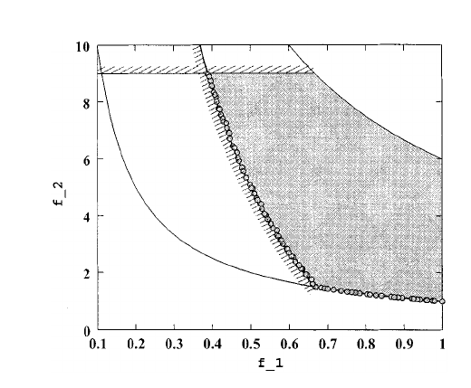

**Original caption:** Fig. 14. Obtained nondominated solutions with NSGA-II on the constrained Fig. 16. Obtained nondominated solutions with NSGA-II on the constrained

**中文图注:** 图14。 使用 NSGA-II 在约束问题 CONSTR 上获得非支配解。 图 15. 利用 Ray-Tai-Seow 算法对约束问题 CONSTR 获得非支配解。

**Reading note:** 自动裁剪以图注为定位依据；正式引用图中数值前请对照原 PDF 检查裁剪边界与坐标轴。

### Fig. 15. 图14。 使用 NSGA-II 在约束问题 CONSTR 上获得非支配解。 图 15. 利用 Ray-Tai-Seow 算法对约束问题 CONSTR 获得非支配解。

**Placed near:** p.13 S226  
**Source:** p.13 S226  
**Crop confidence:** approximate-object-bounded

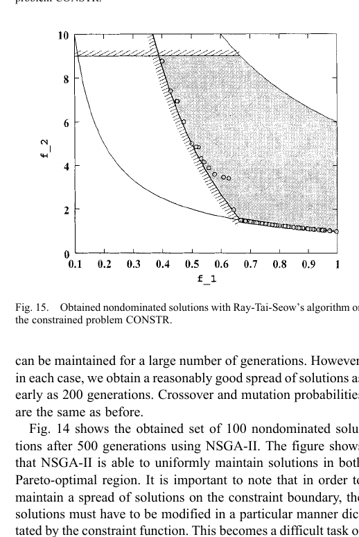

**Original caption:** Fig.15. ObtainednondominatedsolutionswithRay-Tai-Seow’salgorithmon

**中文图注:** 图14。 使用 NSGA-II 在约束问题 CONSTR 上获得非支配解。 图 15. 利用 Ray-Tai-Seow 算法对约束问题 CONSTR 获得非支配解。

**Reading note:** 自动裁剪以图注为定位依据；正式引用图中数值前请对照原 PDF 检查裁剪边界与坐标轴。

**Source:** p.15 S227 · extraction confidence: low

**Original:** can be maintained for a large number of generations. However, in each case, we obtain a reasonably good spread of solutions as early as 200 generations. Crossover and mutation probabilities are the same as before.

**中文:** 可以维持很多代。 然而，在每种情况下，我们早在 200 代就获得了相当好的解决方案传播。 交叉和变异概率与以前相同。

**Source:** p.15 S228 · extraction confidence: low

**Original:** Fig. 14 shows the obtained set of 100 nondominated solutions after 500 generations using NSGA-II. The figure shows that NSGA-II is able to uniformly maintain solutions in both Pareto-optimal region.

**中文:** 图 14 显示了使用 NSGA-II 进行 500 代后获得的 100 个非支配解集。 该图表明 NSGA-II 能够在两个 Pareto 最优区域中一致地维持解。

**Source:** p.15 S229 · extraction confidence: low

**Original:** It is important to note that in order to maintain a spread of solutions on the constraint boundary, the solutions must have to be modified in a particular manner dictated by the constraint function.

**中文:** 值得注意的是，为了在约束边界上保持解的扩展，解必须以约束函数规定的特定方式进行修改。

**Source:** p.15 S230 · extraction confidence: low

**Original:** This becomes a difficult task of any search operator. Fig. 15 shows the obtained solutions using Ray-Tai-Seow's algorithm after 500 generations. It is clear that NSGA-II performs better than Ray–Tai–Seow's algorithm in terms of converging to the true Pareto-optimal front and also in terms of maintaining a diverse population of nondominated solutions.

**中文:** 这对任何搜索操作员来说都是一项艰巨的任务。 图 15 显示了使用 Ray-Tai-Seow 算法经过 500 代后获得的解。 很明显， NSGA-II 在收敛到真正的帕累托最优前沿以及维持非支配解的多样化群体方面比 Ray–Tai–Seow 算法表现得更好。

**Source:** p.15 S231 · extraction confidence: low

**Original:** Next, we consider the test problem SRN. Fig. 16 shows the nondominated solutions after 500 generations using NSGA-II. Fig. 16. Obtained nondominated solutions with NSGA-II on the constrained problem SRN.

**中文:** 接下来，我们考虑测试问题SRN。 图 16 显示了使用 NSGA-II 500 代后的非支配解。 图 16. 使用 NSGA-II 在约束问题 SRN 上获得非支配解。

**Source:** p.15 S232 · extraction confidence: low

**Original:** Fig. 17. Obtained nondominated solutions with Ray–Tai–Seow's algorithm on the constrained problem SRN. The figure shows how NSGA-II can bring a random population on the Pareto-optimal front.

**中文:** 图 17. 使用 Ray–Tai–Seow 算法在约束问题 SRN 上获得非支配解。 该图显示了 NSGA-II 如何将随机群体带到帕累托最优前沿。

**Source:** p.15 S233 · extraction confidence: low

**Original:** Ray–Tai–Seow's algorithm is also able to come close to the front on this test problem (Fig. 17). Figs. 18 and 19 show the feasible objective space and the obtained nondominated solutions with NSGA-II and Ray–Tai–Seow's algorithm.

**中文:** Ray–Tai–Seow 的算法在这个测试问题上也能够接近领先（图 17）。 无花果。 图 18 和 19 显示了可行的目标空间以及使用 NSGA-II 和 Ray–Tai–Seow 算法获得的非支配解。

## Page 16

**Source:** p.16 S234 · extraction confidence: low

**Original:** Here, the Pareto-optimal region is discontinuous and NSGA-II does not have any difficulty in finding a wide spread of solutions over the true Pareto-optimal region. Although Ray–Tai–Seow's algorithm found a number of solutions on the Pareto-optimal front, there exist many infeasible solutions even after 500 generations.

**中文:** 这里，帕累托最优区域是不连续的，并且 NSGA-II 在真正的帕累托最优区域上找到广泛的解决方案没有任何困难。 尽管Ray-Tai-Seow的算法在Pareto最优前沿找到了许多解，但即使在500代之后仍然存在许多不可行的解。

**Source:** p.16 S235 · extraction confidence: low

**Original:** In order to demonstrate the working of Fonseca–Fleming's constraint-handling strategy, we implement it with NSGA-II and apply on TNK. Fig. 20 shows 100 population members at the end of 500 generations and with identical parameter setting as used in Fig. 18.

**中文:** 为了证明丰塞卡-弗莱明的约束汉-的工作原理 DL策略，我们用NSGA-II来实现，并应用在TNK上。 图 20 显示了 100 名人口成员 500 代，参数设置与中使用的相同 图 18.

**Source:** p.16 S236 · extraction confidence: low

**Original:** Both these figures demonstrate that the proposed and Fonseca–Fleming's constraint-handling strategies work well with NSGA-II. Authorized licensed use limited to: Beijing University of Chemical Technology.

**中文:** 这两个图都表明，所提出的约束处理策略和 Fonseca-Fleming 的约束处理策略与 NSGA-II 配合良好。 授权许可使用仅限于：北京化工大学。

**Source:** p.16 S237 · extraction confidence: medium

**Original:** Downloaded on May 12,2026 at 10:49:15 UTC from IEEE Xplore. Restrictions apply. DEB et al.: A FAST AND ELITIST MULTIOBJECTIVE GA: NSGA-II 195 Fig. 18. Obtained nondominated solutions with NSGA-II on the constrained problem TNK.

**中文:** 于 2026 年 5 月 12 日 10:49:15 UTC 从 IEEE Xplore 下载。 存在限制。 DEB 等人：快速且精英的多目标 GA：NSGA-II 195 图 18。 使用 NSGA-II 在约束问题 TNK 上获得非支配解。

### Fig. 18. 于 2026 年 5 月 12 日 10:49:15 UTC 从 IEEE Xplore 下载。 存在限制。 DEB 等人：快速且精英的多目标 GA：NSGA-II 195 图 1

**Placed near:** p.14 S237  
**Source:** p.14 S237  
**Crop confidence:** approximate-object-bounded

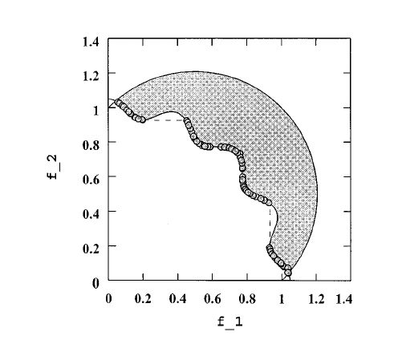

**Original caption:** Fig. 18. Obtained nondominated solutions with NSGA-II on the constrained

**中文图注:** 于 2026 年 5 月 12 日 10:49:15 UTC 从 IEEE Xplore 下载。 存在限制。 DEB 等人：快速且精英的多目标 GA：NSGA-II 195 图 18。 使用 NSGA-II 在约束问题 TNK 上获得非支配解。

**Reading note:** 自动裁剪以图注为定位依据；正式引用图中数值前请对照原 PDF 检查裁剪边界与坐标轴。

**Source:** p.16 S238 · extraction confidence: low

**Original:** Fig. 19. Obtained nondominated solutions with Ray–Tai–Seow's algorithm on the constrained problem TNK. Ray et al. [17] have used the problem WATER in their study. They normalized the objective functions in the following manner: Since there are five objective functions in the problem WATER, we observe the range of the normalized objective function values of the obtained nondominated solutions.

**中文:** 图 19. 利用 Ray–Tai–Seow 算法对约束问题 TNK 获得非支配解。 雷等人。 [17]在他们的研究中使用了水问题。 他们通过以下方式对目标函数进行归一化：由于问题 WATER 中有五个目标函数，我们观察所获得的非支配解的归一化目标函数值的范围。

### Fig. 19. 图 19. 利用 Ray–Tai–Seow 算法对约束问题 TNK 获得非支配解。 雷等人。 [17]在他们的研究中使用了水问题。 他们通过以下方式对目标函数进行归一化：由于问题 

**Placed near:** p.14 S238  
**Source:** p.14 S238  
**Crop confidence:** approximate-caption-not-located

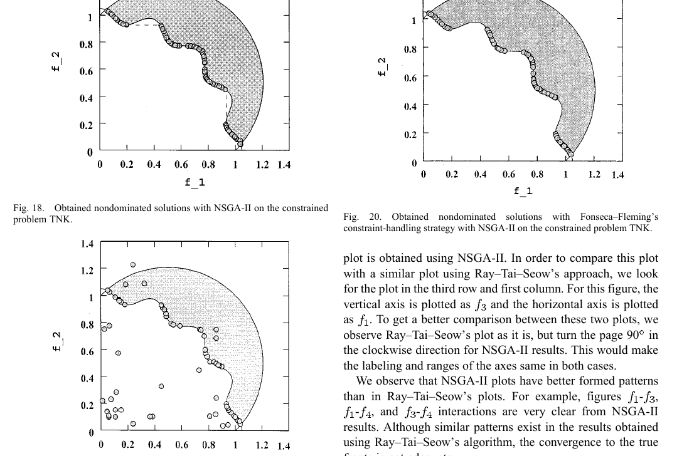

**Original caption:** Fig.19. ObtainednondominatedsolutionswithRay–Tai–Seow’salgorithmon VII. CONCLUSION

**中文图注:** 图 19. 利用 Ray–Tai–Seow 算法对约束问题 TNK 获得非支配解。 雷等人。 [17]在他们的研究中使用了水问题。 他们通过以下方式对目标函数进行归一化：由于问题 WATER 中有五个目标函数，我们观察所获得的非支配解的归一化目标函数值的范围。

**Reading note:** 自动裁剪以图注为定位依据；正式引用图中数值前请对照原 PDF 检查裁剪边界与坐标轴。

**Source:** p.16 S239 · extraction confidence: low

**Original:** Table VI shows the comparison with Ray–Tai–Seow's algorithm. In most objective functions, NSGA-II has found a better spread of solutions than Ray–Tai–Seow's approach. In order to show the pairwise interactions among these five normalized objective functions, we plot all or ten interactions in Fig. 21 for both algorithms.

**中文:** 表六显示了与 Ray–Tai–Seow 算法的比较。 在大多数目标函数中，NSGA-II 发现了比 Ray-Tai-Seow 方法更好的解决方案。 为了显示这五个归一化目标之间的成对相互作用 对于这两种算法，我们在图 21 中绘制了所有或十个交互作用。

**Source:** p.16 S240 · extraction confidence: low

**Original:** NSGA-II results are shown in the upper diagonal portion of the figure and the Ray–Tai–Seow's results are shown in the lower diagonal portion. The axes of any plot can be obtained by looking at the corresponding diagonal boxes and their ranges.

**中文:** NSGA-II 结果显示在图的上对角部分，Ray-Tai-Seow 的结果显示在下对角部分。 任何图的轴都可以通过查看相应的对角线框及其范围来获得。

**Source:** p.16 S241 · extraction confidence: low

**Original:** For example, the plot at the first row and third column has its vertical axis as and horizontal axis as . Since this plot belongs in the upper side of the diagonal, this Fig. 20.

**中文:** 例如，第一行第三列的图的纵轴为 ，横轴为 。 由于该图属于对角线的上侧，因此图 20.

**Source:** p.16 S242 · extraction confidence: low

**Original:** Obtained nondominated solutions with Fonseca–Fleming's constraint-handling strategy with NSGA-II on the constrained problem TNK. plot is obtained using NSGA-II. In order to compare this plot with a similar plot using Ray–Tai–Seow's approach, we look for the plot in the third row and first column.

**中文:** 利用 NSGA-II 的 Fonseca-Fleming 约束处理策略在约束问题 TNK 上获得非支配解。 图是使用 NSGA-II 获得的。 为了将此图与使用 Ray–Tai–Seow 方法的类似图进行比较，我们在第三行和第一列中查找该图。

**Source:** p.16 S243 · extraction confidence: low

**Original:** For this figure, the vertical axis is plotted as and the horizontal axis is plotted as . To get a better comparison between these two plots, we observe Ray–Tai–Seow's plot as it is, but turn the page 90 in the clockwise direction for NSGA-II results.

**中文:** 对于该图，垂直轴绘制为 ，水平轴绘制为 。 为了更好地比较这两个图，我们按原样观察 Ray-Tai-Seow 的图，但将 NSGA-II 结果顺时针方向翻到第 90 页。

**Source:** p.16 S244 · extraction confidence: low

**Original:** This would make the labeling and ranges of the axes same in both cases. We observe that NSGA-II plots have better formed patterns than in Ray–Tai–Seow's plots. For example, figures - , - , and - interactions are very clear from NSGA-II

**中文:** 这将使两种情况下轴的标签和范围相同。 我们观察到 NSGA-II 图比 Ray-Tai-Seow 图具有更好的形成模式。 例如，NSGA-II 中的数字 - 、 - 和 - 交互作用非常清晰

**Source:** p.16 S245 · extraction confidence: low

**Original:** results. Although similar patterns exist in the results obtained

**中文:** 结果。尽管获得的结果中存在类似的模式

**Source:** p.16 S246 · extraction confidence: low

**Original:** using Ray–Tai–Seow's algorithm, the convergence to the true fronts is not adequate.

**中文:** 使用 Ray-Tai-Seow 算法，无法充分收敛到真实前沿。

**Source:** p.16 S247 · extraction confidence: low

**Original:** VII.

**中文:** 七．

**Source:** p.16 S248 · extraction confidence: low

**Original:** CONCLUSION We have proposed a computationally fast and elitist MOEA based on a nondominated sorting approach.

**中文:** 结论 我们提出了一种基于非支配排序方法的计算快速且精英的 MOEA。

**Source:** p.16 S249 · extraction confidence: low

**Original:** On nine different difficult test problems borrowed from the literature, the proposed NSGA-II was able to maintain a better spread of solutions and converge better in the obtained nondominated front compared to two other elitist MOEAs—PAES and SPEA.

**中文:** 在从文献中借用的九个不同的困难测试问题上，与其他两种精英主义 MOEA（PAES 和 SPEA）相比，所提出的 NSGA-II 能够保持更好的解分布，并在获得的非支配前沿更好地收敛。

**Source:** p.16 S250 · extraction confidence: low

**Original:** However, one problem, PAES, was able to converge closer to the true Pareto-optimal front. PAES maintains diversity among solutions by controlling crowding of solutions in a deterministic and prespecified number of equal-sized cells in the search space.

**中文:** 然而，有一个问题，PAES，能够收敛到更接近真实的情况。 帕累托最优前沿。 PAES 通过控制搜索空间中确定性且预先指定数量的相等大小单元中的解决方案拥挤来保持解决方案之间的多样性。

**Source:** p.16 S251 · extraction confidence: low

**Original:** In that problem, it is suspected that such a deterministic crowding coupled with the effect of mutation-based approach has been beneficial in converging near the true front compared to the dynamic and parameterless crowding approach used in NSGA-II and SPEA.

**中文:** 在该问题中，与 NSGA-II 和 SPEA 中使用的动态无参数拥挤方法相比，我们怀疑这种确定性拥挤加上基于突变的方法的效果有利于在真实前沿附近收敛。

**Source:** p.16 S252 · extraction confidence: low

**Original:** However, the diversity preserving mechanism used in NSGA-II is found to be the best among the three approaches studied here. On a problem having strong parameter interactions, NSGA-II has been able to come closer to the true front than the other two approaches, but the important matter is that all three approaches faced difficulties in solving this so-called highly epistatic problem.

**中文:** 然而，NSGA-II 中使用的多样性保留机制被发现是三种方法中最好的 在这里学习。 在参数交互作用较强的问题上，NSGA-II 能够比其他两种方法更接近真实前沿，但重要的是，这三种方法在解决这个所谓的高度上位问题时都面临困难。

**Source:** p.16 S253 · extraction confidence: low

**Original:** Although this has been a matter of ongoing Authorized licensed use limited to: Beijing University of Chemical Technology. Downloaded on May 12,2026 at 10:49:15 UTC from IEEE Xplore.

**中文:** 尽管这是一个持续的问题，授权许可使用仅限于：北京化工大学。 于 2026 年 5 月 12 日 10:49:15 UTC 从 IEEE Xplore 下载。

**Source:** p.16 S254 · extraction confidence: high

**Original:** Restrictions apply.

**中文:** 存在限制。

**Source:** p.16 S255 · extraction confidence: low

**Original:** 196 IEEE TRANSACTIONS ON EVOLUTIONARY COMPUTATION, VOL. 6, NO. 2, APRIL 2002

**中文:** 196 IEEE 进化计算交易，卷。 6、没有。 2、2002 年 4 月

**Source:** p.16 S256 · extraction confidence: low

**Original:** TABLE VI LOWER AND UPPER BOUNDS OF THE OBJECTIVE FUNCTION VALUES OBSERVED IN THE OBTAINED NONDOMINATED SOLUTIONS Fig. 21. Upper diagonal plots are for NSGA-II and lower diagonal plots are for Ray–Tai–Seow's algorithm.

**中文:** 表 VI 在获得的非支配解中观察到的目标函数值的下限和上限（图 21）。 上对角线图适用于 NSGA-II，下对角线图适用于 Ray-Tai-Seow 算法。

### Fig. 21. 表 VI 在获得的非支配解中观察到的目标函数值的下限和上限（图 21）。 上对角线图适用于 NSGA-II，下对角线图适用于 Ray-Tai-Seow 算法。

**Placed near:** p.15 S256  
**Source:** p.15 S256  
**Crop confidence:** approximate-object-bounded

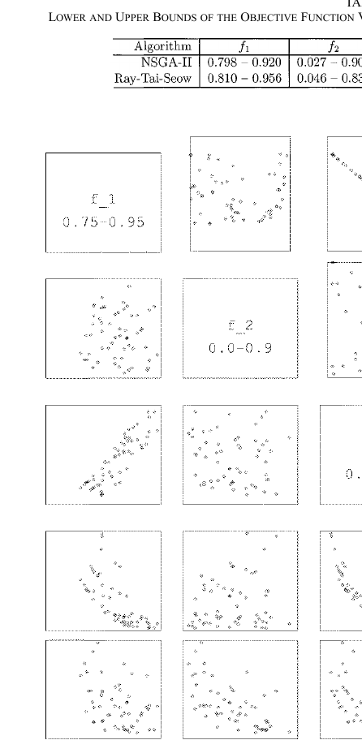

**Original caption:** Fig. 21. Upper diagonal plots are for NSGA-II and lower diagonal plots are for Ray–Tai–Seow’s algorithm. Compare (i; j) plot (Ray–Tai–Seow’s algorithm

**中文图注:** 表 VI 在获得的非支配解中观察到的目标函数值的下限和上限（图 21）。 上对角线图适用于 NSGA-II，下对角线图适用于 Ray-Tai-Seow 算法。

**Reading note:** 自动裁剪以图注为定位依据；正式引用图中数值前请对照原 PDF 检查裁剪边界与坐标轴。

**Source:** p.16 S257 · extraction confidence: low

**Original:** Compare (i; j) plot (Ray–Tai–Seow's algorithm with i > j) with (j; i) plot (NSGA-II). Label and ranges used for each axis are shown in the diagonal boxes. research in single-objective EA studies, this paper shows that highly epistatic problems may also cause difficulties to MOEAs.

**中文:** 将 (i; j) 图（Ray–Tai–Seow 算法，i > j）与 (j; i) 图 (NSGA-II) 进行比较。 每个轴使用的标签和范围显示在对角框中。 在单目标 EA 研究中，本文表明高度上位问题也可能给 MOEA 带来困难。

**Source:** p.16 S258 · extraction confidence: low

**Original:** More importantly, researchers in the field should consider such epistatic problems for testing a newly developed algorithm for multiobjective optimization. We have also proposed a simple extension to the definition of dominance for constrained multiobjective optimization.

**中文:** 更重要的是，该领域的研究人员应该考虑此类上位问题来测试新开发的多目标优化算法。 我们还提出了对约束多目标优化的优势定义的简单扩展。

**Source:** p.16 S259 · extraction confidence: low

**Original:** Although this new definition can be used with any other MOEAs, the real-coded NSGA-II with this definition has been shown to solve four different problems much better than another recently-proposed constraint-handling approach.

**中文:** 尽管这个新定义可以与任何其他 MOEA 一起使用，但具有该定义的实编码 NSGA-II 已被证明可以比最近提出的另一种约束处理方法更好地解决四个不同的问题。

**Source:** p.16 S260 · extraction confidence: low

**Original:** With the properties of a fast nondominated sorting procedure, an elitist strategy, a parameterless approach and a simple yet efficient constraint-handling method, NSGA-II, should find increasing attention and applications in the near future.

**中文:** 凭借快速非支配排序过程、精英策略、无参数方法和简单而有效的约束处理方法 NSGA-II 的特性，NSGA-II 在不久的将来应该会受到越来越多的关注和应用。

## 阅读提示 / Critical reading notes

- 本文件是对项目既有译文的结构化重建，不等同于出版级人工翻译。
- 每个文本块均保留源 PDF 页码与稳定 ID；后续问答请使用 `p.X SYYY` 定位。
- 公式、上下标和双栏阅读顺序可能受 PDF 文本层影响；低置信度块必须回看原 PDF。
- 图表裁剪均保留置信度标签；标记为 approximate 的图表需要人工视觉复核。
